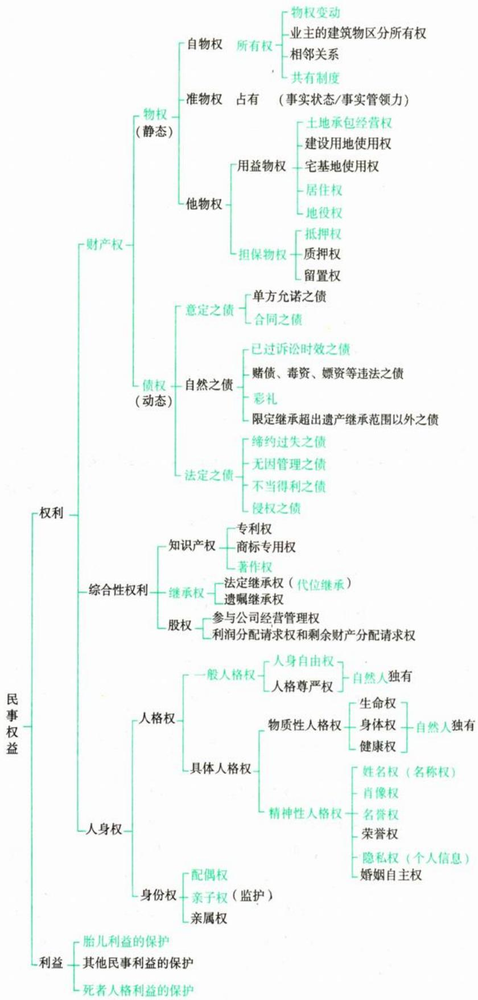

flowchart

```mermaid
graph TD
    A["民事权益"] --> B["权利"]
    A --> C["综合性权利"]
    A --> D["人身权"]
    A --> E["利益"]

    B --> B1["财产权"]
    B1 --> B1a["物权 (静态)"]
    B1 --> B1b["自物权"]
    B1 --> B1c["所有权"]
    B1 --> B1d["物权变动"]
    B1 --> B1e["业主的建筑物区分所有权"]
    B1 --> B1f["相邻关系"]
    B1 --> B1g["共有制度"]

    B --> B2["债权 (动态)"]
    B2 --> B2a["意定之债"]
    B2 --> B2b["单方允诺之债"]
    B2 --> B2c["合同之债"]

    B2 --> B2d["自然之债"]
    B2d --> B2d1["已过诉讼时效之债"]
    B2d --> B2d2["赌债、毒资、嫖资等违法之债"]
    B2d --> B2d3["彩礼"]
    B2d --> B2d4["限定继承超出遗产继承范围以外之债"]

    B2 --> B2e["法定之债"]
    B2e --> B2e1["缔约过失之债"]
    B2e --> B2e2["无因管理之债"]
    B2e --> B2e3["不当得利之债"]
    B2e --> B2e4["侵权之债"]

    C --> C1["综合性权利"]
    C1 --> C1a["知识产权"]
    C1 --> C1b["继承权"]
    C1 --> C1c["股权"]
    C1a --> C1a1["专利权"]
    C1a --> C1a2["商标专用权"]
    C1a --> C1a3["著作权"]

    C --> C2["人格权"]
    C2 --> C2a["一般人格权"]
    C2 --> C2b["物质性人格权"]
    C2 --> C2c["具体人格权"]

    C2a --> C2a1["人身自由权"]
    C2a --> C2a2["人格尊严权"]

    C2b --> C2b1["生命权"]
    C2b --> C2b2["身体权"]
    C2b --> C2b3["健康权"]

    C2c --> C2c1["姓名权（名称权）"]
    C2c --> C2c2["肖像权"]
    C2c --> C2c3["名誉权"]
    C2c --> C2c4["荣誉权"]

    C2c --> C2c5["隐私权（个人信息）"]
    C2c --> C2c6["婚姻自主权"]

    D --> D1["胎儿利益的保护"]
    D --> D2["其他民事利益的保护"]
    D --> D3["死者人格利益的保护"]

    E --> E1["利益"]

    style A fill:#f9f,stroke:#333
```

(民法学体系框架图)

第一部分：民事综合备考方法论
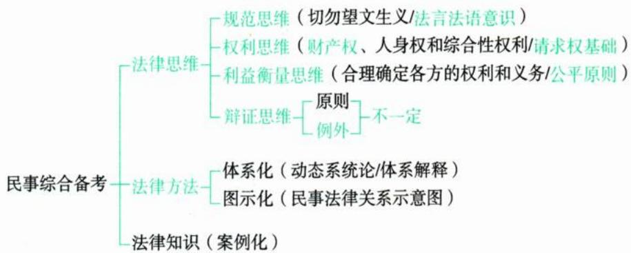

flowchart

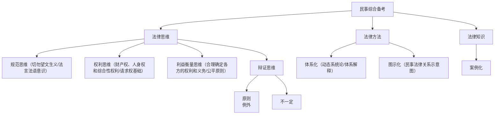
```mermaid
graph TD
    A["民事综合备考"] --> B["法律思维"]
    A --> C["法律方法"]
    A --> D["法律知识"]
    
    B --> E["规范思维（切勿望文生义/法言法语意识）"]
    B --> F["权利思维（财产权、人身权和综合性权利/请求权基础）"]
    B --> G["利益衡量思维（合理确定各方的权利和义务/公平原则）"]
    B --> H["辩证思维"]
    H --> I["原则\n例外"]
    H --> J["不一定"]
    
    C --> K["体系化（动态系统论/体系解释）"]
    C --> L["图示化（民事法律关系示意图）"]
    
    D --> M["案例化"]
```

(民事综合备考方法论示意图)

第二部分：民法典体系化认知

<table><tr><td colspan="4">《民法典》共七编1260条(2021年1月1日起生效实施)</td></tr><tr><td>编号</td><td>编名</td><td>条文</td><td>考试分数(共49分左右)</td></tr><tr><td>第一编</td><td>总则</td><td>共204条</td><td>约8分</td></tr><tr><td>第二编</td><td>物权</td><td>共258条</td><td>约10分</td></tr><tr><td>第三编</td><td>合同</td><td>共526条</td><td>约20分</td></tr><tr><td>第四编</td><td>人格权</td><td>共51条</td><td>约2分</td></tr><tr><td>第五编</td><td>婚姻家庭</td><td>共79条</td><td>约3分</td></tr><tr><td>第六编</td><td>继承</td><td>共45条</td><td>约2分</td></tr><tr><td>第七编</td><td>侵权责任</td><td>共95条</td><td>约4分</td></tr></table>

第三部分：民法典配套司法解释体系化认知

<table><tr><td colspan="4">民法典配套司法解释体系化认知</td></tr><tr><td>编号</td><td>司法解释简称</td><td>条文</td><td>生效时间</td></tr><tr><td>第一部</td><td>《民间借贷合同解释》</td><td>共31条</td><td>2021年1月1日</td></tr><tr><td>第二部</td><td>《民法典担保制度解释》</td><td>共71条</td><td>2021年1月1日</td></tr><tr><td>第三部</td><td>《民法典总则编解释》</td><td>共39条</td><td>2022年3月1日</td></tr><tr><td>第四部</td><td>《民法典合同编通则解释》</td><td>共69条</td><td>2023年12月5日</td></tr><tr><td>第五部</td><td>《民法典侵权责任编解释(一)》</td><td>共26条</td><td>2024年9月27日</td></tr><tr><td>第六部</td><td>《民法典婚姻家庭编解释(二)》</td><td>共23条</td><td>2025年2月1日</td></tr></table>

# 第一部分

#### 总则编

PART

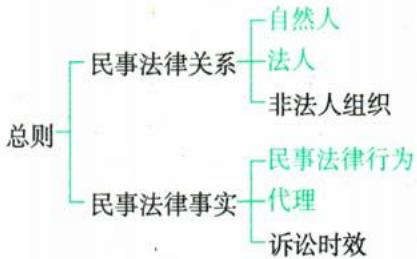

flowchart

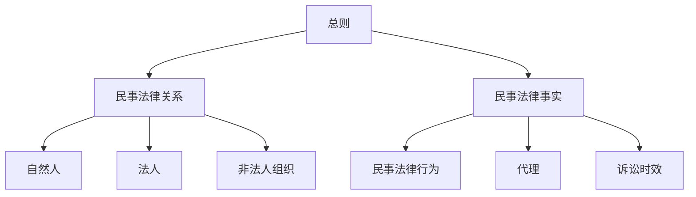
```mermaid
graph TD
    A["总则"] --> B["民事法律关系"]
    A --> C["民事法律事实"]
    B --> D["自然人"]
    B --> E["法人"]
    B --> F["非法人组织"]
    C --> G["民事法律行为"]
    C --> H["代理"]
    C --> I["诉讼时效"]
```

[图释] 总则编是整个《民法典》（共七编1260条）最为抽象的部分，是提取《民法典》各分编“公因式”的结果，本质上，由两个核心制度构成，即民事法律关系和民事法律事实。用一句话来概括二者的关系就是：民事法律事实推动民事法律关系的产生、变更和消灭。

总则编（第1—204条）共204条，约占整个《民法典》的16.19%。包括10章：

第一章 基本规定（第 1—12 条，共 12 条）。

第二章 自然人（第 13—56 条，共 44 条）。

第三章 法人（第 57—101 条，共 45 条）。

第四章 非法人组织（第 102—108 条，共 7 条）。

第五章 民事权利（第 109—132 条，共 24 条）。

第六章 民事法律行为（第 133—160 条，共 28 条）。

第七章 代理（第 161—175 条，共 15 条）。

第八章 民事责任（第 176—187 条，共 12 条）。

第九章 诉讼时效（第 188—199 条，共 12 条）。

第十章 期间计算（第 200—204 条，共 5 条）。

## 01 专题一 民事法律关系的基本原理

#### 复习提要

《民法典》第一编总则第一章基本规定第2条确立了民法的调整对象。本专题主要涉及两个问题：1. 民事法律关系和非民事法律关系的区别（民法的调整对象）；2. 民事法律关系的要素。其中，民事法律关系和非民事法律关系的区别在复习过程中需要掌握，民事法律关系的要素了解即可。

#### 一、民事法律关系和非民事法律关系的区别 $^{①}$ （民法的调整对象）

民事法律关系，是指民事法律规范所确认的平等主体之间的以民事权利和民事义务为内容的社会关系。正面而言，根据《民法典》第2条的规定，民法调整平等主体的自然人、法人和非法人组织之间的人身关系和财产关系。反面而言，如下四类社会关系不受民法调整，不属于民事法律关系。

#### （一）有关单位在从事管理活动时产生的社会关系（民事法律关系 VS 行政法律关系）

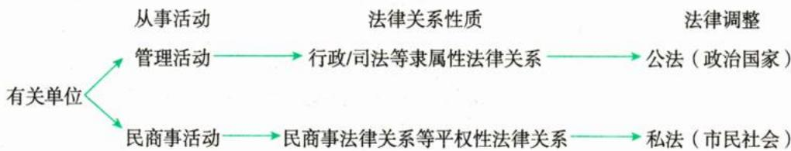

flowchart

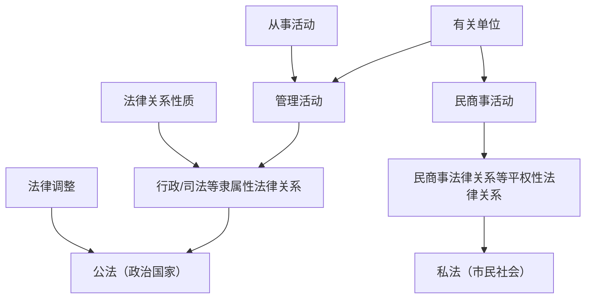
```mermaid
graph TD
    A["有关单位"] --> B["管理活动"]
    A --> C["民商事活动"]
    B --> D["行政/司法等隶属性法律关系"]
    C --> E["民商事法律关系等平权性法律关系"]
    D --> F["公法（政治国家）"]
    E --> G["私法（市民社会）"]
    H["从事活动"] --> B
    I["法律关系性质"] --> D
    J["法律调整"] --> F
```

(有关单位从事活动法律关系性质判断示意图)

民法调整平等主体之间的法律关系。“平等”二字集中反映了民事法律关系的本质属性，是民事法律关系区别于其他法律关系的核心特征。

#### 1. 原则。

有关单位在从事管理活动时（如税收征收、姓名登记、城管执法和交警罚款等）会与自然人或非自然人（即组织，包括法人组织和非法人组织）形成不平等法律关系（隶属性法律关系/强调命令和服从），这种不平等法律关系不属于民事法律关系，不受（归）民法（私法）调整。

[例] 孟某请求税务机关退还其多缴的个人所得税。该种社会关系是税收法律关系，属于行政法律关系，不受民法调整。

#### 2. 例外。

有关单位在从事民商事活动时，如因（税务局/公安局/财政局等）购买办公用品而与某公司签订买卖合同、因建造办公大楼与某建筑公司签订建设工程施工合同等，民法要求其必须以机关法人的身份进行。此时，有关单位与其他民事主体之间的法律地位是平等的，这种买卖合同、建设工程施工合同关系则属于民事法律关系，受民法调整。

[萌主点拨] 不以主体论关系，而以行为论关系。

#### (二) 人自己的活动

民法调整平等主体之间的法律关系。“之间的”三个字重点强调“相互关系”，如仅是人自己的活动，则不受民法调整。

[例] 甲公司与其分支机构（分公司）之间的业务指导关系不属于民事法律关系，因为甲公司与其分支机构（分公司）系一家公司，业务指导关系是公司自己的内部事务，不受民法调整。

#### （三）不能产生私法效果的人身关系

不能产生私法效果（法律约束力）的人身关系 $\begin{array}{l}\text {恋爱关系 (婚约)}\\ \text {同居关系}\\ \text {朋友关系}\\ \text {网友关系}\end{array}$

(不能产生私法效果的人身关系典型情形汇总)

人身关系，是指与民事主体的人身不可分离，不具有直接财产内容的社会关系，包括人格关系和身份关系。人的一生会和身边的人形成各种不同的社会关系，如恋爱、同居、朋友、网友、驴友、同学、同事、同乡、师生关系等，这些社会关系在当事人之间不能产生私法效果（民法意义上的权利义务关系），受纯粹的道德或宗教的调整，不受民法调整。

#### 1. 恋爱关系（恋人关系）。

恋爱关系是世界上最为复杂的关系之一，在恋爱过程中，男女双方虽然存在一定的人身关系，但这种人身关系不能产生私法效果（民法意义上的权利义务关系），且婚约在我国也不具有法律约束力。因此，恋爱关系不受民法调整。

[例] 刘某对孟某说：如果你考上研究生，我就嫁给你。该种社会关系属于恋爱关系，不受民法调整。

#### 2. 同居关系。

同居关系本身并非民法所调整的对象。因此，当事人提起诉讼仅请求解除同居关系的，法院不予受理；已经受理的，裁定驳回起诉。但是，当事人因同居期间财产分割或子女抚养纠纷提起诉讼的，法院应当受理（《民法典婚姻家庭编解释（一）》第3条）。

#### 3. 朋友关系。

朋友之间因日常聊天告知对方某些“小道信息”，对方基于该信息从事民事活动产生的损害，不得请求对方赔偿，该类社会关系亦不受民法调整。

[例] 孟某听说某公司股票可能大涨，便告知马某，马某信以为真大量购进，事后该只股票大跌。此时，马某不可以请求孟某赔偿损失。因为马某作为成年人应为自己的投资行为独立负责。

#### 4. 网友关系。

互联网时代之下，人与人之间通过网络交友。网友相约见面或一起参加电子竞技等均不受民法调整。

#### （四）不能产生私法效果的财产关系

不能产生私法效果（法律约束力）的财产关系
好意施惠
戏谑行为

(不能产生私法效果的财产关系典型情形汇总)

财产关系，是指在物质资料的生产、分配、交换、消费的过程中形成的具有经济内容的社会关系，包括财产的归属和利用关系（物权关系）和财产的流转关系（债权关系）。

#### 1. 好意施惠。

好意施惠，又称情谊行为或君子协议，通俗而言，就是“给你是情分，不给你是本分”，是指当事人之间无意设定法律上的权利义务关系，而由当事人一方基于良好的道德风尚实施的使另一方受恩惠、旨在增进情谊的行为。

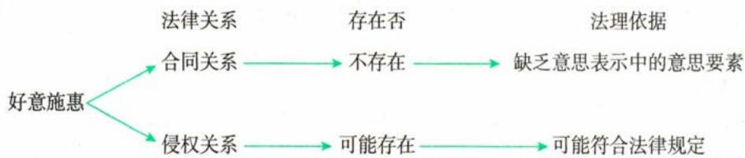

flowchart

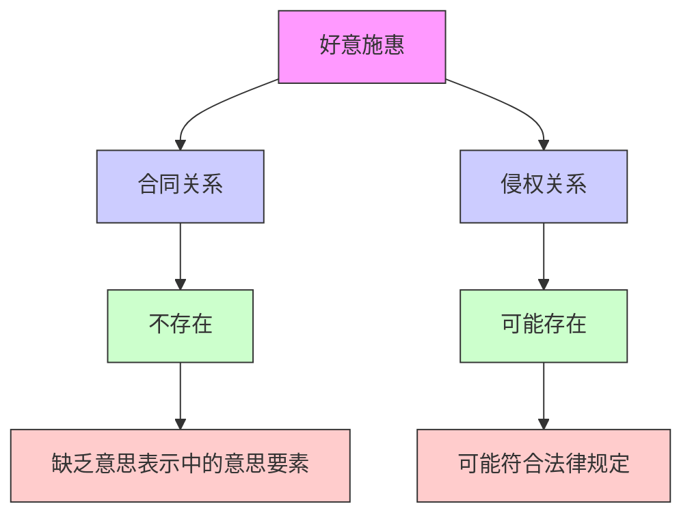
```mermaid
graph TD
    A["好意施惠"] --> B["合同关系"]
    A --> C["侵权关系"]
    B --> D["不存在"]
    C --> E["可能存在"]
    D --> F["缺乏意思表示中的意思要素"]
    E --> G["可能符合法律规定"]
    style A fill:#f9f,stroke:#333
    style B fill:#ccf,stroke:#333
    style C fill:#ccf,stroke:#333
    style D fill:#cfc,stroke:#333
    style E fill:#cfc,stroke:#333
    style F fill:#fcc,stroke:#333
    style G fill:#fcc,stroke:#333
```

(好意施惠关系判断示意图)

好意施惠关系中，因缺乏意思表示中的意思要素（具体而言，缺乏的是效果意思/法效意思），即不具有产生法律约束力的意思。好意施惠不产生合同违约责任和缔约过失责任，但可能产生侵权责任。

（1）邀请同看演出、比赛或承诺陪同旅游。

邀请同看演出、比赛或承诺陪同旅游，在性质上属于好意施惠关系，如一方爽约（“放鸽子”）的，另一方不得请求赔偿。

(2) 火车到站叫醒。

在火车上，一方答应叫醒另一方，在性质上属于好意施惠，如一方爽约的，另一方不得请求赔偿。

(3) 顺路投递邮件或顺便帮邻居清扫积雪。

顺路投递邮件或顺便帮邻居清扫积雪的，行为人主观上不具备形成债的意图且不具有为避免他人利益受损失而管理他人事务的意图，属于好意施惠关系，不受民法调整。

[例] 孟某在自家门前扫雪，顺便将邻居老王的小轿车上的积雪清扫干净。该种情形不会引起无因管理之债的产生，因为孟某的行为纯粹是为了增进邻里关系，没有产生法律约束力的意图，系好意施惠，不受民法调整。

(4) 无偿指路。

无偿指路，在性质上属于好意施惠，如一方指错方向，另一方不得请求赔偿。

(5) 青年志愿者做帮工。

帮工，在性质上属于好意施惠，如一方答应帮工后又爽约的，另一方不得请求赔偿。

(6) 请客吃饭。

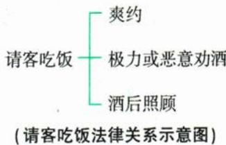

flowchart

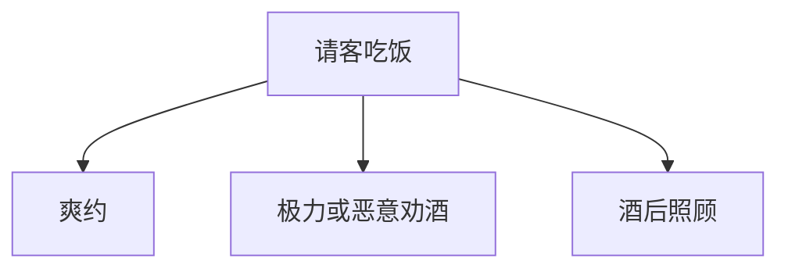
```mermaid
graph TD
    A["请客吃饭"] --> B["爽约"]
    A --> C["极力或恶意劝酒"]
    A --> D["酒后照顾"]
```

①爽约。

请客吃饭，在性质上属于好意施惠，如一方爽约的，另一方不得请求赔偿。

[例] 甲对乙说, 我儿子考上大学, 我请你喝酒。甲的行为属于请客吃饭, 性质上是好意施惠。后甲爽约的, 不存在合同违约责任和缔约过失责任问题。

②极力或恶意劝酒，造成他人损害。

根据生活常识，适量饮酒对身体可能并无伤害，但大量饮酒极有可能对饮酒者的健康造成损害。在请客吃饭的过程中，如一方极力或恶意劝酒，应认定其主观上具有过错，其行为构成一般侵权，依法应当承担侵权损害赔偿责任。

[例] 孟某不知马某不胜酒力而极力劝酒，致马某酒精中毒住院治疗。该种情形成立民事法律关系。因为孟某的行为构成一般侵权①，依法应当承担侵权损害赔偿责任。

③酒后照顾。

酒后照顾的义务来源于善良管理人的注意义务，所谓“善良管理人的注意义务”，是指依交易上一般观念认为有相当知识经验及诚意之人应尽之注意。酒后照顾问题，应具体问题具体分析：或构成一般侵权，承担相应的侵权损害赔偿责任；或适用公平原则，由行为人对受害人或其近亲属进行适当补偿。

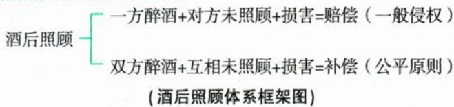

flowchart

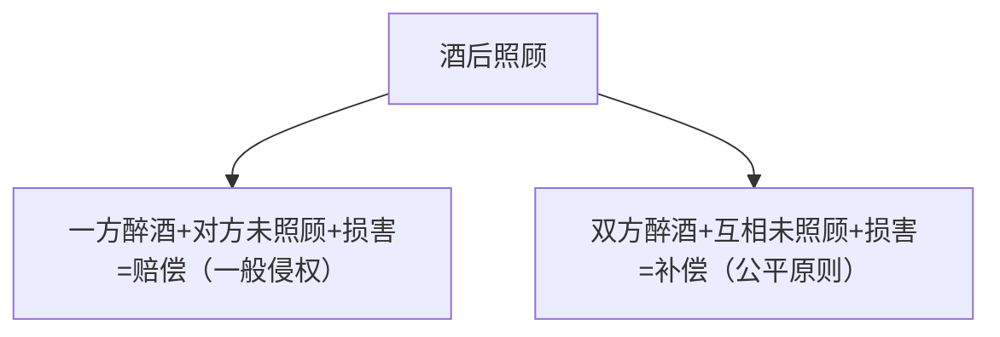
```mermaid
graph TD
    A["酒后照顾"] --> B["一方醉酒+对方未照顾+损害=赔偿（一般侵权）"]
    A --> C["双方醉酒+互相未照顾+损害=补偿（公平原则）"]
```

(7) 搭便车（搭顺风车）。

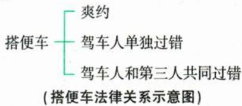

flowchart

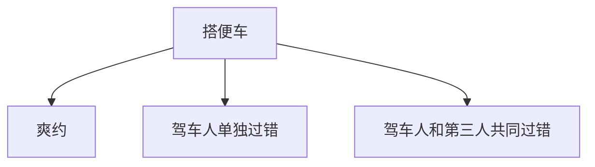
```mermaid
graph TD
    A["搭便车"] --> B["爽约"]
    A --> C["驾车人单独过错"]
    A --> D["驾车人和第三人共同过错"]
```

①爽约。

行为人之间达成搭便车的合意后爽约的，既不构成违约责任（无形成合同之债的意图）亦不构成侵权责任（主观上不存在过错），无需承担赔偿责任。

②驾车人单独过错。

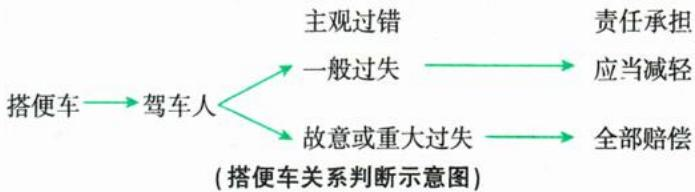

flowchart

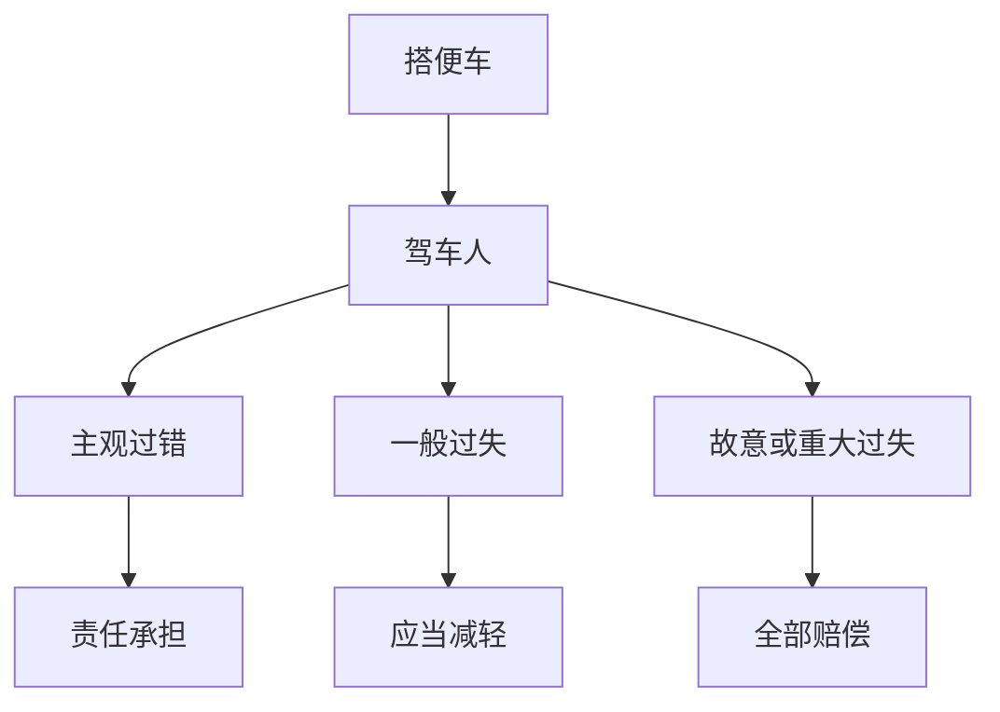
```mermaid
graph TD
    A["搭便车"] --> B["驾车人"]
    B --> C["主观过错"]
    B --> D["一般过失"]
    B --> E["故意或重大过失"]
    C --> F["责任承担"]
    D --> G["应当减轻"]
    E --> H["全部赔偿"]
```

搭便车，在性质上属于好意施惠，不产生合同违约责任和缔约过失责任，但有可能产生侵权责任。驾车人单独违章驾驶的，“违章”二字表明驾车人主观上存在过错，构成一般侵权，应当承担赔偿责任。

毕竟搭车人是无偿搭乘。因此，原则上，如果驾车人主观上仅存在一般过失的，应当减轻驾车人的赔偿责任。但是，如果驾车人主观上系故意或重大过失的，则不存在任何免责事由，依法承担全部侵权损害赔偿责任。驾车人与搭车人事先约定在搭车过程中造成人身损害免责的，该约定无效。因为免除造成对方人身损害的免责条款是无效的。

③驾车人和第三人共同过错，

二人以上分别实施侵权行为造成同一损害，能够确定责任大小的，各自承担相应的责任；难以确定责任大小的，平均承担责任。驾车人与第三人共同过错造成搭车人损害的，二者构成“无意思联络的数人侵权行为中的原因力结合”，由驾车人与第三人对搭车人承担按份责任。

[萌主点拨]
■ 塔便车（搭顶风车）侵权责任汇总表

<table><tr><td>■项目</td><td>■驾车人过错</td><td>■第三人过错</td><td>■责任人</td></tr><tr><td>情形1</td><td>有</td><td>无</td><td>驾车人赔偿</td></tr><tr><td>情形2</td><td>无</td><td>有</td><td>第三人赔偿</td></tr><tr><td>情形3</td><td>有</td><td>有</td><td>驾车人和第三人按份赔偿</td></tr><tr><td>注意</td><td colspan="3">搭车人也有过错的,相应的减轻责任人的侵权责任(谁的过错谁担责)</td></tr></table>

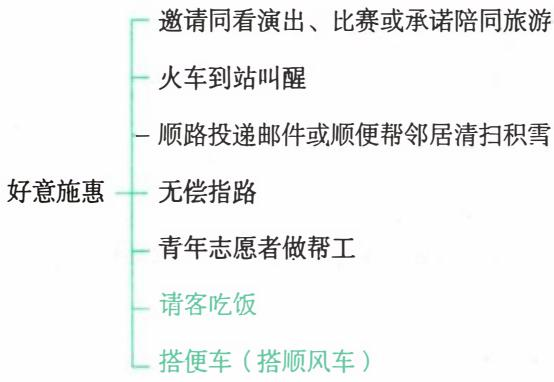

flowchart

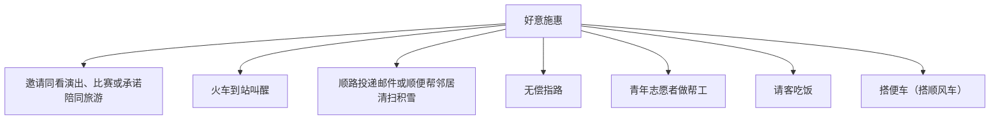
```mermaid
graph TD
    A["好意施惠"] --> B["邀请同看演出、比赛或承诺陪同旅游"]
    A --> C["火车到站叫醒"]
    A --> D["顺路投递邮件或顺便帮邻居清扫积雪"]
    A --> E["无偿指路"]
    A --> F["青年志愿者做帮工"]
    A --> G["请客吃饭"]
    A --> H["搭便车（搭顺风车）"]
```

■（好意施惠典型精彩汇总）

#### 2. 戏谑行为。

戏谑行为，又称缺乏真意的表示，是指行为人作出的意思表示并非出于真意，并且期待对方会立即了解其意思表示并非出于真意。戏谑行为的表意人没有成立民事法律关系的意图，通常只是为了“吹牛皮”“开玩笑”“说大话”或使对方“大吃一惊”“陷入窘境”等。通说认为，基于戏谑行为而为的民事法律行为不发生效力。相对人非因过错未了解其为戏谑行为的，行为人应当赔偿相对人信赖利益的损失。

[例] 邢某系世界陶艺大师。2006年4月1日，邢某在接受央视7套《乡约》栏目采访时，面对全国观众，拿出自己的作品——五层“吊球”夸下海口：这是我的第一件作品，到现在还是世界之谜，这里面不是拿铁丝绑上的，是死环套扣，一个一个包在里面，到现在没人摸索出来。如果有人仿造出来，就把自己位于大连市中心的三层小楼，共计2000平方米，价值1600万元的“邢某艺术中心”送给他（她），还包括里面的资产。节目播出后，河南洛阳一陶瓷爱好者孙某（男）仿造出了此作品。邢某的行为属于戏谑行为。

#### 二、民事法律关系的要素①

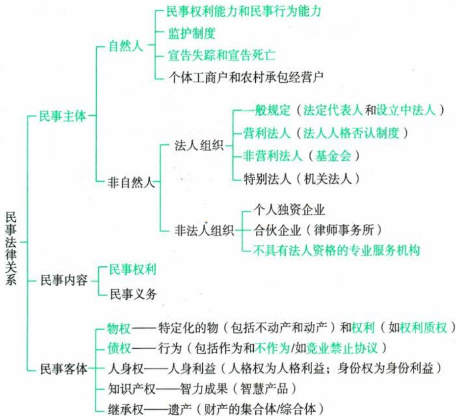

flowchart

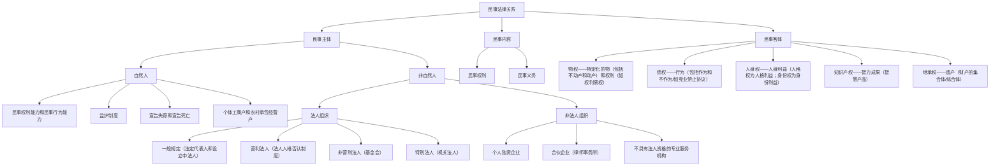
```mermaid
graph TD
    A["民事法律关系"] --> B["民事主体"]
    A --> C["民事内容"]
    A --> D["民事客体"]

    B --> E["自然人"]
    E --> F["民事权利能力和民事行为能力"]
    E --> G["监护制度"]
    E --> H["宣告失踪和宣告死亡"]
    E --> I["个体工商户和农村承包经营户"]

    B --> J["非自然人"]
    J --> K["法人组织"]
    K --> L["一般规定（法定代表人和设立中法人）"]
    K --> M["营利法人（法人人格否认制度）"]
    K --> N["非营利法人（基金会）"]
    K --> O["特别法人（机关法人）"]

    J --> P["非法人组织"]
    P --> Q["个人独资企业"]
    P --> R["合伙企业（律师事务所）"]
    P --> S["不具有法人资格的专业服务机构"]

    C --> T["民事权利"]
    C --> U["民事义务"]

    D --> V["物权——特定化的物（包括不动产和动产）和权利（如权利质权）"]
    D --> W["债权——行为（包括作为和不作为/如竞业禁止协议）"]
    D --> X["人身权——人身利益（人格权为人格利益；身份权为身份利益）"]
    D --> Y["知识产权——智力成果（智慧产品）"]
    D --> Z["继承权——遗产（财产的集合体/综合体）"]
```

(民事法律关系的要素体系框架图)

#### (一) 民事主体

民事主体，是指在民事法律关系中享受民事权利并承担民事义务的人。以是否具有自然生命属性为标准，民事主体可分为自然人和非自然人（即社会组织）。其中，社会组织按其法人资格的有无可划分为法人组织（如公司）和非法人组织（如律师事务所）。

我国采用 “民事主体三元论”，即自然人（包括中国公民、在我国境内的外国人和无国籍人）、法人和非法人组织。在某些特殊情况下，国家也可以作为民事主体，如发行国债、国家成为无主财产的所有权人、土地的所有权归国家等。

#### (二) 民事内容

民事法律关系的内容，是指民事主体所享有的民事权利和承担的民事义务（不履行民事义务，则承担民事责任）。

#### 1. 民事权利。

民事权利，是指民事主体为实现某种利益而依法为或不为某种行为的自由。民事权利可能由当事人约定而产生，如债权（孟某和王某签订手表买卖合同产生的合同之债，由当事人自主设立）。民事权利也可能由法律直接规定而产生，如物权（国家对城市土地享有所有权，由法律直接规定）。

#### 2. 民事义务。

民事义务，是指义务人为满足权利人利益而应当为或不为某种行为的拘束。民事义务人必须履行相应义务，不可以拒绝、延误、抛弃。如果义务人不履行义务，将依法承担民事责任。

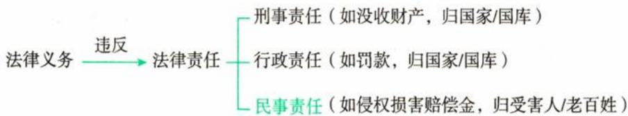

flowchart

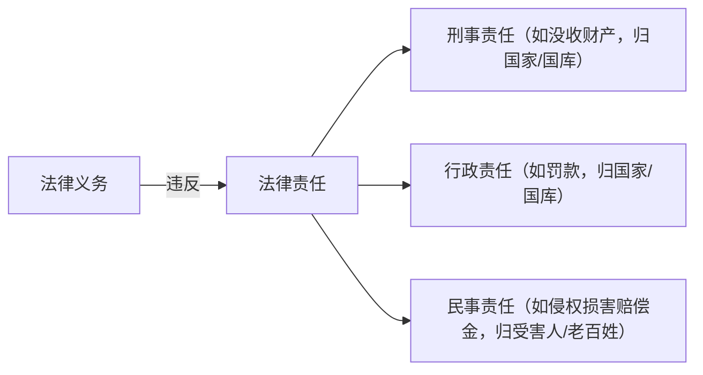
```mermaid
graph LR
    A["法律义务"] -->|违反| B["法律责任"]
    B --> C["刑事责任（如没收财产，归国家/国库）"]
    B --> D["行政责任（如罚款，归国家/国库）"]
    B --> E["民事责任（如侵权损害赔偿金，归受害人/老百姓）"]
```

(民事责任优先原则体系框架图)

民事责任，是指民事主体因违反民事法律、违约或因法律规定的其他事由而应当依法承担的法定的不利后果，包括缔约过失责任、违约责任和侵权责任等。

补偿性是民事责任的显著特征。民事责任的主要目的是给受害人补偿损失、恢复权利。根据《民法典》第187条的规定，民事主体因同一行为应当承担民事责任、行政责任和刑事责任的，承担行政责任或刑事责任不影响承担民事责任；民事主体的财产不足以支付的，优先用于承担民事责任（民事责任优先原则）。

#### (三) 民事客体

通说认为，民事客体，是指民事权利和民事义务指向的对象。

在考试范围内，需要掌握如下五类民事权利的客体：

典型民事权利的客体汇总表

<table><tr><td>民事权利</td><td>物权</td><td>债权</td><td>人身权</td><td>知识产权</td><td>继承权</td></tr><tr><td>客体</td><td>特定化的物和权利</td><td>行为(包括作为和不作为)</td><td>人身利益</td><td>智力成果</td><td>遗产</td></tr></table>

1. 物权的客体为特定化的物和权利。

2. 债权的客体为行为（包括积极的作为和消极的不作为）。

3. 人身权的客体为人身利益（人格权的客体是人格利益，身份权的客体是身份利益）。

4. 知识产权的客体为智力成果（智慧产品）。

5. 继承权的客体为遗产（财产综合体/集合体）。

## 02/专题二 民事主体

#### 复习提要

《民法典》第一编总则第二、三、四章（第13—108条，共96条）确立了我国民事主体“三元论”的格局。本专题主要涉及三个问题：1. 自然人；2. 法人；3. 非法人组织。其中，自然人系每年客观题必考事项，必须重点关注。

### 第一节 自然人

#### 复习提要

自然人规定在《民法典》第一编总则第二章（第13—56条），共44条。本节主要涉及五个问题。分别是：1. 自然人的民事权利能力；2. 自然人的民事行为能力；3. 监护；4. 宣告失踪；5. 宣告死亡。其中，监护制度系每年客观题必考事项，在备考中必须重点学习。

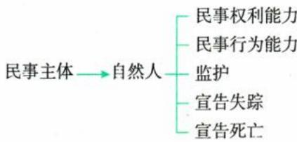

flowchart

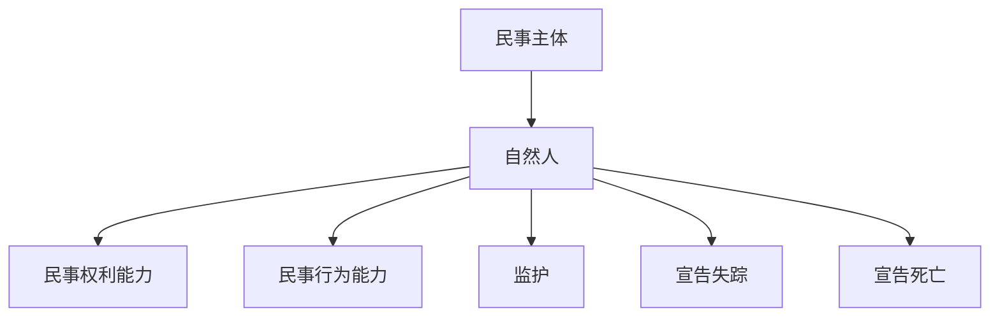
```mermaid
graph TD
    A["民事主体"] --> B["自然人"]
    B --> C["民事权利能力"]
    B --> D["民事行为能力"]
    B --> E["监护"]
    B --> F["宣告失踪"]
    B --> G["宣告死亡"]
```

#### 一、自然人的民事权利能力

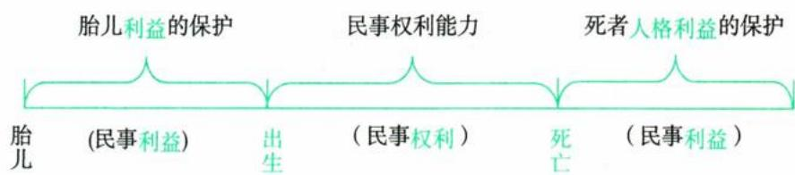

flowchart

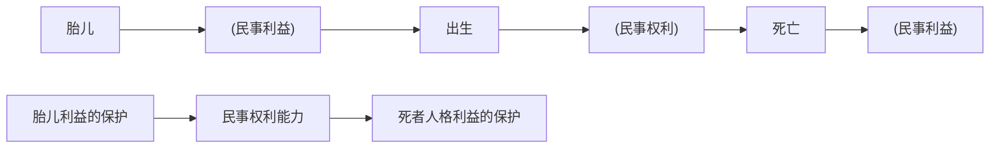
```mermaid
graph LR
    A["胎儿"] --> B["(民事利益)"]
    B --> C["出生"]
    C --> D["(民事权利)"]
    D --> E["死亡"]
    E --> F["(民事利益)"]
    G["胎儿利益的保护"] --> H["民事权利能力"]
    H --> I["死者人格利益的保护"]
```

(自然人的民事权利能力法律关系示意图)

#### (一) 胎儿利益的保护 (生前) $^{①}$

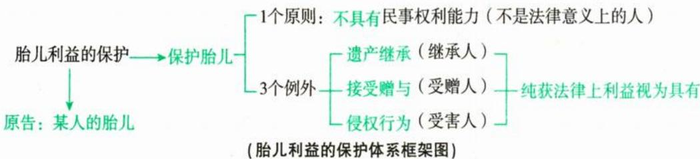

flowchart

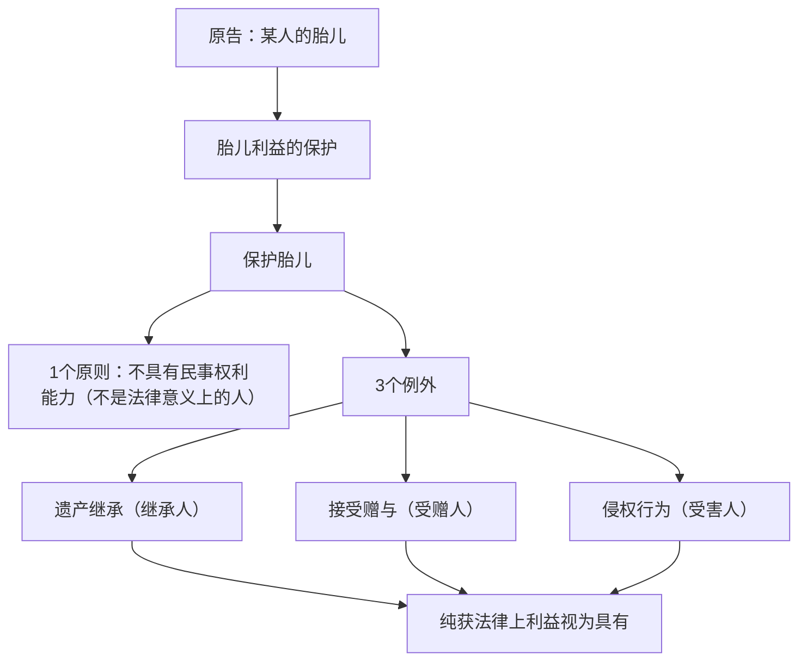
```mermaid
graph TD
    A["胎儿利益的保护"] --> B["保护胎儿"]
    B --> C["1个原则：不具有民事权利能力（不是法律意义上的人）"]
    B --> D["3个例外"]
    D --> E["遗产继承（继承人）"]
    D --> F["接受赠与（受赠人）"]
    D --> G["侵权行为（受害人）"]
    E --> H["纯获法律上利益视为具有"]
    F --> H
    G --> H
    I["原告：某人的胎儿"] --> A
```

1. 胎儿的遗产继承权（胎儿应留份/遗腹子）。

遗产继承包括法定继承、遗嘱继承和受遗赠。以法定继承为例：娩出前，胎儿父亲去世的，胎儿视为具有民事权利能力（即视为已出生），享有独立的继承权，参与遗产分配（《民法典》第1155条）。

[例] 熊某与杨某结婚后，杨某与前夫所生之子小强由二人一直抚养，熊某死亡，未立遗嘱。熊某去世前杨某孕有一对龙凤胎，于熊某死后生产。产出时男婴为死体，女婴为活体但旋即死亡。根据上述案情及示意图，请回答如下问题：

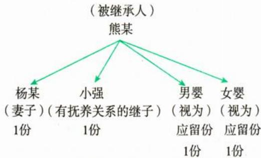

flowchart

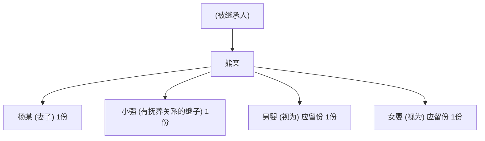
```mermaid
graph TD
    A["(被继承人)"] --> B["熊某"]
    B --> C["杨某 (妻子) 1份"]
    B --> D["小强 (有抚养关系的继子) 1份"]
    B --> E["男婴 (视为) 应留份 1份"]
    B --> F["女婴 (视为) 应留份 1份"]
```

##### (胎儿的遗产继承权法律关系示意图)

(1) 熊某第一顺序的法定继承人有几个？分别是谁？

答：4个。分别是：①妻子（配偶）杨某；②有抚养关系的继子小强；③男婴（胎儿应留份/视为具有民事权利能力）；④女婴（胎儿应留份/视为具有民事权利能力）。

(2) 为男婴保留的遗产份额如何处理?

答：因男婴娩出时为死体，其民事权利能力自始不存在；为其保留的遗产份额按原被继承人熊某的遗产处理，由杨某、小强和女婴法定继承。

(3) 为女婴保留的遗产份额如何处理?

答：由杨某继承。因为此时母亲杨某为女婴唯一的第一顺序的法定继承人（《民法典》第1127条）。

2. 胎儿的接受赠与权。

娩出前，胎儿接受赠与的，胎儿视为具有民事权利能力（即视为已出生），享有独立的接受赠与权，赠与合同成立并生效。

[例] 郭某意外死亡, 其妻甲怀孕两个月。郭某父亲乙与甲签订协议: “如把孩子顺利生下来, 就送十根金条给孩子。” 当日乙把八根金条交给了甲。孩子顺利出生后, 甲不同意由乙抚养孩子, 乙拒绝交付剩余的两根金条, 并要求甲退回八根金条。根据上述案情及示意图, 请回答如下问题:

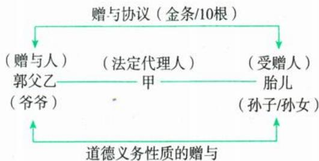

flowchart

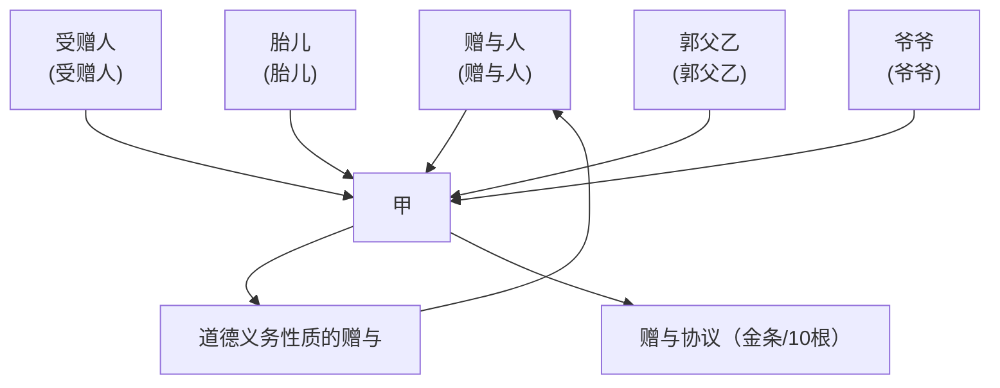
```mermaid
graph TD
    A["赠与人\n(赠与人)"] --> B["甲"]
    C["受赠人\n(受赠人)"] --> B
    D["胎儿\n(胎儿)"] --> B
    E["郭父乙\n(郭父乙)"] --> B
    F["爷爷\n(爷爷)"] --> B
    B --> G["道德义务性质的赠与"]
    G --> A
    B --> H["赠与协议（金条/10根）"]
```

(胎儿的接受赠与权当事人法律关系示意图)

(1) 孩子为胎儿, 不具备民事权利能力, 能接受赠与吗?

答：能。因为胎儿接受赠与时纯获法律上利益（只有权利没有义务），视为具有民事权利能力。

(2) 赠与协议（合同）的当事人是谁和谁？

答：郭某父亲乙（爷爷）和胎儿（孙子/孙女）。

(3) 赠与协议（合同）是否成立？

答：成立。因为郭某父亲乙和甲（胎儿的法定代理人）意思表示合意。

(4) 孩子已出生，爷爷乙是否有权不交付剩余的两根金条？

答：无权。

(5) 孩子已出生，爷爷乙是否有权请求退回八根金条？

答：无权。

(6) 如胎儿娩出时为死体，爷爷乙可否请求退回八根金条？

答：可以。因为胎儿娩出时为死体的，其民事权利能力自始不存在（不当得利）。

3. 胎儿的侵权损害赔偿请求权。

娩出前，第三人实施侵害行为导致胎儿利益受损害的，胎儿视为具有民事权利能力（即视为已出生），享有独立的侵权损害赔偿请求权。

#### >> 随堂练习

孕妇 A 身体不适，前往甲医院就诊，甲医院医生因重大过失开错药，造成 A 身体受损，孩子 B 婉出后亦有残疾。根据《民法典》，以下说法正确的是？（2020 金题-2-1-1，单） $^{①}$

A. 仅 A 可要求医院承担损害赔偿责任
B. 仅 B 可要求医院承担损害赔偿责任
C. A 和 B 均可要求医院承担损害赔偿责任
D. 甲医院和医生对 A 和 B 承担连带责任

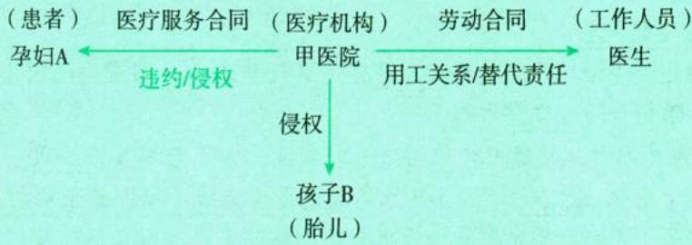

flowchart

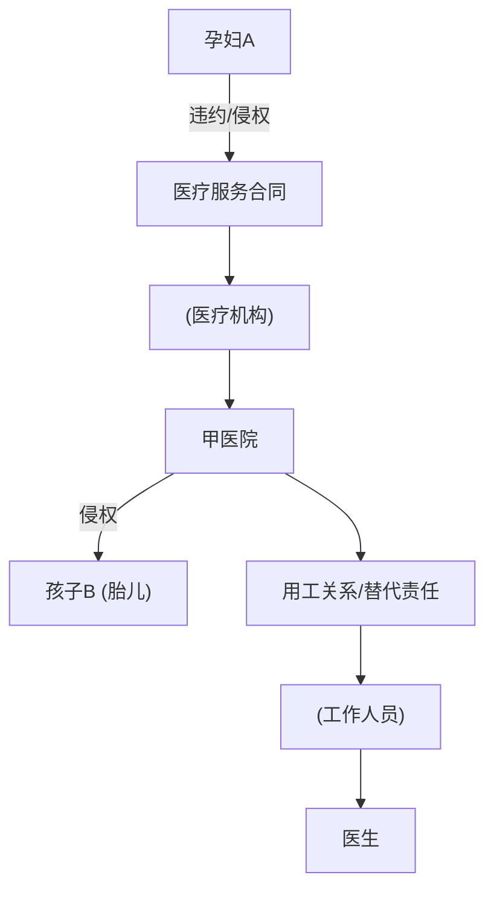
```mermaid
graph TD
    A["孕妇A"] -->|违约/侵权| B["医疗服务合同"]
    B --> C["(医疗机构)"]
    C --> D["甲医院"]
    D -->|侵权| E["孩子B (胎儿)"]
    D --> F["用工关系/替代责任"]
    F --> G["(工作人员)"]
    G --> H["医生"]
```

(胎儿的侵权损害赔偿请求权法律关系示意图)

#### (二) 死者人格利益的保护 (死后) $^{①}$

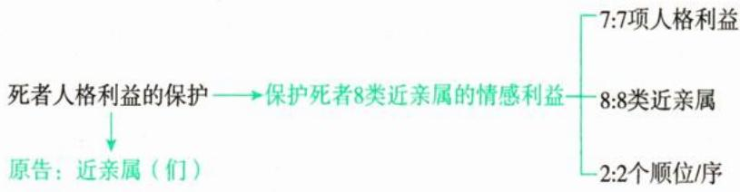

flowchart

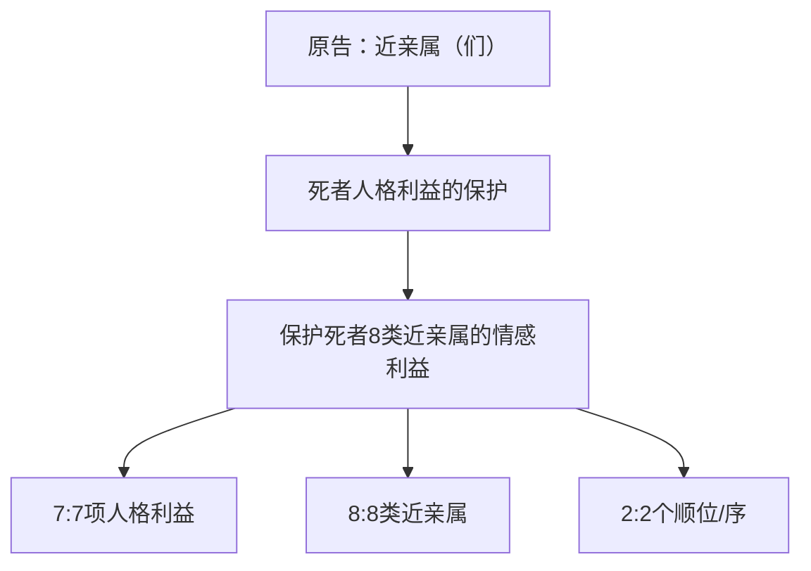
```mermaid
graph TD
    A["死者人格利益的保护"] --> B["保护死者8类近亲属的情感利益"]
    B --> C["7:7项人格利益"]
    B --> D["8:8类近亲属"]
    B --> E["2:2个顺位/序"]
    F["原告：近亲属（们）"] --> A
```

(死者人格利益的保护体系框架图)

死者人格利益的保护

<table><tr><td>侵权客体</td><td colspan="3">死者的7项人格利益(姓名、肖像、名誉、荣誉、隐私、遗体和遗骨)而非人格权</td></tr><tr><td>保护对象</td><td colspan="3">死者近亲属的情感利益(反射利益说:生者对死者追思怀念的情感利益)和社会公共利益</td></tr><tr><td rowspan="3">类型</td><td>项目</td><td>近亲属私益诉讼</td><td>检察院公益诉讼</td></tr><tr><td>一般死者</td><td>可以</td><td>不可以</td></tr><tr><td>英雄烈士</td><td>可以</td><td>可以</td></tr><tr><td>起诉主体</td><td colspan="3">私益诉讼近亲属或公益诉讼检察院均以自己的名义起诉</td></tr><tr><td rowspan="2">赔偿金归属</td><td colspan="3">1. 私益诉讼归提起诉讼的近亲属(谁起诉归谁所有而非死者遗产)</td></tr><tr><td colspan="3">2. 公益诉讼归国家或参与诉讼的近亲属</td></tr></table>

[例] 欣欣美容医院在为青年女演员欢欢实施隆鼻手术（医疗服务合同/无名合同/非典型合同）过程中，因未严格（医院有过错）消毒导致欢欢面部感染，经治愈后面部仍留下较大疤痕（既违约又侵权/侵犯身体权）。欢欢因此诉诸法院，要求欣欣美容医院赔偿（债权请求权）医疗费并主张精神损害赔偿（民事诉讼法中的诉讼请求②/给付之诉）。该案受理后不久，欢欢因心脏病急性发作猝死。网络名人洋洋在其博客上杜撰（诽谤/侵犯死者名誉）欢欢吸毒过量致死。根据上述案情及示意图，请回答如下问题：

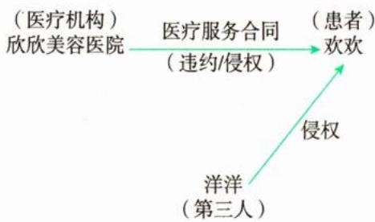

flowchart

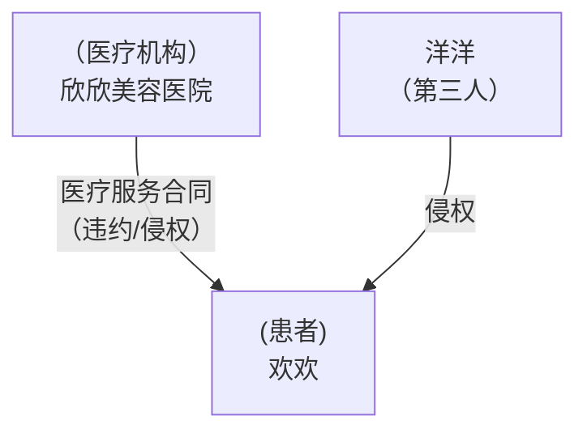
```mermaid
graph TD
    A["（医疗机构）\n欣欣美容医院"] -->|医疗服务合同\n（违约/侵权）| B["(患者)\n欢欢"]
    C["洋洋\n（第三人）"] -->|侵权| B
```

(死者人格利益保护当事人法律关系示意图)

(1) 洋洋的行为侵犯了欢欢的何种人格利益?

答：名誉。因为洋洋的行为属于诽谤（捏造、散布虚假事实，造成他人社会评价降低）。

(2) 欢欢的舅舅是否可以对洋洋提起侵权之诉?

答：不可以。因为舅舅不属于近亲属。如果舅舅提起民事诉讼的，法院应当裁定不予受理。民法上的近亲属共包括8类，分别是配偶、父母、子女、兄弟姐妹、祖父母、外祖父母、孙子女、外孙子女（《民法典》第1045条）。

(3) 在欢欢的近亲属均存在的情况下，姐姐是否可以对洋洋提起侵权之诉？

答：不可以。因为姐姐系第二顺位（序）的近亲属。8类近亲属行权分为两个顺位（序）：第一顺位/序（3类）：配偶、父母、子女；第二顺位/序（5类）：其他近亲属（兄弟姐妹、祖父母、外祖父母、孙子女和外孙子女）。

(4) 如欢欢的配偶、父母和子女对是否主张侵权损害赔偿意见不一致，应如何处理？

答：应依民法的调整方法解决问题，即意思自治（私法自治），谁想去谁去。

(5) 如欢欢的母亲欲向法院提起侵权之诉，应以谁的名义提起？

答：自己的名义。因为母亲是与本案有直接利害关系的当事人（《民事诉讼法解释》第69条）。

(6) 如法院判决洋洋赔偿欢欢的母亲 10 万元侵权损害赔偿金，欢欢的配偶和子女是否可以主张按遗产分配？

答：不可以。因为遗产是指自然人死亡时遗留的个人合法财产。本案中，10万元系欢欢死亡后发生的，应直接归原告或原告们。

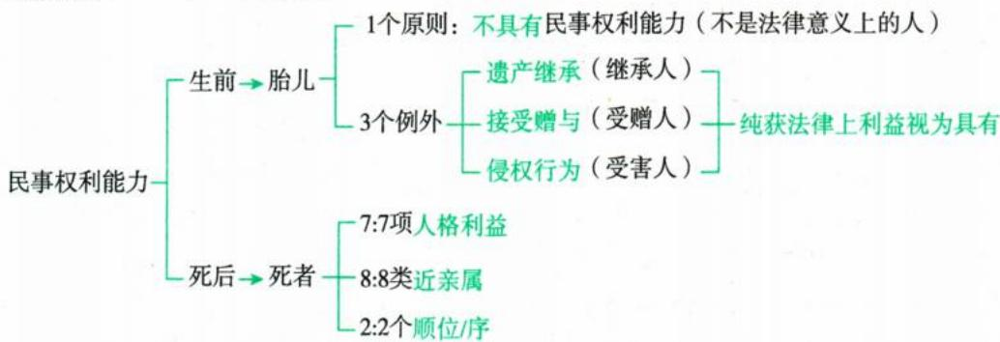

flowchart

```mermaid
graph TD
    A["民事权利能力"] --> B["生前→胎儿"]
    A --> C["死后→死者"]
    B --> D["1个原则：不具有民事权利能力（不是法律意义上的人）"]
    B --> E["3个例外"]
    E --> F["遗产继承（继承人）"]
    E --> G["接受赠与（受赠人）"]
    E --> H["侵权行为（受害人）"]
    F --> I["纯获法律上利益视为具有"]
    C --> J["7:7项人格利益"]
    C --> K["8:8类近亲属"]
    C --> L["2:2个顺位/序"]
```

(自然人的民事权利能力体系框架图)

#### 二、自然人的民事行为能力①

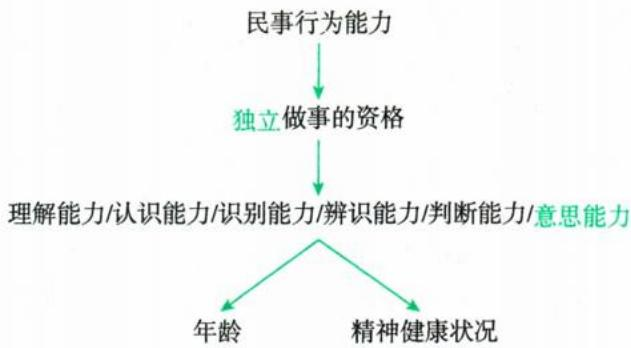

flowchart

```mermaid
graph TD
    A["民事行为能力"] --> B["独立做事的资格"]
    B --> C["理解能力/认识能力/识别能力/辨识能力/判断能力/意思能力"]
    C --> D["年龄"]
    C --> E["精神健康状况"]
```

(自然人的民事行为能力解构示意图)

#### (一) 含义

民事行为能力，即“独立做事的资格”，是指民事主体能以自己的行为取得民事权利、承担民事义务的资格。

#### (二) 分类

自然人的民事行为能力的分类

<table><tr><td>项目</td><td>年龄</td><td>精神健康状况</td></tr><tr><td>无民事行为能力人</td><td>人&lt;8</td><td>完全不(能辨认自己行为的成年人)</td></tr><tr><td>限制民事行为能力人</td><td>8≤人&lt;18</td><td>不(能)完全(辨认自己行为的成年人)</td></tr><tr><td>完全民事行为能力人</td><td>人≥18</td><td>精神正常的成年人</td></tr><tr><td rowspan="2">特别注意</td><td colspan="2">1.两个标准并存时,判断标准为“就低不就高”</td></tr><tr><td colspan="2">2.16周岁以上的未成年人,以自己的劳动收入为主要生活来源的,视为完全民事行为能力人(《民法典》第18条第2款)</td></tr></table>

#### （三）无民事行为能力人独立实施的民事法律行为一律无效

无民事行为能力人不能独立实施任何民事法律行为，一切民事法律行为均由其法定代理人代理实施。因此，无民事行为能力人独立实施的民事法律行为一律无效。

[萌主点拨] 无民事行为能力人 VS 胎儿

很多考生，对一个问题百思不得其解：为什么胎儿接受赠与都可以是有效的，但是，无民事行为能力人独立接受赠与的行为却是无效的？

其实，答案很简单。

1. 胎儿，接受赠与，属于民事权利能力问题。其本质是父母以法定代理人身份所为之行为，胎儿本身并未独立实施民事法律行为，且父母的代理行为对胎儿本身绝对无伤害。比如，孟某的妻子刘某怀孕，孟某的父母赠送未来孙子（孙女）10根金条；刘某的父母赠送未来的外孙（外孙女）2000万元人民币；刘某的闺蜜赠送玩具或服装等。

2. 无民事行为能力人，独立接受赠与，属于民事行为能力问题。

首先，对其可能有伤害。比如，马某赠送小孟（6周岁）2克毒品；曹某赠送小孟（6周岁）一根香烟；你赠送小孟（6周岁）烟花爆竹，都有可能对小孟的身心造成伤害。

其次，实践中，无民事行为能力人独立实施民事法律行为的可能性不大。不满8周岁为无民事行为能力人，依我国目前的教育制度，8周岁大概为小学2年级。在未成年人上小学之前，家长一般不会让其独立实施民事法律行为，其他人亦往往不与其独立实施民事法律行为，而是直接与其父母（或监护人）实施民事法律行为。

最后，确定无民事行为能力人独立实施的民事法律行为一律无效，亦能减少贪污腐败问题，防止通过向国家工作人员的未成年人子女（不满8周岁）实施赠与的方式变相行贿受贿。

#### （四）限制民事行为能力人独立实施的民事法律行为的效力

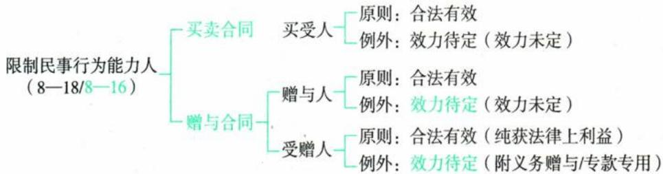

flowchart

```mermaid
graph TD
    A["限制民事行为能力人 (8—18/8—16)"] --> B["买卖合同"]
    A --> C["赠与合同"]
    B --> D["买受人"]
    D --> E["原则：合法有效"]
    D --> F["例外：效力待定（效力未定）"]
    C --> G["赠与人"]
    G --> H["原则：合法有效"]
    G --> I["例外：效力待定（效力未定）"]
    C --> J["受赠人"]
    J --> K["原则：合法有效（纯获法律上利益）"]
    J --> L["例外：效力待定（附义务赠与/专款专用）"]
```

(限制民事行为能力人独立实施的合同效力判断示意图)

限制民事行为能力人实施的民事法律行为是否与其年龄、智力、精神健康状况相适应，法院可以从行为与本人生活相关联的程度，本人的智力、精神健康状况能否理解其行为并预见相应的后果，以及标的、数量、价款或报酬等方面认定（《民法典总则编解释》第5条）。

#### >> 随堂练习

肖特有音乐天赋，16周岁便不再上学，以演出收入为主要生活来源。肖特成长过程中，多有长辈馈赠：7周岁时受赠口琴1个，9周岁时受赠钢琴1架，15周岁时受赠名贵小提琴1把。对肖特行为能力及其受赠行为效力的判断，根据《民法典》相关规定，下列哪一选项是正确的？（2017-3-2，单）①

A. 肖特尚不具备完全的民事行为能力
B. 受赠口琴的行为无效，应由其法定代理人代理实施
C. 受赠钢琴的行为无效，因与其当时的年龄智力不相当
D. 受赠小提琴的行为无效，因与其当时的年龄智力不相当

#### 三、监护

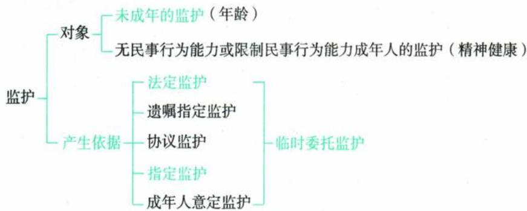

flowchart

```mermaid
graph TD
    A["监护"] --> B["对象"]
    A --> C["产生依据"]
    B --> D["未成年的监护（年龄）"]
    B --> E["无民事行为能力或限制民事行为能力成年人的监护（精神健康）"]
    C --> F["法定监护"]
    C --> G["遗嘱指定监护"]
    C --> H["协议监护"]
    C --> I["指定监护"]
    C --> J["成年人意定监护"]
    F --> K["临时委托监护"]
```

监护制度旨在保护无民事行为能力人或限制民事行为能力人的人身权利、财产权利以及其他合法权益，弥补其民事行为能力的不足（欠缺）。通说认为，监护乃为被监护人的利益而设，对于监护人而言，并无任何利益。因此，监护属于一种职责。我国《民法典》采用“广义监护概念”，为防止监护人“缺位”问题，意欲构建“以家庭监护为基础、以社会监护为补充、以国家监护为兜底”的三位一体中国特色监护制度体系。

#### (一) 监护人的确定(选框)①

#### 1. 法定监护。

法定监护

<table><tr><td>项目</td><td>未成年人</td><td>无民事行为能力或限制民事行为能力成年人</td></tr><tr><td>第一顺序</td><td>父母</td><td>配偶</td></tr><tr><td>第二顺序</td><td>祖父母、外祖父母</td><td>父母、子女</td></tr><tr><td>第三顺序</td><td>■ 姐</td><td>其他近亲属</td></tr><tr><td>第四顺序</td><td>其他愿意担任监护人的个人或组织,但是须经未成年人住所地的居民委员会、村民委员会或民政部门同意</td><td>其他愿意担任监护人的个人或组织,但是须经被监护人住所地的居民委员会、村民委员会或民政部门同意</td></tr><tr><td>第五顺序</td><td>补充主体:单位/公职监护人,即民政部门(机关法人/所属儿童福利机构收留抚养)或具备条件的居民委员会或村民委员会(即“两委”)</td><td>补充主体:单位/公职监护人,即民政部门(机关法人)或具备条件的居民委员会或村民委员会(即“两委”)</td></tr></table>

未成年人法定监护的本质是法律直接给孩子找监护人，有5个顺序限制（防止推卸责任）。监护人可以是自然人，也可以是法人（单位监护人）；可以是一个人（单独监护人），也可以是数个人（共同监护人）。

第一顺序：父母。基于父母责任为先原则，父母（包括自然血亲生父母/拟制血亲养父母/有抚养关系的继父母）作为未成年子女第一顺序（顺位）的法定监护人，具有法定性、首要性（优先性）、自然性和当然性，

（1）父母分居或离婚不影响监护也不影响侵权责任仅影响抚养（直接抚养或间接抚养）。

##### 随堂练习

■ 陆某因诈骗罪被判入狱，和妻子协议离婚，又方约定，2岁的儿子由陆某抚养，但实际是由陆某父母抚养。下列哪一说法是正确的？（2020金题-2-1-2，单）②

A. 陆某是唯一监护人
B. 陆某的妻子是唯一监护人
C. 夫妻二人均为监护人
D. 陆某的父母为监护人

(2) 父母一方死亡的，另一方为监护人。

第二顺序：祖父母、外祖父母。在父母双亡（包括自然死亡和宣告死亡）或均丧失监护能力的情况下，祖父母、外祖父母可以担任监护人，

第三顺序：兄姐。

第四顺序：其他愿意担任监护人的个人或组织，但是须经未成年人住所地的居民委员会、村民委员会或民政部门同意。

第五顺序：公职监护人，即民政部门（所属儿童福利机构收留抚养/社会福利或救助属于民政部门的法定职能）或具备条件的“两委”。没有依法具有监护资格的人的，监护人由民政部门担任，也可以由具备履行监护职责条件的被监护人住所地的居民委员会、村民委员会担任。单位监护人制度强化了国家的监护职能，且扮演着“兜底”的角色，

#### 2. 遗嘱指定监护。

遗嘱指定监护，是指被监护人的父母通过遗嘱为处于自己监护之下的子女指定监护人的民事法律行为（《民法典》第29条），

[萌主点拨] 遗嘱指定监护的本质是“父母死亡前通过遗嘱给孩子找监护人，无顺序人数限制”，

（1）主体只能是被监护人的父母且父母正在担任监护人。如父母因丧失监护能力而没有担任监护人或因侵害子女权益而被撤销监护资格，则不能通过遗嘱指定监护人。
(2) 方式只能是遗嘱且被指定的遗嘱监护人应当具有监护能力，经指定后确实无法履行监护义务的，应依法另行确定监护人（只要具有监护能力即可，无顺序人数限制）。
(3) 被指定的遗嘱监护人具有优先地位。

#### 3. 协议监护，

##### (1) 含义，

协议监护，是指在尊重被监护人真实意愿的基础上，依法具有监护资格的人之间通过协议确定监护人的制度。协议监护制度的立法功能在于通过监护人之间的意思自治对法定监护顺序进行适当的校正（必要补充/《民法典》第30条）。

[萌主点拨] 协议监护的本质是“开家庭会议给孩子找监护人，无顺序人数限制”（《民法典》第30条和《民法典总则编解释》第8条）。

##### (2) 类型，

未成年人的父母不得通过协议免除监护职责。未成年人的父母可以与他人约定在其丧失监护能力时由该他人担任监护人。父母双亡或均丧失监护能力的情形下，父母以外的其他具有监护资格的人之间可以根据各自与被监护人的生活联系状况、经济条件、能够提供的教育条件或生活照料措施等，在尊重被监护人意愿的基础上，经过充分协商，选择合适的监护人，既是对具有监护资格的人共同意愿的尊重，也有利于保护被监护人的合法权益。

[萌主点拨] 父母可以托孤但不得免责，

对于无、限民事行为能力成年人而言，协议的主体包括：配偶；父母、子女；其他近亲属；经该成年人住所地的居民委员会、村民委员会或民政部门同意的其他愿意担任监护人的个人或组织。

##### (3) 顺序。

基于被监护人利益最大化原则以及弱化监护顺序的发展趋势，协议监护不受法定监护顺序的限制，可以由不同顺序的人共同担任监护人，也可以由顺序在后的人担任监护人，

##### (4) 人数。

《民法典》对协议监护的监护人数量未作限制性规定。协议监护不受人数限制。协议确定的监护人可以是一个人，也可以是数个人，

#### 4. 指定监护。

##### (1) 含义。

指定监护，是指对监护人的确定有争议的情形下，由有关主体提出申请并由有关单位指定监护人的制度。指定监护的立法功能与协议监护相同，均是对法定监护制度顺序的校正（必要补充），不同于协议监护的是指定监护系通过有权机关的外力介入而非依靠监护人之间的意思自治（《民法典》第31条）。

[萌主点拨] 指定监护的本质是“4个单位给孩子找监护人，无顺序人数限制”。

##### (2) 前提。

指定监护的大前提是父母双亡或均丧失监护能力，小前提是其他监护人对监护人的确定有争议（包括争当和推卸/推诿两种情况）。

##### (3) 主体。

指定监护的主体包括4类组织，分别是被监护人住所地的居民委员会、村民委员会、民政部门和法院。

##### (4) 争议解决程序。

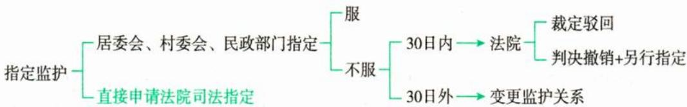

flowchart

```mermaid
graph TD
    A["指定监护"] --> B["居委会、村委会、民政部门指定"]
    A --> C["直接申请法院司法指定"]
    B --> D["服"]
    B --> E["不服"]
    E --> F["30日内"]
    E --> G["30日外"]
    F --> H["法院"]
    G --> I["变更监护关系"]
    H --> J["裁定驳回"]
    H --> K["判决撤销+另行指定"]
```

###### (指定监护争议解决程序体系框架图)

指定监护有两条路径（途径），由当事人择一选择：

其一，被监护人住所地的居民委员会、村民委员会或民政部门指定监护人（行政指定/没有终局效力①），有关当事人（对监护人的确定有争议的当事人，既包括被指定的监护人，也包括其他依法具有监护资格的人）对指定不服的，可以向法院提出申请指定监护人（司法指定/具有终局效力）。

其二，有关当事人也可以直接向法院提出申请，由法院指定监护人。

对于指定监护人案件，法院按照特别程序进行审理，将不服指定的有关当事人列为申请人，经审理认为指定并无不当，依法裁定驳回申请；认为指定不当，依法判决撤销指定并另行指定监护人。

##### (5) 择优指定原则。

居民委员会、村民委员会、民政部门或法院应当尊重被监护人的真实意愿，按照最有利于被监护人的原则在依法具有监护资格的人中指定监护人（无顺序人数限制）。

##### (6) 临时监护人。

监护争议的解决程序（监护争议发生时到监护争议解决时）需要一定的时间，在有关单位指定监护人前，被监护人的人身权利、财产权利及其他合法权益处于无人保护状态的，由被监护人住所地的居民委员会、村民委员会、法律规定的有关组织或民政部门担任临时监护人。

[萌主点拨] 临时监护人只能由4类组织担任，不能由自然人担任。

##### (7) 法律效力。

监护人被指定后，不得擅自变更；擅自变更的，不免除被指定的监护人的监护责任。擅自变更后的监护人也要根据过错程度承担相应的责任。

#### 5. 成年人意定监护。

##### (1) 含义。

成年人意定监护制度是立法对于我国正在步入老龄化社会过程中面临问题的积极回应。本质是“成年完人通过书面委托合同自己给自己找监护人，无顺序人数限制”。

[萌主点拨] 成年人意定监护的本质是委托合同。委托人和受托人双方均有任意解除权。

##### (2) 适用情形。

意定监护主要适用于成年人在全部或部分丧失行为能力前委任他人在其无判断能力时照护其人身或管理其财产的情形。

##### (3) 具体内容。

意定监护的成立以书面形式为要件。对监护协议的书面形式应当采用广义的理解。书面形式是合同书、信件、电报、电传、传真等可以有形地表现所载内容的形式。以电子数据交换、电子邮件等方式能够有形地表现所载内容，并可以随时调取查用的数据电文，视为书面形式。

监护协议双方在订立协议时均应具有完全民事行为能力。

##### (4) 效力。

成年人意定监护优先于法定监护。

#### 6. 临时委托监护。

##### (1) 含义。

临时委托监护，是指监护人将监护职责部分或全部委托他人代为（协助）履行的情况。

[萌主点拨] 临时委托监护的本质是“通过委托合同找人临时照顾被监护人（如留守儿童问题），无顺序人数限制。临时委托监护不导致监护职责的丧失，委托人依然是监护人，受托人有过错的，承担相应的责任”。

##### (2) 适用情形。

监护职责原则上应由监护人亲自履行。但是，实践中，由于未成年子女的父母或其他监护人要外出打工或工作繁忙或监督能力有限等监护障碍情况的大量存在，父母或其他监护人往往会和信得过的人签订委托合同，将监护职责部分或全部交由受托监护人行使。此时，如果被监护人造成他人损害的，由监护人承担侵权责任；受托人有过错的，承担与其过错及原因力相应的责任。

###### [萌主点拨]

协议监护 VS 临时委托监护

<table><tr><td>项目</td><td>协议监护</td><td>临时委托监护</td></tr><tr><td>相同点</td><td>有协议</td><td>有协议</td></tr><tr><td>法律依据</td><td>《民法典》第30条《民法典总则编解释》第8条</td><td>《民法典》第1189条《民法典总则编解释》第13条《民法典侵权责任编解释(一)》第10条</td></tr><tr><td>本质</td><td>开家庭会议给孩子找监护人,无顺序人数限制</td><td>通过委托合同找人临时照顾被监护人,无顺序人数限制</td></tr><tr><td>监护人资格</td><td>协议主体必须是有监护资格的人</td><td>受托人不受监护资格的限制,受托人可以是没有监护资格的人(高度人身信赖关系/如爸爸的哥们、妈妈的闺蜜等)</td></tr><tr><td>法律效果</td><td>导致监护职责的丧失(父母除外)</td><td>不导致监护职责的丧失,委托人依然是监护人</td></tr></table>

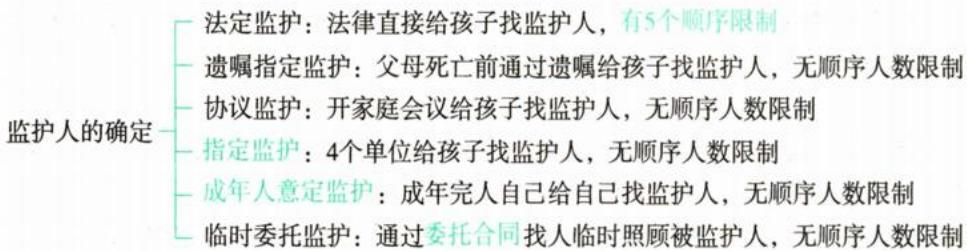

flowchart

```mermaid
graph TD
    A["监护人的确定"] --> B["法定监护：法律直接给孩子找监护人，有5个顺序限制"]
    A --> C["遗嘱指定监护：父母死亡前通过遗嘱给孩子找监护人，无顺序人数限制"]
    A --> D["协议监护：开家庭会议给孩子找监护人，无顺序人数限制"]
    A --> E["指定监护：4个单位给孩子找监护人，无顺序人数限制"]
    A --> F["成年人意定监护：成年完人自己给自己找监护人，无顺序人数限制"]
    A --> G["临时委托监护：通过委托合同找人临时照顾被监护人，无顺序人数限制"]
```

###### (监护人的确定体系框架图)

#### （二）监护人的职责

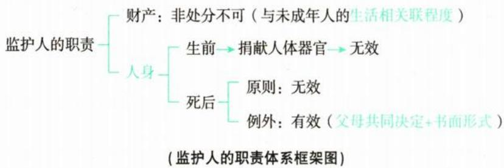

flowchart

```mermaid
graph TD
    A["监护人的职责"] --> B["财产：非处分不可（与未成年人的生活相关联程度）"]
    A --> C["人身"]
    C --> D["生前 → 捐献人体器官 → 无效"]
    C --> E["死后"]
    E --> F["原则：无效"]
    E --> G["例外：有效（父母共同决定+书面形式）"]
```

#### 1. 含义。

监护职责，是指监护人依法享有的监护权利和负担的监护义务的总称。

[萌主点拨] 教育机构（学校）仅负有教育、管理和保护的职责，未成年人在校期间监护职责并未转移给学校。

#### 2. 原则。

监护人应当按照最有利于被监护人的原则履行监护职责。“最有利于被监护人原则”对于未成年人监护而言，体现为要实现“未成年人最佳利益”；对于无、限成年人监护而言，体现为“尊重被监护人意愿”。

#### (1) 财产。

监护人除为维护被监护人利益外（非处分不可的程度），不得处分被监护人的财产（规范目的在于监督监护人依法履行监护职责）。判断监护人的处分行为是否为了被监护人的利益，应当以“一个处于与监护人同等情境下的理性人”的判断为标准，但不应以财产得丧为唯一标准。

[例] 甲8周岁，多次在国际钢琴大赛中获奖，并获得大量奖金。甲的父母乙、丙为了甲的利益，考虑到甲的奖金存放银行增值有限，遂将奖金全部购买了股票，但恰遇股市暴跌，甲的奖金损失过半。乙、丙作为监护人不能随意处分甲的财产。

#### (2) 人身。

基于“举轻以明重”的当然解释规则，监护人当然不能随意捐献被监护人的人体器官。

#### 3. 内容。

监护人的职责是代理被监护人实施民事法律行为，保护被监护人的人身权利、财产权利以及其他合法权益等。

#### (1) 未成年人。

未成年人的监护人履行监护职责，在作出与被监护人权益有关的决定时，应当根据被监护人的年龄和智力状况，尊重被监护人的真实意愿。

#### (2) 无、限民事行为能力成年人。

无、限成年人的监护人履行监护职责，应当最大程度地尊重被监护人的真实意愿，保障并协助被监护人实施与其智力、精神健康状况相适应的民事法律行为。对被监护人有能力独立处理的事务，监护人不得干涉。因发生突发事件等紧急情况，监护人暂时无法履行监护职责，被监护人的生活处于无人照料状态的，被监护人住所地的居民委员会、村民委员会或民政部门应当为被监护人安排必要的临时生活照料措施（《民法典》第34条）。

#### 4. 责任。

监护人不履行监护职责或侵害被监护人合法权益的，应当承担法律责任。

#### (三) 监护人资格的撤销①

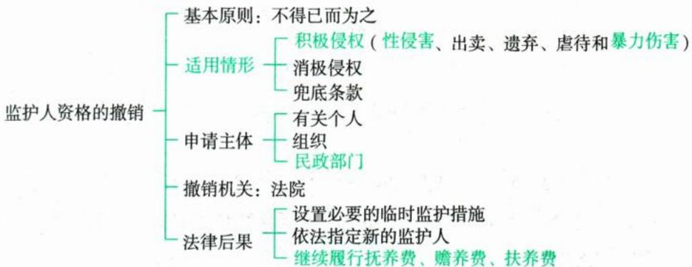

flowchart

```mermaid
graph TD
    A["监护人资格的撤销"] --> B["基本原则：不得已而为之"]
    A --> C["适用情形"]
    C --> D["积极侵权（性侵害、出卖、遗弃、虐待和暴力伤害）"]
    C --> E["消极侵权"]
    C --> F["兜底条款"]
    A --> G["申请主体"]
    G --> H["有关个人"]
    G --> I["组织"]
    G --> J["民政部门"]
    A --> K["撤销机关：法院"]
    A --> L["法律后果"]
    L --> M["设置必要的临时监护措施"]
    L --> N["依法指定新的监护人"]
    L --> O["继续履行抚养费、赡养费、扶养费"]
```

(监护人资格的撤销体系框架图)

#### 1. 基本原则。

基于追求被监护人最大利益原则，同时考虑我国实际国情和国际通行做法，撤销监护人资格只能适用于“极少数特别严重”的情形，本着“不得已而为之”的原则作为判断的标准。要严格区分监护侵害行为和不当教育方式（如轻微体罚）。

#### 2. 适用情形。

#### (1) 积极侵权行为。

积极侵权行为，是指实施了严重损害被监护人身心健康的行为。如性侵害、出卖、遗弃、虐待和暴力伤害等。

#### (2) 消极侵权行为。

消极侵权行为，是指怠于履行监护职责，或无法履行监护职责且拒绝将监护职责部分或全部委托给他人，导致被监护人处于危困状态。如有吸毒、赌博、长期酗酒等恶习无法正确履行监护职责或因服刑、被刑事羁押等原因无法履行监护职责，且拒绝将监护职责部分或全部委托给他人，致使未成年人处于困境或危险状态等。

#### (3) 兜底性条款。

兜底性条款，是指有严重侵害被监护人合法权益的其他行为的。如胁迫、诱骗、利用未成年人乞讨；教唆、利用未成年人实施违法犯罪行为，情节恶劣；监护人使用被监护人的财产为他人购买房产，严重侵害被监护人的财产权。

#### 3. 申请主体。

有关个人（其他依法具有监护资格的人）和组织（居民委员会、村民委员会、学校、医疗机构、妇女联合会、残疾人联合会、未成年人保护组织、依法设立的老年人组织、民政部门等）。

个人和民政部门以外的组织未及时向人民法院申请撤销监护人资格的，民政部门应当向人民法院申请。

#### 4. 撤销机关。

撤销机关为法院（适用特别程序）。

#### 5. 法律后果。

(1) 设置必要的临时监护措施。

(2) 依法指定新的监护人。

（3）为保护被监护人的生存利益，监护人资格被撤销后，并不免除父母、子女、配偶等基于血缘等关系确立的抚养义务，抚养义务是法定义务，独立于监护关系而存在。依法负担被监护人抚养费、赡养费、扶养费的父母、子女、配偶等，被法院撤销监护人资格后，应当继续履行负担的义务。

#### （四）监护人资格的恢复

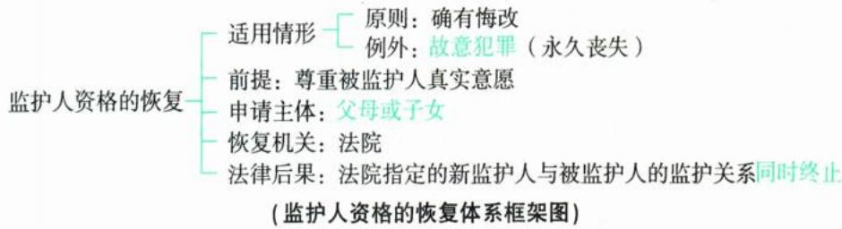

flowchart

```mermaid
graph TD
    A["监护人资格的恢复"] --> B["适用情形"]
    A --> C["前提：尊重被监护人真实意愿"]
    A --> D["申请主体：父母或子女"]
    A --> E["恢复机关：法院"]
    A --> F["法律后果：法院指定的新监护人与被监护人的监护关系同时终止"]
    B --> G["原则：确有悔改"]
    B --> H["例外：故意犯罪（永久丧失）"]
    D --> I["法律后果：法院指定的新监护人与被监护人的监护关系同时终止"]
```

#### 1. 适用情形。

监护人资格恢复的情形为确有悔改表现。但是，对被监护人实施故意犯罪的不得恢复。监护人因对被监护人实施故意犯罪而被撤销监护人资格，意味着其监护资格永久丧失，无法再恢复。对于确有悔改表现，法院应当“从严把握”，不能仅要求其具有悔改的意愿，而且必须具有悔改行为。

#### 2. 前提。

监护人资格恢复的前提是尊重被监护人真实意愿。

#### 3. 申请主体。

监护人资格恢复的申请人为被监护人的父母或子女。为最大限度地维护被监护人的利益，避免被监护人遭受二次侵害，能够申请恢复监护人资格的主体仅限于父母或子女，作为监护人的其他个人或组织一旦被撤销监护人资格，即不再恢复。因为父母子女之间的关系是精神和情感的寄托，立法在维持监护关系稳定性和亲权、亲属关系的价值衡量上，选择了后者。

#### 4. 恢复机关。

监护人资格恢复的机关为法院。监护人资格的恢复必须依照法定程序进行，最终，由法院判断是否准予恢复。即便监护人有悔改表现，且被监护人愿意恢复监护关系，该监护关系也不能当然恢复。

#### 5. 法律后果。

监护人资格恢复后，法院指定的新监护人与被监护人的监护关系同时终止。

##### 随堂练习

2015年2月，家住W县的孙某（男，51周岁，有配偶）依法收养了孤儿小丽（女，11周岁）为养女，后孙某多次对小丽实施性侵害，造成小丽先后产下两名女婴。2017年5月，当地群众向公安机关匿名举报，媒体也纷纷曝光此事。2017年8月，当地法院判决孙某构成强奸罪，判处有期徒刑3年。关于本案，下列哪些说法是错误的？(2018金题-2-1-4，多)①

A. W县民政部门可以直接撤销孙某的监护人资格
B. 孙某被人民法院撤销监护资格后可以不再给付抚养费
C. 孙某出狱后，如确有悔改表现的，经其申请，人民法院可以恢复其监护人资格
D. 小丽对孙某的损害赔偿请求权的诉讼时效期间自法定代理终止之日起计算

#### (五) 监护关系的终止 $^{①}$

#### 1. 含义。

监护关系的终止，是指因某种法律事实存在，监护人和被监护人之间关于监护权利义务和职责关系归于消灭（《民法典》第39、175条）。

#### 2. 情形。

(1) 绝对终止。被监护人取得或恢复完全民事行为能力；被监护人或监护人死亡。

（2）相对终止。监护人丧失监护能力；法院认定监护关系终止的其他情形，如监护人被法院撤销监护人资格、监护人有正当理由辞去指定监护或有正当理由向法院申请变更监护人并得到法院许可②。

[萌主点拨] 父母离婚后，为子女更改姓名的，监护关系不终止。

#### 3. 法律后果。

监护关系终止后，被监护人仍然需要监护的，应当依法另行确定监护人。

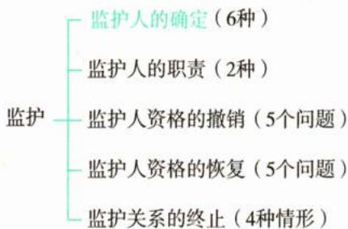

flowchart

```mermaid
graph TD
    A["监护"] --> B["监护人的确定（6种）"]
    A --> C["监护人的职责（2种）"]
    A --> D["监护人资格的撤销（5个问题）"]
    A --> E["监护人资格的恢复（5个问题）"]
    A --> F["监护关系的终止（4种情形）"]
```

(监护复盘体系框架图)

#### 四、宣告失踪（特别程序） $^{③}$

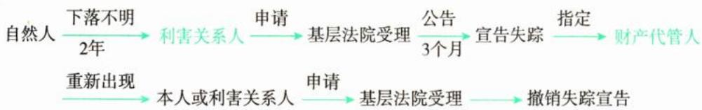

flowchart

```mermaid
graph LR
    A["自然人"] -->|下落不明\n2年| B["利害关系人"]
    B -->|申请| C["基层法院受理"]
    C -->|公告\n3个月| D["宣告失踪"]
    D -->|指定| E["财产代管人"]
    F["重新出现"] --> G["本人或利害关系人"]
    G -->|申请| H["基层法院受理"]
    H --> I["撤销失踪宣告"]
```

(宣告失踪法律关系流程图)

宣告失踪，既不影响人身关系（如配偶、父母和子女关系），又不影响财产关系（财产不发生物权变动），仅为失踪人设置财产代管人。同时，一方失踪的，配偶有权提起离婚诉讼。《民法典》第40—45条以及《民法典总则编解释》第14、15条共8条规定了宣告失踪制度。宣告失踪是对一种不确定的自然事实状态的司法确认，旨在结束失踪人财产关系的不确定（不稳定/悬而未决）状态，重在保护失踪人的财产利益兼顾利害关系人的财产利益。

#### (一) 含义

宣告失踪，是指自然人离开自己的住所下落不明达到法定期限，经该自然人的利害关系人申请，法院依照法定程序宣告其为失踪人的民事法律制度。

#### (二) 情形

自然人下落不明满2年。自然人下落不明的时间，从该自然人失去音讯之日起计算。战争期间下落不明的，下落不明的时间自战争结束之日起计算。

#### (三) 程序

#### 1. 申请。

宣告失踪，法院“不告不理”。申请人是利害关系人。

#### 2. 受理。

自然人下落不明满2年，利害关系人申请宣告其失踪的，向下落不明人住所地基层法院提出。申请书应当写明失踪的事实、时间和请求，并附有公安机关或其他有关机关关于该自然人下落不明的书面证明。住所地与经常居住地不一致的，由经常居住地的基层法院受理。

#### 3. 公告。

法院受理宣告失踪案件后，应当发出寻找下落不明人的公告。宣告失踪的公告期间为3个月。公告期间届满，法院应当根据被宣告失踪的事实是否得到确认，作出宣告失踪的判决或驳回申请的判决。

#### (四) 法律效力

宣告失踪的效力是考试中需要重点关注的考点，核心就是财产代管人制度。

#### 1. 确定。

失踪人的财产由如下4类有资格的人担任财产代管人且无顺序人数限制，分别是配偶、父母、成年子女和其他愿意担任财产代管人的人。无上述人员或上述人员无代管能力或有争议的，由法院指定（保护失踪人财产原则和尊重失踪人意思自治原则相结合）。

#### 2. 法律地位。

#### (1) 实体地位（职责）。

财产代管人作为善良管理人应当妥善管理失踪人的财产，维护其财产权益。失踪人所欠税款、债务和应付的其他费用（包括赡养费、扶养费、抚养费和因代管财产所需的管理费等必要的费用），由财产代管人从失踪人的财产中支付。

[萌主点拨] 财产代管人没有处分失踪人财产的权利。财产代管人处分失踪人的财产或夫妻共同财产（如房屋、轿车等），属于无权处分，相对人有可能善意取得财产所有权。

#### (2) 程序地位（诉讼地位）。

基于 “诉讼担当理论”，财产代管人可以以自己的名义起诉应诉。失踪人的财产代管人向失踪人的债务人请求偿还债务的，法院应当将财产代管人列为原告。

债权人提起诉讼，请求失踪人的财产代管人支付失踪人所欠的债务和其他费用的，法院应当将财产代管人列为被告。经审理认为债权人的诉讼请求成立的，法院应当判决财产代管人从失踪人的财产中支付失踪人所欠的债务和其他费用。

#### 3. 责任。

财产代管人因故意或重大过失造成失踪人财产损失的，应当承担赔偿责任。财产代管人从事的是一种无偿行为（可以参照无偿保管合同），仅负有善良管理人的注意义务，即能够像管理自己事务一样管理失踪人的财产。

#### 4. 变更。

#### (1) 利害关系人申请。

财产代管人不履行代管职责、侵害失踪人财产权益或丧失代管能力的，失踪人的利害关系人可以向法院申请变更财产代管人。

#### (2) 代管人自己申请。

财产代管人有正当理由的，可以向法院申请变更财产代管人。法院变更财产代管人的，变更后的财产代管人有权要求原财产代管人及时移交有关财产并报告财产代管情况。

#### (五) 撤销

失踪人重新出现，经本人或利害关系人申请，法院应当撤销失踪宣告。失踪人重新出现，有权要求财产代管人及时移交有关财产并报告财产代管情况。重新出现，是指重新得到了失踪人的音讯，从而消除了其下落不明的状态。撤销失踪宣告的申请人无顺序先后的限制。

#### >> 随堂练习

袁某和祖某系夫妻，后二人吵架，袁某离家出走。2年后，依祖某申请，法院宣告袁某失踪。关于本案，下列哪一说法是正确的？(2022金题-2-1-1，单) $^{①}$

A. 袁某被宣告失踪后，丧失民事行为能力
B. 袁某被宣告失踪后，祖某可以继承袁某财产
C. 袁某父母不同意，可以申请撤销失踪宣告
D. 祖某提出离婚诉讼的，法院应当准许

#### 五、宣告死亡（特别程序） $^{②}$

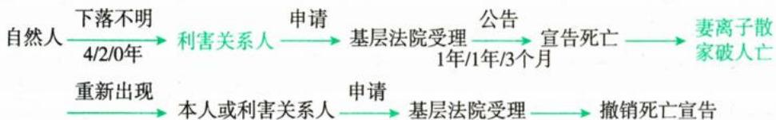

flowchart

```mermaid
graph LR
    A["自然人"] -->|下落不明\n4/2/0年| B["利害关系人"]
    B -->|申请| C["基层法院受理"]
    C -->|公告\n1年/1年/3个月| D["宣告死亡"]
    D --> E["妻离子散家破人亡"]
    F["重新出现"] --> G["本人或利害关系人"]
    G -->|申请| H["基层法院受理"]
    H --> I["撤销死亡宣告"]
```

(宣告死亡法律关系流程图)

宣告死亡，既影响人身关系（如配偶、父母和子女关系），又影响财产关系（财产发生物权变动），本质上就是“妻离子散，家破人亡”。《民法典》第46—53条以及《民法典总则编解释》第16、17条共10条规定了宣告死亡制度。宣告死亡旨在解决因失踪人生死不明而引起的民事法律关系的不确定（不稳定/悬而未决）问题，重在保护被宣告死亡人的利害关系人的利益。

#### (一) 含义

宣告死亡，是指自然人下落不明达到法定期限，经利害关系人申请，法院经过法定程序在法律上推定失踪人死亡的一项民事法律制度。

#### (二) 情形

宣告死亡的情形可以概括为 3 个数字，即 “420”，分别是：一般情形满 4 年，意外事件满 2 年，意外事件且证明，0 年（随时）。

1. 一般情形（普通期间），下落不明满4年；
2. 因意外事件，下落不明满 2 年（特殊期间）；
3. 因意外事件下落不明，经有关机关证明该自然人不可能生存的，即意外事件且证明，随时（特殊期间）。

一般而言，意外事件，是指非因当事人的故意或过失而偶然发生的事故。典型的意外事件包括：洪水、海啸、地震、沉船、火车脱轨、飞机失联或失事等。

#### (三) 程序

1. 申请。

宣告死亡将产生与自然死亡（生理死亡）基本相同的法律后果。因此，对于申请宣告自然人死亡的利害关系人必须进行严格限制（《民法典总则编解释》第16条）。

##### [萌主点拨]

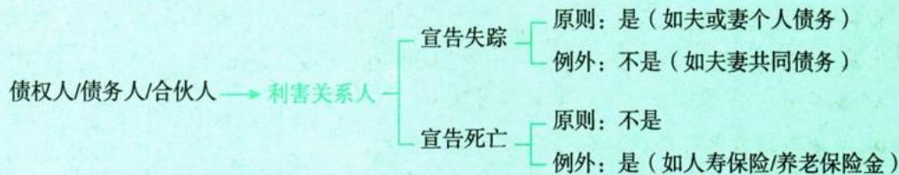

flowchart

```mermaid
graph TD
    A["债权人/债务人/合伙人"] --> B["利害关系人"]
    B --> C["宣告失踪"]
    B --> D["宣告死亡"]
    C --> E["原则：是（如夫或妻个人债务）"]
    C --> F["例外：不是（如夫妻共同债务）"]
    D --> G["原则：不是"]
    D --> H["例外：是（如人寿保险/养老保险金）"]
```

(宣告失踪和宣告死亡利害关系人体系框架图)

利害关系人

<table><tr><td>主体</td><td>宣告失踪</td><td>宣告死亡</td></tr><tr><td>配偶、父母、子女(第一顺序法定继承人)</td><td>是</td><td>是</td></tr><tr><td>履行赡养义务的丧偶儿媳、丧偶女婿(第一顺序拟制继承人)</td><td>是</td><td>是</td></tr><tr><td>其他近亲属</td><td>是</td><td>是(有条件)</td></tr><tr><td>代位继承人</td><td>是</td><td>是(有条件)</td></tr><tr><td>债权人、债务人、合伙人</td><td>是(有例外:不申请宣告失踪不影响其权利行使、义务履行的除外)</td><td>不是(有例外:不申请宣告死亡不能保护其相应合法权益的除外)</td></tr></table>

#### 2. 受理。

自然人下落不明满4年，或因意外事件下落不明满2年，或因意外事件下落不明，经有关机关证明该自然人不可能生存，利害关系人申请宣告其死亡的，向下落不明人住所地基层法院提出。申请书应当写明下落不明的事实、时间和请求，并附有公安机关或其他有关机关关于该自然人下落不明的书面证明。住所地与经常居住地不一致的，由经常居住地的基层法院受理（同宣告失踪）。

#### 3. 公告。

一般情形，公告期为1年；意外事件，公告期为1年；意外事件且证明，公告期为3个月。

#### (四) 宣告

#### 1. 原则。

被宣告死亡的人，法院宣告死亡的判决作出之日视为其死亡日期；判决作出之日，即判决书上所载明的文书作出日期。

#### 2. 例外。

因意外事件下落不明宣告死亡的，意外事件发生之日视为其死亡的日期。意外事件情形下，失踪人存活的概率是比较低的。因此，基于实事求是的精神，意外事件发生之日往往就是真实的死亡日期（《民法典》第48条）。

#### (五) 法律效力

宣告死亡的法律效力

<table><tr><td>内容</td><td>死亡宣告后</td><td colspan="2">死亡宣告撤销后(结论:不一定)</td></tr><tr><td rowspan="3">妻离(配偶权)</td><td rowspan="3">与配偶的婚姻关系自动消除</td><td>原则</td><td>自动恢复</td></tr><tr><td rowspan="2">例外</td><td>1. 配偶“结过婚”,包括配偶再婚、再婚后又离婚、再婚后配偶又死亡(自然死亡或宣告死亡)</td></tr><tr><td>2. 配偶向民政部门“书面声明”不愿意恢复(保护配偶的婚姻自主权/《民法典》第51条)</td></tr><tr><td rowspan="3">子散(亲子权)</td><td rowspan="3">一方有权单方送养子女(配偶一方死亡,另一方送养未成年子女的,死亡一方的父母有优先抚养的权利)</td><td>原则</td><td>不得以未经本人同意为由主张收养行为无效要回子女</td></tr><tr><td rowspan="2">例外</td><td>1. 被收养人不满8周岁的,仅收养人同意,即能要回</td></tr><tr><td>2. 被收养人8周岁以上的,收养人和被收养人均同意,方能要回</td></tr><tr><td rowspan="2">家破(继承权)</td><td rowspan="2">个人合法财产按照遗产开始继承</td><td>原则</td><td>返还</td></tr><tr><td>例外</td><td>已经发生物权变动的,不能请求返还,但可以请求行为人适当补偿;利害关系人隐瞒真实情况,致使他人被宣告死亡而取得其财产的,除应当返还财产外,还应当对由此造成的损失承担赔偿责任(侵权责任)</td></tr><tr><td>人亡</td><td>推定为自然死亡(生理死亡)丧失民事主体资格</td><td colspan="2">自然人被宣告死亡但是并未死亡的,不影响该自然人在被宣告死亡期间实施的民事法律行为的效力(具体问题具体分析/《民法典》第49条)</td></tr></table>

#### (六) 撤销

被宣告死亡的人重新出现，经本人或利害关系人申请，法院应当撤销死亡宣告。重新出现，是指重新得到了失踪人的音讯，从而消除了其下落不明的状态。撤销死亡宣告的申请人无顺序先后的限制。

#### (七) 宣告死亡和宣告失踪的关系

宣告失踪不是宣告死亡的必经程序，利害关系人只申请宣告失踪的，即使符合宣告死亡的条件，也只能宣告失踪。对同一自然人，有的利害关系人申请宣告死亡，有的申请宣告失踪，符合《民法典》规定的宣告死亡条件的，法院应当宣告死亡（《民法典》第47条）。

##### 萌主点拨]

宣告失踪 VS 宣告死亡

<table><tr><td>项目</td><td>宣告失踪</td><td>宣告死亡</td></tr><tr><td>法律依据</td><td>《民法典》第40—45条(共6条)《民法典总则编解释》第14、15条</td><td>《民法典》第46—53条(共8条)《民法典总则编解释》第16、17条</td></tr><tr><td>功能</td><td>保护失踪人利益</td><td>保护利害关系人利益</td></tr><tr><td>影响</td><td>既不影响人身关系,也不影响财产关系</td><td>既影响人身关系,也影响财产关系</td></tr><tr><td>情形</td><td>下落不明满2年</td><td>下落不明满4、2、0年</td></tr><tr><td>申请</td><td>利害关系人(无顺序)</td><td>利害关系人(无顺序但有条件)</td></tr><tr><td>受理</td><td>基层法院</td><td>基层法院</td></tr><tr><td>公告</td><td>3个月</td><td>1年、1年或3个月</td></tr><tr><td>效果</td><td>财产代管人(以自己的名义起诉应诉/适格原被告)</td><td>妻离、子散、家破、人亡</td></tr><tr><td>重大财产处分</td><td>无权处分(善意取得)</td><td>有权处分(继受取得)</td></tr><tr><td>撤销事由</td><td>重新出现</td><td>重新出现</td></tr><tr><td>撤销申请</td><td>本人和利害关系人(无顺序)</td><td>本人和利害关系人(无顺序)</td></tr></table>

#### >> 随堂练习

甲、乙为夫妻，长期感情不和。2010年5月1日甲乘火车去外地出差，在火车上失踪，没有发现其被害尸体，也没有发现其在何处下车。2016年6月5日法院依照法定程序宣告甲死亡。之后，乙向法院起诉要求铁路公司对甲的死亡进行赔偿。关于甲被宣告死亡，下列哪些说法是正确的？(2016-3-51，多) $^{①}$

A. 甲的继承人可以继承其财产
B. 甲、乙婚姻关系消灭，且不可能恢复
C. 2016年6月5日为甲的死亡日期
D. 铁路公司应当对甲的死亡进行赔偿

### 第二节 法人

#### 复习提要

法人规定在《民法典》第一编总则第三章（第57—101条），共45条。本节主要涉及五个问题。分别是：1. 民事权利能力和民事行为能力；2. 法人的法定分类；3. 法人的学理分类；4. 基金会；5. 法定代表人。其中，法定代表人系最为重要的考点，在备考中必须重点掌握。

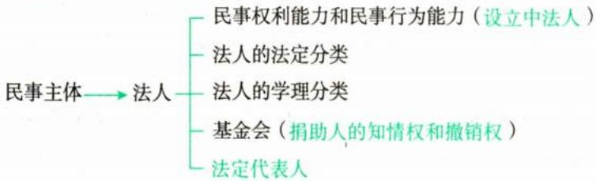

flowchart

```mermaid
graph TD
    A["民事主体"] --> B["法人"]
    B --> C["民事权利能力和民事行为能力（设立中法人）"]
    B --> D["法人的法定分类"]
    B --> E["法人的学理分类"]
    B --> F["基金会（捐助人的知情权和撤销权）"]
    B --> G["法定代表人"]
```

#### 一、民事权利能力和民事行为能力①

学好法人制度的基础和前提是回答这样一个问题：法人是法律意义上的人吗？答：是。因为法人是具有民事权利能力和民事行为能力，依法独立享有民事权利和承担民事义务的组织（《民法典》第57条）。

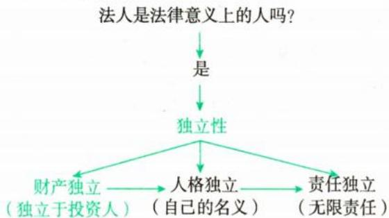

flowchart

```mermaid
graph TD
    A["法人是法律意义上的人吗？"] --> B["是"]
    B --> C["独立性"]
    C --> D["财产独立\n(独立于投资人)"]
    C --> E["人格独立\n(自己的名义)"]
    C --> F["责任独立\n(无限责任)"]
```

(法人基本制度示意图)

[例] 自然人孟某、马某、曹某和徐某4人共同出资设立了一家以房地产开发为业（经营范围）的天津众森实业有限责任公司（营利法人）。根据上述案情，请回答如下问题：

(1) 本案中存在几个民事主体?

答：5个。分别是：自然人孟某；自然人马某；自然人曹某；自然人徐某和法人众森公司。

(2) 孟某以一辆价值 100 万元的轿车出资, 交付于众森公司并办理了车辆过户登记手续。请问: 该辆轿车的所有权人是谁?

答：众森公司。

(3) 孟某将轿车出资后，欲使用该轿车1周，是否需要向众森公司支付费用？

答：需要。

(4) 孟某的财产和众森公司的财产是相互独立的吗?

答：是。因为公司的财产和投资人（股东）的个人财产互相分离、互相独立（财产独立/无财产即无人格，有财产才有人格）。

（5）众森公司成立后，以投资人（孟某、马某、曹某和徐某）的名义还是以自己的名义对外签订合同？

答：自己的名义。因为公司是独立的民事主体，应当以自己的名义签订合同（人格独立）。

(6) 众森公司和海马公司签订了一份价值 2000 万元的钢材购销合同。后众森公司违约，债权人海马公司是追究投资人（孟某、马某、曹某和徐某）的违约责任还是众森公司的违约责任？

答：众森公司。因为公司是独立的民事主体，应当独立承担违约责任（责任独立）。

(7) 众森公司（有限责任公司）对外承担有限责任还是无限责任？

答：无限责任。

(8) 众森公司（有限责任公司）的投资人（股东）孟某对外承担有限责任还是无限责任？

答：有限责任。

##### [萌主点拨]

民事责任

<table><tr><td>类型</td><td>责任内容</td></tr><tr><td>有限责任</td><td>责任主体以其特定财产承担责任(如有限责任公司的股东仅以其认缴的出资额为限承担有限责任/责任范围)</td></tr><tr><td>无限责任(保证)</td><td>责任主体以其全部财产承担责任(责任范围)</td></tr><tr><td>连带责任</td><td>2个以上的责任主体承担责任(责任人数/总分公司不连带)</td></tr><tr><td>无限连带责任(共同侵权)</td><td>2个以上的责任主体承担责任且均以其全部财产承担责任(责任范围+责任人数)</td></tr></table>

#### (一) 基本原理

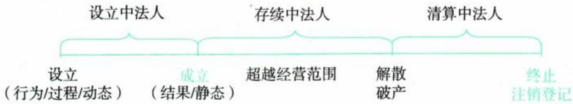

flowchart

```mermaid
graph LR
    A["设立中法人"] --> B["设立 (行为/过程/动态)"]
    A --> C["成立 (结果/静态)"]
    D["存续中法人"] --> E["超越经营范围"]
    D --> F["解散 破产"]
    G["清算中法人"] --> H["终止 注销登记"]
```

(法人的民事权利能力和民事行为能力示意图)

法人的民事权利能力和民事行为能力

<table><tr><td>项目</td><td>设立中法人</td><td>存续中法人</td><td>清算中法人</td></tr><tr><td>法人资格</td><td>无</td><td>有</td><td>有</td></tr><tr><td>民事诉讼权利能力</td><td>无</td><td>以自己的名义起诉应诉</td><td>以自己的名义起诉应诉</td></tr><tr><td>性质</td><td>视为合伙关系</td><td>超越经营范围的,原则有效,禁止经营、限制经营和特许经营的无效</td><td>只能从事与清算有关的活动,超出部分所从事的民事法律行为无效</td></tr></table>

#### (二) 设立中法人①

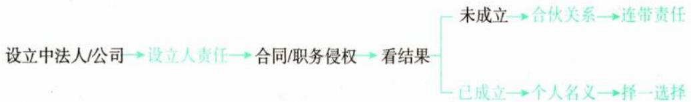

flowchart

```mermaid
graph LR
    A["设立中法人/公司"] --> B["设立人责任"]
    B --> C["合同/职务侵权"]
    C --> D["看结果"]
    D --> E["未成立"]
    E --> F["合伙关系"]
    F --> G["连带责任"]
    D --> H["已成立"]
    H --> I["个人名义"]
    I --> J["择一选择"]
```

(设立中法人/公司设立人责任法律思维导图)

设立中法人的责任承担

<table><tr><td>法人未成立</td><td colspan="4">为保护债权人的利益,各设立人(全体设立人)视为合伙关系2,对外承担无限连带责任</td></tr><tr><td rowspan="3">法人成立</td><td>谁的名义</td><td>合同相对性原理</td><td>利益承受理论</td><td>责任承担</td></tr><tr><td>设立人以设立中法人的名义</td><td>法人</td><td>法人</td><td>法人</td></tr><tr><td>设立人以自己的名义</td><td>设立人</td><td>法人</td><td>择一选择</td></tr></table>

#### >> 随堂练习

黄逢、黄现和金耘共同出资，拟设立名为“黄金黄研究会”的社会团体法人。设立过程中，黄逢等3人以黄金黄研究会名义与某科技园签署了为期3年的商铺租赁协议，月租金5万元，押3付1。此外，金耘为设立黄金黄研究会，以个人名义向某印刷厂租赁了一台高级印刷机。关于某科技园和某印刷厂的债权，下列哪些选项是正确的？(2017-3-53，多)③

A. 如黄金黄研究会未成立，则某科技园的租赁债权消灭
B. 即便黄金黄研究会未成立，某科技园就租赁债权，仍可向黄逢等3人主张
C. 如黄金黄研究会未成立，则就某科技园的租赁债务，由黄逢等3人承担连带责任
D. 黄金黄研究会成立后，某印刷厂就租赁债权，既可向黄金黄研究会主张，也可向金耘主张

#### （三）存续中法人④

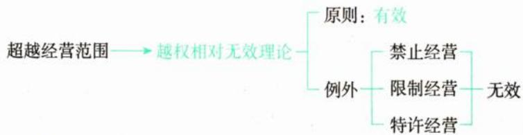

flowchart

```mermaid
graph TD
    A["超越经营范围"] --> B["越权相对无效理论"]
    B --> C["原则：有效"]
    B --> D["例外"]
    D --> E["禁止经营"]
    D --> F["限制经营"]
    D --> G["特许经营"]
    E --> H["无效"]
```

(超越经营范围越权相对无效理论体系框架图)

① 考查 3 次，应重点掌握，该考点系主观题阶段的重点。
② 合伙关系的本质是“四共”，即共同出资、共同经营、共享收益、共担风险。通俗而言，就是“有福同享、有难同当”。
③ 答案：BCD。
④ 考查 1 次，了解即可。

超越依法登记的经营范围从事经营活动的，除违反法律、行政法规有关限制经营、特许经营或禁止经营的规定外，不影响民事法律行为的效力。禁止经营的无效，如毒品。限制经营的无效，如精神麻醉药品、黄金制品。特许经营的无效，如烟草。一言以蔽之，超越经营范围的，原则有效，禁、限、特，无效。

[例] 装修公司甲在完成一项工程后，将剩余的木地板、厨卫用具等卖给了物业管理公司乙。但甲营业执照上的核准经营范围并无销售木地板、厨卫用具等业务。甲乙的买卖行为合法有效。

#### 二、法人的法定分类①

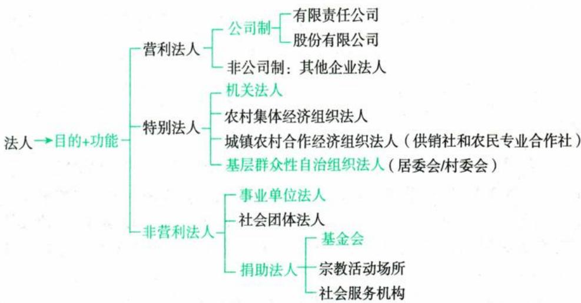

flowchart

```mermaid
graph TD
    A["法人→目的+功能"] --> B["营利法人"]
    A --> C["特别法人"]
    A --> D["非营利法人"]
    B --> E["公司制"]
    B --> F["非公司制：其他企业法人"]
    E --> G["有限责任公司"]
    E --> H["股份有限公司"]
    C --> I["机关法人"]
    C --> J["农村集体经济组织法人"]
    C --> K["城镇农村合作经济组织法人（供销社和农民专业合作社）"]
    C --> L["基层群众性自治组织法人（居委会/村委会）"]
    D --> M["事业单位法人"]
    D --> N["社会团体法人"]
    D --> O["捐助法人"]
    O --> P["基金会"]
    O --> Q["宗教活动场所"]
    O --> R["社会服务机构"]
```

(法人的法定分类体系框架图)

法人的法定分类，即中国的法人分类。根据法人设立的目的（宗旨）和功能等方面的不同，中国的法人分为营利法人、非营利法人和特别法人三类。

#### (一) 营利法人

#### 1. 含义。

营利法人，是指以取得利润并分配给股东等出资人为目的成立的法人。“营利”的本质不是对外取得利润，而是对内将利润分配给股东等出资人（《民法典》第76条）。

通俗而言，营利法人就是“向投资人/出资人分钱的法人”。

[例] 孟某出资 100 万元设立一家以法考培训为业的北京献贵教育科技有限责任公司（以下简称献贵教育）。开业一年，献贵教育获利 2000 万元，并分配给股东孟某。孟某出资成立献贵教育这一营利法人的目的不是对外营业获利 2000 万元，而是将 2000 万元利润分配给自己。

#### 2. 分类。

#### (1) 公司制营利法人。

公司制营利法人，是指受《中华人民共和国公司法》（以下简称《公司法》）调整的营利法人。包括有限责任公司和股份有限公司。

#### (2) 非公司制营利法人。

非公司制营利法人，是指不受《公司法》调整的其他企业法人。

#### 3. 成立。

营利法人登记时取得法人资格①。

#### (二) 非营利法人

#### 1. 含义。

非营利法人，是指为公益目的或其他非营利目的成立，不向出资人、设立人或会员分配所取得利润的法人（《民法典》第87条）。

通俗而言，非营利法人就是“不向投资人/出资人分钱的法人”。

[萌主点拨]

营利法人 VS 非营利法人

<table><tr><td>法人类型</td><td>是否可以从事经营(营利)活动</td><td>利润分配请求权</td><td>剩余财产分配请求权</td></tr><tr><td>营利法人</td><td>√</td><td>√</td><td>√</td></tr><tr><td rowspan="2">非营利法人</td><td rowspan="2">√</td><td rowspan="2">×</td><td>×(以公益目的成立的非营利法人2)</td></tr><tr><td>√(其他非营利目的成立的非营利法人3)</td></tr></table>

营利法人和非营利法人的区别关键不在于法人是否可以从事经营（营业）活动，而在于经营（营业）活动所得的归属。如果分配给其成员的，为营利法人；否则，为非营利法人。据此可知，营利法人和非营利法人的本质区别在法人的内部而非外部。

#### 2. 分类。

#### (1) 事业单位法人。

事业单位法人，是指具备法人条件，为适应经济社会发展需要，提供公益服务设立的事业单位。典型的事业单位法人包括公立的学校和医院等。在我国《民法典》意义上的事业单位法人属于公益法人（《民法典》第88、89条）。

#### (2) 社会团体法人。

社会团体法人，是指具备法人条件，基于会员共同意愿，为公益目的或会员共同利益等非营利目的设立的社会团体。典型的社会团体法人包括律师协会、中国法学会等（《民法典》第90、91条）。

#### (3) 捐助法人。

捐助法人，是指具备法人条件，为公益目的以捐助财产设立的基金会、社会服务机构等。典型的捐助法人包括基金会、社会服务机构（图书馆、博物馆）和宗教活动场所（《民法典》第92—94条）。

#### 3. 成立。

非营利法人的成立

<table><tr><td>类型</td><td>成立标准</td></tr><tr><td>事业单位法人</td><td>区分原则(有的登记,有的成立)。事业单位法人经依法登记成立,取得事业单位法人资格;依法不需要办理法人登记的,从成立之日起,具有事业单位法人资格</td></tr><tr><td>社会团体法人</td><td>区分原则(有的登记,有的成立)。社会团体法人经依法登记成立,取得社会团体法人资格;依法不需要办理法人登记的,从成立之日起,具有社会团体法人资格1</td></tr><tr><td>捐助法人(基金会)</td><td>登记时(民政部门)</td></tr></table>

#### (三) 特别法人

有独立经费的机关和承担行政职能的法定机构从成立之日起，具有机关法人（一府两院）资格，可以从事为履行职能所需要的民事活动。

#### 三、法人的学理分类 $^{②}$

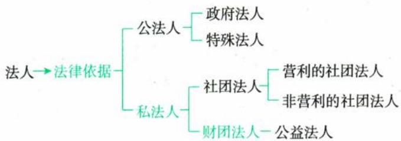

flowchart

```mermaid
graph TD
    A["法人→法律依据"] --> B["公法人"]
    A --> C["私法人"]
    B --> D["政府法人"]
    B --> E["特殊法人"]
    C --> F["社团法人"]
    C --> G["财团法人"]
    F --> H["营利的社团法人"]
    F --> I["非营利的社团法人"]
    F --> J["公益法人"]
```

(法人的学理分类体系框架图)

法人的学理分类，即传统大陆法系的法人分类。根据法人设立的法律依据（功能）的不同，法人分为公法人（依据公法而设立）和私法人（依据民商法而设立）。

私法人，根据成立基础的不同，将私法人分为社团法人和财团法人两类。

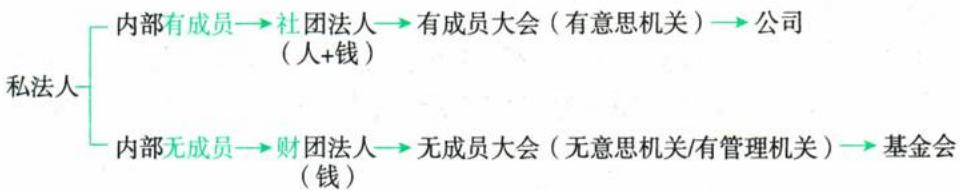

flowchart

```mermaid
graph TD
    A["私法人"] --> B["内部有成员"]
    A --> C["内部无成员"]
    B --> D["社团法人"]
    D --> E["有成员大会（有意思机关）"]
    E --> F["公司（人+钱）"]
    C --> G["财团法人"]
    G --> H["无成员大会（无意思机关/有管理机关）"]
    H --> I["基金会"]
```

(私法人体系框架图)

#### 四、基金会（捐助法人/财团法人/公益法人/慈善组织） $^{①}$

#### （一）基金会捐助人的权利

#### 1. 知情权。

捐助人有权向捐助法人查询捐助财产的使用、管理情况，并提出意见和建议，捐助法人应当及时、如实答复（《民法典》第94条）。

#### 2. 决定撤销权。

捐助法人的决策机构、执行机构或法定代表人作出决定的程序违反法律、行政法规、法人章程，或决定内容违反法人章程的，捐助人等利害关系人或主管机关（民政部门）可以请求法院撤销该决定。但是，捐助法人依据该决定与善意相对人形成的民事法律关系不受影响（《民法典》第94条）。

#### (二) 基金会的终止

为公益目的成立的非营利法人终止时，不得向出资人、设立人或会员分配剩余财产。剩余财产应当按照法人章程的规定或权力机构的决议用于公益目的；无法按照法人章程的规定或权力机构的决议处理的，由主管机关（民政部门）主持转给宗旨相同或相近的法人，并向社会公告（近似/类似原则/《民法典》第95条）。

#### 五、法定代表人②

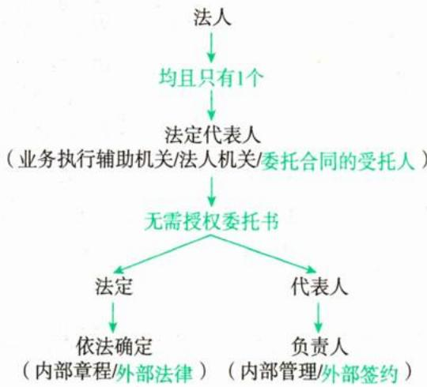

flowchart

```mermaid
graph TD
    A["法人"] --> B["均且只有1个"]
    B --> C["法定代表人\n(业务执行辅助机关/法人机关/委托合同的受托人)"]
    C --> D["无需授权委托书"]
    D --> E["法定"]
    D --> F["代表人"]
    E --> G["依法确定\n(内部章程/外部法律)"]
    F --> H["负责人\n(内部管理/外部签约)"]
```

(法定代表人解构示意图)

#### (一) 含义

法定代表人，是指依照法律或法人章程规定，代表法人从事民事活动的负责人。通俗而言，法定代表人就是依法确定的负责人，属于法人机关（业务执行辅助机关）的一种；其权利来源于法律或法人章程的规定，而非法人的授权。因此，法定代表人代表法人对外从事民事活动时，原则上无需法人另行授权。

#### (二) 合同行为

#### 1. 职务行为。

法定代表人以法人名义从事的民事活动（职务行为），其法律后果由法人承受（包括权利、义务和责任）。

[例] 王某是甲公司的法定代表人，以甲公司名义向乙公司发出书面要约，愿以10万元价格出售甲公司的一块清代翡翠。王某在函件发出后2小时意外死亡，乙公司回函表示愿意（承诺）以该价格购买。该要约合法有效，且该要约对甲公司发生效力。

#### 2. 非职务行为。

法定代表人的非职务行为所产生的法律后果由个人承担。

#### 3. 代表权限制。

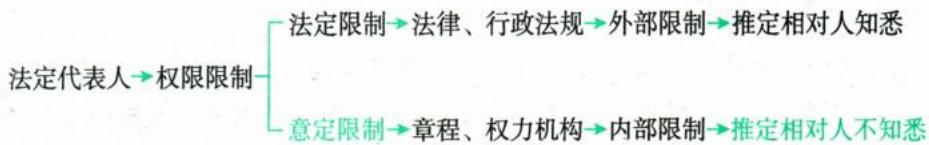

flowchart

```mermaid
graph TD
    A["法定代表人"] --> B["权限限制"]
    B --> C["法定限制"] --> D["法律、行政法规"] --> E["外部限制"] --> F["推定相对人知悉"]
    B --> G["意定限制"] --> H["章程、权力机构"] --> I["内部限制"] --> J["推定相对人不知悉"]
```

(法定代表人权限限制法律思维导图)

法人章程或法人权力机构对法定代表人代表权的限制，属于意定限制，意定限制来源于组织体内部，其效力具有相对性，仅具有内部效力，不得对抗善意相对人。因此，相对人在与法定代表人订立合同时不负有进一步调查法人对法定代表人的代表权限制的义务，如法人无证据证明相对人知道或应当知道越权情形的存在，就应当推定相对人为善意。

[萌主点拨] 内部权限限制，不得对外，内外有别。

[例] 众森公司章程规定：法定代表人孟某对外签订超过1000万元的合同必须经董事会全体董事一致同意。11月16日，孟某以众森公司名义与海马公司签订了一份2000万元的钢材购销合同。该合同合法有效。因为内部权限限制不得对外，内外有别。

#### 4. 表见代表（商事外观主义/权利外观主义/名实不符/主观题）。

法人的法定代表人超越权限订立的合同，除相对人知道或应当知道其超越权限外，该代表行为有效，订立的合同对法人发生效力（《民法典》第504条）。

[例] 甲公司与丙公司的韩某签订房屋销售委托合同，加盖了甲公司公章，由丙公司负责销售甲公司的楼房，丙公司刚换了法定代表人，但未办理变更登记，韩某是被替换的法定代表人，事后甲公司派律师打听了该消息，并获知实情。甲公司与丙公司的合同合法有效。韩某的行为构成表见代表（有理由相信）。

#### (三) 侵权行为

法定代表人因执行职务造成他人损害的，由法人承担民事责任。法人承担民事责任后，依照法律或法人章程的规定，可以向有过错的法定代表人追偿（《民法典》第62条）。

### 第三节 非法人组织

#### 复习提要

非法人组织规定在《民法典》第一编总则第四章（第102—108条），共7条。本节主要涉及1个问题，即非法人组织投资人的责任承担问题。本节并非考试重点，备考时熟悉重点即可。

flowchart

```mermaid
graph LR
    A["民事主体"] --> B["非法人组织"]
    B --> C["个人独资企业"]
    B --> D["合伙企业"]
    B --> E["不具有法人资格的专业服务机构"]
    C --> F["投资人补充责任"]
    D --> F
    E --> F
```

#### (一) 含义

非法人组织，又称非法人团体，是指不具有法人资格，但是能够依法以自己的名义从事民事活动的组织。

#### （二）责任承担①

非法人组织的出资人或设立人对该组织的债务承担无限责任（补充责任/有顺序/承担责任的第二顺位/先组织后投资人）。法律另有规定的，依照其规定。

[萌主点拨]
民事主体

<table><tr><td>项目</td><td>民事主体</td><td>组织否</td><td>财产独立否</td><td>人格独立否</td><td>责任独立否</td><td>投资人责任</td></tr><tr><td>自然人</td><td>是</td><td>否</td><td>独立</td><td>独立(以自己的名义从事民事活动)</td><td>独立(对外承担无限责任)</td><td>无</td></tr><tr><td>法人</td><td>是</td><td>是</td><td>独立</td><td>独立(以自己的名义从事民事活动)</td><td>独立(对外承担无限责任)</td><td>投资人仅以其认缴的出资额或认购的股份为限承担有限责任</td></tr><tr><td>非法人组织</td><td>是</td><td>是</td><td>相对独立</td><td>独立(以自己的名义从事民事活动)</td><td>相对独立(对外承担无限责任)</td><td>投资人承担补充的无限(连带)责任</td></tr></table>

#### >> 随堂练习

甲企业是由自然人安琚与乙企业（个人独资）各出资 $50\%$ 设立的普通合伙企业，欠丙企业货款50万元，由于经营不善，甲企业全部资产仅剩20万元。现所欠货款到期，相关各方因货款清偿发生纠纷。对此，下列哪一表述是正确的？(2016-3-2，单)①

A. 丙企业只能要求安琚与乙企业各自承担15万元的清偿责任
B. 丙企业只能要求甲企业承担清偿责任
C. 欠款应先以甲企业的财产偿还，不足部分由安琚与乙企业承担无限连带责任
D. 就乙企业对丙企业的应偿债务，乙企业投资人不承担责任

#### 03

## 专题三

#### 民事法律行为

#### 复习提要

民事法律行为规定在《民法典》第一编总则第六章（第133—160条），共28条。本专题主要涉及三个问题：1. 民事法律行为的基本原理；2. 民事法律行为的效力；3. 特殊的民事法律行为，即附条件和附期限的民事法律行为。其中，民事法律行为的效力属于必考点，在备考过程中须重点学习。

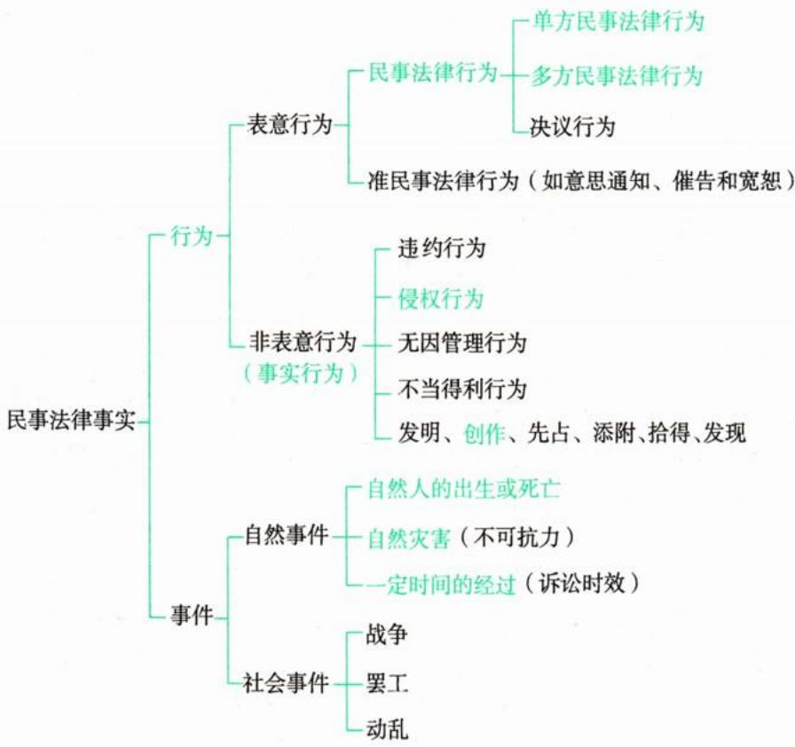

flowchart

```mermaid
graph TD
    A["民事法律事实"] --> B["行为"]
    A --> C["事件"]
    B --> D["表意行为"]
    D --> E["民事法律行为"]
    E --> F["单方民事法律行为"]
    E --> G["多方民事法律行为"]
    E --> H["决议行为"]
    B --> I["非表意行为 (事实行为)"]
    I --> J["违约行为"]
    I --> K["侵权行为"]
    I --> L["无因管理行为"]
    I --> M["不当得利行为"]
    I --> N["发明、创作、先占、添附、拾得、发现"]
    C --> O["自然事件"]
    O --> P["自然人的出生或死亡"]
    O --> Q["自然灾害 (不可抗力)"]
    O --> R["一定时间的经过 (诉讼时效)"]
    C --> S["社会事件"]
    S --> T["战争"]
    S --> U["罢工"]
    S --> V["动乱"]
```

### 第一节 民事法律行为的基本原理

#### 复习提要

民事法律行为的基本原理规定在《民法典》第一编总则第六章第一节（第133—136条），共4条。本节主要涉及3个问题，分别是：1. 民事法律行为和事实行为的区别；2. 民事法律行为的法定分类；3. 民事法律行为的学理分类。其中，民事法律行为和事实行为的区别系考试重点，其他两个问题了解即可。

#### 一、民事法律行为和事实行为的区别①

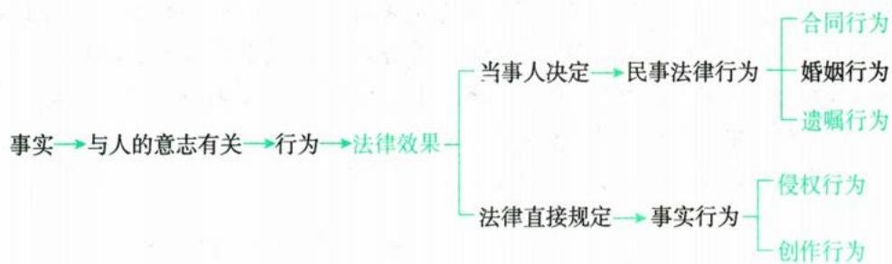

flowchart

```mermaid
graph TD
    A["事实"] --> B["与人的意志有关"]
    B --> C["行为"]
    C --> D["法律效果"]
    D --> E["当事人决定"]
    E --> F["民事法律行为"]
    F --> G["合同行为"]
    F --> H["婚姻行为"]
    F --> I["遗嘱行为"]
    D --> J["法律直接规定"]
    J --> K["事实行为"]
    K --> L["侵权行为"]
    K --> M["创作行为"]
```

(民事法律行为和事实行为法律思维导图)

#### (一) 民事法律行为

民事法律行为，是指民事主体通过意思表示②设立、变更、终止民事法律关系的行为。民事法律行为充分体现了当事人的意思，法律效果是当事人主动追求的（意欲发生的）。典型的民事法律行为主要包括合同行为、婚姻行为和遗嘱行为。

#### （二）事实行为

事实行为，是指行为人不具有设立、变更、终止民事法律关系的意图，但依据法律规定能引起既定的民事法律后果的行为。事实行为充分体现了法律的意思，法律效果不是当事人主动追求的（意欲发生的），而是法律直接规定的。典型的事实行为包括侵权行为和创作行为。

[例 1] 孟某失恋，心情不爽想打人。因自己口袋里只有200元，只想打马某200元的。马某天生骨质疏松，孟某将马某暴揍一顿，花去医药费2000元。孟某应当赔偿马某2000元。因为侵权行为属于事实行为，虽然孟某想发生200元的法律效果。但是，依据法律规定要发生2000元的法律效果。

[例 2] 小孟（6 周岁）在幼儿园的美术课上画了一幅画（美术作品）。小孟取得画的著作权，因为创作行为属于事实行为，法律效果由法律规定。

##### [萌主点拨1]

民事法律行为和事实行为法律效果

<table><tr><td>项目</td><td>当事人意欲发生(主动追求)的法律效果</td><td>最终发生的法律效果</td></tr><tr><td>民事法律行为</td><td>A</td><td>A</td></tr><tr><td>事实行为</td><td>不考虑</td><td>B</td></tr></table>

##### [萌主点拨2]

民事法律行为 VS 事实行为

<table><tr><td>项目</td><td>民事法律行为</td><td>事实行为</td></tr><tr><td>含义</td><td>民事主体通过意思表示设立、变更、终止民事法律关系的行为</td><td>行为人不具有设立、变更、终止民事法律关系的意图,但依据法律规定能引起既定的民事法律后果的行为</td></tr><tr><td>是否需要意思表示</td><td>必需</td><td>无需(即不考虑)</td></tr><tr><td>法律效果由谁决定</td><td>意定(当事人决定;能够发生当事人意欲或预期发生的法律效果)</td><td>法定(法律规定)</td></tr><tr><td>是否需要行为人具有民事行为能力</td><td>具有相应的民事行为能力</td><td>无需</td></tr><tr><td>是否存在效力问题</td><td>有效力问题</td><td>无效力问题</td></tr></table>

#### 二、民事法律行为的法定分类 $^{①}$

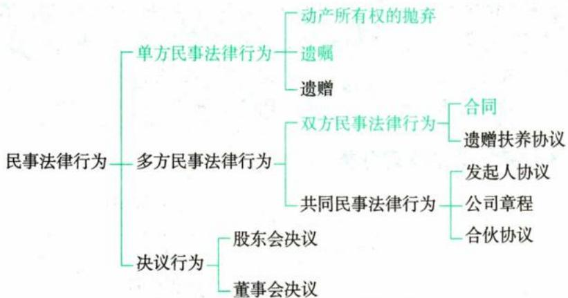

flowchart

```mermaid
graph TD
    A["民事法律行为"] --> B["单方民事法律行为"]
    A --> C["多方民事法律行为"]
    A --> D["决议行为"]
    B --> E["动产所有权的抛弃"]
    B --> F["遗嘱"]
    B --> G["遗赠"]
    C --> H["双方民事法律行为"]
    C --> I["共同民事法律行为"]
    H --> J["合同"]
    H --> K["遗赠扶养协议"]
    I --> L["发起人协议"]
    I --> M["公司章程"]
    I --> N["合伙协议"]
    D --> O["股东会决议"]
    D --> P["董事会决议"]
```

(民事法律行为的法定分类体系框架图)

标准：民事法律行为成立所需意思表示的数量和合意形成的方式。

#### （一）单方民事法律行为

单方民事法律行为，是指依一方当事人的意思表示而成立的民事法律行为。典型的单方民事法律行为包括动产所有权的抛弃、订立遗嘱和遗赠。

#### (二) 多方民事法律行为

多方民事法律行为，是指由两个或两个以上的意思表示一致而成立的民事法律行为。包括双方民事法律行为和共同民事法律行为。典型的双方民事法律行为包括赠与合同和遗赠扶养协议。典型的共同民事法律行为包括发起人协议、公司章程和合伙协议。

#### (三) 决议行为

决议行为，是指团体组织为形成集体意思，在遵循一定程序的前提下由组织成员或组织法人机关的成员在多数决规则下形成一致意思的民事法律行为。典型的决议行为包括股东会决议和董事会决议。

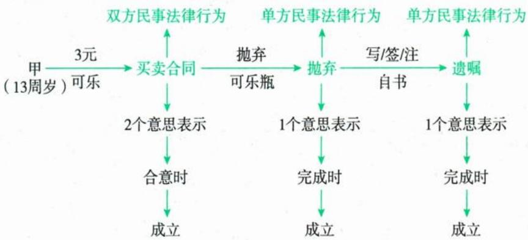

flowchart

```mermaid
graph TD
    A["甲 (13周岁) 可乐"] -->|3元| B["买卖合同"]
    B -->|抛弃可乐瓶| C["抛弃"]
    C -->|写/签/注自书| D["遗嘱"]
    D -->|1个意思表示| E["完成时"]
    E --> F["成立"]
    B --> G["2个意思表示"]
    G --> H["合意时"]
    H --> I["成立"]
    C --> J["1个意思表示"]
    J --> K["完成时"]
    K --> L["成立"]
    D --> M["1个意思表示"]
    M --> N["完成时"]
    N --> O["成立"]
```

(民事法律行为的法定分类示意图)

#### >> 随堂练习

中学生甲（13周岁）每天下午都去篮球场打篮球，顺带买一瓶可乐饮用。乙是拾荒者，以捡垃圾为生，经常在篮球场捡瓶子。一日甲打完篮球后就喝可乐，之后将装有半瓶可乐的瓶子放在球场上，拿着书包就和同学丙一起离开了球场。乙随后捡走了可乐瓶。关于本案，下列哪一说法是正确的？(2019金题-2-1-5，单)①

A. 甲的行为是赠与

B. 甲的行为是抛弃

C. 甲的行为不需要意思表示

D. 可乐瓶属于遗失物

#### 三、民事法律行为的学理分类②

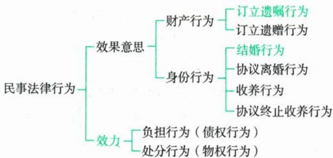

flowchart

```mermaid
graph TD
    A["民事法律行为"] --> B["效果意思"]
    A --> C["效力"]
    B --> D["财产行为"]
    B --> E["身份行为"]
    D --> F["订立遗嘱行为"]
    D --> G["订立遗赠行为"]
    E --> H["结婚行为"]
    E --> I["协议离婚行为"]
    E --> J["收养行为"]
    E --> K["协议终止收养行为"]
    C --> L["负担行为（债权行为）"]
    C --> M["处分行为（物权行为）"]
```

(民事法律行为的学理分类)

① 答案：B。
② 考查 1 次，抓住重点。

#### (一) 财产行为和身份行为

标准：民事法律行为的效果意思。

1. 财产行为。

财产行为，是指以发生财产上的法律效果为目的的民事法律行为。典型的财产民事法律行为包括订立遗嘱和遗赠行为。

2. 身份行为。

身份行为，是指以发生身份上的法律效果为目的的民事法律行为。典型的身份民事法律行为包括结婚行为、协议离婚行为、收养行为和协议终止收养行为等。

#### （二）负担行为和处分行为

标准：效力。

1. 负担行为。

负担行为，是指以发生债权债务为其效力的行为。典型的负担行为即债权行为，如租赁合同。

[例] 孟某将自己的房屋出租给徐某，双方约定租期3年，月租金1万元。孟某和徐某之间的租赁合同属于负担行为。因为租赁合同的效力仅能在孟某和徐某之间产生债权债务关系，不会发生物权变动，租期届满后，房屋所有权依然归孟某所有。

2. 处分行为。

处分行为，是指以发生物权变动为其效力的行为。典型的处分行为即物权行为。如设立抵押权的行为。

[例] 孟某向马某借款200万元，将自己的房屋抵押给马某并前往登记机构办理了抵押登记手续。孟某将房屋抵押给马某的行为属于处分行为。因为抵押权的效力使得马某享有了房屋的优先受偿权（物权效力），如到期孟某不还款，马某可以拍卖房屋并就获得的价款优先偿还自己的债务。

### 第二节 民事法律行为的效力 $^{①}$

#### 复习提要

民事法律行为的效力规定在《民法典》第一编总则第六章第三节（第143—157条），共15条。本节主要涉及4个问题，分别是：1. 有效的民事法律行为；2. 无效的民事法律行为；3. 效力待定的民事法律行为；4. 可撤销的民事法律行为。该节系客观题每年必考内容，备考时必须全面、细致掌握。

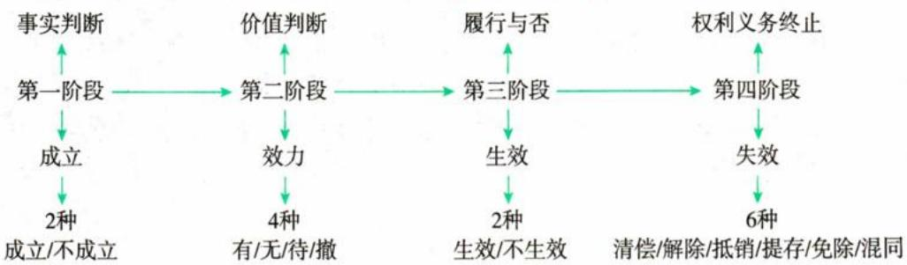

flowchart

```mermaid
graph LR
    A["事实判断"] --> B["第一阶段"]
    B --> C["成立"]
    C --> D["2种 成立/不成立"]
    E["价值判断"] --> F["第二阶段"]
    F --> G["效力"]
    G --> H["4种 有/无/待/撤"]
    I["履行与否"] --> J["第三阶段"]
    J --> K["生效"]
    K --> L["2种 生效/不生效"]
    M["权利义务终止"] --> N["第四阶段"]
    N --> O["失效"]
    O --> P["6种 清偿/解除/抵销/提存/免除/混同"]
```

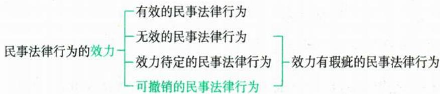

flowchart

```mermaid
graph TD
    A["民事法律行为的效力"] --> B["有效的民事法律行为"]
    A --> C["无效的民事法律行为"]
    A --> D["效力待定的民事法律行为"]
    A --> E["可撤销的民事法律行为"]
    A --> F["效力有瑕疵的民事法律行为"]
```

(民事法律行为的效力体系框架图)

事实行为的法律效果直接由法律规定，不存在效力问题。在民事法律行为中，双方民事法律行为（合同）包括四种效力状况，分别是有效、无效、效力待定和可撤销；身份民事法律行为中的婚姻行为有三种效力状况，分别是有效、无效和可撤销；单方民事法律行为（如动产所有权的抛弃、遗嘱和遗赠）仅有两种效力状况，即有效和无效。

#### 一、有效的民事法律行为

#### (一) 含义

有效的民事法律行为，是指已经成立的民事法律行为因符合法定有效要件而取得法律认可的效力。通俗而言，有效的民事法律行为系能够发生当事人意欲发生（主动追求/内心期待）的法律效果。

#### (二) 构成要件

有效的民事法律行为必须同时满足如下四个要件，即“强、公、主、意”。其中：（1）“强”代表不违反法律、行政法规的强制性规定；（2）“公”代表不违背公序良俗；（3）“主”代表主体（行为人）具有相应的民事行为能力；（4）“意”代表意思表示真实。

[萌主点拨] 意思表示真实有效。但是，意思表示不真实，不一定无效，可能可撤销。

[例] 孟某与甲教育培训机构就课外辅导达成协议（培训协议/无名合同/非典型合同），约定孟某交费5万元，甲机构保证孟某在接受甲机构的辅导后，高考分数能达到二本线。若未达到该目标，全额退费。结果孟某高考成绩仅达去年二本线，与今年高考二本线尚差20分。甲机构的承诺合法有效。

#### 二、无效的民事法律行为①

#### (一) 含义

无效的民事法律行为，是指已经成立的民事法律行为，因严重欠缺民事法律行为的有效要件而不按照行为人设立、变更、终止民事法律关系的意思表示发生效力。通俗而言，无效的民事法律行为系不发生当事人意欲发生（主动追求/内心期待）的法律效果。但是，要发生法律意欲发生的法律后果。

#### (二)五种情形

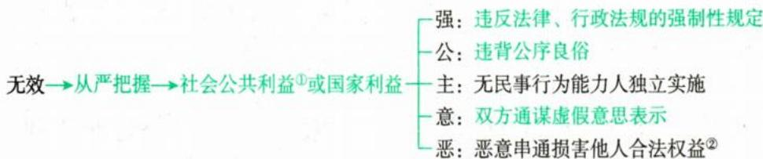

flowchart

```mermaid
graph LR
    A["无效"] --> B["从严把握"]
    B --> C["社会公共利益①或国家利益"]
    C --> D["强：违反法律、行政法规的强制性规定"]
    C --> E["公：违背公序良俗"]
    C --> F["主：无民事行为能力人独立实施"]
    C --> G["意：双方通谋虚假意思表示"]
    C --> H["恶：恶意串通损害他人合法权益②"]
```

(无效的民事法律行为一般体系框架图)

无效的民事法律行为共5种情形（超越国家管制界限），即“强、公、主、意、恶”。

1. 违反法律、行政法规的强制性规定的民事法律行为无效。

缺乏银行牌照开展信贷发放业务的合同或未取得彩票销售许可而销售彩票等的民事法律行为无效。

父母双方以法定代理人身份处分用夫妻共同财产购买并登记在未成年子女名下的房屋后，又以违反《民法典》第35条规定 $^{③}$ 损害未成年子女利益为由向相对人主张该民事法律行为无效的，法院不予支持（《民法典婚姻家庭编解释（二）》第15条）。

2. 违背公序良俗的民事法律行为无效。

公序良俗属于一般条款，授权条款，赋予法官填补法律漏洞之权，具有时代性、地域性和抽象空洞性。判断时应当综合考量以下因素：合同内容、政府部门的监管强度、行为的社会效果、交易动机和目的等。

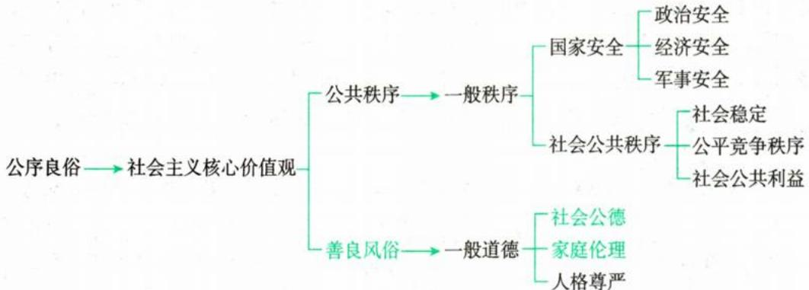

flowchart

```mermaid
graph TD
    A["公序良俗"] --> B["社会主义核心价值观"]
    B --> C["公共秩序"]
    B --> D["善良风俗"]
    C --> E["一般秩序"]
    D --> F["一般道德"]
    E --> G["国家安全"]
    E --> H["社会公共秩序"]
    G --> I["政治安全"]
    G --> J["经济安全"]
    G --> K["军事安全"]
    H --> L["社会稳定"]
    H --> M["公平竞争秩序"]
    H --> N["社会公共利益"]
    F --> O["社会公德"]
    F --> P["家庭伦理"]
    F --> Q["人格尊严"]
```

(公序良俗的体系框架图)

(1) 结婚问题。

[例] 甲、乙未婚同居，乙谎称怀孕，迫使甲承诺：甲付给乙“结婚保证金”50万元，如半年内不与乙结婚不得要求返还。甲、乙之间的约定因违背公序良俗而无效。

#### (2) 生育问题。

[例] 蒋男与韩女在离婚协议中约定：为了专心抚育婚生幼女蒋小萍，韩女将来若与他人结婚，不得再生育孩子。该约定因违背公序良俗而无效。

#### (3) 买卖人体器官问题。

禁止以任何形式买卖人体细胞、人体组织、人体器官、遗体。否则，买卖行为无效。

#### (4) 姓名权的行使问题（“北雁云依”案）。

自然人应当随父姓或母姓，但是有下列情形之一的，可以在父姓和母姓之外选取姓氏：选取其他直系长辈血亲的姓氏；因由法定扶养人以外的人扶养而选取扶养人姓氏；有不违背公序良俗的其他正当理由。少数民族自然人的姓氏可以遵从本民族的文化传统和风俗习惯。

#### (5) 代孕问题。

[例] 有妇之夫孟某委托未婚女马某代孕，约定事成后孟某补偿马某50万元。孟某和马某之间的代孕合同因违背公序良俗而无效。

#### (6) 第三者问题。

夫妻一方为重婚、与他人同居以及其他违反夫妻忠实义务等目的，将夫妻共同财产赠与他人或以明显不合理的价格处分夫妻共同财产，另一方主张该民事法律行为违背公序良俗无效的，法院应予支持并依照《民法典》第157条规定处理（恢复原状+缔约过失责任）。夫妻一方存在前款规定情形，另一方以该方存在转移、变卖夫妻共同财产行为，严重损害夫妻共同财产利益为由，依据《民法典》第1066条规定请求在婚姻关系存续期间分割夫妻共同财产，或依据《民法典》第1092条规定请求在离婚分割夫妻共同财产时对该方少分或不分的，法院应予支持（《民法典婚姻家庭编解释（二）》第7条）。

#### (7) 危房出租用于酒店经营。

指导案例 170 号 “饶某礼诉某物资供应站等房屋租赁合同纠纷案” 中，法院认为，经鉴定机构鉴定存在严重结构隐患，或将造成重大安全事故的应当尽快拆除的危房出租用于酒店经营，危及不特定公众人身及财产安全，属于损害社会公共利益、违背公序良俗的行为，应当依法认定租赁合同无效，按照合同双方的过错大小确定各自应当承担的法律责任。

#### 3. 无民事行为能力人所实施的民事法律行为无效。

为保护未成年人的利益，无民事行为能力人由其法定代理人代理实施各项民事法律行为。因此，无民事行为能力人独立实施的民事法律行为一律无效。

4. 行为人与相对人以虚假的意思表示实施的民事法律行为无效（明修栈道、暗度陈仓/主观题/《民法典》第146条/《民法典合同编通则解释》第14条第1款①）。

实践中，当事人为规避法律、行政法规的强制性规定或规避法律、行政法规关于合同应当办理批准等手续的规定，经常就同一交易订立多份合同。通谋虚伪表示以表意人与相对人的意思联络为核心，如果不存在通谋的意思联络，则不构成通谋虚伪表示。在实务中，通谋虚伪表示表现为“阴阳合同”或“黑白合同”（当事人之间存在两份甚至两份以上的合同)。当事人为通谋虚假意思表示时，本意是双方不受相应法律关系的约束。因此，双方通谋虚假意思表示，无效。

夫妻登记离婚后，一方以双方意思表示虚假为由请求确认离婚无效的，法院不予支持（《民法典婚姻家庭编解释（二）》第2条）。

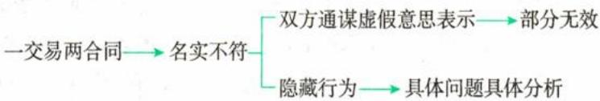

flowchart

```mermaid
graph LR
    A["一交易两合同"] --> B["名实不符"]
    B --> C["双方通谋虚假意思表示"] --> D["部分无效"]
    B --> E["隐藏行为"] --> F["具体问题具体分析"]
```

(双方通谋虚假意思表示和隐藏行为民事法律关系示意图)

#### >> 随堂练习

甲和乙签订了两份房屋买卖合同，第一份约定房屋价款500万元，注明房屋过户备案事项不按此合同履行。第二份合同约定房屋价款200万元，房屋过户备案事项按此合同履行。关于两份合同，下列哪一选项正确？（2020金题-2-1-3，单）①

A. 第一份合同部分无效，第二份合同无效
B. 第一份合同有效，第二份合同部分无效
C. 两份合同均无效
D. 两份合同均有效

5. 恶意串通损害他人合法权益的民事法律行为无效。

恶意串通，是指行为人与相对人互相勾结，为谋取私利而实施的损害他人合法权益的民事法律行为（《民法典》第154条）。

夫妻一方转让用夫妻共同财产出资但登记在自己名下的有限责任公司股权，另一方以未经其同意侵害夫妻共同财产利益为由请求确认股权转让合同无效的，法院不予支持，但有证据证明转让人与受让人恶意串通损害另一方合法权益的除外（《民法典婚姻家庭编解释（二）》第9条）。

#### (三) 部分无效

民事法律行为部分无效的，不影响其他部分的效力。即“部分有效部分无效”（《民法典》第156条）。

[例] 孟某被王某打成重伤（刑事犯罪/故意伤害罪），支付医药费（民事赔偿）5万元。孟某与王某达成如下协议：“王某向孟某赔偿（债权请求权）医药费5万元，孟某不得告发王某”。孟某获得5万元赔偿后，向公安机关报案，后王某被判刑。孟某和王某之间的协议部分有效部分无效，赔偿医药费5万元的部分有效，孟某不得告发王某的部分无效。

#### (四) 法律效果

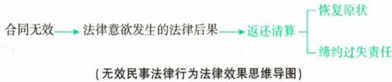

flowchart

```mermaid
graph LR
    A["合同无效"] --> B["法律意欲发生的法律后果"]
    B --> C["返还清算"]
    C --> D["恢复原状"]
    C --> E["缔约过失责任"]
```

无效的民事法律行为体现了法秩序对民事法律行为的否定性评价。无效的民事法律行为不发生当事人意欲发生（主动追求）的法律效果，但并非不发生任何法律效果，要发生法律意欲发生的法律效果。无效的民事法律行为，自始、当然、确定、永远、绝对无效，任何人、任何时候均可以主张无效。法院或仲裁机构可以主动审查民事法律行为是否存在无效的因素，其宣告不受时效限制（即既不受诉讼时效亦不受除斥期间限制）。

民事法律行为无效、被撤销或确定不发生效力后，行为人因该行为取得的财产，应当予以返还（恢复原状）；不能返还①或没有必要返还②的，应当折价补偿。有过错的一方应当赔偿对方由此所受到的损失（缔约过失责任）；各方都有过错的，应当各自承担相应的责任（过错相抵原则）。法律另有规定的，依照其规定。

[萌主点拨] 无效民事法律行为的法律效果是：恢复原状或缔约过失责任（《民法典》第157条）。

#### 三、效力待定的民事法律行为

#### (一) 含义

效力待定的民事法律行为，是指民事法律行为虽已成立，但是否生效尚不确定，有待享有形成权的第三人作出追认或拒绝的意思表示来使效力得以确定。

#### (二)五种情形

1. 限制民事行为能力人独立实施的与其意思能力不相适应的双方民事法律行为（合同行为）。

[例] 孟某 17 周岁（8 周岁以上的未成年人为限制民事行为能力人），系北京师范大学第二附属中学高三学生，长得少年老成。2025 年 3 月 1 日，孟某着便装以 10 万元（数额过高，超出其意思能力）从不知情（相对人善意）的北京君太百货商场（以下简称君太百货）购买了钻戒（买卖合同）一枚，双方约定第 2 天上午 10 点 30 分一手交钱一手交钻戒（取货时付款/同时履行抗辩权）。根据上述案情及示意图，请回答如下问题：

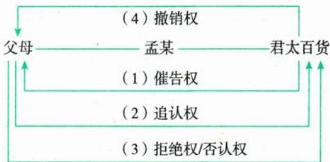

flowchart

```mermaid
graph TD
    A["父母"] --> B["孟某"]
    B --> C["君太百货"]
    C --> D["(3) 拒绝权/否认权"]
    D --> E["(2) 追认权"]
    E --> F["(1) 催告权"]
    F --> G["(4) 撤销权"]
```

(形成权当事人法律关系示意图)

①3月1日，孟某和君太百货签订的钻戒买卖合同的效力如何？为什么？

答：效力待定。

因为限制民事行为能力人所独立实施的与其意思能力不相适应的双方民事法律行为（即合同行为）效力待定。

本案中，孟某17周岁系限制民事行为能力人，10万元超出其意思能力。因此，买卖合同效力待定。

法律依据：《民法典》第145条。

②君太百货知情后催告孟某父母表态，君太百货催告后，该钻戒买卖合同的效力又如何？

答：依然效力待定。

[萌主点拨] 法律之所以允许相对人以催告的方式使合同的效力得以确认，是因为如若追认权人怠于行使追认权，则会使已经成立的合同的效力长期处于悬而未决的状态，不利于交易安全的维护。因此，为了使悬而未决的民事法律关系尽快得到确定，法律规定相对人可以通过催告的方式来使合同的效力状态得以确认。

③君太百货所行使的催告权是否属于形成权？

答：不属于。

因为行为人的单方意思表示不能产生私法效果。催告权在性质上系意思通知行为（准民事法律行为）。

④孟某父母收到君太百货的通知后有几种选择？孟某父母的选择将会使钻戒买卖合同的效力发生何种变化？

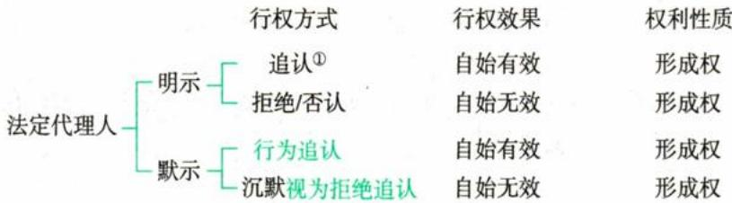

flowchart

```mermaid
graph TD
    A["法定代理人"] --> B["明示"]
    A --> C["默示"]
    B --> D["追认①"]
    B --> E["拒绝/否认"]
    C --> F["行为追认"]
    C --> G["沉默视为拒绝追认"]
    D --> H["自始有效"]
    E --> I["自始无效"]
    F --> J["自始有效"]
    G --> K["自始无效"]
    H --> L["形成权"]
    I --> M["形成权"]
    J --> N["形成权"]
    K --> O["形成权"]
```

##### (形成权的行使方式法律关系示意图)

⑤孟某的父母收到君太百货的通知后，应当在多长时间内表态？如果不表态，如何处理？

答：自收到通知之日起30日（除斥期间）内；如果不表态，视为拒绝追认。

⑥在孟某父母作出选择前，作为善意相对人 $^{②}$ 的君太百货有何权利？该权利行使后，钻戒买卖合同的效力又如何？

答：撤销权。自始无效（权利性质为形成权）。

[萌主点拨] 撤销权的行使需要具备相对人是善意这一要件，若相对人知道或应当知道与自己订立合同的行为人是限制民事行为能力人，则其陷入民事法律关系未确定状态亦是因其自身的过错而导致，相对人不享有撤销权。相对人只能以催告的方式，催告法定代理人尽快行使追认权，以使合同的效力状态得以确定。不同于追认权的行使，善意相对人的撤销权只能通过明示（通知）的方式作出，而且在时间上需在追认权人行使追认权之前。

⑦ 2025 年 3 月 2 日，如孟某将所购买的钻戒赠与女友刘某作为 18 周岁生日礼物，刘某表示接受，则赠与合同效力如何？为什么？

答：效力待定。

因为限制民事行为能力人所独立实施的与其意思能力不相适应的双方民事法律行为（即合同行为）效力待定。

本案中，孟某17周岁系限制民事行为能力人，10万元超出其意思能力。因此，赠与合同效力待定。

法律依据：《民法典》第145条。

2. 无权代理。

无权代理，是指行为人没有代理权、超越代理权或代理权终止后，仍然以被代理人的名义实施民事法律行为。

3. 职务代理人超越代理权限且相对人未尽到合理审查义务所成立的民事法律行为。

4. 法定代表人越权代表且相对人未尽到合理审查义务所实施的民事法律行为。

5. 法定代表人、负责人或代理人与相对人恶意串通行为。

#### 四、可撤销的民事法律行为①

可撤销的民事法律行为
重大误解：自身原因+主给付义务认识错误（内因）
欺诈：非自身原因+认识错误（外因/第三人欺诈）
胁迫：恐惧或害怕（不法性/第三人胁迫）
显失公平：利用（主观）

(可撤销的民事法律行为体系框架图)

#### (一) 含义

可撤销的民事法律行为，是指民事法律行为虽已成立，但因意思表示存在瑕疵，可以因权利人行使撤销权而使其丧失效力。

#### (二) 四种情形

1. 重大误解。

(1) 含义。

重大误解，是指行为人对行为的性质、对方当事人或标的物的品种、质量、规格、价格、数量等（示范性/非封闭性列举）产生错误认识，按照通常理解如果不发生该错误认识行为人就不会作出相应意思表示（《民法典总则编解释》第19条第1款/列举+兜底概括模式）。

(2) 类型。

重大误解 → 自身原因陷入认识错误
重大
主给付义务（√）
从给付义务（×）
误解 → 内容法定
当事人错误（“人”）
标的物错误（“物”）
行为的性质错误（“关系”）
转达错误（“信息传输工具”）

(重大误解体系框架图)

①对对方当事人的认识错误（“人”）。对对方当事人的认识错误构成重大误解，但不包括对自然人民事行为能力的认识错误，因为未成年人之保护，优先于交易安全及相对人的信赖系民法之基本原则。

②对标的物的认识错误（“物”）。即对标的物的品种、规格、价格、数量、质量认识错误。

[萌主点拨] 基于交易惯例，房屋买卖合同中的面积误差，不属于重大误解。赌石、古玩等特殊标的物交易（愿赌服输、买定离手/买卖全凭眼力，双方各安天命/开盲盒），当事人不得主张重大误解。

③对行为的性质认识错误（“关系”）。误把有偿当无偿，即误把买卖合同当成赠与合同。

[例] 甲入住乙宾馆，误以为乙宾馆提供的茶叶是无偿的，并予以使用。甲的行为构成重大误解。

④第三人转达错误。行为人以其意思表示存在第三人转达错误为由请求撤销民事法律行为的，适用重大误解的规定。

(3) 核心。

因自身原因对民事法律行为的主要内容认识错误。题目中的关键词为：误以为、误认为。

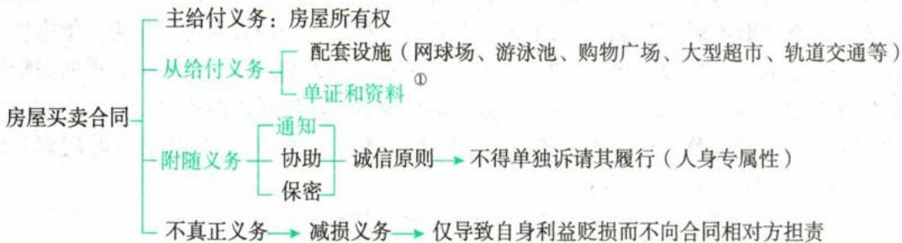

flowchart

```mermaid
graph TD
    A["房屋买卖合同"] --> B["主给付义务：房屋所有权"]
    A --> C["从给付义务"]
    C --> D["配套设施（网球场、游泳池、购物广场、大型超市、轨道交通等）"]
    C --> E["单证和资料①"]
    A --> F["附随义务"]
    F --> G["通知"]
    F --> H["协助"]
    F --> I["保密"]
    A --> J["不真正义务"]
    J --> K["减损义务"]
    K --> L["仅导致自身利益贬损而不向合同相对方担责"]
    G --> M["诚信原则"]
    H --> M
    I --> M
    M --> N["不得单独诉请其履行（人身专属性）"]
```

(房屋买卖合同中的四大义务解构示意图)

##### 随堂练习

陈老伯考察郊区某新楼盘时，听销售经理介绍周边有轨道交通19号线，出行方便，便与开发商订立了商品房预售合同。后经了解，轨道交通19号线属市域铁路，并非地铁，无法使用老年卡，出行成本较高；此外，铁路房的升值空间小于地铁房。陈老伯深感懊悔。关于陈老伯可否反悔，下列哪一说法是正确的？（2017-3-10，单）②

A. 属认识错误，可主张撤销该预售合同
B. 属重大误解，可主张撤销该预售合同
C. 该预售合同显失公平，陈老伯可主张撤销该合同
D. 开发商并未欺诈陈老伯，该预售合同不能被撤销

2. 欺诈。

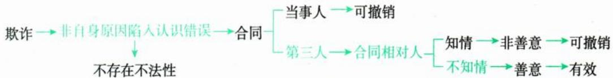

flowchart

```mermaid
graph TD
    A["欺诈"] --> B["非自身原因陷入认识错误"]
    B --> C["合同"]
    C --> D["当事人"]
    D --> E["可撤销"]
    C --> F["第三人"]
    F --> G["合同相对人"]
    G --> H["知情"]
    H --> I["非善意"]
    I --> J["可撤销"]
    G --> K["不知情"]
    K --> L["善意"]
    L --> M["有效"]
    B --> N["不存在不法性"]
```

(欺诈体系框架图)

(1) 含义。

欺诈，是指故意告知虚假情况，或负有告知义务的人故意隐瞒真实情况，致使当事人基于错误认识作出意思表示的行为。

将因欺诈订立的合同一律规定为可撤销，主要理由是它不损害第三人的利益，不涉及公共秩序。赋予受欺诈方撤销权，由其自行决定是否行使撤销权，足以保护其民事权利。对于欺诈国家的，赋予国家是否撤销的权利，也足以保护国家利益。特别强调的是国有企业的利益并非国家利益，如受欺诈方为国有企业，民事法律行为（合同）依然可撤销。

(2) 构成要件。

①欺诈方具有欺诈的故意。欺诈的主观心态一定是故意，而不是过失。故意的目的是使对方受欺诈，自己因此获得不正当的利益，包括直接故意希望和间接故意放任。

②欺诈方实施了欺诈行为。

第一，故意告知虚假情况（作为，积极欺诈）。

故意告知虚假情况，是指明知真实情况但却不告知受欺诈方，反而将虚假情况告知受欺诈方。典型情形包括：把国产假肢冒充进口假肢；把国产牛肉冒充进口牛肉；把劣质食用油（茶叶）冒充优质食用油（茶叶）；把人造钻石冒充天然钻石；把廉价购得的旧蟾蜍石雕冒充新挖出的文物等。期房买卖中，购房时售楼部、小区平面图和项目说明书中所展示的该小区内的网球场、游泳池、健身馆、购物广场、大型超市、轨道交通等配套设施（从给付义务）在交房时并不存在。

第二，故意隐瞒真实情况（不作为，消极欺诈，沉默欺诈）。

故意隐瞒真实情况，是指行为人有义务告知某种真实情况却故意隐瞒真实情况，不将真实情况告知受欺诈方。典型情形包括出售房屋时，卖方故意隐瞒房屋为“凶宅”的事实。出售汽车时，卖方故意隐瞒车辆刹车系统不灵敏、证照不齐、“事故车”“泡水车”等事实（告知义务来源于法律规定、诚信原则或交易习惯等）。

③受欺诈方因欺诈而陷入内心错误认识。题目中的关键词是信以为真、误以为真、轻信此言。

④受欺诈方因内心错误认识而作出了错误的意思表示（因果关系）。

萌主点拨

欺诈 VS 重大误解

<table><tr><td>项目</td><td>欺诈</td><td>重大误解</td></tr><tr><td>相同点</td><td>陷入认识错误</td><td>陷入认识错误</td></tr><tr><td>对象</td><td>主/从给付义务</td><td>主给付义务</td></tr><tr><td>本质区别</td><td>非自身原因导致(他人诱使)</td><td>自身原因导致</td></tr><tr><td>典型情形</td><td>知假卖假</td><td>不知假卖假</td></tr></table>

#### >> 随堂练习

甲从沈某手里花 5000 元买了个奢侈品包，用了一段时间划破了拿去修，被告知是赝品。甲找到出卖人沈某，出卖人不知情，很吃惊，出具了平台交易记录，证明数月前从王某处以 6000 元购得。甲于是把沈某起诉至法院。关于本案，下列哪一说法是正确的？(2025-2-单选) $^{①}$

A. 依据重大误解撤销合同
B. 依据欺诈撤销合同
C. 可以申请解除合同要求退还 5000 元
D. 依据显失公平解除合同

(3) 第三人的欺诈（主观题/《民法典》第149条）。

第三人实施欺诈行为，使一方在违背真实意思的情况下实施的民事法律行为，对方知道或应当知道该欺诈行为的，受欺诈方有权请求法院或仲裁机构予以撤销。

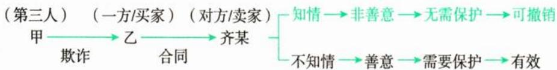

flowchart

```mermaid
graph LR
    A["甲"] --> B["欺诈"]
    B --> C["乙"]
    C --> D["合同"]
    D --> E["齐某"]
    E --> F{知情}
    F -->|非善意| G["无需保护"]
    G --> H["可撤销"]
    E --> I{不知情}
    I -->|善意| J["需要保护"]
    J --> K["有效"]
```

(第三人欺诈情形当事人法律关系示意图)

[例] 齐某扮成建筑工人模样，在工地旁摆放一尊廉价购得的旧蟾蜍石雕，冒充新挖出的文物等待买主。甲曾以5000元从齐某处买过一尊同款石雕，发现被骗后正在和齐某交涉时，乙过来询问。甲有意让乙也上当，以便要回被骗款项，未等齐某开口便对乙说：“我之前从他这买了一个貔貅，转手就赚了，这个你不要我就要了。”乙信以为真，以5000元买下石雕。乙可以向齐某主张撤销其购买行为。因为齐某知道甲对乙实施了欺诈行为（在甲欺诈乙时，齐某在场未作反对表示/非善意无需保护规则）。

3. 胁迫。

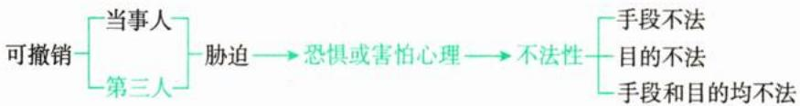

flowchart

```mermaid
graph LR
    A["可撤销"] --> B["当事人"]
    A --> C["第三人"]
    B --> D["胁迫"]
    C --> D
    D --> E["恐惧或害怕心理"]
    E --> F["不法性"]
    F --> G["手段不法"]
    F --> H["目的不法"]
    F --> I["手段和目的均不法"]
```

(胁迫的体系框架图)

(1) 含义。

胁迫，是指以给自然人及其近亲属等的人身权利、财产权利以及其他合法权益造成损害或以给法人、非法人组织的名誉、荣誉、财产权益等造成损害为要挟，迫使其基于恐惧心理作出意思表示。

(2) 对象。

胁迫的对象包括自然人（本人及其近亲属）、法人和非法人组织，即民事主体均可以被胁迫。

(3) 内容。

胁迫的内容是民事权益，包括人身权益和财产权益。

#### (4) 核心。

①胁迫人不正当的预告危害。

区别于一方根据合法依据给另一方施加压力的情况①，胁迫必须是非法的、没有法律依据的。行为人的行为正当，则不构成胁迫。

不法性包括三类，分别是：

第一，手段不法。如债权人甲对债务人乙说，如不归还欠款，则杀乙全家。要债目的合法，但是以杀乙全家的手段要债，属于手段不法（违法），构成胁迫。

第二，目的不法。如甲说，如不出借1万元，则举报乙犯罪。乙照办，后查实乙构成犯罪。公民检举、揭发犯罪是公民的权利，手段合法。但是，强迫出借1万元，属于目的不法（违法），构成胁迫。

第三，手段和目的均不法。如甲说，如不将藏獒卖给甲，则举报乙犯罪。乙照办，后查实乙不构成犯罪。此时，甲的手段（无犯罪举报犯罪/诬告陷害）和目的（强迫交易）均不法（违法），构成胁迫。

[例] 甲说，如乙不赔偿撞伤甲的医疗费，则举报乙醉酒驾车。乙照办，甲取得医疗费和慰问金。乙基于机动车交通事故责任本应向甲支付医疗费和慰问金，因此，此时甲的行为并非不正当的预告危害而使受胁迫方陷入“恐惧或害怕”的心理状态，不构成胁迫。

②受胁迫人陷入恐惧或害怕的心理状态。至于手段如何，是否真实、谁实施的（第三人的胁迫依然可撤销）均在所不问。因胁迫行为是针对特定当事人实施的，所以在确定是否构成胁迫时，应当以特定受害人而不是一般人在当时的情况下是否感到恐惧为标准加以判断，即使达不到一般人感到恐惧的程度，只是受害人感到恐惧，亦可构成胁迫。

[例] 某校长孟某欲将一套住房以850万元出售。某报记者马某找到孟某，出价400万元，孟某拒绝。马某对孟某说：“我有你贪污的材料，不答应我就举报你。”孟某信以为真，以400万元的价格将该房卖给马某。马某实际并无孟某贪污的材料，其行为构成胁迫。

(5) 第三人胁迫（《民法典》第150条）。

第三人胁迫，是指被胁迫人因第三人的胁迫行为作出不自由的意思表示。在第三人实施欺诈行为时必须对方知道或应当知道该欺诈行为，受欺诈方才有权撤销民事法律行为。而在第三人胁迫的情况下，因为胁迫行为具有违法性（非法性/不法性），不要求对方知道或应当知道，只要存在胁迫行为，受胁迫方均有权撤销民事法律行为，体现了我国立法更注重保护被胁迫人的合法权益的立法目的。

#### 4. 显失公平。

#### (1) 含义。

一方利用对方处于危困状态、缺乏判断能力（信息不对称）等情形，致使民事法律行为成立时显失公平。

#### (2) 构成要件。

①主观要件。

第一，利用对方处于危困状态（其本质为“乘人之危”）。

这种情况一般是指利用某人因陷入某种暂时性的急迫困境，从而急需金钱或有其他急需的状态。如某人家人突然患重病，急需筹集治疗费用，如果有人利用这种急需要求其以明显的低价出售房屋，则有可能构成显失公平。

[例] 甲父患癌症急需用钱，乙趁机以低价收购甲收藏的1幅名画，甲无奈与乙签订了买卖合同。甲乙之间的买卖合同因显失公平而可撤销。

##### 第二，利用对方缺乏判断能力。

这种情况主要是指欠缺一般的生活经验或交易经验，而不包括欠缺特殊的判断能力。如金融机构的从业人员向城市里文化水平较低的老年人兜售风险较高的理财产品，由于缺乏判断能力，其购买风险较高理财产品的行为，就可能构成显失公平。假一罚十，构成单方允诺之债，不得基于显失公平而行使撤销权。

[例] 甲手机专卖店门口立有一块木板，上书“假一罚十”四个醒目大字。孟某从该店购买了一部手机，后经有关部门鉴定，该手机属于假冒产品，孟某遂要求甲履行其“假一罚十”的承诺。“假一罚十”的承诺不属于显失公平。

②客观要件。

第一，双方当事人的利益显著失衡。显失公平制度并不是为了消除当事人应承担的商业风险，而是禁止或限制一方当事人获得不符合交易规则的“暴利”。

第二，民事法律行为成立时显失公平。

(3) 核心。

显失公平的核心是暴利行为和非常损失规则。

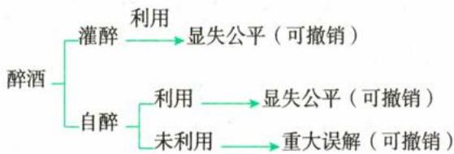

flowchart

```mermaid
graph TD
    A["醉酒"] --> B["灌醉"]
    A --> C["自醉"]
    B --> D["利用"]
    D --> E["显失公平（可撤销）"]
    C --> F["利用"]
    F --> G["显失公平（可撤销）"]
    C --> H["未利用"]
    H --> I["重大误解（可撤销）"]
```

(醉酒问题法律关系示意图)

#### >> 随堂练习

某日，李某醉酒搭乘出租车回家，车程20公里。李某下车前用手机支付车费。误将80元输错成8080元。司机收到后，未提醒李某。对此，下列哪些选项是正确的？(2020金题-2-1-5，多) $^{①}$

A. 该运输合同因显失公平而可撤销
B. 对于多付的 8000 元视为李某对司机的赠与
C. 醉酒不影响该运输合同的效力
D. 李某有权请求出租车司机返还 8000 元不当得利

#### （三）撤销权的行使

撤销权的行使

<table><tr><td>项目</td><td>行权主体</td><td>行权方式</td><td>双重除斥期间(以短的为准)</td><td>起算点</td></tr><tr><td>重大误解</td><td>双方(双方均无过错)</td><td>诉讼或仲裁(形成诉权)</td><td>90日/5年(保护相对人/交易秩序)</td><td>知道或应当知道/民事法律行为发生之日起</td></tr><tr><td>欺诈</td><td>受欺诈方</td><td>诉讼或仲裁</td><td>1年/5年</td><td>知道或应当知道/民事法律行为发生之日起</td></tr><tr><td>胁迫</td><td>受胁迫方</td><td>诉讼或仲裁</td><td>1年/5年</td><td>胁迫行为终止之日/民事法律行为发生之日起</td></tr><tr><td>显失公平</td><td>受损害方</td><td>诉讼或仲裁</td><td>1年/5年</td><td>知道或应当知道/民事法律行为发生之日起</td></tr></table>

[例] 2025年1月1日，孟某将自己的欧米茄手表冒充百达翡丽的手表出卖给马某并交付。

情形 1（主观除斥期间先到期）：马某在 2025 年 2 月 1 日知道自己被骗，马某必须在 2026 年 2 月 1 日前（自知道或应当知道撤销事由之日起 1 年内/主观除斥期间）行使撤销权。

情形2（客观除斥期间先到期）：马某在2029年10月1日知道自己被骗，马某必须在2030年1月1日前（自民事法律行为发生之日起5年内/客观除斥期间）行使撤销权，即马某仅剩3个月的时间行使撤销权。

情形 3：马某在 2030 年 2 月 1 日知道自己被骗，马某不能再行使撤销权，只能依据合法有效的买卖合同追究孟某的违约责任。

[萌主点拨] 除斥期间可以法定可以约定，本质是“有权不用，过期作废”。

#### （四）撤销权行使后的法律效果

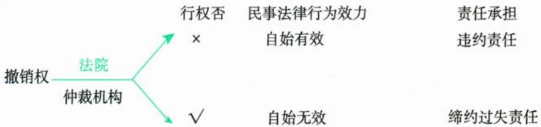

flowchart

```mermaid
graph TD
    A["撤销权"] --> B["法院"]
    B --> C["仲裁机构"]
    C --> D{行权否}
    D -->|×| E["民事法律行为效力"]
    D -->|✓| F["自始有效"]
    D --> G["自始无效"]
    H["责任承担"] --> I["违约责任"]
    J["缔约过失责任"] --> K["缔约"]
```

(可撤销的民事法律行为的法律效果示意图)

1. 自始有效。

撤销权人超过法律规定的除斥期间未行使撤销权的或撤销权人知道撤销事由后明确表示或以自己的行为表明放弃撤销权的，民事法律行为自始有效。此时可以基于合法有效的民事法律行为追究对方的违约责任。

[萌主点拨] 可撤销的民事法律行为在未被撤销前，该民事法律行为是合法有效的。

2. 自始无效。

撤销权人行使撤销权，民事法律行为自始无效。此时，可以追究对方的缔约过失责任（即信赖利益的损失，包括订约费用和订约机会的损失）。

##### 随堂练习

齐某扮成建筑工人模样，在工地旁摆放一尊廉价购得的旧蟾蜍石雕，冒充新挖出文物等待买主。甲曾以5000元从齐某处买过一尊同款石雕，发现被骗后正在和齐某交涉时，乙过来询问。甲有意让乙也上当，以便要回被骗款项，未等齐某开口便对乙说：“我之前从他这买了一个貔貅，转手就赚了，这个你不要我就要了。”乙信以为真，以5000元买下石雕。关于所涉民事法律行为的效力，下列哪一说法是正确的？(2017-3-3，单)①

A. 乙可向甲主张撤销其购买行为
B. 乙可向齐某主张撤销其购买行为
C. 甲不得向齐某主张撤销其购买行为
D. 乙的撤销权自购买行为发生之日起2年内不行使则消灭

##### [萌主点拨]

民事法律行为效力

<table><tr><td>类型</td><td>成立时</td><td colspan="2">最终命运</td></tr><tr><td>有效的民事法律行为</td><td>有效</td><td colspan="2">有效(能够发生当事人意欲发生或主动追求的法律效果)</td></tr><tr><td>无效的民事法律行为</td><td>无效</td><td colspan="2">无效(不能发生当事人意欲发生或主动追求的法律后果,但是要发生法律意欲发生的法律后果)</td></tr><tr><td rowspan="2">效力待定的民事法律行为</td><td rowspan="2">待定</td><td>追认</td><td>自始有效</td></tr><tr><td>拒绝追认</td><td>自始无效</td></tr><tr><td rowspan="2">可撤销的民事法律行为</td><td rowspan="2">有效</td><td>撤销</td><td>自始无效</td></tr><tr><td>不撤销</td><td>自始有效</td></tr></table>

### 第三节 特殊的民事法律行为

#### 复习提要

特殊的民事法律行为规定在《民法典》第一编总则第六章第四节（第158—160条），共3条。本节主要涉及2个问题，分别是：1. 附条件的民事法律行为；2. 附期限的民事法律行为。其中，附条件的民事法律行为系考试常考点，备考时必须重点掌握。

#### 一、附条件的民事法律行为 $^{②}$

#### (一) 含义

附条件的民事法律行为，是指双方当事人在民事法律行为中特别规定一定的条件，以条件是否成就来决定民事法律行为生效或失效（终止）的民事法律行为。

#### (二) 特征

附条件的民事法律行为中的条件是决定民事法律行为生效或失效（终止）的事实。换言之，该条件既不影响民事法律行为的成立也不影响民事法律行为的效力，仅仅影响民事法律行为的生效或失效（终止）。

##### [萌主点拨]

特殊的民事法律行为

<table><tr><td>项目</td><td>成立</td><td>效力</td><td>生效</td><td>失效</td></tr><tr><td>条件</td><td>不影响</td><td>不影响</td><td>影响(附生效条件的民事法律行为)</td><td>影响(附解除条件的民事法律行为)</td></tr><tr><td>期限</td><td>不影响</td><td>不影响</td><td>影响(附始期的民事法律行为)</td><td>影响(附终期的民事法律行为)</td></tr></table>

附条件的民事法律行为中的条件必须是表意人选定的、将来的、发生与否不确定的合法事实。

#### 1. 表意人选定的。

附条件的民事法律行为中的条件必须是表意人选定的。换言之，它属于任意性条款，是否附条件或附何种条件均由表意人任意选择。如法律已经规定某些民事法律行为必须具备的条款，则该条款不属于条件。

#### 2. 将来的（客观事实）。

附条件的民事法律行为中的条件必须是将来的客观事实。换言之，在行为时尚未发生的客观事实，如在行为时已经发生的事实，不能作为条件。

#### 3. 发生与否不确定的（或然性）。

附条件的民事法律行为中的条件必须是发生与否不确定的。换言之，该事实在行为时尚不能确定是否必然发生，它可能发生，也可能不发生。如在行为时虽尚未发生，但已经肯定必然发生或根本不可能发生的事实，亦不能作为条件。

民事法律行为所附条件不可能发生，当事人约定为生效条件的，法院应当认定民事法律行为不发生效力；当事人约定为解除条件的，应当认定未附条件，民事法律行为是否失效，依照《民法典》和相关法律、行政法规的规定认定。

#### 4. 合法事实。

附条件的民事法律行为中的条件必须是合法事实。如果所附的条件是违反法律规定的，应当认定该民事法律行为无效。

#### (三) 种类

#### 1. 生效条件和解除条件。

标准：条件成就的法律效力。

（1）生效条件，又称为“延缓条件”或“停止条件”，是指限制民事法律行为效力发生，使民事法律行为只有当约定的事实出现时，才发生效力的条件。

[例] 孟某对马某说：“如果明天上午9点北京下雨，我将把自己的手表送给你。”此时，所附的条件属于“生效条件”。

（2）解除条件，又称为“消灭条件”或“失效条件”，是指限制民事法律行为效力的存续，使已发生效力的民事法律行为在条件实现时终止的条件。

[例] 众森公司员工孟某在公司年会抽奖活动中中奖，依据活动规则，公司资助中奖员工子女次年的教育费用，如员工离职，则资助失效。此时，所附的条件属于“解除条件（失效条件）”。

2. 积极条件和消极条件。

标准：某种客观事实的发生与否。

（1）积极条件（肯定条件），是指以发生某种客观事实为内容的条件。
(2) 消极条件（否定条件），是指以不发生某种客观事实为内容的条件。

#### (四) 效力

无论是附何种条件，该条件是否成就必须是自然发展的结果，当事人应当顺其自然，各安天命，而不得人为的加以不正当地干预。附条件的民事法律行为，当事人为自己的利益不正当地阻止条件成就的，视为条件已成就；不正当地促成条件成就的，视为条件不成就。该条款在学理上被称为“拟制效力”（《民法典》第159条）。

“拟制效力”的适用前提必须是民事法律行为的当事人不正当地阻止或促成。如果是民事法律行为当事人以外的第三人所为则不适用“拟制效力”的规则。

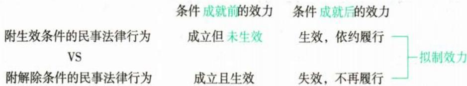

text_image

条件成就前的效力
条件成就后的效力
附生效条件的民事法律行为
成立但未生效
生效，依约履行
VS
附解除条件的民事法律行为
成立且生效
失效，不再履行
拟制效力

(附生效条件的民事法律行为 VS 附解除条件的民事法律行为)

##### 随堂练习

廖某与史某约定，如将来廖某不在甲公司上班，廖某即将其在甲公司附近一套自有公寓卖给史某。史某为尽快购得该房屋，贿赂甲公司经理，让其辞退了廖某。廖某和史某关于廖某不在甲公司上班的约定，下列哪一说法是正确的？（2020金题-2-1-6，单）①

A. 属于合同主给付义务
B. 应视为条件不成就
C. 属于附期限的约定
D. 应视为期限已届满

#### 二、附期限的民事法律行为 $^{②}$

#### (一) 含义

附期限的民事法律行为，是指当事人在意思表示中附设一定的期限，把期限的届至与否作为民事法律行为效力发生或终止的依据。

#### (二) 特征

附期限的民事法律行为中的“期限”必须是表意人选定的、将来的、必然发生的事实。

1. 表意人选定的。

“表意人选定的”代表该事实不得是“法律直接规定的”。如果双方当事人约定的事实为“法律直接规定的”，则视为双方的民事法律行为未附期限。

2. 将来的。

“将来的”代表该事实不得是“已经发生的”。如果双方当事人约定的事实为“已经发生的”，则视为双方的民事法律行为未附期限。

3. 必然发生的事实。

“必然发生的事实”代表该事实不得是“发生与否不确定的”事实，如果双方当事人约定的事实为“发生与否不确定的”，则不属于附期限的民事法律行为。

#### (三) 种类

1. 始期，是指使民事法律行为效力发生的期限。

2. 终期，是指民事法律行为效力终止的期限。

[萌主点拨] “附期限的民事法律行为” 和 “附条件的民事法律行为” 的核心区别在于：所附事实到来确定为 “期限”；不确定为 “条件”。

## 04 专题四 代理

#### 复习提要

代理规定在《民法典》第一编总则第七章（第161—175条），共15条。本专题主要涉及七个问题：1. 代理的适用范围；2. 委托和代理的辩证关系；3. 代理权滥用；4. 复代理；5. 职务代理；6. 狭义无权代理和表见代理；7. 异常人章关系。其中，狭义无权代理和表见代理属于必考点，在复习中必须全面掌握。

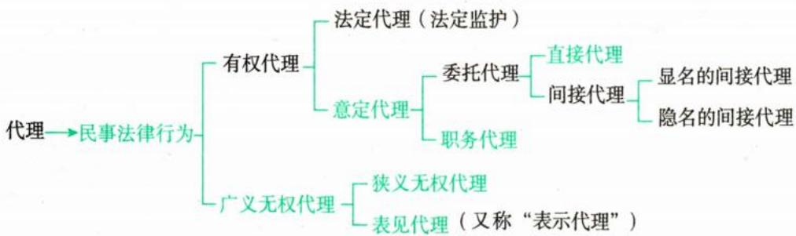

flowchart

```mermaid
graph TD
    A["代理"] --> B["民事法律行为"]
    B --> C["有权代理"]
    B --> D["广义无权代理"]
    C --> E["法定代理（法定监护）"]
    C --> F["意定代理"]
    F --> G["委托代理"]
    F --> H["职务代理"]
    G --> I["直接代理"]
    G --> J["间接代理"]
    I --> K["显名的间接代理"]
    I --> L["隐名的间接代理"]
    D --> M["狭义无权代理"]
    D --> N["表见代理（又称“表示代理”）"]
```

#### 一、代理的适用范围①

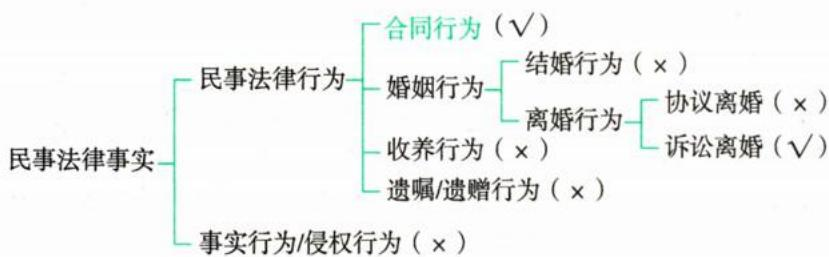

flowchart

```mermaid
graph TD
    A["民事法律事实"] --> B["民事法律行为"]
    A --> C["事实行为/侵权行为 (×)"]
    B --> D["合同行为 (√)"]
    B --> E["婚姻行为"]
    E --> F["结婚行为 (×)"]
    E --> G["离婚行为"]
    G --> H["协议离婚 (×)"]
    G --> I["诉讼离婚 (√)"]
    B --> J["收养行为 (×)"]
    B --> K["遗嘱/遗赠行为 (×)"]
```

(代理的适用范围体系框架图)

民事主体通过代理人（假他人之手）实施民事法律行为。依照法律规定、当事人约定或民事法律行为的性质，应当由本人亲自实施的民事法律行为，不得代理。演出、授课、订立遗嘱②、婚姻登记、收养子女、参加求职面试等涉及身份关系的行为不适用代理。

#### 二、委托和代理的辩证关系 $^{①}$

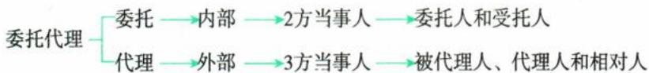

flowchart

```mermaid
graph LR
    A["委托代理"] --> B["委托"]
    A --> C["代理"]
    B --> D["内部"]
    C --> E["外部"]
    D --> F["2方当事人"]
    E --> G["3方当事人"]
    F --> H["委托人和受托人"]
    G --> I["被代理人、代理人和相对人"]
```

(委托和代理区别示意图)

委托和代理系两个完全独立的行为。代理权来源于授权委托书而非委托合同。委托代理授权采用书面形式的，授权委托书应当载明代理人的姓名或名称、代理事项、权限和期限，并由被代理人签名或盖章（《民法典》第165条）。

[萌主点拨] 有委托不一定有代理，如委托监护；有代理不一定有委托，如法定监护（法定代理）。

基础法律关系 VS 代理权授予行为

<table><tr><td>项目</td><td>基础法律关系</td><td>代理权授予行为(无因行为)</td></tr><tr><td>性质</td><td>双方民事法律行为(委托合同、劳动合同等)</td><td>被代理人的单方民事法律行为</td></tr><tr><td>效果</td><td>只约束合同双方(委托人和受托人)</td><td>产生代理权,由被代理人承受法律后果</td></tr><tr><td>二者关系</td><td colspan="2">代理权授予行为属于被代理人的单方民事法律行为,并不以基础法律关系为必要(保护交易秩序和善意相对人),即使基础法律关系(委托合同或劳动合同等)不成立、无效或被撤销,亦不影响代理权授予行为的法律效果</td></tr></table>

#### 三、代理权滥用 $^{②}$

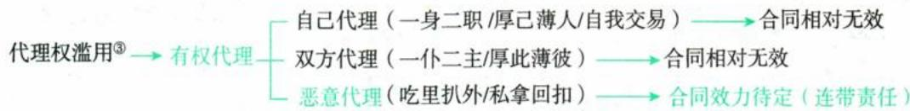

flowchart

```mermaid
graph LR
    A["代理权滥用③"] --> B["有权代理"]
    B --> C["自己代理（一身二职/厚己薄人/自我交易）"] --> D["合同相对无效"]
    B --> E["双方代理（一仆二主/厚此薄彼）"] --> F["合同相对无效"]
    B --> G["恶意代理（吃里扒外/私拿回扣）"] --> H["合同效力待定（连带责任）"]
```

(代理权滥用的体系框架图)

代理具有强烈的人身信赖关系。因此，代理人必须善意行使代理权，不得滥用代理权。代理权滥用属于违反诚信原则的行为。

#### (一) 自己代理

#### 1. 含义。

自己代理，是指代理人以被代理人的名义与自己实施的民事法律行为。

禁止自己代理的法理在于合同乃双方民事法律行为，当事人都追求自身利益的最大化；而自己代理订立的合同，是代理人的单方行为，很难避免发生代理人为自己利益而牺牲被代理人利益的情况。所以，原则上代理人不得自己代理。

[萌主点拨] 通俗而言，自己代理就是“一身二职”，既是代理人，又是出卖人。

[例] 孟某委托马某前往云南购买普洱茶。马某自己就是种植普洱茶的茶农。马某原则上不可以以孟某的名义与自己签订茶叶买卖合同，但是孟某同意或追认的除外。

① 考查 1 次，抓住重点。
② 考查 4 次，常考点，重点关注。
③《民法典》第132条 [禁止权利滥用原则] 民事主体不得滥用民事权利损害国家利益、社会公共利益或者他人合法权益。

#### 2. 法律后果。

基于 “相对无效理论”，被代理人同意或追认的，民事法律行为有效。被代理人不同意或不追认的，民事法律行为无效。

#### (二) 双方代理

#### 1. 含义。

双方代理，是指一个代理人同时代理双方当事人的民事法律行为的情况，即一个人既作为卖方的代理人又作为买方的代理人。

禁止双方代理的法理在于在交易中，当事人双方的利益总是互相冲突的，通过讨价还价，才能使双方的利益达到平衡。而由同一个人代理双方利益，可能会只反映了代理人一人的意志，难免顾此失彼。由于双方代理不符合代理权的基本原则，有可能会引发道德风险。所以，代理人原则上不得“双方代理”。

[萌主点拨] 通俗而言，双方代理就是“一仆二主（一手托两家）”，既是出卖人的代理人，又是买受人的代理人。

[例] 孟某委托马某前往云南购买普洱茶。同时，曹某委托马某出售普洱茶。马某原则上不可以以孟某的名义与曹某签订茶叶买卖合同。但是孟某和曹某双方同意或追认的除外。

#### 2. 法律后果。

基于 “相对无效理论”，被代理的双方同意或追认的，民事法律行为有效。被代理的双方不同意或不追认的，民事法律行为无效。

#### （三）恶意代理

#### 1. 含义。

恶意代理，是指在代理过程中，代理人与第三人以损害被代理人的利益为目的，弄虚作假的违法行为。

[萌主点拨] 通俗而言，恶意代理就是“吃里扒外（私拿回扣）”。

#### 2. 法律后果。

代理人恶意代理的，合同效力待定。公司追认的，该行为对公司发生效力；公司不追认的，该行为对公司不发生效力。恶意代理给公司造成损失的，代理人和相对人承担连带责任（《民法典》第164条和《民法典合同编通则解释》第23条）。

#### >> 随堂练习

潘某有一批珍贵红木，委托仲某找买家，刘某出价600万元，辛某出价400万元。仲某以潘某名义与刘某缔约时，辛某找到仲某表示愿意给仲某50万元回扣，出价350万元购入该红木，仲某同意。后仲某告知潘某红木市场状况欠佳，只能以该价卖出。仲某与辛某签订了合同。请问就仲某的行为，以下选项正确的是？(2021金题-2-1-2，单)①

A. 仲某为无权代理
B. 仲某与辛某对潘某的损失为连带责任
C. 该合同当然无效
D. 该合同当然有效

#### 四、复代理（转委托） $^{①}$

[例] 3月2日，孟某委托马某前往浙江省杭州市购买明前西湖龙井茶1000斤（特级）。4月1日，马某来到杭州后水土不服，突发急病，前往医院治疗。眼看清明将至，为了孟某的利益，马某欲将此事转委托给自己的好友曹某，电话征求孟某的同意，但始终无法与孟某取得联系。无奈之下，马某只好先斩后奏，将购买龙井茶一事转委托给曹某，但情急之下，忘记（有过错）告知曹某购买茶叶的级别。4月6日，曹某亲自前往当地茶农徐某家中购买龙井茶（一级），为压低购买价格，威胁茶农徐某，如不低价出卖茶叶，将刺伤徐某的女儿。无奈之下，徐某只好低价出卖茶叶1000斤（全部损失共2万元）。根据上述案情及示意图，请回答如下问题：

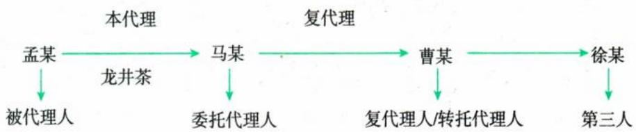

flowchart

```mermaid
graph LR
    A["孟某"] -->|本代理| B["马某"]
    B -->|复代理| C["曹某"]
    C --> D["徐某"]
    A -->|被代理人| E["龙井茶"]
    B -->|委托代理人| F["复代理人/转托代理人"]
    C -->|第三人| G["第三人"]
```

##### (复代理当事人法律关系示意图)

(1) 马某将购买龙井茶一事转委托给曹某，应以谁的名义选任？

答：自己的名义。

(2) 曹某是马某的代理人还是孟某的代理人?

答：孟某。

(3) 马某在未征得孟某事前同意的情况下，是否有权自行将购茶一事转委托给曹某？

答：有权。因为紧急情况下，为被代理人的利益，可以直接转委托。

(4) 茶农徐某的损失2万元是否可以直接向孟某请求赔偿?

答：可以。因为基于合同相对性原理，孟某和徐某系茶叶买卖合同的当事人。

(5) 孟某承担责任后，是否有权请求马某赔偿损失？

答：有权。因为马某有指示过错（忘记告知购买茶叶的级别）。

(6) 孟某承担责任后，是否有权请求马某和曹某向自己承担连带责任？

答：有权。因为曹某（复代理人/转托代理人）有过错。

#### (一) 含义

原则上，代理人应当亲自行使代理权。复代理，又称“转委托”，是指代理人为被代理人的利益将其所享有的代理权转托他人而产生的代理（《民法典》第169条）。

#### (二) 特征

1. 复代理人是由代理人以自己的名义选任。

在复代理中，代理人为被代理人选择复代理人时，要以自己的名义进行选任而非以被代理人的名义进行选任。复代理人是代理人基于复任权而选任的。法定代理人当然享有复任权。但是，委托代理人的复任权必须经被代理人（本人）事前授权、同意或事后追认。

2. 复代理人是被代理人的代理人而非代理人的代理人。

在复代理中，代理人虽然是以自己的名义为被代理人选任复代理人，但选任一旦完毕，复代理人乃被代理人的代理人而非代理人的代理人。

3. 复代理人的代理权限以代理人的权限为限。

复代理人的代理权限以代理人的权限为限，这一特征是代理制度的应有之义。

4. 法律效果由本人承担。

复代理人是本人（被代理人）的代理人，法律效果当然应归属于本人（被代理人）。

#### (三) 产生

复代理的产生主要包括三种方式：

1. 事前本人授权或同意。

[例] 甲委托乙购买某品牌新款手机并预付了购机款，乙又委托丙办理此事，但未将购机款交给丙，也未征求甲的意见。丙购得手机后交给甲，甲拒绝接受。乙的转委托行为无效，因为未征得甲的同意。

2. 事后本人追认。

3. 紧急情况下，为被代理人的利益。由于急病、通讯联络中断、疫情防控等特殊原因，委托代理人自己不能办理代理事项，又不能与被代理人及时取得联系，如不及时转托第三人代理，会给被代理人的利益造成损失或扩大损失的，属于紧急情况（《民法典总则编解释》第26条）。

#### (四) 责任承担

委托代理人转托他人代理的，因委托代理人转托不明，给第三人造成损失的，第三人可以直接要求被代理人赔偿损失；被代理人承担民事责任后，可以要求委托代理人赔偿损失，转托代理人有过错的，应当负连带责任。

#### 五、职务代理（商事代理）①

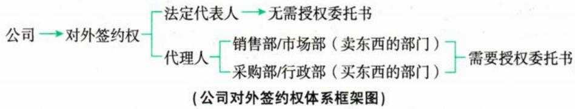

flowchart

```mermaid
graph TD
    A["公司"] --> B["对外签约权"]
    B --> C["法定代表人"]
    C --> D["无需授权委托书"]
    B --> E["代理人"]
    E --> F["销售部/市场部（卖东西的部门）"]
    E --> G["采购部/行政部（买东西的部门）"]
    F --> H["需要授权委托书"]
    G --> H
```

#### (一) 含义

职务代理，是指根据代理人所担任的职务而产生的代理。

#### (二) 特征

1. 被代理人是法人或非法人组织。如果被代理人是自然人，只能采用一般的民事代理。民事代理遵循“一事一授权”规则；商事代理遵循“职位所产生的概括授权”规则。
2. 代理人须是执行法人或非法人组织工作任务的人员，如工厂采购员、商店售货员、劳务派遣单位派遣到用工单位的工作人员。
3. 代理事项须是职权范围内的事项。职权范围的判断标准就是：“是否属于本职工作”。如果是本职工作就是职务代理，如果不是本职工作就是无权代理。

[例] 甲公司开发的系列楼盘由乙公司负责安装电梯设备（建设工程施工合同）。乙公司完工并验收合格投入使用后，甲公司一直未支付工程款，乙公司也未催要。诉讼时效期间届满后，乙公司组织工人到甲公司讨要。因高级管理人员均不在，甲公司新录用的法务（代理人）小王，擅自（无权）以公司名义（谁的名义谁是合同当事人）签署了同意履行付款义务的承诺函，工人们才散去。其后，乙公司提起诉讼。法务小王的行为不构成职务代理。因为欠款是否偿还仅法定代表人能决定，不属于法务小王的职权范围。

#### (三) 责任承担、

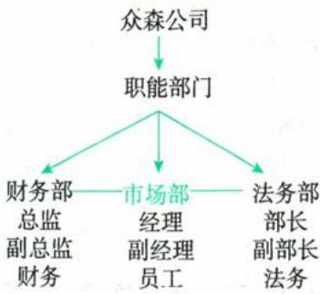

flowchart

```mermaid
graph TD
    A["众森公司"] --> B["职能部门"]
    B --> C["财务部\n总监\n副总监\n财务"]
    B --> D["市场部\n经理\n副经理\n员工"]
    B --> E["法务部\n部长\n副部长\n法务"]
```

(职务代理法律关系示意图)

执行法人或非法人组织工作任务的人员，就其职权范围内的事项，以法人或非法人组织的名义实施民事法律行为，对法人或非法人组织发生效力。法人或非法人组织对执行其工作任务的人员职权范围的限制，不得对抗善意相对人（《民法典》第170条和《民法典合同编通则解释》第21条）。

[萌主点拨] 内部权限限制，不得对外，内外有别。

[例] 众森公司的市场部内部对各级工作人员进行了职权限制。其中，总监对外可以签订不超过2000万元的购销合同；副总监对外可以签订不超过1000万元的购销合同；工作人员对外可以签订不超过100万元的购销合同。10月16日，众森公司市场部新录用的员工小孟与海马公司签订了一份金额为500万元的设备购销合同。该购销合同合法有效。因为内部权限限制不得对外，内外有别。

#### 六、狭义无权代理和表见代理

#### (一) 狭义无权代理 $^{①}$

狭义无权代理，是指行为人没有代理权、超越代理权或代理权终止后，仍然以被代理人的名义实施民事法律行为。

行为人没有代理权、超越代理权或代理权终止后，仍然实施代理行为，未经被代理人追认的，对被代理人不发生效力。

相对人可以催告被代理人自收到通知之日起30日内予以追认。被代理人未作表示的，视为拒绝追认。行为人实施的行为被追认前，善意相对人有撤销的权利。撤销应当以通知的方式作出。

行为人实施的行为未被追认的，善意相对人有权请求行为人履行债务或就其受到的损害请求行为人赔偿。但是，赔偿的范围不得超过被代理人追认时相对人所能获得的利益。

相对人知道或应当知道行为人无权代理的，相对人和行为人按照各自的过错承担责任（《民法典》第171条）。

[例] 肖某系甲烟草公司（以下简称甲公司）经理（代理人），因违纪被开除（没有代理权），后伪造公章（看人不看章），于5月25日以甲公司名义（谁的名义谁是当事人）与不知情（善意）的乙公司约定，向乙公司出售烟草50箱，价款50万元。6月1日，乙公司得知肖某被开除，询问（催告权）甲公司是否认可该合同，6月10日，甲公司通知乙公司不承认（不追认）肖某所订立的香烟合同。根据上述案情及示意图，请回答如下问题：

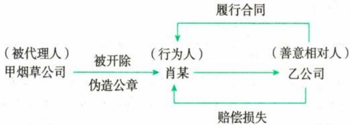

flowchart

```mermaid
graph TD
    A["（被代理人）\n甲烟草公司"] -->|被开除\n伪造公章| B["（行为人）\n肖某"]
    B --> C["（善意相对人）\n乙公司"]
    C -->|履行合同| B
    B -->|赔偿损失| C
```

(无权代理当事人法律关系示意图)

(1) 香烟合同的当事人是谁和谁?

答：甲公司和乙公司。

(2) 5月25日，甲公司和乙公司的香烟合同是否成立？

答：成立。

(3) 5月25日，甲公司和乙公司的香烟合同效力如何？

答：效力待定。

(4) 6月1日，乙公司询问甲公司是否认可该合同是在行使何种权利？

答：催告权（不属于形成权/意思通知行为/准民事法律行为）。

(5) 6月10日，甲公司通知乙公司不承认肖某所订立的香烟合同是在行使何种权利？

答：拒绝权（否认权/属于形成权）。

(6) 6月10日前，善意相对人乙公司享有何种权利？

答：撤销权（简单形成权）。行为人实施的行为被追认前 $^{①}$ ，善意相对人有撤销的权利。撤销应当以通知的方式作出（《民法典》第171条第2款）。

(7) 甲公司行使拒绝权后，香烟合同对甲公司是否发生效力？

答：不发生效力（即甲公司无需履行合同）。

(8) 甲公司行使拒绝权后，善意相对人乙公司有何权利？

答：选择权（择一选择/《民法典》第171条第3款和《民法典总则编解释》第27条）。

①乙公司有权请求肖某履行合同（法律拟制）；

②乙公司有权请求肖某赔偿损失。

(9) 乙公司的选择权是否属于形成权?

答：属于。形成权是指依权利人单方（一方）意思表示而使民事法律关系产生、变更或消灭（即“私法效果”）的权利。

#### (二) 表见代理 (商事或权利外观主义) $^{①}$

表见代理，又称“外观授权代理”，是指行为人虽没有代理权，但相对人在客观上有理由相信其有代理权而与其实施民事法律行为，该民事法律行为的后果由本人（被代理人）承担的代理。

无权代理和表见代理的核心区别是：第三人是否有理由相信行为人有代理权，包括主客观相结合的构成要件：

1. 主观要件：主观上相对人要善意且无过失。

（1）善意，是指不知情、不了解、不知悉，即不知行为人没有代理权。民法上的善意，一般而言是一种消极、单纯和推定的善意。法律推定相对人为善意，被代理人应当就相对人不善意承担举证责任。

（2）无过失，是指尽到必要的审查义务，一般是指对于行为人出示的授权文件或职位的形式审查义务（即对权利外观进行形式审查）而非实质审查义务（即无须核实）。

[萌主点拨] 表见代理之所以对相对人善意的要求更高是因为相对人已知被代理人为何人的情况下，对其确认代理权有无需要给予更高的注意，因而只有在相对人“无过失”的情形下，才能限制被代理人的意思自治（自由）转而保护交易安全。相对人因自身的轻过失或一般过失导致的不知道无权代理的事实，也不能适用表见代理。

2. 客观要件：客观上要存在权利外观。权利外观主要包括四类，分别是：

(1) 授权委托书。

(2) 业务介绍信。

(3) 交易习惯。题目中关键词往往是：经常、往常、通常、常常、长期等。

(4) 签约地在被代理人营业地或办公场所等。

代理
- 恶意代理 → 现员工 → 吃里扒外私拿回扣 → 合同效力待定 → 不追认 → 共同侵权 → 连带
- 职务代理 → 现员工 → 幅度越权 → 合同合法有效 → 内部追偿
- 无权代理 → 现员工/前员工（主动离职/被动开除） → 合同效力待定
- 表见代理 → 现员工/前员工（主动离职/被动开除） → 合同合法有效 → 有理由相信

(恶意代理、职务代理、无权代理和表见代理体系框架图)

##### [萌主点拨1]

代理人 VS 代表人（统称为“经办人或经手人”）

<table><tr><td>事项</td><td>与法人关系</td><td>授权委托书</td><td>与法人系几个主体</td><td>职务侵权责任可否内部追偿</td></tr><tr><td>代理人</td><td>代理关系(N个)</td><td>需要</td><td>永远是2个,只是最终法律效果归属于被代理人</td><td>可以向有故意或重大过失的工作人员追偿</td></tr><tr><td>代表人</td><td>代表关系(1个)</td><td>不需要</td><td>原则上2个,例外1个(以法人名义从事职务行为)</td><td>可以向有过错的法定代表人追偿</td></tr></table>

##### [萌主点拨2]

表见代理 VS 表见代表（商事外观主义/权利外观主义）

<table><tr><td>项目</td><td>法律依据</td><td>定主体</td><td>定行为</td><td colspan="3">相对人</td><td>合同效力</td><td>责任承担</td><td>内部追偿</td></tr><tr><td>表见代理</td><td>《民法典》第172条</td><td>执行公司事务的董事或经理以外的人</td><td>营业/经营合同</td><td>形式审查</td><td>授权委托书</td><td>有理由相信行为人有代理权</td><td>合法有效</td><td>公司承担</td><td>用工责任(故意/重大过失)</td></tr><tr><td>表见代表</td><td>《民法典》第504条</td><td>执行公司事务的董事或经理</td><td>担保合同</td><td>合理审查</td><td>公司决议或公开披露的信息</td><td>有理由相信行为人有代表权</td><td>合法有效</td><td>公司承担</td><td>股东代表诉讼(有过错)</td></tr></table>

#### 七、异常人章关系

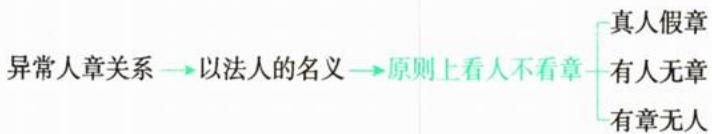

flowchart

```mermaid
graph LR
    A["异常人章关系"] --> B["以法人的名义"]
    B --> C["原则上看人不看章"]
    C --> D["真人假章"]
    C --> E["有人无章"]
    C --> F["有章无人"]
```

(异常人章关系的体系框架图)

#### (一) 真人假章

法定代表人、负责人或工作人员以法人、非法人组织的名义订立合同且未超越权限，法人、非法人组织仅以合同加盖的印章不是备案印章或系伪造的印章为由主张该合同对其不发生效力的，法院不予支持（《民法典合同编通则解释》第22条第1款）。

#### >> 随堂练习

甲公司与乙公司订立《钢材购销合同》，双方法定代表人刘某和谢某经各自董事会决议分别代表甲乙公司订立合同，且均已签字盖章。乙公司在后续合同履行过程中发现钢材购销合同中所盖甲公司公章系其法定代表人刘某伪造。关于《钢材购销合同》的效力，下列说法正确的是？(2024金题-2-1-3，单)①

A. 合同有效
B. 合同效力待定
C. 合同无效
D. 合同不成立

#### (二)有人无章

合同系以法人、非法人组织的名义订立，但是仅有法定代表人、负责人或工作人员签名或按指印而未加盖法人、非法人组织的印章，相对人能够证明法定代表人、负责人或工作人员在订立合同时未超越权限的，法院应当认定合同对法人、非法人组织发生效力。但是，当事人约定以加盖印章作为合同成立条件的除外（《民法典合同编通则解释》第22条第2款）。

#### (三) 有章无人

合同仅加盖法人、非法人组织的印章而无人员签名或按指印，相对人能够证明合同系法定代表人、负责人或工作人员在其权限范围内订立的，法院应当认定该合同对法人、非法人组织发生效力（《民法典合同编通则解释》第22条第3款）。

text_image

百度网盘扫码加好友，
获取后续完整极速更新

## 05 专题五 诉讼时效

#### 复习提要

诉讼时效规定在《民法典》第一编总则第九章（第188—199条），共12条。同时，《诉讼时效的规定》共21条进一步补充细化规定了诉讼时效制度。本专题主要涉及五个问题：1. 诉讼时效的基本原理；2. 诉讼时效的种类；3. 诉讼时效的起算；4. 诉讼时效的中止；5. 诉讼时效的中断。诉讼时效制度属于客观题必考点，在备考过程中必须重点掌握，特别是诉讼时效的中断问题。

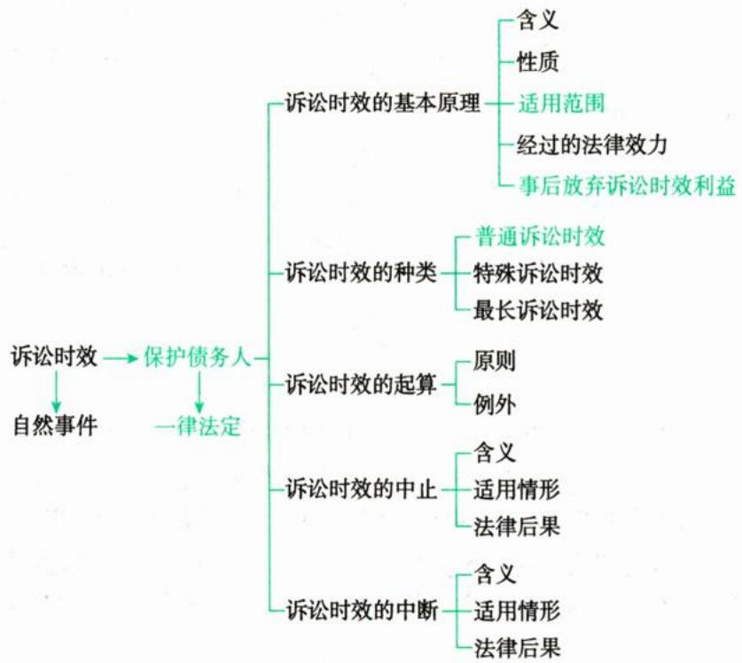

flowchart

```mermaid
graph TD
    A["诉讼时效"] --> B["自然事件"]
    A --> C["保护债务人"]
    C --> D["诉讼时效的基本原理"]
    D --> E["含义"]
    D --> F["性质"]
    D --> G["适用范围"]
    D --> H["经过的法律效力"]
    D --> I["事后放弃诉讼时效利益"]
    C --> J["诉讼时效的种类"]
    J --> K["普通诉讼时效"]
    J --> L["特殊诉讼时效"]
    J --> M["最长诉讼时效"]
    C --> N["诉讼时效的起算"]
    N --> O["原则"]
    N --> P["例外"]
    C --> Q["诉讼时效的中止"]
    Q --> R["含义"]
    Q --> S["适用情形"]
    Q --> T["法律后果"]
    C --> U["诉讼时效的中断"]
    U --> V["含义"]
    U --> W["适用情形"]
    U --> X["法律后果"]
```

#### 一、诉讼时效的基本原理

#### (一) 含义

诉讼时效，是指权利人不行使权利，经过法定期间，使债务人取得拒绝履行抗辩权的法律效果的制度。

#### (二) 性质

诉讼时效在性质上属于强制性规定。即不允许当事人进行任何的创设或改变，一律由法律规定。诉讼时效的期间、计算方法以及中止、中断的事由由法律规定，当事人约定无效。当事人对诉讼时效利益的预先放弃无效（《民法典》第197条）。

#### (三) 适用范围①

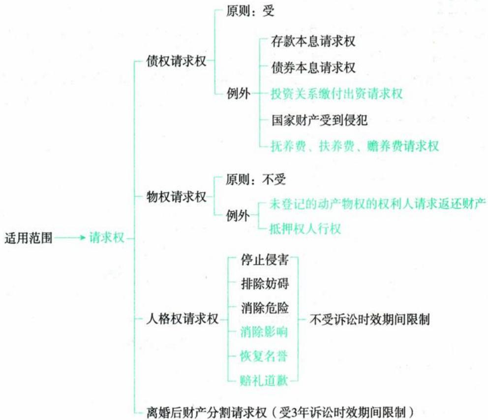

flowchart

```mermaid
graph TD
    A["适用范围"] --> B["请求权"]
    B --> C["债权请求权"]
    C --> D["原则：受"]
    C --> E["例外"]
    E --> F["存款本息请求权"]
    E --> G["债券本息请求权"]
    E --> H["投资关系缴付出资请求权"]
    E --> I["国家财产受到侵犯"]
    E --> J["抚养费、扶养费、赡养费请求权"]
    B --> K["物权请求权"]
    K --> L["原则：不受"]
    K --> M["例外"]
    M --> N["未登记的动产物权的权利人请求返还财产"]
    M --> O["抵押权人行权"]
    B --> P["人格权请求权"]
    P --> Q["停止侵害"]
    P --> R["排除妨碍"]
    P --> S["消除危险"]
    P --> T["消除影响"]
    P --> U["恢复名誉"]
    P --> V["赔礼道歉"]
    P --> W["不受诉讼时效期间限制"]
    B --> X["离婚后财产分割请求权（受3年诉讼时效期间限制）"]
```

(诉讼时效期间适用范围体系框架图)

《民法典》第196条和《诉讼时效的规定》第1条共2条规定了诉讼时效的适用范围。诉讼时效主要适用于请求权（权利人和义务人均特定），具体而言，包括债权请求权（通俗而言，就是“要钱不要物”）和物权请求权（通俗而言，就是“要物不要钱”）。

#### 1. 债权请求权。

诉讼时效期间（催促行权期间）原则上仅适用于债权请求权。但是，如下5类债权请求权亦不受诉讼时效期间的限制。

（1）支付存款本金及利息请求权。支付存款本金及利息请求权之所以不受诉讼时效期间限制，是因为债权人并没有怠于行使权利，而是在积极行使权利。因此，债务人不得以诉讼时效期间届满为由而拒绝返还存款本息。
(2) 兑付国债、金融债券以及向不特定对象发行的企业债券本息请求权。
(3) 基于投资关系产生的缴付出资请求权。

[萌主点拨] 业主大会请求业主缴付公共维修基（资）金的权利可以类推适用投资关系规则，不适用诉讼时效限制。但是，物业费请求权属于普通的债权请求权，适用3年诉讼时效期间的限制。

（4）国家财产受到侵犯。为防止国有资产流失，未授权给自然人或法人经营、管理的国家财产受到侵犯的，不受诉讼时效期间的限制。
（5）救命钱，即请求支付抚养费（长辈对晚辈）、赡养费或扶养费（同辈之间）。为了保护弱势群体的生存权，基于立法政策考量，“三费”不受诉讼时效期间的限制，否则有违公序良俗。

[萌主点拨] “劳动者的工资债权” 受诉讼时效期间限制。

2. 物权请求权。

(1) 不动产。

不动产物权的权利人请求返还财产的，不适用诉讼时效期间的限制。因为不动产物权存在“登记”制度，不存在举证困难，不会浪费司法资源。

(2) 登记的动产物权的权利人请求返还财产不适用诉讼时效的规定。

机动车、船舶、航空器等动产，价值较大，被称为“准不动产”，准用不动产管理的很多规则，这类动产多进行物权登记。如果进行了登记，与不动产登记一样，产生强有力的公示公信效力。因此，登记的动产物权的权利人请求返还财产不适用诉讼时效的规定。

(3) 未登记的动产物权的权利人请求返还财产适用诉讼时效的规定。

在实践中，一律规定所有的动产物权的权利人返还财产请求权不适用诉讼时效，在操作上面临很多困难，也没有必要。一般动产价值小、流动大、易耗损，如果不适用诉讼时效的规定，多年后再提起诉讼，一是因年代久远存在举证困难；二是增加诉累；三是不利于矛盾的及时解决。因此，普通动产适用诉讼时效。

(4) 抵押权人行权。

抵押权人应当在主债权诉讼时效期间行使抵押权；未行使的，法院不予保护（《民法典》第419条）。

3. 人格权请求权。

人格权受到侵害的，受害人有权依照《民法典》和其他法律的规定请求行为人承担民事责任。受害人的停止侵害、排除妨碍、消除危险、消除影响、恢复名誉、赔礼道歉请求权，不适用诉讼时效的规定（《民法典》第995条）。

4. 离婚后财产分割请求权。

当事人依据《民法典》第1092条的规定向法院提起诉讼，请求再次分割夫妻共同财产的诉讼时效期间为3年，从当事人发现之日起计算（《民法典婚姻家庭编解释（一）》第84条）。

#### (四) 经过的法律效力 $^{①}$

[例] 2021年10月10日，孟某向马某借款2000万元，双方约定借款期限为1年。根据上述案情及示意图，请回答如下问题：

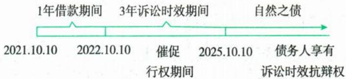

text_image

1年借款期间
2021.10.10
2022.10.10
催促
行权期间
3年诉讼时效期间
2025.10.10
自然之债
债务人享有
诉讼时效抗辩权

##### (诉讼时效期间经过的法律效力关系示意图)

（1）2021年10月10日至2022年10月10日借款期间内，债权人马某可否请求债务人孟某偿还借款？

答：不可以。因为未到期的债权视为无债权（债务人享有期限利益）。

（2）2022年10月11日至2025年10月10日诉讼时效期间内，债权人马某可否请求债务人孟某偿还债务？

答：可以。

（3）2025年10月16日（即3年诉讼时效期间届满后），债权人马某向北京市海淀区人民法院起诉债务人孟某还款的，法院应否受理？

答：应当受理，不得裁定不予受理。因为诉讼时效期间届满后，虽然2000万元债权变成了自然之债（丧失了法院的强制执行力/只能由债权人自力救济）。但是，债权本身依然存在。因此，法院必须受理。

##### [萌主点拨] 抗辩权发生说

抗辩权发生说认为，诉讼时效期间届满后，实体权利、诉权都不消灭，义务人取得拒绝履行的抗辩权。当然，义务人可以行使该抗辩权，也可以放弃该抗辩权自愿履行义务。立法者之所以选择抗辩权发生说，是因为该学说更符合诉讼时效制度的内在原理，也更有利于维护当事人的合法权益和维护交易秩序的稳定。

（4）北京市海淀区人民法院在审理该案期间，是否可以主动向被告孟某释明②诉讼时效期间已经经过的事实或主动适用诉讼时效的规定判决原告马某败诉？

答：不可以。因为如果法院主动释明或适用诉讼时效的规定判决原告败诉，等同于实质上剥夺了原告的实体权利（2000万元债权），与诉讼时效的立法功能完全相悖。因此，法院应当被动司法，不得主动释明或适用诉讼时效的规定（《民法典》第193条/《诉讼时效的规定》第2条）。

（5）北京市海淀区人民法院在审理该案期间，如被告孟某提出诉讼时效抗辩权，法院应如何处理？

答：判决驳回原告马某的诉讼请求（结合民事诉讼法：被告孟某提出的诉讼时效抗辩权不是反诉而是反驳/抗辩）。

(6) 北京市海淀区人民法院在审理该案期间, 如被告孟某未提出诉讼时效抗辩权, 法院应如何处理?

答：判决原告马某胜诉。

（7）马某胜诉后，孟某不服，向北京市第一中级人民法院提出上诉。二审期间，上诉人孟某可否提出诉讼时效抗辩权？

答：原则上不可以，除非有新证据。因为基于审判职能的要求，一审法院的核心职能是查清事实（事实审），二审法院的核心功能是审查一审法院适用法律是否正确（法律审）。诉讼时效期间是否经过属于事实问题，因此，原则上应在一审期间提出（《诉讼时效的规定》第3条）。

对于诉讼时效期间经过后的效力问题，存在不同的学说观点，学界主流观点（法考亦采纳该观点）是抗辩权发生说。

#### 1. 起诉。

对于诉讼时效期间届满后，权利人起诉的，法院应当受理，不得裁定不予受理。在抗辩权发生主义下，债权人不丧失起诉权。

#### 2. 审理。

诉讼时效抗辩权系义务人的私权利，义务人是否行使自行决定，法院既不能主动释明，也不能主动适用（被动司法）。

（1）债务人及其法定代理人、委托代理人、法定代表人在审理过程中提出诉讼时效抗辩的，法院应当判决驳回原告的诉讼请求。

（2）债务人及其法定代理人、委托代理人、法定代表人在审理过程中未提出诉讼时效抗辩的，法院应当判决原告胜诉。

#### 3. 行权时间阶段。

债务人要进行诉讼时效抗辩需在一审期间提出，在二审期间提出的，原则上不予支持，除非存在“新证据”。

#### (五) 事后放弃诉讼时效利益①

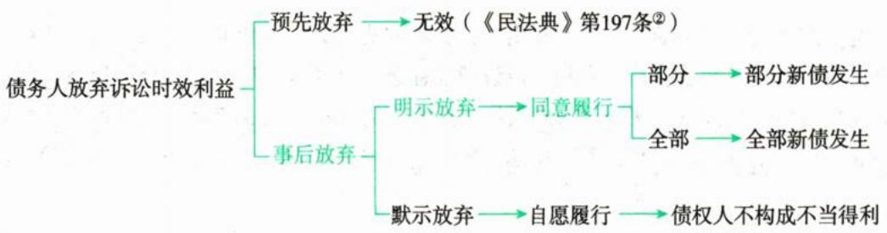

flowchart

```mermaid
graph TD
    A["债务人放弃诉讼时效利益"] --> B["预先放弃"]
    B --> C["无效（《民法典》第197条②）"]
    A --> D["事后放弃"]
    D --> E["明示放弃"]
    E --> F["同意履行"]
    F --> G["部分"]
    F --> H["全部"]
    G --> I["部分新债发生"]
    H --> J["全部新债发生"]
    D --> K["默示放弃"]
    K --> L["自愿履行"]
    L --> M["债权人不构成不当得利"]
```

(诉讼时效利益放弃体系框架图)

#### 1. 含义。

诉讼时效利益的放弃，是指诉讼时效期间届满后，义务人取得诉讼时效抗辩权，在义务人知道其享有诉讼时效抗辩权的情况下，可以选择放弃其诉讼时效利益。

#### 2. 方式。

虽然当事人之间不得“事前”对诉讼时效问题进行约定，但允许“事后”放弃诉讼时效利益，即在诉讼时效期间届满后，允许当事人对诉讼时效问题进行约定。对于“事后放弃诉讼时效利益”而言，包括两种方式：

#### (1) 明示——同意履行。

诉讼时效期间届满后，债务人虽未自愿履行但已作出同意履行（明示，包括书面、口头等表意方式）的意思表示的，视为放弃诉讼时效利益，诉讼时效期间重新起算。

义务人在诉讼时效期间届满后同意履行的，原债权由不完整的债权转为完整债权，诉讼时效期间应重新起算。诉讼时效重新起算的原因并非诉讼时效中断，而是新的债权债务关系的形成（即“死灰复燃”），具有强制执行力，即单方允诺之债。债务人同意履行全部债务的，全部债务诉讼时效期间重新起算；债务人同意履行部分债务的，在同意的范围内诉讼时效期间重新起算。

[例] 甲公司向乙公司催讨一笔已过诉讼时效期间的10万元货款。乙公司书面答复称：“该笔债务已过时效期间，本公司本无义务偿还，但鉴于双方的长期合作关系，可偿还3万元。”甲公司遂向法院起诉，要求偿还10万元。乙公司接到应诉通知后书面回函甲公司称：“既然你公司起诉，则不再偿还任何货款。”乙公司的书面答复构成单方允诺之债，表明其丧失了3万元的时效利益。

#### (2) 默示——自愿履行。

诉讼时效期间届满后，债务人自愿履行（默示行为）的，视为放弃诉讼时效利益，不得反悔；债权人受领给付的，不构成不当得利。

#### 二、诉讼时效的种类①

#### (一) 普通诉讼时效

为适应社会生活中新的情况不断出现，交易方式与类型不断创新，权利义务关系更趋复杂的现实情况与司法实践，有利于建设诚信社会，更好地保护债权人合法权益。在法律没有特别规定的情况下，普通诉讼时效期间原则上为3年。该3年诉讼时效期间，可以适用中止、中断的规定。但是，不适用延长的规定（《民法典总则编解释》第35条）。

#### (二) 特殊诉讼时效

因国际货物买卖合同和技术进出口合同争议一般比较复杂、涉及标的额也较大，为了更有效地保护当事人的合法权益，法律规定了比普通诉讼时效更长的期间，即因国际货物买卖合同和技术进出口合同争议提起诉讼或申请仲裁的时效期间为4年。人寿保险的被保险人或受益人向保险人请求给付保险金的诉讼时效期间为5年。

#### (三) 最长诉讼时效

最长诉讼时效期间为20年。自权利受到损害之日起（客观起算标准）计算；有特殊情况①的，法院可以根据权利人的申请决定延长②。

为了充分保护权利人的合法权益，对已经完成的诉讼时效期间，如果有特殊情况（如医院抱错孩子，偷换人生28年），法院可以根据权利人的申请给予适当延长，但不适用中止、中断的规定（《民法典总则编解释》第35条）。

#### 三、诉讼时效的起算 $^{③}$

#### (一) 原则

原则上，诉讼时效期间的起算点自权利人知道（事实上的知道）或应当知道（推定的知道）权利受到损害以及义务人之日起计算（主观起算标准）。

#### (二) 例外

#### 1. 合同之债。

#### (1) 未约定履行期限。

未约定履行期限（无期限则无预期/随时行权）的合同，诉讼时效期间从债权人请求债务人履行义务的宽限期届满之日起计算，但债务人在债权人第一次向其主张权利之时明确表示不履行义务的，诉讼时效期间从债务人明确表示不履行义务之日起计算。

[例] 2025年3月2日，孟某向马某借款100万元，未约定还款期限。4月21日，马某请求孟某还款，并给孟某留有10天的宽限期。如孟某未明确拒绝，则从宽限期届满之日起计算3年诉讼时效期间；如孟某于当日明确表示不履行义务，则诉讼时效期间从债务人明确表示不履行义务之日起计算。

#### (2) 约定 1 个确定履行期限。

约定 1 个确定履行期限的，诉讼时效从履行期限届满之日起计算。

[例] 孟某向徐某出具借条，约定1周之内归还。徐某债权的诉讼时效期间1周后起算。

#### (3) 约定多个履行期限（即分期履行）。

当事人约定同一债务分期履行的，诉讼时效期间从最后一期履行期限届满之日起计算。

#### 2. 被监护人受到侵权。

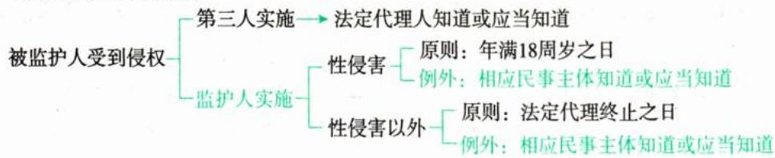

flowchart

```mermaid
graph TD
    A["被监护人受到侵权"] --> B["第三人实施"]
    A --> C["监护人实施"]
    B --> D["法定代理人知道或应当知道"]
    C --> E["性侵害"]
    C --> F["性侵害以外"]
    D --> G["原则：年满18周岁之日"]
    D --> H["例外：相应民事主体知道或应当知道"]
    E --> I["原则：法定代理终止之日"]
    E --> J["例外：相应民事主体知道或应当知道"]
```

(被监护人受到侵权的诉讼时效起算体系框架图)

① 特殊情况，必须是客观存在的，足以妨碍权利人行使请求权的事实，即权利人不是自己不行使权利，而是有客观原因不能行使权利。司法实务中，一般包括：（1）重大社会事件、自然灾害等不可抗力；（2）案件具有特殊性，导致纠纷解决时间过长；（3）特殊的人身保护案件。

② 诉讼时效期间的延长，是指人民法院对已经完成的诉讼时效延长其期限，仍对权利人的权利予以保护。法院不得以职权主动延长最长诉讼时效期间体现了私法自治和被动司法原则。

③ 考查 2 次，抓住重点。

#### (1) 原则。

无民事行为能力人或限制民事行为能力人对其法定代理人的请求权的诉讼时效期间，自该法定代理终止之日起计算（《民法典》第190条）。

未成年人遭受性侵害的损害赔偿请求权的诉讼时效期间，自受害人年满18周岁之日起计算（《民法典》第191条）。

#### (2) 例外。

无民事行为能力人、限制民事行为能力人的权利受到原法定代理人损害，且在取得、恢复完全民事行为能力或在原法定代理终止并确定新的法定代理人后，相应民事主体才知道或应当知道权利受到损害的，有关请求权诉讼时效期间的计算适用普通诉讼时效的规定（《民法典总则编解释》第37条）。

#### 四、诉讼时效的中止 $^{①}$

#### (一) 含义

《民法典》第194条确立了诉讼时效的中止制度。诉讼时效的中止，是指在诉讼时效进行中（最后6个月内），由于出现了法定事由（客观障碍）而暂停诉讼时效进行的法律制度。

诉讼时效中止的本质系权利人主观欲行权而客观行权不能（即欲达目的而不能），暂停计算诉讼时效。立法功能在于防止权利人非因自身原因而造成时效期间届满，保证权利人有足够的时间主张权利。

#### (二) 适用情形

在诉讼时效期间的最后6个月内，因下列障碍，不能行使请求权的，诉讼时效中止：（1）不可抗力（如洪水、海啸、新冠肺炎等）；（2）无民事行为能力人或限制民事行为能力人没有法定代理人，或法定代理人死亡、丧失民事行为能力、丧失代理权；（3）继承开始后未确定继承人或遗产管理人；（4）权利人被义务人或者其他人控制；（5）其他导致权利人不能行使请求权的障碍。

#### (三) 法律后果

在法定期限内发生中止事由时，诉讼时效期间暂停计算。自中止时效的原因消除之日起继续计算6个月。

[例] 2021年10月10日，孟某向马某借款2000万元，双方约定借款期限为1年。其中，2022年10月11日至2025年10月10日为3年诉讼时效期间。2025年4月10日至2025年10月10日为诉讼时效期间届满前6个月。根据上述案情及示意图，请回答如下问题：

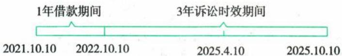

text_image

1年借款期间
3年诉讼时效期间
2021.10.10 2022.10.10 2025.4.10 2025.10.10

(诉讼时效中止的法律关系示意图)

（1）2025年5月10日（最后6个月内），孟某所在地发生地震（不可抗力）导致马某无法向孟某行使请求权。请问：借款合同的诉讼时效期间是否中止？

答：中止（暂停）。

(2) 2025年11月10日, 孟某所在地的震后重建工作全部完毕 (中止时效的原因消除), 当地恢复了正常的生产生活。请问: 借款合同的诉讼时效期间何时届满?

答：2026年5月10日（中止时效的原因消除之日起继续计算6个月）。

#### 五、诉讼时效的中断（清零重来）①

#### (一) 含义

《民法典》第195条、《诉讼时效的规定》第10条和《民法典总则编解释》第38条共3条规定了诉讼时效的中断制度。诉讼时效的中断，是指在诉讼时效进行中（整个诉讼时效期间内），因一定事由的发生，阻碍时效进行，致使以前经过的时效期间统归无效，从中断时起重新起算的制度。

#### (二) 适用情形

有下列情形之一的，诉讼时效中断，从中断、有关程序终结时起，诉讼时效期间重新计算：

1. 权利人向义务人提出履行请求；这里的“义务人”应作广义解释，包括义务人的代理人、财产代管人、遗产管理人或法定代表人等（《民法典总则编解释》第38条第2款）。同时，提出履行请求的方式也应当作“广义解释”，包括书面形式、口头形式、直接方式和间接方式等。

具有下列情形之一的，产生诉讼时效中断的效力：

（1）当事人一方直接向对方当事人送交主张权利文书，对方当事人在文书上签名、盖章、按指印或虽未签名、盖章、按指印但能够以其他方式证明该文书到达对方当事人的；

（2）当事人一方以发送信件或数据电文方式主张权利，信件或数据电文到达或应当到达对方当事人的；

（3）当事人一方为金融机构，依照法律规定或当事人约定从对方当事人账户中扣收欠款本息的；

（4）当事人一方下落不明，对方当事人在国家级或下落不明的当事人一方住所地的省级有影响的媒体上刊登具有主张权利内容的公告的，但法律和司法解释另有特别规定的，适用其规定。

上述第（1）项情形中，对方当事人为法人或其他组织的，签收人可以是其法定代表人、主要负责人、负责收发信件的部门或被授权主体；对方当事人为自然人的，签收人可以是自然人本人、同住的具有完全行为能力的亲属或被授权主体。

2. 义务人同意履行义务。

义务人同意履行包括：义务人作出分期履行、部分履行、提供担保、请求延期履行、制定清偿债务计划等承诺或行为的。

[例] 2023年5月，甲向乙借款10万元。同年10月，乙请求甲在2024年10月1日前还款，甲同意。后甲未按期还款。2024年11月1日，甲请求乙将还款期限延长（义务人请求延期履行，诉讼时效中断重新起算）1年，乙未同意。因甲迟迟未还款，乙拟提起诉讼。本案诉讼时效期间的起算点是2024年11月2日。

3. 权利人提起诉讼或申请仲裁。

当事人一方向法院提交起诉状或口头起诉的，诉讼时效从提交起诉状或口头起诉之日起中断。

4. 与提起诉讼或申请仲裁具有同等效力的其他情形。

#### (三) 法律后果

诉讼时效中断，已经经过的期间归于无效，从中断或有关程序终结时起，诉讼时效重新计算。同时，诉讼时效可以多次中断，但不能超过20年最长诉讼时效期间（《民法典总则编解释》第38条第1款）。

PART

# 第二部分

#### 物权编

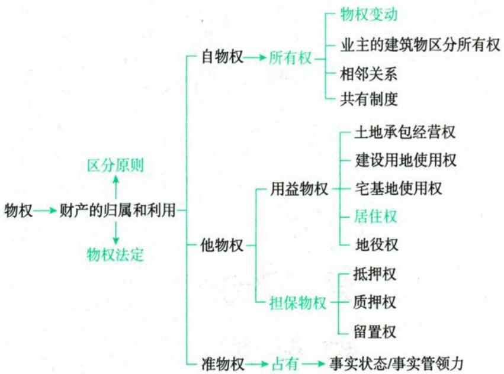

flowchart

```mermaid
graph TD
    A["物权"] --> B["财产的归属和利用"]
    B --> C["物权法定"]
    C --> D["区分原则"]
    D --> E["自物权"]
    E --> F["所有权"]
    F --> G["物权变动"]
    F --> H["业主的建筑物区分所有权"]
    F --> I["相邻关系"]
    F --> J["共有制度"]
    E --> K["他物权"]
    K --> L["用益物权"]
    L --> M["土地承包经营权"]
    L --> N["建设用地使用权"]
    L --> O["宅基地使用权"]
    L --> P["居住权"]
    L --> Q["地役权"]
    K --> R["担保物权"]
    R --> S["抵押权"]
    R --> T["质押权"]
    R --> U["留置权"]
    K --> V["准物权"]
    V --> W["占有"]
    W --> X["事实状态/事实管领力"]
```

[图释] 物权法律制度, “上涉国本, 下系民生”, 物权编的编纂目的就是 “定分止争、物尽其用”。物权编调整因物的归属和利用 (支配) 产生的民事关系。物权是权利人依法对特定的物享有直接支配和排他的权利。物权, 根据归属的不同, 分为 3 类, 分别是自物权、他物权和准物权 (准用物权的规则来处理, 即占有)。物权, 根据利用的不同, 分为 3 类, 分别是所有权 (使用价值 + 交换价值)、用益物权 (使用价值) 和担保物权 (交换价值)。贯穿物权制度始终的两项逻辑思维为: 1. 物权法定; 2. 区分原则。

物权编（第205—462条）共258条，约占整个《民法典》的 $20.48\%$ 。包括五个分编20章：

第一分编：通则（第205—239条，共35条）包括3章，分别是：一般规定；物权的设立、变更、转让和消灭；物权的保护。

第二分编：所有权（第240—322条，共83条）包括6章，分别是：一般规定；国家所有权和集体所有权、私人所有权；业主的建筑物区分所有权；相邻关系；共有；所有权取得的特别规定。

第三分编：用益物权（第323—385条，共63条）包括6章，分别是：一般规定；土地承包经营权；建设用地使用权；宅基地使用权；居住权；地役权。

第四分编：担保物权（第386—457条，共72条）包括4章，分别是：一般规定；抵押权；质权；留置权。

第五分编：占有（第458—462条，共5条）包括1章，即占有。

#### 06

## 专题六

#### 物权的基本原理

#### 复习提要

本专题主要涉及三个问题：1. 物的分类；2. 物权的三大效力；3. 物权的保护。特别是物权效力中的追及效力和优先效力乃重要考点。同时，对于物权的保护在近几年的考试中逐渐崭露头角，成为命题者的新宠，也需重点学习。

#### 一、物的分类 $^{①}$

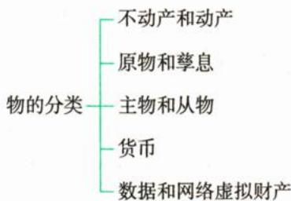

flowchart

```mermaid
graph TD
    A["物的分类"] --> B["不动产和动产"]
    A --> C["原物和孳息"]
    A --> D["主物和从物"]
    A --> E["货币"]
    A --> F["数据和网络虚拟财产"]
```

(物的分类体系框架图)

民法上的物，是指存在于人体之外，能够为人力所支配并能够满足人类某种需要，且具有稀缺性的物质对象，包括有体物和自然力。

#### (一) 不动产和动产

标准：能否移动以及移动是否影响经济价值。

#### 1. 不动产。

不动产，是指不能移动或虽能移动但会因移动损害价值的物。包括土地、海域以及地上或海上定着物，如房屋、建筑物、构筑物、林木、桥梁、堤坝、纪念碑等。

#### 2. 动产。

动产，是指能够移动且不因移动损害其价值的物。包括机动车、自行车、相机、机器设备（挖掘机、推土机、铲车、吊车）等。

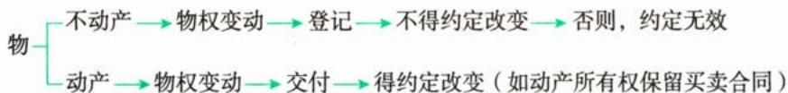

flowchart

```mermaid
graph TD
    A["物"] --> B["不动产"]
    A --> C["动产"]
    B --> D["物权变动"]
    C --> E["物权变动"]
    D --> F["登记"]
    E --> G["交付"]
    F --> H["不得约定改变"]
    G --> I["得约定改变（如动产所有权保留买卖合同）"]
    H --> J["否则，约定无效"]
```

(不动产和动产分类的意义体系框架图)

#### (二) 原物和孳息

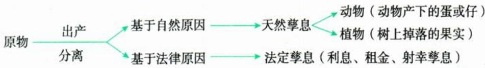

flowchart

```mermaid
graph TD
    A["原物"] --> B["出产"]
    A --> C["分离"]
    B --> D["基于自然原因"]
    B --> E["基于法律原因"]
    D --> F["天然孳息"]
    F --> G["动物（动物产下的蛋或仔）"]
    F --> H["植物（树上掉落的果实）"]
    E --> I["法定孳息（利息、租金、射幸孳息）"]
```

(原物和孳息法律关系示意图)

标准：两物之间的派生关系。

1. 原物。

原物，是指能够产生收益的物。

2. 擎息。

孳息，是指由原物所生的物或收益，包括天然孳息和法定孳息。

(1) 天然孳息。

天然孳息，是指果实、物的出产物及按照物之使用方法所获得的出产物。如动物产下的蛋或仔、羊身上剪下的羊毛、树上掉落的果实、收割后的庄稼等。

(2) 法定孳息。

法定孳息，是指利息、租金以及其他因民事法律关系而获得的收益。如房屋的租金、存款或贷款的利息和射幸孳息等。射幸孳息，是指发生与否不确定。如彩票中奖所得的奖金、抽奖获得的奖品以及保险合同产生的保险金等。

3. 区分意义。

《民法典》第321条确立了不同孳息的归属。

天然孳息的归属分三步确定：第一步：有约从约；第二步：无约归所有权人；第三步：有用益物权人的归用益物权人。

[例] 天津市幸福村村民孟某和刘某夫妇承包了村里的一块地种植玉米。后土地上产出玉米2万斤。玉米归孟某和刘某夫妇。因为孟某和刘某是土地承包经营权人（用益物权人）。

法定孳息的归属分两步确定：第一步：有约从约；第二步：无约或约定不明的，依交易习惯。

#### (三) 主物和从物

标准：两物之间的关系。

1. 含义。

从物，是指非主物之成分，时常辅助主物的效用，而依习惯与主物同属于一人的物。从物所从属之物，即为主物。

2. 构成要件。

(1) 非主物的构成成分。

轮胎属于汽车的构成部分，房门属于房屋的构成部分。因此，轮胎对于汽车，房门对于房屋均不属于从物。

(2) 须辅助主物的使用。

一般住宅小区中的车位和房屋，二者之间不存在辅助作用，不属于主物和从物的关系。

#### (3) 须与主物同属一人。

分属两个人之物，如孟某的苹果手机和隔壁王某的苹果手机充电器、孟某的手表和马某的手表带，不属于主物和从物关系。

[萌主点拨] 典型的主物和从物包括：（1）汽车和备胎；（2）电视机和遥控器；（3）手机与充电器；（4）网球拍和网球套；（5）马和马鞍；（6）茶杯和茶托；（7）礼品和礼盒；（8）手表和手表带等。

#### 3. 区分意义。

主物转让的，从物随主物转让，但是当事人另有约定的除外（《民法典》第320条）。

#### (四) 货币

货币作为具有高度可替代性的特殊种类物（一般等价物）具有流通性，所有权和占有合二为一，不能分离。如果货币的所有权和占有相分离，其流通性将会丧失。因此，货币的占有人即为所有权人，货币的占有只能是现实占有，不发生间接占有。一言以蔽之，货币，原则上占有即所有。

[例] 孟某在自家小区内捡到 100 元人民币，该 100 元人民币归孟某所有。因为货币原则上谁占有归谁所有。

#### （五）数据和网络虚拟财产

21 世纪是互联网时代，以云计算、大数据、5G、人工智能、区块链等关键技术为代表的新技术已经且仍将对现代经济社会产生巨大的影响。近年来，各类数据、互联网账号、网络游戏装备、Q币、手机流量等网络财产的归属问题成为热议的焦点。

数据和网络虚拟财产是一种特殊类型的物。具有如下特征：（1）它在法律上具有可支配性和排他性。（2）数据和网络虚拟财产具有经济价值。属于权利人通过合法劳动取得，具有可交换性，有一定的经济价值，如游戏中的装备可以交易和转让。（3）虽然数据和网络虚拟财产本身是无形的，但是它们在网络空间中也具有一定的“有形”存在。

#### 二、物权的三大效力

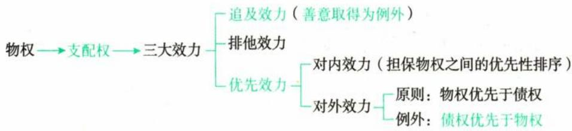

flowchart

```mermaid
graph TD
    A["物权"] --> B["支配权"]
    B --> C["三大效力"]
    C --> D["追及效力（善意取得为例外）"]
    C --> E["排他效力"]
    C --> F["优先效力"]
    F --> G["对内效力（担保物权之间的优先性排序）"]
    F --> H["对外效力"]
    H --> I["原则：物权优先于债权"]
    H --> J["例外：债权优先于物权"]
```

(物权的三大效力体系框架图)

物权的效力，是指法律赋予的使物权的支配效力得以完满实现的各种具体的保障力。

#### (一) 追及效力

追及效力，是指物权成立后，不论其标的物辗转至何人之手，权利人均可以追及标的物之所在，并直接行使权利；只要在最后占有人处发现自己的物，即可予以取回（“物在呼唤主人”）。

[例] 3月10日，孟某的手表丢失被马某拾得。3月12日，曹某从马某家中将手表偷走。3月13日，曹某又将手表丢失被柏某拾得。4月10日，孟某发现自己的手表在柏某手中。孟某可以请求柏某返还手表。因为物权具有追及效力，即物在呼唤主人。

#### (二) 排他效力

排他效力，是指同一物上不得同时存在两个所有权（即一物一权）或两个内容相冲突的他物权。

#### (三) 优先效力

优先效力，是指同一物之上存在数个互相冲突的权利时，效力较强的权利排斥效力较弱的权利而率先获得实现。

[例] 3月2日，孟某向柏某借款2万元。4月21日，孟某又向马某借款2万元，将自己价值27500元的欧米茄手表质押给马某并交付。到期后，孟某无法归还该4万元。马某优先受偿2万元，剩余7500元归柏某，柏某剩余的12500元转为一般债权（普通债权）。因为马某的物权优先于柏某的债权，物权具有优先效力（原则上物权具有优先效力）。

#### 三、物权的保护①

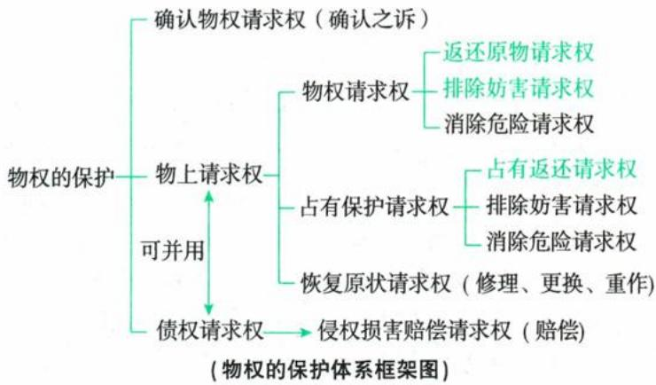

flowchart

```mermaid
graph TD
    A["物权的保护"] --> B["确认物权请求权（确认之诉）"]
    A --> C["物上请求权"]
    A --> D["可并用"]
    C --> E["物权请求权"]
    C --> F["占有保护请求权"]
    C --> G["恢复原状请求权（修理、更换、重作）"]
    D --> H["侵权损害赔偿请求权（赔偿）"]
    E --> I["返还原物请求权"]
    E --> J["排除妨害请求权"]
    E --> K["消除危险请求权"]
    F --> L["占有返还请求权"]
    F --> M["排除妨害请求权"]
    F --> N["消除危险请求权"]
```

#### (一) 含义

《民法典》第二编物权第一分编通则第三章（第233—239条，共7条）规定了物权的保护制度。物权的保护重点是物权请求权。物权请求权，是指物权人在其权利的实现上遇有某种妨害时，有权请求造成妨害事由发生的人排除此等妨害。

#### (二) 特征

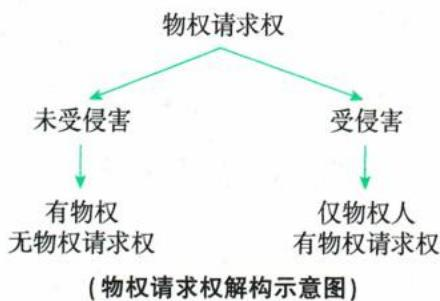

flowchart

```mermaid
graph TD
    A["物权请求权"] --> B["未受侵害"]
    A --> C["受侵害"]
    B --> D["有物权\n无物权请求权"]
    C --> E["仅物权人\n有物权请求权"]
```

物权是原权利，物权请求权是救济权。因此，物权请求权是独立于物权的一种行为请求权。在物权未受到妨害也不存在受到妨害之可能性时，物权人则不享有物权请求权。

[例] 孟某手上戴着一块手表，没有人来偷也没有人来抢，没有人妨害孟某对手表使用价值和交换价值的全面支配和利用。孟某不享有物权请求权。因为物权未受到任何侵害。

物权请求权亦不能与物权分离而单独存在。在物权受到妨害时，仅物权人才可以行使物权请求权；物权请求权是基于物权而派生出的权利，在性质上属于救济权。

[例] 孟某手上戴着一块手表，马某看到后甚是喜爱，趁孟某不注意将该块手表抢走。柏某无权请求马某返还手表。因为柏某并非手表的所有权人，只有孟某可以请求马某返还。

#### (三) 种类

#### 1. 返还原物请求权。

无权占有不动产或动产的，权利人可以请求返还原物（《民法典》第235条）。

[例] 孟某将自己的手表借给马某用 3 天。第 2 天，孟某不可以请求马某返还手表。因为虽然孟某是手表的所有权人，但马某对手表的占有属于有权占有（存在合法有效的借用合同且借期尚未届满）。

#### 2. 排除妨害请求权。

妨害物权的，权利人可以请求排除妨害。排除妨害请求权不受诉讼时效期间的限制。

#### >> 随堂练习

叶某将自有房屋卖给沈某，在交房和过户之前，沈某擅自撬门装修，施工导致邻居赵某经常失眠。下列哪些表述是正确的？(2013-3-55，多)①

A. 赵某有权要求叶某排除妨碍
B. 赵某有权要求沈某排除妨碍
C. 赵某请求排除妨碍不受诉讼时效的限制
D. 赵某可主张精神损害赔偿

#### 3. 消除危险请求权。

可能妨害物权的，权利人可以请求消除危险。消除危险请求权不受诉讼时效期间的限制。

[例] 孟某和王某系邻居。孟某家的一堵墙已经老旧不堪，随时可能倒塌。王某每次经过时都胆战心惊。王某可以请求孟某消除危险对即将倒塌的墙进行维修。

#### (四) 行权

物权受到侵害的，权利人可以通过和解、调解、仲裁、诉讼等途径解决（救济途径多元化）。物权请求权的行权不必非得依诉讼方式进行，也可以依意思表示的方式为之，即物权受到妨害后，物权人可以直接请求妨害人为或不为一定的行为，包括请求妨害人返还原物、排除妨害、消除危险等。

物权的保护方式，可以单独适用，也可以根据权利被侵害的情形合并适用。作为请求权，物权请求权与债权有类似的性质，因而在不与物权请求权性质相抵触的范围内，可以适用债权的有关规定，如过失相抵、给付迟延、债的履行及转让等。

[萌主点拨]
物权请求权 VS 债权请求权

<table><tr><td>项目</td><td>物权请求权</td><td>债权请求权</td></tr><tr><td>前提</td><td>以物的存在为前提,无物则无物权请求权</td><td>以债权的存在为前提</td></tr><tr><td>目的</td><td>救济被侵害的物权,恢复对物的圆满支配状态(使用价值+交换价值)</td><td>救济被侵害的债权,恢复被损害的利益(填补性损害原理)</td></tr><tr><td>是否需要过错</td><td>原则上不考虑相对人是否有过错</td><td>通常以相对人主观上有过错为要件(如一般侵权)</td></tr><tr><td>表现形式</td><td>返还原物、排除妨害、消除危险</td><td>赔偿损失</td></tr><tr><td>期间限制</td><td>具体问题具体分析</td><td>原则上受诉讼时效限制</td></tr></table>

[例] 小贝购得一个世界杯指定用球后兴奋不已，一脚踢出，恰好落入邻居老马家门前的水井中，正在井边清洗花瓶的老马受到惊吓，手中花瓶落地摔碎。老马从井中捞出足球后，小贝央求老马归还，老马则要求小贝赔偿花瓶损失。根据上述案情，请回答如下问题：

(1) 小贝对老马在行使何种请求权?

答：物权请求权。因为小贝请求老马归还足球。

(2) 老马对小贝在行使何种请求权?

答：债权请求权。因为老马请求小贝赔偿损失。

## 07 专题七 所有权

#### 复习提要

所有权，规定在《民法典》第二编物权第二分编第四章至第九章（第240—322条），共六章83条。本专题主要涉及三个问题：1. 物权变动；2. 业主的建筑物区分所有权（《民法典》第271—287条，共17条）；3. 共有。物权变动是必考点，物权变动模式的本质系法定分类体系和学理分类体系的结合，具有相当的综合性。业主的建筑物区分所有权属于重大制度修改和新增考点，备考时须重点关注。对于共有制度，按份共有人的优先购买权系重中之重。

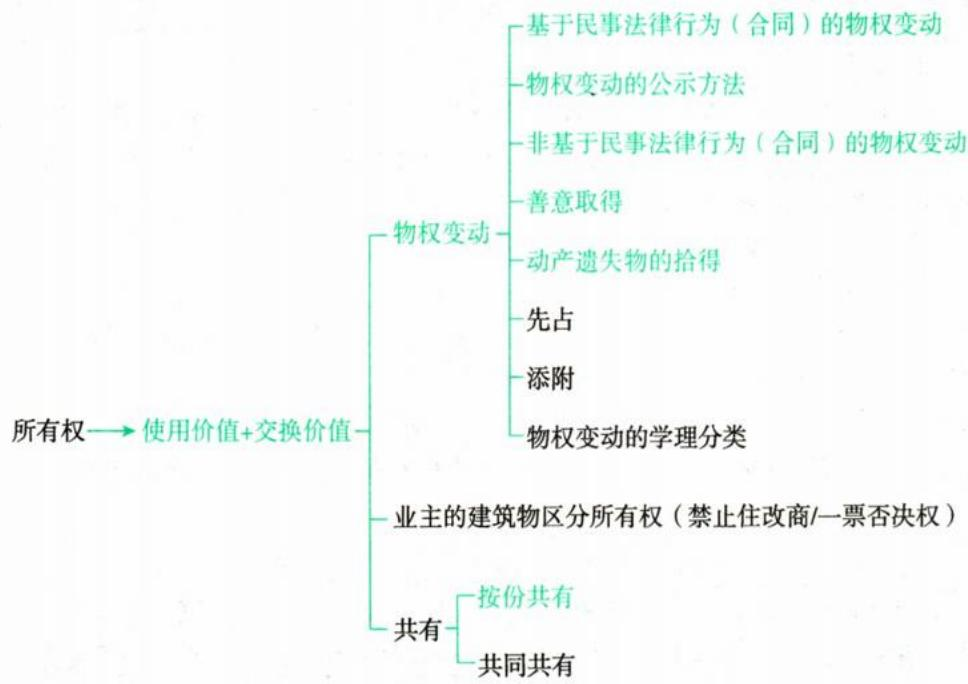

flowchart

```mermaid
graph TD
    A["所有权"] --> B["使用价值+交换价值"]
    B --> C["物权变动"]
    C --> D["基于民事法律行为（合同）的物权变动"]
    C --> E["物权变动的公示方法"]
    C --> F["非基于民事法律行为（合同）的物权变动"]
    C --> G["善意取得"]
    C --> H["动产遗失物的拾得"]
    C --> I["先占"]
    C --> J["添附"]
    C --> K["物权变动的学理分类"]
    B --> L["业主的建筑物区分所有权（禁止住改商/一票否决权）"]
    B --> M["共有"]
    M --> N["按份共有"]
    M --> O["共同共有"]
```

### 第一节 物权变动

#### 一、基于民事法律行为（合同）的物权变动

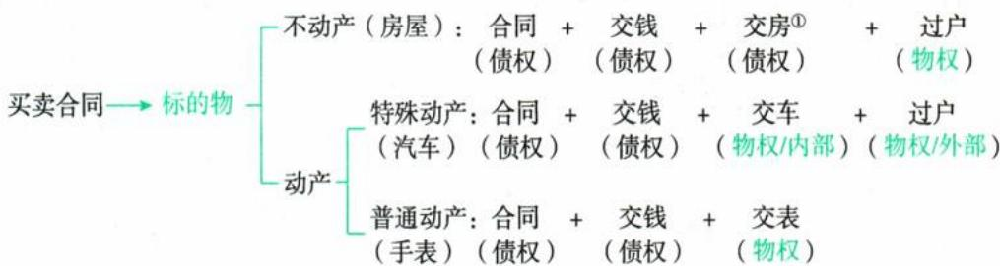

flowchart

```mermaid
graph TD
    A["买卖合同"] --> B["标的物"]
    B --> C["不动产（房屋）：合同 + 交钱 + 交房① + 过户<br>（债权）（债权）（债权）（债权）（物权）"]
    B --> D["动产"]
    D --> E["特殊动产：合同 + 交钱 + 交车 + 过户<br>（汽车）（债权）（债权）（物权/内部）（物权/外部）"]
    D --> F["普通动产：合同 + 交钱 + 交表<br>（手表）（债权）（债权）（物权）"]
```

(基于民事法律行为/合同的物权变动体系框架图)

[例 1] 3月2日，孟某将自己的房屋以850万元的价格出卖给马某。双方签订了房屋买卖合同（仅发生债权效力，二者互相对对方享有债权请求权），同年4月21日双方前往登记机构办理了过户登记（发生物权效力，发生了物权变动）手续。请问：马某何时取得房屋所有权？

答：4月21日。因为不动产物权的变动经依法登记，发生效力。

[萌主点拨] 登记生效主义（要件主义）

登记生效主义（要件主义），是指登记决定不动产物权的设立、变更、转让和消灭是否生效。即不动产物权的各项变动原则上都必须登记，不登记则不生效。简单而言，有效合同+登记=不动产物权变动（当事人不得约定不登记，否则约定无效/违反税法规定/物权法定）。

[例 2] 3月2日，孟某将自己的房屋以850万元的价格出卖给马某。双方签订了房屋买卖合同（仅发生债权效力，二者互相对对方享有债权请求权），约定同年4月21日双方前往海淀区房管部门办理过户登记手续。后房价暴涨，孟某反悔，拒绝办理过户登记（不发生物权效力，不发生物权变动）手续。请问：

(1) 马某能否取得房屋所有权?

答：不能。因为未办理过户登记，马某不能获得房屋所有权（不动产登记生效主义）。

(2) 孟某和马某签订的房屋买卖合同效力如何?

答：合法有效。因为未办理物权登记的，不影响合同的效力，房屋买卖合同合法有效。基于合法有效的房屋买卖合同马某有权追究孟某的违约责任，请求孟某继续履行过户登记手续。

[萌主点拨] 区分原则（物债两分原则）

当事人之间订立有关设立、变更、转让和消灭不动产物权的合同，除法律另有规定或当事人另有约定外，自合同成立时生效；未办理物权登记的，不影响合同效力（《民法典》第215条）。

[例 3] 3月2日，马某向孟某提出欲以300万元购买孟某的房屋（市价850万元）。孟某不允。马某遂对孟某说：“如不出卖房屋，将公开孟某的裸照。”孟某无奈（非真实的意思表示），将房屋以300万元出卖给马某并办理了过户登记手续。同年5月10日，孟某向北京市海淀区人民法院起诉主张撤销房屋买卖合同。6月10日，法院判决孟某胜诉。马某未上诉。请问：此时，孟某是否有权基于房屋所有权人的身份请求无权占有人马某返还房屋？

答：有权。因为基于合同的物权变动，合同必须合法有效，如合同无效或被撤销的，物权不发生变动（返还原物请求权/物权变动有因性原理）。

##### [萌主点拨] 债权形式主义立法模式

通说认为，我国采用债权形式主义的登记生效模式。根据“债权形式主义”的模式，登记是不动产物权变动的必要法定公示手续，仅有当事人之间的合同不足以发生物权变动。如果不动产物权变动的原因行为（主要指合同，如买卖合同）无效或被撤销的，经登记的不动产物权也会相应无效或被撤销。

一言以蔽之，有权处分+有效合同+登记/交付=物权变动=继受取得。

#### 二、物权变动的公示方法

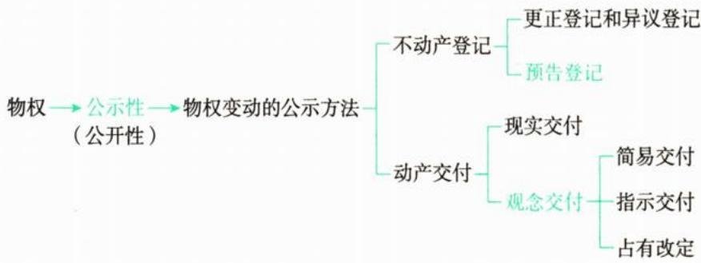

flowchart

```mermaid
graph TD
    A["物权"] --> B["公示性 (公开性)"]
    B --> C["物权变动的公示方法"]
    C --> D["不动产登记"]
    C --> E["动产交付"]
    D --> F["更正登记和异议登记"]
    D --> G["预告登记"]
    E --> H["现实交付"]
    E --> I["观念交付"]
    H --> J["简易交付"]
    H --> K["指示交付"]
    H --> L["占有改定"]
```

(物权变动的公示方法体系框架图)

#### (一) 不动产登记之更正登记和异议登记（名实不符/借名买房） $^{①}$

#### 1. 更正登记。

(1) 事由。不动产登记簿和不动产权属证书均具有证据资格（公文书证），二者记载不一致的，除有证据证明不动产登记簿确有错误外，以不动产登记簿为准。但是，权利人、利害关系人认为不动产登记簿记载的事项错误（如房屋登记的权利人、面积、界址发生错误）的，可以向登记机构申请更正登记。

（2）处理。不动产登记簿记载的权利人书面同意更正或有证据证明（法律文书）登记确有错误的，登记机构应当予以更正。

#### 2. 异议登记。

(1) 事由。不动产登记簿记载的权利人不同意更正。

(2) 效力。申请人自异议登记之日起 15 日内不起诉的，异议登记失效。

#### (二) 不动产登记之预告登记 $^{①}$

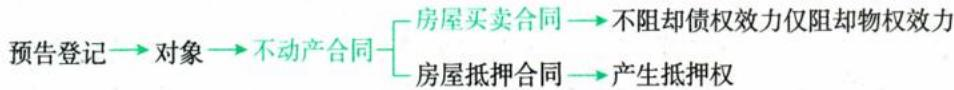

flowchart

```mermaid
graph LR
    A["预告登记"] --> B["对象"]
    B --> C["不动产合同"]
    C --> D["房屋买卖合同"]
    C --> E["房屋抵押合同"]
    D --> F["不阻却债权效力仅阻却物权效力"]
    E --> G["产生抵押权"]
```

##### (预告登记体系框架图)

1. 情形。预告登记制度主要解决不动产（房屋）买卖合同（特别是期房买卖合同）中的“一房数卖”问题。

2. 对象。基于房屋买卖合同而产生的“债权”。

3. 效力。预告登记后，买受人对房屋享有的仍然是债权而非物权。出卖人仍然可以出卖该房屋，仍然是有权处分，合同仍然合法有效。预告登记后，未经预告登记的权利人同意，处分该不动产的，不发生物权效力。债权消灭或自能够进行不动产登记之日起90日内未申请登记的，预告登记失效。

[例] 2024年3月2日，众森公司取得了商品房预售许可证后开始预售期房。孟某为了（合同目的）结婚需要购买房屋一套，双方遂于4月21日签订了一份《商品房买卖合同》，孟某购买众森公司开发的幸福小区2号楼2单元402室。合同中约定：“孟某应于合同签订后30日内向众森公司交纳全部购房款850万元，众森公司应于2025年4月21日交房并于交房后30日内协助孟某办理房屋产权过户登记手续。”根据上述案情及示意图，请回答如下问题：

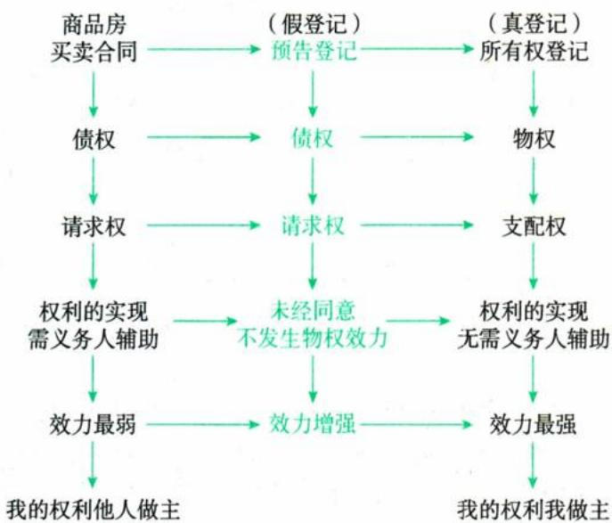

flowchart

```mermaid
graph TD
    A["商品房买卖合同"] --> B["（假登记）预告登记"]
    B --> C["（真登记）所有权登记"]
    A --> D["债权"]
    D --> E["债权"]
    E --> F["请求权"]
    F --> G["支配权"]
    G --> H["权利的实现无需义务人辅助"]
    H --> I["权力最强"]
    I --> J["我的权利我做主"]
    D --> K["请求权"]
    K --> L["未发生物权效力"]
    L --> M["权利的实现需义务人辅助"]
    M --> N["效力最弱"]
    N --> O["我的权利他人做主"]
    F --> P["请求权"]
    P --> Q["未经同意不发生物权效力"]
    Q --> R["效力增强"]
    R --> S["我的权利我做主"]
```

##### (不动产预告登记体系框架图)

(1) 孟某与众森公司签订的《商品房买卖合同》效力如何？为什么？

答：合法有效。因为完全符合有效民事法律行为的构成要件（《民法典》第143条）。

(2) 孟某为确保自己将来能取得房屋所有权，可以采取何种法律措施？

答：预告登记。因为当事人签订买卖房屋的协议，为保障将来实现物权，按照约定可以向登记机构申请预告登记（《民法典》第221条）。

（3）孟某进行预告登记后，众森公司建造的房屋所有权在未办理产权过户登记手续前属于谁？为什么？

答：众森公司。因为因合法建造房屋等事实行为设立物权的，自事实行为成就时（完成时）发生效力（《民法典》第231条）。

(4) 众森公司和孟某办理了预告登记后, 又将出卖给孟某的房屋出卖给马某, 价款1250万元。请问: 马某欲取得房屋所有权是否需要经过孟某的同意? 为什么?

答：需要。因为预告登记后，未经预告登记的权利人同意，处分该不动产的，不发生物权效力（《民法典》第221条）。

（5）众森公司因资金周转困难，该项目自2025年1月1日起即停工，眼看按期交房无望（预期违约）。孟某于1月10日通知众森公司解除《商品房买卖合同》并请求众森公司返还购房款本金及利息，依约承担违约责任。请问：孟某行使解除权对预告登记将产生何种影响？为什么？

答：失效。因为预告登记后，债权消灭的，预告登记失效。

(6) 2025年4月，众森公司按期交房且通知孟某可以办理产权过户手续后，孟某应于多少日内办理？如孟某未在该期间内办理将对预告登记产生何种法律效力？

答：90 日；失效。因为预告登记后，自能够进行不动产登记（过户登记）之日起 90 日内未申请登记的，预告登记失效。

[萌主点拨]
异议登记 VS 预告登记

<table><tr><td>项目</td><td>异议登记</td><td>预告登记</td></tr><tr><td>适用情形</td><td>借名买房(名实不符)</td><td>房屋(期房/现房)买卖中的一房数卖</td></tr><tr><td>法律效力</td><td>不阻却债权,亦不阻却物权,仅阻却善意取得的发生</td><td>不阻却债权,仅阻却物权</td></tr><tr><td>期限限制</td><td>自异议登记之日起15日内</td><td>自能够进行不动产登记之日起90日内</td></tr></table>

#### (三) 动产交付 $^{①}$

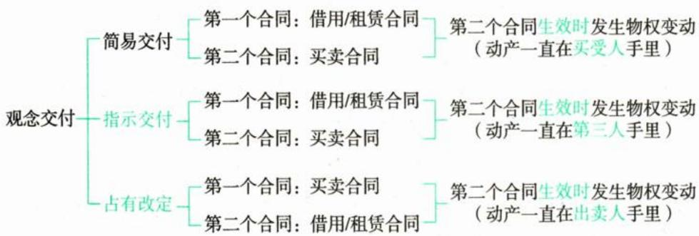

flowchart

```mermaid
graph TD
    A["观念交付"] --> B["简易交付"]
    A --> C["指示交付"]
    A --> D["占有改定"]
    B --> E["第一个合同：借用/租赁合同"]
    B --> F["第二个合同：买卖合同"]
    E --> G["第二个合同生效时发生物权变动（动产一直在买受人手里）"]
    C --> H["第一个合同：借用/租赁合同"]
    C --> I["第二个合同：买卖合同"]
    H --> J["第二个合同生效时发生物权变动（动产一直在第三人手里）"]
    D --> K["第一个合同：买卖合同"]
    D --> L["第二个合同：借用/租赁合同"]
    K --> M["第二个合同生效时发生物权变动（动产一直在出卖人手里）"]
```

(观念交付体系框架图)

#### 1. 简易交付。

动产物权设立和转让前，权利人已经占有（包括有权占有和无权占有）该动产的，物权自民事法律行为生效时发生效力（《民法典》第226条）。

[萌主点拨] 简易交付的本质就是“先占有（有权占有或无权占有）而后购买”，买卖合同生效时，视为动产已经交付，发生物权变动。

#### 2. 指示交付。

动产物权设立和转让前，第三人占有（包括有权占有和无权占有）该动产的，负有交付义务的人可以通过转让请求第三人返还原物的权利代替交付（《民法典》第227条）。

[萌主点拨] 指示交付的本质就是“自己所有他人占有，出卖返还原物请求权”，买卖合同生效时，视为动产已经交付，发生物权变动。

#### 3. 占有改定（融资租赁合同/售后回租）。

动产物权转让时，当事人又约定由出让人继续占有该动产的，物权自该约定生效时发生效力（《民法典》第228条）。

[萌主点拨] 占有改定的本质就是“先出卖而后占有（租/借）”，占有合意（租赁合同/借用合同）生效时，视为动产已经交付，发生物权变动。

#### >> 随堂练习

庞某有1辆名牌自行车，在借给黄某使用期间，达成转让协议，黄某以8000元的价格购买该自行车。次日，黄某又将该自行车以9000元的价格转卖给了洪某，但约定由黄某继续使用1个月。关于该自行车的归属，下列哪一选项是正确的？(2017-3-5，单)①

A. 庞某未完成交付，该自行车仍归庞某所有
B. 黄某构成无权处分，洪某不能取得自行车所有权
C. 洪某在黄某继续使用 1 个月后，取得该自行车所有权
D. 庞某既不能向黄某，也不能向洪某主张原物返还请求权

#### 三、非基于民事法律行为（合同）的物权变动 $^{②}$

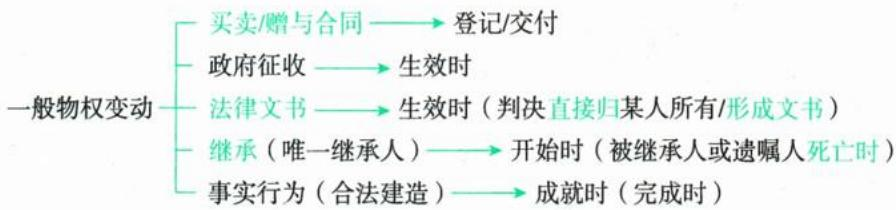

flowchart

```mermaid
graph TD
    A["一般物权变动"] --> B["买卖/赠与合同"]
    B --> C["登记/交付"]
    A --> D["政府征收"]
    D --> E["生效时"]
    A --> F["法律文书"]
    F --> G["生效时（判决直接归某人所有/形成文书）"]
    A --> H["继承（唯一继承人）"]
    H --> I["开始时（被继承人或遗嘱人死亡时）"]
    A --> J["事实行为（合法建造）"]
    J --> K["成就时（完成时）"]
```

(一般物权变动规则体系框架图)

非基于民事法律行为的物权变动的特殊性在于：无需登记或交付即可发生物权变动。登记或交付既不是生效要件，也不是对抗要件。

① 答案：D。
② 考查 5 次，常考点，重点掌握。

#### (一) 四种情形

#### 1. 政府征收。

政府征收引起的物权变动，是依据公法进行的变动，因为有公权力的介入，物权变动的状态往往比较明确，物权变动本身已经具有很强的公示性，能够满足物权变动对排他效力的要求，从而不必进行登记或交付而直接生效。因此，因人民政府的征收决定导致物权设立、变更、转让或消灭的，自征收决定生效时发生效力。

#### 2. 法律文书。

因法院、仲裁机构的法律文书导致物权设立、变更、转让或消灭的，自法律文书生效时发生效力。法院、仲裁机构在分割共有不动产或动产等案件中作出并依法生效的改变原有物权关系的判决书、裁决书、调解书，以及法院在执行程序中作出的拍卖成交裁定书、变卖成交裁定书、以物抵债裁定书①，应当认定为导致物权设立、变更、转让或消灭的法院、仲裁机构的法律文书。

可以直接导致物权变动的法院判决书或仲裁机构裁决书必须是形成判决或裁决②，即明确判决或裁决标的物所有权直接归某人所有。若为给付判决或裁决，即判决或裁决一方配合对方履行过户登记手续，则必须义务人履行判决或裁决后方能发生物权变动。

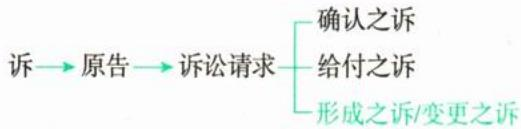

flowchart

```mermaid
graph LR
    A["诉"] --> B["原告"]
    B --> C["诉讼请求"]
    C --> D["确认之诉"]
    C --> E["给付之诉"]
    C --> F["形成之诉/变更之诉"]
```

(诉的种类体系框架图)

#### (1) 形成判决。

[例] 孟某和刘某共有一套房屋，所有权登记在孟某名下。2023年2月1日，法院判决孟某和刘某离婚，并且判决房屋归刘某所有（形成判决），但是并未办理房屋所有权变更登记。此时，自2月1日离婚判决生效时，房屋所有权即属于刘某，未办理变更登记，不影响刘某取得房屋所有权。因为法院该判决属于“形成判决”，可以直接引起物权变动。

#### (2) 给付判决。

[例] 甲、乙和丙于2012年3月签订了散伙协议，约定登记在丙名下的合伙房屋归甲、乙共有。后丙未履行协议。同年8月，法院判决丙办理该房屋过户手续，丙仍未办理。此时，2012年8月，法院的判决系“给付判决”，即判决丙办理房屋过户手续，而非直接判决房屋所有权归甲、乙所有（形成判决）。后丙仍未办理过户手续。因此，房屋依然不发生物权变动，依然属于丙所有。

#### 3. 继承（唯一继承人）。

在因继承取得物权的情况下，如果仍然适用物权变动的一般原则，要求物权的取得自登记或交付时才能生效，那么因登记或交付往往需要一定的时间，势必导致在被继承人死亡后不动产登记或动产交付前，遗产处于无主状态。此外，在因继承而取得物权的情况下，物权变动的状态已经明确，不能因未登记或交付而否认其效力。因继承（法定继承或遗嘱继承）取得物权的，自继承开始时（被继承人死亡时，其中死亡包括自然死亡/生理死亡和宣告死亡）发生效力。

#### >> 随堂练习

张某去世后，其名下某房屋按照张某遗嘱由其唯一的儿子张小东继承，但是一直未办理过户登记。后张小东因将赴国外长期工作遂与李某签订房屋买卖合同欲转让房屋。据此，下列说法正确的是？（2022金题-2-1-7，多）①

A. 张小东应先为其办理过户登记，才能处分该房屋
B. 张小东享有房屋的处分权，房屋买卖合同合法有效
C. 因未办理过户登记，张小东未取得该房屋所有权
D. 张小东为李某办理过户登记后，李某取得房屋所有权

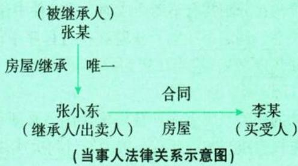

flowchart

```mermaid
graph TD
    A["（被继承人）\n张某"] -->|房屋/继承 唯一| B["张小东\n（继承人/出卖人）"]
    B -->|合同\n房屋| C["李某\n（买受人）"]
```

##### 4. 事实行为（合法建造）

因合法建造、拆除房屋等事实行为设立或消灭物权的，自事实行为成就时发生效力（《民法典》第231条）。

[例] 中州公司依法取得某块土地的建设用地使用权并办理报建审批手续后，开始了房屋建设并已经完成了外装修。中州公司因事实行为（合法建造）而取得了房屋所有权。

#### （二）法律效果

处分依照政府征收、法律文书、继承和事实行为享有的不动产物权，依照法律规定需要办理登记的，未经登记，不发生物权效力。处分，是指依民事法律行为而进行的物权变动，如不动产转让、赠与或不动产上设定抵押权等。

一言以蔽之，不处分，不登记；一处分，双重登记。

#### 四、善意取得（占有人权利滥用/利益衡量思维） $^{②}$

[例] 2025年10月1日，孟某将自己的手表委托徐某保管（不发生物权变动/实践性合同/标的物所有人和占有人分离）。徐某因购房急需用钱，遂于10月2日以自己的名义将孟某的手表卖给马某。10月3日，马某通过银行转账方式向徐某支付了27500元。10月4日，徐某将手表交付给了马某。10月5日，孟某获悉此事。根据上述案情及示意图，请回答如下问题：

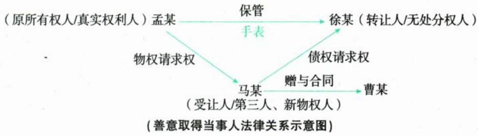

flowchart

```mermaid
graph TD
    A["(原所有权人/真实权利人) 孟某"] -->|保管| B["徐某 (转让人/无处分权人)"]
    A -->|物权请求权| C["马某 (受让人/第三人、新物权人)"]
    C -->|赠与合同| D["曹某"]
    B -->|债权请求权| C
    C -->|手表| A
```

① 答案：BD。
② 善意取得系物权追及效力的例外，每年必考，客观题和主观题均会考查，重点关注。

(1) 徐某以自己的名义将孟某的手表卖给马某的行为是有权处分，还是无权处分？

答：无权处分。因为无权处分是指以自己的名义处分他人或共有的财产。

(2) 徐某与马某签订的买卖合同效力如何?

答：合法有效。因为无权处分不影响合同的效力，仅影响合同的履行。

(3) 如马某构成善意取得，孟某是否可以对马某行使物权请求权，请求马某返还手表？

答：不可以。因为不符合返还原物请求权的两项构成要件：①所有权人；②无权占有（《民法典》第235条）。

(4) 如马某构成善意取得，孟某如何救济自己的权利？

答：孟某对徐某享有三种债权请求权，择一选择（填补性损害原理/填平规则）：

①基于合法有效的保管合同追究徐某的违约责任；

②基于所有权追究徐某的侵权责任；

③请求徐某返还不当得利（非给付型不当得利）。

(5) 如马某构成善意取得后，又将手表赠与曹某，曹某可否善意取得？

答：不可以。因为马某属于有权处分，曹某继受取得手表所有权。

(6) 如马某不构成善意取得，孟某是否可以对马某行使物权请求权，请求马某返还手表？

答：可以。因为返还原物请求权的构成要件有二：①孟某系所有权人；②马某系无权占有（《民法典》第235条）。

(7) 如马某不构成善意取得，在马某将手表返还给孟某后，应如何救济自己的权利？

答：马某对徐某享有两种债权请求权，择一选择（填补性损害原理/填平规则）：

①基于合法有效的买卖合同追究徐某的违约责任；

②请求徐某返还不当得利。

[萌主点拨] 善意取得=无权处分+有效合同+登记/交付=物权变动=原始取得

#### (一) 构成要件

#### 1. 行为人无权处分。

无权处分，是指以自己的名义处分他人或共有的财产。题目中关键词通常为：擅自或未经。

#### (1) 关于 “处分”。

租赁行为系负担行为而非处分行为，以自己的名义出租他人财产的，属于无权出租，虽然租赁合同合法有效，但与善意取得无关（负担行为 VS 处分行为）。

[例] 孟某赴英国进修 1 年，将自己价值 2 万元的宠物犬交由邻居王某保管。后王某为图谋私利，伪称该宠物犬为其所有，擅自（无权）以自己的名义出租于马某，每月收取租金 2000 元，为期 10 个月。请问：王某的行为是否构成无权处分？

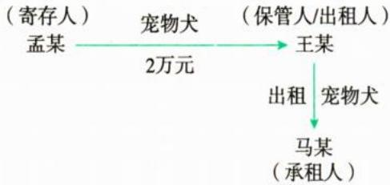

flowchart

```mermaid
graph TD
    A["（寄存人）\n孟某"] -->|宠物犬\n2万元| B["（保管人/出租人）\n王某"]
    B -->|出租 宠物犬| C["马某\n（承租人）"]
```

(当事人法律关系示意图)

答：不构成。王某的行为属于无权出租，系负担行为，仅发生债权债务关系，与善意取得无关，善意取得的前提条件是无权处分。

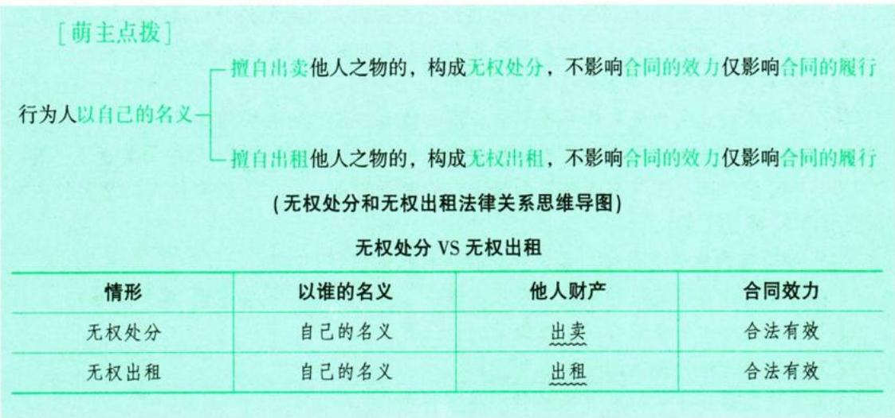

text_image

[萌主点拨]
行为人以自己的名义——
擅自出卖他人之物的,构成无权处分,不影响合同的效力仅影响合同的履行
擅自出租他人之物的,构成无权出租,不影响合同的效力仅影响合同的履行
(无权处分和无权出租法律关系思维导图)
无权处分 VS 无权出租
情形 以谁的名义 他人财产 合同效力
无权处分 自己的名义 出卖 合法有效
无权出租 自己的名义 出租 合法有效

(2) 关于 “他人”。

处分自己的财产，系有权处分，与善意取得无关（自己的财产 VS 他人的财产）。

[例1] 甲出境经商下落不明，2015年9月经其妻乙请求被K县法院宣告死亡，其后乙未再婚，乙是甲唯一的继承人。2016年3月，乙将家里的一辆轿车赠送给了弟弟丙，交付并办理了过户登记。根据上述案情及示意图，请回答如下问题：

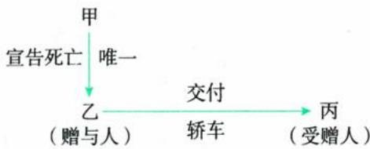

flowchart

```mermaid
graph TD
    甲["甲"] -->|宣告死亡 唯一| 乙["乙 (赠与人)"]
    乙 -->|交付 轿车| 丙["丙 (受赠人)"]
```

(当事人法律关系示意图)

①乙将轿车赠送给弟弟丙的行为是否构成无权处分？

答：不构成。因为乙在赠与自己的轿车，属于有权处分。

②丙可否主张善意取得？

答：不可以。因为乙的行为属于有权处分，与善意取得无关，善意取得的前提条件是无权处分。

③丙如何取得轿车所有权？

答：继受取得。

[例 2] 甲将其1辆汽车出卖给乙，约定价款30万元。乙先付了20万元，余款在6个月内分期支付。在分期付款期间，甲先将汽车交付给乙，但明确约定付清全款后甲才将汽车的所有权移转给乙。嗣后，甲又将该汽车以20万元的价格卖给不知情的丙，并以指示交付的方式完成交付。根据上述案情及示意图，请回答如下问题：

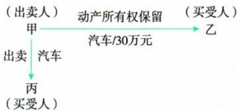

flowchart

```mermaid
graph TD
    A["(出卖人)"] --> B["甲"]
    B -->|动产所有权保留| C["(买受人)"]
    B -->|汽车/30万元| D["乙"]
    A -->|出卖| E["汽车"]
    E --> F["丙(买受人)"]
```

(当事人法律关系示意图)

①甲将汽车出卖给丙的行为是否构成无权处分？

答：不构成。因为甲在出卖自己的汽车，属于有权处分。

②丙可否主张善意取得？

答：不可以。因为甲的行为属于有权处分，与善意取得无关，善意取得的前提条件是无权处分。

③丙如何取得汽车所有权？

答：继受取得。

[例 3] 甲与乙订立房屋租赁合同，约定租期 5 年。半年后，甲将该出租房屋出售给丙，但未通知乙。不久，乙以其房屋优先购买权（房屋承租人在同等条件下享有优先购买权）受侵害为由，请求法院判决甲丙之间的房屋买卖合同无效。根据上述案情及示意图，请回答如下问题：

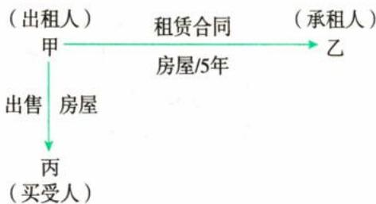

flowchart

```mermaid
graph TD
    A["(出租人)"] --> B["甲"]
    B -->|出售 房屋| C["丙 (买受人)"]
    B -->|租赁合同 房屋/5年| D["(承租人) 乙"]
```

(当事人法律关系示意图)

①甲将房屋出售给丙的行为是否构成无权处分？

答：不构成。因为甲在出售自己的房屋，属于有权处分。

②丙可否主张善意取得？

答：不可以。因为甲的行为属于有权处分，与善意取得无关，善意取得的前提条件是无权处分。

[萌主点拨]
无权处分 VS 有权处分

<table><tr><td>情形</td><td>以谁的名义</td><td>出卖谁的财产</td><td>合同效力</td></tr><tr><td>无权处分</td><td>自己的名义</td><td>他人的财产</td><td>合法有效</td></tr><tr><td>有权处分</td><td>自己的名义</td><td>自己的财产</td><td>合法有效</td></tr></table>

(3) 关于 “自己的名义”。

以他人的名义处分他人的财产，属于无权代理（合同效力待定），而非无权处分，与善意取得亦无涉（无权代理 VS 无权处分）。

[例] 甲因出国留学将自己的一幅名画交由乙保管。后乙急需用钱，以甲的名义将该幅名画以市价卖给丙并交付于丙。请问：乙的行为是否构成无权处分？

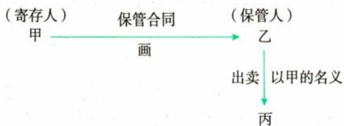

flowchart

```mermaid
graph TD
    A["（寄存人）"] -->|甲| B["保管合同"]
    B --> C["（保管人）"]
    C -->|乙| D["出卖 以甲的名义"]
    D --> E["丙"]
    style A fill:#f9f,stroke:#333
    style B fill:#ccf,stroke:#333
    style C fill:#cfc,stroke:#333
    style D fill:#fcc,stroke:#333
    style E fill:#cff,stroke:#333
```

(当事人法律关系示意图)

答：不构成。乙的行为属于无权代理，买卖合同效力待定。

①甲追认，买卖合同自始有效，丙继受取得画的所有权；

②甲拒绝，买卖合同自始无效，恢复原状。

总之，在无权代理的情形下，不发生善意取得问题。

[萌主点拨]
无权处分 VS 无权代理

<table><tr><td>情形</td><td>谁的名义</td><td>出卖他人财产</td><td>合同效力</td></tr><tr><td>无权处分</td><td>$ \underline{\text{自己的名义}} $</td><td>是</td><td>合法有效</td></tr><tr><td>无权代理</td><td>$ \underline{\text{他人的名义}} $</td><td>是</td><td>效力待定</td></tr></table>

#### 2. 相对人主观上善意且无重大过失。

#### (1) 何为善意?

不知情、不了解、不知悉即为善意；如题目中表述为“知情、了解、知悉”，则表明相对人主观上不善意，不能善意取得。受让人受让不动产或动产时，不知道转让人无处分权，且无重大过失的，应当认定受让人为善意。真实权利人主张受让人不构成善意的，应当承担举证证明责任。

#### (2) 何时善意?

完成公示时。即依法完成不动产物权转移登记或动产交付之时。

#### (3) 何为重大过失?

具有下列情形之一的，应当认定不动产受让人知道转让人无处分权：

①登记簿上存在有效的异议登记；

②预告登记有效期内，未经预告登记的权利人同意；

③登记簿上已经记载司法机关或行政机关依法裁定、决定查封或以其他形式限制不动产权利的有关事项；

④受让人知道登记簿上记载的权利主体错误；

⑤受让人知道他人已经依法享有不动产物权。

真实权利人有证据证明不动产受让人应当知道转让人无处分权的，应当认定受让人具有重大过失。

[萌主点拨] 受让人受让动产时，交易的对象、场所或时机等不符合交易习惯的，应当认定受让人具有重大过失。

#### 3. 相对人客观上支付合理对价。

#### (1) 关于 “支付”。

相对人客观上支付合理对价，仅需约定的价款合理即可，至于是否真正支付了价款则在所不问。

#### (2) 关于 “合理”。

大于等于时价或市价即为合理；如题目中表述为“低于时价或市价；远远低于时价或市价”，则表明价格不合理。“合理的价格”，应当根据转让标的物的性质、数量以及付款方式等具体情况，参考转让时交易地市场价格以及交易习惯等因素综合认定。

#### (3) 关于 “对价”。

善意取得所有权必须是有偿的（如买卖合同/互易合同），如系通过赠与、遗赠等无偿情形取得财产的，则不构成善意取得。

#### 4. 已经完成公示。

转让的不动产或动产依照法律规定应当登记的已经登记，不需要登记的已经交付给受让人。动产交付，可以采用现实交付、简易交付和指示交付，但不得采用占有改定的方式。

#### (二) 适用范围

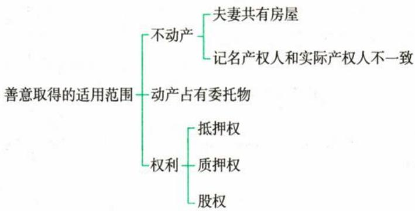

flowchart

```mermaid
graph TD
    A["善意取得的适用范围"] --> B["不动产"]
    A --> C["动产占有委托物"]
    A --> D["权利"]
    B --> E["夫妻共有房屋"]
    B --> F["记名产权人和实际产权人不一致"]
    D --> G["抵押权"]
    D --> H["质押权"]
    D --> I["股权"]
```

(善意取得的适用范围体系框架图)

#### 1. 不动产。

(1) 夫妻共有房屋，但产权只登记在一人名下。
(2) 法院作出形成判决后导致记名产权人和实际产权人不一致。

#### 2. 动产占有委托物。

占有委托物，又称非脱手物，是指基于原所有权人的意思而占有他人之物。如基于租赁合同关系、借用合同关系、保管合同关系、委托合同关系、承揽合同关系、运输合同关系等占有他人之物（即属于合法占有）。

占有脱离物，又称脱手物，是指非基于原所有权人的意思而占有他人之物。如盗赃物、遗失物、埋藏物、隐藏物不适用善意取得。

#### 3. 权利。

当事人善意取得其他物权的，参照适用善意取得所有权的规定（《民法典》第311条第3款）。

#### (三) 法律效力

#### 1. 含义。

善意取得的法律效力，是指在符合善意取得构成要件的情形下所产生的法律后果。

#### 2. 内容。

行为人善意取得标的物后对标的物的再处分属于有权处分，二者签订的合同合法有效，第三人可以继受取得标的物所有权。善意受让人取得动产后，该动产上的原有权利消灭。但是，善意受让人在受让时知道或应当知道该权利的除外。动产之上的权利负担主要包括抵押权、质押权和留置权等，即通常都是动产担保物权的范畴。

#### 五、动产遗失物的拾得 $^{①}$

#### (一) 含义

动产遗失物的拾得，是指发现他人遗失的动产并予以占有的一种民事法律事实。遗失物，是指所有权人遗忘或丢失于某处而暂时丧失占有的物。遗失物只能是动产，不动产不存在遗失的问题。动产遗失物的拾得系事实行为，与拾得人的民事行为能力无关。

#### （二）拾得人的义务

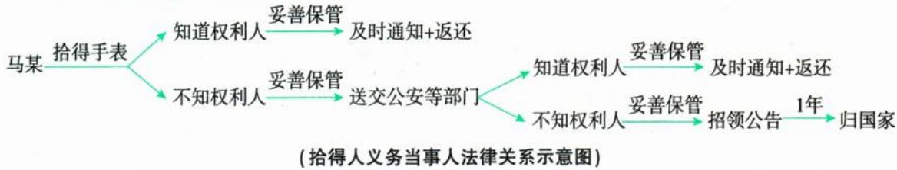

flowchart

```mermaid
graph TD
    A["马某"] -->|拾得手表| B["知道权利人"]
    A -->|拾得手表| C["不知权利人"]
    B -->|妥善保管| D["及时通知+返还"]
    C -->|妥善保管| E["送交公安等部门"]
    E --> F["知道权利人"]
    E --> G["不知权利人"]
    F -->|妥善保管| H["及时通知+返还"]
    G -->|妥善保管| I["招领公告"]
    H --> J["1年"]
    I --> J
    J --> K["归国家"]
```

1. 返还义务。

拾得遗失物，应当返还权利人。拾得人将拾得物据为己有，拒不返还而引起诉讼的，按照侵权之诉处理。

2. 通知义务。

拾得人应当及时通知权利人领取，或送交公安等有关部门。

3. 保管义务。

拾得人在遗失物送交有关部门前，有关部门在遗失物被领取前，应当妥善保管遗失物；因故意或重大过失致使遗失物毁损、灭失的，应当承担民事责任。

#### (三) 拾得人的权利

1. 必要费用请求权。

权利人领取遗失物时，应当向拾得人或有关部门支付保管遗失物等支出的必要费用，即准用无因管理规则。

2. 悬赏报酬请求权。

权利人悬赏寻找遗失物的，领取遗失物时应当按照承诺履行义务。拾得人基于单方允诺之债可以请求权利人给付。

3. 权利丧失。

对于侵占遗失物的行为，我国立法坚持“零容忍”的态度。因此，拾得人侵占遗失物的，丧失必要费用请求权和悬赏报酬请求权（即债权请求权）。

#### >> 随堂练习

甲遗失手链1条，被乙拾得。为找回手链，甲张贴了悬赏500元的寻物告示。后经人指证手链为乙拾得，甲要求乙返还，乙索要500元报酬，甲不同意，双方数次交涉无果。后乙在桥边玩耍时手链掉入河中被冲走。下列哪一选项是正确的？(2017-3-6，单)②

A. 乙应承担赔偿责任，但有权要求甲支付500元
B. 乙应承担赔偿责任，无权要求甲支付500元
C. 乙不应承担赔偿责任，也无权要求甲支付500元
D. 乙不应承担赔偿责任，有权要求甲支付500元

① 考查 3 次，重点关注。
② 答案：B。

#### (四)遗失物的归属

自发布招领公告之日起1年内无人认领的，归国家所有。拾得漂流物、发现埋藏物或隐藏物的，参照适用拾得遗失物的有关规定。法律另有规定的，依照其规定。

#### 六、先占①

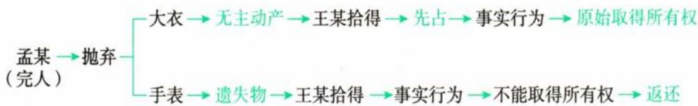

flowchart

```mermaid
graph TD
    A["孟某 (完人)"] --> B["抛弃"]
    B --> C["大衣 → 无主动产 → 王某拾得 → 先占 → 事实行为 → 原始取得所有权"]
    B --> D["手表 → 遗失物 → 王某拾得 → 事实行为 → 不能取得所有权 → 返还"]
```

(先占和遗失物的拾得区别示意图)

#### (一) 含义

先占，是指基于所有的意思，先于他人占有无主动产，从而取得其所有权的事实。先占系事实行为，与占有人的民事行为能力无关。

#### (二) 构成要件

1. 须以自己所有的意思占有无主物。

以自主占有方式占有无主动产者，取得对该物之所有权。

2. 对象是无主动产。

先占的标的物必须系动产，不动产不存在先占问题。对于标的物是否属于无主物，判断的标准不在拾得人主观上如何认为，关键取决于权利人是否有丧失所有权的意思，如果权利人已经放弃所有权，对于拾得人来说就可以基于先占制度取得所有权。相反，如果权利人并没有放弃所有权的意思，对于拾得人来说只能构成拾得遗失物而非先占。

3. 不得违反法律、行政法规的强制性或禁止性规定。专属于国家的财产、禁止流通物等，均不能先占。

[例] 潘某与刘某相约出游，潘某在长江边拾得一块奇石，爱不释手，拟带回家。刘某说，《民法典》规定河流属于国家所有，这一行为可能属于侵占国家财产。潘某可以取得奇石的所有权。因为即使长江属于国家所有，但石头是独立物、无主物，依先占的习惯可以取得其所有权。

#### 七、添附②

#### (一) 含义

《民法典》第322条确立了添附制度。添附，是指数个不同所有人的物结合成一物或由所有人以外的人加工而成为新物。对于添附之情形，法律之所以重定动产之所有权，专归某人单独取得，纯粹是为了避免形成共有关系或恢复原状，以减少纠纷，维护物之社会经济价值。

#### (二) 种类

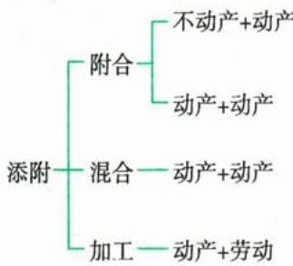

flowchart

```mermaid
graph TD
    A["添附"] --> B["附合"]
    A --> C["混合"]
    A --> D["加工"]
    B --> E["不动产+动产"]
    B --> F["动产+动产"]
    C --> G["动产+动产"]
    D --> H["动产+劳动"]
```

(添附制度体系框架图)

#### 1. 附合。

附合，是指两个以上不同所有人的物结合在一起而不能分离，若分离会毁损该物或花费较大。

#### (1) 不动产和动产的附合。

附合物的所有权由不动产所有人取得，但应当给予原动产所有人以赔偿或补偿，如甲取乙的建材（钢筋、水泥、石灰、砖头、石头、油漆、瓷砖等），修建自己的房屋。

[例] 孟某装修房屋，误以为王某的地砖为自家所有，并予以使用。孟某的行为构成附合。

#### (2) 动产和动产的附合。

附合物的所有权由原所有人按照其动产的价值，共有合成物；如果可以区别主物或从物，或一方动产的价值显然高于他方的动产，则应当由主物或价值较高物的原所有人取得合成物的所有权，并给予对方赔偿或补偿，如甲取乙的纸糊于自己的门窗、甲的木板和乙的钉子制成了一个柜子、甲把乙的油漆刷在自己的衣柜上等。

#### 2. 混合。

混合，是指两个以上不同所有人的动产互相混杂合并，不能识别。

动产和动产的混合，混合物的所有权，准用附合的规定，如甲取乙的味精加于自己的香菇排骨汤之内、甲的大米（大豆/油/酒）和乙的大米（大豆/油/酒）混在一起等。附合的数个动产在形体上可以识别、分割，只是分离后要损害附合物的价值，出于社会利益考虑不许分割；而混合则是数个动产混合于一起，在事实上不能也不易区分。

#### 3. 加工。

在他人之物上附加自己的有价值的劳动，使之成为新物。

劳动力和他人的动产。加工物的所有权原则上归原物的所有人，并给加工人以赔偿或补偿。但是当加工增加的价值大于材料的价值时，加工物可以归加工人所有，但应当给予原物的所有人以赔偿或补偿，如甲误取乙的宣纸绘成名画。

#### 八、物权变动的学理分类 $^{①}$

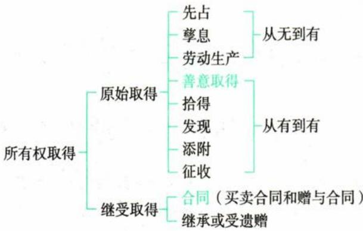

flowchart

```mermaid
graph TD
    A["所有权取得"] --> B["原始取得"]
    A --> C["继承取得"]
    B --> D["先占"]
    B --> E["孳息"]
    B --> F["劳动生产"]
    B --> G["善意取得"]
    B --> H["拾得"]
    B --> I["发现"]
    B --> J["添附"]
    B --> K["征收"]
    C --> L["合同（买卖合同和赠与合同）"]
    C --> M["继承或受遗赠"]
    D --> N["从无到有"]
    F --> O["从有到有"]
```

(物权变动的学理分类体系框架图)

物权变动的学理分类项下，依据物权的取得是否源自前手，将所有权的取得分为原始取得和继受取得两类。

原始取得，又称权利新生，是指非基于原权利人的意志或意思而取得某物的所有权，换句话来说就是基于法律的规定而取得某物的所有权。如先占、孳息、劳动生产、善意取得、拾得、发现、添附、征收等。

继受取得，又称传来取得，是指基于原权利人的意志或意思而取得某物的所有权。换句话说就是基于当事人的意思而取得某物的所有权。如合同、继承或受遗赠等。

### 第二节 业主的建筑物区分所有权

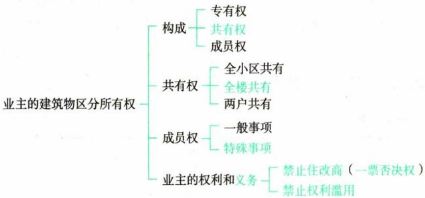

flowchart

```mermaid
graph TD
    A["业主的建筑物区分所有权"] --> B["构成"]
    A --> C["共有权"]
    A --> D["成员权"]
    A --> E["业主的权利和义务"]
    
    B --> F["专有权"]
    B --> G["共有权"]
    B --> H["成员权"]
    
    C --> I["全小区共有"]
    C --> J["全楼共有"]
    C --> K["两户共有"]
    
    D --> L["一般事项"]
    D --> M["特殊事项"]
    
    E --> N["禁止住改商（一票否决权）"]
    E --> O["禁止权利滥用"]
```

#### 一、业主的建筑物区分所有权的构成

业主对建筑物内的住宅、经营性用房等专有部分享有所有权，对专有部分以外的共有部分享有共有和共同管理的权利。据此可知，业主的建筑物区分所有权由三部分构成，分别是专有权、共有权和成员权。

对于 “业主” 应进行扩大解释，基于与建设单位之间的商品房买卖民事法律行为，已经合法占有建筑物专有部分，但尚未依法办理所有权登记的人，可以认定为业主（《建筑物区分所有权解释》第 1 条）。

[萌主点拨] 所有权人一定是业主，但业主不一定是所有权人。

#### (一) 专有权①

专有权，即所有权，是指业主对其建筑物专有部分享有占有、使用、收益和处分的权利。

业主行使权利不得危及建筑物的安全，不得损害其他业主的合法权益。建筑物及其附属设施的费用分摊、收益分配等事项，有约定的，按照约定；没有约定或约定不明确的，按照业主专有部分面积所占比例确定。

[例] 孟某系北京市海淀区幸福小区 2 号楼 2 单元 402 室的业主。请判断孟某的下列行为是否属于合理使用？

①孟某欲在自家卧室对应的外墙上安装空调外机。属于合理使用。

②孟某欲将自家对应的外墙粉刷成与整体建筑物不一样的颜色。不属于合理使用。

③孟某欲将房屋内的承重墙打掉。不属于合理使用。

#### (二) 共有权 $^{②}$

业主对建筑物专有部分以外的共有部分，享有权利，承担义务；不得以放弃权利为由不履行义务（物业费）。业主转让建筑物内的住宅、经营性用房，其对共有部分享有的共有和共同管理的权利一并转让。各区分所有权人之间不存在优先购买权，区别于按份共有人的优先购买权。

#### (三) 成员权

成员权，即管理权，是指建筑物区分所有权人基于建筑物的构造、权利归属及使用上的密切联系而形成的，作为建筑物管理团体之成员所享有的权利。基于建筑物的管理、维护和修缮等共同事务而产生的成员权。

#### 二、业主的建筑物区分所有权之共有权

#### (一) 全小区共有 $^{③}$

<table><tr><td colspan="3">全小区共有</td></tr><tr><td>道路</td><td>归属</td><td>业主共有(例外:城镇公共道路)</td></tr><tr><td>绿地</td><td>归属</td><td>业主共有(例外:城镇公共绿地或明示属于个人)</td></tr><tr><td>公共场所</td><td>归属</td><td>业主共有</td></tr><tr><td>共有设施</td><td>归属</td><td>业主共有</td></tr></table>

① 考查 1 次，抓住重点。
② 考查 1 次，抓住重点。
③ 考查 1 次，抓住重点。

续表

<table><tr><td colspan="3">全小区共有</td></tr><tr><td>物业服务用房</td><td>归属</td><td>业主共有</td></tr><tr><td>维修资金</td><td>归属</td><td>业主共有</td></tr><tr><td rowspan="4">车位、车库</td><td>性质</td><td>车位、车库是小区业主共同生活的辅助设施,性质上属于小区的配套设施</td></tr><tr><td rowspan="2">归属</td><td>1.建筑区划内,规划用于停放汽车的车位、车库的归属,由当事人通过出售、附赠或出租等方式约定(有约从约)</td></tr><tr><td>2.占用业主共有的道路或其他场地用于停放汽车的新增的车位,属于业主共有</td></tr><tr><td>使用</td><td>建筑区划内,规划用于停放汽车的车位、车库应当首先满足业主的需要</td></tr></table>

#### (二) 全楼共有

建筑物的基础、承重结构、外墙、屋顶等基本结构部分，通道、楼梯、大堂等公共通行部分，消防、公共照明等附属设施、设备，避难层、设备层或设备间等结构部分。建设单位、物业服务企业或其他管理人等利用业主的共有部分产生的收入（利用外墙和屋顶悬挂广告牌打广告的收入），在扣除合理成本之后，属于业主共有。

#### (三) 两户共有

楼板、承重墙以外的其他墙体。对于楼板和承重墙以外的其他墙体，采用“墙体中间层说”，即双方的权利到墙体的中间，而承重墙属于全楼共有非两户共有。

#### 三、业主的建筑物区分所有权之成员权①

业主的成员权，即表决权或管理权，在考试范围内主要是特殊事项的表决问题。

#### (一) 一般事项

1. 具体内容。

(1) 制定和修改业主大会议事规则:
(2) 制定和修改管理规约;
(3) 选举业主委员会或更换业主委员会成员；
(4) 选聘和解聘物业服务企业或其他管理人;
(5) 使用建筑物及其附属设施的维修资金。

2. 行权。

应当由专有部分面积占比 2/3 以上的业主且人数占比 2/3 以上的业主参与表决。同时，应当经参与表决专有部分面积过半数的业主且参与表决人数过半数的业主同意。

#### (二) 特殊事项

#### 1. 具体内容。

（1）筹集建筑物及其附属设施的维修资金。建筑物及其附属设施的维修资金，属于业主共有。经业主共同决定，可以用于电梯、屋顶、外墙、无障碍设施等共有部分的维修、更新和改造。维修资金的筹集、使用情况应当定期公布。紧急情况下需要维修建筑物及其附属设施的，业主大会或业主委员会可以依法申请使用维修资金。

(2) 改建、重建建筑物及其附属设施（如拆挂广告牌、修建花圃、安装或增设电梯等）。

(3) 改变共有部分的用途或利用共有部分从事经营活动。

#### 2. 行权。

应当由专有部分面积占比 2/3 以上的业主且人数占比 2/3 以上的业主参与表决。同时，应当经参与表决专有部分面积 3/4 以上的业主且参与表决人数 3/4 以上的业主同意。

#### 四、业主的权利和义务

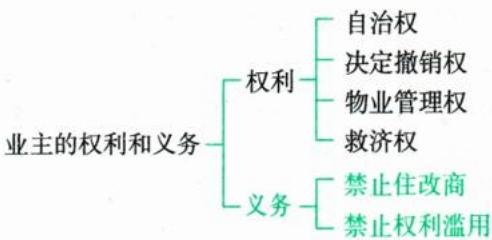

flowchart

```mermaid
graph TD
    A["业主的权利和义务"] --> B["权利"]
    A --> C["义务"]
    B --> D["自治权"]
    B --> E["决定撤销权"]
    B --> F["物业管理权"]
    B --> G["救济权"]
    C --> H["禁止住改商"]
    C --> I["禁止权利滥用"]
```

(业主的权利和义务体系框架图)

#### (一) 业主的权利

#### 1. 自治权。

业主可以设立业主大会，选举业主委员会。业主大会、业主委员会成立的具体条件和程序，依照法律、法规的规定。地方人民政府有关部门、居民委员会应当对设立业主大会和选举业主委员会给予指导和协助。

#### 2. 决定撤销权。

业主大会或业主委员会的决定，对业主具有法律约束力。业主大会或业主委员会作出的决定侵害业主合法权益的，受侵害的业主可以请求法院予以撤销。业主以业主大会或业主委员会作出的决定侵害其合法权益或违反了法律规定的程序为由，请求人民法院撤销该决定的，应当在知道或应当知道业主大会或业主委员会作出决定之日起1年内（除斥期间）行使。

#### 3. 物业管理权。

#### (1) 管理权和解聘权。

业主可以自行管理（自主管理权）建筑物及其附属设施，也可以委托物业服务企业或者其他管理人管理（委托管理权）。对建设单位聘请的物业服务企业或其他管理人，业主有权依法更换（解聘权）。

#### (2) 监督权和知情权。

物业服务企业或其他管理人根据业主的委托，依照《民法典》合同编有关物业服务合同的规定管理建筑区划内的建筑物及其附属设施，并接受业主的监督（监督权）。物业服务企业或其他管理人应当及时答复业主对物业服务情况提出的询问（知情权）。

#### (3) 新冠肺炎。

物业服务企业或者其他管理人应当执行政府依法实施的应急处置措施和其他管理措施，积极配合开展相关工作。

#### 4. 救济权。

业主对建设单位、物业服务企业或其他管理人以及其他业主侵害自己合法权益的行为，有权请求其承担民事责任。

#### （二）业主的义务

#### 1. 禁止住改商①。

《民法典》第279条及《建筑物区分所有权纠纷解释》第10、11条共3个条文确立了禁止住改商的制度。

业主不得违反法律、法规以及管理规约，将住宅改变为经营性用房。业主将住宅改变为经营性用房的，除遵守法律、法规以及管理规约外，应当经有利害关系的业主一致同意。业主将住宅改变为经营性用房，未经有利害关系的业主一致同意，有利害关系的业主请求排除妨害、消除危险、恢复原状或赔偿损失的，法院应予支持。将住宅改变为经营性用房的业主以多数有利害关系的业主同意其行为进行抗辩的，法院不予支持。

[萌主点拨]（1）业主住改商的，有利害关系的业主享有一票否决权。

(2) 建筑区划内, 本栋建筑物的业主自动视为利害关系人; 本栋建筑物之外的业主, 主张与自己有利害关系的, 应证明其房屋价值、生活质量受到或可能受到不利影响。

#### 2. 禁止权利滥用 $^{②}$ 。

业主应当遵守法律、法规以及管理规约。相关行为应当符合节约资源、保护生态环境的要求（绿色原则）。对于物业服务企业或其他管理人执行政府依法实施的应急处置措施和其他管理措施，业主应当依法予以配合（新冠肺炎疫情）。

业主大会或业主委员会，对任意弃置垃圾、排放污染物或噪声、违反规定饲养动物、违章搭建、侵占通道、拒付物业费等损害他人合法权益的行为，有权依照法律、法规以及管理规约，请求行为人停止侵害、排除妨碍、消除危险、恢复原状、赔偿损失。业主或其他行为人拒不履行相关义务的，有关当事人可以向有关行政主管部门报告或投诉，有关行政主管部门应当依法处理（《民法典》第286条）。

#### >> 随堂练习

蒋某是 C 市某住宅小区 6 栋 3 单元 502 号房业主，入住后面临下列法律问题，请根据相关事实予以解答。请回答第 1—3 题。

1. 小区地下停车场设有车位 500 个，开发商销售了 300 个，另 200 个用于出租。蒋某购房时未买车位，现因购车需使用车位。下列选项正确的是？(2017-3-86，任)③

A. 蒋某等业主对地下停车场享有业主共有权
B. 如小区其他业主出售车位，蒋某等无车位业主在同等条件下享有优先购买权
C. 开发商出租车位，应优先满足蒋某等无车位业主的需要
D. 小区业主如出售房屋，其所购车位应一同转让

2. 该小区业主田某将其位于一楼的住宅用于开办茶馆，蒋某认为此举不妥，交涉无果后向法院起诉，要求田某停止开办。下列选项正确的是？(2017-3-87，任)①

A. 如蒋某是同一栋住宅楼的业主，法院应支持其请求
B. 如蒋某能证明因田某开办茶馆而影响其房屋价值，法院应支持其请求
C. 如蒋某能证明因田某开办茶馆而影响其生活质量，法院应支持其请求
D. 如田某能证明其开办茶馆得到多数有利害关系业主的同意，法院应驳回蒋某的请求

3. 对小区其他业主的下列行为，蒋某有权提起诉讼的是？(2017-3-88，任)②

A. 5 栋某业主任意弃置垃圾
B. 7 栋某业主违反规定饲养动物
C. 8 栋顶楼某业主违章搭建楼顶花房
D. 楼上邻居因不当装修损坏蒋某家天花板

### 第三节 共有

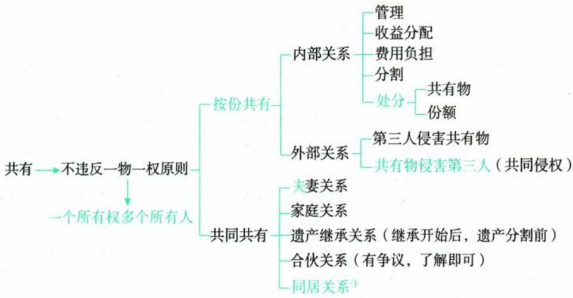

flowchart

```mermaid
graph TD
    A["共有"] --> B["不违反一物一权原则"]
    B --> C["一个所有权多个所有人"]
    C --> D["按份共有"]
    D --> E["内部关系"]
    E --> F["管理"]
    E --> G["收益分配"]
    E --> H["费用负担"]
    E --> I["分割"]
    E --> J["处分"]
    J --> K["共有物"]
    J --> L["份额"]
    D --> M["外部关系"]
    M --> N["第三人侵害共有物"]
    M --> O["共有物侵害第三人（共同侵权）"]
    C --> P["共同共有"]
    P --> Q["夫妻关系"]
    P --> R["家庭关系"]
    P --> S["遗产继承关系（继承开始后，遗产分割前）"]
    P --> T["合伙关系（有争议，了解即可）"]
    P --> U["同居关系③"]
```

#### 一、按份共有

#### (一) 内部关系 $^{④}$

#### 1. 管理。

#### (1) 保存行为。

共有人按照约定管理共有的不动产或动产；没有约定或约定不明确的，各共有人都有管理的权利和义务。

[萌主点拨] 保存行为：有约从约定，无约均有。

① 答案：ABC。
② 答案：D。
③《民法典婚姻家庭编解释（一）》第22条［无效或被撤销婚姻当事人同居期间所得财产的处理］被确认无效或者被撤销的婚姻，当事人同居期间所得的财产，除有证据证明为当事人一方所有的以外，按共同共有处理。
④ 考查 4 次，重点关注。

#### (2) 重大事项。

对共有的不动产或动产作重大修缮（改良行为）、变更性质或用途。

[萌主点拨] 重大事项：有约从约；无约应当经2/3以上份额共有人同意。

[例] 孟某、马某、曹某和徐某四人各自出资80万元、10万元、5万元和5万元购买了一辆价值100万元的宝马轿车。份额为孟某占 $80\%$ ，马某占 $10\%$ ，曹某和徐某各占 $5\%$ 。如没有约定，马某不得单独决定将宝马轿车的汽油发动机变更为柴油发动机。因为该事项属于重大事项，须经2/3以上份额的按份共有人同意。

#### 2. 收益分配（份额确定）。

按份共有人对共有的不动产或动产享有的份额，没有约定或约定不明确的，按照出资额确定；不能确定出资额的，视为等额享有。

[萌主点拨] 按份共有人的收益分配（份额确定）分三步：

第一步：看约定，即有约从约；

第二步：看出资额；

第三步：推定等额。

[例] 张某与李某共有一台机器，各占 $50\%$ 份额（按份共有）。双方共同将机器转卖获得10万元，约定张某和李某分别享有6万元和4万元。同时约定该10万元暂存李某账户，由其在3个月后返还给张某6万元。后该账户全部款项均被李某债权人王某申请法院查封并执行，致李某不能按期返还张某款项。张某可请求李某返还6万元。

#### 3. 费用负担。

共有人对共有物的管理费用以及其他负担，有约定的，按照其约定；没有约定或约定不明确的，按份共有人按照其份额负担。

[萌主点拨] 按份共有人的费用负担：有约从约，无约按份。

#### 4. 分割。

#### (1) 条件。

共有人约定不得分割共有的不动产或动产，以维持共有关系的，应当按照约定，但是共有人有重大理由需要分割的，可以请求分割；没有约定或约定不明确的，按份共有人可以随时请求分割。因分割造成其他共有人损害的，应当给予赔偿。

[萌主点拨] 按份共有人请求分割共有物：有约从约，无约随时分，不受诉讼时效期间的限制。

#### (2) 方式。

共有人可以协商确定分割方式。达不成协议，共有的不动产或动产可以分割并且不会因分割减损价值的，应当对实物予以分割；难以分割或因分割会减损价值的，应当对折价或拍卖、变卖取得的价款予以分割。

#### (3) 瑕疵担保责任。

共有人分割所得的不动产或动产有瑕疵的，其他共有人应当分担损失。

5. 处分①。

<table><tr><td colspan="2">按份共有的处分问题</td></tr><tr><td>共有物</td><td>处分按份共有物(包括不动产和动产)的,应当经占份额2/3以上的按份共有人同意;否则,若实际处分,构成无权处分;买卖合同合法有效,第三人符合善意取得构成要件的,可以善意取得共有物的所有权。[萌主点拨]出租行为属于负担行为,无需2/3以上份额的按份共有人同意</td></tr><tr><td>共有份额</td><td>按份共有人转让共有的份额是自由的,无需经过其他按份共有人的同意继承和遗赠不属于转让。共有份额的权利主体因继承、遗赠等原因发生变化时,其他按份共有人主张优先购买的,不予支持,但按份共有人之间另有约定的除外对内转让不属于转让。按份共有人之间转让份额的,不破坏彼此之间的信任,即不破坏“人合性”。因此,原则上不得主张优先购买权,除非另有约定同等条件应当综合共有份额的转让价格、价款履行方式及期限等因素确定(镜面规则)优先购买权的行使期间,按份共有人之间有约定的,按照约定处理;没有约定或约定不明的,按照下列情形确定:(1)转让人向其他按份共有人发出的包含同等条件内容的通知中载明行使期间,以该期间为准;(2)通知中未载明行使期间或载明的期间短于通知送达之日起15日,为15日;(3)转让人未通知的,为其他按份共有人知道或应当知道最终确定的同等条件之日起15日;(4)转让人未通知,且无法确定其他按份共有人知道或应当知道最终确定的同等条件的,为共有份额权属转移之日起6个月其他按份共有人根据法律、司法解释规定,请求按照同等条件优先购买该共有份额的,应予支持。其他按份共有人的请求具有下列情形之一的,不予支持:(1)未在法定期间内主张优先购买,或虽主张优先购买,但提出减少转让价款、增加转让人负担等实质性变更要求;(2)以其优先购买权受到侵害为由,仅请求撤销共有份额转让合同或认定该合同无效两个以上其他共有人主张行使优先购买权的,协商确定各自的购买比例;协商不成的,按照转让时各自的共有份额比例行使优先购买权</td></tr></table>

#### >> 随堂练习

张三、李四和王五共同购买一辆汽车，用于货运经营，后汽车出现故障，李四和王五打算趁此机会进行整体维修。张三最近经济紧张，并不想出钱维修，于是想将自己的共有份额转让给曹某。关于本案，下列哪一选项是正确的？(2023金题-2-1-3，单)②

A. 李四和王五享有平等的优先购买权
B. 维修汽车需要所有人共同决定
C. 该汽车为三人共同共有
D. 张三向外转让份额需要经李四和王五一致同意

#### (二) 外部关系

1. 第三人侵害共有物。

第三人侵害共有物的，任何按份共有人均可以主张权利，享有连带债权。

2. 共有物侵害第三人（共同侵权）。

共有物侵害第三人的，各按份共有人承担连带债务，超出自己应当承担份额的按份共有人，有权向其他按份共有人追偿，除非当事人之间另有约定。共有物侵害第三人利益的，按份共有人承担责任的规则：对外连带，对内按份。

[例] 孟某、马某、曹某和徐某四人各自出资80万元、10万元、5万元和5万元购买了一辆价值100万元的宝马轿车。份额为孟某占 $80\%$ ，马某占 $10\%$ ，曹某和徐某各占 $5\%$ 。10月17日，孟某驾车将王某撞伤，花去医药费2000元。根据上述案情，请回答如下问题：

①王某向法院起诉孟某，法院应当如何处理？

答：法院应当追加马某、曹某和徐某为共同被告（必要共同诉讼/《人身损害赔偿解释》第2条）。

②法院应当如何判决孟某、马某、曹某和徐某的责任范围？

答：判决孟某承担80%的责任、马某承担10%的责任、曹某和徐某承担5%的责任，即按照份额承担侵权责任（对外连带、对内按份、人人有份）。

#### 二、共同共有

共同共有和按份共有不同的方面包括如下五点：（1）在管理问题下，对于重大修缮或处分的需要全体共有人一致同意。（2）在收益分配时，直接共同享有。（3）在费用负担问题下，无约定时共同承担。（4）在共同共有的情况下，要分割共有物必须满足基础丧失（如二者离婚）或重大理由的条件。（5）在外部关系中共有物侵害第三人的，共同共有不存在内部追偿问题。

## 08 专题八 用益物权

#### 复习提要

用益物权，规定在《民法典》第二编物权第三分编第十章至第十五章（第323—385条），共六章63条。本专题主要涉及三个问题：1. 土地承包经营权；2. 居住权；3. 地役权。其中，居住权属于《民法典》新增制度，必须重点掌握。

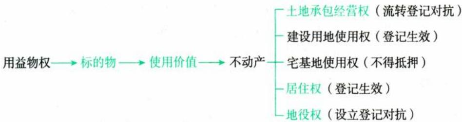

flowchart

```mermaid
graph LR
    A["用益物权"] --> B["标的物"]
    B --> C["使用价值"]
    C --> D["不动产"]
    D --> E["土地承包经营权（流转登记对抗）"]
    D --> F["建设用地使用权（登记生效）"]
    D --> G["宅基地使用权（不得抵押）"]
    D --> H["居住权（登记生效）"]
    D --> I["地役权（设立登记对抗）"]
```

#### 一、土地承包经营权 $^{①}$

#### (一) 含义

土地承包经营权，是指土地承包经营权人为从事种植业、畜牧业、林业，对其承包的集体所有或国家所有由农民集体使用的土地所享有的占有、使用和收益的权利。

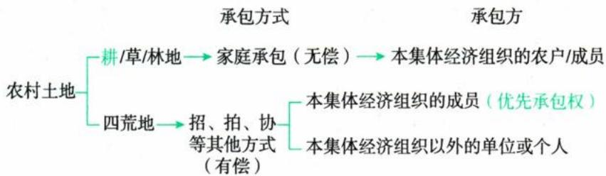

flowchart

```mermaid
graph TD
    A["农村土地"] --> B["耕/草/林地"]
    A --> C["四荒地"]
    B --> D["家庭承包（无偿）"]
    D --> E["本集体经济组织的农户/成员"]
    C --> F["招、拍、协等其他方式（有偿）"]
    F --> G["本集体经济组织的成员（优先承包权）"]
    F --> H["本集体经济组织以外的单位或个人"]
```

(农村土地承包经营权的体系框架图)

#### 1. 家庭承包（无偿方式）。

家庭承包，是指以农村集体经济组织的每一个农户家庭全体成员为一个生产经营单位，作为承包人与发包人建立承包关系，承包耕地、草地、林地（数量最多，涉及面最广，与每一个农民利益最密切）等用于农业的土地。家庭承包中的承包人是农村集体经济组织的农户。发包人将土地发包给农户经营时，应当按照每户所有成员的人数来确定承包土地的份额，也就是通常所说的“按户承包，按人分地”，也叫“人人有份”，具有很强的社会保障和福利功能。

2. 招标、拍卖、公开协商等方式承包（有偿方式）。

对于荒山、荒沟、荒丘、荒滩（“四荒”土地）等农村土地，本集体经济组织成员有的不愿意承包，有的根据自己的能力承包的数量不同。这些不宜采取家庭承包方式的农村土地，可以采取招标、拍卖、公开协商等方式承包。由最有经济能力和经营能力的人承包。发包人按“效率优先，兼顾公平”原则选择承包人。

以其他方式承包农村土地，在同等条件下，本集体经济组织成员有权优先承包。发包方将农村土地发包给本集体经济组织以外的单位或个人承包，应当事先经本集体经济组织成员的村民会议2/3以上成员或2/3以上村民代表的同意，并报乡（镇）政府批准。

#### (二) 设立

土地承包经营权自土地承包经营权合同生效时设立。登记机构应当向土地承包经营权人发放土地承包经营权证、林权证等证书，并登记造册，确认土地承包经营权。据此可知，土地承包经营权证、草原使用权证、林权证是承包人享有土地承包经营权的法律凭证（证权证书），为土地承包经营权人发放土地承包经营权证书是登记机构的法定义务。

#### (三) 流转和限制

土地承包经营权自合同生效时设立。流转时，未经登记不得对抗善意第三人。

#### >> 随堂练习

村民胡某承包了一块农民集体所有的耕地，订立了土地承包经营权合同，未办理确权登记。胡某因常年在外，便与同村村民周某订立土地承包经营权转让合同，将地交周某耕种，未办理变更登记。关于该土地承包经营权，下列哪一说法是正确的？（2017-3-7，单）①

A. 未经登记不得处分
B. 自土地承包经营权合同生效时设立
C. 其转让合同自完成变更登记时起生效
D. 其转让未经登记不发生效力

#### 二、居住权②

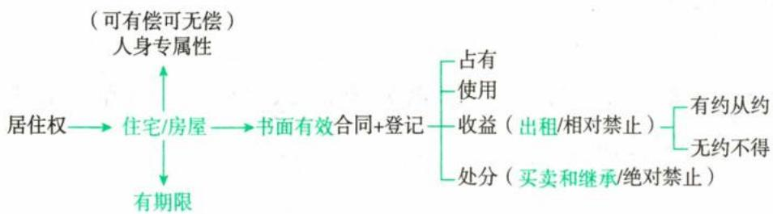

flowchart

```mermaid
graph TD
    A["居住权"] --> B["住宅/房屋"]
    B --> C["书面有效合同+登记"]
    C --> D["占有"]
    C --> E["使用"]
    C --> F["收益（出租/相对禁止）"]
    C --> G["处分（买卖和继承/绝对禁止）"]
    B --> H["有期限"]
    I["(可有偿可无偿)"] --> B
    J["人身专属性"] --> B
    K["有约从约"] --> C
    L["无约不得"] --> C
```

(居住权的体系框架图)

① 答案：B。
② 考查 5 次，重点关注。

#### (一) 含义

居住权人有权按照合同约定，对他人的住宅享有占有、使用的用益物权，以满足生活居住的需要。居住权的特征包括：

1. 居住权的主体只限于自然人。居住权人的家庭成员（亲属）或保姆等为其提供生活起居照顾的人员亦享有居住利益。

2. 居住权的客体为住宅及其附属设施。

3. 居住权人享有占有和使用两项权能。所有权，共包括4项权能，即占有、使用、收益和处分。居住权系用益物权，居住权人对他人的住宅仅享有占有和使用两项权能，且目的是为了满足生活居住的需要（限缩性解释）。

4. 居住权的功能是满足生活居住的需要。

#### (二) 设立

设立居住权，当事人应当订立书面有效的居住权合同或合法有效的遗嘱。同时，需要办理居住权登记，居住权自登记时设立。

#### (三) 限制

#### 1. 绝对禁止。

居住权不得转让、继承。居住权系用益物权，住宅的处分权能被绝对禁止。如在离婚财产分割中，一方以出于好意帮扶为目的，在自己所有的房屋上为经济困难的另一方设立居住权，则该居住权专属于对方人身。如果居住权人转让和继承，即违反了居住权设立的目的和初衷，导致所有权人几乎永远无法实现权利，破坏了居住权的人役权①属性。

[萌主点拨] 居住权不得设定抵押。居住权不得遗赠，即居住权人不得将居住权遗赠给他人。

#### 2. 相对禁止。

设立居住权的住宅不得出租，但是当事人另有约定的除外。居住权系用益物权，住宅的收益权能被相对禁止。所有权人和居住权人可以约定居住权人可以将住宅出租，以收取相应的租金（法定孳息）。

#### (四) 消灭

居住权是有期限物权。居住权期限届满或居住权人死亡的，居住权消灭。居住权消灭的，应当及时办理注销登记。

#### (五) 居住权与租赁权的异同

居住权 VS 租赁权

<table><tr><td>项目</td><td>居住权</td><td>租赁权</td></tr><tr><td>立法目的</td><td>保障居住利益</td><td>保障居住利益</td></tr><tr><td>权利性质</td><td>用益物权(绝对权/支配权/处分行为)</td><td>债权(相对权/请求权/负担行为)</td></tr><tr><td>要式否</td><td>书面合同或有效遗嘱形式</td><td>租期6个月以上须采书面形式</td></tr><tr><td>期限</td><td>可以超过20年</td><td>不得超过20年</td></tr><tr><td>登记效力</td><td>登记生效</td><td>登记备案</td></tr><tr><td>有偿否</td><td>可有偿可无偿,原则上无偿</td><td>有偿</td></tr><tr><td>权利限制</td><td>不得转让(绝对禁止)、不得继承(绝对禁止);不得出租(相对禁止)</td><td>有约从约,无约不得擅自转租</td></tr><tr><td>消灭</td><td>期限届满或死亡(注销登记)</td><td>租赁期限届满(不定期租赁合同)</td></tr></table>

##### 随堂练习

张甲年过八十，与其侄子张乙签订房屋买卖合同，价款200万元。买卖合同中包括“居住权条款”并约定张甲有终身居住权，张甲每个月需支付1000元。关于本案，下列选项正确的是？（2024金题-2-1-6，单）①

A. 居住权生前可以转让，死后不能继承
B. 居住权可以有偿设立，居住权条款有效
C. 买卖合同生效时，居住权正式设立
D. 居住权不能以条款设立，居住权条款无效

#### 三、地役权②

#### (一) 地役权和相邻关系的区别

地役权 VS 相邻关系

<table><tr><td>项目</td><td>地役权</td><td>相邻关系</td></tr><tr><td>调节程度</td><td>享受性权利(通行便利和观看风景)</td><td>最低限度的容忍义务</td></tr><tr><td>产生原因</td><td>意定(书面约定/书面协议)</td><td>法定</td></tr><tr><td>是否有偿</td><td>可有偿可无偿,但通常有偿</td><td>无偿</td></tr><tr><td>是否有期限</td><td>有期</td><td>无期</td></tr><tr><td>是否毗邻</td><td>不一定</td><td>是</td></tr></table>

地役权，是指为了自己不动产使用的便利和效益，按照合同约定而使用他人不动产的权利，如通行权、取水权、采光权、眺望权。其中，为自己不动产的便利而使用他人土地的一方称为需役地人或地役权人，将自己的不动产供他人使用的一方称为供役地人。相邻关系，是指两个或两个以上相互毗邻的不动产的所有人或使用人，在行使占有、使用、收益、处分权利时发生的权利义务。

地役权和相邻关系的区别主要包括如下5点：

1. 调节程度不同。地役权是地役权人为了自己不动产的便利而设定的权利，本质上属于一种享受性权利，如通行便利（积极地役权中的通行地役权）和观看风景（消极地役权中的眺望地役权）；而相邻关系则属于最低限度的容忍义务，如容忍邻居在合理时间内装修房屋。

[例] 甲、乙、丙依次比邻而居。甲为修房向乙提出在其院内堆放建材，乙不允。甲遂向丙提出在其院内堆放，丙要求甲付费200元，并提出不得超过20天，甲同意。修房过程中，甲搬运建材须从乙家门前经过，乙予以阻拦。乙无权阻拦甲经其门前搬运建材。因为甲搬运建材从乙家门前经过系相邻关系（相邻通行权），乙负有最低限度的容忍义务，无权阻拦。

2. 产生原因不同。地役权是意定的，即基于双方当事人的协议或合同而产生；而相邻关系是法定的。因此，如果题目中看到“协议、合同”这样的关键词时，结论就是地役权而非相邻关系。

3. 是否有偿不同。地役权可有偿可无偿，但通常是有偿的；而相邻关系是无偿的。因此，如果题目中看到“价款”这样的关键词时，结论就是地役权而非相邻关系。

4. 是否有期限不同。地役权是有期限的，而相邻关系是无期限的。因此，如果题目中看到“几年”这样的关键词时，结论就是地役权而非相邻关系。

5. 是否毗邻不同。地役权中的需役地和供役地不一定是相互毗邻的，只要二者之间有互为利用之必要即可；但相邻关系一定是毗邻的。

#### (二) 地役权的转让

1. 需役地转让。

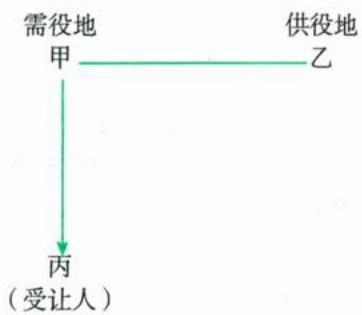

flowchart

```mermaid
graph TD
    甲 -->|供役地 乙| 丙
    丙 -->|需役地 甲| 乙
```

(地役权需役地转让示意图)

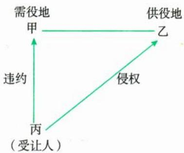

flowchart

```mermaid
graph TD
    甲["需役地"] --> 乙["供役地"]
    乙 --> 丙["丙（受让人）"]
    丙 -->|违约| 甲
    乙 -->|侵权| 丙
```

(地役权需役地转让救济示意图)

[例] 甲公司与乙公司约定：为满足甲公司开发住宅小区观景的需要，甲公司向乙公司支付100万元，乙公司在20年内不在自己厂区建造6米以上的建筑。甲公司将全部房屋售出后不久，乙公司在自己的厂区建造了一栋8米高的厂房。小区业主有权请求乙公司拆除超过6米的建筑。

在地役权中包括两块土地，一块是“需役地”，另一块是“供役地”。在需役地转让的情况下，甲将全部房屋转让给丙后就退出了地役权法律关系。同时，因地役权具有从属性（地役权属于从权利）。此后，只有丙才能向乙主张地役权。因此，只有小区业主才有权请求乙公司拆除超过6米的建筑，且小区的每一个业主都有权主张全部地役权。此时，体现的就是地役权具有不可分性。

2. 供役地转让。

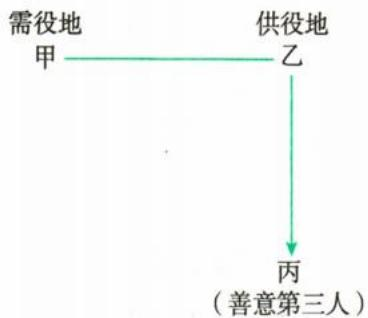

flowchart

```mermaid
graph TD
    甲["需役地"] --> 乙["供役地"]
    乙 --> 丙["丙\n(善意第三人)"]
```

(地役权供役地转让示意图)

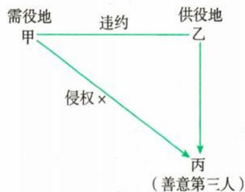

flowchart

```mermaid
graph TD
    甲["需役地"] -->|侵权×| 丙["(善意第三人)"]
    乙["供役地"] -->|违约| 甲
    丙 --> 乙
```

(地役权供役地转让救济示意图)

[例] 甲为了能在自己的房子里欣赏远处的风景，便与相邻的乙约定：乙不在自己的土地上建造高层建筑；作为补偿，甲每年支付给乙4000元。两年后，乙将该土地使用权转让给丙。丙在该土地上建造了一座高楼，与甲发生纠纷。对此纠纷，甲无权禁止丙建造高楼。

地役权自地役权合同生效时设立，未经登记不得对抗善意第三人。善意第三人只有在供役地转让时才会出现，也就是图示中的“丙”。在题目中没有提及是否已经登记的，视为没有登记。由于甲和乙签订的地役权合同并未登记，因此，不得对抗善意第三人丙（因未登记，丙在受让时不知该土地上有负担，属于善意第三人），换句话说就是丙有权建造高楼。

3. 需役地和供役地均转让。

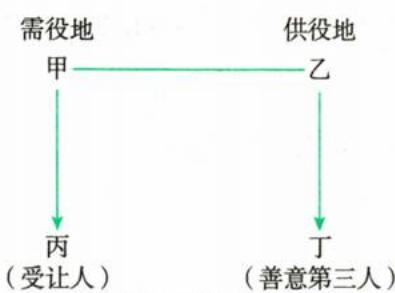

flowchart

```mermaid
graph TD
    甲 -->|需役地| 乙
    甲 -->|受让人| 丙
    乙 -->|供役地| 丁
    丁 -->|善意第三人| 乙
```

(地役权两地转让示意图)

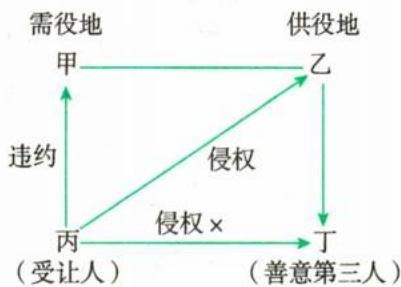

flowchart

```mermaid
graph TD
    甲["需役地"] --> 乙["供役地"]
    乙 --> 丁["丁 (善意第三人)"]
    丁 --> 丙["(受让人)"]
    丙 -->|违约| 甲
    乙 -->|侵权| 丙
    丙 -->|侵权×| 丁
```

(地役权两地转让救济示意图)

[例] 甲为了能在自己房中欣赏远处风景，便与相邻的乙约定：乙不在自己的土地上建造高层建筑，作为补偿，甲一次性支付给乙4万元。两年后，甲将房屋转让给丙，乙将该土地使用权转让给丁。丙不可以禁止丁建高楼。

需役地和供役地均发生变动的情况下，分别处置即可。与供役地转让一样，因未登记，不得对抗善意第三人丁，丁有权建高楼，丙无权禁止。

## 09 专题九 担保物权

#### 复习提要

担保物权，规定在《民法典》第二编物权第四分编第十六章至第十九章（第386—457条），共四章72条。担保物权部分每年必考，备考时必须重点关注。本专题主要涉及四个问题：1. 担保物权的基本原理；2. 抵押权；3. 质权；4. 留置权。其中，担保物权的基本原理中重点是从属性和流押/流质条款。抵押权系绝对重点。质权的重点和难点是权利质权。留置权作为法定担保物权的核心考点就是成立要件。

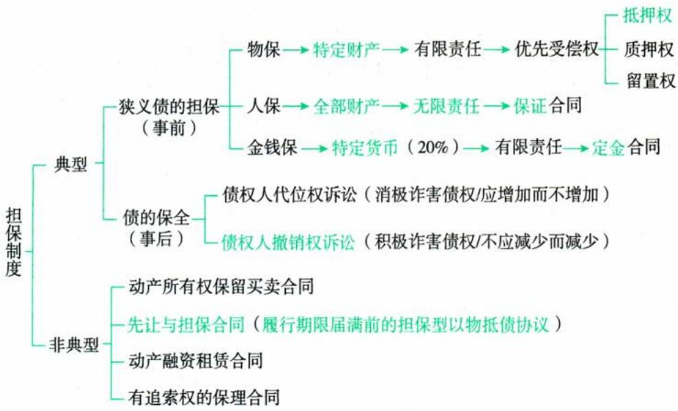

flowchart

```mermaid
graph TD
    A["担保制度"] --> B["典型"]
    A --> C["非典型"]
    B --> D["狭义债的担保（事前）"]
    B --> E["债的保全（事后）"]
    D --> F["物保 → 特定财产 → 有限责任 → 优先受偿权"]
    D --> G["人保 → 全部财产 → 无限责任 → 保证合同"]
    D --> H["金钱保 → 特定货币（20%） → 有限责任 → 定金合同"]
    E --> I["债权人代位权诉讼（消极诈害债权/应增加而不增加）"]
    E --> J["债权人撤销权诉讼（积极诈害债权/不应减少而减少）"]
    C --> K["动产所有权保留买卖合同"]
    C --> L["先让与担保合同（履行期限届满前的担保型以物抵债协议）"]
    C --> M["动产融资租赁合同"]
    C --> N["有追索权的保理合同"]
    F --> O["抵押权"]
    F --> P["质押权"]
    F --> Q["留置权"]
```

### 第一节 担保物权的基本原理

#### 复习提要

担保物权的基本原理系学好担保物权的前提，主要是围绕担保合同展开。本节主要涉及六个问题，均为绝对重点。分别是：1. 担保物权中的利益衡量法律思维；2. 担保合同无效的法律后果；3. 担保的从属性；4. 意定担保物权的流押（质）条款；5. 意定担保物权的不可分性；6. 担保物权的物上代位性。

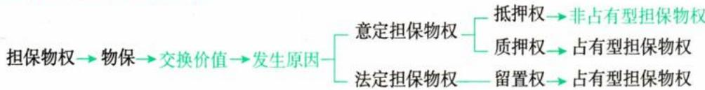

flowchart

```mermaid
graph LR
    A["担保物权"] --> B["物保"]
    B --> C["交换价值"]
    C --> D["发生原因"]
    D --> E["意定担保物权"]
    D --> F["法定担保物权"]
    E --> G["抵押权"]
    E --> H["质押权"]
    G --> I["非占有型担保物权"]
    H --> J["占有型担保物权"]
    F --> K["留置权"]
    K --> L["占有型担保物权"]
```

[图释] 担保物权属于“他物权”的一种。担保物权，简称“物保”，是指为了确保债权（主权利）的实现，债务人或第三人在其不动产、动产或财产权利（标的物）上设定的，当债务人不履行到期债务或发生当事人约定的实现担保物权的情形时，债权人可就该担保财产变价并优先受偿（有顺序）的限制物权（定限物权）。单纯支配和利用他人之物或财产权利的“交换价值”。

依据发生原因的不同，担保物权分为意定担保物权（当事人可以基于其自由意志而创设的担保物权）和法定担保物权（法律明确规定其成立要件的担保物权）。意定担保物权系依据担保合同而产生，包括抵押权（书面抵押合同）和质押权（书面质押合同）。法定担保物权系依据法律的直接规定而产生，即留置权。

通俗而言，担保物权可以总结为如下5点：

1. 担保物权就是用他人之物或财产权利担保自己债权实现的限制物权（定限物权）；
2. 担保物权系从权利，主权利系债权（从属性）；
3. 担保物权因债权人害怕债务人到期不能还款而存在；
4. 担保物权的本质乃优先受偿权（有顺序）；
5. 债权人看重的是标的物（特定财产）的交换价值。

#### 一、担保物权中的利益衡量法律思维

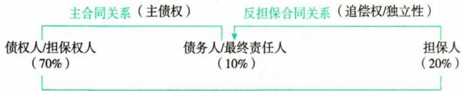

flowchart

```mermaid
graph TD
    A["主合同关系（主债权）"] --> B["债权人/担保权人 (70%)"]
    A --> C["债务人/最终责任人 (10%)"]
    A --> D["担保人 (20%)"]
    E["反担保合同关系（追偿权/独立性）"] --> C
    E --> D
```

从合同关系（本担保合同关系/从属性）
(担保法律关系中利益衡量法律思维示意图)

#### 二、担保合同无效的法律后果①

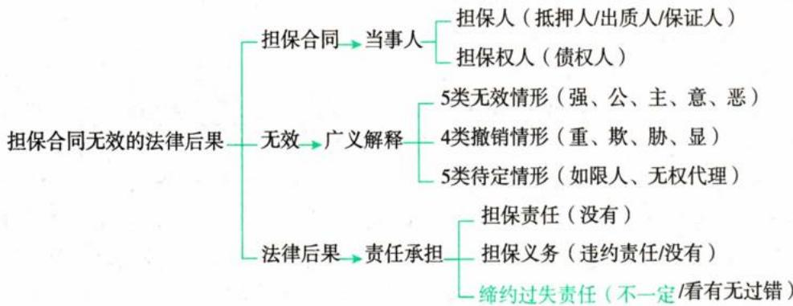

flowchart

```mermaid
graph TD
    A["担保合同无效的法律后果"] --> B["担保合同"]
    A --> C["无效"]
    A --> D["法律后果"]
    B --> E["担保合同"]
    B --> F["当事人"]
    E --> G["担保人（抵押人/出质人/保证人）"]
    E --> H["担保权人（债权人）"]
    C --> I["广义解释"]
    C --> J["5类无效情形（强、公、主、意、恶）"]
    C --> K["4类撤销情形（重、欺、胁、显）"]
    C --> L["5类待定情形（如限人、无权代理）"]
    D --> M["责任承担"]
    M --> N["担保责任（没有）"]
    M --> O["担保义务（违约责任/没有）"]
    M --> P["缔约过失责任（不一定/看有无过错）"]
```

(担保合同无效的法律后果的体系框架图)

根据《民法典》第388条的规定，设立担保物权，应当依照本法和其他法律的规定订立担保合同。担保合同包括抵押合同、质押合同和其他具有担保功能的合同（物权变动的缓和）。担保合同是主债权债务合同的从合同。主债权债务合同无效的，担保合同无效，但是法律另有规定的除外。

担保合同被确认无效后，债务人、担保人、债权人有过错的，应当根据其过错各自承担相应的民事责任。

#### (一) 主合同有效而第三人提供的担保合同无效

债权人和担保人对于担保合同的无效均有过错。例如，债权人和担保人在明知抵押物为法律禁止抵押的标的物的情况下，仍然订立抵押合同。此时，担保人承担的赔偿责任（缔约过失责任）不应超过债务人不能清偿部分的1/2。1/2是担保人承担责任的上限，担保人具体承担多少责任，应当根据其过错程度而定。1/2的责任属于补充责任①，补充责任是指承担责任的第二顺位，先债务人承担责任后担保人承担责任。

[例] 孟某向徐某借款（主合同/自然人之间的借款合同/实践性合同）2000万元用于投资开公司（目的合法/借款合同合法有效），借期1年。马某将一件禁止流通的文物（标的物违法）抵押给徐某。马某和徐某签订了一份书面抵押合同（因标的物违法而无效）。借款到期后，孟某的全部财产仅有200万元。徐某可以请求马某赔偿不超过900万元。

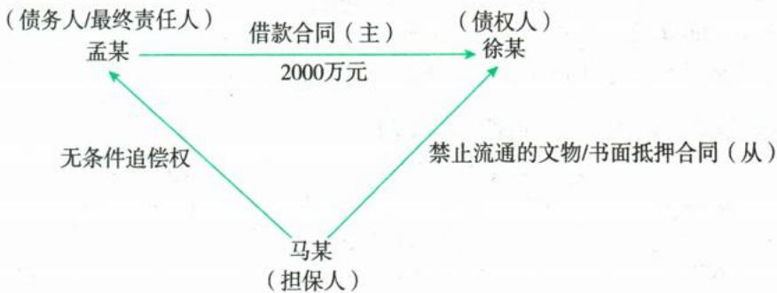

flowchart

```mermaid
graph TD
    A["孟某"] -->|借款合同（主） 2000万元| B(债权人)
    A -->|无条件追偿权| C["马某（担保人）"]
    B -->|禁止流通的文物/书面抵押合同（从）| C
    D["(债务人/最终责任人)"] --> A
    E["(债务人/最终责任人)"] --> A
```

(当事人法律关系示意图)

此时，借款合同合法有效，抵押合同无效，担保人马某有过错，债权人徐某也有过错。因此，马某应当承担孟某不能清偿部分的不超过1/2的赔偿责任（缔约过失责任）。承担责任后，无条件向孟某追偿（利益承受理论）。

#### （二）主合同无效导致担保合同无效

一般而言，主合同的有效或无效与第三人无关。所谓“担保人的过错”，是指担保人明知主合同无效仍为之提供担保、担保人明知主合同无效仍促使主合同成立或为主合同的签订作中介等。质言之，担保人的过错并不在于导致主合同的无效，而是在明知或应知主合同无效的情况下，仍然提供担保，放任合同无效的后果产生，损害了债权人的信赖利益，损害了交易安全。因此，担保人应当承担相应的责任。因担保人的过错并非是导致合同无效的主要原因且基于公平原则的考量，担保人承担的赔偿责任不应超过债务人不能清偿部分的1/3。具体承担多少，则应当根据担保人的过错程度而定。

即使担保人有过错向债权人承担了责任，但担保人的根本目的仍在于为债务人的债务提供担保。因此，担保人承担责任后仍有权向债务人追偿（即享有无条件追偿权或求偿权）。

[例] 众森公司向工商银行贷款（主合同/商业借款合同/诺成性合同）2亿元用于高利转贷（目的违法/贷款合同无效），借期1年。工商银行知悉众森公司高利放贷的意图。南京海马投融资担保公司（决议豁免/以下简称海马公司）明知众森公司高利转贷的意图仍以其办公楼为该笔债务提供抵押担保并办理了抵押登记手续。借款期限届满后，众森公司的全部财产仅有2000万元。

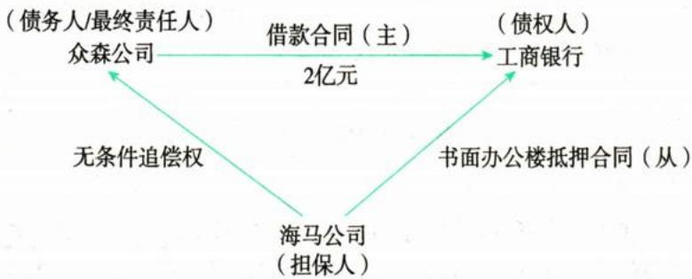

flowchart

```mermaid
graph TD
    A["众森公司"] -->|借款合同（主） 2亿元| B(债权人)
    A -->|无条件追偿权| C["海马公司（担保人）"]
    B -->|书面办公楼抵押合同（从）| C
    A -->|(债务人/最终责任人)| D["债务人/最终责任人"]
```

(当事人法律关系示意图)

此时，债务人众森公司和债权人工商银行之间的借款合同（主合同）因违法而无效，办公楼抵押合同（从合同）亦随之无效（担保合同的效力具有从属性/主合同无效，担保合同无效），担保人海马公司有过错，应当承担众森公司不能清偿部分的不超过1/3的赔偿责任（缔约过失责任），即不超过6000万元的赔偿责任。承担责任后，无条件向众森公司追偿（利益承受理论）。

[萌主点拨]
担保合同无效的法律后果

<table><tr><td>情形</td><td>担保人</td><td>担保权人/债权人</td><td>责任承担</td></tr><tr><td rowspan="3">主合同有效而第三人提供的担保合同无效</td><td>无过错</td><td>有过错</td><td>担保人不承担赔偿责任</td></tr><tr><td>有过错</td><td>无过错</td><td>担保人对债务人不能清偿的部分承担赔偿责任(补充责任/有顺序)</td></tr><tr><td>有过错</td><td>有过错</td><td>担保人承担的赔偿责任不应超过债务人不能清偿部分的1/2(补充责任/有顺序)</td></tr><tr><td rowspan="2">主合同无效导致第三人提供的担保合同无效</td><td>无过错</td><td>有过错</td><td>担保人不承担赔偿责任</td></tr><tr><td>有过错</td><td>有过错</td><td>担保人承担的赔偿责任不应超过债务人不能清偿部分的1/3(补充责任/有顺序)</td></tr></table>

#### 三、担保的从属性 $^{①}$ （保护担保人利益）

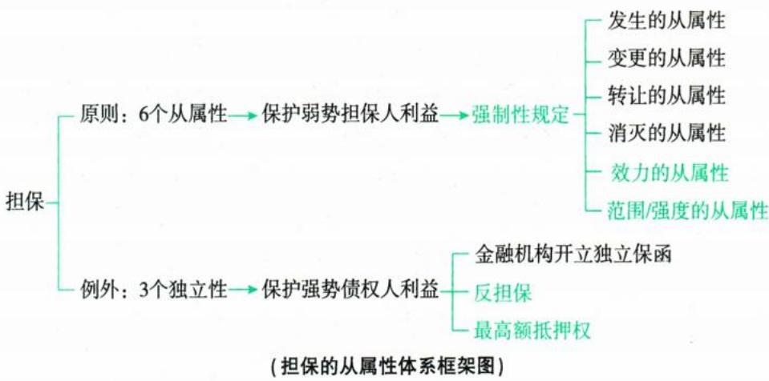

flowchart

```mermaid
graph TD
    A["担保"] --> B["原则：6个从属性"]
    B --> C["保护弱势担保人利益"]
    C --> D["强制性规定"]
    D --> E["发生的从属性"]
    D --> F["变更的从属性"]
    D --> G["转让的从属性"]
    D --> H["消灭的从属性"]
    D --> I["效力的从属性"]
    D --> J["范围/强度的从属性"]
    A --> K["例外：3个独立性"]
    K --> L["保护强势债权人利益"]
    L --> M["金融机构开立独立保函"]
    L --> N["反担保"]
    L --> O["最高额抵押权"]
```

#### (一) 效力的从属性

担保合同的从属性具有基础地位，如果当事人约定排除担保合同的从属性，在担保合同中约定担保合同的效力独立于主合同（典型的独立担保条款）或约定担保人对主合同无效的法律后果承担担保责任（扩充的独立担保条款），该有关担保独立性的约定无效。因为从属性是担保的基本属性，不存在当事人可以约定进行独立担保的意思自治空间，即不允许当事人根据约定排除担保的从属性（《民法典担保制度解释》第2条）。

[例] 孟某向马某借款（主合同）2000万元用于高利转贷（主合同因违法无效），借款期限1年。曹某以自己价值500万元的房屋为该笔债务提供抵押担保并办理了抵押登记手续。经查，曹某不知（担保人没有过错）孟某高利转贷的意图。书面抵押合同（从合同）第6条约定，抵押合同的效力独立于借款合同（典型的独立担保条款）。曹某对借款合同无效的法律后果承担担保责任（扩充的独立担保条款）。到期后，孟某无力还款，各方发生纠纷。抵押合同第6条属于独立担保条款，约定无效。曹某无需承担担保责任、无需承担违约责任、无需承担缔约过失责任。一言以蔽之，曹某无需承担任何责任。相反，如果法律承认抵押合同（担保合同）中关于“担保效力独立性”的约定，则在借款合同无效的情况下，抵押合同依然单独有效，则不知情的曹某需要以自己价值500万元的房屋承担担保责任，这样的结局对于曹某而言，显然是极度不公平的。因此，法律为了保护担保人的利益，选择了“担保效力的从属性”。

[萌主点拨] 担保效力从属性的本质是防止债权人权利滥用②。一言以蔽之，主合同无效，担保合同无效，法律另有规定的除外。独立担保条款属于过度担保，条款无效（但不影响其他条款的效力）。

#### (二) 范围的从属性

担保范围，是指担保人承担责任的范围。包括法定担保范围和约定担保范围（《民法典担保制度解释》第3条）。

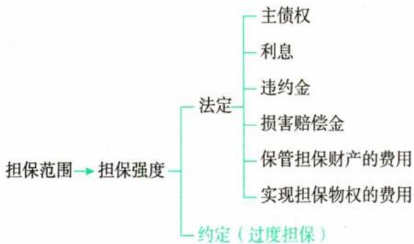

flowchart

```mermaid
graph TD
    A["担保范围"] --> B["担保强度"]
    B --> C["法定"]
    C --> D["主债权"]
    C --> E["利息"]
    C --> F["违约金"]
    C --> G["损害赔偿金"]
    C --> H["保管担保财产的费用"]
    C --> I["实现担保物权的费用"]
    B --> J["约定（过度担保）"]
```

(担保范围的体系框架图)

#### 1. 法定担保范围。

法定担保范围，是指在当事人没有进行特别约定的情况下，担保物权的担保范围。包括6项，分别是主债权、利息、违约金、损害赔偿金、保管担保财产的费用和实现担保物权的费用。

[萌主点拨]
担保范围（强度）

<table><tr><td>类型</td><td>项目</td><td>内容</td><td>法律依据</td></tr><tr><td>物的担保</td><td>6项</td><td>担保物权的担保范围包括主债权及其利息、违约金、损害赔偿金、保管担保财产和实现担保物权的费用。当事人另有约定的,按照其约定</td><td>《民法典》第389条</td></tr><tr><td>人的担保</td><td>5项</td><td>保证的范围包括主债权及其利息、违约金、损害赔偿金和实现债权的费用。当事人另有约定的,按照其约定</td><td>《民法典》第691条</td></tr></table>

#### 2. 约定担保范围。

担保范围在性质上属于“任意性规范”，当事人可以通过担保合同进行约定。但是，问题的关键在于：当事人是否可以约定担保责任的范围大于主债务呢？

实践中，最为常见的是针对担保责任的承担约定专门的违约责任以及担保责任范围超出主债务责任范围（如约定担保责任的数额高于主债务、担保责任约定的利息高于主债务利息、担保责任的履行期先于主债务履行期届满等）。

[例 1] 孟某与马某签订借款合同（主合同），双方约定：“孟某向马某借款850万元，借款期限为1年，如到期不还款，需承担日万分之五的违约金”。当日，曹某与马某签订抵押合同（从合同），约定：“曹某将自己的房屋为孟某的借款作抵押担保，并办理了抵押登记手续，如曹某未依约履行担保责任，需从逾期之日起另行支付日万分之五的逾期违约金”。本案中，抵押人曹某不仅需要支付债务人孟某因违约而支付的违约金，还要支付自己违约所要支付的违约金，其结果是，如果说债务人孟某违约只需要承担日万分之五的违约金，而抵押人曹某则要承担日万分之十的违约金。曹某承担责任超过孟某的部分无效（《民法典》第156条），债权人马某构成不当得利（法定之债），应返还本金及利息（原物及孳息）。据此，担保人的责任范围“绝对不能”超过主债务人（担保人的责任小于等于主债务人）。

[例 2] 孟某向马某借款 1000 万元，借期 1 年，未约定利息。曹某向马某单方以书面形式出具保证函，上书“愿意为孟某的债务提供连带责任保证，担保范围包括本金 1000 万元及利息”。后孟某无力还款，债权人马某起诉连带责任保证人曹某承担了 1000 万元的本金及 100 万元利息。本案中，孟某和马某之间的借款系自然人之间的借款合同（互助性），没有约定利息，视为无利息。曹某承担 1100 万元的责任，仅能向主债务人孟某追偿 1000 万元，超出的 100 万元有权基于不当得利（法定之债）请求债权人马某返还本金及利息（原物及孳息）。据此，担保人的责任范围“绝对不能”超过主债务人（担保人的责任小于等于主债务人）。

[萌主点拨] 担保范围从属性的本质是防止债权人权利滥用。一言以蔽之，担保人的责任范围绝对不能超过主债务人（担保人的责任小于等于主债务人）。否则，构成过度担保，条款无效（但不影响其他条款的效力）。

#### 四、意定担保物权的流押（质）条款 $^{①}$ （保护担保人利益）

#### (一) 含义

流押（质）条款，是指当事人在合同（协议）中约定，一旦债务人到期不履行债务，抵押财产（质押财产）直接归债权人所有的条款。

抵押权（质押权）作为优先受偿权，抵押权人（质权人）一般不以取得抵押财产（质押财产）为目的，在抵押合同（质押合同）中约定流押（质）条款的情形反而并不多见。法律之所以禁止流押（质）条款，立法目的是防止损害抵押人（质押人）的利益，以免造成对抵押人（质押人）实质上的不公平，防止权利滥用。

#### (二) 内容

#### 1. 流押条款。

抵押权人（即债权人）在债务履行期限届满前，与抵押人（可能是债务人，亦可能是债务人以外的第三人）约定债务人不履行到期债务时抵押财产归债权人所有的，只能依法就抵押财产优先受偿（《民法典》第401条）。

#### 2. 流质条款。

质权人（即债权人）在债务履行期限届满前，与出质人（可能是债务人，亦可能是债务人以外的第三人）约定债务人不履行到期债务时质押财产归债权人所有的，只能依法就质押财产优先受偿（《民法典》第428条）。

#### (三) 效力

《民法典》并未直接规定流押（质）条款的效力，但从条文表述看，流押（质）条款仍然是无效的，因为如果流押（质）条款是有效的，抵押权人（质押权人）就可以直接根据约定享有抵押财产（质押财产）的所有权，而不是只能依法就抵押财产（质押财产）优先受偿。从解释论上说，应当认为无效的流押（质）条款已经转化为有效的清算型担保。

[例] 孟某向马某借款（主合同/自然人之间的借款合同/实践性合同）800万元，同时又与马某签订了书面房屋抵押合同（从合同），约定孟某将自己价值1250万元的房屋抵押给马某，如孟某到期不能偿还借款，马某可以直接取得房屋所有权（房屋所有权直接归马某所有），并办理了抵押登记手续。借款到期后，孟某不能还款。根据上述案情及示意图，请回答如下问题：

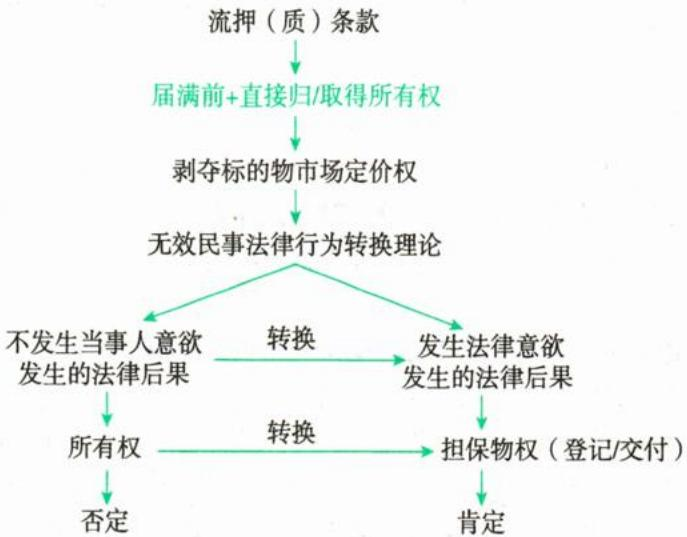

flowchart

```mermaid
graph TD
    A["流押（质）条款"] --> B["届满前+直接归/取得所有权"]
    B --> C["剥夺标的物市场定价权"]
    C --> D["无效民事法律行为转换理论"]
    D --> E["不发生当事人意欲发生的法律后果"]
    D --> F["发生法律意欲发生的法律后果"]
    E --> G["所有权"]
    G --> H["否定"]
    F --> I["担保物权（登记/交付）"]
    I --> J["肯定"]
    E --> K["转换"]
    F --> L["转换"]
```

(流押/质条款无效民事法律行为转换理论示意图)

1. “如孟某到期不能偿还借款，马某可以直接取得房屋所有权”的约定性质如何？答：流押条款。

2. “如孟某到期不能偿还借款，马某可以直接取得房屋所有权”的约定效力如何？答：无效。

3. 借款到期后，孟某不能偿还借款。马某是否有权就孟某的房屋行使优先受偿权？答：有权（包括拍卖、变卖和折价）。

[萌主点拨] 意定担保物权的流押（质）条款的本质是债权人权利滥用（剥夺标的物的市场定价权）。一言以蔽之，履行期限届满前，债权人与担保人约定债务人到期不还款的，标的物所有权“直接归债权人所有”，该条款属于过度担保，条款无效（变相的高利贷/但不影响其他条款的效力/《民法典》第156条）。

#### 五、意定担保物权的不可分性①（保护债权人利益）

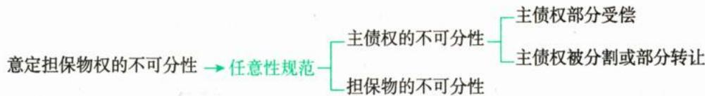

flowchart

```mermaid
graph LR
    A["意定担保物权的不可分性"] --> B["任意性规范"]
    B --> C["主债权的不可分性"]
    B --> D["担保物的不可分性"]
    C --> E["主债权部分受偿"]
    C --> F["主债权被分割或部分转让"]
```

(意定担保物权的不可分性的体系框架图)

意定担保物权的不可分性，旨在确保担保物权的安定性，保护债权人（担保物权人）的利益。该规定并非强制性规定，当事人可以约定排除（《民法典担保制度解释》第38、39条）。

#### (一) 含义

意定担保物权的不可分性，是指无论是担保物的分割还是主债权的分割，均不影响担保物权的效力。意定担保物权的不可分性主要涉及担保物权的效力是否因担保物或主债权的分割而贬损的问题。

[萌主点拨] 一言以蔽之，意定担保物权的不可分性的本质是主债权尚未清偿完毕，担保物一个都不能少。

#### (二) 类型

#### 1. 主债权的不可分性。

主债权的不可分性，是指当主债权被分割时，担保物仍及于分割后的各债权人，各债权人可以就其享有的份额行使担保物权。主要包括两种情形：

#### (1) 主债权部分受偿。

在主债权部分受偿的情况下，虽然已经受偿的债权已经消灭，但担保物的范围不作相应缩减，而是仍以全部的担保物担保剩余的债权。

[例] 甲公司向乙银行贷款（主债权/商业借款合同/诺成性合同）1000万元，期限1年。丙公司以10辆宝马轿车作抵押担保，办理了抵押登记手续。3月2日，甲公司向乙银行归还900万元。贷款到期后，甲公司无力归还剩余的100万元。乙银行有权就10辆宝马轿车行使抵押权（担保物权）。因为意定担保物权具有不可分性，主债权尚未清偿完毕，担保物一个都不能少。

#### (2) 主债权被分割或部分转让。

主债权被分割或部分转让时，担保物仍然为被分割或部分转让后的全部债权提供担保。各债权人主张就其享有的债权份额行使担保物权的，法院应予支持，但是法律另有规定或当事人另有约定的除外。

[例] 甲公司向乙银行贷款（主债权/商业借款合同/诺成性合同）1000万元，期限1年。丙公司以10辆宝马轿车作抵押担保，办理了抵押登记手续。3月2日，乙银行将200万元债权转让（内外有别+双重通知）给丁银行，并于当日通知了甲公司和丙公司。根据上述案情，请回答如下问题：

①贷款到期后，甲公司无力归还乙银行的800万元。乙银行有权就多少辆宝马轿车行使抵押权（担保物权）？

答：10 辆。因为意定担保物权具有不可分性，主债权尚未清偿完毕，担保物一个都不能少。

②贷款到期后，甲公司无力归还丁银行的200万元。丁银行有权就多少辆宝马轿车行使抵押权（担保物权）？

答：10 辆。因为意定担保物权具有不可分性，主债权尚未清偿完毕，担保物一个都不能少。

#### 2. 担保物的不可分性。

担保物的不可分性，是指当担保物被分割时，担保物权的效力仍然及于分割后的各部分，担保物权人可以就分割后的担保物行使担保物权。简言之，担保物的各部分担保债权的全部，即“担保物的不可分性”。因继承、合伙解散、企业分立等原因导致担保物被分割时，担保物权及于分割后的担保物。

[例] 甲公司向乙银行贷款（主债权/商业借款合同/诺成性合同）1000万元，期限1年。丙公司以10辆宝马轿车作抵押担保，办理了抵押登记手续。3月2日，丙公司分立为丁公司和戊公司（新设分立），各分得丙公司的5辆宝马轿车。贷款到期后，甲公司无力归还贷款。乙银行有权就丁公司和戊公司分得的宝马轿车行使抵押权（担保物权）。因为意定担保物权具有不可分性，主债权尚未清偿完毕，担保物一个都不能少。

#### 六、担保物权的物上代位性 $^{①}$ （保护债权人利益）

基于公平原则，为了强化（增强）担保物权担保功能（效力），保障担保物权人（债权人）的合法权益不因交换价值载体（担保物）的形态改变而使担保物权人（债权人）丧失支配力，许多国家和地区的法律皆确立了担保物权的物上代位性（物上代位权）。

#### (一) 含义

担保物权的物上代位性，是指担保物权的效力不仅及于担保物本身，且及于担保物的变异物、保险金、赔偿金、补偿金等代位物（《民法典》第390条和《民法典担保制度解释》第42条）。

[萌主点拨] 一言以蔽之，担保物权的物上代位性的本质是“生是我的担保物，被动死是我的代位物（三金）”。

#### (二) 内容

担保期间，担保财产毁损、灭失或被征收等，担保物权人可以就获得的保险金、赔偿金或补偿金等优先受偿；被担保债权的履行期限未届满的，也可以提存该保险金、赔偿金或补偿金等。

[例] 孟某向工商银行贷款（主债权）500万元用于（行为目的）购买房屋，并将房屋为工商银行办理了抵押登记手续。同时，应工商银行的要求为该房屋投保了火灾财产保险。根据上述案情及示意图，请回答如下问题：

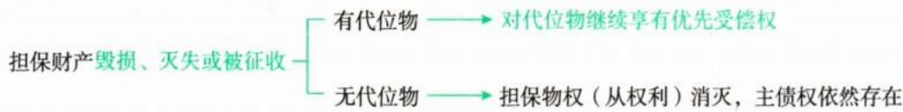

flowchart

```mermaid
graph TD
    A["担保财产毁损、灭失或被征收"] --> B["有代位物"]
    A --> C["无代位物"]
    B --> D["对代位物继续享有优先受偿权"]
    C --> E["担保物权（从权利）消灭，主债权依然存在"]
```

##### (担保物权的物上代位性法律关系示意图)

1. 孟某的房屋失火。保险公司赔偿孟某保险金200万元。请问：工商银行是否可以就该200万元主张优先受偿权？

答：有权。因为基于担保物权的物上代位性，担保物权人（债权人）工商银行可以就获得的保险金优先受偿。

2. 孟某的房屋被洪水冲毁。请问：债务人孟某是否应当继续履行债务？

答：应当继续履行债务。因为担保财产因不可抗力②毁损、灭失且无代位物的，担保物权（从权利）消灭，但主债权依然存在，基于诚信原则，债务人应当继续履行债务。

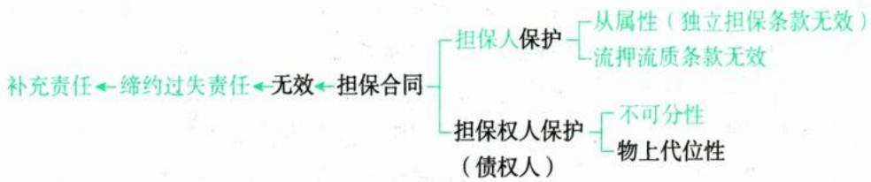

flowchart

```mermaid
graph TD
    A["补充责任"] --> B["缔约过失责任"]
    B --> C["无效"]
    C --> D["担保合同"]
    D --> E["担保人保护"]
    E --> F["从属性（独立担保条款无效）"]
    E --> G["流押流质条款无效"]
    D --> H["担保权人保护（债权人）"]
    H --> I["不可分性"]
    H --> J["物上代位性"]
```

(担保合同的体系框架图)

### 第二节 抵押权

#### 复习提要

抵押权，是指为担保债务的履行，债务人或第三人不转移财产的占有，将该财产抵押给债权人的，债务人不履行到期债务或发生当事人约定的实现抵押权的情形，债权人有权就该财产优先受偿。债务人或第三人为抵押人，债权人为抵押权人，提供担保的财产为抵押财产。抵押权系每年必考的知识点，须重点掌握。共涉及十一个问题，分别是：1. 抵押财产；2. 抵押权的设立；3. 动产浮动抵押权；4. 抵押权和租赁权的冲突解决；5. 抵押财产的转让；6. 抵押权的处分；7. 抵押权的顺位；8. 超级动产抵押权（购买价金担保权）；9. 抵押权的实现；10. 最高额抵押权；11. 借新还旧。

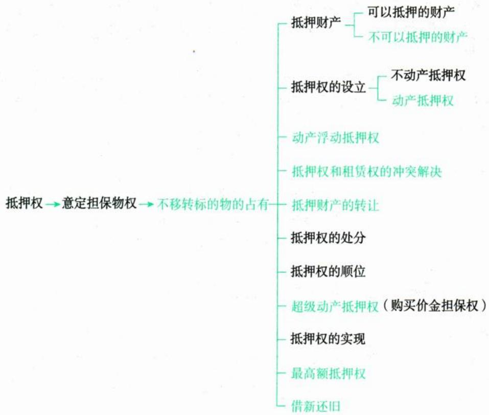

flowchart

```mermaid
graph TD
    A["抵押权"] --> B["意定担保物权"]
    B --> C["不移转标的物的占有"]
    C --> D["抵押财产"]
    D --> E["可以抵押的财产"]
    D --> F["不可以抵押的财产"]
    C --> G["抵押权的设立"]
    G --> H["不动产抵押权"]
    G --> I["动产抵押权"]
    C --> J["动产浮动抵押权"]
    C --> K["抵押权和租赁权的冲突解决"]
    C --> L["抵押财产的转让"]
    C --> M["抵押权的处分"]
    C --> N["抵押权的顺位"]
    C --> O["超级动产抵押权（购买价金担保权）"]
    C --> P["抵押权的实现"]
    C --> Q["最高额抵押权"]
    C --> R["借新还旧"]
```

#### 一、抵押财产①

#### (一) 可以抵押的财产

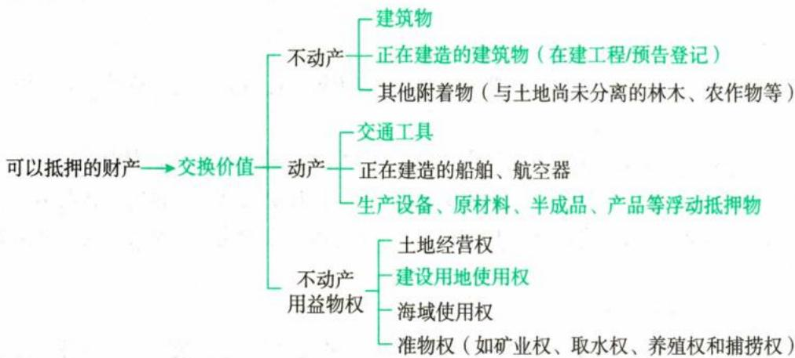

flowchart

```mermaid
graph TD
    A["可以抵押的财产"] --> B["交换价值"]
    B --> C["不动产"]
    C --> D["建筑物"]
    C --> E["正在建造的建筑物（在建工程/预告登记）"]
    C --> F["其他附着物（与土地尚未分离的林木、农作物等）"]
    B --> G["动产"]
    G --> H["交通工具"]
    G --> I["正在建造的船舶、航空器"]
    G --> J["生产设备、原材料、半成品、产品等浮动抵押物"]
    B --> K["不动产用益物权"]
    K --> L["土地经营权"]
    K --> M["建设用地使用权"]
    K --> N["海域使用权"]
    K --> O["准物权（如矿业权、取水权、养殖权和捕捞权）"]
```

(可以抵押的财产体系框架图)

可以抵押的财产包括三类，分别是不动产、动产和不动产用益物权。具体包括：债务人或第三人有权处分的下列财产：（1）建筑物和其他土地附着物；（2）建设用地使用权；（3）海域使用权；（4）生产设备、原材料、半成品、产品；（5）正在建造的建筑物、船舶、航空器；（6）交通运输工具；（7）法律、行政法规未禁止抵押的其他财产。抵押人可以将以上所列财产一并抵押（《民法典》第395条）。

#### (二) 不可以抵押的财产

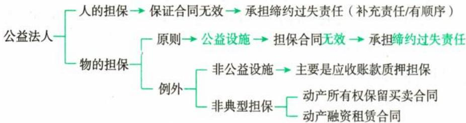

flowchart

```mermaid
graph TD
    A["公益法人"] --> B["人的担保"]
    A --> C["物的担保"]
    B --> D["保证合同无效"]
    D --> E["承担缔约过失责任（补充责任/有顺序）"]
    C --> F["原则"]
    F --> G["公益设施"]
    G --> H["担保合同无效"]
    H --> I["承担缔约过失责任"]
    C --> J["例外"]
    J --> K["非公益设施"]
    K --> L["主要是应收账款质押担保"]
    J --> M["非典型担保"]
    M --> N["动产所有权保留买卖合同"]
    M --> O["动产融资租赁合同"]
```

(公益法人提供担保体系框架图)

#### 1. 原则。

担保物权（包括抵押权、质押权和留置权）系价值权，债权人关注的是标的物的交换价值。因此，如果标的物没有价值，或无法交换（变现/流通），则不可以抵押。

#### (1) 土地所有权。

因我国土地所有权采公有制（只能归国家或集体），不具有流通性，绝对禁止抵押。当事人以土地所有权抵押的，抵押合同无效，抵押权不成立。

#### (2) 依法被查封、扣押、监管的财产。

①先抵押后查、扣、监。

基于成立在先原则，先抵押后查封、扣押、监管的，抵押权不受影响。

②先查、扣、监后抵押。

财产被查封、扣押、监管后又设立抵押权的，抵押合同合法有效。抵押权实现时：查封、扣押、监管措施尚未解除的，不予支持；查封、扣押、监管措施已经解除的，应予支持。

(3) 所有权、使用权不明或有争议的财产。

当事人以所有权、使用权不明或有争议的财产抵押，经审查构成无权处分的，法院应当依照善意取得的规定处理。

（4）学校、幼儿园、医疗机构等为公益目的成立的非营利法人的教育设施、医疗卫生设施和其他公益设施。公益法人，除学校、幼儿园、医疗机构外，还包括公共图书馆、科学技术馆、博物馆、国家美术馆、少年宫、工人文化馆、敬老院、残疾人福利基金会等公益法人。

(5) 违法、违章建筑。

以违法的建筑物抵押的，抵押合同无效，但是一审法庭辩论终结前已经办理合法手续的除外。当事人以建设用地使用权依法设立抵押，抵押人以土地上存在违法的建筑物为由主张抵押合同无效的，法院不予支持（《民法典担保制度解释》第49条）。

(6) 宅基地、自留地、自留山等集体所有土地的使用权，但是法律规定可以抵押的除外。因宅基地使用权具有福利性，不具有流通性，绝对禁止抵押。当事人以宅基地使用权抵押的，抵押合同无效，抵押权不成立。

2. 例外。

通过招标、拍卖、公开协商等方式承包农村土地，经依法登记取得权属证书的，可以依法采取出租、入股、抵押或其他方式流转土地经营权。

乡镇、村企业的建设用地使用权不得单独抵押。以乡镇、村企业的厂房等建筑物抵押的，其占用范围内的建设用地使用权一并抵押。

#### 二、抵押权的设立①

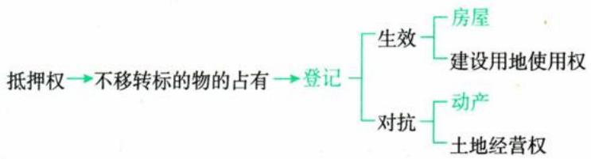

flowchart

```mermaid
graph TD
    A["抵押权"] --> B["不移转标的物的占有"]
    B --> C["登记"]
    C --> D["生效"]
    C --> E["对抗"]
    D --> F["房屋"]
    D --> G["建设用地使用权"]
    E --> H["动产"]
    E --> I["土地经营权"]
```

(抵押权的设立体系框架图)

#### (一) 抵押合同

抵押合同是抵押人（可能是债务人自己亦可能是债务人以外的第三人）与抵押权人（即债权人）之间签订的设立抵押权的合同。抵押财产的价值通常较高，为使当事人谨慎从事担保行为，设立抵押权当事人应当签订抵押合同。且抵押合同应当采用“书面形式”（要式合同/证据）。

#### (二) 不动产抵押权①

不动产抵押权→登记生效
房屋（书面有效抵押合同+登记）
土地/建设用地使用权（书面有效抵押合同+登记）
房屋和土地/建设用地使用权（书面有效抵押合同+登记）
（不动产抵押权体系框架图）

#### 1. 房地一并抵押。

由于房和地的不可分性，我国一向采“房随地走”“地随房走”的“房地一体”抵押规则。以建筑物抵押的，该建筑物占用范围内的建设用地使用权一并抵押。以建设用地使用权抵押的，该土地上的建筑物一并抵押。抵押人未一并抵押的，未抵押的财产视为一并抵押。“视为一并抵押”是法律拟制的“一并”，其意在权利人将房或地单独处分时，法律推定其对未约定的财产作出共同处分的意思表示，发生一并处分的法律后果（《民法典》第397条和《民法典担保制度解释》第51条）。

[例] 甲向乙银行贷款，以其别墅设定抵押权。之后，甲在别墅院内建造了独立车库。贷款到期，甲无力偿还。乙银行享有优先受偿权的财产包括别墅和建设用地使用权（房地一体主义）。

#### 2. 新增建筑物的处理②。

新增建筑物 → 不属于抵押财产
程序上 → 一并处分
实体上 → 无权优先受偿

(新增建筑物的处理法律关系示意图)

建设用地使用权抵押后，新增建筑物不属于抵押财产。因为抵押权设定时，新增建筑物与建设用地使用权不存在主从或依附关系，其范围应以抵押权设立时的客观存在为限。同时，建设用地使用权抵押时，该土地上新增的建筑物并不存在，双方当事人并无就未来新增建筑物设定抵押权的合意且如果建设用地使用权的抵押权的效力及于其设定后新增的建筑物，将增加抵押人的负担，破坏抵押人和抵押权人之间的利益平衡（《民法典》第417条和《民法典担保制度解释》第51条）。

基于房屋和土地在经济利用、使用价值上的不可分性，法律必须确保建筑物受让人取得合法、完整的土地使用权，“房”“地”之上的处分权不可择一行使。因此，该建设用地使用权实现抵押权时，应当将该土地上新增的建筑物与建设用地使用权一并处分（程序上）。但是，新增建筑物所得的价款，抵押权人无权优先受偿（实体上）。

#### >> 随堂练习

甲向乙借款 100 万元，同时又与乙签订了房屋抵押合同，约定如果甲到期不能偿还借款，乙可以取得房屋所有权，并作了抵押登记。借款到期后，甲不能偿还债务。对此，下列哪些说法是正确的？(2020 金题-2-1-14，多) $^{③}$

A. 双方关于乙取得房屋所有权的约定不发生相应效力
B. 乙可以请求拍卖房屋而从中优先受偿
C. 抵押合同因属虚假行为而无效
D. 抵押合同应认定有效

#### (三) 动产抵押权①

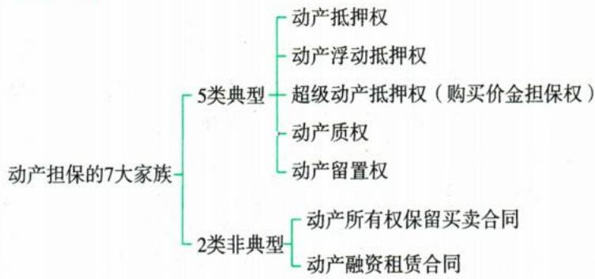

flowchart

```mermaid
graph TD
    A["动产担保的7大家族"] --> B["5类典型"]
    A --> C["2类非典型"]
    B --> D["动产抵押权"]
    B --> E["动产浮动抵押权"]
    B --> F["超级动产抵押权（购买价金担保权）"]
    B --> G["动产质权"]
    B --> H["动产留置权"]
    C --> I["动产所有权保留买卖合同"]
    C --> J["动产融资租赁合同"]
```

(动产担保的7大家族体系框架图)

动产抵押权采登记对抗主义，即动产抵押权是自抵押合同生效时设立，未经登记不得对抗善意第三人。

[萌主点拨] 书面有效合同=动产抵押权+登记>第三人（登记对抗主义）。

#### 三、动产浮动抵押权（商事抵押权） $^{②}$

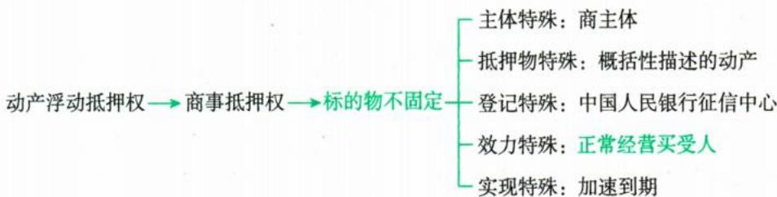

flowchart

```mermaid
graph LR
    A["动产浮动抵押权"] --> B["商事抵押权"]
    B --> C["标的物不固定"]
    C --> D["主体特殊：商主体"]
    C --> E["抵押物特殊：概括性描述的动产"]
    C --> F["登记特殊：中国人民银行征信中心"]
    C --> G["效力特殊：正常经营买受人"]
    C --> H["实现特殊：加速到期"]
```

(动产浮动抵押权体系框架图)

动产浮动抵押权制度，是为中小微企业提供融资平台而设立，系典型的商事制度。动产浮动抵押权和普通的动产抵押权的区别主要包括如下5个方面：

#### (一) 主体特殊

主体系商事主体，包括企业、个体工商户、农业生产经营者。

#### (二) 抵押物特殊

抵押物是现有及将有的生产设备、原材料、半成品、产品作为一个整体一并抵押（存量和增量一并抵押/抵押物不固定/动产担保的担保物可以进行概括性描述/《民法典担保制度解释》第53条）。

#### (三) 登记机构特殊

登记机构是中国人民银行征信中心。

#### (四) 效力特殊

为保障抵押人正常进行生产经营活动，抵押期间抵押人可以正常处分抵押财产。动产浮动抵押权自抵押合同生效时设立，未经登记不得对抗善意第三人。就算登记，也不得对抗正常经营活动中已经支付合理（合理的标准是交易时的市场价格）价款并取得抵押财产的买受人。

#### (五) 实现特殊

企业、个体工商户、农业生产经营者可以将现有的以及将有的生产设备、原材料、半成品、产品抵押，债务人不履行到期债务或发生当事人约定的实现抵押权的情形，债权人有权就抵押财产确定时的动产优先受偿。

抵押财产自下列情形之一发生时确定：（1）债务履行期限届满，债权未实现；（2）抵押人被宣告破产或解散清算；（3）当事人约定的实现抵押权的情形；（4）严重影响债权实现的其他情形。

[例] 2025 年 3 月 2 日, 献贵养殖场 (商事主体) 向工商银行申请贷款 (主合同) 2000 万元, 贷款期限 2 年, 将自己现有的及将有的生产设备、原材料、半成品、产品等一并抵押给工商银行并办理了抵押登记 (有内部效力有外部效力) 手续。献贵养殖场营业执照明确记载的经营范围包括活鸡、活鸭销售等。根据上述案情及示意图, 请回答如下问题:

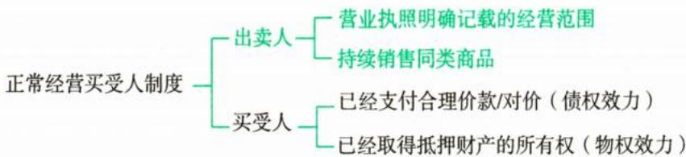

flowchart

```mermaid
graph TD
    A["正常经营买受人制度"] --> B["出卖人"]
    A --> C["买受人"]
    B --> D["营业执照明确记载的经营范围"]
    B --> E["持续销售同类商品"]
    C --> F["已经支付合理价款/对价（债权效力）"]
    C --> G["已经取得抵押财产的所有权（物权效力）"]
```

(正常经营买受人制度构成要件框架图)

①献贵养殖场可否将自己现有的及将有的生产设备、原材料、半成品、产品一并抵押给工商银行？

答：可以。献贵养殖场给工商银行设置的抵押权系动产浮动抵押权（《民法典》第396条）。

②献贵养殖场给工商银行设立动产浮动抵押权的登记机关为何？

答：中国人民银行征信中心。

③工商银行何时取得动产浮动抵押权？

答：抵押合同生效时（《民法典》第403条）。

④4月21日，献贵养殖场将存栏的养殖物2万只活鸡出售给乙肉联厂并交付。经查，乙肉联厂已经支付价款。工商银行可否将2万只活鸡追回？

答：不可以。因为动产浮动抵押权就算登记，也不得对抗正常经营活动中已经支付合理价款并取得抵押财产的买受人乙肉联厂（《民法典》第404条和《民法典担保制度解释》第56条）。

⑤4月21日，献贵养殖场将存栏的养殖物2万只活鸡出售给乙肉联厂并交付。经查，乙肉联厂已经支付价款2万元。请问：工商银行可否对该2万元行使物上代位权？

答：不可以。因为抵押人将抵押物转让所得的价款，不属于代位物范畴，抵押权人不得主张物上代位权（《民法典》第390条）。

⑥4月22日，献贵养殖场将自己仅有的一台生产设备出卖给乙公司并交付，工商银行可否将生产设备追回？

答：可以。因为乙公司并非正常经营买受人。

⑦5月10日，献贵养殖场被宣告破产，工商银行可否提前实现动产浮动抵押权？

答：可以（加速到期）。

#### 四、抵押权和租赁权的冲突解决①

《民法典》第 405 条和第 725 条共 2 个条文规定了抵押权和租赁权的冲突解决，确立了“公示在先原则”。

#### (一) 先租赁后抵押（先租后押）

抵押权设立前抵押财产已出租并转移占有的，原租赁关系不受该抵押权的影响，适用“抵押（买卖）不破租赁”规则，租赁合同对标的物的抵押权人和受让人继续有效。抵押权实现时，只要租赁合同还在合同有效期内，租赁合同对抵押物受让人继续有效，受让人取得的是有租赁权负担的抵押物。

#### (二) 先抵押后租赁 (先押后租)

已经登记的抵押权先于租赁权设立，适用“抵押（买卖）破租赁”规则，即抵押权实现时应当除去租赁权，依法保护抵押权人以及抵押物买受人的合法权益。

#### >> 随堂练习

甲以某商铺作抵押向乙银行借款，抵押权已登记，借款到期后甲未偿还。甲提前得知乙银行将起诉自己，在乙银行起诉前将该商铺出租给不知情的丙，预收了1年租金。半年后经乙银行请求，该商铺被法院委托拍卖，由丁竞买取得。下列哪一选项是正确的？(2017-3-8，单) $^{②}$

A. 甲与丙之间的租赁合同无效
B. 丁有权请求丙腾退商铺，丙有权要求丁退还剩余租金
C. 丁有权请求丙腾退商铺，丙无权要求丁退还剩余租金
D. 丙有权要求丁继续履行租赁合同

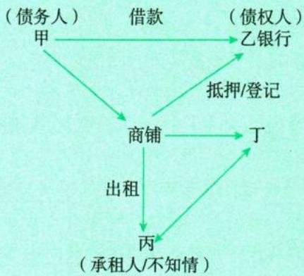

flowchart

```mermaid
graph TD
    甲["(债务人)"] -->|借款| 乙["乙银行"]
    甲 --> 商铺
    商铺 -->|抵押/登记| 乙
    商铺 --> 丁
    丁 --> 丙["(承租人/不知情)"]
    丙 -->|出租| 商铺
```

(当事人法律关系示意图)

#### 五、抵押财产的转让（带押过户）①

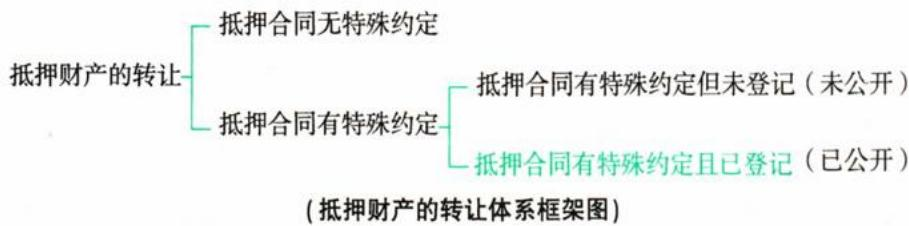

flowchart

```mermaid
graph TD
    A["抵押财产的转让"] --> B["抵押合同无特殊约定"]
    A --> C["抵押合同有特殊约定"]
    C --> D["抵押合同有特殊约定但未登记（未公开）"]
    C --> E["抵押合同有特殊约定且已登记（已公开）"]
```

#### (一) 抵押合同无特殊约定

随着我国不动产统一登记制度的建立以及动产登记制度的完善，抵押人转让抵押财产时抵押权人和抵押财产的买受人可能承担的风险大大降低，为了充分发挥物的效用，促进交易便捷，应当允许抵押人在抵押期间转让抵押财产并承担抵押权的追及效力。同时，应当允许当事人对抵押期间能否转让抵押财产另行约定，以平衡抵押人和抵押权人之间的利益，保护抵押权人为行使抵押权而作的预先安排，尊重当事人之间的意思自治（《民法典》第406条）。

[例] 2025年3月2日，孟某向马某借款（自然人之间的借款合同/实践性合同）850万元，借期1年，将自己的房屋抵押给马某并办理了抵押登记手续。根据上述案情及示意图，请回答如下问题：

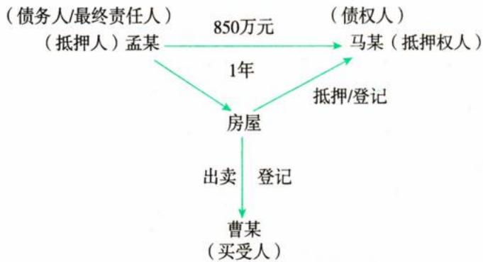

flowchart

```mermaid
graph TD
    A["(债务人/最终责任人)<br>(抵押人) 孟某"] -->|850万元| B["马某（抵押权人）"]
    A -->|1年| C["房屋"]
    C -->|出卖 登记| D["曹某<br>(买受人)"]
    B -->|抵押/登记| C
```

##### (抵押财产的转让当事人示意图)

(1) 抵押期间，孟某转让房屋是否需要征得马某的同意？

答：不需要。因为设定抵押权，仅是在物上设定了权利负担，抵押人孟某作为抵押财产的所有权人，有权自由转让房屋（《民法典》第406条）。

(2) 抵押期间，孟某将房屋出卖给曹某的行为是有权处分还是无权处分？

答：有权处分。

(3) 抵押期间，孟某将房屋出卖给曹某，二者签订的房屋买卖合同效力如何？

答：合法有效。

（4）抵押期间，孟某将房屋出卖给曹某，二者签订房屋买卖合同后，前往登记机构办理了过户登记手续。请问：曹某如何取得房屋所有权？

答：继受取得。

(5) 抵押期间，孟某将房屋出卖给曹某，是否应当及时通知债权人马某？

答：应当。基于诚信原则，抵押期间，抵押人转让抵押财产的，应当及时通知（性质上为附随义务）抵押权人。

（6）抵押期间，孟某将房屋出卖给曹某并办理了过户登记手续。抵押权人马某是否有权对曹某的房屋行使抵押权？

答：有权。因为抵押权具有追及效力，抵押财产转让的，抵押权不受影响。

（7）抵押期间，孟某将房屋出卖给曹某并办理了过户登记手续。抵押权人马某可否对转让的价款主张物上代位权？

答：不可以。因为抵押人将房屋转让所得的价款，不属于代位物范畴，抵押权人不得主张物上代位权（《民法典》第390条）。

（8）抵押期间，孟某将房屋出卖给曹某并办理了过户登记手续。如抵押权人马某能够证明抵押财产的转让可能损害抵押权的，是否可以请求抵押人孟某将转让所得的价款向抵押权人提前清偿债务或提存？

答：有权（加速到期）。

（9）抵押期间，孟某将房屋以1250万元出卖给曹某并办理了过户登记手续。同时，孟某将850万元全部向马某提前清偿完毕。房屋上的抵押权是否消灭？

答：消灭。因为基于担保物权消灭的从属性，主债权消灭的，从权利（担保物权）随之消灭。

（10）抵押期间，孟某将房屋以750万元出卖给曹某并办理了过户登记手续。同时，孟某将全部的750万元向马某提前清偿。房屋上的抵押权是否消灭？

答：不消灭。因为基于意定担保物权的不可分性，主债权尚未全部清偿完毕，担保物的范围并不作相应的缩减，而是仍以全部的抵押物担保剩余的100万元债权（《民法典担保制度解释》第38条）。

#### (二) 抵押合同有特殊约定

《民法典》第406条在允许抵押人自由转让抵押财产的同时，规定“当事人另有约定的，按照其约定”。由于不动产登记机构（自然资源部自然资源确权登记局）允许当事人之间的约定可以办理登记。因此，应区分该约定是否办理登记而异其效力：

1. 抵押合同有约定但未登记。

当事人约定禁止或限制转让抵押财产但是未将该约定登记，抵押人违反约定转让抵押财产，抵押权人请求确认转让合同无效的，法院不予支持；抵押财产已经交付或登记，抵押权人请求确认转让不发生物权效力的，法院不予支持，但是抵押权人有证据证明受让人知道的除外；抵押权人请求抵押人承担违约责任的，法院依法予以支持。

2. 抵押合同有约定且登记。

当事人约定禁止或限制转让抵押财产且已经将约定登记，抵押人违反约定转让抵押财产，抵押权人请求确认转让合同无效的，法院不予支持；抵押财产已经交付或登记，抵押权人主张转让不发生物权效力的，法院应予支持，但是因受让人代替债务人清偿债务导致抵押权消灭的除外。

[例] 2025年3月2日，孟某向马某借款（自然人之间的借款合同/实践性合同）850万元，借期1年，将自己的房屋抵押给马某并办理了抵押登记手续。双方在书面抵押合同中约定：“抵押期间，抵押人孟某禁止转让房屋”。根据上述案情及示意图，请回答如下问题：

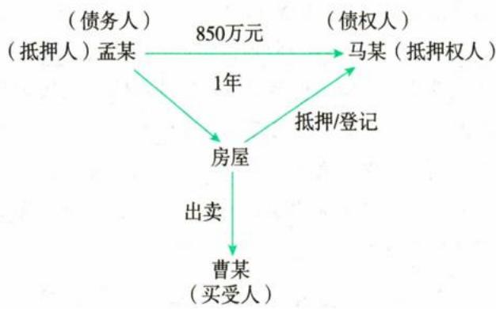

flowchart

```mermaid
graph TD
    A["(债务人)<br>(抵押人) 孟某"] -->|850万元| B["马某（抵押权人）"]
    A -->|1年| C["房屋"]
    B -->|抵押/登记| C
    C -->|出卖| D["曹某<br>(买受人)"]
```

(抵押财产的转让当事人示意图)

(1) 孟某和马某关于“抵押期间，抵押人孟某禁止转让房屋”的约定效力如何？

答：合法有效（有约从约/让与禁止的约定具有债权效力，但不一定具有物权效力）。

（2）如孟某和马某之间的抵押合同已经办理了登记（有内部效力有外部效力）。4月21日，孟某与曹某签订房屋买卖合同。

①孟某将房屋出卖给曹某的行为是有权处分还是无权处分？

答：有权处分。

②双方签订的房屋买卖合同效力如何？

答：合法有效。

③曹某可否取得房屋所有权？

答：不可以。因为登记机构拒绝办理过户登记手续。

④马某可否追究孟某的违约责任？

答：可以。因为孟某违反了和马某之间合法有效的书面房屋抵押合同。

⑤曹某欲获得房屋所有权，可以采取何种法律措施？

答：第三人实际代为履行（清偿）全部债权（涤除权）。曹某可以实际代替债务人孟某清偿850万元主债权，作为从权利的担保物权随之消灭，曹某继受取得房屋所有权（《民法典》第524条/《民法典合同编通则解释》第30条）。

#### 六、抵押权的处分①

#### (一) 转让

基于抵押权的从属性，抵押权不得与债权分离而单独转让或作为其他债权的担保。债权转让的，担保该债权的抵押权一并转让，但是法律另有规定或当事人另有约定的除外（《民法典》第407条）。

#### (二) 放弃①

由于抵押权属于抵押权人（债权人）的权利。因此，抵押权人（债权人）当然可以放弃抵押权。实质上来看，放弃抵押权，无非就是放弃了优先受偿权而已，债权人仍可以普通债权人（一般债权人）的身份享有债权。债务人以自己的财产设定抵押，抵押权人（债权人）放弃该抵押权的，其他担保人在抵押权人（债权人）丧失优先受偿权益的范围内免除担保责任，但是其他担保人承诺仍然提供担保的除外（《民法典》第409条）。

[例] 孟某向马某借款（主债权）1250万元，将自己价值850万元的房屋抵押给马某并办理了抵押登记手续。同时，曹某提供保证担保（曹某以自己的信用/信誉提供担保/全部财产/无限责任）。借款到期，孟某无力偿还借款。请问：如马某放弃债务人孟某提供的房屋抵押权，曹某如何承担责任？

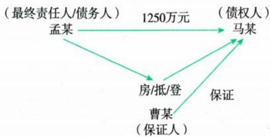

flowchart

```mermaid
graph TD
    A["孟某"] -->|1250万元| B["马某"]
    C["房/抵/登"] -->|保证| B
    D["曹某 (保证人)"] -->|保证| B
    E["(最终责任人/债务人)"] --> A
    F["(债权人)"] --> B
```

(抵押权的放弃当事人法律关系示意图)

答：原则上，曹某仅承担400万元的保证责任，除非曹某愿意承担1250万元的全部责任。因为债务人以自己的财产设定抵押，抵押权人马某（债权人）放弃该抵押权的，其他担保人在抵押权人丧失优先受偿权益的范围内免除担保责任，但是其他担保人承诺仍然提供担保的除外（《民法典》第409条）。

#### 七、抵押权的顺位 $^{②}$

《民法典》第414、415条共2个条文确立了抵押权的顺位问题。

抵押权的顺位，是指抵押人就同一财产设定两个或两个以上的抵押权时，各抵押权人之间优先受偿的先后顺序。

#### (一) 清偿顺位

同一财产向两个以上债权人抵押的，拍卖、变卖抵押财产所得的价款依照下列规定清偿：

1. 均登记的，基于登记在先原则，先登记的优先于后登记的。

2. 登记与未登记并存的，登记的优先于未登记的。

3. 均未登记的，同一顺序按比例清偿。

① 考查2次，抓住重点。

② 考查3次，常考点，重点关注。

##### 随堂练习

甲公司有一台价值200万元的大型车床，为经营需要，甲公司分别于5月7日、6月7日、7月7日向乙丙丁三家银行借款100万元、60万元、40万元，并分别在借款当日约定以该车床作抵押担保。乙银行的抵押权未登记，丙银行的抵押权于6月9日登记，且丙银行对乙银行的抵押权知情；丁银行抵押权于7月9日登记，但丁银行对乙银行的抵押权不知情。关于乙丙丁三家银行的抵押权顺位，下列判断正确的是？（2022金题-2-1-11，任）①

A. 乙银行的顺位先于非善意的丙银行
B. 丁银行顺位先于未登记的乙银行
C. 丙银行顺位先于未登记的乙银行
D. 丙银行顺位先于后登记的丁银行

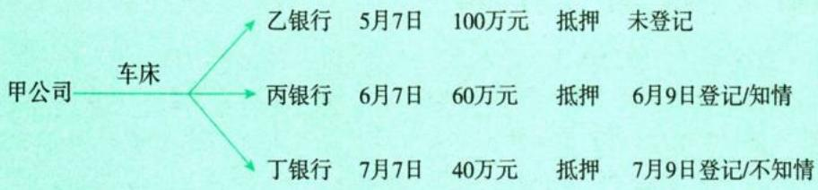

flowchart

```mermaid
graph TD
    A["甲公司"] --> B["车床"]
    B --> C["乙银行 5月7日 100万元 抵押 未登记"]
    B --> D["丙银行 6月7日 60万元 抵押 6月9日登记/知情"]
    B --> E["丁银行 7月7日 40万元 抵押 7月9日登记/不知情"]
```

(当事人法律关系示意图)

#### (二) 交换顺位 $^{2}$

抵押权人可以放弃抵押权或抵押权的顺位。抵押权人与抵押人可以协议变更抵押权顺位以及被担保的债权数额等内容。但是，抵押权的变更，未经其他抵押权人书面同意，不得对其他抵押权人产生不利影响。

#### （三）顺位升进和顺位保留 $^{③}$

#### 1. 原则。

顺位在先的抵押权因行使抵押权以外的原因而消灭时（如抵押担保的债权因清偿而消灭），顺位在后的抵押权顺位升进。

#### 2. 例外。

顺位在先的抵押权与该财产的所有权归属一人，即发生所有权与抵押权混同时，为保护所有权人的合法权益，不允许后顺位抵押权人升进（即顺位保留）。如果根据抵押权顺位升进主义，使后顺位抵押权人成为第一顺位抵押权人，则意味着顺位在先的抵押权人将因为购买抵押财产而使原本处于第一顺位的所有权沦为第二顺位，对其显然不公平。

#### 八、超级动产抵押权（购买价金担保权） $^{①}$

《民法典》第416条和《民法典担保制度解释》第57条共2条确立了超级动产抵押权制度。

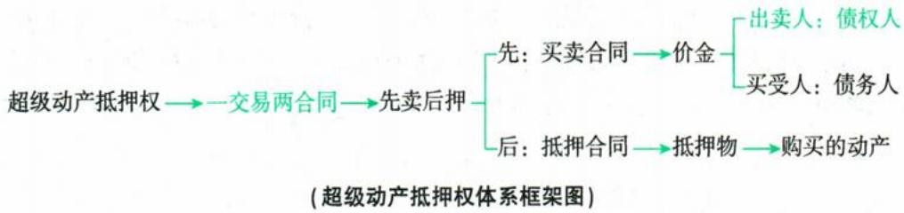

flowchart

```mermaid
graph TD
    A["超级动产抵押权"] --> B["一交易两合同"]
    B --> C["先卖后押"]
    C --> D["先：买卖合同"]
    D --> E["价金"]
    E --> F["出卖人：债权人"]
    E --> G["买受人：债务人"]
    C --> H["后：抵押合同"]
    H --> I["抵押物"]
    I --> J["购买的动产"]
```

#### (一) 含义

购买价金担保权（超级动产抵押权），又称购置款担保权、价金超级优先权，比较法上多称为“purchase money security interest”（PMSI），是指债权人在动产之上取得的担保因购买该动产所生的价金给付义务的担保权。

[萌主点拨] 超级动产抵押权的本质是一交易两合同（先卖后押），是一个“顺序/排序”问题，基础法律关系是“动产买卖合同”，立法目的系保护动产买卖合同中的出卖人。动产交付后10日内登记保护出卖人（后登记者优先/《民法典》第416条），动产交付后10日外登记保护其他债权人（先登记者优先/《民法典》第414条）。

#### (二) 特征

担保的主债权是标的物的购买价金。只要在交付后10日内进行购买价金抵押权的登记，该购买价金担保权便具有“超级优先权”，亦即该购买价金担保权优先于其他登记在前的担保物权，即购买价金担保权在规定的10日宽限期内进行登记便能获得优先于动产浮动抵押权的优先顺位。

#### (三) 优先顺位

购买价金担保权的超级优先顺位奉行“后登记者优先”，通过对比购买价金担保权（超级动产抵押权）与留置权，会发现二者具有一定的类似性：以承揽合同中承揽人的留置权为例，法律之所以赋予留置权高于抵押权和质押权的效力，是因为债权人的行为导致留置财产价值得到恢复或增加，且债权人仅因恢复或增加留置财产价值而发生的债权对留置财产享有优先受偿权。

[例] 2025年1月1日，众森公司和徐工集团签订一份铲车买卖合同，价款200万元。徐工集团于1月2日将铲车交付给众森公司。为担保价款的履行，1月3日双方签订书面铲车抵押合同，众森公司将所购铲车抵押给徐工集团并于1月4日办理了抵押登记手续。经查，1月2日下午，众森公司将该铲车抵押给工商银行贷款100万元并于当日办理了抵押登记手续。1月3日，众森公司将铲车再次抵押给农业银行贷款100万元并于当日办理了抵押登记手续。根据上述案情及示意图，请回答如下问题：

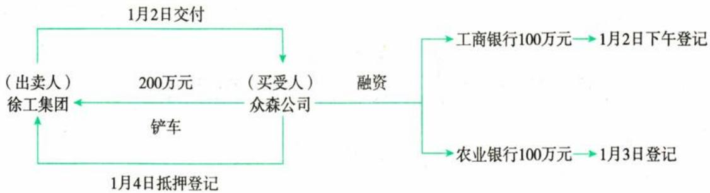

flowchart

```mermaid
graph TD
    A["徐工集团"] -->|1月2日交付| B(买受人)
    B -->|融资| C["众森公司"]
    C -->|1月4日抵押登记| A
    B -->|200万元| A
    C -->|工商银行100万元| D["工商银行100万元"]
    C -->|农业银行100万元| E["农业银行100万元"]
    D --> F["1月2日下午登记"]
    E --> G["1月3日登记"]
```

(超级动产抵押权当事人法律关系示意图)

(1) 众森公司何时取得铲车的所有权?

答：1月2日。因为动产物权变动依交付。

(2) 工商银行的抵押权、农业银行的抵押权和徐工集团的抵押权三者如何排序?

答：徐工集团>工商银行>农业银行（《民法典》第416条）。

（3）如徐工集团的抵押权于1月14日登记，工商银行的抵押权、农业银行的抵押权和徐工集团的抵押权三者如何排序？

答：工商银行>农业银行>徐工集团（《民法典》第414条）。

#### 九、抵押权的实现①

基于担保物权的从属性，将担保物权的存续期间与主债权诉讼时效挂钩。抵押权与其他担保物权最大的区别在于：抵押权的设立无需移转抵押物的占有，抵押物依然为抵押人所占有。因此，抵押权人（即债权人）的行权须及时。抵押权人应当在主债权诉讼时效期间（可变期间）行使抵押权；未行使的，法院不予保护（《民法典》第419条和《民法典担保制度解释》第44条）。

[萌主点拨] 抵押权属于支配权，并非请求权的范围，更非债权请求权的范围，如将抵押权纳入诉讼时效的规制范围，无疑有违民法原理。抵押权本无期间限制，该规定只是基于抵押权的从属性而就主债权诉讼时效期间届满对抵押权的影响，并不是抵押权消灭的情形。对于《民法典》第419条，理论界和实务界有三种观点，分别是：（1）胜诉权消灭说；（2）时效抗辩权发生说；（3）抵押权消灭说。2021年1月1日生效实施的《民法典担保制度解释》第44条采“时效抗辩权发生说”。

#### 十、最高额抵押权②

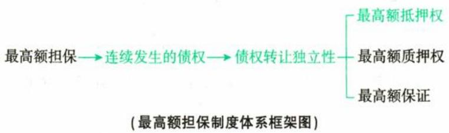

flowchart

```mermaid
graph LR
    A["最高额担保"] --> B["连续发生的债权"]
    B --> C["债权转让独立性"]
    C --> D["最高额抵押权"]
    C --> E["最高额质押权"]
    C --> F["最高额保证"]
```

#### (一) 含义

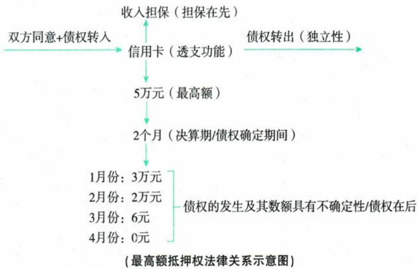

flowchart

```mermaid
graph TD
    A["双方同意+债权转入"] --> B["收入担保（担保在先）"]
    B --> C["信用卡（透支功能）"]
    C --> D["5万元（最高额）"]
    D --> E["2个月（决算期/债权确定期间）"]
    E --> F["1月份：3万元"]
    E --> G["2月份：2万元"]
    E --> H["3月份：6元"]
    E --> I["4月份：0元"]
    J["债权转出（独立性）"] --> K["债权的发生及其数额具有不确定性/债权在后"]
    style A fill:#f9f,stroke:#333
    style B fill:#ccf,stroke:#333
    style C fill:#cfc,stroke:#333
    style D fill:#fcc,stroke:#333
    style E fill:#cff,stroke:#333
    style F fill:#ffc,stroke:#333
    style G fill:#ffc,stroke:#333
    style H fill:#ffc,stroke:#333
    style I fill:#ffc,stroke:#333
    style J fill:#fff,stroke:#333
```

为担保债务的履行，债务人或第三人对一定期间内将要连续发生的债权提供担保财产的，债务人不履行到期债务或发生当事人约定的实现抵押权的情形，抵押权人有权在最高债权额限度内就该担保财产优先受偿。最高额质押、最高额保证参照适用最高额抵押权的有关规定。

[萌主点拨] 最高额担保的本质是“信用卡/连续债权一次担保”。即一次授信一定额度（最高额）；N年（债权确定期间/决算期）有效；随借随还；随便转入、随便转出（《民法典》第420—424条）。

#### (二) 特征

抵押合同成立在前，主债权合同成立在后。即从合同成立在前，主合同成立在后。对约定期间内将要发生的债权进行担保，担保的主债权的发生及其数额具有不确定性。

#### (三) 效力

最高额抵押权设立前已经存在的债权，经当事人同意，可以转入最高额抵押担保的债权范围。最高额抵押担保的债权确定前，部分债权转让的，最高额抵押权不得转让，但是当事人另有约定的除外。最高额抵押权实现时，若实际发生的债权余额高于最高限额的，以最高额为限优先受偿，超过部分为一般债权；若实际发生的债权余额低于最高限额的，以实际发生的债权为限优先受偿。

#### (四) 变更

最高额抵押担保的债权确定前，抵押权人与抵押人可以通过协议变更债权确定的期间、债权范围以及最高债权额，但是，变更的内容不得对其他抵押权人产生不利影响。

#### (五) 债权确定

有下列情形之一的，抵押权人的债权确定：（1）约定的债权确定期间届满；（2）法定的债权确定期间届满；抵押权人或抵押人自最高额抵押权设立之日起满2年后请求确定债权的；（3）新的债权不可能发生；（4）抵押权人知道或应当知道抵押财产被查封、扣押；（5）债务人、抵押人被宣告破产或解散清算。

[例] 2024年1月5日，众森公司为了（行为目的）开发幸福小区项目以280亿人民币拍得（有偿）某地块的建设用地使用权（不动产用益物权/只能抵押）。2月2日，众森公司向工商银行贷款（主债权/债权效力），以该块地的建设用地使用权在200亿元（最高额）的额度范围内为众森公司在未来2年内（债权确定期间/决算期）将连续发生的贷款（主债权浮动）提供最高额抵押担保，并于次日办理了抵押登记手续（最高额抵押权成立/物权效力）。根据上述案情及示意图，请回答如下问题：

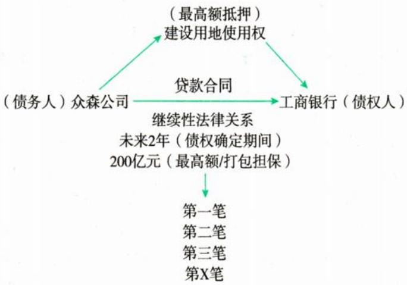

flowchart

```mermaid
graph TD
    A["(债务人) 众森公司"] -->|贷款合同| B["工商银行（债权人）"]
    B -->|贷款合同| A
    A -->|建设用地使用权| C["(最高额抵押)"]
    B -->|继续性法律关系| D["未来2年（债权确定期间）\n200亿元（最高额/打包担保）"]
    D --> E["第一笔\n第二笔\n第三笔\n第X笔"]
```

##### (最高额抵押权当事人法律关系示意图)

（1）2024年3月2日，众森公司和工商银行签订一份协议，约定：“将2024年之前众森公司欠工商银行的共计2000万元到期债权转入最高额抵押担保的债权范围。”请问：该协议效力如何？为什么？

答：合法有效。因为最高额抵押权设立前已经存在的债权，经当事人同意，可以转入最高额抵押担保的债权范围。

本案中，建设用地使用权的最高额抵押权于2024年2月3日设立，众森公司与工商银行同意将2024年之前的债权转入最高额抵押担保的范围。因此，该协议合法有效。

(2) 2024年2月至7月, 工商银行共向众森公司放款1.2亿元。8月16日, 工商银行将其中的8000万元债权转让 (债权转出) 给农业银行。请问: 如众森公司到期无力偿还该8000万元债权, 农业银行是否有权拍卖建设用地使用权优先受偿? 为什么?

答：无权。因为最高额抵押担保的债权确定前，部分债权转让的，最高额抵押权不得转让，但当事人另有约定的除外（《民法典》第421条）。

本案中，在最高额抵押权确定前，工商银行将8000万元债权转让给农业银行且当事人并未进行特别约定。因此，农业银行无权对建设用地使用权拍卖优先受偿。

（3）2024年2月至7月，工商银行共向众森公司放款1.2亿元。8月16日，工商银行将1.2亿元债权转让（债权转出）给农业银行。请问：如众森公司到期无力偿还该1.2亿元债权，农业银行是否有权拍卖建设用地使用权优先受偿？为什么？

答：无权。因为最高额抵押担保的债权确定前，部分债权转让的，最高额抵押权不得转让，但当事人另有约定的除外。

本案中，在最高额抵押权确定前，工商银行将1.2亿元债权转让给农业银行且当事人并未进行特别约定。因此，农业银行无权对建设用地使用权拍卖优先受偿。

[萌主点拨] 最高额抵押权并不随某一具体债权的转让而转让，只能随基础法律关系一同转让。之所以如此，是因为最高额抵押权所担保的债权是连续发生的债权，在最高额抵押权没有确定时，债权总额是不确定的，是随时发生变化的。尽管某一具体债权转让了，但将来还有发生债权的可能。

（4）2025年4月21日，众森公司的幸福小区项目提前完工且经验收合格。经结算，工商银行共向众森公司放贷280亿元。但此时因众森公司经营管理问题无力还款，工商银行欲行使优先受偿权。请问：工商银行优先受偿的数额为多少？为什么？

答：200 亿元。因为为担保债务的履行，债务人对一定期间内将要连续发生的债权提供担保财产的，债务人不履行到期债务，抵押权人有权在最高债权额限度内就该担保财产优先受偿。

本案中，众森公司到期无力还款且实际发生的债权余额280亿元高于最高额200亿元。因此，应以最高额为限（即200亿元范围内）优先受偿，超出的80亿元转为普通债权（一般债权/无担保的债权）。

（5）2025年4月21日，众森公司的幸福小区项目提前完工且经验收合格。经结算，工商银行共向众森公司放贷200亿元。但此时因众森公司经营管理问题无力还款，工商银行欲行使优先受偿权。请问：工商银行优先受偿的数额为多少？为什么？

答：200 亿元。因为为担保债务的履行，债务人对一定期间内将要连续发生的债权提供担保财产的，债务人不履行到期债务，抵押权人有权在最高债权额限度内就该担保财产优先受偿。

本案中，众森公司到期无力还款且实际发生的债权余额200亿元等于最高额200亿元。因此，应以最高额为限，即200亿元范围内优先受偿。

（6）2025年4月21日，众森公司的幸福小区项目提前完工且经验收合格。经结算，工商银行共向众森公司放贷180亿元。但此时因众森公司经营管理问题无力还款，工商银行欲行使优先受偿权。请问：工商银行优先受偿的数额为多少？为什么？

答：180 亿元。因为为担保债务的履行，债务人对一定期间内将要连续发生的债权提供担保财产的，债务人不履行到期债务，抵押权人有权在最高债权额限度内就该担保财产优先受偿。

本案中，众森公司到期无力还款且实际发生的债权余额180亿元低于最高额200亿元。因此，应以实际发生的债权（即180亿元）优先受偿。

（7）2024年11月10日，因众森公司资不抵债而被天津市第二中级人民法院宣告破产。请问：工商银行的债权是否立即确定？为什么？

答：确定（加速到期）。因为债务人、抵押人被宣告破产的，抵押权人的债权确定。本案中，2024年11月10日，众森公司被法院宣告破产。因此，工商银行的债权依法立即确定。

(8) 工商银行的抵押权期间为多久?

答：主债权的诉讼时效期间（3年/《民法典》第419条）。

#### 十一、借新还旧①

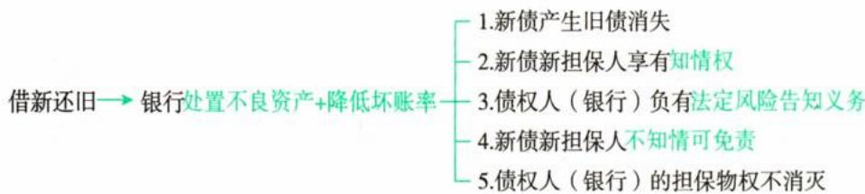

flowchart

```mermaid
graph TD
    A["借新还旧"] --> B["银行处置不良资产+降低坏账率"]
    B --> C1["1. 新债产生旧债消失"]
    B --> C2["2. 新债新担保人享有知情权"]
    B --> C3["3. 债权人（银行）负有法定风险告知义务"]
    B --> C4["4. 新债新担保人不知情可免责"]
    B --> C5["5. 债权人（银行）的担保物权不消灭"]
```

(借新还旧体系框架图)

借新还旧是银行处置不良资产、降低坏账率的手段。债务人企业因不具备偿债能力而“拆东墙补西墙”。因此，新债新的担保人必须知悉“借新还旧”的事实。如债权人未履行法定风险告知义务，则新债新的担保人有权基于受欺诈而撤销担保合同，担保合同自始无效，担保人无需承担任何责任。

[例] 2024年2月12日，众森公司向工商银行贷款2000万元，期限1年。众森公司的全资子公司（只有一个股东的公司/关联关系/无需决议/母公司对全资子公司过度支配和控制/人格否认连带责任）海马公司以其办公楼为该笔贷款提供抵押担保并办理了抵押登记手续。到期众森公司不能还款，2025年3月2日，众森公司和工商银行签订了一份借新还旧合同（无名合同/非典型合同），众森公司再向工商银行贷款2000万元以偿还之前的2000万元债务。海马公司答应为新债继续提供担保。同时，众森公司找到佳茵公司为新债提供保证担保（人保/全部财产/无限责任），佳茵公司对借新还旧的事实并不知情。经查，2025年4月21日，海马公司向海螺公司借款（民间借贷合同）1000万元，以同一栋办公楼为海螺公司的贷款提供抵押担保并办理了抵押登记手续。根据上述案情及示意图，请回答如下问题：

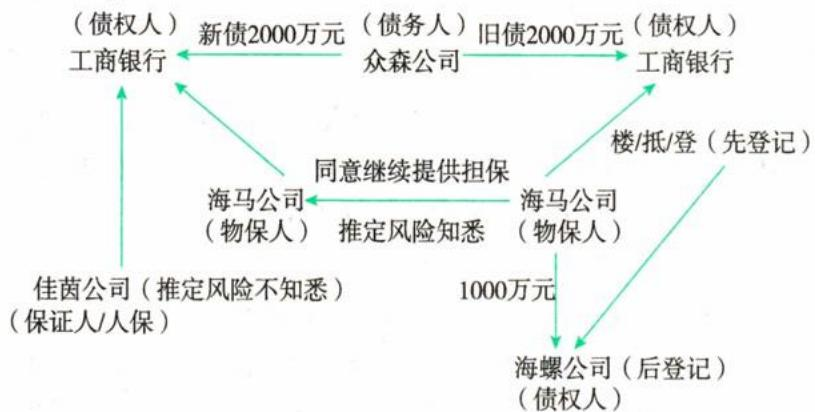

flowchart

```mermaid
graph TD
    A["(债权人) 工商银行"] -->|新债2000万元| B["(债务人) 众森公司"]
    B -->|旧债2000万元| C["(债权人) 工商银行"]
    D["佳茵公司 (推定风险不知悉) (保证人/人保)"] --> E["海马公司 (物保人)"]
    E -->|同意继续提供担保 推定风险知悉| F["海马公司 (物保人)"]
    F -->|1000万元| G["海螺公司 (后登记) (债权人)"]
    G --> H["楼/抵/登 (先登记)"]
    H --> I["新债2000万元"]
    I --> A
```

(借新还旧当事人法律关系示意图)

(1) 借新还旧的合同效力如何?

答：合法有效。因为完全符合《民法典》第143条的有效要件。

(2) 众森公司和工商银行仅签订借新还旧合同并未实际还款，旧债的担保是否消灭？

答：消灭。因为基于担保物权消灭的从属性，主债权消灭，从权利随之消灭。

(3) 海马公司是否应当继续承担担保责任?

答：应当。因为海马公司同意继续为新债提供担保。

（4）佳茵公司是否有权基于欺诈而主张撤销保证合同，拒绝承担保证责任？

答：有权。因为债权人工商银行未履行法定风险告知义务构成欺诈，受欺诈方佳茵公司有权主张撤销保证合同（《民法典》第148条）。

(5) 佳茵公司是否有权拒绝承担保证责任?

答：有权。因为主合同有效，担保合同因撤销而自始无效，担保人无过错，无需承担任何责任（《民法典担保制度解释》第17条）。

(6) 对于海马公司的办公楼，工商银行的抵押权和海螺公司的抵押权何者效力优先？

答：工商银行。因为工商银行登记在先（顺位保留/未完成登记簿注销登记/存在权利外观/商事外观主义）。

#### (一) 含义

借新还旧，或称以贷还贷，是指债权人（银行等金融机构）与债务人在旧贷未清偿等情况下，签订新贷款合同，以新贷款偿还全部或部分旧贷款等行为。实践中，一些金融机构为了清收陈年旧贷，常采“借新还旧”的办法。

#### (二)旧贷消灭、新贷产生

旧贷已经因借新还旧合同的签订而消灭，即主债权已经消灭，基于担保消灭上的从属性，其上的担保随之消灭。此时，担保人有权请求登记机关“涂销登记（注销登记）”，贷款人（即债权人/金融机构）以旧贷上的担保物权尚未进行涂销登记为由，请求旧贷的担保人对新贷承担担保责任的，人民法院不予支持。

在借新还旧的情形下，旧贷消灭，新贷产生，而并没有将其解释为“旧贷的展期”或“主合同变更”。立法目的主要是保护担保人的利益，尤其是新贷与旧贷的担保人不同时的新贷担保人的利益。

#### （三）新贷与旧贷的担保人相同时担保责任的承担

如果新贷与旧贷的担保人相同时，担保人承担担保责任不以知道或应当知道“借新还旧”为要件，即使担保人不知道，亦应继续承担担保责任。当然，如果加重了担保责任，必须征得担保人的书面同意，否则对加重的部分不承担担保责任。

#### （四）新贷与旧贷的担保人不同时担保责任的承担

如果新贷与旧贷的担保人不同时，债权人必须证明新贷的担保人对借新还旧的事实知道或应当知道时，才能请求其承担担保责任，否则新贷的担保人不承担担保责任。同理可知，在旧贷无担保而新贷有担保时，债权人仅在证明新贷的担保人知道或应当知道借新还旧的事实时，担保人才承担担保责任。

#### （五）旧贷上尚未注销登记的物的担保的效力延伸

在借新还旧的情形下，旧贷上物的担保尚未注销登记的，债权人不得主张对新贷行使该物的担保，除非当事人约定或物的担保人同意继续为新贷提供担保。只要抵押人同意继续为新贷提供担保，不要求重新办理抵押登记，旧贷上的抵押权即可自动担保新贷债权。

在新贷合同签订前，担保人以该财产为其他债权人设立担保物权，新贷债权人可以主张旧贷上物的担保效力延伸至新贷，而且新贷担保物权的顺位溯及旧贷上物的担保成立之时。

### 第三节 质权

#### 复习提要

质权，规定在《民法典》第二编物权第四分编第十八章（第425—446条），共22条。本节主要涉及四个问题：1. 静态动产质押权；2. 动态动产质押权（《民法典担保制度解释》第55条）；3. 权利质权；4. 转质，包括承诺转质和责任转质。其中，动态动产质押权系新增制度，备考时必须重点掌握。权利质权是重点和难点，在备考中应重点予以关注。

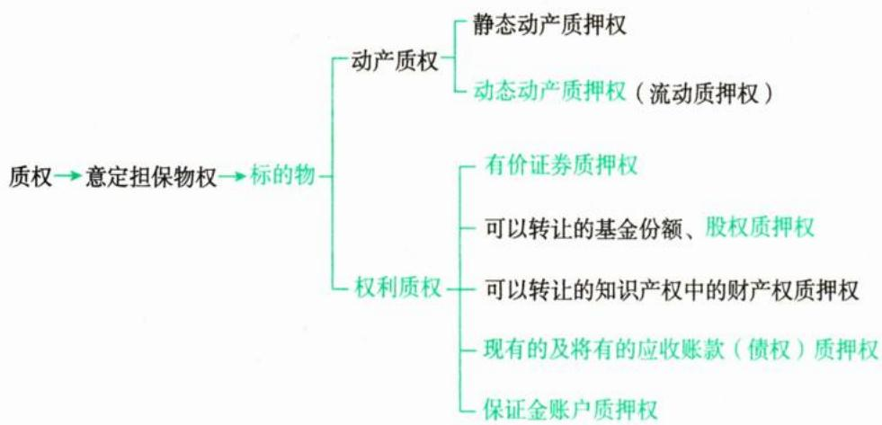

flowchart

```mermaid
graph TD
    A["质权"] --> B["意定担保物权"]
    B --> C["标的物"]
    C --> D["动产质权"]
    D --> E["静态动产质押权"]
    D --> F["动态动产质押权（流动质押权）"]
    C --> G["权利质权"]
    G --> H["有价证券质押权"]
    G --> I["可以转让的基金份额、股权质押权"]
    G --> J["可以转让的知识产权中的财产权质押权"]
    G --> K["现有的及将有的应收账款（债权）质押权"]
    G --> L["保证金账户质押权"]
```

#### 一、静态动产质押权①

#### (一) 质权设立

《民法典》第425—439条和《民法典担保制度解释》第55条共16条确立了动产质权制度。

#### 1. 质押合同。

设立质权，当事人应当采用书面形式订立质押合同（要式合同）；除法定或约定外，自双方在合同书上签章，即成立并生效。质押合同生效后，质权人有权请求出质人依约交付质物，出质人不交付的，应当基于合法有效的质押合同承担违约责任。

#### 2. 质押权。

动产质权采 “公示生效主义”，以移转标的物的占有为成立要件。动产质权自出质人交付质押财产时设立。

[萌主点拨] 书面有效质押合同+交付（移转占有）=动产质权。

[例] 甲为担保对乙的债务，于2023年3月1日与乙签订质押合同，承诺将自己的越野车质押给乙。同年4月1日甲交付越野车，但未将随车工具箱交付给乙。质押合同于3月1日生效；质押权于4月1日取得。

#### 3. 关于交付。

当事人不得约定不交付标的物，约定的，因违反法律的强制性规定而无效。约定的出质财产与实际移交的财产不一致的，以实际交付占有的财产为准。

只能是现实交付、简易交付和指示交付而不能是占有改定，实践中的表现形式为约定由出质人或出质人的代理人代为占有质押财产，此时质权不生效。不能采用占有改定方式交付的原因有二：其一，无法公示质权的存在，害及交易安全；其二，出质人仍直接占有质押财产，质权人无法行使对质押财产的留置权利，使质权实际上丧失留置的效力。

质权人将质物返还于出质人后，不得以其质权对抗第三人。因不可归责于质权人的事由而丧失对质物的占有，质权人可以向不当占有人请求停止侵害、恢复原状、返还原物。如质物因遗失、被盗、被侵夺或其他情形，质权人已失去事实上的管领力，如不能请求返还，动产质权自应消灭。但是，质权人虽丧失占有，但在能依物上请求权请求返还时，质权仍不消灭。

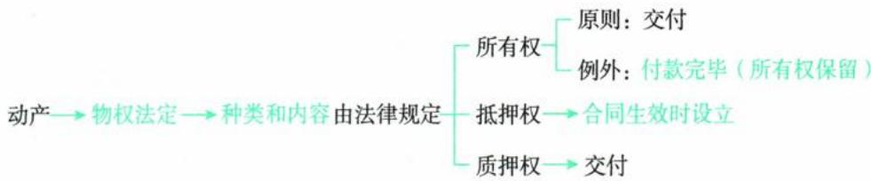

flowchart

```mermaid
graph TD
    A["动产"] --> B["物权法定"]
    B --> C["种类和内容 由法律规定"]
    C --> D["所有权"]
    D --> E["原则：交付"]
    D --> F["例外：付款完毕（所有权保留）"]
    C --> G["抵押权"]
    G --> H["合同生效时设立"]
    C --> I["质押权"]
    I --> J["交付"]
```

(动产物权法定规则体系框架图)

#### (二) 质权人的权利和义务①

#### 1. 质权人的权利。

#### (1) 摚息收取权。

除合同另有约定外，质权人享有质押财产的孳息收取权且孳息应当先充抵收取孳息的费用。

[萌主点拨] 质权人享有的是孳息收取权而非孳息的所有权，孳息的所有权依然归出质人所有。

孳息收取权

<table><tr><td>项目</td><td>抵押权</td><td>质押权</td></tr><tr><td>法律依据</td><td>《民法典》第412条</td><td>《民法典》第430条</td></tr><tr><td>具体内容</td><td>债务人不履行到期债务或发生当事人约定的实现抵押权的情形,致使抵押财产被法院依法扣押的,自扣押之日起,抵押权人有权收取该抵押财产的天然孳息或法定孳息,但是抵押权人未通知应当清偿法定孳息义务人的除外。前款规定的孳息应当先充抵收取孳息的费用</td><td>质权人有权收取质押财产的孳息,但是合同另有约定的除外。前款规定的孳息应当先充抵收取孳息的费用</td></tr></table>

#### (2) 处分权。

质权人可以放弃质权。债务人以自己的财产出质，质权人放弃该质权的，其他担保人在质权人丧失优先受偿权益的范围内免除担保责任，但其他担保人承诺仍然提供担保的除外。

[萌主点拨] 质押权的放弃和抵押权的放弃法律效果相同。

#### 2. 质权人的义务。

#### (1) 妥善保管。

质权人负有妥善保管质押财产的义务；因保管不善致使质押财产毁损、灭失的，应当承担赔偿责任；质权人的行为可能使质押财产毁损、灭失的，出质人可以请求质权人将质押财产提存，或请求提前清偿债务并返还质押财产。

#### (2) 及时行权。

出质人可以请求质权人在债务履行期届满后及时行使质权；质权人不行使的，出质人可以请求法院拍卖、变卖质押财产。出质人请求质权人及时行使质权，因质权人怠于行使权利造成出质人损害的，由质权人承担赔偿责任。

[萌主点拨] 质押财产存在意外毁损、灭失以及随着市场的变化价值下跌的风险。

#### (3) 质物或余款返还。

债务人履行债务或出质人提前清偿所担保的债权的，质权人应当返还质押财产；质押财产折价或拍卖、变卖后，其价款超过债权数额的部分归出质人所有。

##### 随堂练习

2016年3月3日，甲向乙借款10万元，约定还款日期为2017年3月3日。借款当日，甲将自己饲养的市值5万元的名贵宠物鹦鹉质押交付给乙，作为债务到期不履行的担保；另外，第三人丙提供了连带责任保证。关于乙的质权，下列哪些说法是正确的？(2017-3-56，多) $^{①}$

A. 2016年5月5日，鹦鹉产蛋一枚，市值2000元，应交由甲处置

B. 因乙照管不善，2016年10月1日鹦鹉死亡，乙需承担赔偿责任

C. 2017年4月4日，甲未偿还借款，乙未实现质权，则甲可请求乙及时行使质权

D. 乙可放弃该质权，丙可在乙丧失质权的范围内免除相应的保证责任

#### 二、动态动产质押权（流动质押权/动产浮动质押权）

债权人、出质人与监管人订立三方协议，出质人以通过一定数量、品种等概括描述能够确定范围的货物为债务的履行提供担保，当事人有证据证明监管人系受债权人的委托监管并实际控制该货物的，法院应当认定质权于监管人实际控制货物之日起设立。监管人违反约定向出质人或其他人放货、因保管不善导致货物毁损灭失，债权人请求监管人承担违约责任的，法院依法予以支持（《民法典担保制度解释》第55条第1款）。

[例] 2025年3月2日，意迈达公司向工商银行贷款2000万元，以自己生产的货物20万双鞋子提供流动质押担保。3月3日，意迈达公司、工商银行以及大路公司三方共同签订了《委托监管协议》，协议约定大路公司受工商银行委托监管货物，意迈达公司将20万双鞋子于合同生效后5日内交付于大路公司。后各方依约履行了合同。7月20日，由于工商银行欠付大路公司20万元监管费用，大路公司欲扣押意迈达公司的鞋子，各方发生纠纷诉至法院。本案中，意迈达公司将存货交付大路公司实际控制时，工商银行即取得存货的质押权（《民法典担保制度解释》第55条）；大路公司对存货的占有系直接占有，工商银行对存货的占有系间接占有。

#### 三、权利质权①

《民法典》第440—446条以及《民法典担保制度解释》第58—61条、第70条共12条确立了权利质权制度。

#### (一) 有价证券

#### 1. 交付生效。

有价证券往往存在“纸质”有形的凭证。因此，需要以交付作为权利质权设立的标志。以汇票、本票、支票、债券、存款单、仓单、提单出质的，质权自权利凭证交付质权人时设立。以汇票出质，当事人以背书记载“质押”字样并在汇票上签章，汇票已经交付质权人的，法院应当认定质权自汇票交付质权人时设立。

#### 2. 登记生效。

以汇票、本票、支票、债券、存款单、仓单、提单出质，没有权利凭证的，质权自办理出质登记时设立。

#### （二）可以转让的基金份额、股权

以基金份额、股权出质的，质权自办理出质登记时设立。基金份额、股权出质后，不得转让，但是经出质人与质权人协商同意的除外。出质人转让基金份额、股权所得的价款，应当向质权人提前清偿债务或提存。

#### （三）可以转让的知识产权中的财产权

以注册商标专用权、专利权、著作权等知识产权中的财产权出质的，质权自办理出质登记时设立。知识产权中的财产权出质后，出质人不得转让或许可他人使用，但是经出质人与质权人协商同意的除外。出质人转让或许可他人使用出质的知识产权中的财产权所得的价款，应当向质权人提前清偿债务或提存。

#### （四）现有的以及将有的应收账款（债权）

以应收账款（债权）出质的，质权自办理出质登记时设立。应收账款（债权）出质后，不得转让，但是经出质人与质权人协商同意的除外。出质人转让应收账款所得的价款，应当向质权人提前清偿债务或提存。

#### （五）保证金账户质押权

债务人或第三人为担保债务的履行，设立专门的保证金账户并由债权人实际控制，或将其资金存入债权人设立的保证金账户，债权人主张就账户内的款项优先受偿的，法院应予支持。当事人以保证金账户内的款项浮动为由，主张实际控制该账户的债权人对账户内的款项不享有优先受偿权的，法院不予支持。在银行账户下设立的保证金分户，参照处理（《民法典担保制度解释》第70条）。

#### 四、转质①

转质，是指质权人为给自己的债务作担保，将质物移交于自己的债权人而设定新质权的行为。因转质而取得质权的人，称之为转质权人。转质不限于动产质押权，权利质权亦有转质的适用（《民法典》第434条）。

[例] 孟某向徐某借款1万元，将自己的手表出质并交付于徐某。现徐某为了（行为目的）向马某借款2万元，未经孟某同意将手表出质于马某，马某不知此手表为孟某所有。根据上述案情及示意图，请回答如下问题：

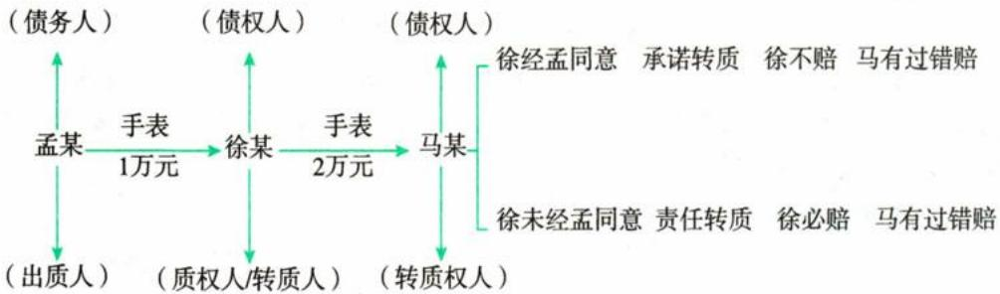

flowchart

```mermaid
graph TD
    A["孟某"] -->|手表 1万元| B["徐某"]
    B -->|手表 2万元| C["马某"]
    C --> D["徐经孟同意 承诺转质 徐不赔 马有过错赔"]
    C --> E["徐未经孟同意 责任转质 徐必赔 马有过错赔"]
    A --> F["(出质人)"]
    B --> G["(质权人/转质人)"]
    C --> H["(转质权人)"]
    style A fill:#f9f,stroke:#333
    style B fill:#f9f,stroke:#333
    style C fill:#f9f,stroke:#333
    style D fill:#ccf,stroke:#333
    style E fill:#ccf,stroke:#333
    style F fill:#fff,stroke:#333
    style G fill:#fff,stroke:#333
    style H fill:#fff,stroke:#333
```

(转质当事人法律关系示意图)

①徐某的转质是承诺转质还是责任转质？

答：责任转质。因为质权人在质权存续期间，未经出质人同意即将质押财产出质于转质权人。

②徐某将孟某的手表转质给马某的行为是有权处分还是无权处分？

答：无权处分。

③徐某与马某签订的质押合同效力如何？

答：合法有效。

④马某可否取得手表的质权？如何取得？

答：可以。善意取得，因为马某不知质押物为第三人（孟某）所有。

⑤如手表在马某占有期间因不可抗力毁损、灭失的，徐某是否需要承担赔偿责任？

答：需要。因为质权人在质权存续期间，未经出质人同意转质，造成质押财产毁损、灭失的，应当向出质人承担赔偿责任。

⑥如手表在马某占有期间因不可抗力毁损、灭失的，马某是否需要承担赔偿责任？

答：不需要，因为马某没有过错。

[萌主点拨]
承诺转质 VS 责任转质

<table><tr><td>项目</td><td>承诺转质(同意转质)</td><td>责任转质</td></tr><tr><td>含义</td><td>质权人经过出质人同意</td><td>质权人未经出质人同意</td></tr><tr><td>效力</td><td>(有权处分)质押合同合法有效、质押权设立(继受取得)</td><td>(无权处分)质押合同合法有效、质押权设立(善意取得)</td></tr><tr><td>责任承担</td><td>标的物毁损、灭失的,质权人不承担赔偿责任;如转质权人有过错的(质权人和转质权人负有妥善保管质押物的义务,如因其故意或重大过失导致标的物毁损、灭失,应承担赔偿责任),应承担赔偿责任</td><td>标的物毁损、灭失的,质权人应当承担赔偿责任(因为其未经出质人同意擅自转质的行为本身即构成过错);如转质权人有过错的,亦需承担赔偿责任</td></tr></table>

### 第四节 留置权

#### 复习提要

留置权，规定在《民法典》第二编物权第四分编第十九章（第447—457条），共11条。本节主要涉及五个问题：1. 留置权的含义；2. 留置权的成立要件；3. 留置权的实现；4. 留置权的优先效力；5. 留置权的消灭。留置权作为法定担保物权，核心考点是成立要件，在备考中应重点予以关注。

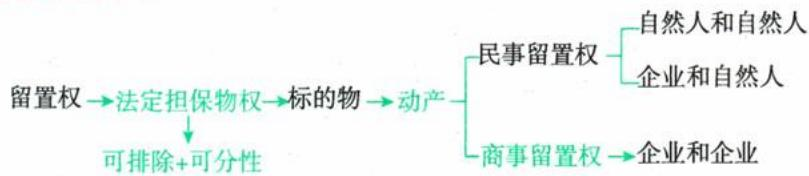

flowchart

```mermaid
graph TD
    A["留置权"] --> B["法定担保物权"]
    B --> C["标的物"]
    C --> D["动产"]
    D --> E["民事留置权"]
    E --> F["自然人和自然人"]
    E --> G["企业和自然人"]
    D --> H["商事留置权"]
    H --> I["企业和企业"]
    J["可排除+可分性"] --> B
```

#### 一、留置权的含义

债务人不履行到期债务，债权人可以留置已经合法占有的债务人的动产，并有权就该动产优先受偿。债权人为留置权人，占有的动产为留置财产。

#### 二、留置权的成立要件①

(一) 民事留置权
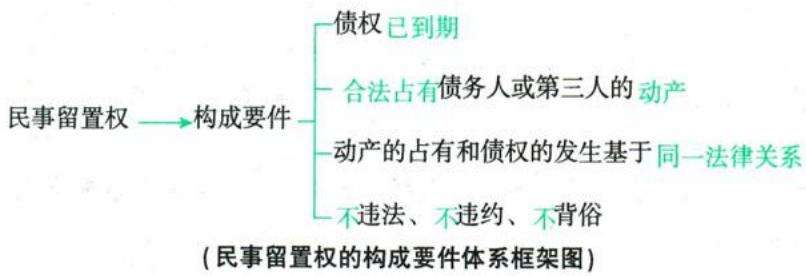

flowchart

```mermaid
graph TD
    A["民事留置权"] --> B["构成要件"]
    B --> C["债权已到期"]
    B --> D["合法占有债务人或第三人的动产"]
    B --> E["动产的占有和债权的发生基于同一法律关系"]
    B --> F["不违法、不违约、不背俗"]
```

民事留置权的成立要件有四，必须同时满足，分别是：

#### 1. 债权已到期。

法谚云：未到期的债权视为无债权。因此，如果债权未到期，债权人尚不能请求债务人还款，当然不得对债务人的动产行使留置权。

[例] 孟某为马某送货，约定货物送到后一周内支付运费。孟某在货物运到后立刻请求马某支付运费被拒绝。孟某不可以留置部分货物。因为债权未到期，未到期的债权视为无债权。

#### 2. 合法占有债务人或第三人的动产。

#### (1) 动产。

留置权的客体只能是动产，对于债务人或第三人的不动产和权利，债权人不得留置。作为担保物权不可分性的例外。留置财产为可分物的，留置财产的价值应当相当于债务的金额。

[例] 孟某委托马某保管2000台电脑（每台价值1万元）2个月，保管费2万元。到期后，孟某不支付马某保管费2万元。马某不可以留置全部2000台电脑。因为留置财产电脑为可分物，马某只需留置2台电脑即可。

#### (2) 合法。

合法，是指债权人占有债务人动产的行为符合法律的规定，该行为应当是公开的、有合同或法律依据的。即债权人基于合同性质而占有债务人的动产。遗失物的拾得人并非合法占有失主的动产，不属于合法占有，不得行使留置权；因侵权行为而占有，不属于合法占有，不得行使留置权。

[例] 方某将一行李遗忘在出租车上，立即发布寻物启事，言明愿以2000元现金酬谢返还行李者。出租车司机李某发现该行李及获悉寻物启事后即与方某联系。现方某拒绝支付2000元给李某。李某不可以行使留置权拒绝返还该行李，因为不属于合法占有。

#### (3) 占有。

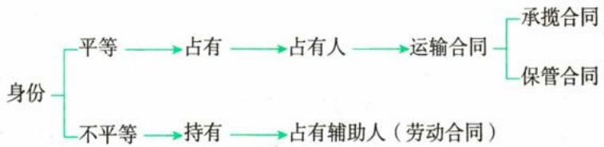

flowchart

```mermaid
graph TD
    A["身份"] --> B["平等"]
    A --> C["不平等"]
    B --> D["占有"]
    D --> E["占有人"]
    E --> F["运输合同"]
    F --> G["承揽合同"]
    F --> H["保管合同"]
    C --> I["持有"]
    I --> J["占有辅助人（劳动合同）"]
```

(占有和持有区别体系框架图)

占有辅助人非占有人，不得行使留置权。占有辅助，是指占有人对于其物系基于特定的从属关系，受他人指示而为事实上的支配并排除他人干涉的法律之力。占有辅助人对物的使用管领，必须接受交付其管领之人（本人）的命令指示。如雇员对雇主动产的占有并非直接占有，只是单纯的占有辅助，如雇主不向雇员给付劳动报酬，雇员不得对雇主的动产行使留置权。

[例] 徐某是甲公司总经理（法定代表人），甲公司为其配备了一辆轿车供其上下班使用。后徐某辞职，甲公司尚欠其10万元工资。徐某与甲公司多次交涉无果，欲对轿车行使留置权。徐某不可以对甲公司的轿车行使留置权，因为徐某对甲公司的轿车并非占有。

3. 动产的占有和债权的发生基于同一法律关系。

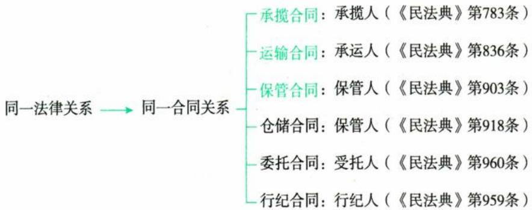

flowchart

```mermaid
graph LR
    A["同一法律关系"] --> B["同一合同关系"]
    B --> C["承揽合同：承揽人（《民法典》第783条）"]
    B --> D["运输合同：承运人（《民法典》第836条）"]
    B --> E["保管合同：保管人（《民法典》第903条）"]
    B --> F["仓储合同：保管人（《民法典》第918条）"]
    B --> G["委托合同：受托人（《民法典》第960条）"]
    B --> H["行纪合同：行纪人（《民法典》第959条）"]
```

(同一法律关系体系框架图)

理论界通说认为，债权人所占有的债务人的动产必须与其债权的发生具有牵连关系（又称牵连性），才能行使民事留置权。

[例] 小贝购得一只世界杯指定用球后兴奋不已，一脚踢出，恰好落入邻居老马家门前的水井中，正在井边清洗花瓶的老马受到惊吓，手中花瓶落地摔碎。老马从井中捞出足球后，小贝央求老马归还，老马则要求小贝赔偿花瓶损失。如小贝拒绝赔偿，老马不可以对足球行使留置权，因为不属于同一法律关系。

4. 不违反法律规定、不违反当事人约定、不违背公序良俗。

法律规定不得留置的动产主要是指法律规定禁止流通的动产，如文物。当事人约定不得留置的动产，只要该约定不违反法律的强制性规定，则应当充分尊重当事人的意思自治。留置权的设立亦不得违背公序良俗，如留置权的设立可能损害社会公共利益和人们一般道德观念时，则留置权的设立无效，如对身份证、人事档案、尸体、骨灰等。

#### （二）商事留置权

商事留置权，是指就某种商事特定关系规定债权人对债务人的动产享有特别留置权，以担保债权人权利的实现。

[萌主点拨]
民事留置权 VS 商事留置权

<table><tr><td>项目</td><td>民事留置权</td><td>商事留置权1</td><td>商事留置权2</td></tr><tr><td>要件1</td><td>债权已到期</td><td>债权已到期</td><td>债权已到期</td></tr><tr><td>要件2</td><td>合法占有债务人的动产或第三人的动产</td><td>合法占有债务人的动产</td><td>合法占有第三人的动产</td></tr><tr><td>要件3</td><td>同一法律关系</td><td>营业债权(企业持续经营中发生的债权)</td><td>营业债权+同一法律关系(企业持续经营中发生的债权)</td></tr><tr><td>要件4</td><td>不违反法律规定、不违反当事人约定、不违背公序良俗</td><td>不违反法律规定、不违反当事人约定、不违背公序良俗</td><td>不违反法律规定、不违反当事人约定、不违背公序良俗</td></tr></table>

#### 三、留置权的实现

留置权的实现，是指留置权人对留置财产进行处分，以优先受偿其债权的行为。留置权实现的重点是“宽限期制度”。留置权人与债务人应当约定留置财产后的债务履行期限；没有约定或约定不明确的，留置权人应当给债务人60日以上履行债务的期限，但鲜活易腐等不易保管的动产除外（宽限期有约从约，无约留置权人有最终决定权，但必须在60日以上除非鲜活易腐）。债务人逾期未履行的，留置权人可以与债务人协议以留置财产折价，也可以就拍卖、变卖留置财产所得的价款优先受偿。留置财产折价或变卖的，应当参照市场价格。

[例] 孟某将其所有的汽车送至汽车修理厂修理。因孟某未依约定支付修理费，修理厂遂依法将该车留置，但未与孟某约定留置汽车后支付修理费的期间。根据《民法典》规定，修理厂在实现其留置权前应当给孟某支付修理费的期间为60日以上。

#### 四、留置权的优先效力①

#### (一) 抵押权先于质押权公示

结论：留置权>超级动产抵押权>登记动产抵押权>动产质押权>未登记动产抵押权。

#### (二)质押权先于抵押权公示

结论：留置权>超级动产抵押权>动产质押权>登记动产抵押权>未登记动产抵押权。

从上述结论，咱们可以得出的规律系：

1. 留置权总是排在第一位，为何呢？

留置权人对留置物有一定的劳务支出，若允许抵押权人或质权人就留置物优先受偿则有以留置权人劳动创造的价值给债务人偿还抵押权人或质权人之债权的嫌疑，对留置权人非常不公平。而且留置权人的债权多是因为对留置物的保值增值的劳动行为而产生，其债权的实现应该是在此保值增值的范围内实现，允许留置权人优先受偿不会给抵押权人或质权人带来什么损失。

一言以蔽之，留置权作为法定担保物权，具有法定优先性。而抵押权和质押权均为意定担保物权，在物权制度中，法定优于意定。

2. 超级动产抵押权总是排在第二位，为何呢？

动产标的物出卖人的价款债权，只要在动产标的物交付后10日内办理了抵押登记，即具有法定优先性，排在意定担保物权中的第一位。

3. 未登记动产抵押权总是排在最后一位，为何呢？

以动产抵押的，抵押权自抵押合同生效时设立；未经登记，不得对抗善意第三人。

据此可知，未登记动产抵押权效力最弱。因此，未登记动产抵押权永远排在最后一位。

4. 到底是登记动产抵押权优先于动产质押权还是动产质押权优先于登记动产抵押权呢?

同一财产既设立抵押权又设立质权的，拍卖、变卖该财产所得的价款按照登记、交付的时间先后确定清偿顺序。

据此可知，请牢记6个字：公示在先原则（登记、交付的时间先后/《民法典》第415条）。如果是动产质押权先于登记动产抵押权公示的，动产质押权就优先于登记动产抵押权；如果是登记动产抵押权先于动产质押权公示的，登记动产抵押权就要优先于动产质押权。

#### 五、留置权的消灭

#### (一) 含义

留置权的消灭，是指留置权成立后，因一定原因的出现而不复存在。

#### (二) 原因

留置权作为一种担保物权，可以因物权消灭的共同原因而消灭，如留置物的灭失、混同、留置权的抛弃等；也可以因担保物权消灭的共同原因而消灭，如主债权的消灭、担保物权的实现等。留置权作为一种法定担保物权，有其自己的特殊消灭原因。具体而言，特殊消灭原因有二（《民法典》第457条）：

1. 留置权人对留置财产丧失占有（因为留置权产生的前提条件是债权人对债务人或第三人财产的持续不间断占有）；

通说认为，丧失占有应当限缩为自愿丧失占有，即留置权人主动放弃占有或抛弃留置物。若留置权人非依自己的意愿暂时丧失对留置财产的占有，则留置权消灭，但这种消灭不是终局性的消灭，留置权人可以依占有返还请求权请求非法占有人返还留置物而重新获得留置权。如甲留置了乙的财产，但丙非法占有了留置财产，甲有权依占有返还请求权请求丙返还留置财产。

2. 留置权人接受债务人另行提供担保。

债务人另行提供担保导致留置权消灭应当同时满足两个条件：（1）债权人接受，如果债权人不接受新担保的，留置权不消灭；（2）另行提供的担保物价值与债权人的债权额相当。

[萌主点拨]
担保物权（优先受偿权）

<table><tr><td>种类</td><td>发生原因</td><td>移转占有</td><td>担保人</td><td>担保财产</td><td>法定担保范围</td><td>孳息收取权</td><td>放弃</td><td>妥善保管</td><td>行权</td></tr><tr><td>抵押权</td><td>意定担保物权</td><td>非占有型担保物权</td><td>债务人或第三人</td><td>不动产、动产和权利(不动产用益物权)</td><td>5项</td><td>扣押前抵押人,扣押后抵押权人</td><td>可以</td><td>无</td><td>主债权的诉讼时效期间内</td></tr><tr><td>质押权</td><td>意定担保物权</td><td>占有型担保物权</td><td>债务人或第三人</td><td>动产和权利</td><td>6项</td><td>除另有约定外,质权人</td><td>可以</td><td>有</td><td>及时行权</td></tr><tr><td>留置权</td><td>法定担保物权</td><td>占有型担保物权</td><td>债务人或第三人</td><td>动产</td><td>6项</td><td>留置权人</td><td>可以</td><td>有</td><td>及时行权(60日以上宽限期)</td></tr></table>

## 10 专题十 占有

#### 复习提要

占有（准物权），规定在《民法典》第二编物权第五分编第二十章（第458—462条），共5条。本专题主要涉及四个问题：1. 占有的分类；2. 善意占有和恶意占有的区别；3. 占有的保护；4. 占有的推定效力。占有的分类是本专题的重点，特别是善意占有和恶意占有的区别。

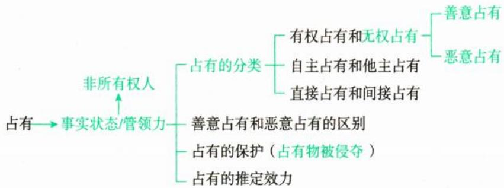

flowchart

```mermaid
graph TD
    A["占有"] --> B["事实状态/管领力"]
    B --> C["非所有权人"]
    C --> D["占有的分类"]
    D --> E["有权占有和无权占有"]
    D --> F["自主占有和他主占有"]
    D --> G["直接占有和间接占有"]
    E --> H["善意占有"]
    E --> I["恶意占有"]
    B --> J["善意占有和恶意占有的区别"]
    B --> K["占有的保护（占有物被侵夺）"]
    B --> L["占有的推定效力"]
```

#### 一、占有的分类①

民法上确立占有制度主要目的在于保护对物的事实支配状态，进而维护社会秩序与和平。占有是对物的支配，但这种支配可基于不同的法律关系，可能是有权占有，亦可能是盗贼的无权占有。因而，占有本身并未显示正当性，不足以成为一项权利，只是对物的单纯事实支配状态。占有在性质上属于事实状态或事实管领力，是一种“准物权”。

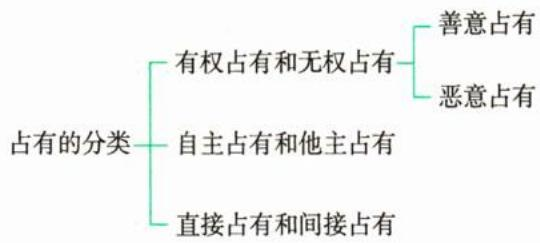

flowchart

```mermaid
graph TD
    A["占有的分类"] --> B["有权占有和无权占有"]
    A --> C["自主占有和他主占有"]
    A --> D["直接占有和间接占有"]
    B --> E["善意占有"]
    B --> F["恶意占有"]
```

(占有的分类体系框架图)

#### (一) 有权占有和无权占有

根据占有人是否存在占有的本权（权源）或法律上的原因，将占有分为有权占有和无权占有。

#### 1. 有权占有。

有权占有，又称有权源占有，是指基于合法原因而取得的占有（《民法典》第458条）。

合法原因可以是物权，如建设用地使用权、土地承包经营权、居住权和担保物权（质押权、留置权）；也可以是债权，如基于买卖合同、租赁合同、保管合同、承揽合同、运输合同等产生的权利；还可以是因其他法律关系如监护关系、夫妻关系以及无因管理而产生的权利，如财产代管人对于被宣告失踪人财产的代管权，监护人对被监护人财产的管理权。

#### 2. 无权占有。

无权占有，又称无权源占有，是指非基于合法原因而取得的占有。如将他人之物误认为己有而占有、遗失物的拾得者对拾得物的占有、盗窃者对盗赃物的占有、承租人于租赁合同终止后对租赁物的占有、买受人在买卖合同无效或被撤销后对于买卖物的占有等均属于无权占有。

区分有权占有和无权占有的意义有三：

（1）有权占有人能够拒绝他人行使本权。例如租赁合同期间，承租人对租赁物系有权占有，能够拒绝出租人的返还请求权。无权占有人不能拒绝享有本权的人行使占有物返还请求权。被占有的不动产或动产遭到第三方侵占或妨害时，对占有人的保护不区分有权占有和无权占有，均可适用占有的规定处理。

(2) 留置权人行使留置权的前提条件是有权占有（即合法占有）。

[例 1] 孟某向马某借款 1 万元，期限 1 年，将自己的手表质押给马某并交付。马某对孟某手表的占有属于有权占有，占有的本权或权源是动产质权。

[例 2] 孟某将自己的房屋出租给徐某，租期 1 年，月租金 1 万元。租期届满后，孟某请求徐某搬离，徐某拒绝。租期届满后，徐某对孟某房屋的占有属于无权占有，因为租期届满后，徐某占有房屋的本权或权源已经不复存在。

(3) 基于合同关系等产生的占有, 有关不动产或动产的使用、收益、违约责任等, 按照合同约定; 合同没有约定或约定不明确的, 依照有关法律规定。例如甲承租乙的商业房产用于经营, 交付后, 甲即有权占有乙所有的房产。对于甲在经营过程中, 如果使用此房产获得收益, 由双方当事人通过租赁合同约定即可。如果当事人没有约定, 则可以根据法律规定确定, 即根据《民法典》第720条的规定, 在租赁期限内因占有、使用租赁物获得的收益, 归承租人所有, 但是当事人另有约定的除外。

#### （二）善意占有和恶意占有

对于无权占有，根据占有人的主观心理状态，即以无权占有人是否误信且无怀疑为标准，将无权占有再分为善意占有和恶意占有。

#### 1. 善意占有。

善意占有，是指无权占有人不知其无占有的本权（权源）而误信其有正当权源且无怀疑地占有。题目中的关键词为“错认、误以为”。

典型的善意占有包括：（1）盗赃物的买受人信赖出卖人有所有权而购买并占有盗赃物的；（2）继承物中有他人之物，但是继承人对物归属于他人并不知情的；（3）误拿他人行李的。

[例] 孟某乘坐 CA1339 航班从北京飞往广州。到达广州白云机场后，由于孟某的行李箱和马某的很相像，在行李提取大厅误将马某的日暮瓦行李箱当成自己的而拉走。出门时被保安人员发现并告知孟某。孟某对马某行李箱的占有属于善意占有。

#### 2. 恶意占有。

恶意占有，是指无权占有人知道其无占有的本权（权源）或对于该物自己是否有权占有虽有怀疑而仍为占有。

盗赃物的买受人明知出卖人无所有权而购买并占有盗赃物的，即为典型的恶意占有。善意占有和恶意占有系无权占有的再分类，有权占有不存在善意占有和恶意占有的问题。赃物的窃取者和遗失物的拾得者均属于无权占有、恶意占有。

[例] 孟某手上的手表丢失，马某捡到后一直戴在自己的手腕上。马某对手表的占有属于恶意占有。

#### (三) 自主占有和他主占有

根据占有人是否以自己所有的意思占有标的物，分为自主占有和他主占有。

#### 1. 自主占有。

自主占有，是指以自己所有的意思对标的物进行的占有。

自主占有要求占有人具有“所有的意思”，即将其物如同自己之物加以占有，至于占有人是否为真正的所有权人或确信自己为所有权人则在所不问。

[萌主点拨] 典型的自主占有包括：盗贼对盗窃物的占有、误拿他人行李等。

#### 2. 他主占有。

他主占有，是指非以自己所有的意思对标的物进行的占有。如质权人对质物的占有、承租人对租赁物的占有即为典型的他主占有。

判断占有人的占有是否属于自主占有，须依占有人表现于外部的意思作为标准。在不能认定占有人的占有意思时，应推定占有人的占有为自主占有，即推定占有人为物的所有权人，有相反证据除外。

#### (四) 直接占有和间接占有

根据占有人在事实上是否直接管领其物，将占有分为直接占有和间接占有。直接占有和间接占有系德国民法上创造的概念。

#### 1. 直接占有。

直接占有，是指直接对物有事实上的管领力的占有。

#### 2. 间接占有。

间接占有，是指以他人的占有为媒介并基于一定的法律关系享有返还请求权的占有。间接占有的成立，必须具备以下条件：

(1) 间接占有人与媒介人之间存在占有媒介关系。占有媒介关系可以是物权关系, 如动产质权情形下, 出质人为间接占有人, 质权人为直接占有人; 也可以是债权关系, 如租赁合同情形下, 出租人、转租人为间接占有人, 次承租人为直接占有人; 或在保管合同中, 寄存人为间接占有人, 保管人为直接占有人。

[萌主点拨] 遗失物的拾得人与遗失人之间不存在占有媒介关系。因此，不存在直接占有和间接占有的问题。同理可知，盗贼与物主之间亦不存在直接占有和间接占有的问题。

(2) 间接占有人对占有物具有事实上的管领力。间接占有人虽然失去了控制、管领物的外观, 但却依然能对该物行使相应的返还请求权。间接占有人须享有有效的返还请求权, 如无任何返还请求权, 则不成立间接占有。如窃贼将所盗之物寄存于共谋人处以便受刑完毕后取回时, 并不成为间接占有人, 因为该寄存关系是无效的, 其返还请求权无从成立。

（3）他主占有的意思。在占有媒介关系中，直接占有其物者是以他主占有之意思而占有。如以自己所有之意思而为占有，则不产生间接占有。当直接占有人改变他主占有的意思而为自主占有时，间接占有即归于消灭。

<table><tr><td></td><td>有权/无权</td><td>善意/恶意</td><td>自主/他主</td><td>直接/间接</td></tr><tr><td>盗赃物</td><td>无权</td><td>恶意</td><td>自主</td><td>×</td></tr><tr><td>VS遗失物</td><td>无权</td><td>恶意</td><td>他主(有返还的意思)自主(无返还的意思)</td><td>×</td></tr></table>

(盗赃物 VS 遗失物占有情况示意图)

#### 二、善意占有和恶意占有的区别①

善意占有 VS 恶意占有

<table><tr><td>项目</td><td>善意占有</td><td>恶意占有</td></tr><tr><td>是否承担返还原物及其孳息的义务</td><td>承担</td><td>承担</td></tr><tr><td>是否享有必要费用请求权2</td><td>可以3</td><td>不可以</td></tr><tr><td>是否承担损耗或损害赔偿责任</td><td>不承担4</td><td>承担</td></tr><tr><td>占有物毁损、灭失时占有人的责任</td><td>现存利益(保险金、赔偿金或补偿金等)</td><td>所受利益5</td></tr></table>

① 考查 1 次，抓住重点。
② 这里的“必要费用”必须是必要的、合理的而不能明显超出正常水平。如甲占有乙的机动车，因该机动车部分零部件损耗，需要更换方能正常使用，甲遂委托汽车修理厂维修，并指示修理厂作全面检修，更换了很多本来属于正常的零部件，支付了大量修理费。此时，甲只能请求乙支付必要费用，即维护该车正常运行所必要的维修费用（《民法典》第460条）。
③ 域外立法一般将善意占有人的必要费用请求权和孳息保留二者联系在一起，如善意占有人享有必要费用请求权就不得保留孳息，反之，则可以保留孳息。我国立法规定善意占有人享有必要费用请求权，因此，必须返还孳息于权利人（《民法典》第460条）。
④ 善意占有人使用占有物致使物遭受损害的，各个国家或地区一般都规定无需承担责任。如《瑞士民法典》第983条、《日本民法典》第189条第1款、我国台湾地区“民法”第952条。其逻辑就是，法律对于占有赋予了几种法律效力，就是权利推定效力，占有人于占有物上行使的权利，推定其适法有此权利，而善意占有人在使用占有物时即被法律推定为物的权利人，具有占有、使用的权利。因此，对于使用被占有物而导致的损害，善意占有人不应负赔偿责任。
⑤《民法典》第461条［占有人返还代位物和恶意占有人赔偿责任］占有的不动产或者动产毁损、灭失，该不动产或者动产的权利人请求赔偿的，占有人应当将因毁损、灭失取得的保险金、赔偿金或者补偿金等返还给权利人；权利人的损害未得到足够弥补的，恶意占有人还应当赔偿损失。

#### 三、占有的保护①

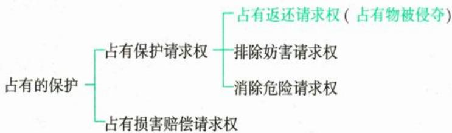

flowchart

```mermaid
graph TD
    A["占有的保护"] --> B["占有保护请求权"]
    A --> C["占有损害赔偿请求权"]
    B --> D["占有返还请求权（占有物被侵夺）"]
    B --> E["排除妨害请求权"]
    B --> F["消除危险请求权"]
```

(占有的保护体系框架图)

占有保护的理由在于已经成立的事实状态，不应受私力而为的扰乱，而只能通过合法的方式排除，这是一般公共利益的要求。如甲借用乙的自行车，到期不还构成无权占有，乙即使作为自行车的所有权人也不可以采取暴力抢夺的方式令甲归还原物；而对于第三人的侵夺占有或妨害占有的行为等，甲当然可以主张对占有的保护。因此，占有人无论是有权占有还是无权占有，其占有受他人侵害，即可行使法律赋予的占有保护请求权；侵害人只要实施法律所禁止的侵害行为，即应当承担相应的责任，法律不问其是否具有过失，也不问对被占有的不动产或动产是否享有权利。

#### (一) 占有保护请求权

#### 1. 占有返还请求权。

占有返还请求权发生于占有物被侵占或侵夺的情形。侵占，是指违反占有人的意思而排除其对物事实上的控制与支配。如盗窃、抢夺他人物品，未经许可占有他人房产等，包括积极的不法行为和消极的不法行为（《民法典》第462条）。

#### (1) 构成要件。

占有返还请求权的构成要件有三：

第一，请求权的主体应为原占有人，请求权的相对人应为现占有人。无论原占有人是有权占有还是无权占有，善意占有还是恶意占有，均享有占有返还请求权。

第二，须有侵占行为或事实且侵占行为的结果导致原占有人丧失占有（直接原因）。如遗失物的拾得人，虽然拾得人未将遗失物送交有关机关而据为己有，但此种侵占非失主丧失占有的直接原因（失主最初丧失对物的占有，可能是由于疏忽大意遗忘物品等）。因此，失主对于拾得人不得依占有物返还请求权提起诉讼，而应依其所有权人的身份主张返还原物请求权。

##### 第三，侵占行为具有违法性。

#### (2) 行权期间限制。

占有人返还原物的请求权，自侵占发生之日起1年内未行使的，该请求权消灭该1年在性质上属于除斥期间。立法理由在于为防止权利处于长期不稳定状态，通常情况下，占有返还请求权因除斥期间经过而未行使的，占有人如果对物享有其他实体权利（如所有权），自然可以依照其实体权利提出返还请求。因此，没有必要在占有返还请求权中规定更长的期间进行保护。

[萌主点拨]
占有返还请求权 VS 物权请求权

<table><tr><td>项目</td><td>占有返还请求权</td><td>物权请求权</td></tr><tr><td>基础</td><td>占有的事实</td><td>物权</td></tr><tr><td>目的</td><td>保护占有的事实状态或事实管领力,恢复占有人对物的占有,维护社会平稳秩序</td><td>救济被侵害的物权,恢复对物的圆满支配状态(使用价值+交换价值)</td></tr><tr><td>行权主体</td><td>占有人</td><td>物权人</td></tr><tr><td>适用条件</td><td>占有物被侵占</td><td>所有物返还请求权以侵害人无权占有为条件</td></tr><tr><td>期间限制</td><td>受1年除斥期间限制</td><td>具体问题具体分析</td></tr></table>

#### 2. 排除妨害请求权。

占有被他人妨害时，占有人有权请求妨害人除去妨害。排除妨害的费用应由妨害人负担。占有人自行除去妨害的，其费用可依无因管理的规定向相对人请求偿还。

[例] 孟某从幸福小区开发商众森公司处租赁了一个车位用于停放自家宝马轿车，租期5年，月租金2000元。邻居王某每天都将大量的装修垃圾倾倒于孟某车位处。孟某可以请求王某排除妨害。

#### 3. 消除危险请求权。

消除危险请求权中的危险，应为具体的危险，指能够使外界感知到对占有的妨害。如违反建筑规则建设高危建筑、接近邻地开掘地窖等产生对邻地的危险、倾斜的房屋墙壁对邻居房产造成的危险。排除妨害请求权与消除危险请求权的主要区别是，前者是妨害已经发生，后者妨害虽未发生但是存在发生的现实危险。

#### （二）占有损害赔偿请求权

占有损害赔偿请求权属于债权保护方法，占有受到侵占或妨害，造成占有人的财产利益损失，成立侵权行为，占有人产生侵权损害赔偿请求权。占有虽非一种权利，但也属于法律所保护的一种财产利益，不受他人非法的任意侵害，侵害占有的应负侵权损害赔偿责任。例如，车位被侵夺致不能停车而额外支付的停车费，房屋被霸占致不能居住而额外支付的租金，汽车被盗致不能运货而额外支付的租车费等。

通说认为，有权占有人和无权占有人中的善意占有人（对占有物有使用收益权能）享有占有损害赔偿请求权，而无权占有人中的恶意占有人（对占有物无使用收益权能）不享有占有损害赔偿请求权。

#### 四、占有的推定效力①

为维持社会安定和保护交易安全，法律承认占有即所有的推定效力。受权利推定的占有人，免除举证责任，即对其是否具有实体权利存在争议时，占有人可以直接援用该推定对抗相对人，无须证明自己是权利人。但该种权利的推定具有消极性，占有人不得利用此项推定作为其行使权利的依据，在相对人提出反证时，占有人为推翻该反证，仍须举证。否则，将承担不利的法律后果。

PART

# 第三部分

#### 债法总则

natural_image

Abstract vertical green gradient pattern with three parallel vertical bars (no text or symbols)

## 11/专题十一 债的基本原理

#### 复习提要

本专题主要涉及两个问题：1. 债的法定分类；2. 债的学理分类。其中，债的法定分类属于必考点，备考时必须重点复习。债的学理分类要注重相互之间的区别，切莫混淆。

### 第一节 债的法定分类

#### 复习提要

《民法典》第三编合同第三分编准合同第979—988条（共10条）规定了无因管理和不当得利制度。本节主要涉及四个问题，分别是：1. 自然之债；2. 单方允诺之债；3. 无因管理之债；4. 不当得利之债。其中，无因管理之债和不当得利之债系客观题每年必考内容，备考时必须重点关注。单方允诺之债系常考点，备考时亦要重点掌握。

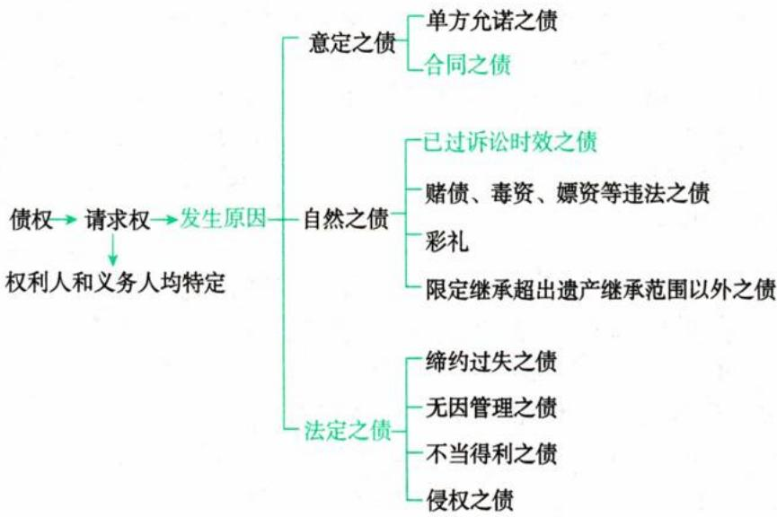

flowchart

```mermaid
graph TD
    A["债权"] --> B["请求权"]
    B --> C["权利人和义务人均特定"]
    C --> D["发生原因"]
    D --> E["意定之债"]
    E --> F["单方允诺之债"]
    E --> G["合同之债"]
    D --> H["自然之债"]
    H --> I["已过诉讼时效之债"]
    H --> J["赌债、毒资、嫖资等违法之债"]
    H --> K["彩礼"]
    H --> L["限定继承超出遗产继承范围以外之债"]
    D --> M["法定之债"]
    M --> N["缔约过失之债"]
    M --> O["无因管理之债"]
    M --> P["不当得利之债"]
    M --> Q["侵权之债"]
```

#### 一、自然之债 $^{①}$

#### (一) 含义

自然之债，又称自然债务，是指缺乏法定之债的债因，不产生法定义务，故不能经由诉讼获得满足，但债务人自愿履行的，不得请求不当得利返还的债。

#### (二) 特征

自然之债的特征有三：（1）债权本身存在；（2）不得请求法院强制执行；（3）债务人给付后原则上不得请求不当得利返还。

#### (三) 典型情形

1. 已过诉讼时效之债。
2. 赌债、毒资、嫖资等违法之债。

立法者反对因赌博使人遭受损害，通过“赢者不得向输者提起诉讼索取赌债，输者给付后不得请求返还”的规则来表示惩罚的态度。

3. 彩礼。

<table><tr><td>阶段</td><td>结婚登记前</td><td>结婚登记后共同生活前</td><td>结婚登记且共同生活后</td></tr><tr><td>原则</td><td>可以</td><td>可以</td><td>不可以</td></tr><tr><td>例外或条件</td><td>双方未办理结婚登记但已共同生活,一方请求返还按照习俗给付的彩礼的,法院应当根据彩礼实际使用及嫁妆情况,综合考虑共同生活及孕育情况、双方过错等事实,结合当地习俗,确定是否返还以及返还的具体比例</td><td>离婚</td><td>双方已办理结婚登记且共同生活,离婚时一方请求返还按照习俗给付的彩礼的,法院一般不予支持。但是,如果共同生活时间较短且彩礼数额过高的,法院可以根据彩礼实际使用及嫁妆情况,综合考虑彩礼数额、共同生活及孕育情况、双方过错等事实,结合当地习俗,确定是否返还以及返还的具体比例。法院认定彩礼数额是否过高,应当综合考虑彩礼给付方所在地居民人均可支配收入、给付方家庭经济情况以及当地习俗等因素</td></tr></table>

下列情形给付的财物，不属于彩礼：（1）一方在节日、生日等有特殊纪念意义时点给付的价值不大的礼物、礼金；（2）一方为表达或者增进感情的日常消费性支出；（3）其他价值不大的财物（《彩礼纠纷规定》第3条第2款）。

4. 限定继承超出遗产继承范围以外之债（“父债子还”问题）。

继承人以所得遗产实际价值为限清偿被继承人依法应当缴纳的税款和债务。超过遗产实际价值部分，继承人自愿偿还的不在此限。继承人放弃继承的，对被继承人依法应当缴纳的税款和债务可以不负清偿责任。

<table><tr><td>内部</td><td>外部</td></tr><tr><td>1000万元</td><td>1000万元</td></tr><tr><td>债权债务概括承受</td><td>自然之债</td></tr></table>

##### (限定继承法律关系示意图)

[例] 甲的父亲去世，留有1000万元遗产。甲是其父亲唯一的继承人。后乙告知甲，其父亲生前尚欠自己借款2000万元未还的事实且有证据证明。此时，在遗产继承范围内的1000万元，甲必须偿还乙。对于超出的1000万元债务属于自然之债，债权本身依然存在，但债权人乙不得请求法院强制执行甲的个人财产。后甲自愿替父还债的，不得基于不当得利请求乙返还。

#### 二、单方允诺之债①

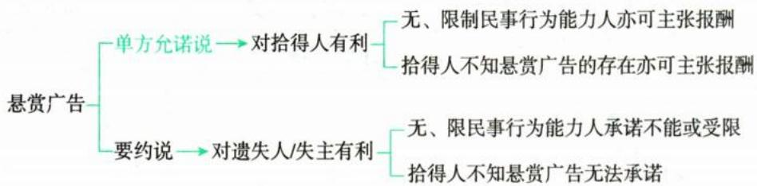

flowchart

```mermaid
graph TD
    A["悬赏广告"] --> B["单方允诺说"]
    A --> C["要约说"]
    B --> D["对拾得人有利"]
    D --> E["无、限制民事行为能力人亦可主张报酬"]
    D --> F["拾得人不知悬赏广告的存在亦可主张报酬"]
    C --> G["对遗失人/失主有利"]
    G --> H["无、限制民事行为能力人承诺不能或受限"]
    G --> I["拾得人不知悬赏广告无法承诺"]
```

(悬赏广告争议观点展示示意图)

#### (一) 含义

单方允诺之债，是指表意人向相对人作出的为自己设定某种义务，使相对人取得某种权利的意思表示。法考范围内，典型的单方允诺之债包括三类，分别是：（1）悬赏广告；（2）假一罚十的承诺；（3）自然之债的同意履行（在同意范围内构成单方允诺之债）。

#### (二) 特征

#### 1. 成立的特殊性。

它是表意人单方的意思表示，无需相对人对其意思表示作出承诺即可成立，即使相对人不知道单方允诺的存在也不影响单方允诺之债的成立。

[萌主点拨] 以公告方式作出的意思表示，公告发布时生效。

#### 2. 内容的特殊性。

它的内容是为表意人设定某种义务，使相对人取得某种权利（债权，即报酬请求权），它不需要相对人付出代价，相对人对于表意人也不负实施某种特定行为的义务。

#### 3. 对象的特殊性。

它一般向社会上不特定的人发出，凡符合表意人在单方允诺中所列条件的人，即可成为表意人的相对人，取得表意人所允诺的权利。

##### 随堂练习

方某将一行李遗忘在出租车上，立即发布寻物启事，言明愿以2000元现金酬谢返还行李者。出租车司机李某发现该行李及获悉寻物启事后即与方某联系。现方某拒绝支付2000元给李某。下列哪一表述是正确的？（2013-3-13，单）①

A. 方某享有所有物返还请求权，李某有义务返还该行李，故方某可不支付2000元酬金
B. 如果方某不支付 2000 元酬金，李某可行使留置权拒绝返还该行李
C. 如果方某未曾发布寻物启事，则其可不支付任何报酬或费用
D. 既然方某发布了寻物启事，则其必须支付酬金

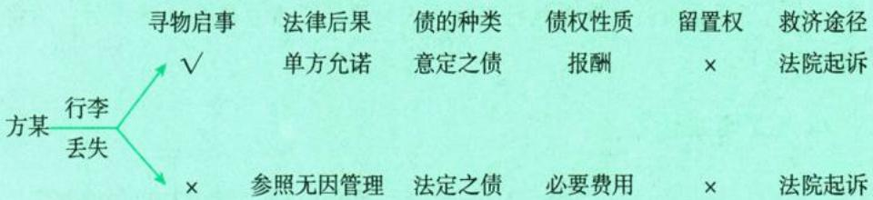

flowchart

```mermaid
graph TD
    A["方某"] --> B["行李丢失"]
    B --> C["寻物启事"]
    C --> D["法律后果"]
    D --> E["单方允诺"]
    E --> F["债的种类"]
    F --> G["意定之债"]
    G --> H["债权性质"]
    H --> I["报酬"]
    I --> J["留置权"]
    J --> K["×"]
    K --> L["法院起诉"]
    B --> M["参照无因管理"]
    M --> N["法定之债"]
    N --> O["必要费用"]
    O --> P["×"]
    P --> Q["法院起诉"]
```

(当事人法律关系示意图)

#### 三、无因管理之债 $^{②}$

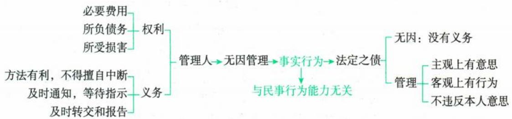

flowchart

```mermaid
graph TD
    A["必要费用"] --> B["权利"]
    C["所负债务"] --> B
    D["所受损害"] --> B
    E["方法有利，不得擅自中断及时通知，等待指示及时转交和报告"] --> F["义务"]
    B --> G["管理人"]
    F --> H["无因管理"]
    H --> I["事实行为"]
    I --> J["法定之债"]
    J --> K["与民事行为能力无关"]
    K --> L["无因：没有义务"]
    K --> M["管理"]
    M --> N["主观上有意思"]
    M --> O["客观上有行为"]
    M --> P["不违反本人意思"]
```

(无因管理的法律思维导图)

#### (一) 含义

无因管理，是指没有法定的或约定的义务，为避免他人利益受损失，自愿管理他人事务或为他人提供服务的行为。管理他人事务之人称为管理人；受管理事务之人，称为本人（受益人）。

由于无因管理的发生在管理人和本人（受益人）之间产生债权债务关系，故无因管理是债的发生原因之一，系法定之债。无因管理在性质上属于事实行为，即对管理人的民事行为能力并无限制，无民事行为能力人或限制民事行为能力人的身份不影响无因管理的构成。

[萌主点拨] 无因管理的本质是“学雷锋做好事、见义勇为、英雄救美、舍己为人、助人为乐”。

#### (二) 构成要件

无因管理作为法定之债，构成要件有四：

1. 没有法定或约定的义务。

没有法定或约定的义务，即无法律上之义务。如行为人负有法定的或约定的义务，则不构成无因管理，如父母抚养子女、财产代管人代管失踪人财产、消防队员救火、雇佣保姆看管小孩等。

[例] 小孟6周岁，多次在国际钢琴大赛中获奖，并获得大量奖金。小孟的父母孟某、刘某为了小孟的利益，考虑到小孟的奖金存放银行增值有限，遂将奖金全部购买了股票，但恰遇股市暴跌，小孟的奖金损失过半。作为父母的孟某、刘某系小孟的第一顺序法定监护人，有法定的监护职责（抚养、教育和保护的义务）。因此，孟某和刘某的行为不构成无因管理。

2. 主观上具有为避免他人利益受损失而管理他人事务的意思。

(1) 主观上纯粹为自己，不构成无因管理。

①误信管理。

误信管理，是指误信他人事务为自己事务而管理。行为人主观上不具有管理他人事务的意思。因此，不构成无因管理。如误把他人的牛当成自己的而饲养或“喜当爹”，其本质构成非给付型的不当得利。

[例] 孟某与刘某结婚后，刘某生育一子小孟，孟某抚养小孟6年后才得知小孟是刘某和隔壁老王所生。因孟某抚养小孟期间一直以为系抚养自己的子女，主观上不具有管理隔壁老王事务的意思，属于误信管理，不构成无因管理。但是，孟某可以基于不当得利请求隔壁老王给付抚养小孟6年的抚养费。

②有利可图或图谋私利。

有利可图或图谋私利，表明行为人主观上纯粹为自己，不具有管理他人事务的意思。因此，不构成无因管理。

[例] 孟某门前公路上有一泥沟。某日，一货车经过泥沟，由于颠簸掉落货物一件，被孟某拾得据为己有。孟某发现有利可图，遂将泥沟挖深半尺。次日，果然又拾得两袋车上颠落的货包。孟某主观上纯粹为自己，其行为不构成无因管理。

(2) 主观上适当兼顾为自己的利益，不影响无因管理的构成。

管理人主观上适当兼顾为自己的利益，即“城门失火，恐殃及池鱼/唇亡齿寒”的心态，不影响无因管理的构成。题目中的关键词一般为“唯恐祸及自家、担心祸及自家”等。

[例] 孟某的房屋与王某的房屋相邻。王某把房屋出租给徐某居住，并为该房屋在 A 公司买了火灾保险。某日孟某见王某的房屋起火，唯恐大火蔓延自家受损，遂率家人救火，火势得到及时控制，但孟某被烧伤住院治疗。虽然孟某主观上适当兼顾为自己的利益，但是，不影响孟某的行为构成无因管理。

3. 客观上实施了管理他人事务的行为。

(1) 只要行为不要效果。

无因管理是一个只要行为而不要效果的制度，即使未达到最终的效果，亦不影响无因管理的构成。换言之，无因管理的构成无需管理行为必须有效果。

[例] 孟某外出, 台风将至。邻居王某担心孟某年久失修的房子被风刮倒, 祸及自家, 就雇人用几根木料支撑住孟某的房子, 但孟某的房子仍然不敌台风, 倒塌之际压死了王某养的数只鸡。王某的行为虽然没有管理效果, 但不影响无因管理的构成。

(2) 好意施惠行为不构成无因管理。

好意施惠，是指一方向他人实施的旨在增进友谊的恩惠行为。好意施惠之所以不构成无因管理，是因为行为人的行为多出于道德风尚及社会应酬的考虑，因而无意获取任何回报。因此，理论上一般将行为视为社交应酬，归于道德范畴，认为其不适于作为无因管理之债的客体。

[例] 孟某在自家门前扫雪，顺便将邻居王某的小轿车上的积雪清扫干净。该行为属于典型的好意施惠，不会引起无因管理之债。

4. 不违反本人明示或可推知的意思，但是，本人真实意思违反法律或违背公序良俗的除外。

违反本人意思的事务管理，学说上称之为不适法无因管理（不当无因管理）。

[例] 甲正在市场卖鱼，突闻其父病危，急忙离去，邻摊菜贩乙见状遂自作主张代为叫卖，以比甲原每斤10元高出5元的价格卖出鲜鱼200斤，并将多卖的1000元收入自己囊中，后乙因急赴喜宴将余下的100斤鱼以每斤3元卖出。乙低价销售100斤鱼构成不当管理，应承担赔偿责任。

在特定情形下，出于维护社会公共利益和公序良俗的需要，管理人即便违反本人意思管理事务，仍得以构成无因管理。如将因迷信不愿进医院的患者强行送往医院救治的行为，或抢救意图自杀的人，虽违反本人意思，仍构成无因管理。

[例] 孟某在江西一风景区旅游，见一失恋女子刘某跳崖自杀。孟某赶忙救助，刘某明确拒绝：“让我去死，不要管我。”孟某不听，强行将刘某送到医院，为其支付医疗费2000元。在救助过程中，自己价值27500元的欧米茄手表和刘某价值1万元的手机都不慎遗落。虽然孟某违背刘某的意思，但不影响孟某的行为构成无因管理。

#### （三）法律效果

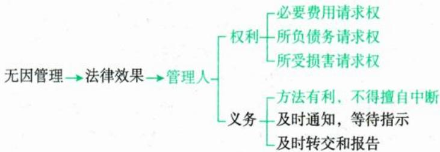

flowchart

```mermaid
graph TD
    A["无因管理"] --> B["法律效果"]
    B --> C["管理人"]
    C --> D["权利"]
    D --> E["必要费用请求权"]
    D --> F["所负债务请求权"]
    D --> G["所受损害请求权"]
    C --> H["义务"]
    H --> I["方法有利，不得擅自中断"]
    H --> J["及时通知，等待指示"]
    H --> K["及时转交和报告"]
```

(无因管理法律效果体系框架图)

1. 管理人的权利。

(1) 必要费用请求权。

是否必要或有益，依支出时的客观标准加以认定。

[萌主点拨] 管理人没有报酬请求权。

(2) 所负债务请求权。
(3) 所受损害请求权。

管理人所受损害可以向受益人主张补偿，但受益人所受损害不得向管理人主张赔偿。

[例] 孟某不慎落水，徐某奋勇抢救，抢救过程中致孟某面部受伤，同时徐某丢失手机一部。孟某应当补偿徐某丢失手机的损失，但是，徐某不应当补偿孟某面部受伤的损失。

#### 2. 管理人的义务。

(1) 方法有利，不得擅自中断（好人做到底）。

管理人管理他人事务，应当采取有利于受益人的方法。中断管理对受益人不利的，无正当理由不得中断。法律之所以加重管理人责任，旨在禁止擅自干预他人事务。

(2) 及时通知，等待指示。

管理人管理他人事务，能够通知受益人的，应当及时通知受益人。管理的事务不需要紧急处理的，应当等待受益人的指示。

(3) 及时转交和报告。

管理结束后，管理人应当向受益人报告管理事务的情况。管理人管理事务取得的财产，应当及时转交给受益人。

#### (四) 诉讼时效

管理人因无因管理行为产生的给付必要管理费用、赔偿损失请求权的诉讼时效期间，从无因管理行为结束并且管理人知道或应当知道本人之日起计算。本人因不当无因管理（债权效力）行为产生的赔偿损失请求权的诉讼时效期间，从其知道或应当知道管理人及损害事实之日起计算。

#### （五）无因管理与见义勇为的关系

见义勇为，是指在没有法定或约定义务的前提下，为保护他人的人身、财产权益，制止各种侵权行为、意外事件的救助行为。就其法律性质而言，见义勇为属于无因管理的范围，但它是一种特殊的无因管理。

为了弘扬社会主义核心价值观，倡导良好的社会风尚，鼓励和支持舍己为人的高尚行为，防止见义勇为者“流血又流泪”的问题出现。关于见义勇为者的权益保障，有两种路径：基于无因管理，由受益人支付见义勇为者必要费用和实际损失。在没有侵权人、侵权人逃逸或无力承担民事责任的情况下，受益人应当给予适当补偿（《民法典》第183条）。法院可以根据受害人所受损失和已获赔偿的情况、受益人受益的多少及其经济条件等因素确定受益人承担的补偿数额（《民法典总则编解释》第34条）。

#### 四、不当得利之债①

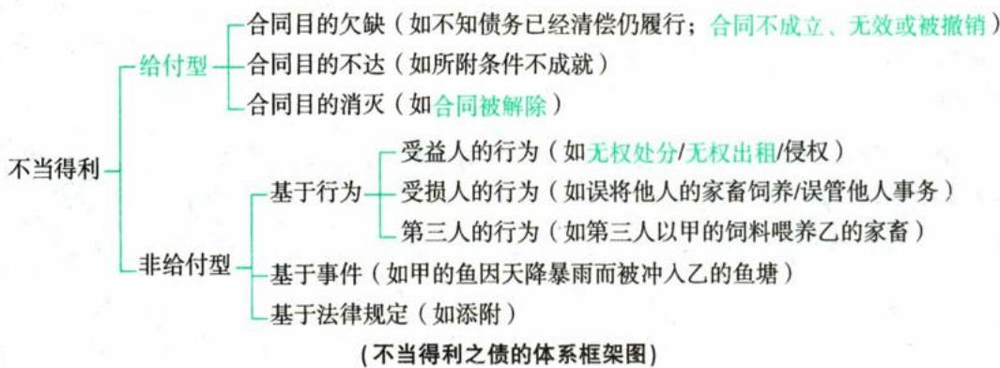

flowchart

```mermaid
graph TD
    A["不当得利"] --> B["给付型"]
    A --> C["非给付型"]
    B --> D["合同目的欠缺（如不知债务已经清偿仍履行；合同不成立、无效或被撤销）"]
    B --> E["合同目的不达（如所附条件不成就）"]
    B --> F["合同目的消灭（如合同被解除）"]
    C --> G["基于行为"]
    G --> H["受益人的行为（如无权处分/无权出租/侵权）"]
    G --> I["受损人的行为（如误将他人的家畜饲养/误管他人事务）"]
    G --> J["第三人的行为（如第三人以甲的饲料喂养乙的家畜）"]
    C --> K["基于事件（如甲的鱼因天降暴雨而被冲入乙的鱼塘）"]
    C --> L["基于法律规定（如添附）"]
```

#### (一) 含义

不当得利，是指无法律上之原因而受利益，致他人受损害者，应返还其利益。虽有法律上之原因，而其后已不存在者，亦同。其中，取得不当利益的一方称为得利人，受到损失的一方称为受损人（受损失的人）。由于不当得利的发生在得利人和受损失的人（受害人/受损人）之间产生债权债务关系，故不当得利是债的发生原因之一，系法定之债。

[萌主点拨] 不当得利的本质是人在屋中坐，财从天上来，即“不劳而获”。

#### (二) 构成要件

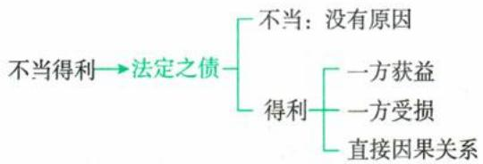

flowchart

```mermaid
graph TD
    A["不当得利"] --> B["法定之债"]
    B --> C["不当：没有原因"]
    B --> D["得利"]
    D --> E["一方获益"]
    D --> F["一方受损"]
    D --> G["直接因果关系"]
```

(不当得利构成要件体系框架图)

不当得利作为法定之债，构成要件有四：

1. 没有法定或约定的原因（《民法典》第985条）。

（1）为履行道德义务进行的给付，不构成不当得利。如养子女给予生父母赡养费或侄子女对于叔伯父以为有赡养义务而进行赡养的，可以适当分得遗产，但不得基于不当得利请求返还（调和法律与道德的关系，使得法律规定符合一般道德观念）。

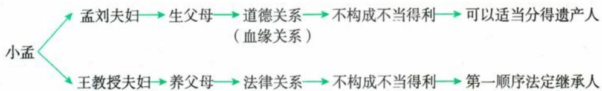

flowchart

```mermaid
graph TD
    A["小孟"] --> B["孟刘夫妇"]
    A --> C["王教授夫妇"]
    B --> D["生父母"]
    D --> E["道德关系 (血缘关系)"]
    E --> F["不构成不当得利"]
    F --> G["可以适当分得遗产人"]
    C --> H["养父母"]
    H --> I["法律关系"]
    I --> J["不构成不当得利"]
    J --> K["第一顺序法定继承人"]
```

(为履行道德义务而为的给付当事人法律关系示意图)

（2）明知无给付义务而进行的债务清偿（明知的非债清偿），不构成不当得利（如替人买单）。

明知的非债清偿，是指明知没有债务而为给付，导致一方受损、一方获益。受损人明知没有债务，不存在给付义务而向他人给付，应视为对自己权利的处分。明知没有给付义务而为给付，实际为无意义的行为，法律不予保护，咎由自取，其理论根据系禁反言原则（明知没有给付义务而进行的给付再请求返还，则构成了前后矛盾，有违诚信原则，所以不允许）。

[萌主点拨] 误认的非债清偿，是指当受损人在给付时不知无给付义务，误认为自己有给付义务。误认的非债清偿，仍产生不当得利的法律效果，受损人享有不当得利返还请求权（如夫妻共同债务）。

[例] 孟某欠徐某1万元，到期未还。马某为求孟某办事儿，明知自己不欠徐某1万元却向徐某给付1万元。后孟某拒绝为马某办事儿。马某不可以基于不当得利请求徐某返还。因为马某和徐某之间不构成不当得利。但是，马某可以向孟某请求给付1万元。因为在孟某和马某之间构成不当得利。

#### 2. 一方获益。

获益的内容必须是财产权益的增加（包括积极利益和消极利益）而不包括人身权益和精神利益（是否获得精神利益既难以认定也无法返还），如身价的提高。反射利益不构成不当得利。反射利益，是指有人获益但无人受损的情形，如小区旁建地铁或大学城而使本小区房屋升值的情形，其本质系自然增值。

#### 3. 一方受损。

(1) 提前清偿未到期债务及利息不构成不当得利。

债务到期之前的清偿，又称期前清偿，是指债务人在履行期限届满前清偿债务。债权人受领期前清偿债务的给付，并非没有法律根据，而是基于合法有效的债权债务关系。且债权人的债权因清偿而消灭，不能认为债权人构成不当得利；债务人的债务因清偿而消灭，也不能认为是利益受损。

(2) 自然之债的自愿履行，不构成不当得利。

自然之债的自愿履行，系行为人主动放弃诉讼时效利益，债权人不构成不当得利

(3) 强迫得利，不构成不当得利。

基于恶意当事人不受保护原则，强迫得利不构成不当得利。强迫得利，是指受损人故意使自己受损而为给付，意图成立某种债的关系，所为给付为不法原因给付，受领人无须返还。如未经许可擦车或擦皮鞋等。

4. 获益与受损（即损益变动）之间存在直接因果关系。

直接因果关系说，是指一方得利与他方受损是基于同一原因事实。

#### （三）法律效力

1. 返还原物和孳息（包括天然孳息和法定孳息/利息）为原则，价值额为例外（取得的利益依其性质或其他情形不能返还的，如取得的利益为劳务、物的使用或消费或取得的利益本身已经灭失、遗失或被盗等）。

2. 善意得利人。

得利人不知道且不应当知道取得的利益没有法律根据，取得的利益已经不存在的，不承担返还该利益的义务。善意得利人，仅负有返还“现存利益”的义务，现存利益不存在的，无须返还。规定善意得利人仅返还“现存利益”的原因在于不当得利制度的目的在于去除利益，而非损害赔偿，不能使善意得利人承担如同侵权责任的后果（法律旨在保护善意受领人的信赖，即信赖其所受利益具有法律上的原因/《民法典》第986条）。

3. 恶意得利人。

得利人知道或应当知道取得的利益没有法律根据的，受损失的人可以请求得利人返还其取得的利益并依法赔偿损失。恶意得利人，负有返还“所受利益”的义务，所受利益不存在的，依法赔偿损失（加重返还责任/《民法典》第987条）。得利人已经将取得的利益无偿转让给第三人的（如赠与或遗赠），受损失的人可以请求第三人在相应范围内承担返还义务（《民法典》第988条）。

[例] 孟某前往白家大院餐馆就餐。餐馆经理（代理人）徐某告知新雇佣的员工（代理人）小马将2瓶茅台酒送给晚上前来就餐的孟姓先生。后小马误认为另一位孟姓顾客为孟先生并将2瓶茅台酒赠与对方。

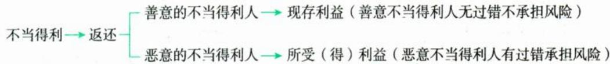

flowchart

```mermaid
graph LR
    A["不当得利"] --> B["返还"]
    B --> C["善意的不当得利人"]
    C --> D["现存利益（善意不当得利人无过错不承担风险）"]
    B --> E["恶意的不当得利人"]
    E --> F["所受（得）利益（恶意不当得利人有过错承担风险）"]
```

##### (不当得利的返还范围体系框架图)

（1）如孟姓顾客不知情，并于当晚将一瓶茅台酒喝掉，则其仅需返还剩余的1瓶茅台酒即可。因为此时孟姓顾客为善意得利人，仅负有返还现存利益的义务。
(2) 如孟姓顾客明知 2 瓶茅台酒并非赠与自己却于当晚将 1 瓶茅台酒喝掉, 则其依法应当承担赔偿责任。因为此时孟姓顾客为恶意得利人, 依法须返还所受 (得) 利益, 所受 (得) 利益不存在的, 依法赔偿损失。
(3) 如孟姓顾客将获得的 2 瓶茅台酒中的 1 瓶赠与隔壁的领导王某。

①如王某并未将茅台酒喝掉，餐馆依法有权请求王某返还。因为此时得利人无偿转让不当得利，白家大院餐馆（受损失的人）可以请求第三人王某在相应的范围内承担返还义务。
②如王某将茅台酒喝掉，餐馆无权请求王某赔偿。此时，如孟姓顾客为善意得利人，孟姓顾客亦不承担赔偿责任。最终，由白家大院餐馆自行承担损失；如孟姓顾客为恶意得利人，孟姓顾客应向白家大院餐馆承担赔偿责任。

#### (四) 诉讼时效

返还不当得利请求权的诉讼时效期间，从当事人一方知道或应当知道不当得利事实及对方当事人之日起计算。

### 第二节 债的学理分类

#### 复习提要

《民法典》第三编合同第一分编通则第515—521条（共7条）规定了选择之债、按份之债、连带之债制度。本节主要涉及三个问题，分别是：1. 单一之债和多数人之债；2. 财物之债、劳务之债和货币之债；3. 简单之债和选择之债。其中，财物之债、劳务之债和货币之债系常考点，备考时应重点学习。

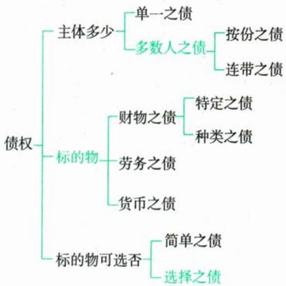

flowchart

```mermaid
graph TD
    A["债权"] --> B["主体多少"]
    A --> C["标的物"]
    A --> D["标的物可选否"]
    B --> E["单一之债"]
    B --> F["多数人之债"]
    F --> G["按份之债"]
    F --> H["连带之债"]
    C --> I["财物之债"]
    C --> J["劳务之债"]
    C --> K["货币之债"]
    D --> L["简单之债"]
    D --> M["选择之债"]
    I --> N["特定之债"]
    I --> O["种类之债"]
```

#### 一、单一之债和多数人之债①

根据债的主体多少，将债分为单一之债和多数人之债。

#### (一) 单一之债

单一之债，是指债权人和债务人均为一人的债。

[例] 某演出公司与“黑胡子”四人演唱组合订立演出合同，约定由该组合在某晚会上演唱自创歌曲2\~3首，每首酬金2万元。此种债权是单一之债。

#### (二) 多数人之债 $^{②}$

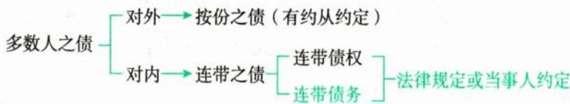

flowchart

```mermaid
graph TD
    A["多数人之债"] --> B["对外"]
    A --> C["对内"]
    B --> D["按份之债（有约从约定）"]
    C --> E["连带之债"]
    E --> F["连带债权"]
    E --> G["连带债务"]
    F --> H["法律规定或当事人约定"]
    G --> H
```

(多数人之债部分体系框架图)

多数人之债，是指债权人或债务人一方或双方为多人的债。

1. 按份之债。

(1) 含义。

按份之债，是指数个债权人或数个债务人按照一定的份额享有债权或负担债务。按份之债的前提是标的可分（一个给付分为数个给付时，对性质和价值没有损害）。通俗而言，就是可以按照份额分别给付。

(2) 内部效力。

按份之债是债的一般形态，其成立可法定可约定。按份债权人或按份债务人的份额难以确定的，视为份额相同。

(3) 外部效力。

按份之债是数个债的集合，按份债权人只能按照自己享有的债权份额请求债务人清偿，无权请求债务人向自己为全部债务的清偿；按份债务人仅就自己所负担的债务份额向债权人履行债务，对其他债务人应负担的债务份额，无清偿义务。债权人对每一个按份债务人的请求权都是独立的，每一个按份债务人的清偿单独发生效力，是否存在给付障碍，亦单独进行判断。

按份之债和连带之债均属于多数人之债，二者的本质区别在于外部关系。按份之债的本质系对外按份，有约从约，无内部追偿问题。

#### 2. 连带之债。

(1) 含义。

债权人为二人以上，部分或全部债权人均可以请求债务人履行债务的，为连带债权；债务人为二人以上，债权人可以请求部分或全部债务人履行全部债务的，为连带债务。连带债权或连带债务，由法律规定或当事人约定。

#### (2) 内部关系。

连带债务人之间的份额难以确定的，视为份额相同。实际承担债务超过自己份额的连带债务人，有权就超出部分在其他连带债务人未履行的份额范围内向其追偿，并相应地享有债权人的权利，但是不得损害债权人的利益。其他连带债务人对债权人的抗辩，可以向该债务人主张。

#### (3) 履行规则。

部分连带债务人履行、抵销债务或提存标的物的，其他债务人对债权人的债务在相应范围内消灭；该债务人可以依据上述规定向其他债务人追偿。部分连带债务人的债务被债权人免除的，在该连带债务人应当承担的份额范围内，其他债务人对债权人的债务消灭。

[例] 甲、乙二人按照 3:7 的份额共有一辆货车，为担保丙的债务，甲、乙将货车抵押给债权人丁，但未办理抵押登记。后该货车在运输过程中将戊撞伤。如戊免除了甲的损害赔偿责任，则乙在相应的范围内免责。

部分连带债务人的债务与债权人的债权同归于一人的，在扣除该债务人应当承担的份额后，债权人对其他债务人的债权继续存在。

#### (4) 行使规则。

债权人对部分连带债务人的给付受领迟延的，对其他连带债务人发生效力。连带债权人之间的份额难以确定的，视为份额相同。实际受领超过自己份额的连带债权人，应当按比例向其他连带债权人返还。连带债权参照适用连带债务的有关规定。但是，部分连带债权人免除债务人债务的，在扣除该连带债权人的份额后，不影响其他连带债权人的债权。

#### 二、财物之债、劳务之债和货币之债①

根据债的标的物的不同，将债分为财物之债、劳务之债和货币之债。

#### (一) 财物之债

对于财物之债，根据财物本身是否具有可替代性，又将财物之债分为特定之债和种类之债。

#### 1. 特定之债。

财物本身不具有可替代性，在交付前财物灭失的，可以免除继续履行的义务。对于“特定之债”题目中的关键词一般为“自己的”。

[例] 孟某将自己的手表出卖给马某, 双方约定第 2 天上午 9 点, 一手交钱一手交手表。孟某和马某之间的债属于特定之债。因为孟某享有所有权的那块手表是世界上独一无二的, 不具有可替代性。

#### 2. 种类之债。

财物本身具有可替代性，在交付前财物灭失的，不免除继续履行的义务。在日常生活中，大部分财物之债均属于种类之债，在市场上均可寻找到替代物。

[例] 孟某将一瓶农夫山泉矿泉水出卖给马某，双方约定第2天上午9点，一手交钱一手交矿泉水。孟某和马某之间的债属于种类之债。因为农夫山泉矿泉水具有可替代性，市场上有无数瓶可以替代。

#### (二) 劳务之债

对于劳务之债，由于标的物本身的特殊性，如提供劳务方不履行的，对方不得请求“直接强制执行”。典型的劳务之债包括：演出合同、绘画合同、授课合同等。

#### （三）货币之债（金钱之债）

对于货币之债，不存在履行不能的问题（金钱之债永不灭），如到期不能还款，权利人可以请求继续履行。

#### 三、简单之债和选择之债 $^{①}$

根据债的标的有无可选择性，将债分为简单之债和选择之债。

#### (一) 简单之债

简单之债，是指债的履行标的只有一种，当事人只能按照该种标的履行的债。

[例] 孟某将自己的手表出卖给马某，双方约定第2天上午9点，一手交钱一手交手表。孟某和马某之间的债属于简单之债。因为履行标的只有一个，即手表。

#### (二) 选择之债

#### 1. 含义。

选择之债，是指债的履行标的有数种，当事人可以从中选择其一履行的债。对于“选择之债”题目中的关键词一般为“或者”。

[例] 孟某对马某说：“如果你在三年内考上公务员，我愿将自己的一套住房或者一辆宝马轿车相赠。”马某同意。两年后，马某考取某国家机关职位。孟某与马某的约定属于选择之债。

#### 2. 选择权的履行规则。

债务标的有多项而债务人只需履行其中一项的，债务人享有选择权（简单形成权）；但是，法律另有规定、当事人另有约定或另有交易习惯的除外。享有选择权的当事人在约定期限内或履行期限届满未作选择，经催告后在合理期限内仍未选择的，选择权转移至对方。

当事人行使选择权应当及时通知（简单形成权）对方，通知到达对方时，债务标的确定。确定的债务标的不得变更，但是经对方同意的除外。可选择的债务标的之中发生不能履行情形的，享有选择权的当事人不得选择不能履行的标的，但是该不能履行的情形是由对方造成的除外。

#### >> 随堂练习

某演出公司与“黑胡子”四人演唱组合订立演出合同，约定由该组合在某晚会上演唱自创歌曲2-3首，每首酬金2万元。由此成立的债的关系属何种类型？(2005-3-8，单)②

A. 特定之债

B. 单一之债

C. 选择之债

D. 法定之债

PART

# 第四部分

#### 合同编

#### IV

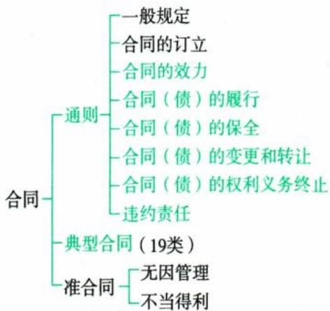

flowchart

```mermaid
graph TD
    A["合同"] --> B["通则"]
    A --> C["典型合同（19类）"]
    A --> D["准合同"]
    B --> E["一般规定"]
    B --> F["合同的订立"]
    B --> G["合同的效力"]
    B --> H["合同（债）的履行"]
    B --> I["合同（债）的保全"]
    B --> J["合同（债）的变更和转让"]
    B --> K["合同（债）的权利义务终止"]
    B --> L["违约责任"]
    C --> M["无因管理"]
    C --> N["不当得利"]
```

[图释] 合同编（第 463—988 条）共 526 条，约占整个《民法典》的 41.75%。包括三个分编：

第一分编：通则（第463—594条，共132条，约占合同编的 $25\%$ ）包括8章，分别是：一般规定；合同的订立；合同的效力；合同的履行；合同的保全；合同的变更和转让；合同的权利义务终止；违约责任。

第二分编：典型合同（第595—978条，共384条，约占合同编的73%）包括19章，分别是买卖合同；供用电、水、气、热力合同；赠与合同；借款合同；保证合同；租赁合同；融资租赁合同；保理合同；承揽合同；建设工程合同；运输合同；技术合同；保管合同；仓储合同；委托合同；物业服务合同；行纪合同；中介合同；合伙合同。

第三分编：准合同（第979—988条，共10条，约占合同编的 $2\%$ ）包括2章，分别是无因管理和不当得利。

## 第一分编

#### 通 则

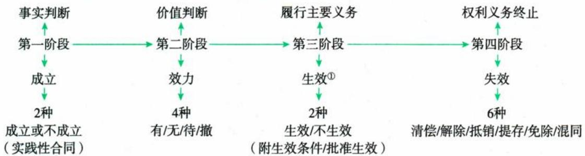

flowchart

```mermaid
graph TD
    A["事实判断"] --> B["第一阶段"]
    B --> C["成立"]
    C --> D["2种 成立或不成立 (实践性合同)"]
    E["价值判断"] --> F["第二阶段"]
    F --> G["效力"]
    G --> H["4种 有/无/待/撤"]
    I["履行主要义务"] --> J["第三阶段"]
    J --> K["生效①"]
    K --> L["2种 生效/不生效 (附生效条件/批准生效)"]
    M["权利义务终止"] --> N["第四阶段"]
    N --> O["失效"]
    O --> P["6种 清偿/解除/抵销/提存/免除/混同"]
```

### 12 专题十二 合同的基本原理

#### 复习提要

合同编调整因合同产生的民事关系。本专题主要涉及两个问题：1. 合同编的适用范围；2. 合同的学理分类。其中，重点为合同的学理分类。该部分乃合同编的基础知识，也是学好合同编的前提。在考试不断完善的情况下，考试题目不断向“理论化”倾斜，因此，考生对于本专题必须潜心学习。

#### 一、适用范围①

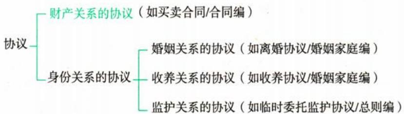

flowchart

```mermaid
graph TD
    A["协议"] --> B["财产关系的协议（如买卖合同/合同编）"]
    A --> C["身份关系的协议"]
    C --> D["婚姻关系的协议（如离婚协议/婚姻家庭编）"]
    C --> E["收养关系的协议（如收养协议/婚姻家庭编）"]
    C --> F["监护关系的协议（如临时委托监护协议/总则编）"]
```

(合同编的适用范围法律关系示意图)

合同是民事主体之间设立、变更、终止民事法律关系的协议。合同编的适用范围乃“财产协议”而不包括“身份协议”。有关婚姻关系、收养关系的协议由婚姻家庭编调整；有关监护关系的协议由总则编调整。没有规定，可以根据其性质参照适用合同编规定。

#### 二、合同的学理分类

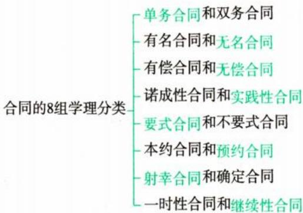

flowchart

```mermaid
graph TD
    A["合同的8组学理分类"] --> B["单务合同和双务合同"]
    A --> C["有名合同和无名合同"]
    A --> D["有偿合同和无偿合同"]
    A --> E["诺成性合同和实践性合同"]
    A --> F["要式合同和不要式合同"]
    A --> G["本约合同和预约合同"]
    A --> H["射幸合同和确定合同"]
    A --> I["一时性合同和继续性合同"]
```

(合同的学理分类体系框架图)

#### （一）单务合同和双务合同

区分标准：合同双方当事人是否互负对待给付义务。

1. 单务合同。

单务合同，是指仅一方负担债务，对方不负担债务的合同。最典型的单务合同是赠与合同。

2. 双务合同。

双务合同，是指双方互负债务的合同。最典型的双务合同是买卖合同。

#### (二) 有名合同和无名合同①

区分标准：法律是否赋予特定名称并设有具体规则。

1. 有名合同。

有名合同，又称典型合同，是指在法律上已赋予特定名称并设有具体规则的合同。《民法典》合同编第二分编共规定了19类典型合同。分别是买卖合同；供用电、水、气、热力合同；赠与合同；借款合同；保证合同；租赁合同；融资租赁合同；保理合同；承揽合同；建设工程合同；运输合同；技术合同；保管合同；仓储合同；委托合同；物业服务合同；行纪合同；中介合同；合伙合同。

除《民法典》合同编第二分编规定的 19 类典型合同外，其他民商事单行法律亦规定了大量有名合同，如旅游合同、劳动合同、保险合同等。

2. 无名合同。

无名合同，又称非典型合同，是指在法律上尚未确立一定的名称和具体（专门）规则的合同。最典型的无名合同包括借用合同、培训协议、美容服务协议、对赌协议、医疗服务合同、餐饮服务合同、住宿服务合同、储蓄合同、借新还旧合同、让与担保合同、合作开发房地产合同、联营合同、代持股协议、聘用/任合同、保险柜使用协议等。其中，借用合同，是指当事人约定一方以物无偿贷与他人使用，他方于使用后返还其物之契约。

关于无名合同的法律适用，《民法典》或其他法律没有明文规定的合同，适用合同编通则的规定，并可以参照适用（类推适用）合同编典型合同或其他法律最相类似合同的规定，即类推适用（《民法典》第467条）。

[例] 孟某、马某双方达成协议，约定孟某将房屋无偿提供给马某居住，马某则无偿教孟某的女儿小海螺弹钢琴。该协议的性质属于无名合同，应适用合同编通则的规定。同时，可以参照适用合同编关于租赁合同的规定。

#### (三)有偿合同和无偿合同

区分标准：是否存在对价。

1. 有偿合同。

有偿合同，是指双方互为给付而取得对价的合同。最典型的有偿合同就是买卖合同。

2. 无偿合同。

无偿合同，是指一方只为给付而无对价的合同。无偿合同包括3个，分别是赠与合同、担保合同和借用合同。可有偿可无偿的合同包括3个，分别是委托合同、保管合同、自然人之间的借款合同（互助性）。

#### （四）诺成性合同和实践性合同

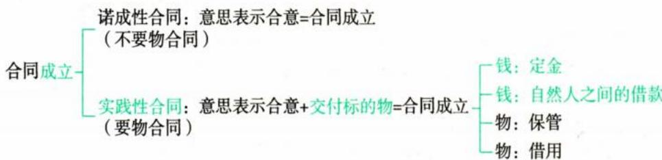

flowchart

```mermaid
graph TD
    A["合同成立"] --> B["诺成性合同：意思表示合意=合同成立\n（不要物合同）"]
    A --> C["实践性合同：意思表示合意+交付标的物=合同成立\n（要物合同）"]
    C --> D["钱：定金"]
    C --> E["钱：自然人之间的借款"]
    C --> F["物：保管"]
    C --> G["物：借用"]
```

(诺成性合同和实践性合同区别示意图)

区分标准：成立标志。

#### 1. 诺成性合同。

诺成性合同，又称非要物合同/不要物合同，是指只要行为人意思表示合意合同即成立。诺成性合同（非要物合同/不要物合同）就是“一诺即成/一诺千金”，即意思表示合意=合同成立。

#### 2. 实践性合同。

实践性合同，又称要物合同，是指除意思表示合意外，还需以物的交付为成立要件的合同。实践性合同（要物合同）的本质系赋予当事人无责任反悔权，即意思表示合意+交付标的物=合同成立。典型的实践性合同共包括4个，两个与钱有关，即定金合同（交付系履行的前提）和自然人之间的借款合同（互助性+社会一般理性人道德情感的维护/法律不得强迫任何人做一个好人）；两个与物有关，即保管合同和借用合同。

区分意义：法律规定实践性合同（要物合同）的立法目的在于将标的物的交付作为督促当事人审慎交易的途径。

[例 1] 孟某前往北京一家宝马轿车 4S 店看车，后孟某和 4S 店签订了书面定金合同，约定第二天孟某交付定金 10 万元，4S 店将一台宝马轿车出卖给孟某。第二天，孟某反悔，不想买车了。4S 店不可以基于书面定金合同追究孟某的违约责任。因为定金合同属于实践性合同，定金合同自交付定金时成立，在交付定金之前，孟某随时可以反悔。

[例 2] 孟某向马某借款 100 万元，双方签订了书面借款合同，约定第二天马某将 100 万元交付给孟某。第二天，马某反悔。孟某不可以基于书面借款合同追究马某的违约责任。因为自然人之间的借款合同属于实践性合同，借款合同自提供（交付）借款时成立，在提供（交付）借款之前，马某随时可以反悔。

#### (五)要式合同和不要式合同

区分标准：是否需要特定形式。

#### 1. 要式合同（主要是书面合同）。

要式合同，是指法律要求必须具备一定形式的合同。最典型的要式合同是典型担保合同，包括抵押合同、质押合同、保证合同和定金合同。

#### 2. 不要式合同。

不要式合同，是指法律不要求必须具备一定形式的合同。最典型的不要式合同是买卖合同。

#### （六）本约合同和预约合同 $^{①}$

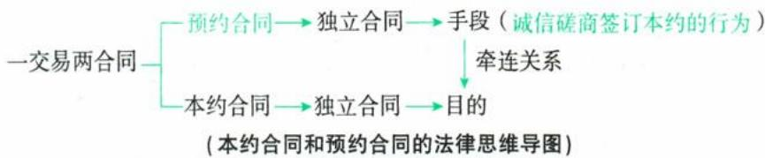

flowchart

```mermaid
graph TD
    A["一交易两合同"] --> B["预约合同"]
    A --> C["本约合同"]
    B --> D["独立合同"]
    C --> E["独立合同"]
    D --> F["手段（诚信磋商签订本约的行为）"]
    E --> G["目的"]
    F --> H["牵连关系"]
```

#### 1. 本约合同。

本约合同，是指因履行预约而订立的合同。

#### 2. 预约合同。

实践中，为了规避法律的监管、审批等行政手续（如商品房买卖合同中的预售许可证②）或处于合同强势或优势地位的一方想保留一个反悔权，往往会采用预约手段。预约合同，是指约定将来订立一定合同的合同。当事人约定在将来一定期限内订立合同的认购书、订购书、预订书等，构成预约合同。当事人一方不履行预约合同约定的订立合同义务的，对方可以请求其承担预约合同的违约责任（《民法典》第495条）。

[萌主点拨] 违反预约构成违约，可以追究违约责任，但不得强制缔约（不得请求继续履行/行为无法直接强制）。

#### >> 随堂练习

甲公司未取得商铺预售许可证，便与李某签订了《商铺认购书》，约定李某支付认购金即可取得商铺优先认购权，商铺正式认购时甲公司应优先通知李某选购。双方还约定了认购面积和房价，但对楼号、房型未作约定。李某依约支付了认购金。甲公司取得预售许可证后，未通知李某前来认购，将商铺售罄。关于《商铺认购书》，下列哪一表述是正确的？（2012-3-10，单）③

A. 无效，因甲公司未取得预售许可证即对外销售
B. 不成立，因合同内容不完整
C. 甲公司未履行通知义务，构成根本违约
D. 甲公司须承担继续履行的违约责任

#### (七) 射幸合同和确定合同

#### 1. 射幸合同。

射幸合同，又称机会性合同，是指给付的内容和范围在合同成立时并不确定，而是取决于合同成立后是否发生偶然事件的合同。最典型的射幸合同包括保险合同④、彩票合同和抽奖式有奖销售合同。

#### 2. 确定合同。

确定合同，又称实定合同，是指给付的内容和范围在合同成立时就已经确定的合同。

#### (八) 一时性合同和继续性合同

#### 1. 一时性合同。

一时性合同，是指时间因素对给付的内容和范围无影响，合同目的因一次给付即可实现的合同。在日常生活中大部分的合同均为一时性合同。最典型的一时性合同是买卖合同。

#### 2. 继续性合同。

继续性合同，是指给付的内容和范围因时间的延续而有变化，使得合同目的须经持续的给付才能实现的合同。典型的继续性合同包括借用合同；供用电、水、气、热力合同；租赁合同；保管合同；仓储合同；雇佣合同和劳动合同等。

### 13/专题十三 缔约过失责任

#### 复习提要

缔约过失责任作为一种法定之债，规定在《民法典》第三编合同第一分编通则第二章合同的订立（第500条和第501条）共2条，在考试中几乎每年必考。本专题主要涉及两个问题：1. 缔约过失责任的基本原理；2. 缔约过失责任的类型，特别是其中的合同成立型的缔约过失责任乃重中之重，在复习过程中必须予以重点学习。

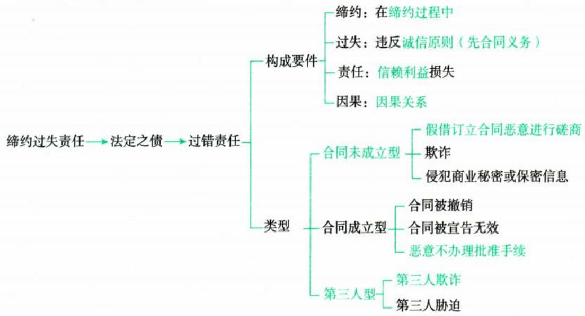

flowchart

```mermaid
graph TD
    A["缔约过失责任"] --> B["法定之债"]
    B --> C["过错责任"]
    C --> D["构成要件"]
    D --> E["缔约：在缔约过程中"]
    D --> F["过失：违反诚信原则（先合同义务）"]
    D --> G["责任：信赖利益损失"]
    D --> H["因果：因果关系"]
    C --> I["类型"]
    I --> J["合同未成立型"]
    J --> K["假借订立合同恶意进行磋商"]
    J --> L["欺诈"]
    J --> M["侵犯商业秘密或保密信息"]
    I --> N["合同成立型"]
    N --> O["合同被撤销"]
    N --> P["合同被宣告无效"]
    N --> Q["恶意不办理批准手续"]
    I --> R["第三人型"]
    R --> S["第三人欺诈"]
    R --> T["第三人胁迫"]
```

#### 一、缔约过失责任的基本原理

#### (一) 含义

缔约过失责任作为一种法定责任（法定之债），是指在缔约过程中，一方违反诚信原则导致对方信赖利益的损失，依法应当承担赔偿责任。

#### (二) 归责原则

缔约过失责任因一方违反诚信原则而发生，属于典型的过错责任。

#### (三) 构成要件①

1. 行为发生于缔约过程中。

缔约过失责任原则上发生于缔约过程中，双方必须已经开始进行磋商。如双方并未开始磋商（题目中关键词为：商谈、谈判、洽谈、接洽），则不存在缔约过失责任问题。

2. 一方违反基于诚信原则产生的先合同义务。

先合同义务（法定的消极义务），是指当事人在缔约阶段，按照诚信原则应承担的说明、告知（通知）、提请注意、保密、保护、协助、照顾、忠实等义务（一般不能起诉请求实际履行）。先合同义务产生的基础系诚信原则（帝王条款/《民法典》第7条）而非合同义务。

3. 导致对方信赖利益的损失。

信赖利益，是指当事人相信民事法律行为有效成立，而因某种事实之发生，该民事法律行为（尤其是合同）不成立或无效而生之损失，又称消极利益之损害（消极的契约利益）。其范围包括订约费用、准备履行所需费用等直接损失或另失订约机会的损失。具体而言，订约费用包括邮电费用，赴订约地或察看合同标的物所支出之费用。准备履行所需费用包括为运送标的物或受领对方给付所支出之费用。订约机会主要是指另行订立合同所产生的差价损失。

4. 一方违反先合同义务与他方所受损失之间存在因果关系。

#### 二、缔约过失责任的类型

#### （一）合同未成立型的缔约过失责任

1. 假借订立合同，恶意进行磋商。

恶意磋商，是指非出于订立合同之目的而借订立合同之名与他人磋商，其真实目的，是为阻止对方与他人订立合同，或使对方贻误商机，或仅为戏耍对方。

[萌主点拨] 恶意磋商与正常的商业风险完全不同，正常的商业风险无须承担缔约过失责任。

#### >> 随堂练习

德凯公司拟为新三板上市造势，在无真实交易意图的情况下，短期内以业务合作为由邀请多家公司来其主要办公地点洽谈。其中，真诚公司安排授权代表往返十余次，每次都准备了详尽可操作的合作方案，德凯公司佯装感兴趣并屡次表达将签署合同的意愿，但均在最后一刻推脱拒签。期间，德凯公司还将知悉的真诚公司的部分商业秘密不当泄露。对此，下列哪一说法是正确的？(2017-3-12，单)②

A. 未缔结合同，则德凯公司就磋商事宜无需承担责任
B. 虽未缔结合同，但德凯公司构成恶意磋商，应赔偿损失
C. 未缔结合同，则商业秘密属于真诚公司自愿披露，不应禁止外泄
D. 德凯公司也付出了大量的工作成本，如被对方主张赔偿，则据此可主张抵销

2. 故意隐瞒与订立合同有关的重要事实或提供虚假情况。

[例] 马某欲购买孟某的汽车。经协商，马某同意3天后签订正式的买卖合同，并交付2000元给孟某，孟某出具的收条上写明为：“收到马某订金2000元。”3天后，马某了解到孟某故意隐瞒了该车证照不齐的情况，故拒绝签订合同。马某有权请求孟某赔偿在买车过程中受到的损失。

3. 泄露或不正当使用对方商业秘密或其他应当保密的信息。

当事人为了准备或商议订立合同时，负有依诚信原则提供资讯，保守秘密等先合同义务。当事人在订立合同过程中知悉的商业秘密或其他应当保密的信息，无论合同是否成立，不得泄露或不正当地使用。泄露、不正当地使用该商业秘密或信息造成对方损失的，应当承担赔偿责任。

[例] 甲企业与乙企业就彩电购销协议进行洽谈，期间乙采取了保密措施的市场开发计划被甲得知。甲遂推迟与乙签约，开始有针对性地吸引乙的潜在客户，导致乙的市场份额锐减。甲的行为侵犯了乙的商业秘密，应承担缔约过失责任。

#### （二）合同成立型的缔约过失责任

#### 1. 合同被撤销。

根据民法基本原理，合同被撤销后，自始无效。此时，只能请求对方承担缔约过失责任，而不能请求承担违约责任。

[例] 喜好网球和游泳的孟某从众森公司购买幸福小区商品房一套，交房时发现购房时众森公司售楼部所展示的该小区模型中的网球场和游泳池并不存在。经查，该小区设计中并无网球场和游泳池。孟某如要求退房，有权请求众森公司承担缔约过失责任。

2. 合同被宣告无效（担保合同）。

根据民法基本原理，合同被宣告无效后，自始无效。此时，亦只能请求对方承担缔约过失责任，而不能请求承担违约责任。

3. 恶意不办理批准手续（附生效条件的合同）①。

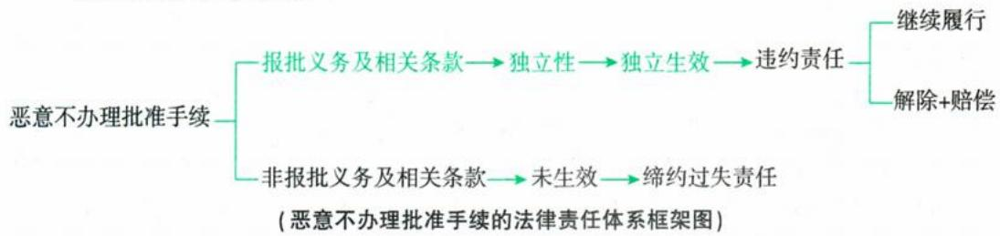

flowchart

```mermaid
graph TD
    A["恶意不办理批准手续"] --> B["报批义务及相关条款"]
    A --> C["非报批义务及相关条款"]
    B --> D["独立性"]
    D --> E["独立生效"]
    E --> F["违约责任"]
    F --> G["继续履行"]
    F --> H["解除+赔偿"]
    C --> I["未生效"]
    I --> J["缔约过失责任"]
```

(1) 适用范围。

基于国家对社会管理的需要，同时实现特定（特殊）的行政管理目标，对于特定合同交易必须进行行政管控。司法实践中常见的批准生效合同包括以划拨方式取得的土地使用权转让（《城市房地产管理法》第40条）、金融企业超过法定比例（5%以上）的股权转让（《商业银行法》第28条）、外商投资企业股权转让（《外商投资企业纠纷案件规定（一）第5条》、国有股权转让（《企业国有资产监督管理暂行条例》第23条）。

#### (2) 合同效力。

本质上而言，批准是行政机关的监管行为，是否批准属于行政自由裁量权，不属于当事人意思自治的范畴。学界和实务界普遍认为，行政机关的批准系合同的特殊（特别）法定生效要件（条件），即在批准前合同成立有效但未生效（附生效条件的合同）。因此，未经批准的合同成立有效但未生效而非无效。

#### (3) 处理。

实践中，负有报批义务的一方当事人往往存在投机心态，报批对自己有利的，就去报批；对自己不利的，就不去报批。结果是使不诚信的当事人从其不诚信行为中获得利益，显然不妥。因此，法律规定报批义务及相关条款独立生效规则①。

依照法律、行政法规的规定，合同应当办理批准等手续的，依照其规定。未办理批准等手续影响合同生效的，不影响合同中履行报批等义务条款以及相关条款的效力。应当办理申请批准等手续的当事人未履行义务的，对方可以请求其承担违反该义务的责任（《民法典》第502条第2款和《民法典合同编通则解释》第12条）。

[萌主点拨] 恶意不办理批准手续的，报批义务条款独立生效，追究违约责任；非报批义务条款未生效，追究缔约过失责任。

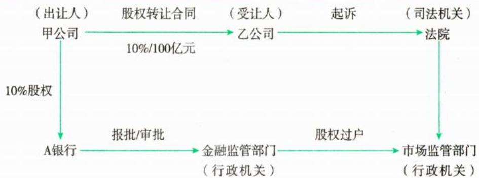

flowchart

```mermaid
graph TD
    A["甲公司"] -->|10%股权| B["A银行"]
    A -->|股权转让合同 10%/100亿元| C["乙公司"]
    C -->|起诉| D["法院"]
    D --> E["市场监管部门 (行政机关)"]
    B -->|报批/审批| F["金融监管部门 (行政机关)"]
    F -->|股权过户| E
    C -->|股权转让合同 10%/100亿元| C
    D -->|法院| E
```

(批准生效合同当事人法律关系示意图)

[例] 2025年1月2日，甲公司将其持有的A银行 $10\%$ 的股权转让给乙公司。双方约定，价款100亿元，如一方违约，应向对方支付10亿元违约金。同时约定，乙公司先向甲公司支付50亿元，甲公司在收到乙公司付款后30日内向金融监管部门办理批准登记手续。金融监管部门批准后，乙公司支付剩余50亿元尾款，甲公司在收到乙公司付款后30日内协助办理股权过户登记手续。如甲公司未依约履行报批义务，应当单独承担200万元违约金。关于本案：

1. 在甲公司履行报批义务前，甲公司和乙公司签订的股权转让合同成立但未生效。
2. 虽然甲公司和乙公司签订的股权转让合同未生效，但报批义务及相关条款独立生效。
3. 如甲公司依约履行报批义务，但批准机关不批准的，甲公司和乙公司签订的股权转让合同确定不发生效力。
4. 如甲公司迟延履行报批义务导致批准机关不批准的，乙公司有权请求甲公司承担缔约过失责任。

#### （三）第三人型缔约过失责任

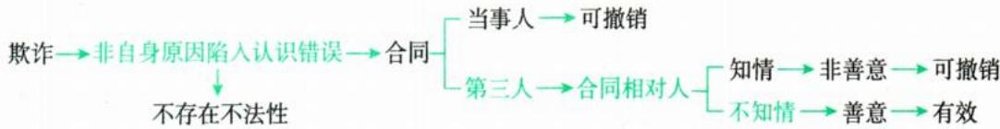

flowchart

```mermaid
graph TD
    A["欺诈"] --> B["非自身原因陷入认识错误"]
    B --> C["合同"]
    C --> D["当事人"]
    D --> E["可撤销"]
    C --> F["第三人"]
    F --> G["合同相对人"]
    G --> H["知情"]
    H --> I["非善意"]
    I --> J["可撤销"]
    G --> K["不知情"]
    K --> L["善意"]
    L --> M["有效"]
    B --> N["不存在不法性"]
```

(欺诈体系框架图)

第三人实施欺诈行为，使一方在违背真实意思的情况下实施的民事法律行为，对方知道或应当知道该欺诈行为的，受欺诈方有权请求法院或仲裁机构予以撤销（《民法典》第149条）。

第三人实施欺诈、胁迫行为，使当事人在违背真实意思的情况下订立合同，受到损失的当事人请求第三人承担赔偿责任的，法院依法予以支持；当事人亦有违背诚信原则的行为的（混合过错/与有过失），法院应当根据各自的过错确定相应的责任。但是，法律、司法解释对当事人与第三人的民事责任另有规定的，依照其规定（《民法典合同编通则解释》第5条）。

[例] 王某是红冈市务工人员，在红冈市工作10余年，有较多存款，计划在该市购置房产。丁某是红冈市房地产开发企业天蓝公司（以下简称天蓝公司）负责人的亲戚，听说王某欲购房，便谎称天蓝公司开发的楼盘环境优美、生活便利，极力劝诱王某从天蓝公司处购房。王某轻信此言，便与天蓝公司签订房屋买卖合同。天蓝公司对此毫不知情。天蓝公司于2018年2月1日向王某交付房屋，王某随后搬入居住。然而，王某入住后发现该小区设施简陋，环境杂乱，与丁某的描述有着天壤之别，遂觉受骗。根据上述案情，请回答如下问题：

①天蓝公司与王某之间的房屋买卖合同效力如何？

答：合法有效。因为天蓝公司不知道丁某对王某实施欺诈行为（《民法典》第149条）。

②王某的损失向谁主张？责任性质如何？

答：向丁某主张，责任性质为第三人缔约过失责任（有学者认为是侵权责任）。

### 14 专题十四 合同的订立

#### 复习提要

合同的订立规定在《民法典》第三编合同第一分编通则第二章（第469—501条），共33条。同时，《民法典合同编通则解释》第3—10条，共8条亦对合同的订立进行了补充细化规定。本专题主要涉及四个问题：1. 要约和要约邀请；2. 合同订立的程序；3. 合同成立的时间和地点；4. 合同的内容（条款）。本专题内容并非考试的重点，在复习过程中，掌握一些重点细节即可。

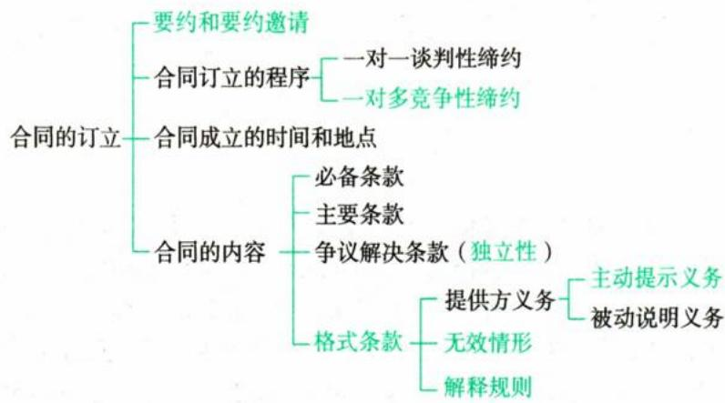

flowchart

```mermaid
graph TD
    A["合同的订立"] --> B["要约和要约邀请"]
    A --> C["合同订立的程序"]
    C --> D["一对一谈判性缔约"]
    C --> E["一对多竞争性缔约"]
    A --> F["合同成立的时间和地点"]
    A --> G["合同的内容"]
    G --> H["必备条款"]
    G --> I["主要条款"]
    G --> J["争议解决条款（独立性）"]
    G --> K["格式条款"]
    K --> L["提供方义务"]
    K --> M["无效情形"]
    K --> N["解释规则"]
    L --> O["主动提示义务"]
    L --> P["被动说明义务"]
```

#### 一、要约和要约邀请①

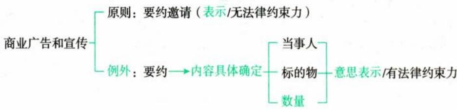

flowchart

```mermaid
graph TD
    A["商业广告和宣传"] --> B["原则：要约邀请（表示/无法律约束力）"]
    A --> C["例外：要约 → 内容具体确定"]
    C --> D["当事人"]
    C --> E["标的物"]
    C --> F["数量"]
    D --> G["意思表示/有法律约束力"]
```

(商业广告和宣传体系框架图)

要约VS要约邀请

<table><tr><td>项目</td><td>要约(主动出击)</td><td>要约邀请(被动引诱)</td></tr><tr><td>法律依据</td><td>《民法典》第472条</td><td>《民法典》第473条</td></tr><tr><td>含义</td><td>希望与他人订立合同的意思表示,该意思表示应当符合下列条件:(1)内容具体确定(目的意思,包括当事人、标的物和数量三项必备要素);(2)表明经受要约人承诺,要约人即受该意思表示约束(效果意思)</td><td>希望他人向自己发出要约的表示</td></tr><tr><td>目的</td><td>缔结合同</td><td>意思通知</td></tr><tr><td>步骤</td><td>第一步:要约;第二步:承诺</td><td>第一步:邀请要约;第二步:要约;第三步:承诺</td></tr><tr><td>具体类型</td><td>自动售货机、超市自助寄包机、ATM自助存取款机、自助停车机等(现货要约)</td><td>1. 拍卖公告;2. 招标公告;3. 招股说明书;4. 债券募集办法;5. 基金招募说明书;6. 寄送的价目表;7. 商业广告和宣传(内容具体确定,包括当事人、标的物和数量三项必备要素的,变为要约)</td></tr></table>

#### >> 随堂练习

甲在校内的二手平台上发布了信息出售自己的自行车，价款1000元，附上了发票照片和自行车照片，并附言“诚信出售，先到先得”。乙看到消息后，通过微信联系甲，出价900元。甲不同意。之后二者又来回拉扯了几次。几天后，乙给甲发微信“就按你说的价来，1100元”。后二人线下见面，乙转账1000元给甲，甲主张还差100元并出示了微信聊天记录。乙表示是自己打错了。关于本案，下列哪一说法是正确的？（2023金题-2-1-11，单）①

A. 两人间成立了 1100 元的合同
B. 甲在二手平台上发布的信息属于要约邀请
C. 两人未达成合意
D. 两人间成立了 1000 元的合同

#### 二、合同订立的程序

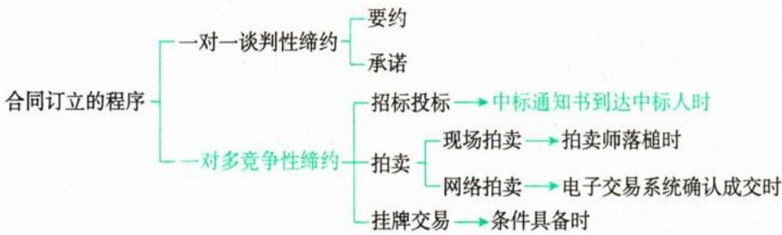

flowchart

```mermaid
graph TD
    A["合同订立的程序"] --> B["一对一谈判性缔约"]
    A --> C["一对多竞争性缔约"]
    B --> D["要约"]
    B --> E["承诺"]
    C --> F["招标投标"]
    C --> G["拍卖"]
    F --> H["中标通知书到达中标人时"]
    G --> I["现场拍卖"]
    G --> J["拍卖师落槌时"]
    G --> K["网络拍卖"]
    G --> L["电子交易系统确认成交时"]
    C --> M["挂牌交易"]
    C --> N["条件具备时"]
```

(合同订立的程序体系框架图)

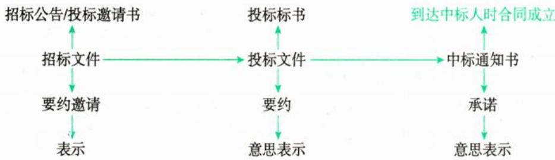

flowchart

```mermaid
graph TD
    A["招标公告/投标邀请书"] --> B["招标文件"]
    B --> C["要约邀请"]
    C --> D["表示"]
    E["投标书"] --> F["投标文件"]
    F --> G["要约"]
    G --> H["意思表示"]
    I["到达中标人时合同成立"] --> J["中标通知书"]
    J --> K["承诺"]
    K --> L["意思表示"]
```

(建设工程施工合同招投标过程流程图)

#### (一) 要约

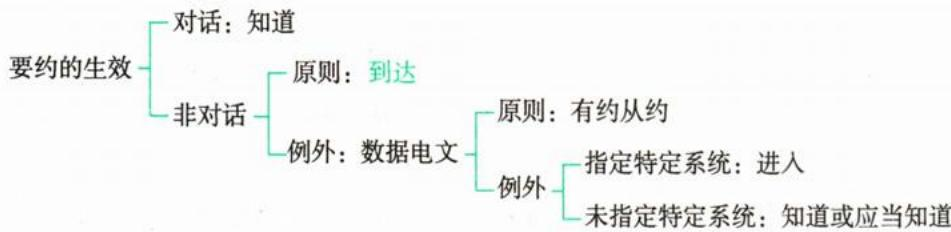

flowchart

```mermaid
graph TD
    A["要约的生效"] --> B["对话：知道"]
    A --> C["非对话"]
    C --> D["原则：到达"]
    C --> E["例外：数据电文"]
    E --> F["原则：有约从约"]
    E --> G["例外"]
    G --> H["指定特定系统：进入"]
    G --> I["未指定特定系统：知道或应当知道"]
```

(要约的生效体系框架图)

[例] 家住北京市海淀区的孟某于2025年4月1日在家中书写一份要约（意思表示/有法律约束力），内容为欲将自己的手表以27500元出售给位于广州市越秀区的周某。孟某于4月2日将信件投入邮筒，该信件于4月5日到达周某住所的邮箱内。周某于4月8日将该信件拆封后获悉该要约的内容。根据上述案情及示意图，请回答如下问题：

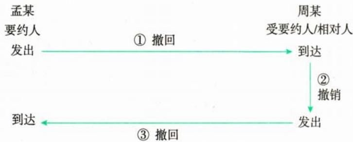

flowchart

```mermaid
graph TD
    A["孟某 要约人 发出"] -->|① 撤回| B["周某 受要约人/相对人"]
    B -->|② 撤销| C["发出"]
    C -->|③ 撤回| D["到达"]
```

(要约的撤回与撤销示意图)

(1) 孟某的要约何时生效?

答：4月5日。因为要约以非对话方式进行的，采用“到达主义”。

(2) 在该要约到达周某前如孟某后悔，是否可以撤回该要约？

答：可以。因为要约撤回的对象是尚未生效的要约，即尚未到达受要约人。

(3) 在该要约到达周某后如孟某后悔，在何种情况下可以撤销该要约？

答：周某作出承诺前。因为要约撤销的对象是已生效但尚未获得承诺的要约。

(4) 在何种情形下孟某不得撤销该要约?

答：不得撤销的要约包括3类情形，即“定期限；有明示；有理由”：

① “定期限” 代表要约人确定承诺期限（如广告有效期 10 天）；

② “有明示”代表要约人以其他形式明示要约不可撤销；

③ “有理由”代表受要约人有理由认为要约是不可撤销的，并已经为履行合同做了合理准备工作（有交易习惯①）。

(5) 孟某的要约在何种情况下会失效?

答：要约失效的情形包括4类，即“被拒绝；被撤销；期满不答；变实质”。

① “被拒绝”代表要约被拒绝；

② “被撤销”代表要约被依法撤销；

③ “期满不答” 代表承诺期限届满，受要约人未作出承诺；

④ “变实质”代表受要约人对要约的内容作出实质性变更。有关合同标的、数量、质量、价款或报酬、履行期限、履行地点和方式、违约责任和解决争议方法等的变更，是对要约内容的实质性变更（《民法典》第488条）。

#### (二) 承诺

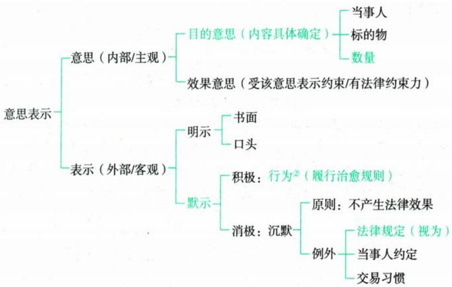

flowchart

```mermaid
graph TD
    A["意思表示"] --> B["意思（内部/主观）"]
    A --> C["表示（外部/客观）"]
    B --> D["目的意思（内容具体确定）"]
    B --> E["效果意思（受该意思表示约束/有法律约束力）"]
    C --> F["明示"]
    C --> G["默示"]
    F --> H["书面"]
    F --> I["口头"]
    G --> J["积极：行为²（履行治愈规则）"]
    G --> K["消极：沉默"]
    J --> L["原则：不产生法律效果"]
    J --> M["例外：法律规定（视为）"]
    M --> N["当事人约定"]
    M --> O["交易习惯"]
    D --> P["当事人"]
    D --> Q["标的物"]
    D --> R["数量"]
```

(意思表示的体系框架图)

[例] 家住北京市海淀区的孟某于2025年4月1日在家中书写一份要约，内容为欲将自己的手表以27500元出售给位于广州市越秀区的周某。孟某于4月2日将信件投入邮筒，该信件于4月5日到达周某住所的邮箱内。周某于4月8日将该信件拆封后获悉该要约的内容。

周某经过考虑后于4月9日回复信件上书写两个大字“可以”（完全同意要约的意思表示/承诺/有法律约束力/《民法典》第479条），并于当天将该信件投入邮筒。该信件于4月12日到达孟某住所的邮箱内。但由于孟某工作较忙一直未发现该信件，直至4月21日方才将该信件拆封并获悉该承诺的内容。根据上述案情，请回答如下问题：

(1) 周某除采用 “通知” 方式承诺外，还可采取何种方式表明欲购买手表的意思表示？

答：行为（《民法典》第480、490条）。

[萌主点拨] 履行治愈规则，是指采用合同书形式订立合同，在签字或盖章之前，当事人一方已经履行主要义务，对方接受的，该合同成立。

(2) 在该承诺到达孟某前如周某后悔，是否可以撤回该承诺？

答：可以。因为承诺撤回的对象是已发出但尚未生效的承诺（《民法典》第485条）。

[萌主点拨]
撤回 VS 撤销

<table><tr><td>项目</td><td>撤回</td><td>撤销</td></tr><tr><td>要约</td><td>可以</td><td>可以</td></tr><tr><td>承诺</td><td>可以</td><td>不可以(承诺一经到达要约人,合同即成立,无法撤销)</td></tr></table>

（3）如孟某的要约中载明：“如欲购买请于4月8日前回复（定期限）”，则周某的回复如何处理？

答：视为新要约（反要约）。因为受要约人超过承诺期限发出承诺的属于承诺迟延，承诺迟延的视为新要约（反要约）。

（4）如孟某的要约中载明：“如欲购买请于4月15日前回复（定期限）”，但由于邮政公司的原因导致周某的承诺于4月20日方才到达孟某住所，则周某的回复如何处理？

答：承诺有效。因为受要约人在承诺期限内发出承诺，按照通常情形能够及时到达要约人，但是因其他原因承诺到达要约人时超过承诺期限的属于承诺迟到，承诺迟到原则上不影响承诺的效力。

##### [萌主点拨]

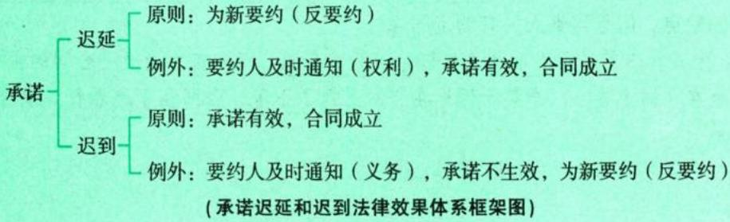

flowchart

```mermaid
graph TD
    A["承诺"] --> B["迟延"]
    A --> C["迟到"]
    B --> D["原则：为新要约（反要约）"]
    B --> E["例外：要约人及时通知（权利），承诺有效，合同成立"]
    C --> F["原则：承诺有效，合同成立"]
    C --> G["例外：要约人及时通知（义务），承诺不生效，为新要约（反要约）"]
    H["（承诺迟延和迟到法律效果体系框架图）"]
```

承诺迟延 VS 承诺迟到

<table><tr><td>项目</td><td>承诺迟延</td><td>承诺迟到</td></tr><tr><td>发生原因</td><td>受要约人本人能够控制的原因</td><td>受要约人本人不能控制的原因</td></tr><tr><td>受要约人合理预期</td><td>受要约人知道或应当知道其承诺到达要约人超过承诺期限,承诺不生效,合同不成立</td><td>受要约人能够合理预期承诺于承诺期限内到达要约人,承诺生效,合同成立,甚至有可能为合同履行而预做准备</td></tr><tr><td>法律效果</td><td>原则上为新要约(反要约),除非要约人及时通知受要约人该承诺有效</td><td>原则上承诺有效,合同成立,除非要约人及时通知受要约人因承诺超过期限不接受该承诺</td></tr><tr><td>及时通知</td><td>权利</td><td>义务</td></tr></table>

#### 三、合同成立的时间和地点①

#### (一) 合同成立的时间

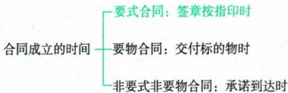

flowchart

```mermaid
graph TD
    A["合同成立的时间"] --> B["要式合同：签章按指印时"]
    A --> C["要物合同：交付标的物时"]
    A --> D["非要式非要物合同：承诺到达时"]
```

(合同的成立时间体系框架图)

1. 要式合同（书面合同）。

当事人采用合同书形式订立合同的，自当事人均签名、盖章或按指印时合同成立。

2. 要物合同（实践性合同）。

实践性合同，即定金合同、自然人之间的借款合同、保管合同和借用合同，自当事人交付标的物时，合同成立。

3. 非要式非要物合同。

当事人既不采用书面形式，亦非实践性合同的，自承诺到达时合同成立。

#### (二) 合同成立的地点

承诺生效的地点为合同成立的地点。采用数据电文形式订立合同的，收件人的主营业地为合同成立的地点；没有主营业地的，其住所地为合同成立的地点。当事人另有约定的，按照其约定。当事人采用合同书形式订立合同的，最后签字、盖章或按指印的地点为合同成立的地点，但是当事人另有约定的除外。

[例] 张某和李某采用书面形式签订一份买卖合同，双方在甲地谈妥合同的主要条款，张某于乙地在合同上签字，李某于丙地在合同上摁了手印，合同在丁地履行。该合同的签订地为丙地。

#### 四、合同的内容（条款）

#### （一）必备条款（要素）

当事人对合同是否成立存在争议，法院能够确定当事人名称或姓名、标的和数量的，一般应当认定合同成立。但法律另有规定或当事人另有约定的除外（《民法典合同编通则解释》第3条）。

[萌主点拨] 合同的必备条款包括当事人、标的（物）和数量三项。3 大必备条款不齐备，合同不成立。

#### (二) 主要条款 (常素)

合同的内容由当事人约定，一般包括下列条款：（1）当事人的姓名或名称和住所；（2）标的；（3）数量；（4）质量；（5）价款或报酬；（6）履行期限、地点和方式；（7）违约责任；（8）解决争议的方法。当事人可以参照各类合同的示范文本订立合同（《民法典》第470条）。

[萌主点拨] 合同的主要条款决定合同的类型。

#### (三) 争议解决条款

#### 1. 含义。

争议解决条款，是指合同当事人事先就合同争议的方式、程序和法律适用等事项安排的约定（《民法典》第507条）。

#### 2. 分类。

根据争议解决条款的内容不同，争议解决条款包括：

#### (1) 仲裁条款。

仲裁条款，是指当事人事先约定，就将来纠纷提交给仲裁机构加以解决的条款。仲裁条款包括以仲裁方式解决纠纷的选择和对仲裁机构的选择。

(2) 选择受诉法院条款（协议管辖条款）。

(3) 法律适用条款。

#### 3. 效力。

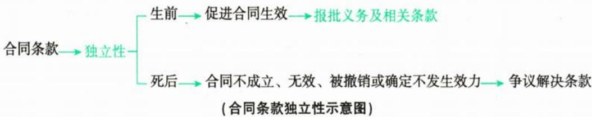

flowchart

```mermaid
graph TD
    A["合同条款"] --> B["独立性"]
    B --> C["生前"] --> D["促进合同生效"] --> E["报批义务及相关条款"]
    B --> F["死后"] --> G["合同不成立、无效、被撤销或确定不发生效力"] --> H["争议解决条款"]
```

对于争议解决条款而言，其最大的特点即其“独立性”。合同不成立、无效、被撤销或确定不发生效力的，不影响合同中有关解决争议方法的条款的效力。

#### (四) 格式条款①

1. 含义。

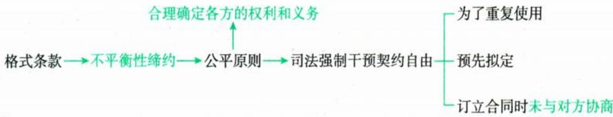

flowchart

```mermaid
graph LR
    A["格式条款"] --> B["不平衡性缔约"]
    B --> C["公平原则"]
    C --> D["司法强制干预契约自由"]
    D --> E["为了重复使用"]
    D --> F["预先拟定"]
    D --> G["订立合同时未与对方协商"]
    H["合理确定各方的权利和义务"] --> C
```

(格式条款判定法律思维导图)

格式条款，是指当事人为了重复使用预先拟定，并在订立合同时未与对方协商的条款（《民法典》第496条第1款）。

(1) 重复使用。

从事经营活动的当事人一方（商事主体/务必重点关注当事人的身份）仅以未实际重复使用为由主张其预先拟定且未与对方协商的合同条款不是格式条款的，法院不予支持。但是，有证据证明该条款不是为了重复使用而预先拟定的除外。

(2) 预先拟定。

当事人仅以合同系依据行政机关或行业协会推荐的合同示范文本制作为由主张该条款不是格式条款的，法院不予支持。

(3) 明确约定排除。

当事人仅以双方已经明确约定合同条款不属于格式条款为由主张该条款不是格式条款的，法院不予支持。

2. 提供方的法定义务。

(1) 内容。

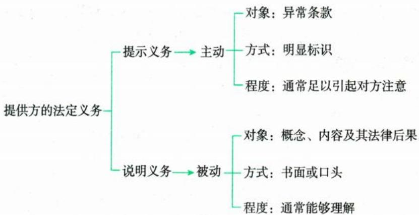

flowchart

```mermaid
graph TD
    A["提供方的法定义务"] --> B["提示义务"]
    A --> C["说明义务"]
    B --> D["主动"]
    D --> E["对象：异常条款"]
    D --> F["方式：明显标识"]
    D --> G["程度：通常足以引起对方注意"]
    C --> H["被动"]
    H --> I["对象：概念、内容及其法律后果"]
    H --> J["方式：书面或口头"]
    H --> K["程度：通常能够理解"]
```

(提供格式条款的一方的法定义务体系框架图)

[萌主点拨]
提供格式条款的一方的法定义务

<table><tr><td>项目</td><td>提示义务</td><td>说明义务</td></tr><tr><td>主动或被动</td><td>主动</td><td>被动</td></tr><tr><td>对象</td><td>免除或减轻其责任、排除或限制对方权利等与对方有重大利害关系的异常条款1</td><td>与对方有重大利害关系的异常条款的概念、内容及其法律后果(格式条款通常涉及大量的专业术语或晦涩难懂的词汇)</td></tr><tr><td>方式</td><td>文字、符号、字体等明显标识</td><td>书面或口头形式均可</td></tr><tr><td>程度</td><td>通常足以引起对方注意。实务中,提供格式条款的一方在合同文本中对异常条款配以区别于普通条款的文字、符号,但该字号明显小于普通条款,而且相关条款被放在合同文本极不显眼的位置,这就无法达到“通常足以引起对方注意”的程度</td><td>通常能够理解(否则很可能违背交易对方的交易目的和真实意思表示)</td></tr></table>

#### (2) 举证责任。

提供格式条款的一方对其已经尽到提示义务或说明义务承担举证责任。对于通过互联网等信息网络订立的电子合同，提供格式条款的一方仅以采取了设置勾选、弹窗等方式为由主张其已经履行提示义务或说明义务的，不予支持，但是其举证符合提示和说明义务规定的除外。

#### (3) 违反后果。

提供格式条款的一方未履行提示或说明义务，致使对方没有注意或理解与其有重大利害关系的条款的，对方可以主张该条款不成为合同的内容。

#### 3. 无效情形。

#### (1) 免除造成对方人身损害的。

[例] 张某（女，50周岁）与北京市一家美容院签订了一份吸脂手术服务合同（无名合同/非典型合同），该合同由美容院提供。其中，第58条规定，吸脂手术后，顾客有任何不良反应或人身损害的，美容院不承担责任。该服务合同第58条无效，因为免除造成对方人身损害的免责条款无效。

#### (2) 因故意或重大过失造成对方财产损失的。

如果允许合同当事人将故意或重大过失造成对方财产损失约定为免责事由，无异于纵容当事人违反诚信原则。因此，法律规定当事人的此种约定无效。

#### (3) 提供格式条款一方不合理地免除②或减轻其责任、加重对方责任③、限制对方主要权利。

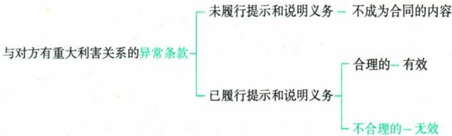

flowchart

```mermaid
graph TD
    A["与对方有重大利害关系的异常条款"] --> B["未履行提示和说明义务"]
    A --> C["已履行提示和说明义务"]
    B --> D["不成为合同的内容"]
    C --> E["合理的—有效"]
    C --> F["不合理—无效"]
```

(与对方有重大利害关系的异常条款法律关系体系框架图)

(4) 提供格式条款一方排除对方主要权利。

主要权利，是指当事人依法律规定、交易习惯或合同性质应当享有的权利，此类权利不能通过约定予以排除。排除对方主要权利的条款当然无效，不存在合理与不合理问题。如合同当事人发生纠纷后，有通过诉讼或仲裁救济的权利，这是当事人的主要权利。如果格式条款规定，纠纷发生后，不得提起诉讼或仲裁，则是排除了对方的主要权利，当然无效。

#### >> 随堂练习

甲与乙公司订立美容服务协议，约定服务期为半年，服务费预收后逐次计扣，乙公司提供的协议格式条款中载明“如甲单方放弃服务，余款不退”（并注明该条款不得更改）。协议订立后，甲依约支付5万元服务费。在接受服务1个月并发生费用8000元后，甲感觉美容效果不明显，单方放弃服务并要求退款，乙公司不同意。甲起诉乙公司要求返还余款。下列哪一选项是正确的？(2017-3-11，单)①

A. 美容服务协议无效
B. “如甲单方放弃服务，余款不退”的条款无效
C. 甲单方放弃服务无须承担违约责任
D. 甲单方放弃服务应承担继续履行的违约责任

#### 4. 解释。

格式条款的解释规则有其适用顺序，分别是：

第一步：非格式条款优先规则。在非格式条款有效的情况下，应当优先适用非格式条款的规定确定双方当事人的权利和义务。

第二步：通常解释规则。如果按照通常解释只有唯一的解释，那么这就是格式条款的解释结果，没有必要也不应当适用不利解释规则进行解释。

第三步：不利解释规则。对格式条款有两种以上解释的，应当作出不利于提供格式条款一方的解释。

### 15/专题十五 合同（债）的履行

#### 复习提要

合同（债）的履行规定在《民法典》第三编合同第一分编通则第四章（第509—534条），共26条。同时，《民法典合同编通则解释》第26—32条，共7条亦对合同（债）的履行进行了补充细化规定。本专题主要涉及五个问题：1. 电子合同的履行；2. 涉他合同的履行；3. 第三人代为履行（清偿）；4. 双务合同履行中的抗辩权；5. 情势变更。本专题属于考试中的重点和难点内容，特别是涉他合同的履行、第三人代为履行（清偿）以及情势变更，在复习过程中必须重点掌握。

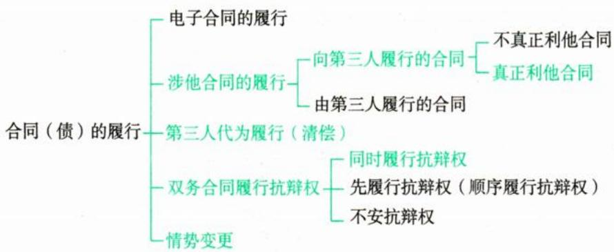

flowchart

```mermaid
graph TD
    A["合同（债）的履行"] --> B["电子合同的履行"]
    A --> C["涉他合同的履行"]
    A --> D["第三人代为履行（清偿）"]
    A --> E["双务合同履行抗辩权"]
    A --> F["情势变更"]
    
    B --> G["向第三人履行的合同"]
    G --> H["不真正利他合同"]
    G --> I["真正利他合同"]
    C --> J["由第三人履行的合同"]
    
    E --> K["同时履行抗辩权"]
    E --> L["先履行抗辩权（顺序履行抗辩权）"]
    E --> M["不安抗辩权"]
```

#### 一、电子合同的履行 $^{①}$ （网购）

<table><tr><td colspan="2">电子合同</td></tr><tr><td>含义</td><td>通过互联网订立的合同</td></tr><tr><td>成立时间</td><td>当事人一方通过互联网等信息网络发布的商品或服务信息符合要约条件的,对方选择该商品或服务并提交订单成功时合同成立,但是当事人另有约定的除外</td></tr><tr><td>形式</td><td>书面形式(以电子数据交换、电子邮件等方式能够有形地表现所载内容,并可以随时调取查用的数据电文,视为书面形式)</td></tr></table>

电子合同

<table><tr><td rowspan="4">履行</td><td>原则</td><td colspan="2">有约从约(电子合同当事人对交付方式、交付时间另有约定的,按照其约定)</td></tr><tr><td rowspan="3">例外</td><td>商品</td><td>收货人的签收时间为交付时间</td></tr><tr><td>服务</td><td>生成的电子凭证或实物凭证中载明的时间为交付时间;前述凭证没有载明时间或载明时间与实际提供服务时间不一致的,实际提供服务的时间为交付时间</td></tr><tr><td>在线传输</td><td>合同标的物进入对方当事人指定的特定系统并且能够检索识别的时间为交付时间</td></tr></table>

#### >> 随堂练习

孟某在天猫商城从 A 公司经营的“虹山本草旗舰店”购买石斛枫斗 11 件，单价 390 元，促销价 138 元，实际付款 1518 元。订单编号为 8977，收货人及地址为孟先生、北京市海淀区幸福小区 2 号楼 2 单元 402 室，运送方式为快递，物流公司为圆通速递，运单号为 1002。关于本案，下列说法正确的有？（不定项）①

A. 孟某与 A 公司所订合同系采用书面形式
B. A 公司发布的商品信息构成要约，孟某选择该商品并提交订单构成承诺
C. 孟某选择该商品并提交订单成功时，合同成立
D. 孟某签收时间为 A 公司向孟某交付标的物的时间

#### 二、涉他合同的履行 $^{②}$

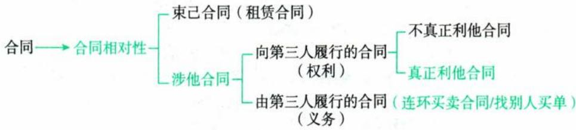

flowchart

```mermaid
graph TD
    A["合同"] --> B["合同相对性"]
    B --> C["束己合同（租赁合同）"]
    B --> D["涉他合同"]
    D --> E["向第三人履行的合同（权利）"]
    D --> F["由第三人履行的合同（义务）"]
    E --> G["不真正利他合同"]
    E --> H["真正利他合同"]
    F --> I["连环买卖合同/找别人买单"]
```

(束己合同和涉他合同体系框架图)

涉他合同，又称涉及第三人的合同，是指合同当事人在合同中为第三人设定了权利或约定了义务的合同。涉他合同广泛应用于保险业、运输业和金融业等行业中（《民法典》第522、523条）。

#### (一) 向第三人履行的合同

#### 1. 含义。

向第三人履行的合同，又称第三人利益合同（利益第三人合同），是指当事人约定由债务人向第三人履行债务，以及法律规定或当事人约定第三人可以直接请求债务人向其履行债务的合同。

① 答案：ABCD。
② 考查6次且主观题亦考查该考点，《民法典合同编通则解释》第29条补充细化了真正利他合同制度，客观题和主观题备考中均必须重点关注。

2. 类型。

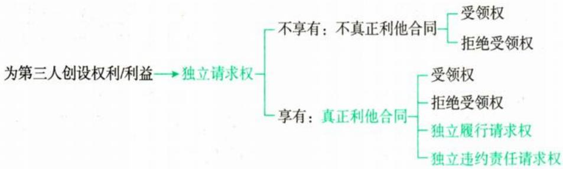

flowchart

```mermaid
graph TD
    A["为第三人创设权利/利益"] --> B["独立请求权"]
    B --> C["不享有：不真正利他合同"]
    B --> D["享有：真正利他合同"]
    C --> E["受领权"]
    C --> F["拒绝受领权"]
    D --> G["受领权"]
    D --> H["拒绝受领权"]
    D --> I["独立履行请求权"]
    D --> J["独立违约责任请求权"]
```

(向第三人履行的合同体系框架图)

向第三人履行的合同根据第三人是否享有独立的请求权分为不真正利他合同和真正利他合同。

(1) 不真正利他合同（不真正的利益第三人合同/《民法典》第522条第1款）。

该第三人不同于受领辅助人。受领辅助人是由债权人指定的代其进行受领的人。而此处的第三人则由双方当事人在合同中约定。

第三人不享有合同中的独立请求权，只能单纯接受债务人的给付，而不能直接请求债务人进行给付。

如果债务人不履行债务或履行债务不适当，第三人不能向债务人主张违约责任，能够主张违约责任的主体仍然是合同的债权人。

[例] 孟某在中国政法大学民商经济法学院读研究生期间，与刑事司法学院的刘某恋爱。遂与中国政法大学南门的美信花店签订了订花合同（买卖合同），订购百合花1个月。双方约定：孟某每天上午9点将购花款通过微信转账给美信花店，美信花店中午12点将一束百合花送至女生宿舍新1号楼302室的刘某。

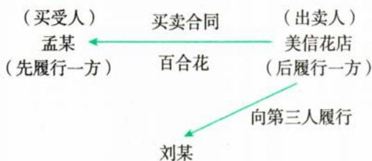

flowchart

```mermaid
graph TD
    A["(买受人) 孟某 (先履行一方)"] --> B["买卖合同"]
    B --> C["(出卖人) 美信花店 (后履行一方)"]
    C --> D["向第三人履行"]
    D --> E["刘某"]
    E --> A
    style A fill:#f9f,stroke:#333
    style B fill:#ccf,stroke:#333
    style C fill:#cfc,stroke:#333
    style D fill:#fcc,stroke:#333
    style E fill:#cff,stroke:#333
```

(第三人/受益人/受领人)
(不真正利他合同当事人法律关系示意图)

此时，孟某与美信花店之间的百合花订购合同（买卖合同）即属于典型的向第三人履行的合同，更准确地说属于涉他合同中的利他合同（为第三人刘某创设权利，但刘某不享有独立的履行请求权和违约责任请求权，只享有给付受领权，属于不真正利他合同）。

情形1：如孟某上午9点依约将购花款通过微信转账给美信花店，美信花店未在中午12点向刘某送花。则基于合同相对性原理①，孟某有权追究美信花店的违约责任。但是，无论如何，刘某无权追究美信花店的违约责任，因为根本“无约可违”。当然，刘某亦无权追究美信花店的缔约过失责任和侵权责任。

情形2：如孟某上午9点未依约将购花款通过微信转账给美信花店，则基于合同相对性原理，美信花店仅能追究孟某的违约责任。但是，无论如何，美信花店无权追究刘某的违约责任，因为根本“无约可违”。当然，美信花店亦无权追究刘某的缔约过失责任和侵权责任。

(2) 真正利他合同（真正的利益第三人合同/《民法典》第522条第2款）。

由于商业实践发展的需要，在买卖合同、人寿保险合同、运输合同（收货人向承运人主张交付货物或赔偿货损的请求权）、旅游合同、融资租赁合同等当中均出现了将第三人（受益人）直接纳入合同中的特殊条款。

法律规定或当事人约定第三人可以直接请求债务人向其履行债务，第三人未在合理期限内明确拒绝（第三人享有拒绝权），债务人未向第三人履行债务或履行债务不符合约定的，第三人可以请求债务人承担违约责任（第三人享有履行请求权和违约责任请求权）；债务人对债权人的抗辩，可以向第三人主张（基于债的同一性原理，抗辩权的移转）。

[例] 孟某在中国政法大学民商经济法学院读研究生期间，与刑事司法学院的刘某恋爱。后孟某毕业并即将前往上海工作，为了与刘某保持恋爱关系并等待刘某毕业后二人结婚，孟某在离开北京前，与中国政法大学南门的美信花店签订了订花合同（买卖合同），订购百合花1个月。双方约定：孟某每天上午9点将购花款通过微信转账给美信花店，美信花店中午12点将一束百合花送至女生宿舍新1号楼302室的刘某。同时约定，因孟某即将离开北京，女友刘某可以直接请求美信花店向其履行交付百合花的义务。当晚，孟某将订花之事告知刘某，刘某未明确表示拒绝（给予他人好处，无需他人同意，但他人可以拒绝）。根据上述案情及示意图，请回答如下问题：

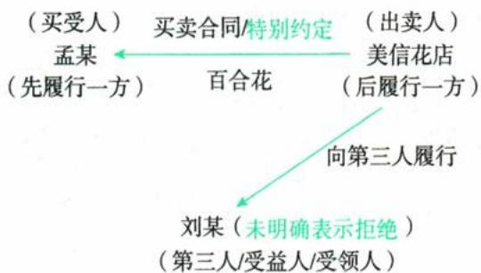

flowchart

```mermaid
graph TD
    A["(买受人) 孟某 (先履行一方)"] --> B["买卖合同/特别约定"]
    B --> C["(出卖人) 美信花店 (后履行一方)"]
    C --> D["向第三人履行"]
    D --> E["刘某 (未明确表示拒绝) (第三人/受益人/受领人)"]
    E --> F["百合花"]
```

##### (真正利他合同当事人法律关系示意图)

①在真正利他合同中，第三人刘某是否有权拒绝受领百合花？

答：有权。因为基于私人/意思自治，任何人有权不受他人干预，即使这种干预是一种法律上的权利，因此，第三人刘某享有拒绝权。

②在真正利他合同中，第三人刘某是否有权请求债务人花店向自己履行交付百合花的义务？

答：有权。因为基于合法有效的买卖合同，第三人刘某享有独立的履行请求权（《民法典》第522条第2款）。

③在真正利他合同中，如花店不向第三人刘某交付百合花。刘某是否有权追究花店的违约责任？

答：有权。因为基于合法有效的买卖合同，第三人刘某享有独立的违约责任请求权（《民法典》第522条第2款）。

④在真正利他合同中，如第三人刘某请求债务人花店向自己履行交付百合花的义务，花店是否有权向刘某主张基于订花合同（买卖合同系双务合同）对孟某享有先履行抗辩权（又称顺序履行抗辩权）？

答：有权。因为基于债的同一性原理，债务人对债权人的抗辩，可以向第三人主张，即抗辩权的移转（《民法典》第522条第2款）。

⑤在真正利他合同中，第三人刘某是否有权撤销或解除孟某和花店签订的买卖合同？

答：无权。因为第三人刘某并非意思表示的当事人，刘某并未直接参与意思表示的发出和受领过程，意思表示的发出和受领是由孟某和花店所完成（《民法典合同编通则解释》第29条）。

##### [萌主点拨]

不真正利他合同和真正利他合同中的第三人

<table><tr><td>项目</td><td>不真正利他合同</td><td>真正利他合同</td></tr><tr><td>法律依据</td><td>《民法典》第522条第1款(原《合同法》第64条)</td><td>《民法典》第522条第2款</td></tr><tr><td>履行/给付受领权</td><td>享有</td><td>享有</td></tr><tr><td>拒绝受领权</td><td>享有</td><td>享有1</td></tr><tr><td>独立的履行请求权</td><td>不享有</td><td>享有(源于法律规定2或当事人约定)</td></tr><tr><td>独立的违约责任请求权</td><td>不享有</td><td>享有</td></tr><tr><td>合同相对性</td><td>严守</td><td>突破</td></tr><tr><td>第三人是否为合同当事人</td><td>不是</td><td>不是</td></tr><tr><td>债务人的抗辩</td><td>可以对第三人行使</td><td>可以对第三人行使</td></tr><tr><td>撤销权(形成权)</td><td>不享有(第三人非意思表示当事人)</td><td>不享有3(第三人非意思表示当事人)</td></tr><tr><td>解除权(形成权)</td><td>不享有(第三人非意思表示当事人)</td><td>不享有(第三人非意思表示当事人)</td></tr></table>

离婚协议约定将部分或全部夫妻共同财产给予子女，离婚后，一方在财产权利转移之前请求撤销该约定的，法院不予支持，但另一方同意的除外。

一方不履行前款离婚协议约定的义务，另一方请求其承担继续履行或因无法履行而赔偿损失等民事责任的，法院依法予以支持。

双方在离婚协议中明确约定子女可以就本条第一款中的相关财产直接主张权利，一方不履行离婚协议约定的义务，子女请求参照适用《民法典》第522条第2款规定，由该方承担继续履行或因无法履行而赔偿损失等民事责任的，法院依法予以支持。

离婚协议约定将部分或全部夫妻共同财产给予子女，离婚后，一方有证据证明签订离婚协议时存在欺诈、胁迫等情形，请求撤销该约定的，法院依法予以支持；当事人同时请求分割该部分夫妻共同财产的，法院依照《民法典》第1087条规定处理（《民法典婚姻家庭编解释（二）》第20条）。

#### (二) 由第三人履行的合同①（连环买卖合同）

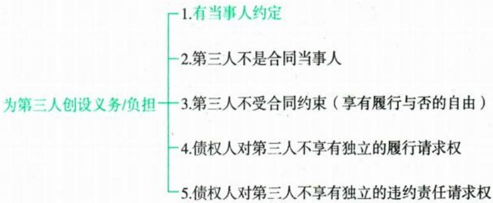

flowchart

```mermaid
graph TD
    A["为第三人创设义务/负担"] --> B["1.有当事人约定"]
    A --> C["2.第三人不是合同当事人"]
    A --> D["3.第三人不受合同约束（享有履行与否的自由）"]
    A --> E["4.债权人对第三人不享有独立的履行请求权"]
    A --> F["5.债权人对第三人不享有独立的违约责任请求权"]
```

(由第三人履行的合同体系框架图)

#### 1. 含义。

由第三人履行的合同，又称第三人负担的合同，是指合同当事人约定，在不变更合同当事人的情况下，合同中的债务由第三人履行。由第三人履行的合同，往往具有减少交易环节，提高交易效率的功能。如甲、乙二人约定，甲欠乙的钱由丙偿付；某一产品的销售商和买受人订立买卖合同，双方约定由该产品的生产商直接向买受人交付产品。

#### 2. 基本规则。

根据合同相对性原理，合同当事人不得为第三人设定义务和负担，除非得到第三人的同意，否则该约定不能对第三人发生效力。在由第三人履行的合同中，由于只存在债权人与债务人之间的约定，第三人并没有与债权人达成合意。因此，双方当事人的合意并不能约束第三人。债权人不能直接向第三人提出履行请求，在第三人不履行合同或履行合同不适当时，债权人只能向债务人请求履行债务，而不能请求第三人承担违约责任。

[萌主点拨] 由第三人履行的合同中的第三人不同于履行辅助人，履行辅助人是由债务人指定的替代债务人履行义务的人，不需要合同双方当事人在合同中进行约定。

[例] 孟某将自己的手表以2万元出卖给了马某, 双方约定第 2 天上午 9 点一手交钱一手交表 (取货时付款/同时履行抗辩权)。当天下午, 马某将手表转卖给了曹某, 价款 3 万元。双方在转卖合同中约定, 由孟某负责交付手表给曹某。晚上马某电话告知孟某, 第 2 天上午 9 点直接将手表交付给曹某。该案属于典型的 “连环买卖合同”。从马某和曹某之间的转卖合同角度看, 交付标的物手表的义务并非由出卖人马某履行, 而是由合同以外的第三人孟某履行, 即由第三人履行的合同。根据上述案情及示意图, 请回答如下问题:

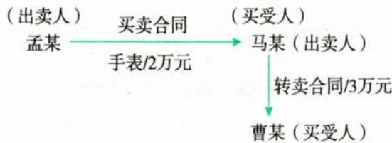

flowchart

```mermaid
graph TD
    A["孟某"] -->|买卖合同\n手表/2万元| B["马某（出卖人）"]
    B -->|转卖合同/3万元| C["曹某（买受人）"]
    A -->|(出卖人)| D
    B -->|(买受人)| E
```

(由第三人履行的合同当事人法律关系示意图)

①由第三人履行的合同当事人是谁和谁？

答：马某和曹某。即第三人孟某不是合同当事人，马某和曹某之间的合同对第三人孟某没有法律约束力。

②曹某对孟某是否享有独立的履行请求权？

答：不享有。

③如第2天孟某未向曹某交付手表，曹某如何救济自己的合法权益？

答：曹某只能基于合同相对性原理追究马某的违约责任。同理，马某也只能基于合同相对性原理追究孟某的违约责任。

无论如何，曹某无权直接追究孟某的违约责任（二者之间根本“无约可违”），也无权直接追究孟某的缔约过失责任和侵权责任。一言以蔽之，曹某和孟某之间没有任何直接的民事法律关系。

#### （三）涉他合同 VS 指示交付

[例] 3月2日，孟某将自己的手表委托马某保管7天并交付。3月5日，孟某将手表以2万元出卖给了曹某。3月6日，孟某电话告知马某，保管期间届满后直接将手表交付给曹某。

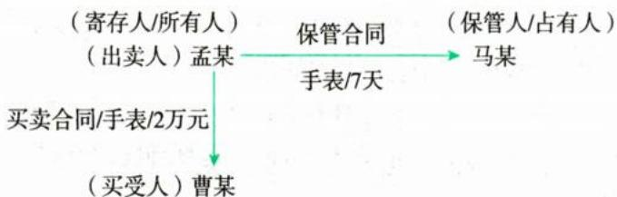

flowchart

```mermaid
graph TD
    A["(出卖人) 孟某"] -->|买卖合同/手表/2万元| B["(买受人) 曹某"]
    A -->|保管合同 手表/7天| C["(保管人/占有人) 马某"]
    B --> C
```

(指示交付当事人法律关系示意图)

该案属于典型的“指示交付”（《民法典》第227条）。标的物手表发生了物权变动，手表的所有人由孟某变成了曹某。指示交付的本质就是“自己所有他人占有，出卖返还原物请求权”，买卖合同生效时，视为动产已经交付，发生物权变动。保管期间届满，如马某未将手表交付给曹某，曹某有权基于所有权人的身份追究马某的侵权责任。一言以蔽之，涉他合同和指示交付的区别在于：动产标的物的所有人和占有人是否发生了分离。如果未发生分离，属于涉他合同（债权效力）；如果发生了分离，属于指示交付（物权效力）。

#### 三、第三人代为履行 $^{①}$ （清偿）

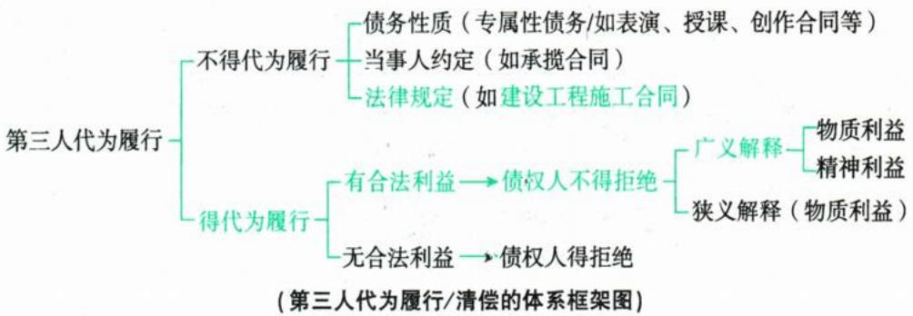

flowchart

```mermaid
graph TD
    A["第三人代为履行"] --> B["不得代为履行"]
    A --> C["得代为履行"]
    B --> D["债务性质（专属性债务/如表演、授课、创作合同等）"]
    B --> E["当事人约定（如承揽合同）"]
    B --> F["法律规定（如建设工程施工合同）"]
    C --> G["有合法利益 → 债权人不得拒绝"]
    C --> H["无合法利益 → 债权人得拒绝"]
    G --> I["广义解释"]
    G --> J["狭义解释（物质利益）"]
    I --> K["物质利益"]
    I --> L["精神利益"]
```

#### (一) 含义

第三人代为履行（清偿），是指第三人在无合同约定的情况下自愿代债务人履行合同义务。

#### (二) 构成要件

1. 合同未约定第三人具有履行义务。

第三人不是合同当事人，如果合同已约定由第三人履行，则应适用由第三人履行的合同规则。

2. 债务人不履行债务。

(1) 债务人已明确拒绝履行债务的意思表示。
（2）债务人虽未明确表示拒绝，但在约定的债务履行期限内或未约定履行期限时在合理期限内无实际履行行为。
(3) 债务人明显丧失履行能力，如经营状况严重恶化等。
（4）债务人亲自履行或委托他人履行已不具有可能性，如债务人在最后履行期限临近前因病昏迷或被逮捕等。

3. 第三人对履行该债务具有合法利益。

（1）转租中次承租人代为支付租金（第三人代为履行抗辩权/《民法典》第719条），以避免自身承租的权利遭受损害。
（2）母公司为子公司代为偿还债务。由于子公司的债务可能会对母公司的信用评级产生不利影响。因此，母公司可以代子公司清偿债务。
（3）在抵押权人与抵押人约定禁止抵押物转让且已经办理登记手续时，抵押物的买受人可以清偿债务人的债务，从而消灭抵押权，进而取得抵押物的所有权（涤除权/《民法典担保制度解释》第43条）。

4. 根据债务性质、合同约定或法律规定，未明确将第三人代为履行排除在外。

(1) 根据债务性质不能由第三人代为履行（清偿）。基于信赖关系所引发的债务，如雇佣合同和委托合同等。以选定债务人为基础引发的债务，如演出合同（特定演员）和创作合同（特定画家）等。

（2）按照当事人的约定（契约自由原则）不得由第三人代为履行（清偿）。如当事人约定承揽工作必须由承揽人完成，即不得将该工作交第三人完成。

（3）依据法律规定不得由第三人代为履行（清偿）。如赔礼道歉、建设工程主体结构的施工必须由承包人亲自完成，不得转包他人。即使经过发包人同意，转包合同也无效（《民法典》第791条）。

#### （三）法律效力

为保护第三人的利益，境外立法例和我国《民法典》第524条均认可就债务履行有合法利益的第三人代为履行后，债权人的债权即转移至该第三人（法定债权转让）。

#### 1. 对内效力。

对内效力，是指第三人代为履行后，发生在合同相对人之间的效力。主要表现在如下三个方面：

（1）第三人代为履行后，债务人对债权人所负的债务应作相应扣减；

(2) 第三人不因其代为履行行为而成为合同当事人；

（3）第三人瑕疵履行产生的违约责任由债权人直接向债务人主张，第三人对债权人不承担瑕疵担保责任（违约责任）。

#### 2. 对外效力。

对外效力，是指第三人代为履行后，发生在第三人和原合同相对人之间的效力。主要表现在如下两个方面：

（1）第三人代为履行后，债权人对债务人的相应债权转让给第三人，但债务人和第三人另有约定的除外，即法定债权转让，第三人代为履行后无需通知债务人即自然取得该债权。

(2) 债务人对原债权人所享有的抗辩可以向新的债权人即第三人主张。

[例] 2024年3月2日，孟某将自己的房屋出租（负担行为/仅发生债权债务关系/不发生物权变动/专属管辖）给马某，租期5年，月租金1万元。1年后，马某经过孟某同意将房屋转租给曹某，租期4年，月租金1.5万元。2025年3月6日，曹某擅自将房屋一堵墙拆除。3月10日，孟某发现曹某拆墙一事，产生纠纷。根据上述案情及示意图，请回答如下问题：

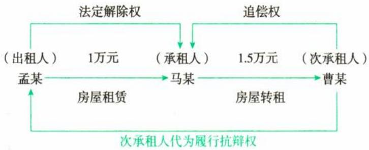

flowchart

```mermaid
graph TD
    A["孟某"] -->|1万元| B["马某"]
    B -->|1.5万元| C["曹某"]
    C -->|次承租人代为履行抗辩权| A
    B -->|房屋租赁| A
    B -->|房屋转租| C
    D["(出租人)"] -->|法定解除权| E["(承租人)"]
    E -->|追偿权| C
```

##### (第三人代为履行/清偿的当事人法律关系示意图)

(1) 如马某欠付孟某 2 个月租金及违约金共计 5 万元, 孟某欲解除与马某的房屋租赁合同。曹某如何救济自己的权利呢?

答：次承租人曹某可以代承租人马某支付欠付的租金及违约金。因为承租人拖欠租金及违约金的，次承租人对履行该债务具有“合法利益”。因此，第三人曹某有权代为履行（《民法典》第719条）。

(2) 如曹某代马某支付欠付的 5 万元租金及违约金，孟某是否享有拒绝权？

答：不享有。因为租金属于金钱之债（货币之债），不具有只能由承租人履行的性质，因此，次承租人曹某有权向出租人孟某代为履行且债权人孟某没有拒绝权。

(3) 曹某代马某支付欠付的 5 万元租金及违约金后，曹某对马某是否享有追偿权？

答：享有。因为基于法定债权转让原理，债权人孟某接受第三人曹某履行后，其对债务人马某的债权转让给第三人曹某。具体而言，次承租人曹某可以充抵应当向承租人马某支付的租金。

（4）如马某未经孟某同意擅自将房屋转租给曹某，曹某是否依然享有第三人代为履行抗辩权？

答：不享有。因为承租人马某未经出租人孟某同意转租的，承租人马某和次承租人曹某之间的转租合同对出租人孟某不具有法律约束力，第三人曹某对租赁物房屋属于无权占有（不具有合法权利），对该租金及违约金债务的履行不具有“合法利益”。出租人孟某有权拒绝其代为履行的请求。

[萌主点拨] 第三人代为履行（清偿）的本质是“无约定+主动履行+合法利益+原则上法定债权转让（追偿权）”。

#### 四、双务合同履行中的抗辩权①

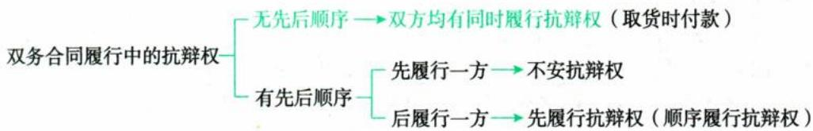

flowchart

```mermaid
graph TD
    A["双务合同履行中的抗辩权"] --> B{无先后顺序}
    B --> C["双方均有同时履行抗辩权（取货时付款）"]
    A --> D{有先后顺序}
    D --> E["先履行一方"]
    D --> F["后履行一方"]
    E --> G["不安抗辩权"]
    F --> H["先履行抗辩权（顺序履行抗辩权）"]
```

(双务合同履行中的抗辩权体系框架图)

双务合同（买卖合同）履行中的抗辩权

<table><tr><td>项目</td><td>同时履行抗辩权</td><td>不安抗辩权</td><td>先(顺序)履行抗辩权</td></tr><tr><td>法律依据</td><td>《民法典》第525条</td><td>《民法典》第527、528条</td><td>《民法典》第526条</td></tr><tr><td>合同个数</td><td>1个合同</td><td>1个合同</td><td>1个合同</td></tr><tr><td>合同类型</td><td>双务合同(买卖)</td><td>双务合同(买卖)</td><td>双务合同(买卖)</td></tr><tr><td>先后顺序</td><td>没先后</td><td>有先后</td><td>有先后</td></tr><tr><td>行权主体</td><td>双方</td><td>先履行一方</td><td>后履行一方</td></tr><tr><td>行权事由</td><td>相应的抗辩</td><td>有确切证据证明对方存在经营状况严重恶化、丧失商业信誉、逃债等不能为对待给付的危险</td><td>相应的抗辩</td></tr><tr><td>行权方式</td><td>中止履行</td><td>中止履行并应当及时通知对方;对方提供适当担保的,应当恢复履行。中止履行后,对方在合理期限内未恢复履行能力且未提供适当担保的,视为以自己的行为表明不履行主要债务,中止履行的一方可以解除合同并可以请求对方承担违约责任</td><td>中止履行</td></tr><tr><td>性质</td><td>延期性抗辩权</td><td>延期性抗辩权</td><td>延期性抗辩权</td></tr></table>

#### 五、情势变更①

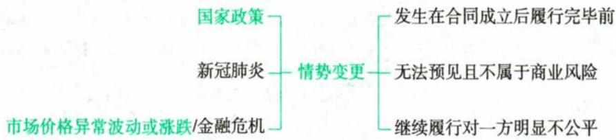

flowchart

```mermaid
graph TD
    A["国家政策"] --> D["情势变更"]
    B["新冠肺炎"] --> D["情势变更"]
    C["市场价格异常波动或涨跌/金融危机"] --> D["情势变更"]
    D --> E["发生在合同成立后履行完毕前"]
    D --> F["无法预见且不属于商业风险"]
    D --> G["继续履行对一方明显不公平"]
```

(情势变更体系框架图)

合同成立后，合同的基础条件发生了当事人在订立合同时无法预见的、不属于商业风险的重大变化，继续履行合同对于当事人一方明显不公平的，受不利影响的当事人可以与对方重新协商；在合理期限内协商不成的，当事人可以请求法院或仲裁机构变更或解除合同。法院或仲裁机构应当结合案件的实际情况，根据公平原则变更或解除合同（《民法典》第533条和《民法典合同编通则解释》第32条）。

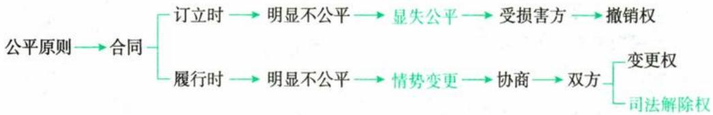

flowchart

```mermaid
graph LR
    A["公平原则"] --> B["合同"]
    B --> C["订立时"]
    C --> D["明显不公平"]
    D --> E["显失公平"]
    E --> F["受损害方"]
    F --> G["撤销权"]
    B --> H["履行时"]
    H --> I["明显不公平"]
    I --> J["情势变更"]
    J --> K["协商"]
    K --> L["双方"]
    L --> M["变更权"]
    L --> N["司法解除权"]
```

(显失公平和情势变更的关系法律思维导图)

#### （一）情势变更的认定

一般认为，正常的价格变动是商业风险，但因政策变动或供求关系的异常变动导致价格发生当事人在订立合同时无法预见的涨跌，按照原定价格履行合同将带来显失公平的结果，则应当认定发生了情势变更（辩证思维：量变到质变）。

#### （二）情势变更的处理

基于鼓励交易原则和合同严守原则，当事人均主张变更合同的，法院不得解除合同；双方意见不一致的，法院根据公平原则判决变更或解除合同。

#### （三）情势变更的排除

情势变更原则体现了国家通过司法权对合同自由的干预，是民法公平原则和诚信原则（体现当事人的美德）的集中体现。因此，当事人事先约定排除情势变更原则的适用会导致实质意义上的不公平和排除司法干预权的后果。因此，排除约定应被认定无效（《民法典合同编通则解释》第32条）。

[萌主点拨]
不可抗力 VS 情势变更

<table><tr><td>项目</td><td>不可抗力</td><td>情势变更</td></tr><tr><td>法律依据</td><td>《民法典》第180条</td><td>《民法典》第533条</td></tr><tr><td>当事人克服或避免义务履行障碍的难度和结果</td><td>强调克服或避免(规避)履行障碍的难度过高</td><td>强调继续履行的成本过高</td></tr><tr><td>免责情况</td><td>法定免责事由。当事人只要举证证明因不可抗力导致合同履行不能,即可获得全部或部分免责,无需法院裁量</td><td>不是法定免责事由,处于不利地位的当事人可以请求变更或解除合同,需要法院进行裁量</td></tr><tr><td>解决问题路径</td><td>从违约角度出发,解决是否承担合同责任的问题</td><td>从合同效力角度出发,解决是否继续履行或变更的问题</td></tr><tr><td>适用程序</td><td>无协商前置程序</td><td>有协商前置程序</td></tr></table>

##### 随堂练习

甲公司和乙公司签订了一份长期的供货合同。后因地震，原材料成本和运输费用均上涨，若继续履行合同甲公司将遭受重大损失，甲公司与乙公司协商变更合同被拒。关于本案，下列选项正确的是？（2022金题-2-1-16，单）①

A. 合同因重大误解可撤销
B. 合同因不可抗力可撤销
C. 合同因显失公平可撤销
D. 合同因情势变更可变更

### 16 专题十六 合同（债）的保全

#### 复习提要

合同（债）的保全规定在《民法典》第三编合同第一分编通则第五章（第535—542条），共8条。同时，《民法典合同编通则解释》第33—46条，共14条亦对合同（债）的保全进行了补充细化规定。本专题主要涉及两个问题：1. 债权人代位权诉讼；2. 债权人撤销权诉讼。本专题每年必考且属于绝对的难点，在复习过程中必须重点掌握，特别是代位权和撤销权之间的关系。

合同（债）的保全 → 事后诈害债权
消极不作为：债权人代位权
积极作为：债权人撤销权
代位请求权
代位保存权（提前行权）

[图释] 合同（债）的保全制度属于“合同相对性原理的例外”，具有法定性（属于债权人的法定或固有权利）。立法目的是防止债务人事后“逃废债”，强化对债权人的保护，即通过赋予债权人代位权和撤销权，防止债务人的责任财产应增加而不增加（消极或被动型诈害债权/债权人代位权/债务人的主观恶性较轻），不应减少而人为减少（积极或主动型诈害债权/债权人撤销权/债务人的主观恶性较重）。债权人代位权和债权人撤销权只能通过诉讼方式行使，其核心功能是保护债权人的利益。当然也要防止债权人权利滥用，过度干预债务人管理财产的行为自由，损害交易安全。

#### 一、债权人代位权诉讼 $^{①}$ （消极）

#### (一) 含义

债权人代位权，是指当债务人怠于行使其对相对人的权利而害及债权人的债权时，债权人为保全其债权，可以自己的名义代为行使债务人对相对人之权的权利。

#### (二) 成立条件

1. 原则上，债权人对债务人、债务人对相对人的权利均合法且到期。这里“权利”包括债权本身以及与该债权有关的从权利。至于发生原因在所不问，无论是公法上的债权（税收债权）还是私法上的债权（合同之债、缔约过失之债、无因管理之债、不当得利之债、侵权之债、担保人追偿权之债等）均可以成为代位权的基础。

2. 债务人怠于行使权利。只要债务人未采用诉讼或仲裁的方式均构成“怠于行使”（客观证明标准）。如果债务人已经对相对人提起诉讼或仲裁，再允许债权人提起代位权诉讼就违反了禁止重复诉讼原则。此时，债权人可以采取保全措施或经执行程序救济。

3. 债务人怠于行使权利已危害债权人的债权（有直接因果关系）。

4. 债务人的权利非专属于债务人自身。专属于债务人自身的权利包括：（1）抚养费、赡养费或扶养费请求权；（2）人身损害赔偿请求权；（3）劳动报酬请求权，但是超过债务人及其所扶养家属的生活必需费用的部分除外；（4）请求支付基本养老保险金、失业保险金、最低生活保障金等保障当事人基本生活的权利；（5）其他专属于债务人自身的权利。

#### (三) 诉讼当事人

原告是债权人。债权人以自己的名义向法院提起代位权诉讼，代位权的行使范围以债权人的债权为限。被告是债务人的相对人（包括担保人）。第三人是债务人。债权人以债务人的相对人为被告向法院提起代位权诉讼，未将债务人列为第三人的，法院应当追加债务人为第三人。

#### (四) 管辖

债权人对债务人的相对人提起代位权诉讼的，由被告住所地法院管辖，但是依法应当适用专属管辖规定的除外。

#### (五) 法律效果

债务人的相对人可援用对债务人的抗辩对抗债权人（抗辩权的移转），但基于合同相对性原理，不得以仲裁条款为由进行抗辩。在代位权诉讼中，相对人对债务人的抗辩，可以向债权人主张。债权人行使代位权的必要费用，由债务人负担。法院认定代位权成立的，由债务人的相对人向债权人履行义务（学理上称为“直接受偿说”）。

债权人接受履行后，债权人与债务人、债务人与相对人之间相应的权利义务终止。债务人对相对人的权利被采取保全、执行措施，或债务人破产的，依照相关法律的规定处理。因此，相对人的给付产生两个法律效果：债权人与债务人之间的债权相应的消灭；债务人与相对人之间的债权相应的消灭。债权人提起代位权诉讼的，应当认定对债权人的债权和债务人的债权均发生诉讼时效中断的效力（《诉讼时效的规定》第16条）。

#### >> 随堂练习

甲公司为乙医院提供医疗设备，乙医院欠甲公司设备费用300万元满一年。甲公司发现，丙公司欠乙医院医疗服务费500万元，丙公司逾期支付满两年，乙医院一直未催促丙公司支付服务费。甲公司欲向丙公司行使代位权向法院起诉。关于本案，下列说法正确的有？（2023金题-2-1-14，单）①

A. 甲公司对丙公司行使代位权，甲公司对乙医院的诉讼时效中止
B. 甲公司对丙公司行使代位权，乙医院对丙公司的诉讼时效中止
C. 甲公司的代位权以 300 万元为限
D. 甲公司的代位权以 500 万元为限

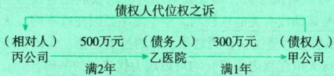

flowchart

```mermaid
graph TD
    A["债权人代位权之诉"] --> B["(相对人) 丙公司"]
    B --> C["500万元 满2年"]
    C --> D["(债务人) 乙医院"]
    D --> E["300万元 满1年"]
    E --> F["(债权人) 甲公司"]
```

(当事人法律关系示意图)

#### 二、债权人撤销权诉讼 $^{①}$ （积极）

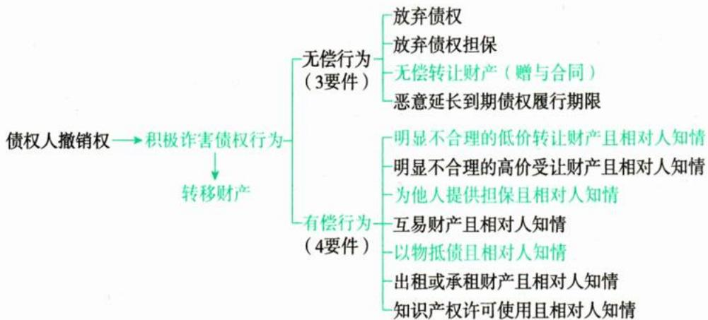

flowchart

```mermaid
graph TD
    A["债权人撤销权"] --> B["积极诈害债权行为"]
    B --> C["转移财产"]
    C --> D["无偿行为 (3要件)"]
    D --> E["放弃债权"]
    D --> F["放弃债权担保"]
    D --> G["无偿转让财产（赠与合同）"]
    D --> H["恶意延长到期债权履行期限"]
    C --> I["有偿行为 (4要件)"]
    I --> J["明显不合理的低价转让财产且相对人知情"]
    I --> K["明显不合理的高价受让财产且相对人知情"]
    I --> L["为他人提供担保且相对人知情"]
    I --> M["互易财产且相对人知情"]
    I --> N["以物抵债且相对人知情"]
    I --> O["出租或承租财产且相对人知情"]
    I --> P["知识产权许可使用且相对人知情"]
```

(债权人撤销权积极诈害债权行为体系框架图)

#### (一) 含义

债权人撤销权，是指债权人对于债务人所为的危害债权的行为，可以请求法院予以撤销的权利。

#### （二）无偿诈害债权

无偿诈害债权时，债权人撤销权的成立条件有三：

1. 债权人对债务人享有合法有效的债权。

2. 客观上，债务人实施了诈害债权的行为。

在债权人撤销权诉讼中，被撤销行为的标的可分，当事人主张在受影响的债权范围内撤销债务人的行为的，法院应予支持；被撤销行为的标的不可分，债权人主张将债务人的行为全部撤销的，法院应予支持（《民法典合同编通则解释》第45条第1款）。

3. 债务人的行为已危害债权人的债权（即导致自己陷入无资力而无法清偿其债务/因果关系）。

[例 1] 甲公司在 2024 年 6 月 1 日欠乙公司货款 500 万元，届期无力清偿。2024 年 12 月 1 日，甲公司向丙公司赠送一套价值 50 万元的机器设备。经查，甲公司的赠与行为尚未履行。根据上述案情及示意图，请回答如下问题：

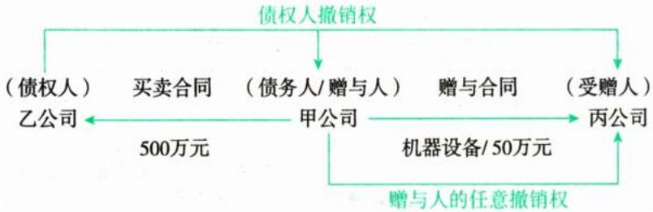

flowchart

```mermaid
graph TD
    A["(债权人) 乙公司"] -->|买卖合同 500万元| B["(债务人/赠与人)"]
    B -->|赠与合同 机器设备/50万元| C["(受赠人)"]
    C -->|赠与人的任意撤销权| D["(受赠人)"]
    D -->|债权人撤销权| A
```

(无偿转让财产当事人法律关系示意图)

(1) 债权人乙公司可否向法院提起诉讼撤销甲公司对丙公司的机器设备赠送行为?

答：可以。因为无偿转让财产（赠与）的行为系诈骗害债权的行为（逃债行为），债权人乙公司可以提起债权人撤销权诉讼。

(2) 赠与人甲公司可否撤销对丙公司的赠与?

答：可以。因为赠与人在赠与财产的权利转移之前享有任意撤销权。

[例 2] 甲公司在 2024 年 6 月 1 日欠乙公司货款 500 万元，届期无力清偿。2024 年 12 月 1 日，甲公司向戊希望学校（捐助法人/公益法人）捐赠价值 100 万元的电脑。经查，甲公司的赠与行为尚未履行。根据上述案情及示意图，请回答如下问题：

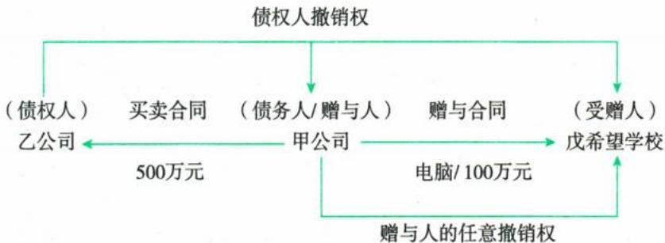

flowchart

```mermaid
graph TD
    A["（债权人）\n乙公司"] -->|买卖合同\n500万元| B["(债务人/赠与人)"]
    B -->|赠与合同\n电脑/100万元| C["(受赠人)\n戊希望学校"]
    C -->|赠与人的任意撤销权| B
    B -->|赠与合同| C
    A --> D["债权人撤销权"]
```

(无偿转让财产当事人法律关系示意图)

(1) 债权人乙公司可否向法院提起诉讼撤销甲公司对戊希望学校的电脑捐赠行为?

答：可以。因为无偿转让财产（赠与）的行为系诈骗害债权的行为（逃债行为），债权人乙公司可以提起债权人撤销权诉讼。

(2) 赠与人甲公司可否撤销对戊希望学校的赠与?

答：不可以。因为赠与人的任意撤销权有3项例外，分别是：①经过公证的赠与合同；②具有救灾、扶贫、助残等公益性质的赠与合同；③具有道德义务性质的赠与合同。本案中，甲公司对戊希望学校的赠与系公益性质的赠与，赠与人甲公司不可以行使任意撤销权（《民法典》第658条）。

[例 3] 甲公司在 2024 年 6 月 1 日欠乙公司货款 500 万元，届期无力清偿。2024 年 3 月 1 日，甲公司向丁基金会（捐助法人/公益法人）捐赠 50 万元现金。经查，甲公司的赠与行为尚未履行。根据上述案情及示意图，请回答如下问题：

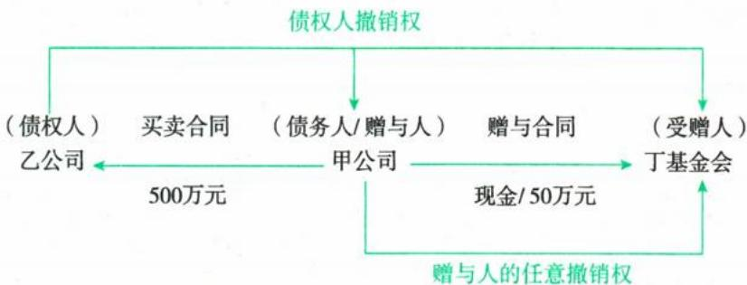

flowchart

```mermaid
graph TD
    A["（债权人）\n乙公司"] -->|买卖合同\n500万元| B["（债务人/赠与人）\n甲公司"]
    B -->|赠与合同\n现金/50万元| C["（受赠人）\n丁基金会"]
    C -->|赠与人的任意撤销权| A
    B -->|债权人撤销权| A
```

(无偿转让财产当事人法律关系示意图)

(1) 债权人乙公司可否向法院提起诉讼撤销甲公司对丁基金会的现金捐赠行为?

答：不可以。因为2024年3月1日，甲公司实施无偿转让财产（赠与）行为时，乙公司的债权尚未产生（不存在因果关系）。

[萌主点拨] 债权与行为的关系必须是债权成立在前，诈害债权行为在后。

(2) 赠与人甲公司可否撤销对丁基金会的捐赠?

答：不可以。因为赠与人的任意撤销权有3项例外，分别是：①经过公证的赠与合同；②具有救灾、扶贫、助残等公益性质的赠与合同；③具有道德义务性质的赠与合同。本案中，甲公司对丁基金会的赠与系公益性质的赠与，赠与人甲公司不可以行使任意撤销权。

夫妻一方的债权人有证据证明离婚协议中财产分割条款影响其债权实现，请求参照适用《民法典》第538条或第539条规定撤销相关条款的，法院应当综合考虑夫妻共同财产整体分割及履行情况、子女抚养费负担、离婚过错等因素，依法予以支持（《民法典婚姻家庭编解释（二）》第3条）。

#### >> 随堂练习

甲欠乙30万元到期后，乙多次催要未果。甲与丙结婚数日后即办理离婚手续，在《离婚协议书》中约定将甲婚前的一处住房赠与知悉甲欠乙债务的丙，并办理了所有权变更登记。乙认为甲侵害了自己的权益，聘请律师向法院起诉，请求撤销甲的赠与行为，为此向律师支付代理费2万元。下列哪些选项是正确的？(2017-3-58，多)①

A.《离婚协议书》因恶意串通损害第三人利益而无效
B. 如甲证明自己有稳定工资收入及汽车等财产可供还债，法院应驳回乙的诉讼请求
C. 如乙仅以甲为被告，法院应追加丙为被告
D. 如法院认定乙的撤销权成立，应一并支持乙提出的由甲承担律师代理费的请求

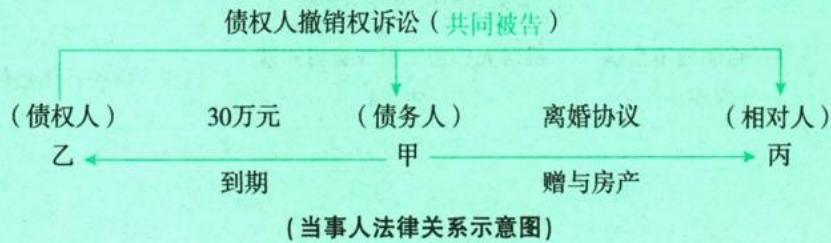

flowchart

```mermaid
graph LR
    A["债权人"] -->|30万元| B["(债务人)"]
    B -->|到期| C["甲"]
    C -->|赠与房产| D["(相对人)"]
    D --> E["丙"]
    style A fill:#f9f,stroke:#333
    style B fill:#f9f,stroke:#333
    style C fill:#f9f,stroke:#333
    style D fill:#f9f,stroke:#333
    style E fill:#f9f,stroke:#333
```

#### （三）有偿诈害债权

有偿诈害债权时，债权人撤销权的成立条件有四（主客观相结合）：

1. 债权人对债务人有合法有效的债权（赌债不得行使债权人撤销权）。
2. 主观上，债务人具有诈害债权的恶意。
3. 客观上，债务人实施了诈害债权的行为。

转让价格未达到交易时交易地的市场交易价或指导价70%的，一般可以认定为“明显不合理的低价”；受让价格高于交易时交易地的市场交易价或指导价30%的，一般可以认定为“明显不合理的高价”。债务人与相对人存在亲属关系、关联关系的，不受70%、30%的限制 $^{②}$ （存在恶意诈害债权的高度盖然性/主体因素/《民法典合同编通则解释》第42条）。

① 答案：BCD。

②《民法典》第1045条[亲属的范围]亲属包括配偶、血亲和姻亲。配偶、父母、子女、兄弟姐妹、祖父母、外祖父母、孙子女、外孙子女为近亲属。配偶、父母、子女和其他共同生活的近亲属为家庭成员。《公司法》第265条：关联关系，是指公司控股股东、实际控制人、董事、监事、高级管理人员与其直接或间接控制的企业之间的关系，以及可能导致公司利益转移的其他关系。但是，国家控股的企业之间不仅因为同受国家控股而具有关联关系。

[萌主点拨] 判断债务人转让财产的价格是否合理时, 到底是以买卖合同约定的价款, 还是以实际支付的价款为标准? 如果买卖合同约定的价款与市价或指导价相当, 但相对人尚未支付价款且欠缺支付能力。此时, 我国司法实践中多数支持以 “实际支付价款” 为标准进行比较分析。

4. 债务人的行为已危害债权人的债权（即导致自己陷入无资力而无法清偿其债务/因果关系）。

#### >> 随堂练习

杜某拖欠谢某100万元。谢某请求杜某以登记在其名下的房屋抵债时，杜某称其已把房屋作价90万元卖给赖某，房屋钥匙已交，但产权尚未过户。该房屋市值为120万元。关于谢某权利的保护，下列哪些表述是错误的？(2014-3-54，多)①

A. 谢某可请求法院撤销杜某、赖某的买卖合同

B. 因房屋尚未过户，杜某、赖某买卖合同无效

C. 如谢某能举证杜某、赖某构成恶意串通，则杜某、赖某买卖合同无效

D. 因房屋尚未过户，房屋仍属杜某所有，谢某有权直接取得房屋的所有权以实现其债权

[萌主点拨]
低卖或高买情形归纳表

<table><tr><td>项目</td><td>价格是否明显不合理(客观)</td><td>相对人是否知道或应当知道(主观)</td><td>债权人能否行使债权人撤销权</td></tr><tr><td>情形1</td><td>×</td><td>√</td><td>×</td></tr><tr><td>情形2</td><td>√</td><td>×</td><td>×</td></tr><tr><td>情形3</td><td>√</td><td>√</td><td>√</td></tr></table>

#### (四) 诉讼当事人

原告是债权人。债权人以自己的名义向法院提起债权人撤销权诉讼。撤销权的行使范围以债权人的债权为限。债权人提起撤销权诉讼的，应当以债务人和债务人的相对人为共同被告。

#### (五) 管辖

债权人提起撤销权诉讼的，由债务人或相对人的住所地法院管辖，但是依法应当适用专属管辖规定的除外。两个以上债权人就债务人的同一行为提起撤销权诉讼的，法院可以合并审理。

#### (六) 法律效果

债务人影响债权人的债权实现的行为被撤销的，一经撤销，债务人与相对人的行为自始无效。债权人可以请求相对人将所获利益返还债务人，而非直接返还给债权人。债权人行使撤销权的必要费用，由债务人负担。债权人行使撤销权所支付的合理的律师代理费、差旅费等费用①，可以认定为《民法典》第540条规定的“必要费用”。

#### (七) 双重除斥期间限制

撤销权自债权人知道或应当知道撤销事由之日起1年内行使。自债务人的行为发生之日起5年内没有行使撤销权的，该撤销权消灭。

[萌主点拨]
债权人代位权诉讼 VS 债权人撤销权诉讼

<table><tr><td>项目</td><td>债权人代位权诉讼</td><td>债权人撤销权诉讼</td></tr><tr><td>法律依据</td><td>《民法典》第535—537条《民法典合同编通则解释》第33—41条</td><td>《民法典》第538—542条《民法典合同编通则解释》第42—46条</td></tr><tr><td>相同点</td><td>债(合同)的保全措施</td><td>债(合同)的保全措施</td></tr><tr><td>类型</td><td>消极/被动型诈害债权(逃废债)</td><td>积极/主动型诈害债权(逃废债)</td></tr><tr><td>本质</td><td>责任财产应增加而不增加</td><td>责任财产不应减少而减少</td></tr><tr><td>主观恶性</td><td>较轻</td><td>较重</td></tr><tr><td>行使范围</td><td>以债权人的债权为限</td><td>以债权人的债权为限</td></tr><tr><td>必要费用</td><td>债权人行使代位权的必要费用,由债务人负担(针对相对人采取财产保全措施的费用、为查明债务人权利所支出的调查取证费用属于必要费用;合理的律师代理费、差旅费是否属于这里的必要费用无法律和司法解释规定)</td><td>债权人行使撤销权的必要费用,由债务人负担(合理的律师代理费、差旅费等费用)</td></tr><tr><td>债权到期</td><td>到期(代位请求权)/未到期(代位保存权)</td><td>到期/未到期(未届履行期的债权,债权人有权行使撤销权)</td></tr><tr><td>法律效果</td><td>直接清偿(代位请求权)/入库规则(代位保存权)</td><td>入库规则</td></tr></table>

### 17 专题十七 合同（债）的变更和转让

#### 复习提要

合同（债）的变更和转让规定在《民法典》第三编合同第一分编通则第六章（第543—556条），共14条。同时，《民法典合同编通则解释》第47—51条，共5条亦对合同（债）的变更和转让进行了补充细化规定。本专题主要涉及四个问题：1. 合同的变更；2. 债权转让（让与）；3. 债务承担（转移）；4. 债权债务的概括承受。本专题系考试的重点和难点内容，特别是债务承担，在备考时应重点关注。

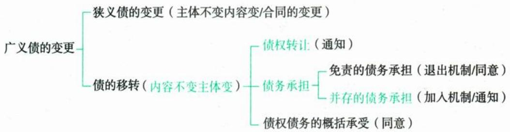

flowchart

```mermaid
graph TD
    A["广义债的变更"] --> B["狭义债的变更（主体不变内容变/合同的变更）"]
    A --> C["债的移转（内容不变主体变）"]
    C --> D["债权转让（通知）"]
    C --> E["债务承担"]
    E --> F["免责的债务承担（退出机制/同意）"]
    E --> G["并存的债务承担（加入机制/通知）"]
    C --> H["债权债务的概括承受（同意）"]
```

#### 一、合同的变更①

#### (一) 含义

合同的变更，是指合同成立后，当事人在原合同的基础上对合同的内容进行修改或补充（《民法典》第543条）。

#### (二) 条件

当事人协商一致，可以变更合同。为了减少当事人可能就合同的变更产生纠纷，维护合同关系的稳定性。当事人必须有明确的变更合同的合意，如果一方当事人请求变更合同，对方虽未反对，但也没有明确表示同意，或没有以行为表示同意的，则不能认定对方当事人同意该变更，即当事人对合同变更的内容约定不明确的，推定为未变更（《民法典》第544条）。

#### 二、债权转让（让与/卖债权或债权凭证） $^{①}$

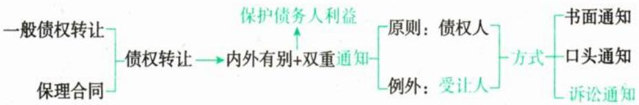

flowchart

```mermaid
graph LR
    A["一般债权转让"] --> B["债权转让"]
    C["保理合同"] --> B
    B --> D["保护债务人利益"]
    D --> E["内外有别+双重通知"]
    E --> F["原则：债权人"]
    E --> G["例外：受让人"]
    F --> H["方式"]
    G --> H
    H --> I["书面通知"]
    H --> J["口头通知"]
    H --> K["诉讼通知"]
```

(债权转让/让与体系框架图)

#### (一) 含义

债权转让（让与）是金融发展、资金融通的重要手段，广泛应用于银行和金融资产管理公司对不良债权的处置以及保理等领域。债权转让的核心是如何平衡债务人利益保护和债权流通性之间的冲突。债权转让（让与），是指不改变债权的内容，由债权人将债权的全部或部分转让给第三人的制度。其中的债权人称为让与人，第三人称为受让人。债权让与制度的价值理念是衡平债权的自由流转和债务人利益的保护。

#### (二) 生效要件

1. 存在合法有效的债权。对合法有效的债权要进行扩大解释，包括未到期的债权（将有的债权）、已过诉讼时效的债权、可撤销的债权、享有选择权的合同债权等。

2. 被让与的债权具有可让与性。

(1) 根据债权性质不得转让。

基于人身信任关系产生的债权，如雇佣合同、委托合同、赠与合同和租赁合同等。专为特定人利益设定的债权，如专门为特定人教授外语的合同，专门为特定人绘肖像画的合同等。不作为债权，如竞业禁止的债权，但有时不作为债权可以附属于其他法律关系一同让与，如竞业禁止的债权可以与营业一同让与。从债权，如保证债权不得单独转让。但是，如从权利可与主权利分离而单独存在，亦可单独转让，如已产生的利息债权可与本金债权相分离而单独转让。

(2) 按照当事人约定不得转让。

基于合同自由原则，允许当事人在法律允许的范围内进行约定。如保证人与债权人明确约定禁止债权转让。但是，当事人约定非金钱债权不得转让的，不得对抗善意第三人。当事人约定金钱债权不得转让的，不得对抗第三人。

（3）依照法律规定不得转让。如我国文物购销一直实行国家统一管理、收购和经营的政策，禁止私自倒卖文物的行为②。同时，《信托法》第11条第4项规定，专以诉讼或讨债为目的设立的信托无效。

3. 让与人与受让人达成债权转让协议。

基于债（合同）的相对性原理，让与人和受让人一经达成债权转让协议即在二者间产生债权转让的内部效力。债权转让协议要对债务人产生效力需以通知债务人为要件。通知人既可以是原债权人（让与人）亦可以是受让人。从保护债务人履行安全的角度考虑，受让人为转让通知时，必须提供取得债权的证据。例如债权转让协议、转让公证书等，否则债务人可以拒绝履行。通知方式为不要式，书面、口头或行为均可以。

基于 “折中主义立法例”，未经通知，该转让对债务人不发生效力，即不产生外部效力。凡原则必有例外，债权人让与的通知义务亦不例外。如下情形，无需通知：证券化债权让与不以通知债务人为必要。如无记名证券（电影票、蛋糕券、月饼券等）。特殊债权的移转必须办理登记手续。如电话使用权的过户。当事人之间特别约定债权不得让与的，债权人欲让与债权，必须征得债务人的同意。

债权转让的通知不得撤销，但是经受让人同意的除外（表见让与）。

表见让与，是指当债权人将债权让与第三人的事实通知债务人后，即使让与并未发生或让与无效，债务人基于对让与通知的信赖而向第三人所为的给付依然有效。通说认为，表见让与一般只有在债权人为让与通知行为时才能发生，如果由受让人进行让与通知，则不产生表见让与的效力。

#### (三) 法律效力

#### 1. 内部效力。

原债权人（让与人）退出（脱离）原债的关系，不再享有债权，受让人取代让与人的法律地位而成为新的债权人。债权人转让债权的，受让人取得与债权有关的从权利（如担保物权和其他从权利），但是该从权利专属于债权人自身的除外。让与人对其让与的债权负瑕疵担保责任。

#### 2. 外部效力。

债权转让成立并一经通知债务人，债务人只能向受让人履行。基于“债务人不能因债权让与而受到损害”的原则，债务人接到债权转让通知后，债务人对让与人的抗辩，可以向受让人主张。有下列情形之一的，债务人可以向受让人主张抵销：债务人接到债权转让通知时，债务人对让与人享有债权，并且债务人的债权先于转让的债权到期或同时到期；债务人的债权与转让的债权是基于同一合同产生。

[例] 2024年3月2日，孟某将自己的房屋出租给马某，双方约定租期3年，月租金1万元。租期内，房屋内的冰箱坏了，孟某拒绝维修，马某无奈，自行请人修理冰箱，花费2000元。后马某欠孟某租金1万元未付。10月2日，孟某将该1万元租金债权转让给曹某并于当日通知了马某。10月3日，曹某向马某主张1万元债权。马某可以向曹某主张2000元的抵销权（简单形成权/通知）。因为债务人马某的债权（2000元维修费债权）与转让的债权（1万元租金债权）是基于同一合同（房屋租赁合同）产生（《民法典》第549条）。

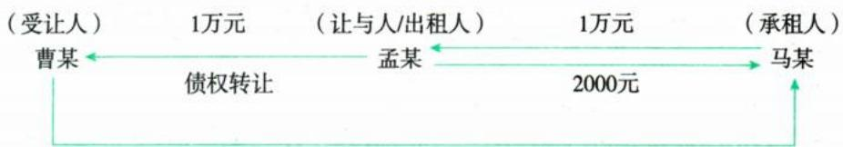

flowchart

```mermaid
graph LR
    A["曹某"] -->|1万元| B(让与人/出租人)
    B -->|1万元| C(承租人)
    C -->|2000元| D["马某"]
    D -->|债权转让| A
```

主张1万元债权
(债权转让情形下抵销权行权当事人法律关系示意图)

3. 费用负担。因债权转让增加的履行费用，由让与人（原债权人）负担（《民法典》第550条）。债务履行费用，是指因清偿债务所必须支出的费用，如因交付货物而支出的运费。实践中，受让人可能请求债务人在其他地点履行债务。基于保护债务人利益的考量，增加的履行费用（如运费）有约定从约定，无约定最终由让与人（原债权人）负担。

#### （四）债权转让和第三人代为接受履行（清偿）的区别

在第三人代为接受履行的情况下，该第三人始终不是合同当事人，故向该第三人履行不合格时，债务人仍应向债权人而不是该第三人承担违约责任。与此相对应，在债权转让（让与）情况下，第三人（受让人）成为合同当事人，债务人履行不合格时，债务人应向该第三人（受让人）承担违约责任，而与原债权人没有关系。

#### >> 随堂练习

张某欠李某货款10万元，迟迟不履行。李某一气之下将该债权拆分10等份（每份1万元）分别转让给10个朋友，并通知张某逐一履行。关于李某的债权转让，根据《民法典》，下列说法正确的是？(2020金题-2-1-21，多) $^{①}$

A. 债权转让未经张某同意无效
B. 李某无权将该债权拆分转让
C. 原则上该转让通知不得撤销
D. 履行合同增加费用应由李某承担

#### 三、债务承担（转移） $^{2}$

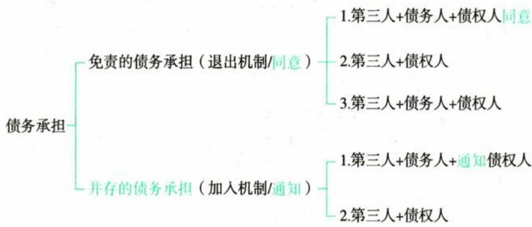

flowchart

```mermaid
graph TD
    A["债务承担"] --> B["免责的债务承担（退出机制/同意）"]
    A --> C["并存的债务承担（加入机制/通知）"]
    B --> D["1.第三人+债务人+债权人同意"]
    B --> E["2.第三人+债权人"]
    B --> F["3.第三人+债务人+债权人"]
    C --> G["1.第三人+债务人+通知债权人"]
    C --> H["2.第三人+债权人"]
```

(债务承担体系框架图)

#### (一) 含义

债务承担，又称债务转移，是指在债的关系不失其同一性的基础上，债权人或债务人通过与第三人订立债务承担合同，将债务全部或部分转移于第三人承担的法律现象。该第三人称为承担人。

#### (二) 生效要件

1. 存在合法有效的债务；
2. 被转移的债务具有可让与性；
3. 存在合法有效的债务承担协议。

#### （三）免责的债务承担

根据债务承担后原债务人是否免责（包括全部或部分），债务承担分为：免责的债务承担和并存的债务承担。

#### 1. 含义。

免责的债务承担，是指第三人取代原债务人的地位而承担全部或部分债务，使原债务人全部或部分脱离债的关系的债务承担方式。

#### 2. 协议的签订方式。

（1）债务人和第三人签订债务承担协议。债务人和第三人（承担人）签订债务承担协议的，应当经债权人同意。同意的方式为不要式，即书面、口头或行为均可。债务人或第三人可以催告债权人在合理期限内予以同意，债权人未作表示的，视为不同意。
（2）债权人和第三人签订债务承担协议。债权人和第三人（承担人）签订债务承担协议的，债权人以“签字行为”的方式表明其同意债务转移。
（3）债权人、债务人和第三人三方合意签订债务承担协议。债权人、债务人和第三人（承担人）签订债务承担协议，债权人以“签字行为”的方式表明其同意债务转移。

#### （四）并存的债务承担（债务加入）

#### 1. 含义。

并存的债务承担，又称“附加的债务承担”或“重叠的债务承担”或“债务加入”，是指债务人不脱离债的关系，第三人加入债的关系，与原债务人一起向债权人承担债务的债务承担方式。

#### 2. 责任。

第三人与债务人约定加入债务并通知债权人，或第三人向债权人表示愿意加入债务，债权人未在合理期限内明确拒绝的，债权人可以请求第三人在其愿意承担的债务范围内和债务人承担连带债务。

#### (五) 债务承担和第三人代为履行（清偿）的区别

在第三人代为履行（清偿）的情况下，该第三人始终不是合同当事人，故该第三人履行不合格时，债务人仍应向债权人承担违约责任。与此相对应，在债务承担情况下，第三人成为合同当事人，该第三人履行不合格时，自己应向债权人承担违约责任。

[例] 2025年5月1日，王某经众森公司股东徐某介绍购买众森公司矿粉，王某依约预付了100万元货款，众森公司仅交付部分矿粉，经结算欠王某50万元货款。众森公司法定代表人孟某以一辆宝马轿车作抵押并办理了抵押登记手续。根据上述案情及示意图，请回答如下问题：

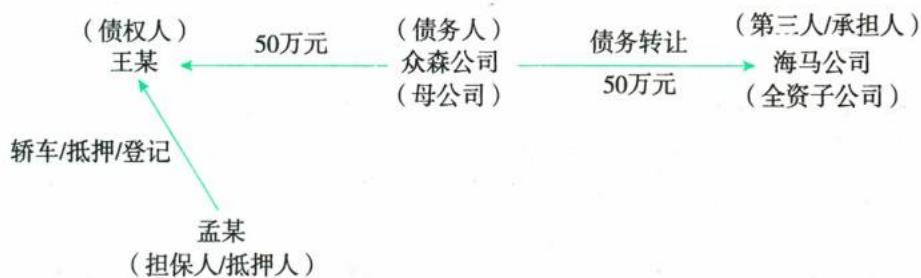

flowchart

```mermaid
graph TD
    A["王某 (债权人)"] -->|50万元| B["众森公司 (母公司)"]
    B -->|债务转让 50万元| C["海马公司 (全资子公司)"]
    D["孟某 (担保人/抵押人)"] -->|轿车/抵押/登记| A
    D --> B
```

(债务承担当事人法律关系示意图)

①5月5日，众森公司与其全资子公司海马公司签订债务承担协议，将50万元货款债务转让给海马公司，未经王某同意是否有效（生效）？

答：内部有效（生效）外部无效（不生效），内外有别。

②5月5日，众森公司与其全资子公司海马公司签订债务承担协议，将50万元货款债务转让给海马公司，债权人王某同意但未经担保人孟某书面同意，担保人孟某应如何承担担保责任？

答：不再承担担保责任。因为第三人提供担保，未经其书面同意，债权人允许债务人转移全部或部分债务的，担保人不再承担相应的担保责任（《民法典》第391、697条）。

③王某可否和全资子公司海马公司签订债务承担协议，约定众森公司的50万元货款债务由海马公司承担？

答：可以。王某（债权人）用签字行为的方式表明同意债务转让。

④王某、众森公司和全资子公司海马公司可否三方书面约定，众森公司的50万元货款债务由海马公司承担？

答：可以。王某（债权人）用签字行为的方式表明同意债务转让。

⑤5月5日，众森公司和全资子公司海马公司签订债务承担协议将50万元货款债务转让给海马公司，众森公司或海马公司催告王某于1个月内予以同意，王某未作表示的，应如何处理？

答：视为不同意。因为债务人将债务的全部或部分转移给第三人的，应当经债权人同意。债务人或第三人可以催告债权人在合理期限内予以同意，债权人未作表示的，视为不同意（《民法典》第551条）。

⑥众森公司和全资子公司海马公司商议，由众森公司和海马公司以欠款人的身份向王某出具欠条。海马公司在欠条上签字的行为构成免责的债务承担还是并存的债务承担？

答：并存的债务承担。承担无限连带责任（责任范围有约从约，无约全部/《民法典》第552条）。

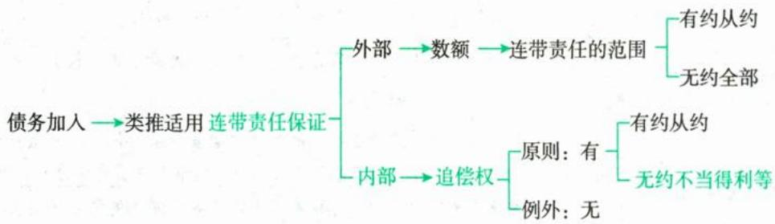

flowchart

```mermaid
graph TD
    A["债务加入"] --> B["类推适用 连带责任保证"]
    B --> C["外部"]
    C --> D["数额"]
    D --> E["连带责任的范围"]
    E --> F["有约从约"]
    E --> G["无约全部"]
    B --> H["内部"]
    H --> I["追偿权"]
    I --> J["原则：有"]
    I --> K["例外：无"]
    J --> L["有约从约"]
    J --> M["无约不当得利等"]
```

(债务加入的体系框架图)

⑦经王某同意，众森公司将50万元货款债务转让给全资子公司海马公司后，谁是债权人？谁是债务人？

答：债权人是王某。债务人是海马公司。

⑧债务全部转移给海马公司后，如众森公司代全资子公司海马公司向王某支付了20万元后即不再履行，则王某追究谁的违约责任？

答：海马公司（合同相对性原理）。

⑨债务全部转移给全资子公司海马公司后，如众森公司清偿了50万元债务，是否构成第三人代为履行（清偿）？

答：构成。因为母公司和全资子公司之间存在关联关系，具有合法利益（《民法典》第524条）。

⑩众森公司代为履行了（清偿了）50万元债务后，是否享有对海马公司的求偿权（追偿权）？

答：享有（法定债权转让）。

#### 四、债权债务的概括承受①

#### (一) 含义

债权债务的概括承受，是指债的一方当事人将其债权债务一并转移给第三人，由第三人概括地承受权利义务的法律现象。

#### (二) 种类

#### 1. 意定概括承受。

意定概括承受，是指双务合同的一方将其债权债务通过协议一并转移于第三人，并经对方同意。

#### 2. 法定概括承受。

法定概括承受，是指依法使债权债务由原债权债务人转移给新的债权债务人。

[萌主点拨]
债权债务法定概括承受汇总表

<table><tr><td>法律制度</td><td>法律条文</td><td>条文内容</td></tr><tr><td>法人的合并与分立</td><td>《民法典》第67条</td><td>法人合并的,其权利和义务由合并后的法人享有和承担。法人分立的,其权利和义务由分立后的法人享有连带债权,承担连带债务,但是债权人和债务人另有约定的除外</td></tr><tr><td>所有权变动不破租赁</td><td>《民法典》第725条</td><td>租赁物在承租人按照租赁合同占有期限内发生所有权变动的,不影响租赁合同的效力</td></tr><tr><td>限定继承规则</td><td>《民法典》第1161条</td><td>继承人以所得遗产实际价值为限清偿被继承人依法应当缴纳的税款和债务。超过遗产实际价值部分,继承人自愿偿还的不在此限。继承人放弃继承的,对被继承人依法应当缴纳的税款和债务可以不负清偿责任</td></tr></table>

### 18 专题十八 合同（债）的权利义务终止

#### 复习提要

合同（债）的权利义务终止规定在《民法典》第三编合同第一分编通则第七章（第557—576条），共20条。同时，《民法典合同编通则解释》第19、27、28、52—58条，共10条亦对合同（债）的权利义务终止进行了补充细化规定。本专题主要涉及六个问题：1. 清偿；2. 合同解除；3. 抵销；4. 提存；5. 免除；6. 混同。其中最为重要的是合同解除，是每年必考的考点。

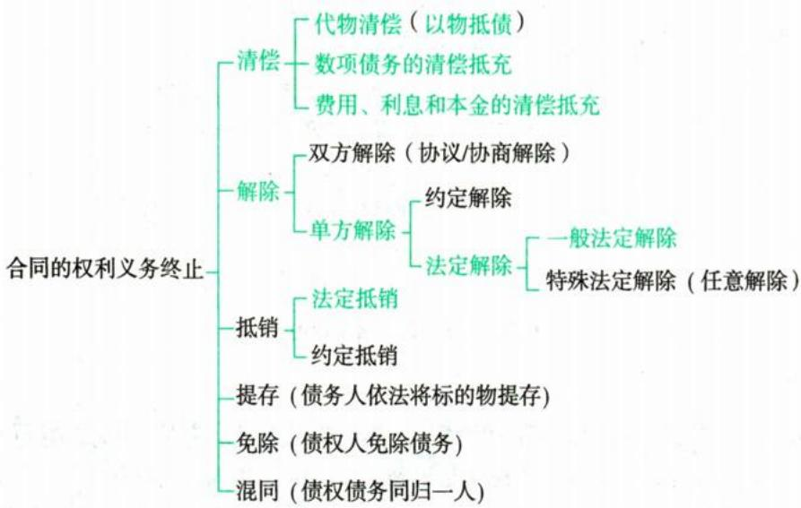

flowchart

```mermaid
graph TD
    A["合同的权利义务终止"] --> B["清偿"]
    A --> C["解除"]
    A --> D["抵销"]
    A --> E["提存"]
    A --> F["免除"]
    A --> G["混同"]
    
    B --> H["代物清偿（以物抵债）"]
    B --> I["数项债务的清偿抵充"]
    B --> J["费用、利息和本金的清偿抵充"]
    
    C --> K["双方解除（协议/协商解除）"]
    C --> L["单方解除"]
    L --> M["约定解除"]
    L --> N["法定解除"]
    N --> O["一般法定解除"]
    N --> P["特殊法定解除（任意解除）"]
    
    D --> Q["法定抵销"]
    D --> R["约定抵销"]
    
    E --> S["提存（债务人依法将标的物提存）"]
    F --> T["免除（债权人免除债务）"]
    G --> U["混同（债权债务同归一人）"]
```

#### 一、清偿

#### (一) 含义

清偿，是指债务人依照法律规定或合同约定完成义务的行为。清偿与履行同义，只是清偿（结果）是从债的消灭角度而言，而履行（过程）是从债的效力出发强调债务的实现过程。

#### (二) 代物清偿 (以物抵债) $^{①}$

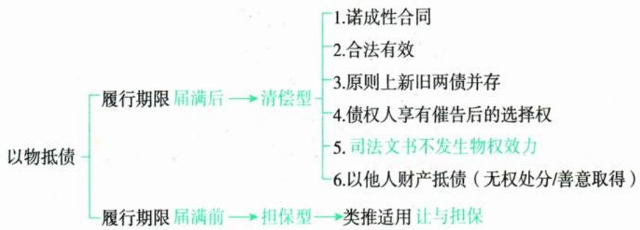

flowchart

```mermaid
graph TD
    A["以物抵债"] --> B["履行期限 届满后"]
    A --> C["履行期限 届满前"]
    B --> D["清偿型"]
    D --> E1["1.诺成性合同"]
    D --> E2["2.合法有效"]
    D --> E3["3.原则上新旧两债并存"]
    D --> E4["4.债权人享有催告后的选择权"]
    D --> E5["5.司法文书不发生物权效力"]
    D --> E6["6.以他人财产抵债（无权处分/善意取得）"]
    C --> F["担保型"]
    F --> G["类推适用 让与担保"]
```

(以物抵债协议/代物清偿协议体系框架图)

1. 含义。

代物清偿，又称以物抵债，是指在债的履行过程中，债权人受领他种给付以代替原定给付而使债的关系消灭。

2. 构成要件。

代物清偿需要符合四个构成要件，分别是：

(1) 有原债务存在;
(2) 经双方当事人约定，以他种给付代替原定给付；
(3) 有双方当事人关于代物清偿的合意;
(4) 债权人或其他有履行受领权的人现实地受领给付。

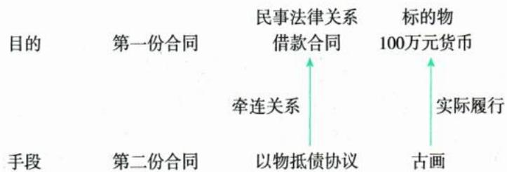

flowchart

```mermaid
graph LR
    A["目的"] --> B["第一份合同"]
    B --> C["第二份合同"]
    C --> D["以物抵债协议"]
    D --> E["古画"]
    E --> F["实际履行"]
    F --> G["民事法律关系借款合同"]
    G --> H["牵连关系"]
    H --> I["标的物 100万元货币"]
```

(以物抵债法律关系示意图)

#### >> 随堂练习

王某向丁某借款100万元，后无力清偿，遂提出以自己所有的一幅古画抵债，双方约定第二天交付。对此，下列哪些说法是正确的？(2016-3-56，多)②

A. 双方约定以古画抵债，等同于签订了另一份买卖合同，原借款合同失效，王某只能以交付古画履行债务
B. 双方交付古画的行为属于履行借款合同义务
C. 王某有权在交付古画前反悔，提出继续以现金偿付借款本息方式履行债务
D. 古画交付后，如果被鉴定为赝品，则王某应承担瑕疵担保责任

#### [萌主点拨]

<table><tr><td>借期届满前</td><td>借期届满后</td></tr><tr><td>流押(质)条款</td><td>清偿型以物抵债协议</td></tr></table>

#### (流押/质条款和清偿型以物抵债协议的区别示意图)

[图释] 流押（质）条款与清偿型以物抵债协议如何区分？

一般而言，二者的分水岭系“借款期限届满”。

借款期限届满前，债权人往往处于优势地位，其可能会趁债务人之急迫而滥用自己的优势地位（违反诚信原则），通过压低担保物价值的方式强迫担保人（可能是债务人，亦可能是债务人以外的第三人）放弃巨额利益获得暴利。同时，债务人为了获得资金，也可能采用“饮鸩止渴”的融资方式。因此，债权人与担保人约定，到期不履行债务时，标的物（担保财产）“直接归债权人所有”，该种约定剥夺了标的物的“市场定价权”，属于流押（质）条款，法律对该种约定本身持“否定性评价”，认定为无效，转化成“清算型担保”，即仅享有“优先”受偿权（有顺序）。

借款期限届满后，债务人往往处于优势地位，其往往可能会逃债。如债务人诚信，在不损害其他债权人或根本无其他债权人的情况下，可能会与债权人约定“以物抵债”，即代物清偿（俗称“抵债”“抵账”“抵顶”等），以他种给付代替原定给付（如用手表抵债）。该种约定属于清偿型以物抵债协议，法律对该种约定持“肯定性评价”，认定为有效。

#### （三）数项债务的清偿抵充 $^{①}$

#### 1. 含义。

清偿抵充，是指在债务人对于同一债权人负担数宗（项）同种类的债务而清偿人提供的给付不足以清偿全部债务时，决定以该给付抵充何宗（项）债务的规则。

#### 2. 构成要件。

通说认为，清偿抵充需要符合三个构成要件，分别是：

（1）须债务人对于同一债权人负担数宗（项）债务；
(2) 须数宗（项）债务之给付种类相同；
(3) 须债务人提出之给付不足以清偿全部债务。

#### 3. 方法。

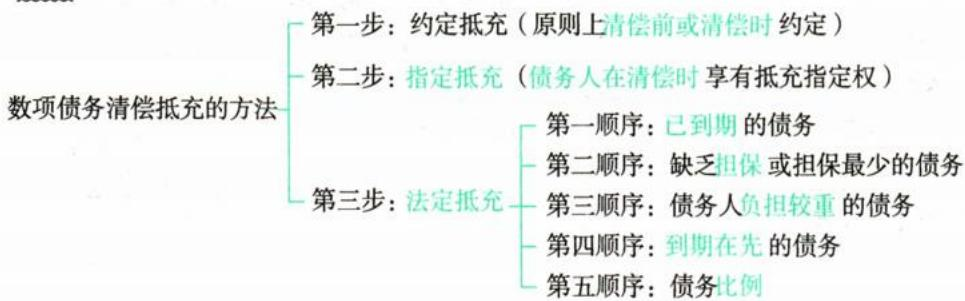

flowchart

```mermaid
graph TD
    A["数项债务清偿抵充的方法"] --> B["第一步：约定抵充（原则上清偿前或清偿时 约定）"]
    A --> C["第二步：指定抵充（债务人在清偿时 享有抵充指定权）"]
    A --> D["第三步：法定抵充"]
    D --> E["第一顺序：已到期的债务"]
    D --> F["第二顺序：缺乏担保或担保最少的债务"]
    D --> G["第三顺序：债务人负担较重的债务"]
    D --> H["第四顺序：到期在先的债务"]
    D --> I["第五顺序：债务比例"]
```

(数项债务清偿抵充的方法体系框架图)

#### >> 随堂练习

胡某于2006年3月10日向李某借款100万元，期限3年。2009年3月30日，双方商议再借100万元，期限3年。两笔借款均先后由王某保证，未约定保证方式和保证期间。李某未向胡某和王某催讨。胡某仅于2010年2月归还借款100万元。关于胡某归还的100万元，下列哪一表述是正确的？(2014-3-13，单) $^{①}$

A. 因 2006 年的借款已到期，故归还的是该笔借款
B. 因 2006 年的借款无担保，故归还的是该笔借款
C. 因 2006 年和 2009 年的借款数额相同，故按比例归还该两笔借款
D. 因 2006 年和 2009 年的借款均有担保，故按比例归还该两笔借款

#### (四) 费用、利息和本金的清偿抵充②

债务人在履行主债务外还应当支付利息和实现债权的有关费用，其给付不足以清偿全部债务的，除当事人另有约定外，清偿抵充顺序可以概括为：约定>费用>利息>本金。

[例] 孟某向马某借款 100 万元，期限 1 年，年息 10%（利息 10 万元）。到期后，孟某拒绝归还欠款，马某将孟某诉至法院，支付各项费用 2 万元。强制执行程序中，孟某向马某清偿了 50 万元，如双方无特别约定，先抵充实现债权的费用 2 万元。后抵充利息 10 万元，最后抵充主债务 100 万元，因此，未偿还的主债务还剩 62 万元，该 62 万元继续按年息 10% 计算利息。

#### 二、合同解除 $^{③}$

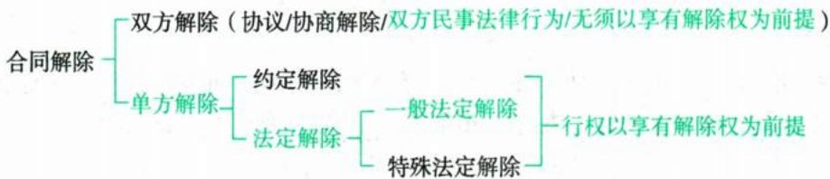

flowchart

```mermaid
graph TD
    A["合同解除"] --> B["双方解除（协议/协商解除/双方民事法律行为/无须以享有解除权为前提）"]
    A --> C["单方解除"]
    C --> D["约定解除"]
    C --> E["法定解除"]
    E --> F["一般法定解除"]
    E --> G["特殊法定解除"]
    F --> H["行权以享有解除权为前提"]
```

(合同解除体系框架图)

《民法典》第562—567条共6条规定了合同解除制度。合同解除共5个核心考点，分别是：

1. 对象法定：尚未履行或尚未履行完毕（钱物交割完毕无解除权问题）且合法有效的合同（无效合同无解除权问题）才可以被解除。

2. 程度法定：根本违约（合同目的无法实现/落空/以违约结果作为基本标准）才可以解除合同（导致/致使/以致/违约程度轻微或显著轻微不得解除合同）。

3. 情形法定：双方解除或单方解除。

4. 行权法定：或诉或裁或通知（简单形成权）。

5. 效力法定：合同解除三个不影响：（1）不影响合同效力；（2）不影响违约责任；（3）不影响担保责任。

① 答案：A。
② 考查空白，重点关注。
③ 考查6次且主观题亦重点考查，《民法典合同编通则解释》第52—54条（共3条）进一步细化解释合同解除权问题，重点关注。

#### (一) 含义

合同解除，是指根据双方或一方当事人的意思表示使合同关系归于终了的制度。

#### (二) 双方解除

双方解除，又称协议/协商解除、合意解除，是指合同成立并生效后，在未履行或未完全履行之前，合同当事人通过协商解除合同，使合同效力归于消灭。双方解除的实质是在原合同当事人之间成立一个新合同，该新合同的目的在于解除当事人原先订立的合同关系，使基于原合同发生的债权债务关系归于消灭。

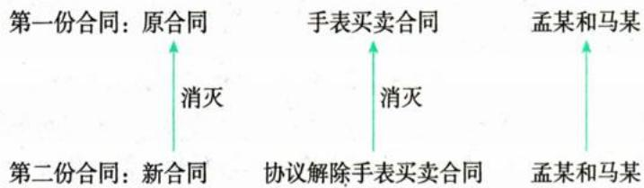

flowchart

```mermaid
graph TD
    A["第一份合同：原合同"] -->|消灭| B["第二份合同：新合同"]
    C["手表买卖合同"] -->|消灭| D["协议解除手表买卖合同"]
    E["孟某和马某"] -->|消灭| F["孟某和马某"]
```

(协议/协商解除当事人法律关系示意图)

[例] 孟某和马某签订了一份手表买卖合同，双方约定：第2天上午9点，取表时付款（同时履行抗辩权）。当天晚上，孟某和马某均后悔。第2天上午9点，双方又签订了一份解除手表买卖合同的协议，并约定互相不追究对方的违约责任。此时，孟某和马某二人以一份新合同来解除原先订立的合同，即属于典型的协议解除（协商解除/合意解除）。

#### （三）单方解除

#### 1. 约定解除权①。

约定解除权，是指当事人以合同条款的形式，在合同生效后未履行或未完全履行之前，由一方当事人在约定解除合同的事由发生时享有解除权，并据此通过行使解除权，使合同关系归于消灭。

[萌主点拨] 约定解除和协议解除的核心区别在于：约定解除乃合同成立时即“事前所为”，而协议解除乃“事后所为”。

#### 2. 法定解除权。

法定解除权，是指合同生效后未履行或未完全履行完毕前，当事人在法律规定的事由出现时，通过行使解除权而使合同关系归于消灭。

#### (1) 一般法定解除权（《民法典》第563条）。

[例] 孟某为了（行为/合同目的）父母养老于2024年6月1日在北京市昌平区与众森公司签订房屋买卖合同，价款850万元。众森公司承诺：“未来小区内配有全套养老设施（从给付义务）”，同时，双方约定2025年6月1日前交房（债权效力），7月1日前完成过户登记（物权效力）手续。根据上述案情，请回答如下问题：

①2025年5月1日，众森公司已将房屋建设完毕并配有全套养老设施。但5月20日，当地发生地震，房屋毁损灭失，无法于约定的日期交房并办理过户登记手续。请问：此时谁可以解除合同？解除合同的同时可否追究对方的违约责任？

##### 民法·专题讲座精讲卷

答：双方。不可以。因为因不可抗力致使不能实现合同目的（根本违约）的，双方当事人均可以解除合同。同时，不可以追究对方的违约责任（因为不可抗力属于法定的违约责任免责事由）。

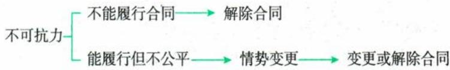

flowchart

```mermaid
graph LR
    A["不可抗力"] --> B["不能履行合同"]
    A --> C["能履行但不公平"]
    B --> D["解除合同"]
    C --> E["情势变更"]
    E --> F["变更或解除合同"]
```

(不可抗力对合同履行影响体系框架图)

②2025年5月1日，孟某发现众森公司迟迟未开工，按期交房无望。请问：此时谁可以解除合同？解除合同的同时可否追究对方的违约责任？

答：非违约方（孟某）单方可以解除合同，可以追究对方（众森公司）的违约责任。因为在履行期限届满之前，当事人一方明确表示或以自己的行为表明不履行主要债务（预期违约/《民法典》第578条）的，非违约方单方可以解除合同。同时，可以追究对方的违约责任。

③2025年5月1日，众森公司已将房屋建设完毕并配有全套养老设施。但7月1日无法给孟某办理过户登记手续，孟某催告（法定催告义务）众森公司于10月1日前（合理期限3个月/《商品房买卖合同解释》第11条）完成过户。但直到10月1日，众森公司仍无法给孟某办理过户登记手续。请问：此时谁可以解除合同？解除合同的同时可否追究对方的违约责任？

答：非违约方（孟某）单方可以解除合同，可以追究对方（众森公司）的违约责任。因为当事人一方迟延履行主要债务，经催告后在合理期限内仍未履行的，非违约方单方可以解除合同。同时，可以追究对方的违约责任。

④2025年5月1日，众森公司已将房屋建设完毕但却没有全套养老设施①。请问：此时谁可以解除合同？解除合同的同时可否追究对方的违约责任？

答：非违约方（孟某）单方可以解除合同，可以追究对方（众森公司）的违约责任。因为当事人一方迟延履行债务或有其他违约行为致使不能实现合同目的（根本违约）的，非违约方单方可以解除合同。同时，可以追究对方的违约责任。

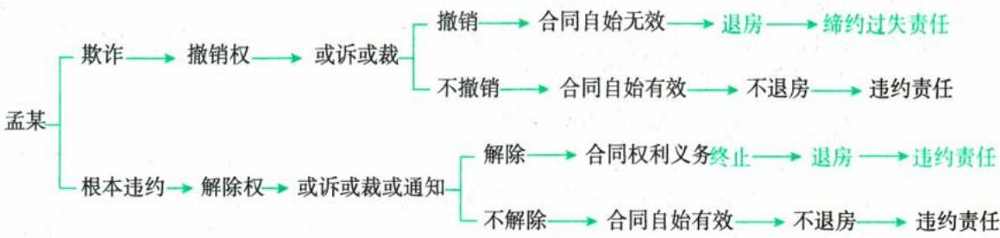

flowchart

```mermaid
graph TD
    A["孟某"] --> B["欺诈"]
    A --> C["根本违约"]
    B --> D["撤销权"]
    D --> E["或诉或裁"]
    E --> F["撤销"]
    F --> G["合同自始无效"]
    G --> H["退房"]
    H --> I["缔约过失责任"]
    E --> J["不撤销"]
    J --> K["合同自始有效"]
    K --> L["不退房"]
    L --> M["违约责任"]
    C --> N["解除权"]
    N --> O["或诉或裁或通知"]
    O --> P["解除"]
    P --> Q["合同权利义务终止"]
    Q --> R["退房"]
    R --> S["违约责任"]
    O --> T["不解除"]
    T --> U["合同自始有效"]
    U --> V["不退房"]
    V --> W["违约责任"]
```

(从给付义务的违反导致根本违约行权法律关系示意图)

##### [萌主点拨]

可撤销的民事法律行为中的撤销权 VS 一般法定解除权

<table><tr><td>项目</td><td>撤销权</td><td>解除权</td></tr><tr><td>权利性质</td><td>形成权</td><td>形成权</td></tr><tr><td>行权期间</td><td>除斥期间(法定或约定)</td><td>除斥期间(法定或约定)</td></tr><tr><td>行使方式</td><td>形成诉权(或诉或裁)</td><td>简单形成权(或诉或裁或通知)</td></tr><tr><td>行权对象</td><td>效力有瑕疵的合同</td><td>效力无瑕疵的合同</td></tr><tr><td>行权情形</td><td>4种(重大误解、欺诈、胁迫和显失公平)</td><td>4种(不可抗力、预期违约、迟延履行和从给付义务)</td></tr><tr><td>行权后果</td><td>自始无效</td><td>权利义务终止</td></tr><tr><td>责任承担</td><td>缔约过失责任</td><td>违约责任</td></tr></table>

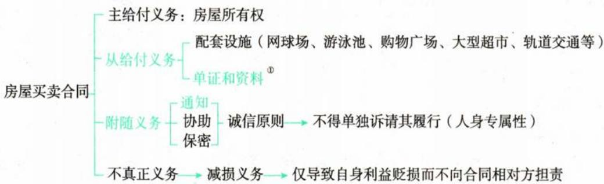

flowchart

```mermaid
graph TD
    A["房屋买卖合同"] --> B["主给付义务：房屋所有权"]
    A --> C["从给付义务"]
    C --> D["配套设施（网球场、游泳池、购物广场、大型超市、轨道交通等）"]
    C --> E["单证和资料①"]
    A --> F["附随义务"]
    F --> G["通知"]
    F --> H["协助"]
    F --> I["保密"]
    F --> J["诚信原则"]
    J --> K["不得单独诉请其履行（人身专属性）"]
    A --> L["不真正义务"]
    L --> M["减损义务"]
    M --> N["仅导致自身利益贬损而不向合同相对方担责"]
```

(房屋买卖合同中的四大义务解构示意图)

#### >> 随堂练习

甲房产开发公司在交给购房人张某的某小区平面图和项目说明书中都标明有一个健身馆。张某看中小区健身方便，决定购买一套商品房并与甲公司签订了购房合同。张某收房时发现小区没有健身馆。下列哪些表述是正确的？(2014-3-51，多) $^{②}$

A. 甲公司不守诚信，构成根本违约，张某有权退房
B. 甲公司构成欺诈，张某有权请求甲公司承担缔约过失责任
C. 甲公司恶意误导，张某有权请求甲公司双倍返还购房款
D. 张某不能滥用权利，在退房和要求甲公司承担违约责任之间只能选择一种

#### (2) 特殊法定解除权。

特殊法定解除权（任意解除权）

<table><tr><td>情形</td><td>内容</td><td>解除权人</td></tr><tr><td>情形1</td><td>不定期租赁合同</td><td>双方</td></tr><tr><td>情形2</td><td>不定期物业服务合同</td><td>双方</td></tr><tr><td>情形3</td><td>不定期合伙合同</td><td>双方</td></tr><tr><td>情形4</td><td>委托合同</td><td>双方</td></tr><tr><td>情形5</td><td>行纪合同</td><td>双方</td></tr><tr><td>情形6</td><td>中介合同</td><td>双方</td></tr><tr><td>情形7</td><td>保管合同</td><td>寄存人、无期限的双方</td></tr><tr><td>情形8</td><td>仓储合同</td><td>无期限的双方</td></tr><tr><td>情形9</td><td>承揽合同</td><td>定作人</td></tr><tr><td>情形10</td><td>货运合同</td><td>托运人</td></tr><tr><td>情形11</td><td>旅游合同</td><td>旅游者</td></tr><tr><td>情形12</td><td>肖像许可使用合同</td><td>无期限的双方</td></tr></table>

#### (四) 解除权的行使 (确认之诉) $^{①}$

#### 1. 行使期限。

#### (1) 性质。

合同解除权系形成权，依法定或约定享有合同解除权的一方当事人，经其单方意思表示即可使合同效力归于消灭（私法效果），打破已有的交易秩序，对当事人的权利义务产生重大影响。因此，为保护交易安全和维护社会经济秩序稳定，合同解除权应受除斥期间的限制。

#### (2) 起算。

法律规定或当事人约定解除权行使期限，期限届满当事人不行使的，该权利消灭。法律没有规定或当事人没有约定解除权行使期限，自解除权人知道或应当知道解除事由之日起1年内不行使，或经对方催告后在合理期限内不行使的，该权利消灭。

#### 2. 行使方式。

#### (1) 通知解除。

当事人一方依法主张解除合同的，应当通知对方。合同自通知到达对方时解除。通知载明债务人在一定期限内不履行债务则合同自动解除，债务人在该期限内未履行债务的，合同自通知载明的期限届满时解除。对方对解除合同有异议的，任何一方当事人均可以请求法院或仲裁机构确认解除行为的效力。

#### (2) 行为解除。

当事人一方未通知对方，直接以提起诉讼或申请仲裁的方式依法主张解除合同，法院或仲裁机构确认该主张的，合同自起诉状副本或仲裁申请书副本送达对方时解除。

[例] 孟某为了（行为/合同目的）父母养老于2024年6月1日在北京市昌平区与众森公司签订房屋买卖合同，价款850万元。众森公司承诺：“未来小区内配有全套养老设施（从给付义务）”，同时，双方约定2025年6月1日前交房，7月1日前完成过户登记手续。2025年5月1日，众森公司已将房屋建设完毕并配有全套养老设施，但7月1日无法给孟某办理过户登记手续，孟某催告众森公司10月1日前完成过户。但直到10月1日，众森公司仍无法给孟某办理过户登记手续。10月2日，众森公司收到了孟某书面解除合同的通知。10月3日，孟某收到了众森公司不同意解除合同的书面通知。根据上述案情及示意图，请回答如下问题：

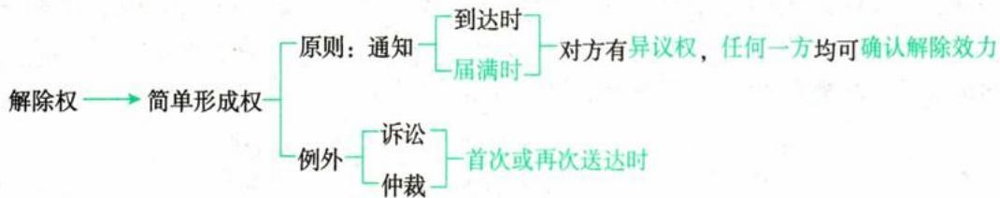

flowchart

```mermaid
graph TD
    A["解除权"] --> B["简单形成权"]
    B --> C["原则：通知"]
    C --> D["到达时"]
    C --> E["届满时"]
    D --> F["对方有异议权，任何一方均可确认解除效力"]
    B --> G["例外"]
    G --> H["诉讼"]
    G --> I["仲裁"]
    H --> J["首次或再次送达时"]
```

(解除权行权方式法律思维导图)

①孟某可否书面通知众森公司解除合同？

答：可以。因为解除权属于简单形成权，通知即可行权（《民法典》第565条）。

②孟某书面通知众森公司解除合同的前提条件是什么？

答：孟某应当享有法定或约定的解除权。

③孟某可否直接以诉讼或仲裁（前提是二者之间存在合法有效的仲裁条款）的方式解除和众森公司之间的房屋买卖合同？

答：可以（起诉状副本或仲裁申请书副本送达对方时解除）。

④众森公司不同意解除合同是在行使何种民事权利？

答：异议权（异议权的行使方式为诉讼或仲裁而不能通知）。

⑤孟某和众森公司谁可以向法院或仲裁机构提起确认解除行为的效力？

答：双方均可以（任何一方）。

⑥如11月16日，北京市昌平区人民法院判决支持孟某解除合同的诉讼请求，孟某和众森公司之间的房屋买卖合同何时解除？

答：10月2日，即通知到达时合同解除（确认判决而非形成判决）。

⑦如11月16日，北京市昌平区人民法院判决驳回孟某解除合同的诉讼请求，孟某和众森公司之间的房屋买卖合同何时解除？

答：一直未解除。

#### (五) 解除权的效力 $^{①}$

合同解除后，尚未履行的，终止履行。已经履行的，根据履行情况和合同性质，当事人可以请求恢复原状或采取其他补救措施，并有权请求赔偿损失。合同因违约解除的，解除权人可以请求违约方承担违约责任，但是当事人另有约定的除外。主合同解除后，担保人对债务人应当承担的民事责任仍应当承担担保责任，但是担保合同另有约定的除外。

[萌主点拨] 合同解除不影响合同效力、不影响违约责任、不影响担保责任。

合同的权利义务关系终止，不影响合同中结算和清理条款的效力。合同中的结算和清理条款，其效力具有独立性。合同权利义务关系终止的，有关结算和清理条款仍然有效。

[例] 2025年3月2日，花茉莉公司和新疆棉花公司签订了一份100吨棉花采购协议，价款2000万元。双方约定，花茉莉公司应于合同签订后的10日内将2000万元全部给付给新疆棉花公司，新疆棉花公司于5月底一次性交付全部棉花。3月3日，西安担保公司和花茉莉公司签订了一份担保协议，该协议约定，如到期新疆棉花公司不履行合同义务，本公司无条件承担责任。合同签订后，花茉莉公司分别与A物流公司签订了运输合同，与B仓储公司签订了仓储合同，与C劳务派遣公司签订了劳务派遣合同。5月底，新疆棉花公司仅能交付40吨棉花，导致花茉莉公司的合同目的无法实现（根本违约），造成实际损失850万元。根据上述案情及示意图，请回答如下问题：

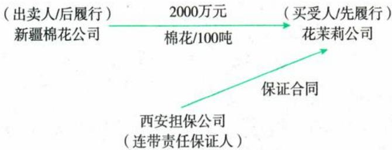

flowchart

```mermaid
graph TD
    A["(出卖人/后履行) 新疆棉花公司"] -->|2000万元 棉花/100吨| B["(买受人/先履行) 花茉莉公司"]
    B -->|保证合同| C["(西安担保公司 (连带责任保证人)"]
```

##### (解除权行使效力当事人法律关系示意图)

①新疆棉花公司与花茉莉公司之间的棉花采购协议效力如何？

答：合法有效。因为完全符合《民法典》第143条的规定（强、公、主、意）。

②花茉莉公司是否有权解除与新疆棉花公司的采购协议？为什么？

答：有权。因为新疆棉花公司部分履行导致花茉莉公司合同目的无法实现（根本违约），非违约方花茉莉公司有权行使法定解除权解除棉花采购协议（《民法典》第563条第4项）。

③花茉莉公司可否通知新疆棉花公司解除合同？

答：可以。因为解除权属于简单形成权，通知即可行权（《民法典》第565条）。

④花茉莉公司解除合同后，尚未履行的60吨棉花是否需要继续履行？

答：不需要。因为合同解除后，尚未履行的，终止履行（即不再履行/《民法典》第566条）。

⑤花茉莉公司解除合同后，已经履行的40吨棉花可否请求新疆棉花公司拉走以恢复原状？

答：可以。因为部分履行对花茉莉公司而言毫无意义，不符合合同目的。

⑥花茉莉公司解除合同后，可否追究新疆棉花公司的违约责任，赔偿850万元的实际损失？

答：可以。因为合同解除，不影响违约责任的承担。

⑦花茉莉公司解除合同后，可否请求西安担保公司承担担保责任？

答：可以。因为合同解除，不影响担保责任的承担。

#### 三、抵销①

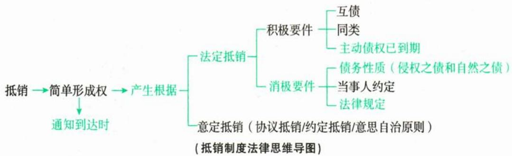

flowchart

```mermaid
graph TD
    A["抵销"] --> B["简单形成权"]
    B --> C["通知到达时"]
    C --> D["产生根据"]
    D --> E["法定抵销"]
    E --> F["积极要件"]
    F --> G["互债"]
    F --> H["同类"]
    F --> I["主动债权已到期"]
    D --> J["消极要件"]
    J --> K["债务性质（侵权之债和自然之债）"]
    J --> L["当事人约定"]
    J --> M["法律规定"]
    D --> N["意定抵销（协议抵销/约定抵销/意思自治原则）"]
```

#### (一) 含义

抵销，是指互负债务的双方当事人将两项债务互相充抵，以使双方债务在同等数额内消灭的行为。

#### (二) 法定抵销的构成要件

法定抵销，是指依法律规定以当事人一方的意思表示所作的抵销。用作抵销的债权称为主动债权或自动债权，被抵销的债权称为被动债权。

1. 积极要件。

(1) 双方当事人互负债务。简称为“互债”。
（2）双方债务的标的物种类（性质和特点）、品质（质量、规格、等级）相同。简称为“同类”。
(3) 主动债权（提出抵销的债权）已到期。简称为“主动债权已到期”。

2. 消极要件。

(1) 侵权之债。

因侵害自然人人身权益，或故意、重大过失侵害他人财产权益产生的损害赔偿债务，侵权人主张抵销的，法院不予支持。（《民法典合同编通则解释》第57条）。

(2) 自然之债。

当事人互负债务，一方以其诉讼时效期间已经届满的债权通知对方主张抵销，对方提出诉讼时效抗辩的，法院对该抗辩应予支持。一方的债权诉讼时效期间已经届满，对方主张抵销的，法院应予支持（《民法典合同编通则解释》第58条）。

#### (三) 性质和行使

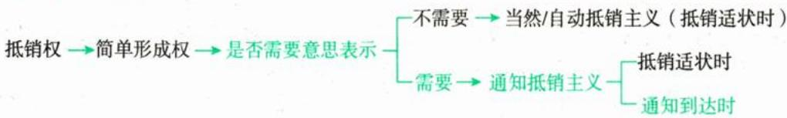

flowchart

```mermaid
graph LR
    A["抵销权"] --> B["简单形成权"]
    B --> C{是否需要意思表示}
    C -->|不需要| D["当然/自动抵销主义（抵销适状时）"]
    C -->|需要| E["通知抵销主义"]
    E --> F["抵销适状时"]
    E --> G["通知到达时"]
```

(抵销权行使体系框架图)

法定抵销权在性质上属于简单形成权。因此，一经通知对方即发生债的消灭效力，不以对方同意为要件。通知自到达对方时生效。抵销不得附条件或期限。

#### (四) 效力

法定抵销权的行使不具有溯及力，通知到达对方时双方互负的主债务、利息、违约金或损害赔偿金等债务在同等数额内消灭。

[萌主点拨]
法定抵销 VS 意定抵销

<table><tr><td>项目</td><td>法定抵销</td><td>意定抵销</td></tr><tr><td>法律依据</td><td>《民法典》第568条</td><td>《民法典》第569条</td></tr><tr><td>性质</td><td>单方民事法律行为</td><td>双方民事法律行为</td></tr><tr><td>抵销根据</td><td>法律规定</td><td>当事人约定</td></tr><tr><td>标的物</td><td>种类、品质相同</td><td>没有限制</td></tr><tr><td>期限</td><td>主动债权已到期</td><td>没有限制</td></tr><tr><td>实现方式</td><td>通知</td><td>协议</td></tr><tr><td>效力</td><td>通知到达时</td><td>达成抵销协议时</td></tr></table>

#### 四、提存①

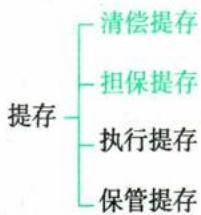

flowchart

```mermaid
graph TD
    A["提存"] --> B["清偿提存"]
    A --> C["担保提存"]
    A --> D["执行提存"]
    A --> E["保管提存"]
```

(提存制度体系框架图)

#### (一) 含义

提存，是指由于债权人原因，债务人无法向债权人清偿其到期债务，债务人将合同标的物交付特定的提存部门，从而完成债务清偿，使债务消灭的制度。

#### (二) 事由

因债权人原因导致债务人难以履行债务的，债务人可以将标的物提存：

1. 债权人无正当理由拒绝受领。典型情形包括：

(1) 货运合同中，收货人无正当理由拒绝受领货物；
(2) 仓储合同中，经催告存货人逾期仍不提取仓储物；
（3）行纪合同中，委托物不能卖出，经催告委托人仍不取回该物。

债务人按照约定履行债务，债权人无正当理由拒绝受领的，债务人可以请求债权人赔偿增加的费用。在债权人受领迟延期间，债务人无须支付利息。

[例] 孟某与曹某签订销售空调 100 台的合同，但当孟某向曹某交付时，曹某以空调市场疲软为由，拒绝受领，请求孟某返还货款。孟某可以向有关部门提存这批空调。

2. 债权人下落不明。
3. 债权人死亡未确定继承人、遗产管理人或丧失民事行为能力未确定监护人。
4. 法律规定的其他情形。

#### (三) 标的物

原则上为债（合同）的标的物。标的物不适于提存（如鲜活易腐烂物品、危险物品等）或提存费用过高的，债务人依法可以拍卖或变卖标的物，提存所得的价款。

#### (四) 法律效力

债务人将标的物或将标的物依法拍卖、变卖所得价款交付提存部门时，提存成立。提存成立的，视为债务人在其提存范围内已经交付标的物。标的物提存后，债务人应当及时通知债权人或债权人的继承人、遗产管理人、监护人、财产代管人。标的物的所有权、领取权、风险、孳息、提存费均归债权人。如债务人另行清偿债务的，提存人（债务人）得取回提存物。

#### (五) 提存部门的义务

提存部门负有妥善保管义务（保管合同），因保管不善导致保管物毁损的，应当向债权人承担赔偿责任，如债务人另行清偿债务的，应当向债务人承担赔偿责任。在我国，提存被作为一种公证业务而由债务履行地的公证处管辖。

[例] 孟某在甲提存机构办好提存手续并通知债权人马某后，将2台专业相机、2台天文望远镜交甲机构提存。后孟某另行向马某履行了提存之债，要求取回提存物。但甲机构工作人员在检修自来水管道时因操作不当引起大水，致孟某交存的物品严重毁损。孟某有权主张赔偿财产损失。

#### （六）提存物的领取权

债权人可以随时领取提存物。但是，债权人对债务人负有到期债务的，在债权人未履行债务或提供担保之前，提存部门根据债务人的要求应当拒绝其领取提存物。债权人领取提存物的权利，自提存之日起5年内（除斥期间）不行使而消灭，提存物扣除提存费用后归国家所有。但在如下两种情形下，债务人负担提存费后有权取回提存物：

1. 债权人未履行对债务人的到期债务。
2. 债权人向提存部门书面表示放弃领取提存物权利。

#### 五、免除①

#### (一) 含义

免除，是指债权人以全部或部分消灭债为目的而向债务人作出的抛弃债权的行为（《民法典》第575条）。

#### (二) 对象

债务免除的对象可以是部分债务，也可以是全部债务。

#### (三) 特征

1. 基于债的相对性原理，债权人免除债务的意思表示应向债务人表示，免除是有相对人的意思表示，应当通知债务人或债务人的代理人。
2. 债务免除系非要式民事法律行为，可以书面形式，也可以口头形式。

#### (四) 性质

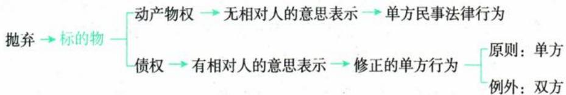

flowchart

```mermaid
graph LR
    A["抛弃"] --> B["标的物"]
    B --> C["动产物权"]
    C --> D["无相对人的意思表示"]
    D --> E["单方民事法律行为"]
    B --> F["债权"]
    F --> G["有相对人的意思表示"]
    G --> H["修正的单方行为"]
    H --> I["原则：单方"]
    H --> J["例外：双方"]
```

(抛弃动产物权和债权区别体系框架图)

我国《民法典》第575条采用“修正的单方行为说”，即原则上债务免除的效果不取决于债务人的接受，而可以直接发生法律效果；但是如果债务人行使拒绝权，则债务免除自始不发生法律效果。

[例] 孟某和刘某之间有借贷关系，后二人结婚。此时，孟某、刘某之间的债权债务可以因免除而消灭。

##### 随堂练习

李某、王某、赵某三人系好友。李某向王某借款5万元。某日，王某偶遇赵某，谈及李某。王某对赵某表示：“李某生活困难，父母又生病，这钱他不用还了”。下列哪一选项是正确的？（2020金题-2-1-24，单）①

A. 王某的意思表示向赵某作出时生效
B. 王某免除债务的意思表示须李某受领
C. 李某无须向王某偿还债务
D. 王某的意思表示不产生债务免除的效果

#### 六、混同②

#### (一) 含义

狭义的混同，是指债权和债务同归一人的事实。混同是一种事件，即因某些客观事实发生而产生的债权债务同归一人，不必由当事人为意思表示（《民法典》第576条）。

#### (二) 类型

狭义的混同，根据混同事实发生的原因不同，分为两类，分别是：概括承受和特定承受。

#### 1. 概括承受。

（1）债权人继承债务人的遗产或债务人继承债权人的遗产而导致债权债务同归于一人。

[例] 儿子小王向其父王某借款200万元用于做生意。后王某因车祸死亡。儿子小王是王某的唯一继承人。该200万元债务消灭。因为200万元债权债务同归于小王一人，债因混同而消灭。

(2) 第三人同时继承债权人和债务人的遗产。

[例] 儿子小王向其父王某借款200万元用于做生意。后王某和小王因车祸同时死亡。孙子小小王是二人的唯一继承人。该200万元债务消灭。因为200万元债权债务同归于小小王一人，债因混同而消灭。

(3) 债权人和债务人为企业时的合并。

[例] 甲公司欠乙公司货款50万元，乙公司欠甲公司租金50万元。后甲公司被乙公司兼并（吸收合并）。甲公司与乙公司之间的债消灭。因为50万元债权债务同归于乙公司一家公司，债因混同而消灭。

2. 特定承受。

（1）债务人受让债权人的债权，如债权人与债务人签订合同后，债权人将合同权利转让给债务人。
(2) 债权人承受债务人的债务。

#### (三) 法律效果

债权和债务同归于一人的，债权债务终止，但是损害第三人利益的除外。例如甲以对乙的债权为丙设定权利质权，嗣后甲乙之间的债权债务即使混同，为了保护质权人丙的利益，作为权利质权之标的物的债权并不消灭。再如，债权人甲请求执行法院扣押债务人乙对第三人丙的债权，嗣后乙丙之间的债权债务虽然发生混同，但为了保护债权人甲的利益，被扣押的债权并不消灭，甲仍然可以继续请求法院就该债权强制执行。

text_image

百度网盘扫码加好友，
获取后续完整极速更新

### 19 专题十九 违约责任

#### 复习提要

违约责任规定在《民法典》第三编合同第一分编通则第八章（第577—594条），共18条。同时，《民法典合同编通则解释》第59—68条，共10条亦对违约责任进行了补充细化规定。本专题主要涉及两个问题：1. 违约责任的基本原理；2. 违约责任的五种形式。本专题每年必考，在复习过程中必须牢牢掌握。

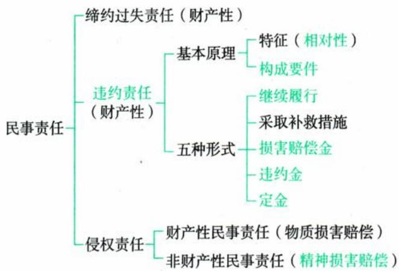

flowchart

```mermaid
graph TD
    A["民事责任"] --> B["缔约过失责任（财产性）"]
    A --> C["违约责任（财产性）"]
    A --> D["侵权责任"]
    C --> E["基本原理"]
    C --> F["五种形式"]
    E --> G["特征（相对性）"]
    E --> H["构成要件"]
    F --> I["继续履行"]
    F --> J["采取补救措施"]
    F --> K["损害赔偿金"]
    F --> L["违约金"]
    F --> M["定金"]
    D --> N["财产性民事责任（物质损害赔偿）"]
    D --> O["非财产性民事责任（精神损害赔偿）"]
```

#### 一、违约责任的基本原理①

#### (一) 含义

违约责任，是指当事人不履行或不适当履行合同义务而应承担的民事责任。

#### (二) 特征

1. 双方违约和与有过失。

(1) 双方违约。

双方违约，是指合同当事人双方都违反了各自的义务，有两个违约行为，并相互造成了损害，双方应各自承担相应的违约责任（《民法典》第592条）。

#### (2) 与有过失。

与有过失，又称过失相抵、混合过错，是指合同中作为受损失的一方对损害的发生也有过错时，应违约方的请求，应当扣减相应的损失赔偿额。与有过失是计算违约损害赔偿范围的重要规则。当事人一方违约造成对方损失，对方对损失的发生有过错的，可以减少相应的损失赔偿额。

#### 2. 相对性。

违约责任的相对性系合同相对性原理在违约责任上的具体应用。具体内容为：当事人一方因第三人的原因造成违约的，应当依法向对方承担违约责任。当事人一方和第三人之间的纠纷，依照法律规定（侵权责任）或按照约定（违约责任）处理（《民法典》第593条）。

#### >> 随堂练习

甲公司告知乙，公司为回馈老客户，近期会赠送价值不菲的礼品给乙，乙便嘱咐家人留意接收。邻居丙购买了一台电脑，但因供货商丁的配送员送货时看错门牌号码将本该递送给丙的电脑送至乙家。乙的家人误以为是甲公司寄送的礼品而接收，当晚家中失火导致该电脑被毁。根据《民法典》，下列说法正确的是？(2020金题-2-1-25，任)①

A. 乙对丙不负赔偿义务
B. 丙有权要求丁交付相同型号、相同配置的电脑
C. 丙有权要求甲公司向自己交付乙的礼品
D. 乙与丁对丙承担连带责任

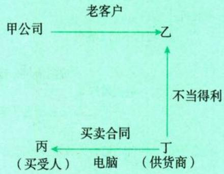

flowchart

```mermaid
graph TD
    A["甲公司"] -->|老客户| B["乙"]
    B -->|不当得利| C["丁 (供货商)"]
    C -->|买卖合同| D["丙 (买受人)"]
    D -->|买卖合同| C
```

(当事人法律关系示意图)

#### (三) 归责原则

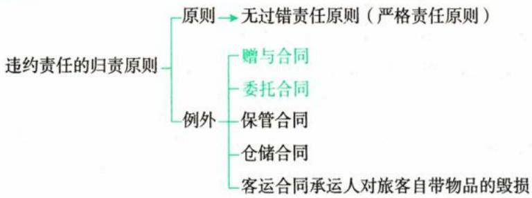

flowchart

```mermaid
graph TD
    A["违约责任的归责原则"] --> B["原则"]
    A --> C["例外"]
    B --> D["无过错责任原则（严格责任原则）"]
    C --> E["赠与合同"]
    C --> F["委托合同"]
    C --> G["保管合同"]
    C --> H["仓储合同"]
    C --> I["客运合同承运人对旅客自带物品的毁损"]
```

(违约责任归责原则体系框架图)

#### 1. 原则。

违约责任的归责原则系无过错责任原则（严格责任原则），即债务人即使没有过错也要承担违约责任。

[例] 孟某将自己的手表出卖给马某，双方约定第2天上午9点取表时付款（同时履行抗辩权）。当晚，隔壁王某将孟某手表偷走并扔到长江里。第2天，马某欲追究孟某的违约责任。孟某不可以基于自己没有过错而免除违约责任。因为违约责任系无过错责任（严格责任），即使债务人没有过错，也要承担违约责任。孟某承担违约责任后，可以向王某追究侵权责任。

#### 2. 例外。

基于合同性质的不同，如下5类合同的违约责任采用过错责任原则。分别是：

（1）赠与合同；（2）委托合同；（3）保管合同；（4）仓储合同；（5）客运合同承运人对旅客自带物品的毁损。

#### (四) 构成要件

1. 存在合法有效的合同。

2. 存在违约行为。

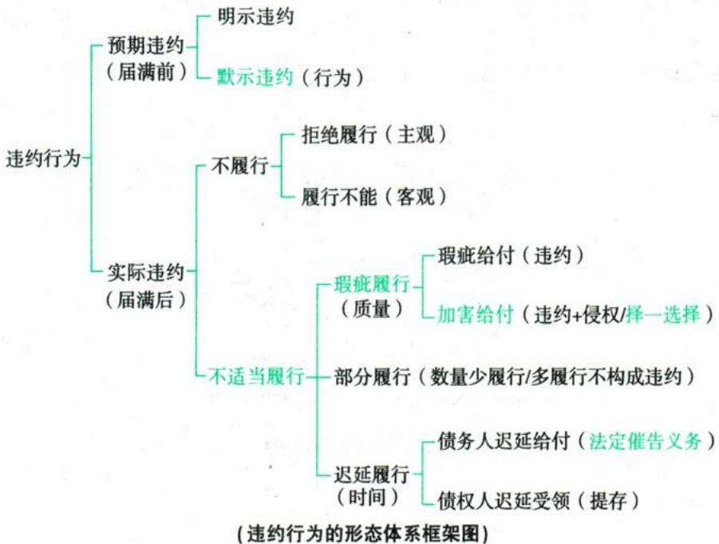

flowchart

```mermaid
graph TD
    A["违约行为"] --> B["预期违约 (届满前)"]
    A --> C["实际违约 (届满后)"]
    B --> D["明示违约"]
    B --> E["默示违约 (行为)"]
    C --> F["不履行"]
    C --> G["不适当履行"]
    F --> H["拒绝履行 (主观)"]
    F --> I["履行不能 (客观)"]
    G --> J["瑕疵履行 (质量)"]
    G --> K["部分履行 (数量少履行/多履行不构成违约)"]
    G --> L["迟延履行 (时间)"]
    J --> M["瑕疵给付 (违约)"]
    J --> N["加害给付 (违约+侵权/择一选择)"]
    L --> O["债务人迟延给付 (法定催告义务)"]
    L --> P["债权人迟延受领 (提存)"]
```

3. 不存在法定（不可抗力）或约定的免责事由。

（1）基本规则。因不可抗力不能履行合同的，根据不可抗力的影响，部分或全部免除责任，但法律另有规定的除外；当事人迟延履行后发生不可抗力的，不能免除责任。

[萌主点拨] 不可抗力，是指不能预见①、不能避免且不能克服②的客观情况。如洪水、海啸、地震、泥石流等（《民法典》第180条第2款）。

（2）通知义务和举证责任。当事人一方因不可抗力不能履行合同的，应当及时通知（附随义务/诚信原则/观念通知/事实通知/准民事法律行为）对方，以减轻可能给对方造成的损失，并应当在合理期限内提供证明（谁主张谁举证）。立法理由是让人们承担与其行为无关而又无法控制的事故的后果，不仅对责任的承担者来说是不公平的，也不能起到教育和约束人们行为的积极后果。依据这样的价值观念，将不可抗力作为免责事由，必须是构成损害结果发生的原因。

（3）迟延履行后发生的不可抗力。迟延履行后发生不可抗力的，不免除违约方的违约责任。

（五）缔约过失责任 VS 违约责任 VS 侵权责任

<table><tr><td>项目</td><td>缔约过失责任</td><td>违约责任</td><td>侵权责任</td></tr><tr><td>法律依据</td><td>《民法典》第500、501条</td><td>《民法典》第577条</td><td>《民法典》第1165、1166条</td></tr><tr><td>性质</td><td>债权请求权(择一选择)</td><td>债权请求权(择一选择)</td><td>债权请求权(择一选择)</td></tr><tr><td>是否有合同</td><td>有</td><td>有</td><td>无</td></tr><tr><td>时间</td><td>合同生效前</td><td>合同生效后</td><td>无</td></tr><tr><td>归责原则</td><td>过错责任</td><td>原则:无过错责任(严格责任)例外:过错责任(5类合同)</td><td>原则:过错责任例外:无过错责任</td></tr><tr><td>责任限制</td><td>与有过失/过失相抵</td><td>与有过失/过失相抵</td><td>与有过失/过失相抵</td></tr><tr><td>免责事由</td><td>不可抗力</td><td>不可抗力</td><td>不可抗力</td></tr><tr><td>构成要件</td><td>行为发生于缔约过程中;一方违反基于诚信原则产生的先合同义务;导致对方信赖利益的损失;一方违反先合同义务与他方所受损失之间存在因果关系</td><td>存在合法有效的合同;存在违约行为;不存在法定或约定的免责事由</td><td>侵害(加害)行为;损害后果;因果关系;主观过错(无过错责任原则的侵权类型无需该要件)</td></tr><tr><td>赔偿范围</td><td>信赖利益的损失(包括订约费用的损失和订约机会的损失)</td><td>履行利益/可得利益的损失(合同履行后债权人所能获得的纯利润/包括生产利润损失、经营利润损失和转售利润损失)</td><td>固有利益的损失(包括物质损害赔偿和精神损害赔偿)</td></tr></table>

#### 二、违约责任的五种形式①

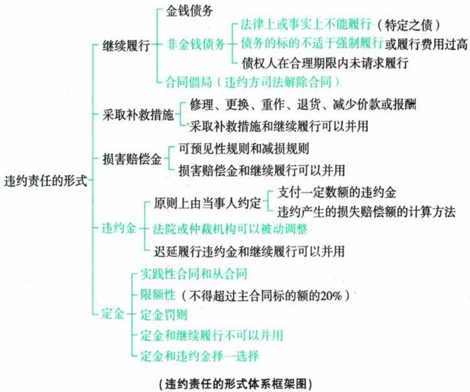

flowchart

```mermaid
graph TD
    A["违约责任的形式"] --> B["继续履行"]
    A --> C["采取补救措施"]
    A --> D["损害赔偿金"]
    A --> E["违约金"]
    A --> F["定金"]

    B --> B1["金钱债务"]
    B --> B2["非金钱债务"]
    B2 --> B2a["法律上或事实上不能履行（特定之债）"]
    B2 --> B2b["债务的标的不适于强制履行或履行费用过高"]
    B2 --> B2c["债权人在合理期限内未请求履行"]

    B --> B3["合同僵局（违约方司法解除合同）"]

    C --> C1["修理、更换、重作、退货、减少价款或报酬"]
    C --> C2["采取补救措施和继续履行可以并用"]

    D --> D1["可预见性规则和减损规则"]
    D --> D2["损害赔偿金和继续履行可以并用"]

    E --> E1["原则上由当事人约定"]
    E --> E2["法院或仲裁机构可以被动调整"]
    E --> E3["迟延履行违约金和继续履行可以并用"]

    F --> F1["实践性合同和从合同"]
    F --> F2["限额性（不得超过主合同标的额的20%）"]
    F --> F3["定金罚则"]
    F --> F4["定金和继续履行不可以并用"]
    F --> F5["定金和违约金择一选择"]

    G["（违约责任的形式体系框架图）"]
```

#### (一) 继续履行 $^{②}$

#### 1. 含义。

继续履行，又称实际履行、强制实际履行，是指当合同一方当事人违约时，守约方有权请求法院或仲裁机构强制违约方按照合同约定的给付内容履行义务，而不得以支付违约金或赔偿损失的方法代替履行（《民法典》第580条）。

#### 2. 金钱债务的继续履行。

金钱债务，不仅包括合同价款、劳动报酬，还包括租赁合同中的租金和借款合同中主债务的利息等。金钱债务的标的物为货币，货币作为一般等价物，是一种纯粹的可替代物，具有高度的流通性。因此，金钱债务原则上必须实际履行，违约方不得以任何理由针对非违约方的履行请求作出抗辩。

[萌主点拨] 金钱债务永不灭，原则上不存在履行不能的问题。

#### 3. 非金钱债务的继续履行。

当事人一方不履行非金钱债务或履行非金钱债务不符合约定的，对方可以请求履行，但是有三个除外，分别是：（1）法律上或事实上不能履行（特定之债）；（2）债务的标的不适于强制履行（劳务之债）或履行费用过高；（3）债权人在合理期限内未请求履行。

##### [萌主点拨] 间接强制履行

当事人一方不履行债务或履行债务不符合约定，存在第三人替代履行的可能性，所产生的替代履行费用属于守约方因对方违约造成的损失范围，由违约方承担不仅符合公平原则，也有利于促使当事人积极主动履行合同义务。因此，为了完善违约责任制度，充分保护守约方一方的合法权益，《民法典》第581条新增加了间接强制履行制度：当事人一方不履行债务或履行债务不符合约定，根据债务的性质不得强制履行的，对方可以请求其负担由第三人替代履行的费用。

4. 合同僵局（违约方司法解除合同/非违约方权利滥用）。

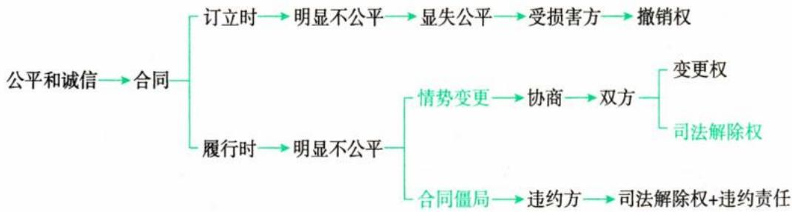

flowchart

```mermaid
graph TD
    A["公平和诚信"] --> B["合同"]
    B --> C["订立时"]
    C --> D["明显不公平"]
    D --> E["显失公平"]
    E --> F["受损害方"]
    F --> G["撤销权"]
    B --> H["履行时"]
    H --> I["明显不公平"]
    I --> J["情势变更"]
    J --> K["协商"]
    K --> L["双方"]
    L --> M["变更权"]
    L --> N["司法解除权"]
    I --> O["合同僵局"]
    O --> P["违约方"]
    P --> Q["司法解除权+违约责任"]
```

(显失公平、情势变更和合同僵局法律思维导图)

合同僵局，即违约方起诉解除合同制度。《民法典》第580条第2款：有前款规定的除外情形之一，致使不能实现合同目的的，法院或仲裁机构可以根据当事人的请求终止合同权利义务关系，但是不影响违约责任的承担（《民法典合同编通则解释》第59条）。

违约方起诉解除合同的构成要件有三：

(1) 违约方起诉请求解除合同主观上必须是非恶意的。

该要件的目的是防止违约方实施机会主义行为而侵害守约方的利益。违约方在履行困难或履行对其经济上不合理时就选择故意违约，将诱发道德风险，违反了任何人不能从其不法行为中获利的原则。实践中，经常发生因房屋价格上涨，违约方一房数卖、恶意违约的情形。如果任由违约方解除合同，将严重危害交易秩序和交易安全。

(2) 违约方继续履行合同对其显失公平。

在形成合同僵局的情况下，法律上允许违约方提起诉讼解除合同，目的在于纠正利益失衡现象，从而平衡当事人之间的利益关系，最终实现实质正义。

(3) 守约方拒绝解除合同违反了诚信原则。

实践中，在出现合同僵局时，享有合同解除权的一方当事人拒绝行使解除权，常常是为了向对方索要高价，这就违反了诚信和公平原则。如果任由守约方拒绝解除合同，可能造成双方利益严重失衡。因此，法律上有必要予以纠正。

#### (二) 采取补救措施①

瑕疵履行，是指债务人履行的标的物、履行行为不符合当事人约定或法律规定，以致不能实现合同全面履行或合同目的的行为。瑕疵履行包括瑕疵给付和加害给付两类。瑕疵履行的补救措施包括修理、更换、重作、退货、减价等（《民法典》第582条）。

#### >> 随堂练习

王某去李某的手机店里购买了新款手机，王某手机用了一个月后发生爆炸致其受伤。经查，该手机有明显使用痕迹，是二手手机。关于本案，下列说法正确的是？（2023金题-2-1-15，多）①

A. 王某可以以显失公平为由撤销合同
B. 王某可以追究李某的违约责任
C. 王某可以追究李某的侵权责任
D. 王某可以继续保留手机，但请求减少手机价款

#### （三）损害赔偿金 $^{②}$

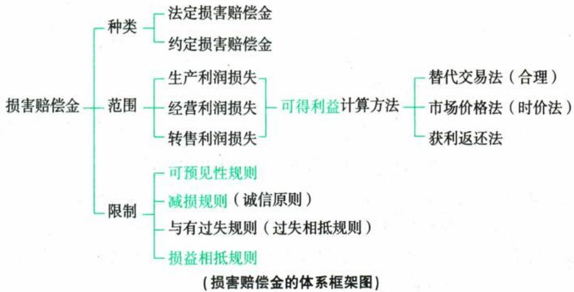

flowchart

```mermaid
graph TD
    A["损害赔偿金"] --> B["种类"]
    A --> C["范围"]
    A --> D["限制"]
    B --> E["法定损害赔偿金"]
    B --> F["约定损害赔偿金"]
    C --> G["生产利润损失"]
    C --> H["经营利润损失"]
    C --> I["转售利润损失"]
    G --> J["可得利益计算方法"]
    H --> J
    I --> J
    J --> K["替代交易法（合理）"]
    J --> L["市场价格法（时价法）"]
    J --> M["获利返还法"]
    D --> N["可预见性规则"]
    D --> O["减损规则（诚信原则）"]
    D --> P["与有过失规则（过失相抵规则）"]
    D --> Q["损益相抵规则"]
```

1. 含义。

损害赔偿金，又称为赔偿损失，是指违约方以支付金钱的方式弥补受害方因违约行为而遭受损失的责任形式。

2. 范围。

当事人一方不履行合同义务或履行合同义务不符合约定，造成对方损失的，损失赔偿额应当相当于因违约所造成的损失，包括合同履行后可以获得的利益。这里“合同履行后可以获得的利益”就是可得利益。通俗而言，可得利益就是“净利润”而非“毛利润”。

可得利益，是指未来可以得到的利益。主要包括：生产利润损失、经营利润损失和转售利润损失等类型。

（1）生产利润损失。生产设备和原材料等买卖合同违约中，因出卖人违约而造成买受人的可得利益损失通常属于生产利润损失。
（2）经营利润损失。承包经营、租赁经营合同以及提供服务或劳务的合同中，因一方违约造成的可得利益损失通常属于经营利润损失。
（3）转售利润损失。在“连环买卖”中，因原合同出卖方违约而造成其后的转售合同出售方的可得利益损失通常属于转售利润损失。

#### >> 随堂练习

某超市经常向郊区农民采购2年以上老母鸡。采购价每只100元，市零售价250元，常年供不应求。某日，超市与农民李某签订每季度供应20只老母鸡合同。李某对零售价和批发价无异议。第二季度，超市只采购到10只鸡，并对应支付1000元。对尚未交付的10只鸡，超市可就下列哪一利益向李某主张损害赔偿？（2019金题-2-1-13，单）①

A. 生产利润 1500 元

B. 采购价格 1000 元

C. 转售利润 1500 元

D. 零售价格 2500 元

#### 3. 限制性规则。

#### (1) 可预见性规则。

当事人一方不履行合同义务或履行合同义务不符合约定，造成对方损失的，损失赔偿额应当相当于因违约所造成的损失，包括合同履行后可以获得的利益；但是，不得超过违反合同一方订立合同时预见到或应当预见到的因违反合同可能造成的损失。

#### (2) 减损规则。

减损规则是依据诚信原则而产生。其目的是要促使受损害方采取合理措施减轻损失，避免社会资源的浪费。其内容为当事人一方违约后，对方应当采取适当措施防止损失的扩大（减损义务/不真正义务/诚信原则）；没有采取适当措施致使损失扩大的，不得就扩大的损失请求赔偿。当事人因防止损失扩大而支出的合理费用，由违约方负担（《民法典》第591条）。

#### (3) 损益相抵规则。

损益相抵规则，是指当守约方因损失发生的同一违约行为而获有利益时，应当从违约方须支付的损失赔偿额中扣除该部分利益（禁止得利原则）。

#### 4. 损害赔偿金和继续履行、采取补救措施的关系。

当事人一方不履行合同义务或履行合同义务不符合约定的，在履行义务或采取补救措施后，对方还有其他损失的，应当赔偿损失（继续履行、采取补救措施和损害赔偿金可以并用）。

#### (四) 违约金 $^{②}$

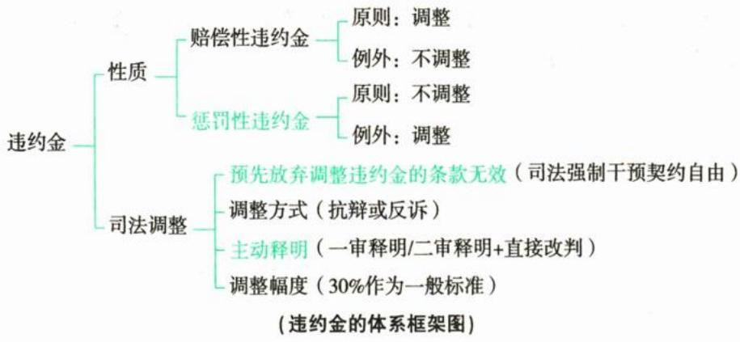

flowchart

```mermaid
graph TD
    A["违约金"] --> B["性质"]
    A --> C["司法调整"]
    B --> D["赔偿性违约金"]
    B --> E["惩罚性违约金"]
    D --> F["原则：调整"]
    D --> G["例外：不调整"]
    E --> H["原则：不调整"]
    E --> I["例外：调整"]
    C --> J["预先放弃调整违约金的条款无效（司法强制干预契约自由）"]
    C --> K["调整方式（抗辩或反诉）"]
    C --> L["主动释明（一审释明/二审释明+直接改判）"]
    C --> M["调整幅度（30%作为一般标准）"]
```

① 答案：C。

② 考查3次且主观题亦考查，《民法典》第585条和《民法典合同编通则解释》第64—66条（共3条）共4条规定了违约金制度，重点关注。

#### 1. 含义。

违约金，是指依据法律规定或当事人约定，一方不履行或不适当履行合同时应向对方支付的一定数额的金钱。

#### 2. 被动司法调整规则。

（1）约定的违约金低于实际损失的，法院或仲裁机构可以根据当事人的请求予以增加，但不得超过实际损失（填补性损害原理/填平规则）。请求法院增加违约金，增加后的违约金额以不超过实际损失额为限。增加违约金以后，当事人又请求对方赔偿损失的，法院不予支持。

(2) 约定的违约金高于实际损失但并不过分的，直接适用于约定的违约金而不再调整。

(3) 约定的违约金高于实际损失且过分的, 可以请求法院或仲裁机构予以适当减少。当事人约定的违约金超过造成损失的 $30 \%$ 的, 一般可以认定为 “过分高于造成的损失”。

违约金适用规则归纳表

<table><tr><td>情形</td><td>实际损失</td><td>约定的违约金</td><td>处理结果</td></tr><tr><td>情形1</td><td>100万元</td><td>80万元</td><td>上调20万元</td></tr><tr><td>情形2</td><td>100万元</td><td>120万元</td><td>120万元</td></tr><tr><td>情形3</td><td>100万元</td><td>150万元</td><td>下调至130万元—100万元之间</td></tr></table>

#### >> 随堂练习

甲乙签订一份买卖合同，约定违约方应向对方支付18万元违约金。后甲违约，给乙造成损失15万元。下列哪一表述是正确的？(2013-3-14，单)①

A. 甲应向乙支付违约金18万元，不再支付其他费用或者赔偿损失
B. 甲应向乙赔偿损失 15 万元，不再支付其他费用或者赔偿损失
C. 甲应向乙赔偿损失 15 万元并支付违约金 18 万元，共计 33 万元
D. 甲应向乙赔偿损失 15 万元及其利息

#### 3. 迟延履行违约金和继续履行的关系。

当事人就迟延履行约定违约金的，违约方支付违约金后，还应当履行债务（迟延履行违约金和继续履行可以并用）。

#### (五) 定金 $^{②}$

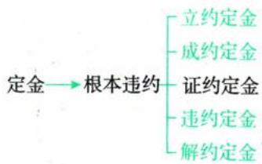

flowchart

```mermaid
graph TD
    A["定金"] --> B["根本违约"]
    B --> C["立约定金"]
    B --> D["成约定金"]
    B --> E["证约定金"]
    B --> F["违约定金"]
    B --> G["解约定金"]
```

(定金体系框架图)

① 答案：A。
② 考查4次，常考点，《民法典》第586—588条（共3条）和《民法典合同编通则解释》第67、68条（共2条）规定了定金制度，在客观题和主观题备考中必须重点关注。

[图释] 学理上, 定金主要包括五类, 分别是: (1) 立约定金 (为保证正式缔约而交付的定金。此类定金的效力在于: 给付定金的一方当事人若拒绝立约, 则丧失定金; 收受定金的一方拒绝立约的, 则应双倍返还定金/注意: 结合预约合同/过错责任原则); (2) 成约定金 (以交付定金作为主合同成立的要件, 自交付定金时起认定主合同成立); (3) 证约定金 (定金不是主合同的成立要件, 仅以证明主合同成立为目的); (4) 违约定金 (给付定金的当事人若不履行债务, 收受定金的当事人有权不予返还; 收受定金的一方若不履行债务, 则需双倍返还定金); (5) 解约定金 (以定金作为保留主合同解除权的代价, 即给付定金的一方可以丧失定金为代价而解除主合同, 收受定金的一方可以双倍返还定金为代价而解除主合同)。通说认为, 我国现行法律体系中的定金概念系以违约定金为核心, 以其他类型的定金为例外。即如果合同当事人约定定金条款时未明确定金性质的, 应理解为违约定金。

#### 1. 含义。

定金，是指为担保合同的履行，由当事人一方在合同订立时或订立后至履行前给付给对方的一定金额的金钱或替代物。

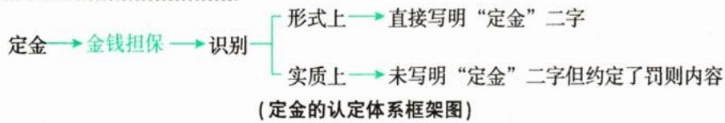

flowchart

```mermaid
graph LR
    A["定金"] --> B["金钱担保"]
    B --> C["识别"]
    C --> D["形式上"]
    D --> E["直接写明“定金”二字"]
    C --> F["实质上"]
    F --> G["未写明“定金”二字但约定了罚则内容"]
```

#### 2. 定金合同的限额性。

定金合同系要式合同（书面形式）、实践性合同（自实际交付定金时成立）和从合同。定金的数额由当事人约定，但是不得超过主合同标的额的20%，超过部分不产生定金的效力，按不当得利处理，返还本金及同期银行利息。定金数额限制的正当性在于：如果允许双方任意约定定金数额，难免出现占优势一方引诱对方违约的情形。因此，法律通过对定金的数额进行限制，将定金的惩罚限制在一定范围内，能够保证双方的公平。同时，定金具有双向惩罚性，当事人也不会合意约定过高的数额，因为任何一方都不想让自己受到过高惩罚。

实际交付的定金数额多于或少于约定数额，视为变更约定的定金数额。当事人约定以交付定金作为主合同成立或生效条件，应当交付定金的一方未支付定金，但是合同主要义务已经履行完毕并为对方接受的，法院应当认定合同在对方接受履行时已经成立或生效（履行治愈规则/《民法典》第490条）。主合同已经履行或已经履行主要部分的，不影响主合同的成立或生效。

#### >> 随堂练习

甲、乙约定：甲将100吨汽油卖给乙，合同签订后三天交货，交货后十天内付货款。还约定，合同签订后乙应向甲支付十万元定金，合同在支付定金时生效。合同订立后，乙未交付定金，甲按期向乙交付了货物，乙到期未付款。对此，下列哪一表述是正确的？(2010-3-14，单)①

A. 甲可请求乙支付定金

B. 乙未支付定金不影响买卖合同的效力

C. 甲交付汽油使得定金合同生效

D. 甲无权请求乙支付价款

#### 3. 定金罚则。

债务人履行债务的，定金应当抵作价款或收回。给付定金的一方不履行债务，或履行债务不符合约定，致使不能实现合同目的的，无权请求返还定金；收受定金的一方不履行债务或履行债务不符合约定，致使不能实现合同目的的，应当双倍返还定金。定金罚则的适用前提是根本违约，不适用于合同主要目的未受影响的一般违约情形。如果当事人对继续履行和定金罚则同时提出主张，法院应告知其择一选择，并且在当事人拒绝选择时根据案件具体情况作出判断。

#### 4. 违约金和定金的适用关系（不重复评价规则）。

当事人既约定违约金，又约定定金的，一方违约时，对方可以选择适用违约金或定金条款。其法理依据是定金和违约金既有相同之处又有不同之处。相同之处在于：都是合同预先约定的、在一方违约的情形下应向对方作出的补偿性给付，二者均以金钱为主要给付方式，皆对合同履行起到一定的保障作用。不同之处在于：定金是由一方预先给付给对方的，作为一种法定的担保方式，是金钱的担保；违约金是在违约行为发生以后再行支付的，其保障债权实现的功能较定金有所弱化。正是由于定金和违约金功能上的互通，为避免义务人因同一行为承受两种不利后果。因此，法律明文规定，违约金和定金不得并用，只能择一选择（《民法典》第588条）。

## 第二分编

#### 典型合同

### 20 专题二十 买卖合同

#### 复习提要

买卖合同规定在《民法典》第三编合同第二分编典型合同第九章（第595—647条），共53条。本专题主要涉及七个问题：1. 买卖合同的基本原理；2. 买卖合同中的风险负担；3. 买卖合同中的孳息归属；4. 试用买卖合同；5. 动产所有权保留买卖合同；6. 分期付款买卖合同；7. 一物数卖。买卖合同作为最典型的双务合同，每年必考，客观题和主观题都会考查，备考时必须重点关注。

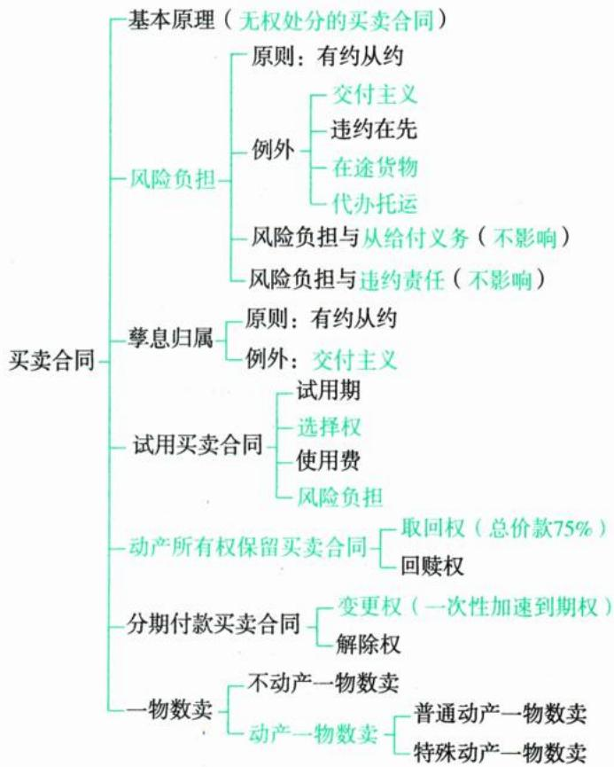

flowchart

```mermaid
graph TD
    A["买卖合同"] --> B["基本原理（无权处分的买卖合同）"]
    A --> C["风险负担"]
    C --> D["原则：有约从约"]
    C --> E["例外"]
    E --> F["交付主义"]
    E --> G["违约在先"]
    E --> H["在途货物"]
    E --> I["代办托运"]
    C --> J["风险负担与从给付义务（不影响）"]
    C --> K["风险负担与违约责任（不影响）"]
    A --> L["孳息归属"]
    L --> M["原则：有约从约"]
    L --> N["例外：交付主义"]
    A --> O["试用买卖合同"]
    O --> P["试用期"]
    O --> Q["选择权"]
    O --> R["使用费"]
    O --> S["风险负担"]
    A --> T["动产所有权保留买卖合同"]
    T --> U["取回权（总价款75%）"]
    T --> V["回赎权"]
    A --> W["分期付款买卖合同"]
    W --> X["变更权（一次性加速到期权）"]
    W --> Y["解除权"]
    A --> Z["一物数卖"]
    Z --> AA["不动产一物数卖"]
    Z --> AB["动产一物数卖"]
    AB --> AC["普通动产一物数卖"]
    AB --> AD["特殊动产一物数卖"]
```

#### 一、基本原理

#### (一) 含义

买卖合同是出卖人转移标的物的所有权于买受人，买受人支付价款的合同。

[萌主点拨] 买卖合同系双务、有名、有偿、诺成、不要式合同。

#### (二) 无权处分的买卖合同①

行为人以自己的名义
- 擅自出卖他人之物的，构成无权处分，买卖合同合法有效
- 擅自出租他人之物的，构成无权出租，租赁合同合法有效

(无权处分和无权出租法律关系体系框架图)

#### 1. 合同效力。

基于“物债两分”的区分原则，买卖合同的生效，仅在买卖双方产生债权效力（互相对对方享有债权请求权）而不能直接发生物权变动（物权效力）。具体而言，买卖合同的生效，仅使出卖人负有交付标的物并移转标的物所有权的义务，并不直接导致标的物所有权的丧失。同时，买受人仅享有请求出卖人交付标的物并移转标的物所有权的债权请求权，亦不能基于买卖合同而直接取得标的物的所有权。因此，即使出卖人出卖标的物时对标的物尚无所有权或处分权，也不影响买卖合同效力（《民法典合同编通则解释》第19条）。

#### 2. 救济途径。

因出卖人未取得处分权致使标的物所有权不能转移的，买受人可以解除合同并请求出卖人承担违约责任（《民法典》第597条）。

[萌主点拨] 无权处分，不影响合同的效力，仅影响合同的履行。

#### 二、风险负担 $^{②}$

#### (一) 含义

风险负担，是指在合同订立后，标的物因不可归责于任何一方的事由（主观要件）而发生的意外毁损、灭失（客观要件）的损失由何方负担。在买卖合同领域，长期以来主流民法理论一直认为，风险负担仅指价金风险的负担，即风险转移意味着有时买受人必须为并未收到的货物付款。

[萌主点拨] 不可抗力一定是风险，但风险不一定是不可抗力，第三人原因造成的亦构成风险；题目中的关键词：失火、火灾、洪水、海啸、地震、泥石流、雷击等。

#### (二) 原则

买卖合同中的风险负担规则属于任意性、补充性规定，应由当事人根据具体状况、运输方式、当事人所处位置等综合确定。因此，要充分尊重当事人的意思自治，关于风险负担的法律规定只能起到弥补当事人意思表示不备的作用。

因此，买卖合同中的风险负担，原则上有约从约。

#### (三) 例外

1. 交付主义。

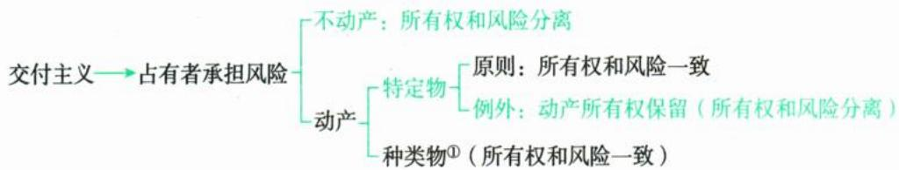

flowchart

```mermaid
graph TD
    A["交付主义"] --> B["占有者承担风险"]
    B --> C["不动产：所有权和风险分离"]
    B --> D["动产"]
    D --> E["特定物"]
    E --> F["原则：所有权和风险一致"]
    E --> G["例外：动产所有权保留（所有权和风险分离）"]
    D --> H["种类物①（所有权和风险一致）"]
```

(交付主义风险转移规则体系框架图)

交付主义，是指以标的物的交付作为风险转移的时间标准，在标的物交付于买受人之前由出卖人承担风险，在标的物交付于买受人之后则由买受人承担风险，而不论标的物的所有权是否已经转移。

交付主义的理论基础在于利益承受理论（占有者承担风险），即谁占有标的物谁就应当承担标的物意外毁损、灭失的风险。因为风险和利益应该具有一致性，占有者享有标的物的使用、收益利益，理应承担由此带来的风险，即“利益之所在，即危险之所在”，这是一项公认的市场交易原则。

[萌主点拨] 交付既包括现实交付，又包括观念交付（简易交付、指示交付和占有改定），不动产和动产均适用。

#### >> 随堂练习

甲乙双方签订买卖合同，甲出售给乙机器设备一台，价格1000万元，合同约定交货后3个月内付款。甲交付货物后，乙进行验收，并在3个月届满后如数付款。后该合同因为甲的欺诈行为而被撤销。对此，下列说法正确的是？(2020金题-2-1-27，多) $^{②}$

A. 双方根本不需要返还
B. 合同撤销后双方的占有返还请求权可适用同时履行抗辩权
C. 甲因缔约过失责任而负有赔偿义务
D. 设备返还前毁损灭失风险由占有人乙承担

2. 违约在先。

（1）因买受人的原因致使标的物未按照约定的期限交付的，买受人应当自违反约定时起承担标的物毁损、灭失的风险。
（2）出卖人按照约定将标的物置于交付地点，买受人违反约定没有收取的，标的物毁损、灭失的风险自违反约定时起由买受人承担。
（3）因标的物不符合质量要求，致使不能实现合同目的（根本违约）的，买受人可以拒绝接受标的物或解除合同。买受人拒绝接受标的物或解除合同的，标的物毁损、灭失的风险由出卖人承担。

#### 3. 在途货物。

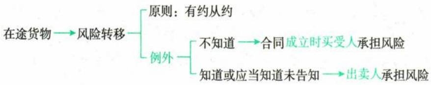

flowchart

```mermaid
graph TD
    A["在途货物"] --> B["风险转移"]
    B --> C["原则：有约从约"]
    B --> D["例外"]
    D --> E["不知道"]
    D --> F["知道或应当知道未告知"]
    E --> G["合同成立时买受人承担风险"]
    F --> H["出卖人承担风险"]
```

(在途货物风险转移体系框架图)

#### (1) 含义。

在途货物的买卖，又称路货买卖，是指货物已在运输途中，出卖人寻找买受人，出卖在途货物的买卖。在途货物的买卖本质上是“单据买卖”，即出卖人向买受人交付提货的单据而不是交付标的物（《民法典》第606条）。

#### (2) 特征。

一般认为，在途货物买卖具有如下特征：

第一，在途货物买卖是凭单据的交易。买卖双方只能凭单据判断标的物状况，不大可能知道标的物实际上是否存在毁损或灭失等情况。

第二，在途货物买卖合同订立时，标的物已经脱离了出卖人的实际控制，标的物在运输途中发生的毁损、灭失与出卖人没有直接关系。

第三，出卖人将标的物交付运输时，通常会对标的物进行投保。出卖人与买受人签订买卖合同后，有关在途标的物的单据以及保险单都会转移给买受人，所以即使标的物发生了毁损、灭失，买受人也可以获得保险利益。

#### (3) 处理。

出卖人出卖交由承运人运输的在途标的物，除当事人另有约定外，毁损、灭失的风险自合同成立时起由买受人承担。出卖人出卖交由承运人运输的在途标的物，在合同成立时知道或应当知道标的物已经毁损、灭失却未告知买受人，买受人主张出卖人负担标的物毁损、灭失的风险的，法院应予支持。

#### 4. 代办托运。

flowchart

```mermaid
graph TD
    A["代办托运"] --> B["约定明确的交付地点"]
    A --> C["未约定交付地点"]
    B --> D["交付时转移给买受人"]
    C --> E["货交第一承运人风险转移、所有权转移"]
```

(代办托运风险转移体系框架图)

代办托运，是指在买卖合同订立后，出卖人将标的物交付第一承运人，由承运人将货物运至买受人处或买受人指定之处的交付方式（《民法典》第607条）。

当事人约定明确的交付地点的，出卖人将货物交付承运人时，风险不发生转移。待承运人将标的物运抵该地点，交付给买受人时，风险转移给买受人（《买卖合同解释》第9条①）。

当事人没有约定交付地点或约定不明确，出卖人将标的物交付给第一承运人后，标的物毁损、灭失的风险由买受人承担。

[萌主点拨] 实践中，当事人不约定交付地点的原因通常是买受人打算将承运人承运的在途货物出卖给第三人（商事制度：为卖而买）。此类风险由买受人承担的立法理由是买受人所处的地位使他能在目的地及时检验货物，在发现货物受损时便于采取必要的措施，包括减轻损失、向有责任的承运人请求赔偿和向保险人索赔等。

[例] 2025年3月2日，青山公司与绿水公司签订了一份2000台电脑买卖合同，双方约定出卖人应将2000台电脑交付顺丰公司承运，运输至广东方向，具体地点由绿水公司另行通知顺丰公司。3月3日，青山公司依约将2000台电脑交付（货交第一承运人/风险转移/所有权转移）顺丰公司启运。3月6日，绿水公司将2000台电脑出卖（在途货物买卖）给蓝天公司并指示（指示交付）顺丰公司将货物运至蓝天公司位于广州市白云区的仓库。根据上述案情及示意图，请回答如下问题：

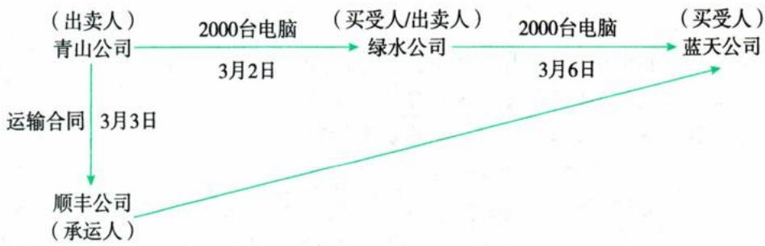

flowchart

```mermaid
graph TD
    A["青山公司"] -->|2000台电脑 3月2日| B["绿水青山"]
    B -->|2000台电脑 3月6日| C["蓝天公司"]
    C -->|运输合同 3月3日| D["顺丰公司 (承运人)"]
```

(在途货物买卖当事人法律关系示意图)

①3月4日，在运输途中，因遭遇雷击（风险），2000台电脑中的200台灭失。请问：风险由谁承担？

答：绿水公司。因为在代办托运的情况下，当事人约定的交付地点不明确的，出卖人将标的物交付给第一承运人后，标的物毁损、灭失的风险由买受人承担。本案中，青山公司于3月3日将货物交付给顺丰公司后，标的物电脑毁损、灭失的风险即由买受人绿水公司承担（《民法典》第607条）。

②3月8日，因遭遇雷击（风险），2000台电脑中的200台灭失。请问：风险由谁承担？

答：蓝天公司。因为在途货物买卖，合同成立时风险转移至买受人（《民法典》第606条）。

③如3月5日2000台电脑已经因泥石流（风险）全部毁损，绿水公司知情，却仍然于3月6日将货物出卖给蓝天公司。请问：风险由谁承担？

答：绿水公司。因为出卖人出卖交由承运人运输的在途标的物，在合同成立时知道或应当知道标的物已经毁损、灭失却未告知买受人，买受人主张出卖人负担标的物毁损、灭失的风险的，法院应予支持（《买卖合同解释》第10条）。

##### [核心法条链接]

《买卖合同解释》第11条：当事人对风险负担没有约定，标的物为种类物，出卖人未以装运单据、加盖标记、通知买受人等可识别的方式清楚地将标的物特定于买卖合同，买受人主张不负担标的物毁损、灭失的风险的，法院应予支持。

#### （四）风险负担与从给付义务

《民法典》第609条共1条规定了风险负担与从给付义务的关系。

出卖人按照约定未交付有关标的物的单证和资料的，不影响标的物毁损、灭失风险的转移。此处的“单证和资料”，包括提取标的物单证、保险单、保修单、普通发票、增值税专用发票、产品合格证、质量保证书、质量鉴定书、品质检验证书、产品进出口检疫书、原产地证明书、使用说明书、装箱单等（《民法典》第609条和《买卖合同解释》第4条）。

#### （五）风险负担与违约责任

标的物毁损、灭失的风险由买受人承担的，不影响因出卖人履行债务不符合约定，买受人请求其承担违约责任的权利（《民法典》第611条）。

#### >> 随堂练习

甲乙约定卖方甲负责将所卖货物运送至买方乙指定的仓库。甲如约交货，乙验收收货，但甲未将产品合格证和原产地证明文件交给乙。乙已经支付80%的货款。交货当晚，因山洪暴发，乙仓库内的货物全部毁损。下列哪些表述是正确的？(2013-3-61，多) $^{①}$

A. 乙应当支付剩余 20% 的货款
B. 甲未交付产品合格证与原产地证明，构成违约，但货物损失由乙承担
C. 乙有权要求解除合同，并要求甲返还已支付的 $80\%$ 货款
D. 甲有权要求乙支付剩余的 20% 货款，但应补交已经毁损的货物

#### 三、孳息归属 $^{②}$

买卖合同中的孳息归属规则，分两步确定：

第一步：有约定从约定；

第二步：无约定，采“交付主义”。即交付之前归出卖人所有，交付之后归买受人所有。

#### >> 随堂练习

2018年3月2日，苏某为了庆祝自己和其他作者合著的新书大卖，邀请其他作者一起前往海河大饭店聚餐。前往饭店前，苏某在海鲜市场张某处购买了一只大海螺。后交给海河大饭店加工，厨师何某剥开发现海螺里有一颗橙色的椭圆形大珍珠。请问：珍珠归谁所有？(2018金题-2-1-11，单)③

A. 苏某
B. 张某
C. 海河大饭店
D. 何某

#### 四、试用买卖合同①

#### (一) 含义

试用买卖合同主要出现在新产品的推介过程中，立法目的在于保护买受人的利益，确保买受人对标的物的充分了解，降低买到瑕疵商品甚至假冒伪劣商品的风险，增强交易的安全性。试用买卖合同，又称试验买卖合同、检验买卖合同，是指当事人双方约定，于合同成立时，出卖人将标的物交付买受人试验或检验，并以买受人在约定期限内对标的物的认可为生效要件（条件）的买卖合同。

[萌主点拨] 通说认为，试用买卖合同的性质系附生效条件的买卖合同。所附条件就是买受人对标的物的认可（承认）。买受人认可标的物的，条件成就，买卖合同生效；买受人不认可标的物的，条件不成就，合同不生效。买受人的认可具有任意性，完全由买受人意志决定，不受其他条件限制，即便标的物完全符合购买目的、质量要求，买受人仍然可以拒绝购买。

#### (二) 试用期

试用买卖合同中试用期的确定分三步：

1. 有约从约。
2. 协议补充。如果双方关于试用期限没有约定或约定不明确，首先应依据《民法典》第510条规定进行协议补充；不能达成协议补充的，按照合同有关条款或交易习惯确定。
3. 出卖人确定。法律将确定试用期限的最终决定权赋予出卖人，主要是出于平衡买卖双方利益的考虑。试用买卖合同的生效完全由买受人单方对标的物的认可决定，买受人是否认可具有任意性，而在试用期内双方交易尚未完成，出卖人应受合同约束，不得将标的物进行其他处分，标的物所有权未转移的情况下风险仍由出卖人承担，如果买受人长期试用而不表示是否认可，出卖人理应获得终结试用状态的救济权利。

#### (三) 选择权

1. 性质。

试用买卖合同的特殊性在于以买受人的认可作为合同的生效条件。买受人拥有单方、任意决定买卖合同是否生效的权利，能够使民事法律关系产生、变更或消灭，属于简单形成权。试用买卖的买受人在试用期内可以购买标的物，也可以拒绝购买。

2. 同意购买。

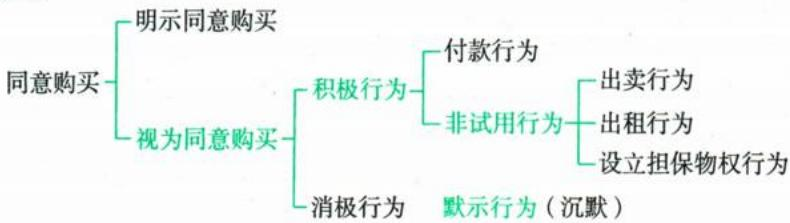

flowchart

```mermaid
graph TD
    A["同意购买"] --> B["明示同意购买"]
    A --> C["视为同意购买"]
    C --> D["积极行为"]
    C --> E["消极行为"]
    D --> F["付款行为"]
    D --> G["非试用行为"]
    G --> H["出卖行为"]
    G --> I["出租行为"]
    G --> J["设立担保物权行为"]
    D --> K["默示行为（沉默）"]
```

(同意购买体系框架图)

(1) 明示同意购买。

一般情况下，买受人表示同意购买是以明示的方式作出，如口头形式或书面形式。

(2) 视为同意购买。

在特殊情况下，买受人虽然未以明示表示同意购买，但其实施的积极行为或消极行为表明了其对标的物的认可（承认），可以视为其具有购买试用标的物的意思。此时，应认为买受人已表示同意购买。

①付款行为。试用买卖的买受人在试用期内已经支付部分价款的，视为同意购买。

②非试用行为。试用买卖的买受人在试用期内对标的物实施出卖、出租、设立担保物权等行为的，视为同意购买。

③消极默示行为（沉默）。试用期届满，买受人对是否购买标的物未作表示的，视为购买。

#### (四) 使用费

试用买卖的当事人对标的物使用费没有约定或约定不明确的，出卖人无权请求买受人支付，即买受人免费试用（《民法典》第639条）。

#### (五) 风险负担

在试用买卖中，标的物的交付，并非履行买卖合同的主要义务的交付，买受人也不因此取得所有权，不能享有收益，只能试用。因此，风险不应由买受人承担，否则，有违公平。据此，标的物在试用期内毁损、灭失的风险由出卖人承担。

[例] 国美电器商场为了给一款新型做菜机器人开拓市场，允许试用。孟某与国美电器签订了一份试用买卖合同后，将一台做菜机器人带回家试用。根据上述案情及示意图，请回答如下问题：

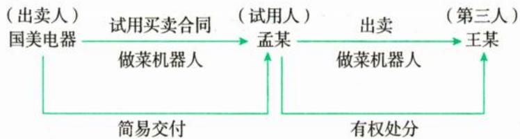

flowchart

```mermaid
graph LR
    A["国美电器 (出卖人)"] --> B["试用买卖合同"]
    B --> C["做菜机器人 (试用人)"]
    C --> D["孟某 (试用人)"]
    D --> E["出卖 (出卖人)"]
    E --> F["做菜机器人 (第三人)"]
    F --> G["王某 (第三人)"]
    G --> H["有权处分 (有权处分)"]
    H --> I["简易交付 (简易交付)"]
```

(试用买卖合同当事人法律关系示意图)

①国美电器和孟某签订试用买卖合同后，买卖合同是否成立？

答：成立。

②国美电器和孟某签订试用买卖合同后，买卖合同是否有效？

答：有效。

③国美电器和孟某签订试用买卖合同后，买卖合同是否生效？

答：不生效。因为试用买卖合同的本质系附生效条件的买卖合同。

④试用买卖合同的试用期如何确定？

答：当事人有约定从约定，没有约定的，应由出卖人确定。

⑤如国美电器允许孟某试用15天。15天内，试用人孟某享有买还是不买的选择权。请问：该选择权是否属于形成权？

答：属于。因为形成权是指单方意思表示即能产生私法效果的权利。试用买卖合同是否生效由试用人的单方意思表示决定。因此，选择权属于形成权。

⑥如国美电器允许孟某试用15天。第16天，孟某将做菜机器人归还给国美电器的，如何处理？

答：视为同意购买。因为试用期届满，试用人未作意思表示的，视为同意购买。

⑦如国美电器允许孟某试用15天。第8天，孟某将该做菜机器人出卖给隔壁邻居王某。孟某的行为可否推定为购买做菜机器人？

答：可以。因为试用人在试用期内对标的物实施出卖、出租、设立担保物权等行为的，视为同意购买。

⑧如国美电器允许孟某试用15天。第8天，孟某将该做菜机器人出卖给隔壁邻居王某。王某可否善意取得做菜机器人的所有权？

答：不可以。因为试用期间，试用人出卖标的物的，视为同意购买。孟某先占有国美电器的做菜机器人后又同意购买，做菜机器人因简易交付而发生物权变动，孟某再将其出卖给王某的行为系有权处分，王某继受取得而非善意取得做菜机器人的所有权。

⑨如国美电器允许孟某试用15天。第10天，孟某决定不买，将做菜机器人归还给国美电器，国美电器是否有权请求孟某支付使用费和折旧费？

答：无权。因为当事人未约定使用费的，试用人免费试用。

⑩如国美电器允许孟某试用15天。第10天，孟某所在地遭遇罕见暴雨（风险），孟某家被淹，做菜机器人损毁。孟某是否需要承担赔偿责任？

答：不需要。因为试用期内，标的物毁损、灭失的风险由出卖人国美电器承担。试用买卖合同的本质系附生效条件的买卖合同，在条件成就前，合同不生效，试用人仅是占有试用物而不是履行买卖合同主要义务的交付。因此，由出卖人承担风险（《民法典》第640条）。

#### 五、动产所有权保留买卖合同（非典型担保合同） $^{①}$

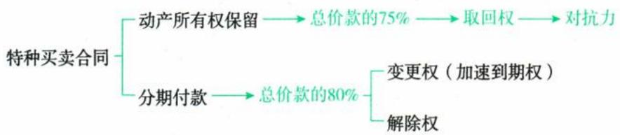

flowchart

```mermaid
graph TD
    A["特种买卖合同"] --> B["动产所有权保留"]
    A --> C["分期付款"]
    B --> D["总价款的75%"]
    D --> E["取回权"]
    E --> F["对抗力"]
    C --> G["总价款的80%"]
    G --> H["变更权（加速到期权）"]
    G --> I["解除权"]
```

(特种买卖合同体系框架图)

#### (一) 含义

动产所有权保留买卖合同，是指当事人可以在买卖合同中约定买受人未履行支付价款或其他义务的，标的物的所有权属于出卖人。出卖人对标的物保留的所有权，未经登记，不得对抗善意第三人。

[萌主点拨] 不动产不适用所有权保留。

#### (二) 取回权

1. 主体。取回权的主体系出卖人。

2. 行权事由。

（1）未按照约定支付价款，经催告后在合理期限内仍未支付。买受人已经支付标的物总价款的75%以上，出卖人无权取回标的物。

(2) 未按照约定完成特定条件。

（3）将标的物出卖、出质或作出其他不当处分。第三人已经善意取得标的物所有权或其他物权，出卖人无权取回标的物。

#### (三) 回赎权

1. 主体。回赎权的主体系买受人。

2. 行权事由。

（1）出卖人取回标的物后，买受人在双方约定的或出卖人指定的合理回赎期限内，消除出卖人取回标的物的事由的，可以请求回赎标的物。

(2) 买受人在回赎期限内没有回赎标的物，出卖人可以以合理价格出卖标的物。

（3）出卖所得价款扣除原买受人未支付的价款及必要费用后仍有剩余的，应当返还原买受人；不足部分由原买受人清偿。

[例] 孟某欲将自己的轿车出卖更换一台新轿车，便让自己的亲朋好友帮忙出卖，但半年来一直无人问津。2025年3月2日，孟某的同事马某欲购买，但无力一次性支付50万元。考虑再三，孟某决定将轿车出卖给马某，双方约定马某每月10日向孟某支付2万元，在马某付清全款前，孟某保留轿车的所有权。3月3日，孟某将轿车交付给马某，但双方未办理动产所有权保留登记（未经登记，不得对抗善意第三人）。根据上述案情及示意图，请回答如下问题：

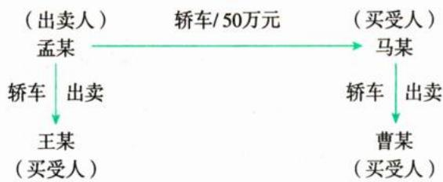

flowchart

```mermaid
graph TD
    A["孟某"] -->|出卖| B["王某 (买受人)"]
    A -->|出卖| C["轿车"]
    D["马某"] -->|出卖| E["曹某 (买受人)"]
    D -->|出卖| F["轿车"]
    G["车/50万元"] --> H["(出卖人)"]
    G --> I["(买受人)"]
```

##### (动产所有权保留买卖合同当事人法律关系示意图)

①双方关于轿车所有权保留的约定应采用书面形式。这句话正确吗？

答：不正确。因为动产所有权保留买卖合同属于买卖合同，买卖合同是不要式合同，可以口头约定。

②3月3日，轿车的所有权归谁所有？

答：孟某。因为孟某和马某之间的买卖合同系动产所有权保留买卖合同，交付并不转移标的物所有权。

③3月3日，马某对轿车的占有系有权占有还是无权占有？

答：有权占有。因为孟某和马某之间存在合法有效的动产所有权保留买卖合同。

④马某支付了20万元购车款后不再按期支付，经孟某催告后在合理期限内仍不付款。孟某如何救济自己的权利？

答：孟某有权行使取回权。因为买受人未按照约定支付价款，经催告后在合理期限内仍未支付，出卖人有权行使取回权。

⑤孟某行使取回权后，马某又按约及时补交了拖欠的购车款。马某有何权利？

答：回赎权。因为出卖人取回标的物后，买受人在双方约定的或出卖人指定的回赎期限内，消除出卖人取回标的物的事由的，可以请求回赎标的物。

⑥马某支付了20万元购车款后不再按期支付，孟某催告马某依约付款。马某一怒之下将轿车出卖给了不知情的曹某并交付。请问：马某将轿车出卖给曹某的行为是有权处分还是无权处分？

答：无权处分。因为在马某未付清全款前，轿车的所有权属于孟某，马某以自己的名义出卖他人的轿车系无权处分。

⑦马某和曹某之间的轿车买卖合同效力如何？

答：合法有效。因为无权处分的买卖合同合法有效。

⑧曹某如何取得轿车的所有权？

答：善意取得（《民法典》第311条）。

⑨曹某善意取得轿车的所有权后，孟某是否有权行使取回权？

答：无权。

理由一：因为第三人已经善意取得标的物所有权或其他物权，出卖人无权取回标的物。

##### [核心法条链接]

《民法典》第313条 [善意取得效力] 善意受让人取得动产后，该动产上的原有权利消灭。但是，善意受让人在受让时知道或者应当知道该权利的除外。

理由二：因为出卖人对标的物保留的所有权，未经登记，不得对抗善意第三人。

⑩如马某支付了40万元购车款后不再按期支付，孟某是否有权行使取回权？

答：无权。因为买受人已经支付标的物总价款的75%以上（37.5万元），出卖人无权取回标的物。

[萌主点拨]
动产所有权保留买卖合同 VS 超级动产抵押权

<table><tr><td>项目</td><td>动产所有权保留买卖合同</td><td>超级动产抵押权</td></tr><tr><td>法律依据</td><td>《民法典》第641—643条</td><td>《民法典》第416条</td></tr><tr><td>相同点1</td><td>买卖合同</td><td>买卖合同</td></tr><tr><td>相同点2</td><td>标的物为动产</td><td>标的物为动产</td></tr><tr><td>相同点3</td><td>担保价款(价金)履行</td><td>担保价款(价金)履行</td></tr><tr><td>相同点4</td><td>保护出卖人利益</td><td>保护出卖人利益</td></tr><tr><td>性质</td><td>非典型担保</td><td>典型担保</td></tr><tr><td>交付后果</td><td>不转移动产所有权</td><td>转移动产所有权</td></tr><tr><td>登记</td><td>未经登记不得对抗善意第三人</td><td>未经登记不得对抗善意第三人(宽限期10日/交付标的物之日起)</td></tr><tr><td>担保功能</td><td>取回权(总价款75%)</td><td>超级优先权(先卖后押)</td></tr><tr><td>买方支付能力</td><td>相对较弱</td><td>相对较强</td></tr><tr><td>对出卖人保护力度</td><td>相对较强</td><td>相对较弱</td></tr></table>

#### 六、分期付款买卖合同①

#### (一) 含义

分期付款买卖合同常见于消费领域，在标的物价格较高、一次性付款有困难时，分批陆续支付能减轻买受人在心理上、履行上的负担，变相增加了买受人的购买力，能够促进房产、汽车等昂贵物品的消费，带动市场交易的繁荣，促进经济发展。分期付款买卖合同的立法目的在于对买受人的保护。分期付款买卖合同，是指买受人将应付的总价款在一定期限内至少分3次向出卖人支付的合同。

#### (二) 卖方权利

分期付款的买受人未支付到期价款的数额达到全部价款的 1/5（即 20%），经催告后在合理期限内仍未支付到期价款的，出卖人可以请求买受人支付全部价款或解除合同，即择一选择：

1. 变更权（一次性加速到期权）。

请求买受人一次性支付全部剩余价款（包括到期和未到期），即加速到期权。分期付款买卖合同中出卖人请求买受人支付全部价款，在性质上属于继续履行合同，出卖人请求买受人继续履行买卖合同的全部价款支付义务，此时合同仍然有效，只是合同履行期限发生了变化，买受人丧失了期限利益，履行期限提前届至，出卖人可以请求买受人支付到期以及未到期的全部价款。

2. 解除权。

出卖人解除合同的，可以向买受人请求支付该标的物的使用费；买受人则有权请求出卖人返还已支付价款之本金及利息，即互相返还不当得利。分期付款买卖合同约定出卖人在解除合同时可以扣留已受领价金，出卖人扣留的金额超过标的物使用费以及标的物受损赔偿额，买受人请求返还超过部分的，法院应予支持。当事人对标的物的使用费没有约定的，法院可以参照当地同类标的物的租金标准确定。

<table><tr><td colspan="3">机器设备买卖合同
100万元/分期付款+所有权保留</td></tr><tr><td></td><td>75%</td><td>80%</td></tr><tr><td>60万元
违约责任</td><td>78万元
违约责任</td><td>95万元
违约责任</td></tr><tr><td>3权择一选择
(1)变更权
(2)解除权
(3)取回权</td><td>2权择一选择
(1)变更权
(2)解除权</td><td>0权</td></tr></table>

(特种买卖合同中的两线三区法律关系示意图)

[例] 2025年4月21日，众森公司和徐工集团签订了一份设备采购协议（动产买卖合同），双方约定，众森公司向徐工集团采购50台铲车，价款100万元，众森公司采用分期付款方式（分期付款买卖合同）支付价款（共100期，每期1万元），在全部价款支付完成前，铲车的所有权属于徐工集团（动产所有权保留买卖合同）。合同签订后，双方并未前往中国人民银行征信中心办理动产所有权保留买卖合同登记（未经登记，不得对抗善意第三人）。根据上述案情及示意图，请回答如下问题：

（1）众森公司支付了60万元设备采购款后不再按期支付，徐工集团催告后在合理期限内仍未支付到期价款。请问：徐工集团如何救济自己的合法权益？

答：徐工集团有权在如下三项权利中择一选择：

①基于分期付款买卖合同的规则，因买受人众森公司支付的价款未达到总价款的80%，构成根本违约，出卖人徐工集团有权行使变更权（加速到期权），请求众森公司一次性支付全部剩余价款40万元。

②基于分期付款买卖合同的规则，因买受人众森公司支付的价款未达到总价款的80%，构成根本违约，出卖人徐工集团有权行使解除权。行权后，双方互相返还不当得利。出卖人可以向买受人请求支付该标的物的使用费；买受人则有权请求出卖人返还已支付60万元价款之本金及利息。

③基于动产所有权保留买卖合同的规则，因买受人众森公司支付的价款未达到总价款的75%，出卖人徐工集团有权行使取回权。

(2) 众森公司支付了78万元设备采购款后不再按期支付, 徐工集团催告后在合理期限内仍未支付到期价款。请问: 徐工集团如何救济自己的合法权益?

答：徐工集团有权在如下两项权利中择一选择：

①基于分期付款买卖合同的规则，因买受人众森公司支付的价款未达到总价款的80%，构成根本违约，出卖人徐工集团有权行使变更权（加速到期权），请求众森公司一次性支付全部剩余价款22万元。

②基于分期付款买卖合同的规则，因买受人众森公司支付的价款未达到总价款的80%，构成根本违约，出卖人徐工集团有权行使解除权。行权后，双方互相返还不当得利。出卖人可以向买受人请求支付该标的物的使用费；买受人则有权请求出卖人返还已支付78万元价款之本金及利息。

（3）众森公司支付95万元设备采购款后不再按期支付，徐工集团催告后在合理期限内仍未支付到期价款。请问：徐工集团如何救济自己的合法权益？

答：依据合法有效的买卖合同追究众森公司的违约责任。

(4) 5月2日, 徐工集团 (铲车所有权人) 将 50 台铲车交付 (不转移所有权) 给了众森公司 (铲车占有人)。5月3日, 众森公司将其中 1 台铲车出卖 (无权处分) 给了不知情 (善意相对人) 的海马公司并交付 (完成公示)。6月10日, 因众森公司未按期支付价款, 徐工集团欲向法院提起诉讼。请问: 徐工集团是否有权向海马公司行使取回权?

答：无权。因为徐工集团的动产所有权保留未登记，不得对抗善意相对人海马公司（《民法典》第641条第2款）。

#### 七、一物数卖（多重买卖）

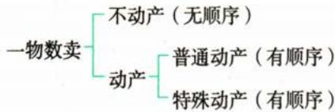

flowchart

```mermaid
graph TD
    A["一物数卖"] --> B["不动产（无顺序）"]
    A --> C["动产"]
    C --> D["普通动产（有顺序）"]
    C --> E["特殊动产（有顺序）"]
```

(一物数卖体系框架图)

#### (一) 不动产的一物数卖 $^{①}$

[例] 2月1日，孟某将自己的房屋出卖给马某，价款300万元，约定1年后交房并办理过户登记手续。后由于市政府规划建设地铁5号线使房屋价值大涨。6月1日，孟某又将房屋以380万元出卖给知悉其卖房一事的曹某，曹某预付了房款150万元并入住了该房屋。后房价再度暴涨。10月10日，孟某再次将房屋以500万元出卖给徐某，当即办理了房屋过户登记手续，但徐某却分文未付。根据上述案情及示意图，请回答如下问题：

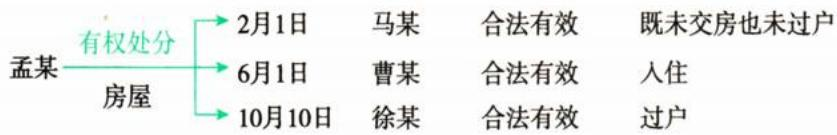

flowchart

```mermaid
graph TD
    A["孟某"] --> B["房屋"]
    B --> C["2月1日"]
    B --> D["6月1日"]
    B --> E["10月10日"]
    C --> F["马某"]
    D --> G["曹某"]
    E --> H["徐某"]
    F --> I["合法有效"]
    G --> J["合法有效"]
    H --> K["合法有效"]
    I --> L["既未交房也未过户"]
    J --> M["入住"]
    K --> N["过户"]
```

(一房数卖当事人法律关系示意图)

①马某可否以曹某知悉孟某已将房屋出卖给自己为由向法院主张孟某与曹某的房屋买卖合同无效？为什么？

答：不可以。因为孟某和曹某之间的房屋买卖合同合法有效（有权处分）。

②马某可否向法院主张孟某与徐某的房屋买卖合同无效？为什么？

答：不可以。因为孟某和徐某之间的房屋买卖合同合法有效（有权处分）。

③马某可否请求孟某继续履行房屋过户登记手续？为什么？

答：不可以。因为孟某一房数卖，合同均有效，且孟某已为徐某办理了过户登记手续，即徐某已经取得房屋所有权，法律上不能履行。

④马某、曹某和徐某均主张房屋所有权，法院应如何处理？为什么？

答：支持徐某。因为不动产物权变动依登记。

⑤马某欲追究孟某的违约责任，应向法院主张哪些构成要件？分别是什么？

答：三个要件。分别是：存在合法有效的合同；存在违约行为；不存在法定或约定的免责事由。

#### (二) 动产的一物数卖 $^{②}$

<table><tr><td>项目</td><td>普通动产</td><td>特殊动产</td></tr><tr><td>典型示例</td><td>机器设备、手表、自行车</td><td>机动车、船舶、航空器</td></tr><tr><td>合同效力</td><td>均有效</td><td>均有效</td></tr><tr><td>排序结果</td><td>先行受领交付&gt;先行支付价款&gt;合同成立在先</td><td>先行受领交付&gt;先行办理所有权转移登记手续&gt;合同成立在先</td></tr></table>

① 考查 2 次，抓住重点。

②《买卖合同解释》第6、7条共2条规定了动产一物数卖制度。考查3次，重点关注。

#### >> 随堂练习

甲为出售一台挖掘机分别与乙、丙、丁、戊签订买卖合同，具体情形如下：2016年3月1日，甲胁迫乙订立合同，约定货到付款；4月1日，甲与丙签订合同，丙支付 $20\%$ 的货款；5月1日，甲与丁签订合同，丁支付全部货款；6月1日，甲与戊签订合同，甲将挖掘机交付给戊。上述买受人均要求实际履行合同，就履行顺序产生争议。关于履行顺序，下列哪一选项是正确的？(2016-3-12，单) $^{①}$

A. 戊、丙、丁、乙
B. 戊、丁、丙、乙
C. 乙、丁、丙、戊
D. 丁、戊、乙、丙

### 21 专题二十一 供用电、水、气、热力合同

#### 复习提要

供用电、水、气、热力合同规定在《民法典》第三编合同第二分编典型合同第十章（第648—656条），共9条。本专题以供电合同为例，该合同并非考试重点，历年来共直接考查2次，备考时了解重点即可。

#### 一、含义

供用电合同是供电人向用电人供电，用电人支付电费的合同。

#### 二、特征

对于供电合同而言，合同一方当事人为提供公共服务的公用性、垄断性企业，其给付具有社会义务，适用“强制缔约理论”，提供者非有正当理由不得拒绝用电人合理的订立合同要求，即不可以解除合同。利用者对使用条件亦无讨价还价之余地，其只能且必须与这些企业订立合同。

#### 三、履行地点

供用电合同的履行地点，按照当事人约定；当事人没有约定或约定不明确的，供电设施的产权分界处为履行地点。

#### 四、供电人的义务

供电人应当按照国家规定的供电质量标准和约定安全供电。供电人未按照国家规定的供电质量标准和约定安全供电，造成用电人损失的，应当承担赔偿责任。供电人因供电设施计划检修、临时检修、依法限电或用电人违法用电等原因，需要中断供电时，应当按照国家有关规定事先通知用电人。未事先通知用电人中断供电，造成用电人损失的，应当承担赔偿责任。

因自然灾害等原因断电，供电人应当按照国家有关规定及时抢修。未及时抢修，造成用电人损失的，应当承担赔偿责任。

#### 五、用电人的义务

用电人应当按照国家有关规定和当事人的约定及时支付电费。用电人逾期不支付电费的，应当按照约定支付违约金。经催告用电人在合理期限内仍不支付电费和违约金的，供电人可以按照国家规定的程序中止供电。供电人中止供电的，应当事先通知用电人。用电人应当按照国家有关规定和当事人的约定安全、节约和计划用电。用电人未按照国家有关规定和当事人的约定用电，造成供电人损失的，应当承担赔偿责任。

### 22 专题二十二 赠与合同

#### 复习提要

赠与合同规定在《民法典》第三编合同第二分编典型合同第十一章（第657—666条），共10条。本专题主要涉及三个问题：1. 赠与合同的基本原理；2. 赠与合同中的任意撤销权和法定撤销权；3. 穷困抗辩权。赠与合同，每年必考，特别是赠与合同中的任意撤销权和法定撤销权。

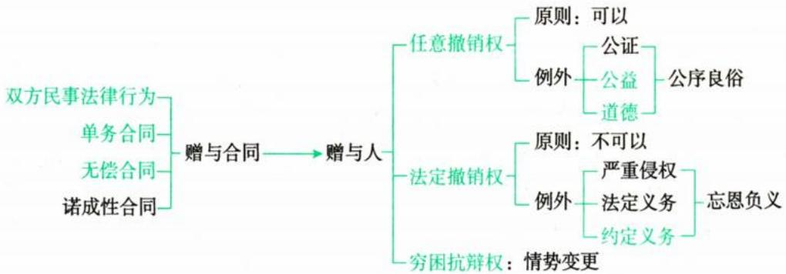

flowchart

```mermaid
graph TD
    A["赠与合同"] --> B["赠与人"]
    B --> C["任意撤销权"]
    C --> D["原则：可以"]
    C --> E["例外"]
    E --> F["公证"]
    E --> G["公益"]
    E --> H["道德"]
    H --> I["公序良俗"]
    B --> J["法定撤销权"]
    J --> K["原则：不可以"]
    J --> L["例外"]
    L --> M["严重侵权"]
    L --> N["法定义务"]
    L --> O["约定义务"]
    O --> P["忘恩负义"]
    B --> Q["穷困抗辩权：情势变更"]
    A --> R["赠与合同"]
    R --> S["双方民事法律行为"]
    R --> T["单务合同"]
    R --> U["无偿合同"]
    R --> V["诺成性合同"]
```

#### 一、赠与合同的基本原理①

#### (一) 含义

赠与合同是赠与人将自己的财产无偿给予受赠人，受赠人表示接受赠与的合同。

[萌主点拨] 赠与合同属于单务合同、无偿合同。

#### （二）瑕疵担保责任

1. 原则。赠与的财产有瑕疵的，赠与人不承担责任。

2. 例外。

（1）附义务的赠与（关键词：专款专用/专物专用/专门用于/只能用于），赠与的财产有瑕疵的，赠与人在附义务的限度内承担与出卖人相同的责任。

(2) 赠与人故意不告知瑕疵或保证无瑕疵，造成受赠人损失的，应当承担赔偿责任。

#### 二、赠与合同中的任意撤销权和法定撤销权 $^{①}$

#### （一）任意撤销权

任意撤销权，是指在赠与财产的权利转移之前（动产交付前/不动产过户登记前），得由赠与人不受拘束地依其意思任意撤销赠与合同，不再负担履行义务（《民法典》第658条）。

基于公序良俗的考虑，在特殊情况下法律明确规定不得行使任意撤销权的情形，包括三种：

1. 经过公证的赠与合同。

[例] 甲、乙和丙于2012年3月签订了散伙协议，约定登记在丙名下的合伙房屋归甲、乙共有。后丙未履行协议。同年8月，法院判决丙办理该房屋过户手续（给付之诉），丙仍未办理。9月，丙死亡，丁为其唯一继承人。12月，丁将房屋赠给女友戊，并对赠与合同作了公证。丁不可以行使任意撤销权而拒绝给女友戊办理房屋过户登记手续，因为房屋赠与合同已经作了公证。

2. 救灾、扶贫、助残等社会公益性质的赠与合同。

公益性质的赠与除救灾、扶贫、助残外，还包括科学、教育、文化、卫生、体育和新闻等事业。

#### >> 随堂练习

甲公司员工魏某在公司年会抽奖活动中中奖，依据活动规则，公司资助中奖员工子女次年的教育费用，如员工离职，则资助失效。下列哪些表述是正确的？（2014-3-61，多）②

A. 甲公司与魏某成立附条件赠与
B. 甲公司与魏某成立附义务赠与
C. 如魏某次年离职，甲公司无给付义务
D. 如魏某次年未离职，甲公司在给付前可撤销资助

3. 道德义务性质的赠与合同。

道德义务性质的赠与合同，是指赠与的目的是为了履行基于亲情、报恩等道德上的义务。如直系血亲之间的赠与、养子女对亲生父母的赠与、为报答别人救命之恩的赠与等。

#### （二）法定撤销权

1. 法定情形。

赠与财产的权利转移之后，受赠人有下列忘恩负义情形之一的，赠与人可以行使法定撤销权（《民法典》第663条）：

(1) 严重侵害赠与人或赠与人近亲属（8类）的合法权益。简称为“严重侵权”。

[例] 甲曾表示将赠与乙5000元，且已实际交付乙2000元，后乙在与甲之子丙的一次纠纷中，将丙殴成重伤。甲可以撤销对乙的赠与。

(2) 对赠与人有扶养义务而不履行。简称为“扶养义务”。

[例] 甲与乙签订协议，约定甲将其房屋赠与乙，乙承担甲生养死葬的义务。后乙拒绝扶养甲，并将房屋擅自用作经营活动，甲遂诉至法院要求乙返还房屋。法院应判决乙向甲返还房屋。

(3) 不履行赠与合同约定的义务。简称为“约定义务”。

附条件的赠与合同和附义务的赠与合同的核心区别是附条件的赠与合同中的条件是指影响赠与合同生效或失效的附款（题目中的关键词为：如……生效/失效/终止），而附义务的赠与合同是指该义务是赠与合同的受赠人应当履行的义务（题目中的关键词为：专款专用、专物专用或专门用于），其履行与否与赠与合同的生效或失效本身无关（注意：附义务的赠与合同不属于纯获法律上的利益）。

2. 行权。

第一顺序：赠与人本人。赠与人本人撤销的，自知道或应当知道撤销事由之日起1年内（除斥期间）行使。

第二顺序：赠与人的继承人或法定代理人。因受赠人的违法行为致使赠与人死亡或丧失民事行为能力，赠与人的继承人或法定代理人的撤销权，自知道或应当知道撤销事由之日起6个月内（除斥期间/证据）行使。

3. 撤销后的法律后果。

撤销权行使后，受赠人应返还赠与财产于赠与人。

#### >> 随堂练习

郭某意外死亡，其妻甲怀孕两个月。郭某父亲乙与甲签订协议：“如把孩子顺利生下来，就送十根金条给孩子。”当日乙把八根金条交给了甲。孩子顺利出生后，甲不同意由乙抚养孩子，乙拒绝交付剩余的两根金条，并要求甲退回八根金条。下列哪些选项是正确的？(2015-3-60，多) $^{①}$

A. 孩子为胎儿，不具备权利能力，故协议无效
B. 孩子已出生，故乙不得拒绝赠与
C. 八根金条已交付，故乙不得要求退回
D. 两根金条未交付，故乙有权不交付

#### 三、穷困抗辩权 $^{②}$

#### (一) 含义

赠与人的经济状况显著恶化，严重影响其生产经营或家庭生活的，可以不再履行赠与义务。赋予赠与人在合同成立后自己陷入经济窘困状况的情况下可以行使穷困抗辩权，符合人伦道德和法律的公平和公正原则。

① 答案：BC。
②《民法典》第666条共1条规定了赠与合同赠与人的穷困抗辩权。考查3次，重点关注。

#### (二) 理论基础

1. 赠与合同的无偿性。

赠与合同系一种无偿合同，是赠与人对受赠人的一种施惠行为，赠与人承受了不利益。如果赠与人自身已经不能维持基本的生产生活需要，再让其履行施惠行为，有违法律的公平合理原则。

2. 情势变更理论。

赠与合同建立在赠与人能够维持自身生产生活需要的前提下，当这种合同订立基础发生根本动摇时，应当允许赠与人不再履行赠与合同。

#### (三) 构成要件

1. 赠与合同已经成立并生效。至于赠与合同是否已经开始履行则在所不问。
2. 合同尚未履行完毕。赠与财产权利尚未转移或尚未完全转移。如果合同已经履行完毕，赠与人不能请求返还。
3. 赠与人经济状况显著恶化，且达到严重影响其生产经营或家庭生活的程度。

(1) 影响生产经营主要是针对公司、企业等市场主体而言；

（2）影响家庭生活主要是针对自然人而言的，如不能维持自己的正常生计，不能履行抚（扶）养义务等。

4. 受赠人请求赠与人继续履行合同。

#### >> 随堂练习

甲公司和乙学校（公立）签订捐赠1000万元的协议，约定该1000万元捐款专门用于购买书籍。甲公司已经支付给乙学校300万元，后甲公司因为资金链断裂，无法支付剩下的余款，乙学校请求甲公司继续支付剩余尾款。关于本案，下列哪一选项是正确的？(2023金题-2-1-18，单)①

A. 甲公司可以向法院申请撤销尚未支付的 700 万元
B. 乙学校无权请求甲公司继续支付余款
C. 甲公司可以请求乙学校返还已经支付的 300 万元
D. 甲公司可以不再支付剩余的 700 万元

### 23 专题二十三 借款合同

#### 复习提要

借款合同规定在《民法典》第三编合同第二分编典型合同第十二章（第667—680条），共14条。本专题主要涉及两个问题：1. 借款合同的基本原理；2. 让与担保合同。我国民事立法采“民商合一”体例，将民事合同和商事合同规定在同一部法律中，而其中最为典型的即为借款合同。借款合同分为商业借贷和民间借贷两类，考试的重点为民间借贷合同，特别是自然人之间的借贷合同。

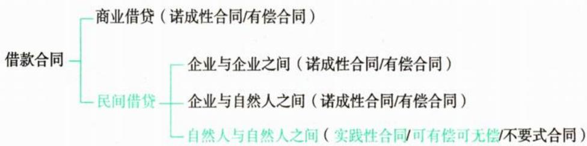

flowchart

```mermaid
graph TD
    A["借款合同"] --> B["商业借贷（诺成性合同/有偿合同）"]
    A --> C["民间借贷"]
    C --> D["企业与企业之间（诺成性合同/有偿合同）"]
    C --> E["企业与自然人之间（诺成性合同/有偿合同）"]
    C --> F["自然人与自然人之间（实践性合同/可有偿可无偿/不要式合同）"]
```

#### 一、借款合同的基本原理①

#### (一) 含义

借款合同是借款人向贷款人借款，到期返还借款并支付利息的合同。

#### （二）贷款人的权利和义务

#### 1. 权利。

借款人（债务人）未按照约定的借款用途使用借款（根本违约）的，非违约方贷款人（债权人）可以停止发放借款、提前收回借款或解除合同。

[例] 众森公司与工商银行签订一份借款合同（商业借贷），双方约定，工商银行为众森公司提供2000万元贷款，分两批发放；众森公司应按照约定的用途使用贷款。第一批贷款发放后，众森公司未按照约定使用贷款。工商银行有权解除贷款合同。因为众森公司构成根本违约，非违约方工商银行有权解除合同。

#### 2. 义务。

借款的利息不得预先在本金中扣除。利息预先在本金中扣除的，应当按照实际借款数额返还借款并计算利息。

[例] 孟某和马某双方拟订的借款合同（主合同）约定：孟某向马某借款11万元，借款期间为1年。马某要求从11万元中预先扣除1万元利息。孟某应允，双方签字。马某依约将10万元交付（自然人之间的借款合同属于实践性合同/提供借款时合同成立）给孟某。孟某和马某之间的借款数额为10万元。

#### （三）自然人之间的借贷合同

自然人之间的借款合同，自贷款人提供借款时成立。禁止高利放贷，借款的利率不得违反国家有关规定。借款合同对支付利息没有约定的，视为没有利息。借款合同对支付利息约定不明确，当事人不能达成补充协议的，按照当地或当事人的交易方式、交易习惯、市场利率等因素确定利息；自然人之间借款的，视为没有利息。

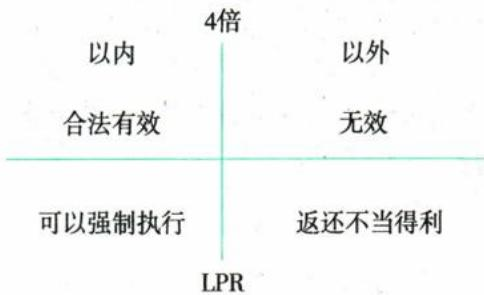

text_image

4倍
以内 以外
合法有效 无效
可以强制执行 返还不当得利
LPR

(民间借贷合同年利率示意图)

[例] 孟某和马某书面约定孟某向马某借款10万元，未约定利息，也未约定还款期限。根据上述案情，请回答如下问题：

①孟某和马某之间的借款合同何时成立？

答：自马某向孟某提供借款时成立。因为自然人之间的借款合同属于实践性合同。

②马某是否有权随时请求孟某返还借款？

答：有权。因为孟某和马某之间的借款合同未约定还款期限（无期限则无预期）。

③马某是否可以请求孟某按银行同期同类贷款利率支付利息？

答：不可以。因为自然人之间的借款合同具有互助性，未约定利息的，视为无利息。

④经马某催告，孟某仍不还款，马某是否有权主张逾期利息？

答：有权。

[萌主点拨]
商业借贷 VS 自然人之间的借贷

<table><tr><td>项目</td><td>商业借贷</td><td>自然人之间的借贷</td></tr><tr><td>主体</td><td>有金融机构</td><td>没有金融机构</td></tr><tr><td>性质</td><td>商事合同</td><td>民事合同</td></tr><tr><td>单双</td><td>双务</td><td>单务(其他民间借贷系双务)</td></tr><tr><td>有无偿</td><td>有偿</td><td>无特别约定的,推定无偿</td></tr><tr><td>诺实</td><td>诺成性</td><td>实践性(其他民间借贷系诺成)</td></tr><tr><td>是否要式</td><td>要式</td><td>不要式</td></tr></table>

#### 二、让与担保合同 $^{①}$ （非典型担保合同）

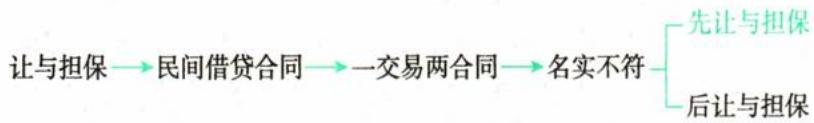

flowchart

```mermaid
graph LR
    A["让与担保"] --> B["民间借贷合同"]
    B --> C["一交易两合同"]
    C --> D["名实不符"]
    D --> E["先让与担保"]
    D --> F["后让与担保"]
```

(让与担保体系框架图)

#### (一) 基本原理

第一层：民间借款合同（主合同）合法有效（《民法典》第143条）

第二层：让与担保合同（从合同）合法有效（《民法典担保制度解释》第68条）

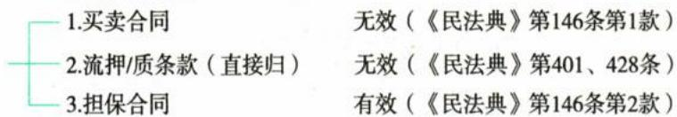

text_image

1.买卖合同
2.流押/质条款（直接归）
3.担保合同
无效（《民法典》第146条第1款）
无效（《民法典》第401、428条）
有效（《民法典》第146条第2款）

第三层：是否有顺序？

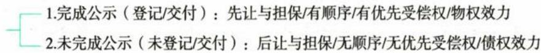

text_image

1.完成公示（登记/交付）：先让与担保/有顺序/有优先受偿权/物权效力
2.未完成公示（未登记/交付）：后让与担保/无顺序/无优先受偿权/债权效力

(广义让与担保法律关系解构示意图)

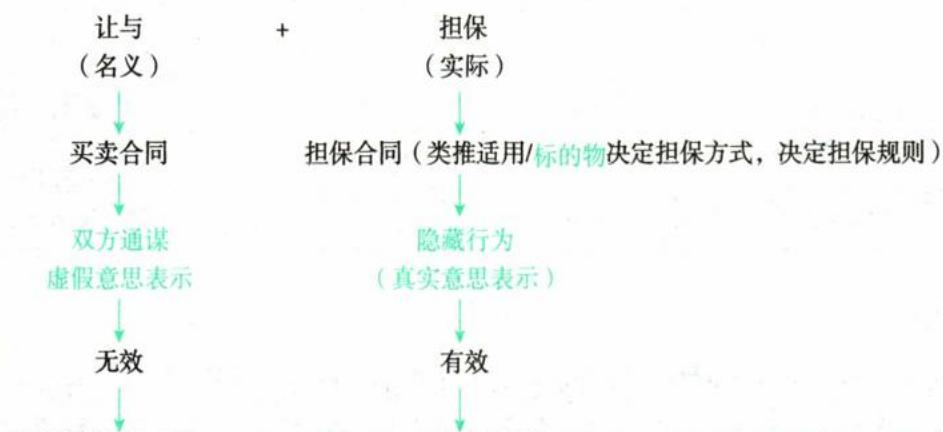

flowchart

```mermaid
graph TD
    A["让与<br>（名义）"] --> B["买卖合同"]
    B --> C["双方通谋<br>虚假意思表示"]
    C --> D["无效"]
    E["担保<br>（实际）"] --> F["担保合同<br>（类推适用/标的物决定担保方式，决定担保规则）"]
    F --> G["隐藏行为<br>（真实意思表示）"]
    G --> H["有效"]
    I["+"] --> E
```

1. 完成公示：先让与担保，有顺序，有优先受偿权（物权效力）

2. 未完成公示：后让与担保，无顺序，无优先受偿权（债权效力）

(让与担保法律关系解构示意图)

债务人或第三人为担保债务的履行，将标的物的所有权形式上转移至债权人名下。债务清偿后，标的物应返还于债务人或第三人；债务不获清偿时，债权人得就该标的物受偿（未完成公示）或优先受偿（已完成公示）的一种非典型担保。其中，将标的物转移给他人的债务人或第三人形式上是转让人，实质上是担保人；受领标的物所有权的他人形式上是受让人，实质上是担保权人（债权人）。

[萌主点拨] 售后回购的，属于让与担保合同（无名合同）。

#### (二) 处理

由交易习惯发展而来的让与担保合同本身合法有效。如合同中约定“流押/质条款”的，该条款无效。没有完成财产权利变动公示（后让与担保），债务人到期没有清偿债务的，债权人可以对财产拍卖、变卖、折价偿还债权，但不享有优先受偿权（债权效力）。

已经完成财产权利变动公示的（先让与担保），债务人到期没有清偿债务的，债权人可以请求参照法律关于担保物权的规定①对财产拍卖、变卖、折价偿还债权，且享有优先受偿权（物权效力）。债务人因到期没有清偿债务，有权主动请求对该财产拍卖、变卖、折价偿还所欠债权人合同项下债务。

##### [萌主点拨]

标的物决定担保方式汇总表

<table><tr><td>标的物</td><td>担保方式</td><td>担保规则</td><td>法律依据</td></tr><tr><td>房屋/建设用地使用权</td><td>抵押</td><td>登记</td><td>《民法典》第395、402条</td></tr><tr><td>汽车/机器设备</td><td>抵押/质押</td><td>登记/交付</td><td>《民法典》第403、429条</td></tr><tr><td>7种票据(汇票、本票、支票、债券、存款单、仓单、提单)</td><td>质押</td><td>交付/登记</td><td>《民法典》第441条</td></tr><tr><td>股权</td><td>质押</td><td>登记</td><td>《民法典》第443条</td></tr><tr><td>应收账款/债权</td><td>质押</td><td>登记</td><td>《民法典》第445条</td></tr><tr><td>没有指明任何特定财产</td><td>保证</td><td>函件/承诺函</td><td>《民法典担保制度解释》第25、36条</td></tr></table>

##### 随堂练习

自然人甲与乙签订了年利率为30%、为期1年的1000万元借款合同。后双方又签订了房屋买卖合同，约定：“甲把房屋卖给乙，房款为甲的借款本息之和。甲须在一年内以该房款分6期回购房屋。如甲不回购，乙有权直接取得房屋所有权。”乙交付借款时，甲出具收到全部房款的收据。后甲未按约定回购房屋，也未把房屋过户给乙。因房屋价格上涨至3000万元，甲主张偿还借款本息。下列哪些选项是正确的？（2015-3-51，多-改编） $^{②}$

A. 甲乙之间是借贷合同关系，不是房屋买卖合同关系
B. 应在不超过 LPR 的四倍以内承认借款利息
C. 乙不能获得房屋所有权
D. 因甲未按约定偿还借款，应承担违约责任

[萌主点拨]
让与担保协议 VS 流押（质）条款 VS 清偿型以物抵债协议

<table><tr><td>项目</td><td>让与担保协议(履行期限届满前的担保型以物抵债协议)</td><td>流押(质)条款</td><td>履行期限届满后的清偿型以物抵债协议</td></tr><tr><td>相同点</td><td>当事人约定</td><td>当事人约定</td><td>当事人约定</td></tr><tr><td>不同点</td><td>债务履行期限届满前</td><td>债务履行期限届满前</td><td>债务履行期限届满后</td></tr><tr><td>效力</td><td>合法有效</td><td>无效</td><td>合法有效</td></tr><tr><td>法律依据</td><td>《民间借贷合同解释》第23条《民法典担保制度解释》第68、69条《民法典合同编通则解释》第28条</td><td>《民法典》第401、428条</td><td>《民法典合同编通则解释》第27条</td></tr></table>

### 24 专题二十四 保证合同

#### 复习提要

保证合同规定在《民法典》第三编合同第二分编典型合同第十三章（第681—702条），共22条。本专题主要涉及八个问题：1. 保证合同的基本原理；2. 保证方式；3. 保证范围；4. 保证（担保）的从属性；5. 保证期间；6. 保证人（担保人）的权利；7. 共同担保；8. 反担保。该部分每年必考，且难度极大，在备考过程中须牢牢掌握。

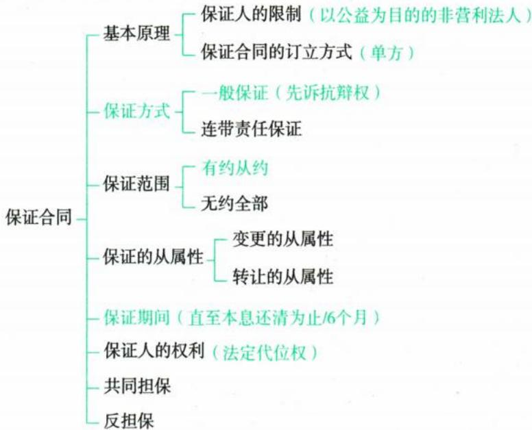

flowchart

```mermaid
graph TD
    A["保证合同"] --> B["基本原理"]
    A --> C["保证方式"]
    A --> D["保证范围"]
    A --> E["保证的从属性"]
    A --> F["保证期间（直至本息还清为止/6个月）"]
    A --> G["保证人的权利（法定代位权）"]
    A --> H["共同担保"]
    A --> I["反担保"]
    
    B --> J["保证人的限制（以公益为目的的非营利法人）"]
    B --> K["保证合同的订立方式（单方）"]
    
    C --> L["一般保证（先诉抗辩权）"]
    C --> M["连带责任保证"]
    
    D --> N["有约从约"]
    D --> O["无约全部"]
    
    E --> P["变更的从属性"]
    E --> Q["转让的从属性"]
```

#### 一、基本原理①

#### (一) 含义

保证是以人的信用（信誉）提供的担保。保证人的全部财产均属于责任财产（无限责任/风险不可控）。保证合同是为保障债权的实现，保证人和债权人约定，当债务人不履行到期债务或发生当事人约定的情形时，保证人履行债务或承担责任的合同。

[萌主点拨] 保证合同属于单务、无偿、从合同。

[例] 孟某向马某借款 2000 万元，二者签订借款合同。曹某为该笔借款提供保证担保。根据上述案情及示意图，请回答如下问题：

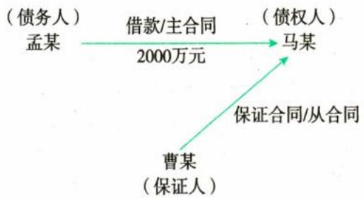

flowchart

```mermaid
graph TD
    A["(债务人) 孟某"] -->|借款/主合同 2000万元| B["(债权人)"]
    B -->|保证合同/从合同| C["(曹某 (保证人)"]
```

##### (保证法律关系当事人解构示意图)

①借款合同（主合同）的当事人是谁和谁？

答：孟某（债务人）和马某（债权人）。

②保证合同（从合同）的当事人是谁和谁？

答：曹某（保证人）和马某（债权人）。

③保证人曹某以何种标的物提供担保？

答：全部财产（信用/信誉）。

④保证人曹某承担何种责任？

答：无限责任。即以自身全部财产承担责任。

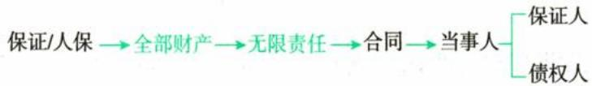

flowchart

```mermaid
graph LR
    A["保证/人保"] --> B["全部财产"]
    B --> C["无限责任"]
    C --> D["合同"]
    D --> E["当事人"]
    E --> F["保证人"]
    E --> G["债权人"]
```

##### (保证合同法律思维导图)

#### (二) 保证人的限制

保证人须以全部财产承担无限责任。因此，基于法人成立的目的和功能以及财产来源考虑，如下法人不得为保证人。

#### 1. 机关法人。

机关法人不得为保证人，但是经国务院批准为使用外国政府或国际经济组织贷款进行转贷的除外。机关法人既不能提供保证，亦不能在自己的财产上为自己或他人设定担保物权。因为机关法人的财产均与完成公益目标有直接或间接关系（《民法典》第683条第1款和《民法典担保制度解释》第5条）。

#### 2. 以公益为目的的非营利法人、非法人组织。

以公益为目的的非营利法人、非法人组织不得为保证人。以公益为目的的非营利法人主要包括公立的幼儿园、学校、医院、养老院等（《民法典》第683条第2款和《民法典担保制度解释》第6条）。

[例] 孟某向马某借款 2000 万元，中关村第三小学（公立的小学）为该笔债务提供保证担保。因中关村第三小学属于事业单位法人，系以公益为目的的非营利法人。因此，保证合同无效，承担缔约过失责任。

#### （三）保证合同的订立方式

保证合同的订立方式包括四类（《民法典》第685条）：

1. 单独的书面保证合同。

2. 在主债权债务合同（如借款合同）中有保证条款，第三人签字。

3. 在主债权债务合同（如借款合同）中没有保证条款，但第三人以保证人的身份签字。

4. 第三人单方以书面形式向债权人作出保证，债权人接收且未提出异议。

[例] 孟某向马某借款（自然人之间的借款合同/实践性合同）200万元用于（合同目的）购买婚房。曹某单方向马某出具了一份《担保承诺函》，注明“如孟某到期不能还款，本人承担全部责任”。本案中，第三人曹某以书面形式（《担保承诺函》）向债权人马某作出保证，债权人马某接收且未提出异议，保证合同成立。

#### 二、保证方式①

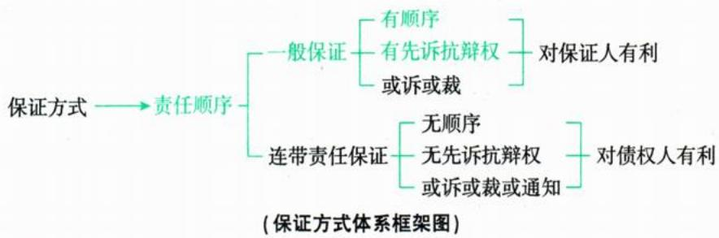

flowchart

```mermaid
graph TD
    A["保证方式"] --> B["责任顺序"]
    B --> C["一般保证"]
    C --> D["有顺序"]
    C --> E["有先诉抗辩权"]
    C --> F["或诉或裁"]
    D --> G["对保证人有利"]
    E --> G
    F --> G
    B --> H["连带责任保证"]
    H --> I["无顺序"]
    H --> J["无先诉抗辩权"]
    H --> K["或诉或裁或通知"]
    I --> L["对债权人有利"]
    J --> L
    K --> L
```

#### (一) 含义

保证方式，是指债务人和保证人向债权人承担责任是否有先后顺序。

#### (二) 一般保证

1. 识别。

一般保证，是指当事人在保证合同中约定，债务人不能履行（客观上不具备偿债能力）债务时，由保证人承担保证责任。一般保证的本质是债务人和保证人对债权人承担责任有顺序先后的限制，即先债务人后保证人。

2. 一般保证人的先诉抗辩权。

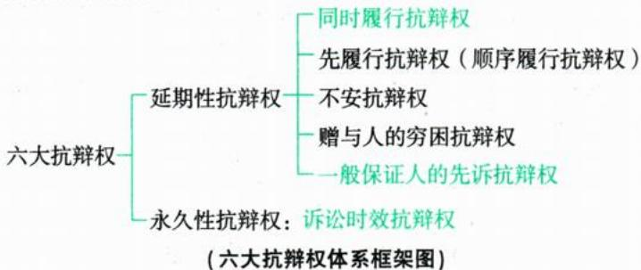

flowchart

```mermaid
graph TD
    A["六大抗辩权"] --> B["延期性抗辩权"]
    A --> C["永久性抗辩权：诉讼时效抗辩权"]
    B --> D["同时履行抗辩权"]
    B --> E["先履行抗辩权（顺序履行抗辩权）"]
    B --> F["不安抗辩权"]
    B --> G["赠与人的穷困抗辩权"]
    B --> H["一般保证人的先诉抗辩权"]
```

(1) 含义。

一般保证人的先诉抗辩权，是指一般保证的保证人在主合同纠纷未经审判或仲裁，并就债务人财产依法强制执行仍不能履行债务前，有权拒绝向债权人承担保证责任（《民法典》第687条）。

[萌主点拨] 一般保证人的先诉抗辩权

程序上，债权人不得单独先起诉或仲裁一般保证人；

实体上，债权人不得单独先执行一般保证人的财产。

#### (2) 丧失。

基于实质公平和保护债权人利益的考虑，在债务人客观上全部或部分丧失偿债能力或保证人向债权人书面放弃时，一般保证人即丧失先诉抗辩权。具体包括如下4类情形：债务人下落不明，且无财产可供执行；法院已经受理债务人破产案件；债权人有证据证明债务人的财产不足以履行全部债务或丧失履行债务能力；保证人（向债权人）书面放弃先诉抗辩权。

#### （三）连带责任保证

#### 1. 识别。

连带责任保证，是指当事人在保证合同中约定保证人和债务人对债权人承担连带责任。连带责任保证的本质是债务人和保证人对债权人承担责任没有顺序先后的限制，即债权人可以任意选择债务人和保证人承担责任。

#### 2. 诉讼。

在连带责任保证的情况下，债权人既可以单诉债务人，也可以单诉保证人，也可以列债务人和保证人为共同被告。

#### (四) 保证方式的推定

基于减轻保证人责任的立法精神，当事人在保证合同中对保证方式没有约定或约定不明确的，按照一般保证承担保证责任（《民法典》第686条第2款）。

[萌主点拨1]
一般保证 VS 连带责任保证

<table><tr><td>项目</td><td>一般保证</td><td>连带责任保证</td></tr><tr><td>法律依据</td><td>《民法典》第686、687条</td><td>《民法典》第688条</td></tr><tr><td>有无先诉抗辩权</td><td>有</td><td>无</td></tr><tr><td>设立方式</td><td>明示和推定</td><td>明示</td></tr><tr><td>责任承担</td><td>第二位的责任(次要责任/补充责任)</td><td>第一位的责任(首要责任)</td></tr><tr><td>诉讼地位</td><td>债权人不得单独先起诉一般保证人</td><td>债权人可以单独先起诉连带责任保证人</td></tr></table>

[萌主点拨2]
第三人代为履行 VS 债务加入 VS 连带责任保证

<table><tr><td>项目</td><td>第三人代为履行(清偿)</td><td>债务加入(并存的债务承担)</td><td>连带责任保证</td></tr><tr><td>法律依据</td><td>《民法典》第524条</td><td>《民法典》第552条</td><td>《民法典》第688条</td></tr><tr><td>本质</td><td>无约定+主动履行+合法利益</td><td>有约定+未履行</td><td>有约定+未履行</td></tr><tr><td>当事人</td><td>第三人并非借款合同当事人</td><td>加入人是借款合同当事人</td><td>连带责任保证人不是借款合同当事人</td></tr><tr><td>追偿权</td><td>有(法定债权转让)</td><td>有(原则上有约从约无约不当得利等)</td><td>有(法定代位权)</td></tr></table>

#### 三、保证范围①

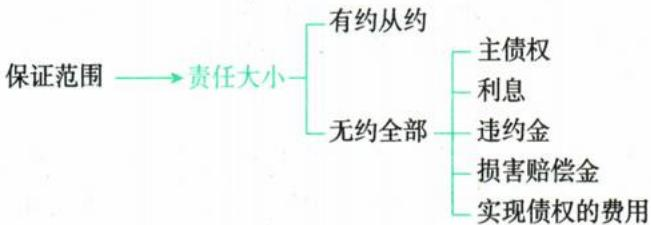

flowchart

```mermaid
graph TD
    A["保证范围"] --> B["责任大小"]
    B --> C["有约从约"]
    B --> D["无约全部"]
    C --> E["主债权"]
    C --> F["利息"]
    D --> G["违约金"]
    D --> H["损害赔偿金"]
    D --> I["实现债权的费用"]
```

(保证范围体系框架图)

保证的范围包括主债权及其利息、违约金、损害赔偿金和实现债权的费用。当事人另有约定的，按照其约定。

[萌主点拨]
担保范围（强度）

<table><tr><td>类型</td><td>项目</td><td>内容</td><td>法律依据</td></tr><tr><td>物的担保</td><td>6项</td><td>担保物权的担保范围包括主债权及其利息、违约金、损害赔偿金、保管担保财产和实现担保物权的费用。当事人另有约定的,按照其约定</td><td>《民法典》第389条</td></tr><tr><td>人的担保</td><td>5项</td><td>保证的范围包括主债权及其利息、违约金、损害赔偿金和实现债权的费用。当事人另有约定的,按照其约定</td><td>《民法典》第691条</td></tr></table>

#### >> 随堂练习

甲向乙借款5万元，乙要求甲提供担保，甲分别找到友人丙、丁、戊、己，他们各自作出以下表示，其中哪些构成保证？（多选）②

A. 丙在甲向乙出具的借据上签署“保证人丙”
B. 丁向乙出具字据称“如甲到期不向乙还款，本人愿代还3万元”
C. 戊向乙出具字据称“如甲到期不向乙还款，由本人负责”
D. 己向乙出具字据称“如甲到期不向乙还款，由本人以某处私房抵债”

#### 四、保证（担保）的从属性 $^{③}$

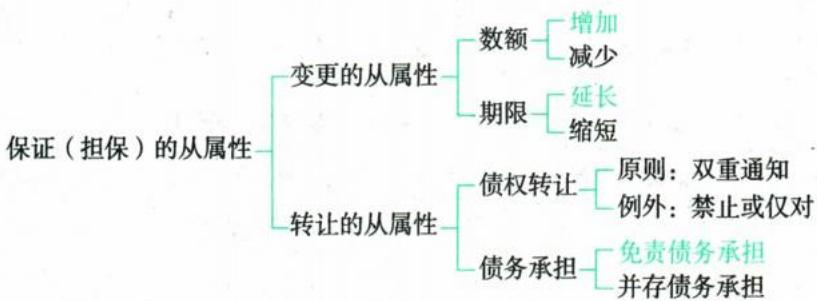

flowchart

```mermaid
graph TD
    A["保证（担保）的从属性"] --> B["变更的从属性"]
    A --> C["转让的从属性"]
    B --> D["数额"]
    B --> E["期限"]
    D --> F["增加"]
    D --> G["减少"]
    E --> H["延长"]
    E --> I["缩短"]
    C --> J["债权转让"]
    C --> K["债务承担"]
    J --> L["原则：双重通知"]
    J --> M["例外：禁止或仅对"]
    K --> N["免责债务承担"]
    K --> O["并存债务承担"]
```

(保证/担保的从属性体系框架图)

#### (一) 变更的从属性

#### 1. 数额。

#### (1) 增加。

债权人和债务人协商增加主债权数额的，加重了保证人的责任，须经保证人书面同意。未经保证人书面同意的，保证人对加重的部分不承担保证责任。

[例] 孟某向马某借款 2000 万元，借款期限 1 年。曹某提供保证担保。后孟某和马某协议将借款数额增加至 2250 万元，曹某未置可否。曹某的保证责任范围是 2000 万元。

#### (2) 减少。

债权人和债务人协商减少主债权数额的，减轻了保证人的责任，无须经保证人书面同意。保证人仍对变更后的债务承担保证责任。

[例] 孟某向马某借款 2000 万元，借款期限 1 年。曹某提供保证担保。后孟某和马某协议将借款数额减少至 850 万元，曹某未置可否。曹某的保证责任范围是 850 万元。

#### 2. 履行期限。

#### (1) 延长。

债权人和债务人协商延长主债权期限的，加重了保证人的责任，须经保证人书面同意。未经保证人书面同意的，保证人对延长后增加的主债务不承担保证责任。但对原定期限内的债务，仍承担保证责任。若延长期限覆盖全部保证期间的，保证人无须承担保证责任。

[例] 2024年3月2日，孟某和马某双方拟订的借款合同（主合同）约定：孟某向马某借款11万元，借款期间为1年。马某在签字之前，请求孟某为借款合同提供担保。曹某应孟某请求同意担保，并在借款合同保证人一栏签字，保证期间为1年。孟某将有担保人签字的借款合同交给马某。马某要求从11万元中预先扣除1万元利息，同时将借款期间和保证期间均延长为2年。孟某应允，双方签字，马某依约将10万元交付（自然人之间的借款合同属于实践性合同/提供借款时合同成立）给孟某。保证人曹某不需要承担保证责任。因为延长期限覆盖全部保证期间，保证人曹某无须承担保证责任。

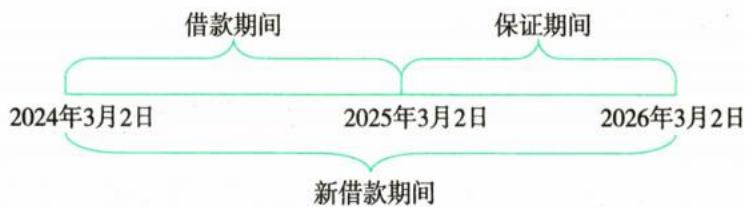

flowchart

```mermaid
graph LR
    A["2024年3月2日"] --> B["借款期间"]
    B --> C["2025年3月2日"]
    C --> D["保证期间"]
    D --> E["2026年3月2日"]
    F["新借款期间"] --> A
    F --> D
```

(借款期限全面覆盖保证期间示意图)

#### (2) 缩短。

债权人和债务人协商缩短主债权期限的，减轻了保证人的责任，无须经保证人书面同意。保证人仍对变更后的债务承担保证责任。

#### (二) 债权转让的从属性

#### 1. 原则。

债权人转让全部或部分债权的，对债务人和保证人影响不大。因此，仅需要通知债务人和保证人即可，即“双重通知”。

#### 2. 例外。

保证人与债权人约定禁止（仅对特定债权作保证）债权转让，债权人未经保证人书面同意转让债权的，保证人对受让人不再承担保证责任。

[例] 2025年3月2日，孟某向徐某借款（自然人之间的借款合同/实践性合同）850万元，马某为连带责任保证人（无顺序/无先诉抗辩权/或诉或裁或通知）。4月21日，徐某将该850万元债权转让（内外有别+双重通知）给了曹某，二者于当日签订债权转让协议（内部效力）。4月25日，孟某和马某接到了债权转让的通知（外部效力）。根据上述案情及示意图，请回答如下问题：

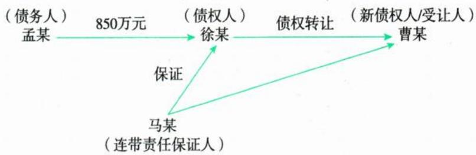

flowchart

```mermaid
graph TD
    A["(债务人) 孟某"] -->|850万元| B["(债权人) 徐某"]
    B -->|债权转让| C["(新债权人/受让人) 曹某"]
    D["马某 (连带责任保证人)"] -->|保证| B
```

(主债权转让当事人法律关系示意图)

①如保证合同没有任何特别约定，马某如何承担保证责任？

答：在原保证范围内继续承担保证责任。

②如保证合同中明确约定禁止（仅对特定债权作保证）债权转让的，马某如何承担保证责任？

答：不再承担保证责任。

#### （三）免责债务转让的从属性

#### 1. 原则。

债务转让后，债务人的履行能力并不一样，从而使得保证人的风险加大，对保证人利益影响巨大。因此，未经保证人的书面同意，对于转移部分的债务，保证人不承担责任。全部转让的，保证人不再承担保证责任，即全部免责。部分转让的，保证人对转让的部分不再承担保证责任，即部分免责。

#### 2. 例外。

保证人继续承担保证责任的“双重同意且有顺序”，即先债权人（主权利）同意后保证人（从权利）同意。

（1）债权人的同意为不要式，书面、口头、行为均可。如债权人不同意，债务转让行为不对债权人产生效力，保证人继续承担保证责任。
(2) 保证人的同意为要式, 必须书面同意。第三人提供物的担保, 未经其书面同意,债权人允许债务人转移全部或部分债务的, 担保人不再承担相应的担保责任。

[例] 2025年3月2日，孟某向徐某借款（自然人之间的借款合同/实践性合同）850万元，马某为连带责任保证人（无顺序/无先诉抗辩权/或诉或裁或通知）。4月21日，孟某将500万元的债务转让（退出型/免责的债务转让/内外有别+双重同意且有顺序）给曹某。根据上述案情及示意图，请回答如下问题：

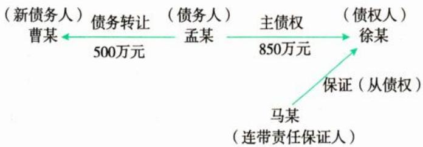

flowchart

```mermaid
graph LR
    A["新债务人 曹某"] -->|债务转让 500万元| B(债务人 孟某)
    B -->|主债权 850万元| C(债权人 徐某)
    C -->|保证（从债权）| D["马某 (连带责任保证人)"]
```

##### (免责的债务转让当事人法律关系示意图)

①如徐某不同意债务转让，马某如何承担保证责任？

答：马某继续承担全部保证责任。因为债权人不同意债务转让的，债务未转让，孟某依然是债务人。

②如徐某同意债务转让，马某未书面同意的，马某如何承担保证责任？

答：马某仅对剩余的 350 万元承担保证责任。因为未经保证人书面同意，保证人在 500 万元范围内免责。

③如徐某同意债务转让，马某亦书面同意的，马某如何承担保证责任？

答：马某继续对850万元债务承担保证责任。

##### [萌主点拨]

免责的债务转让对保证人的影响

<table><tr><td>情形</td><td>债权人</td><td>保证人</td><td>保证人责任承担</td></tr><tr><td>情形1</td><td>不同意</td><td>不考虑</td><td>继续承担全部保证责任</td></tr><tr><td>情形2</td><td>同意</td><td>未书面同意</td><td>全部转让,全部免责;部分转让,部分免责</td></tr><tr><td>情形3</td><td>同意</td><td>书面同意</td><td>继续承担全部保证责任</td></tr></table>

#### （四）并存债务转让（债务加入）的从属性

由于第三人加入债务，原债务人还是当然的债务人。因此，保证人的权益不仅没有受到任何侵害，反而因第三人加入债务有可能增加债务人的履约财产，最终使保证人的责任减轻。即使加入的第三人没有任何财产，也不会给保证人带来不利影响。

#### 五、保证期间①

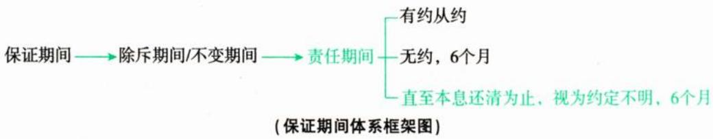

flowchart

```mermaid
graph LR
    A["保证期间"] --> B["除斥期间/不变期间"]
    B --> C["责任期间"]
    C --> D["有约从约"]
    C --> E["无约，6个月"]
    C --> F["直至本息还清为止，视为约定不明，6个月"]
```

#### (一) 含义

保证期间，是指确定保证人承担保证责任的期间，又称“保证责任的期间”“保证责任的存续期间”“承担保证责任的期间”。保证期间的核心功能在于保护保证人的利益。同时，督促债权人及时行权。

#### (二) 性质

关于保证期间的性质，理论上有诉讼时效说、除斥期间说、债务履行期限说、特殊期间说或有期间说等不同观点。全国人大常委会法工委认为，保证期间的性质为除斥期间（不变期间），不发生中止、中断和延长。

#### (三) 类型

1. 约定的保证期间。

债权人与保证人可以约定保证期间。

2. 法定的保证期间。

保证人和债权人没有约定或约定不明确的，保证期间为主债务履行期限届满之日起6个月。

保证合同约定保证人承担保证责任直至主债务本息还清时为止等类似内容的，视为约定不明，保证期间为主债务履行期限届满之日起6个月。

#### (四) 起算

保证期间自主债务履行期限届满之日起计算。债权人与债务人对主债务履行期限没有约定或约定不明确的，保证期间自债权人请求债务人履行债务的宽限期届满之日起计算。

#### （五）保证期间届满的法律后果

《民法典》第693条共1条规定了保证期间届满的法律后果。

1. 一般保证。

一般保证的债权人未在保证期间内对债务人提起诉讼或申请仲裁的，保证人不再承担保证责任。

2. 连带责任保证。

连带责任保证的债权人未在保证期间对保证人主张（或诉或裁或通知）承担保证责任的，保证人不再承担保证责任。

保证期间届满的法律后果

<table><tr><td>保证方式</td><td>行权对象</td><td>行权方式</td><td>是否行权</td><td>法律后果</td></tr><tr><td rowspan="2">一般保证</td><td rowspan="2">债务人</td><td rowspan="2">或诉或裁</td><td>未行权</td><td>一般保证人免责</td></tr><tr><td>行权</td><td>从拒绝权消灭之日(即一般保证人丧失先诉抗辩权之日)开始起算保证债务3年诉讼时效期间</td></tr><tr><td rowspan="2">连带责任保证</td><td rowspan="2">连带责任保证人</td><td rowspan="2">或诉或裁或通知</td><td>未行权</td><td>连带责任保证人免责</td></tr><tr><td>行权</td><td>从请求连带责任保证人承担保证责任之日开始起算保证债务3年诉讼时效期间</td></tr></table>

#### （六）保证期间与保证债务诉讼时效的关系

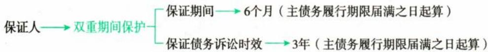

flowchart

```mermaid
graph LR
    A["保证人"] --> B["双重期间保护"]
    B --> C["保证期间"] --> D["6个月（主债务履行期限届满之日起算）"]
    B --> E["保证债务诉讼时效"] --> F["3年（主债务履行期限届满之日起算）"]
```

(保证人的双重期间保护体系框架图)

保证期间和保证债务诉讼时效不可能同时并存，有保证期间无保证债务诉讼时效，有保证债务诉讼时效无保证期间，二者“水火不容”，即保证期间存在就不可能起算保证债务诉讼时效，一旦起算保证债务诉讼时效，保证期间即已消灭。

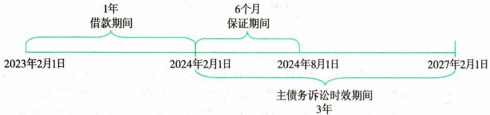

flowchart

```mermaid
graph LR
    A["2023年2月1日"] --> B["1年 借款期间"]
    B --> C["2024年2月1日"]
    C --> D["6个月 保证期间"]
    D --> E["2024年8月1日"]
    E --> F["2027年2月1日"]
    G["主债务诉讼时效期间 3年"] --> E
```

(保证期间届满的法律后果时间示意图)

[例 1] 2023 年 2 月 1 日，孟某向马某借款（主债权/自然人之间的借款合同/实践性合同）2000 万元，借款期间为 1 年，曹某为一般保证人（有顺序/有先诉抗辩权/或诉或裁）。到期孟某未还款。马某于 2024 年 9 月 1 日起诉孟某，12 月 1 日获得生效的胜诉判决。经法院强制执行于 2025 年 2 月 1 日确认孟某无财产，执行未果。2025 年 2 月 2 日，马某请求曹某承担保证责任。曹某无需承担保证责任。因为债权人马某未在保证期间（2024 年 2 月 2 日至 2024 年 8 月 1 日）内起诉债务人孟某，一般保证人曹某免责。

[例 2] 2023 年 2 月 1 日，孟某向马某借款（主债权/自然人之间的借款合同/实践性合同）2000 万元，借款期间为 1 年，曹某为一般保证人（有顺序/有先诉抗辩权/或诉或裁）。到期孟某未还款。马某于 2024 年 3 月 1 日起诉孟某和曹某（保证期间消灭/完成使命/失去作用和意义/功成身退）。4 月 1 日，法院判决马某胜诉，执行顺序为先孟某后曹某。经法院强制执行于 6 月 1 日确认孟某无财产可供执行，作出终结本次执行程序的裁定并于当日送达债权人（《民法典担保制度解释》第 28 条）。此时，一般保证人曹某丧失先诉抗辩权（拒绝权消灭），自 6 月 2 日起开始起算保证债务 3 年诉讼时效期间，即 2024 年 6 月 2 日至 2027 年 6 月 1 日。该 3 年内，债权人马某均有权申请执行一般保证人曹某的财产。

[萌主点拨] 债权人在保证期间内依法行权，保证期间消灭。
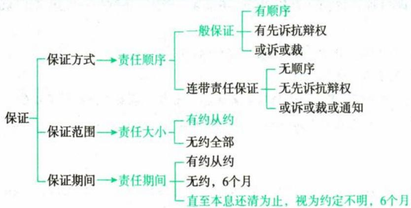

flowchart

```mermaid
graph TD
    A["保证"] --> B["保证方式"]
    A --> C["保证范围"]
    A --> D["保证期间"]
    B --> E["责任顺序"]
    E --> F["一般保证"]
    F --> G["有顺序"]
    F --> H["有先诉抗辩权"]
    F --> I["或诉或裁"]
    E --> J["连带责任保证"]
    J --> K["无顺序"]
    J --> L["无先诉抗辩权"]
    J --> M["或诉或裁或通知"]
    C --> N["责任大小"]
    N --> O["有约从约"]
    N --> P["无约全部"]
    D --> Q["责任期间"]
    Q --> R["有约从约"]
    Q --> S["无约，6个月"]
    Q --> T["直至本息还清为止，视为约定不明，6个月"]
```

(保证制度体系框架图)

#### 六、保证人（担保人）的权利①

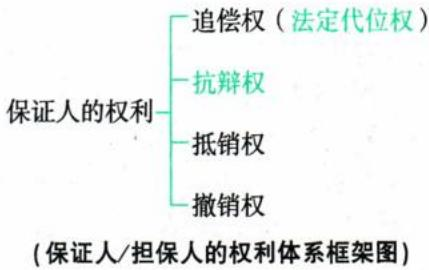

flowchart

```mermaid
graph TD
    A["保证人的权利"] --> B["追偿权（法定代位权）"]
    A --> C["抗辩权"]
    A --> D["抵销权"]
    A --> E["撤销权"]
```

#### (一) 追偿权

1. 原则。

保证人对债务人的追偿权，是指保证人履行全部或部分保证责任后，有权向主债务人（最终责任人）请求偿还。其原理是：虽然保证人向债权人承担保证责任是其依保证合同所应承担的义务，但是保证人对债权人承担保证责任毕竟是代主债务人履行债务，保证人是为了主债务人的利益而遭受的损失，从公平原则出发，应当赋予保证人向主债务人追偿的权利。保证人要行使追偿权，应当具备以下条件：

（1）保证人已向债权人承担了全部或部分保证责任；
(2) 债务人因保证人承担保证责任而全部或部分免责；
(3) 保证人未放弃追偿权；
(4) 保证人追偿权的范围只能在承担保证责任的范围内；
(5) 保证人的履行行为没有过错。

2. 例外。

保证人承担保证责任后，除当事人另有约定外，有权在其承担保证责任的范围内向债务人追偿，享有债权人对债务人的权利，但是不得损害债权人的利益。

#### >> 随堂练习

张某从甲银行分支机构乙支行借款20万元，李某提供保证担保。李某和甲银行又特别约定，如保证人不履行保证责任，债权人有权直接从保证人在甲银行及其支行处开立的任何账户内扣收。届期，张某、李某均未还款，甲银行直接从李某在甲银行下属的丙支行账户内扣划了18万元存款用于偿还张某的借款。下列哪一表述是正确的？（2014-3-15，单）②

A. 李某与甲银行关于直接在账户内扣划款项的约定无效
B. 李某无须承担保证责任
C. 乙支行收回20万元全部借款本金和利息之前，李某不得向张某追偿
D. 乙支行应以自己的名义向张某行使追索权

#### (二) 法定代位权

#### 1. 原则。

保证人承担保证责任后，除当事人另有约定外，有权在其承担保证责任的范围内向债务人追偿，享有债权人对债务人的权利，但是不得损害债权人的利益（《民法典》第700条）。

“享有债权人对债务人的权利”，该权利学理上称为“法定代位权”。保证人承担保证责任后，被清偿的债权本应归于消灭，但是“法律拟制”债权继续存在，承担保证责任的保证人取得法定代位权，其唯一目的在于保障保证人向债务人追偿，其本质系债权的法定转移，是依据清偿代位而获得的。因此，追偿权是法定代位权的前提和基础，决定了法定代位权是否成立。换言之，法定代位权从属于追偿权，其目的是强化追偿权，追偿权不存在，则法定代位权也不产生；追偿权实现后，被移转的债权也告消灭。法定代位权具体包括但不限于对债务人享有的抵押权、支付利息请求权、支付违约金请求权。

[例] 孟某向马某借款（主债权）2000万元，将自己价值1000万元的房屋（不动产/只能抵押）提供抵押担保并办理了抵押登记手续。曹某单方向马某出具担保函，如孟某到期不能清偿债务，本人承担差额补足责任。徐某以自己一辆价值500万元的宾利轿车提供抵押担保并办理了抵押登记（有内部效力有外部效力）手续。王某以自己持有的价值200万元的海马公司 $20\%$ 的股权提供质押担保并办理了质押登记手续。到期后，孟某不能清偿债务。经查，孟某尚有A、B和C三个债权人的共计3000万元到期普通（一般）债权未履行完毕。根据上述案情及示意图，请回答如下问题：

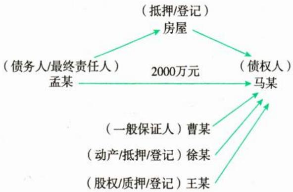

flowchart

```mermaid
graph TD
    A["(抵押/登记)"] --> B["房屋"]
    C["(债务人/最终责任人)"] --> D["孟某"]
    B --> E["(债权人)"]
    D --> E
    E --> F["马某"]
    G["(一般保证人) 曹某"] --> F
    H["(动产/抵押/登记) 徐某"] --> F
    I["(股权/质押/登记) 王某"] --> F
    style A fill:#f9f,stroke:#333
    style C fill:#f9f,stroke:#333
    style E fill:#ccf,stroke:#333
    style F fill:#cfc,stroke:#333
    style G fill:#fcc,stroke:#333
    style H fill:#fcc,stroke:#333
    style I fill:#fcc,stroke:#333
```

(担保人法定代位权当事人示意图)

①如曹某主动向马某承担了保证责任，是否有权请求拍卖孟某的房屋优先受偿？

答：有权。因为承担了保证责任的保证人享有法定代位权（《民法典》第700条）。

②如马某拍卖了徐某价值500万元的宾利轿车，徐某是否有权请求拍卖孟某的房屋优先受偿？

答：有权。因为承担了担保责任的抵押人享有法定代位权。

③如马某拍卖了王某价值200万元的股权，王某是否有权请求拍卖孟某的房屋优先受偿？

答：有权。因为承担了担保责任的出质人享有法定代位权。

#### 2. 例外。

保证人承担保证责任后，除当事人另有约定外，有权在其承担保证责任的范围内向债务人追偿，享有债权人对债务人的权利，但是不得损害债权人的利益。

[例] 孟某向马某借款（主债权）2000万元，将自己价值1000万元的房屋（不动产/只能抵押）提供抵押担保并办理了抵押登记手续。曹某以自己一辆价值500万元的宾利轿车提供抵押担保并办理了抵押登记（有内部效力有外部效力）手续。到期后，孟某不能清偿债务。曹某怕自己的宾利轿车被执行，向债权人马某偿还500万元。经查，孟某除价值1000万元的房屋外无其他责任财产。根据上述案情及示意图，请回答如下问题：

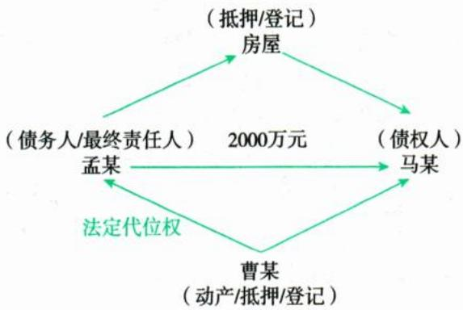

flowchart

```mermaid
graph TD
    A["(抵押/登记)"] --> B["房屋"]
    B --> C["(债权人)"]
    C --> D["马某"]
    D --> E["曹某 (动产/抵押/登记)"]
    E --> F["孟某"]
    F --> G["(债务人/最终责任人)"]
    G --> H["(抵押/登记)"]
    H --> B
    C --> I["2000万元"]
    I --> D
    F --> J["法定代位权"]
```

(担保人法定代位权当事人示意图)

①马某是否有权就剩余的1500万元拍卖孟某的房屋优先受偿？

答：有权。因为马某系抵押权人，依法对债务人孟某的房屋享有抵押权（意定担保物权的不可分性/主债权尚未清偿完毕，担保物一个都不能少）。

②曹某是否有权就500万元拍卖孟某的房屋优先受偿？

答：有权。因为作为担保人的曹某享有法定代位权。

③马某和曹某就孟某房屋拍卖后的1000万元如何分配？

答：1000万元全部归马某。因为担保人行使法定代位权不得损害债权人的利益。

#### (三) 抗辩权

保证人可以主张债务人对债权人的抗辩。债务人放弃抗辩的，保证人仍有权向债权人主张抗辩。基于保证合同的从属性原理，凡是债务人所享有的抗辩，保证人都可以主张，这些抗辩权包括：主合同未生效的抗辩、主合同无效的抗辩、主合同已经终止的抗辩、主债权已过诉讼时效的抗辩、撤销权抗辩、抵销权抗辩、同时履行抗辩、不安抗辩、先履行抗辩等。

#### (四) 抵销权或撤销权

债务人对债权人享有抵销权或撤销权的，保证人可以在相应范围内拒绝承担保证责任。

#### 七、共同担保①

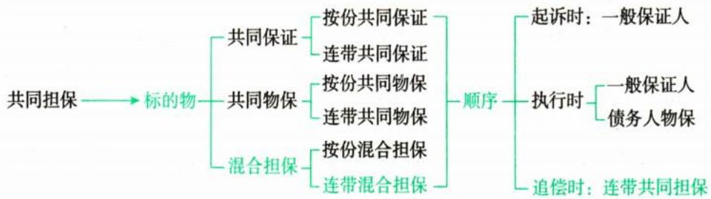

flowchart

```mermaid
graph LR
    A["共同担保"] --> B["标的物"]
    B --> C["共同保证"]
    B --> D["共同物保"]
    B --> E["混合担保"]
    C --> F["按份共同保证"]
    C --> G["连带共同保证"]
    D --> H["按份共同物保"]
    D --> I["连带共同物保"]
    E --> J["按份混合担保"]
    E --> K["连带混合担保"]
    F --> L["顺序"]
    G --> L
    H --> L
    I --> L
    J --> L
    K --> L
    L --> M["起诉时：一般保证人"]
    L --> N["执行时：一般保证人\n债务人物保"]
    L --> O["追偿时：连带共同担保"]
```

#### (一) 共同保证

1. 含义。

共同保证，又称共同人保，是指两个或两个以上的保证人为同一债权人的同一债权向债权人所提供的担保。

2. 特征。

(1) 保证人的人数系两个以上。
(2) 两个以上的保证人必须是为同一债权人的同一债权提供保证。
(3) 共同保证人的责任形式有两种，即按份责任和连带责任。

3. 方式。

共同保证的方式

<table><tr><td>步骤</td><td>第一步(外部责任方式)</td><td>第二步(内部责任方式)</td></tr><tr><td>关系</td><td>债务人和保证人之间的关系</td><td>保证人之间的关系</td></tr><tr><td>类型1</td><td>一般保证</td><td>按份共同</td></tr><tr><td>类型2</td><td>一般保证</td><td>连带共同</td></tr><tr><td>类型3</td><td>连带保证</td><td>按份共同</td></tr><tr><td>类型4</td><td>连带保证</td><td>连带共同</td></tr></table>

类型1：孟某向徐某借款1000万元。马某、曹某与徐某签订保证合同（单务合同、无偿合同），保证合同约定：“如孟某到期不能还款，马某、曹某承担保证责任（无限责任），保证的份额（对外/按份共同保证）为马某承担40%、曹某承担60%”。

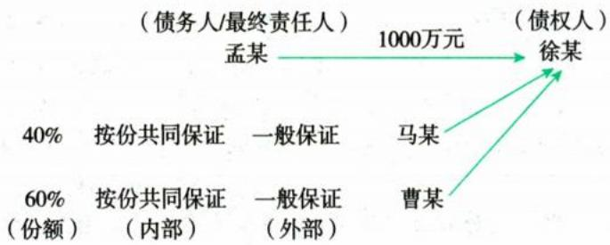

flowchart

```mermaid
graph TD
    A["(债务人/最终责任人) 孟某"] -->|1000万元| B["(债权人) 徐某"]
    C["40% 按份共同保证 一般保证"] --> D["马某"]
    E["60% (份额) 按份共同保证 (内部) 一般保证 (外部)"] --> F["曹某"]
```

(当事人法律关系示意图)

(1) 起诉（程序上）。

如债务人孟某到期不能还款，债权人徐某的诉讼方案有四：

①单独起诉孟某（主债务人/最终责任人）。
②将孟某和马某（一般保证人）作为共同被告。
③将孟某和曹某（一般保证人）作为共同被告。

④将孟某、马某和曹某作为共同被告。

(2) 执行（实体上）。

因为马某和曹某系一般保证人，享有先诉抗辩权。因此，法院应当判决：先执行孟某的财产，不足部分再执行马某和曹某的财产。

[萌主点拨] 按份共同保证, 是指保证人与债权人在保证合同中约定了各个保证人所承担的保证份额, 债权人只能在约定的份额限度内向各个保证人请求承担保证责任的共同保证。按份共同保证的保证人既可以是一般保证人, 也可以是连带责任保证人。

类型2：孟某向徐某借款1000万元。马某、曹某与徐某签订保证合同（单务合同、无偿合同），保证合同约定：“如孟某到期不能还款，马某、曹某承担保证责任（无限责任）”。

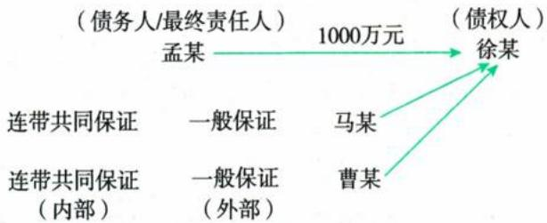

flowchart

```mermaid
graph TD
    A["(债务人/最终责任人) 孟某"] -->|1000万元| B["(债权人) 徐某"]
    C["连带共同保证"] --> D["一般保证"]
    E["连带共同保证 (内部)"] --> F["一般保证 (外部)"]
    G["马某"] --> B
    H["曹某"] --> B
```

(当事人法律关系示意图)

(1) 起诉（程序上）。

如债务人孟某到期不能还款，债权人徐某的诉讼方案有四：

①单独起诉孟某（主债务人/最终责任人）。
②将孟某和马某（一般保证人）作为共同被告。
③将孟某和曹某（一般保证人）作为共同被告。
④将孟某、马某和曹某作为共同被告。

(2) 执行（实体上）。

因为马某和曹某系一般保证人，享有先诉抗辩权。因此，法院应当判决：先执行孟某的财产，不足部分再执行马某和曹某的财产。

[萌主点拨] 连带共同保证，是指各共同保证人与债权人之间并未就保证责任的份额作出约定，各个保证人对全部债务代为履行或承担连带清偿责任的共同保证。连带共同保证中的“连带”，是指各个保证人之间的“连带”，而非保证人与债务人之间的“连带”。这与连带责任保证不同。连带责任保证是保证人与债务人之间“连带”，共同对债权人负连带保证责任；连带共同保证中“连带”的内容是保证人共同对债权人负连带保证责任。因此，债权人可以请求任何一个保证人在其保证范围内承担保证责任。

根据合同相对性原理，连带共同保证的保证人以其相互之间约定各自承担的份额对抗债权人的，则该约定仅在各个保证人内部责任分担方面具有意义，而不能以此对抗债权人的请求权。

类型3：孟某向徐某借款1000万元。马某、曹某与徐某签订保证合同（单务合同、无偿合同），保证合同约定：“马某、曹某提供连带责任保证。保证份额（对外/按份共同保证）为马某承担40%、曹某承担60%”。

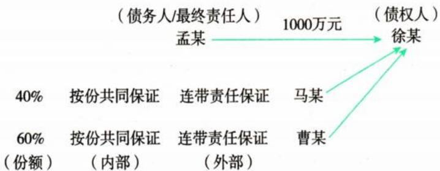

flowchart

```mermaid
graph TD
    A["(债务人/最终责任人)"] --> B["孟某"]
    B --> C["1000万元"]
    D["(债权人)"] --> E["徐某"]
    F["40% 按份共同保证"] --> G["连带责任保证"]
    H["60% (份额)"] --> I["按份共同保证 (内部)"]
    J["连带责任保证 (外部)"] --> K["马某"]
    L["曹某"] --> M[" "]
```

(当事人法律关系示意图)

(1) 起诉（程序上）。

如债务人孟某到期不能还款，债权人徐某的诉讼方案有七：

①单独起诉孟某（主债务人/最终责任人）。
②单独起诉马某（连带责任保证人）。
③单独起诉曹某（连带责任保证人）。
④将孟某和马某作为共同被告。
⑤将孟某和曹某作为共同被告。
⑥将马某和曹某作为共同被告。
⑦将孟某、马某和曹某作为共同被告。

(2) 执行（实体上）。

因为马某和曹某系连带责任保证人，不享有先诉抗辩权。因此，法院可以判决：徐某可以任意选择（随便）执行孟某、马某和曹某的财产，具体而言：

①如徐某单独直接执行孟某财产的，可以请求执行全部。
②如徐某单独直接执行马某财产的，马某应承担不超过400万元的保证责任。
③如徐某单独直接执行曹某财产的，曹某应承担不超过600万元的保证责任。

类型4：孟某向徐某借款1000万元。马某、曹某与徐某签订保证合同（单务合同、无偿合同），保证合同约定：“马某、曹某提供连带责任保证。”

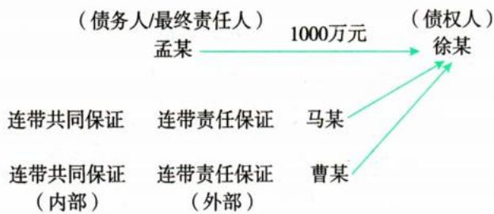

flowchart

```mermaid
graph TD
    A["(债务人/最终责任人) 孟某"] -->|1000万元| B["(债权人) 徐某"]
    C["连带共同保证"] --> D["连带责任保证"]
    E["连带共同保证 (内部)"] --> F["连带责任保证 (外部)"]
    G["马某"] --> H["曹某"]
```

(当事人法律关系示意图)

(1) 起诉（程序上）。

如债务人孟某到期不能还款，债权人徐某的诉讼方案有七：

①单独起诉孟某（主债务人/最终责任人）。
②单独起诉马某（连带责任保证人）。
③单独起诉曹某（连带责任保证人）。

④将孟某和马某作为共同被告。

⑤将孟某和曹某作为共同被告。

⑥将马某和曹某作为共同被告。

⑦将孟某、马某和曹某作为共同被告。

(2) 执行（实体上）。

因为马某和曹某系连带责任保证人，不享有先诉抗辩权。因此，法院可以判决：徐某可以任意选择（随便）执行孟某、马某和曹某的财产，具体而言：

①如徐某单独直接执行孟某财产的，可以请求全部。

②如徐某单独直接执行马某财产的，可以请求全部。

③如徐某单独直接执行曹某财产的，可以请求全部。

[萌主点拨]
按份共同保证 VS 连带共同保证

<table><tr><td>项目</td><td>按份共同保证</td><td>连带共同保证</td></tr><tr><td>成立方式</td><td>当事人必须就保证责任的份额作出明确约定才能成立按份共同保证,否则应推定成立连带共同保证</td><td>既可以基于当事人约定,也可以基于法律的规定推定</td></tr><tr><td>承担的责任份额</td><td>各共同保证人仅需在约定的份额内承担各自的保证责任,债权人也只能在其与各个保证人约定的份额内请求各个保证人承担保证责任</td><td>各共同保证人在其保证范围内对债权人承担连带保证责任。其保证范围,既可以是全部债权,也可以是部分债权。债权人可以请求任何一个保证人在其保证范围内承担保证责任</td></tr></table>

#### (二) 共同物保

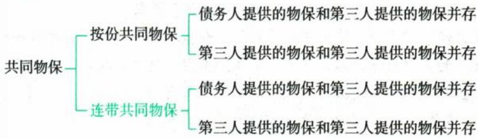

flowchart

```mermaid
graph TD
    A["共同物保"] --> B["按份共同物保"]
    A --> C["连带共同物保"]
    B --> D["债务人提供的物保和第三人提供的物保并存"]
    B --> E["第三人提供的物保和第三人提供的物保并存"]
    C --> F["债务人提供的物保和第三人提供的物保并存"]
    C --> G["第三人提供的物保和第三人提供的物保并存"]
```

(共同物保体系框架图)

1. 连带债务人提供的物保和第三人提供的物保并存。

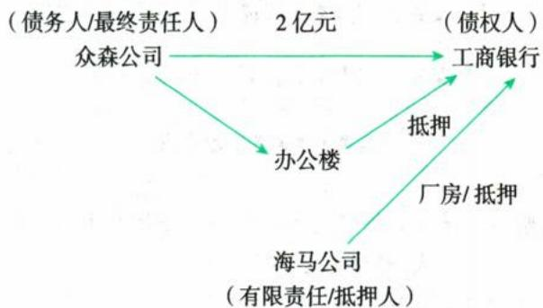

flowchart

```mermaid
graph TD
    A["众森公司"] -->|2亿元| B(债权人)
    A --> C["办公楼"]
    C -->|抵押| D["工商银行"]
    C -->|厂房/抵押| E["海马公司"]
    E -->|有限责任/抵押人| F["公众"]
    B -->|债务人/最终责任人| A
```

(连带债务人提供的物保和第三人提供的物保并存)

[例] 众森公司向工商银行贷款2亿元。以自己的办公楼为该笔贷款提供抵押并办理了抵押登记（不动产抵押权依登记）手续。同时，海马公司以厂房为该笔贷款提供抵押担保并办理抵押登记（不动产抵押权依登记）手续。

#### (1) 起诉（程序上）。

如债务人众森公司到期不能还款，债权人工商银行以诉讼方式实现担保物权的，应如何处理？

答：应当以众森公司和海马公司为共同被告（《民法典担保制度解释》第45条第3款）。

(2) 执行（实体上/目前理论界观点尚未统一/有争议/主观题观点展示题）。

在债务人的物保和第三人的物保并存时，如何执行？

原《担保法司法解释》第75条①采用“无顺序说”。但是，《民法典》和《民法典担保制度解释》并未回答这一问题。理论上和实务中存在争议，存在“有顺序说”和“无顺序说”两种。为减轻考生的复习负担，本书采用“有顺序说”，即应当先执行债务人的物保，不足部分再拍卖其他担保人的财产（类推适用《民法典》第392条）。

##### [核心法条链接]

《民法典》第409条第2款 [抵押权的处分] 债务人以自己的财产设定抵押，抵押权人放弃该抵押权、抵押权顺位或者变更抵押权的，其他担保人在抵押权人丧失优先受偿权益的范围内免除担保责任，但是其他担保人承诺仍然提供担保的除外。

《民法典》第 435 条 [质权的处分] 质权人可以放弃质权。债务人以自己的财产出质，质权人放弃该质权的，其他担保人在质权人丧失优先受偿权益的范围内免除担保责任，但是其他担保人承诺仍然提供担保的除外。

2. 连带第三人提供的物保和第三人提供的物保并存。

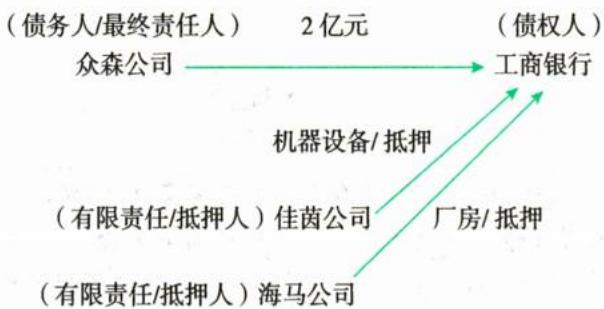

flowchart

```mermaid
graph TD
    A["众森公司"] -->|2亿元| B["工商银行"]
    C["(有限责任/抵押人) 佳茵公司"] -->|机器设备/抵押| B
    D["(有限责任/抵押人) 海马公司"] -->|厂房/抵押| B
    E["(债务人/最终责任人)"] --> A
    F["(债权人)"] --> B
```

(连带第三人提供的物保和第三人提供的物保并存)

[例] 众森公司向工商银行贷款2亿元。佳茵公司以一台大型机器设备为该笔贷款提供抵押并办理了抵押登记（有内部效力有外部效力）手续。同时，海马公司以厂房为该笔贷款提供抵押担保并办理抵押登记（不动产抵押权依登记）手续。

#### (1) 起诉（程序上）。

如债务人众森公司到期不能还款，债权人工商银行以诉讼方式实现担保物权的，应如何处理？

答：应当以众森公司、佳茵公司和海马公司为共同被告（《民法典担保制度解释》第45条第3款）。

#### (2) 执行（实体上）。

佳茵公司和海马公司仅以自己提供的机器设备和厂房的价值为限承担有限责任，对于佳茵公司和海马公司的其他财产，工商银行无权主张拍卖。同时，佳茵公司和海马公司对于承担担保责任的法律后果，即自己的机器设备和厂房可能被拍卖亦心知肚明，早有心理准备，无特殊保护的必要性和正当性。因此，工商银行在执行层面，可以任意选择佳茵公司和海马公司，无顺序先后的限制。

#### (三) 混合担保

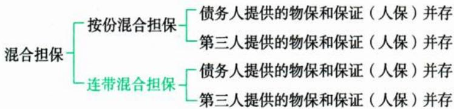

flowchart

```mermaid
graph TD
    A["混合担保"] --> B["按份混合担保"]
    A --> C["连带混合担保"]
    B --> D["债务人提供的物保和保证（人保）并存"]
    B --> E["第三人提供的物保和保证（人保）并存"]
    C --> F["债务人提供的物保和保证（人保）并存"]
    C --> G["第三人提供的物保和保证（人保）并存"]
```

(混合担保体系框架图)

#### 1. 连带债务人提供的物保和保证（人保）并存。

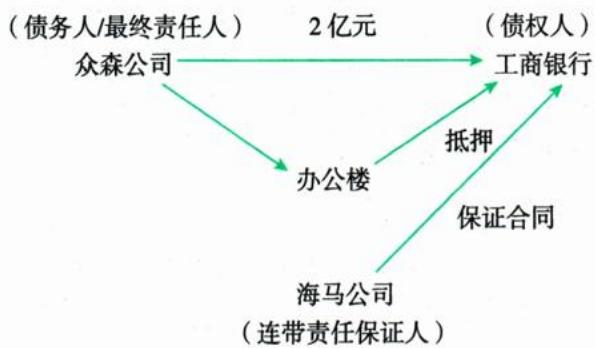

flowchart

```mermaid
graph TD
    A["众森公司"] -->|债务人/最终责任人 2亿元| B(债权人)
    A --> C["办公楼"]
    C -->|抵押| D["工商银行"]
    C -->|保证合同| E["海马公司 (连带责任保证人)"]
    D --> E
```

(连带债务人提供的物保和保证并存型混合担保)

[例] 众森公司向工商银行贷款2亿元。以自己的办公楼为该笔贷款提供抵押并办理了抵押登记（不动产抵押权依登记）手续。同时，海马公司提供连带责任保证（无顺序/无先诉抗辩权/或诉或裁或通知）。众森公司到期无力还款。

此时，债权人工商银行实现债权（执行时）是否有顺序？

第一步：有约从约。

被担保的债权既有物的担保又有人的担保的，债务人不履行到期债务或发生当事人约定的实现担保物权的情形，债权人应当按照约定实现债权。

第二步：债权人应当先就债务人提供的物保实现债权。

在混合担保中，如果债务人自己为债权人提供了“物的担保”（简称“物保”）与保证（简称“人保”）并存。则债权人应当先就债务人提供的物的担保实现债权。因为出于公平和成本的考量，如果在债务人自己提供了“物保”的情形下，债权人转而请求保证人承担保证责任，这对于保证人来说是不公平的。同时，如果债权人首先请求保证人承担保证责任，后续债务人也面临着担保人的追偿，这样便增加了成本，是不经济的。如果债权人没有先行就债务人的物的担保实现债权，保证人享有抗辩权（《民法典》第392条）。

##### [核心法条链接]

《民法典》第409条第2款 [抵押权的处分] 债务人以自己的财产设定抵押，抵押权人放弃该抵押权、抵押权顺位或者变更抵押权的，其他担保人在抵押权人丧失优先受偿权益的范围内免除担保责任，但是其他担保人承诺仍然提供担保的除外。

《民法典》第 435 条 [质权的处分] 质权人可以放弃质权。债务人以自己的财产出质，质权人放弃该质权的，其他担保人在质权人丧失优先受偿权益的范围内免除担保责任，但是其他担保人承诺仍然提供担保的除外。

2. 连带第三人提供的物保和保证（人保）并存。

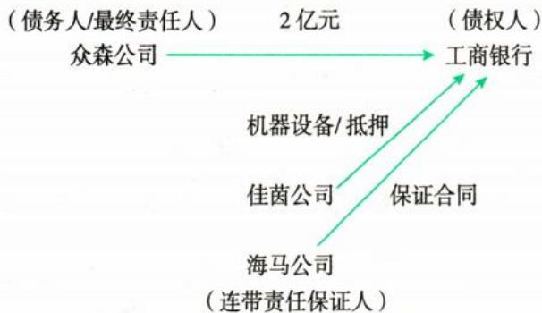

flowchart

```mermaid
graph TD
    A["众森公司"] -->|2亿元| B(债权人)
    B --> C["工商银行"]
    C -->|保证合同| D["海马公司"]
    D --> E["佳茵公司"]
    E --> F["机器设备/抵押"]
    F --> C
    style A fill:#f9f,stroke:#333
    style B fill:#ccf,stroke:#333
    style C fill:#cfc,stroke:#333
    style D fill:#fcc,stroke:#333
    style E fill:#cff,stroke:#333
    style F fill:#ffc,stroke:#333
```

(连带第三人提供的物保和保证并存型混合担保)

[例] 众森公司向工商银行贷款2亿元。佳茵公司以一台大型机器设备为该笔贷款提供抵押并办理了抵押登记（有内部效力有外部效力）手续。同时，海马公司提供连带责任保证（无顺序/无先诉抗辩权/或诉或裁或通知）。众森公司到期无力还款。此时，债权人工商银行实现债权是否有顺序？

答：无顺序。因为无论是佳茵公司还是海马公司均为担保人，均非最终责任人。基于公平考量，工商银行可以任意选择执行各担保人的财产。

#### (四) 共同担保人之间的内部追偿权

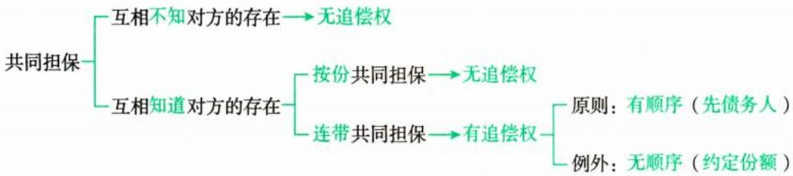

flowchart

```mermaid
graph TD
    A["共同担保"] --> B["互相不知对方的存在"]
    A --> C["互相知道对方的存在"]
    B --> D["无追偿权"]
    C --> E["按份共同担保"]
    C --> F["连带共同担保"]
    E --> G["无追偿权"]
    F --> H["有追偿权"]
    H --> I["原则：有顺序（先债务人）"]
    H --> J["例外：无顺序（约定份额）"]
```

(共同担保人之间的内部追偿权体系框架图)

为了避免循环追偿，同时也便于法院在相关纠纷中就第三人追偿问题直接作出裁判，减少当事人的诉累。共同担保人之间的内部追偿权规则如下：

1. 共同担保人互相不知对方的存在（“背对背”担保）。

在共同担保的情形下，担保人之间互相追偿的前提条件是互相有意思联络，即互相知道对方的存在，如互相不知对方的存在，则担保人之间无追偿权，承担了担保责任的担保人均向债务人（最终责任人）追偿（《民法典担保制度解释》第13条）。

2. 共同担保人互相知道对方的存在（“面对面”担保）。

(1) 担保人之间约定了追偿权。
(2) 连带共同担保。
(3) 各担保人在同一份合同书上签字、盖章或按指印。

#### >> 随堂练习

甲公司向乙公司借款1000万元，丙公司在借款协议“保证人”栏下盖章，但未载明保证方式，丁以自有房屋为该债务设立担保并办理抵押登记。借款到期后甲公司未偿还，乙公司拟向丙公司和丁主张权利。根据《民法典》，下列正确的是？（2020金题-2-1-29，任）①

A. 丙公司应按一般保证承担保证责任
B. 丁承担责任后，有权向丙公司追偿
C. 丁承担责任后，有权向甲公司追偿
D. 丙公司承担保证责任后，有权向甲公司追偿

[萌主点拨]
物的担保 VS 人的担保

<table><tr><td>事项</td><td>主体</td><td>内容</td><td>客体</td><td>担保范围</td><td>责任承担</td><td>优势</td><td>劣势</td><td>期间保护</td></tr><tr><td>物的担保</td><td>债务人或第三人</td><td>抵押权、质押权和留置权</td><td>不动产、动产和权利(特定财产)</td><td>6项</td><td>有限责任</td><td>优先受偿权(有顺序)</td><td>仅能对担保人的特定财产行使优先受偿权,对其他财产无权主张担保责任</td><td>抵押人受主债权诉讼时效期间(3年)的保护</td></tr><tr><td>人的担保</td><td>第三人</td><td>保证</td><td>信用/信誉(全部财产)</td><td>5项</td><td>无限责任</td><td>保证人的全部财产均为责任财产</td><td>无优先受偿权,仅为保证人的一般债权人(普通债权人)</td><td>受保证期间(6个月)和诉讼时效期间(3年)的双重保护</td></tr></table>

#### 八、反担保 $^{②}$

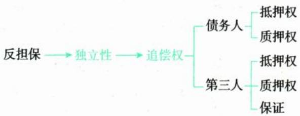

flowchart

```mermaid
graph LR
    A["反担保"] --> B["独立性"]
    B --> C["追偿权"]
    C --> D["债务人"]
    C --> E["第三人"]
    D --> F["抵押权"]
    D --> G["质押权"]
    E --> H["抵押权"]
    E --> I["质押权"]
    E --> J["保证"]
```

(反担保体系框架图)

① 答案：ACD。
② 考查 2 次且主观题亦会考查，《民法典》第 387、689 条以及《民法典担保制度解释》第 19 条共 3 条规定了反担保制度，重点关注。

很多同学一直非常困惑一个问题：既然债务人自己有财产可以提供担保，为什么不直接向债权人提供担保，而非要设立反担保呢？

请看如下例题来解开疑惑：

[例] 北京的孟某向江西的刘某借款2000万元，欲以山西的一套房屋提供抵押（房屋只能抵押/不动产抵押权依登记）担保。刘某不同意。孟某遂找到了山西的马某作保证人（马某对刘某提供的担保为本担保，马某为本担保人）。山西的马某担心承担保证责任后无法向孟某实现追偿权。此时，马某即可请求孟某提供反担保。反担保的方式有两种：

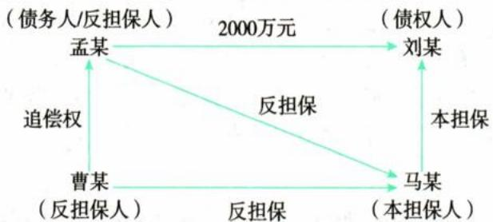

flowchart

```mermaid
graph TD
    A["孟某"] -->|2000万元| B["刘某"]
    A -->|追偿权| C["曹某 (反担保人)"]
    A -->|反担保| D["马某 (本担保人)"]
    B -->|本担保| D
    C -->|反担保| D
```

(反担保当事人法律关系示意图)

（1）马某可以请求孟某将山西的房屋抵押给自己提供反担保（孟某为反担保人/债务人自己提供反担保时，只能是抵押或质押）。

（2）马某可以请求孟某找第三人曹某为自己提供反担保（曹某为反担保人/第三人提供反担保时，可以是抵押、质押，也可以是保证）。

#### (一) 含义

反担保，又称“求偿担保”，是指债务人或第三人向担保人作出保证或设定物的担保，在担保人因履行债务或承担责任而遭受损失时，向担保人作出清偿。在反担保法律关系中存在担保合同和反担保合同两类合同，二者之间不存在主从关系是两个独立的合同，即反担保合同不是担保合同的从合同。

[萌主点拨]
担保合同和反担保合同

<table><tr><td>项目</td><td>担保合同</td><td>反担保合同</td></tr><tr><td>合同性质</td><td>书面合同</td><td>书面合同</td></tr><tr><td>担保的对象</td><td>债权人对债务人享有的债权</td><td>担保人承担民事责任后对债务人享有的追偿权</td></tr></table>

[例] 甲公司向乙公司借款2000万元用于扩大生产规模，北京妇产医院提供保证担保。丙公司为北京妇产医院提供反担保（保证合同）。此时存在如下三层民事法律关系：

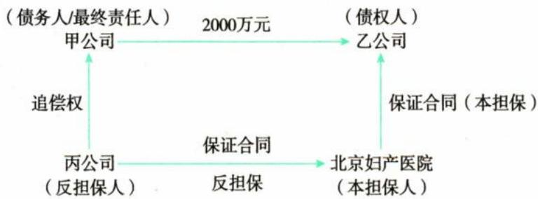

flowchart

```mermaid
graph TD
    A["甲公司"] -->|2000万元| B(债权人)
    B --> C["乙公司"]
    C -->|保证合同（本担保）| D["北京妇产医院（本担保人）"]
    D -->|保证合同 反担保| E["丙公司（反担保人）"]
    E -->|追偿权| A
    A --> F["(债务人/最终责任人)"]
```

(反担保当事人法律关系示意图)

反担保三层法律关系解构

<table><tr><td>层次</td><td>合同类型</td><td>合同当事人</td><td>合同性质</td><td>合同效力</td></tr><tr><td>第一层</td><td>借款合同</td><td>甲公司和乙公司</td><td>主合同</td><td>合法有效</td></tr><tr><td>第二层</td><td>本担保合同</td><td>北京妇产医院和乙公司</td><td>从合同</td><td>无效</td></tr><tr><td>第三层</td><td>反担保合同</td><td>北京妇产医院和丙公司</td><td>独立于本担保合同</td><td>合法有效</td></tr></table>

本案中，甲公司和乙公司之间的民间借贷合同合法有效。但是，北京妇产医院作为公益法人提供保证担保，因为违反法律的强制性规定而无效，依法应当承担债务人甲公司不能清偿部分不超过1/2的赔偿责任（缔约过失责任/补充责任）。北京妇产医院承担赔偿责任后，基于合法有效的反担保合同，有权在其承担赔偿责任的范围内请求反担保人丙公司承担保证担保责任。丙公司承担保证责任后，有权向甲公司追偿。

#### (二) 类型

反担保既可以设立人的担保（保证），也可以设立物的担保（抵押和质押）。根据反担保所采取的形式的不同，反担保包括三种类型：

#### 1. 求偿保证。

求偿保证，是指担保人在作出担保之后，担保人与反担保人之间约定，由反担保人以自己的信誉（信用）确保担保人对债务人追偿权的实现。此种担保中的反担保人只能是债务人以外的第三人。

#### 2. 求偿抵押。

求偿抵押，是指债务人或债务人以外的第三人以自己的财产作抵押，确保担保人追偿权实现的一种反担保。

#### 3. 求偿质押。

求偿质押，是指债务人或债务人以外的第三人以自己的财产提供质押，确保担保人追偿权实现的一种反担保。通说认为，留置和定金不可以为反担保方式。因为留置属于法定担保物权。基于货币的特殊性（占有即所有），定金亦不可以作为反担保的方式。

### 25 专题二十五 租赁合同

#### 复习提要

租赁合同规定在《民法典》第三编合同第二分编典型合同第十四章（第703—734条），共32条。本专题主要涉及八个问题：1. 租赁合同的基本原理；2. 出租人和承租人的义务；3. 承租人的权利；4. 转租；5. 无效租赁合同的情形和处理；6. 一房数租；7. 装饰装修和扩建；8. 不定期租赁合同。租赁合同每年必考，在备考过程中须牢牢掌握。租赁合同系最典型的束己合同，严守合同相对性原理。

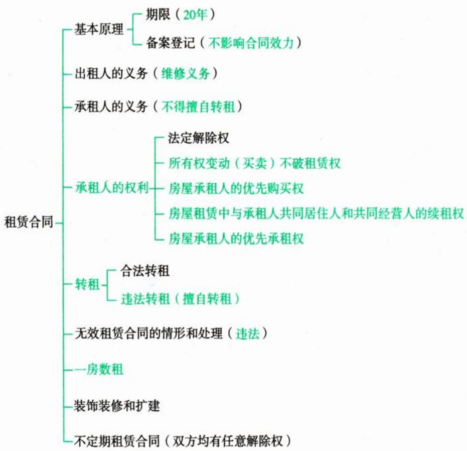

flowchart

```mermaid
graph TD
    A["租赁合同"] --> B["基本原理"]
    B --> C["期限（20年）"]
    B --> D["备案登记（不影响合同效力）"]
    A --> E["出租人的义务（维修义务）"]
    A --> F["承租人的义务（不得擅自转租）"]
    A --> G["承租人的权利"]
    G --> H["法定解除权"]
    G --> I["所有权变动（买卖）不破租赁权"]
    G --> J["房屋承租人的优先购买权"]
    G --> K["房屋租赁中与承租人共同居住人和共同经营人的续租权"]
    G --> L["房屋承租人的优先承租权"]
    A --> M["转租"]
    M --> N["合法转租"]
    M --> O["违法转租（擅自转租）"]
    A --> P["无效租赁合同的情形和处理（违法）"]
    A --> Q["一房数租"]
    A --> R["装饰装修和扩建"]
    A --> S["不定期租赁合同（双方均有任意解除权）"]
```

#### 一、基本原理

#### (一) 含义

租赁合同是出租人将租赁物交付承租人使用、收益，承租人支付租金的合同。

#### (二) 期限

租赁合同的最长租赁期限不得超过20年，超过20年的，超过部分无效。租赁期限届满，当事人可以续订租赁合同；但是，约定的租赁期限自续订之日起不得超过20年（《民法典》第705条）。

#### (三) 备案登记

当事人未依照法律、行政法规规定办理租赁合同登记备案手续的，不影响合同的效力（《民法典》第706条①）。

[萌主点拨] 备案登记（特定行政管理目的）不影响合同的效力并不是说合同得到行政机关的背书，合同就一定是有效的②。

#### (四) 形式

租赁期限不满6个月的，既可以采用书面形式，也可以采用口头形式。租赁期限6个月以上的，应当采用书面形式。租赁期限6个月以上，当事人未采用书面形式，无法确定租赁期限的，视为不定期租赁合同，双方均有任意解除权（《民法典》第707条）。

#### (五) 风险负担

因不可归责于承租人的事由，致使租赁物部分或全部毁损、灭失的，承租人可以请求减少租金或不支付租金；因租赁物部分或全部毁损、灭失，致使不能实现合同目的（根本违约）的，承租人可以解除合同（《民法典》第729条）。

[萌主点拨] 因不可抗力、意外事件等不可归责于出租人和承租人双方的原因造成租赁物毁损、灭失的，应由标的物的所有权人，即出租人承担风险。

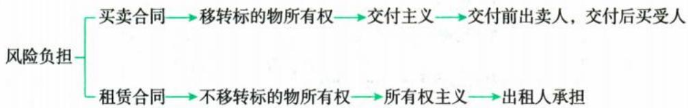

flowchart

```mermaid
graph TD
    A["风险负担"] --> B["买卖合同"]
    A --> C["租赁合同"]
    B --> D["移转标的物所有权"]
    D --> E["交付主义"]
    E --> F["交付前出卖人，交付后买受人"]
    C --> G["不移转标的物所有权"]
    G --> H["所有权主义"]
    H --> I["出租人承担"]
```

(租赁合同和买卖合同风险负担区别示意图)

#### 二、出租人和承租人的义务①

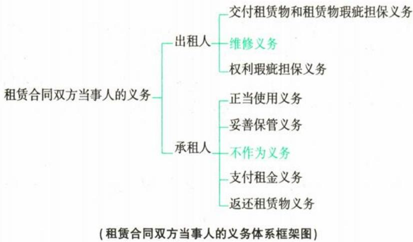

flowchart

```mermaid
graph TD
    A["租赁合同双方当事人的义务"] --> B["出租人"]
    A --> C["承租人"]
    B --> D["交付租赁物和租赁物瑕疵担保义务"]
    B --> E["维修义务"]
    B --> F["权利瑕疵担保义务"]
    C --> G["正当使用义务"]
    C --> H["妥善保管义务"]
    C --> I["不作为义务"]
    C --> J["支付租金义务"]
    C --> K["返还租赁物义务"]
```

#### （一）出租人的义务

1. 交付租赁物和租赁物瑕疵担保义务。

出租人应当按照约定将租赁物交付承租人，并在租赁期限内保持租赁物符合约定的用途。

2. 维修义务。

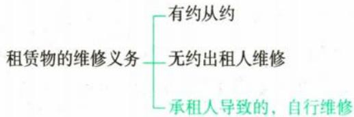

flowchart

```mermaid
graph TD
    A["租赁物的维修义务"] --> B["有约从约"]
    A --> C["无约出租人维修"]
    A --> D["承租人导致的，自行维修"]
```

(租赁物的维修义务体系框架图)

法律之所以规定出租人负有维修义务，是因为出租人负有租赁物的瑕疵担保义务，出租人对租赁物的维修义务，派生于出租人对租赁物的瑕疵担保责任。承租人在租赁物需要维修时可以请求出租人在合理期限内维修。出租人未履行维修义务的，承租人可以自行维修，维修费用由出租人负担。因维修租赁物影响承租人使用的，应当相应减少租金或延长租期（《民法典》第712条和第713条第1款）。

出租人负责对租赁物进行维修的前提是承租人按照约定的方法或租赁物的性质使用租赁物。如果因承租人的原因导致租赁物毁损，由出租人承担维修义务有失公平。因此，因承租人的过错致使租赁物需要维修的，出租人不承担维修义务，由承租人自行维修《民法典》第713条第2款）。

3. 权利瑕疵担保义务。

因第三人主张权利，致使承租人不能对租赁物使用、收益的，承租人可以请求减少租金或不支付租金。第三人主张权利的，承租人应当及时通知出租人。

#### （二）承租人的义务

#### 1. 正当使用义务。

承租人应当按照约定的方法或根据租赁物的性质使用租赁物。承租人未按照约定的方法或根据租赁物的性质使用租赁物，致使租赁物受到损失的，出租人可以解除合同并请求赔偿损失。承租人擅自变动房屋建筑主体和承重结构或扩建，在出租人要求的合理期限内仍不予恢复原状，出租人请求解除合同并要求赔偿损失的，法院依照《民法典》第711条的规定处理。

#### 2. 妥善保管义务。

承租人应当妥善保管租赁物，因保管不善造成租赁物毁损、灭失的，应当承担赔偿责任。

#### 3. 不作为义务。

#### (1) 禁止添附。

承租人经出租人同意，可以对租赁物进行改善或增设他物。承租人未经出租人同意，对租赁物进行改善或增设他物的，出租人可以请求承租人恢复原状或赔偿损失。

#### (2) 禁止转租。

承租人经出租人同意，可以将租赁物转租给第三人。承租人转租的，承租人与出租人之间的租赁合同继续有效；第三人造成租赁物损失的，承租人应当赔偿损失。承租人未经出租人同意转租的（根本违约），出租人可以解除合同。承租人经出租人同意将租赁物转租给第三人，转租期限超过承租人剩余租赁期限的，超过部分的约定对出租人不具有法律约束力，但是出租人与承租人另有约定的除外。

#### 4. 支付租金义务。

租金是承租人因对出租人提供租赁物进行使用、收益而支付的对价。

#### (1) 租金支付期限。

承租人应当按照约定的期限支付租金。对支付租金的期限没有约定或约定不明确，依据《民法典》第510条的规定仍不能确定，租赁期限不满1年的，应当在租赁期限届满时支付；租赁期限1年以上的，应当在每届满1年时支付，剩余期限不满1年的，应当在租赁期限届满时支付。

#### (2) 欠付租金的处理。

承租人无正当理由未支付或迟延支付租金的，出租人可以请求承租人在合理期限内支付（法定催告义务）；承租人逾期不支付的（根本违约），出租人可以解除合同。

#### 5. 返还租赁物义务。

租赁期限届满，承租人应当返还租赁物。返还的租赁物应当符合按照约定或根据租赁物的性质使用后的状态。

#### 三、承租人的权利①

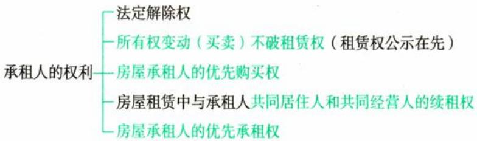

flowchart

```mermaid
graph TD
    A["承租人的权利"] --> B["法定解除权"]
    A --> C["所有权变动（买卖）不破租赁权（租赁权公示在先）"]
    A --> D["房屋承租人的优先购买权"]
    A --> E["房屋租赁中与承租人共同居住人和共同经营人的续租权"]
    A --> F["房屋承租人的优先承租权"]
```

(承租人的权利体系框架图)

#### (一) 法定解除权

《民法典》第 724、729、731 条共 3 条规定了租赁合同的法定解除权制度。

1. 有下列情形之一，非因承租人原因致使租赁物无法使用的，承租人可以解除合同：

(1) 租赁物被司法机关或行政机关依法查封、扣押；
(2) 租赁物权属有争议；
(3) 租赁物具有违反法律、行政法规关于使用条件的强制性规定情形。
2. 因不可归责于承租人的事由，致使租赁物部分或全部毁损、灭失的，承租人可以请求减少租金或不支付租金；因租赁物部分或全部毁损、灭失，致使不能实现合同目的的，承租人可以解除合同。
3. 租赁物危及承租人的安全或健康的，即使承租人订立合同时明知该租赁物质量不合格，承租人仍然可以随时解除合同。

#### （二）所有权变动（买卖）不破租赁权

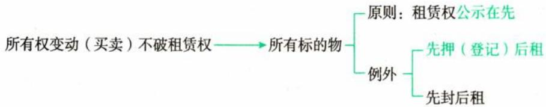

flowchart

```mermaid
graph TD
    A["所有权变动（买卖）不破租赁权"] --> B["所有标的物"]
    B --> C["原则：租赁权公示在先"]
    B --> D["例外"]
    D --> E["先押（登记）后租"]
    D --> F["先封后租"]
```

(所有权变动/买卖不破租赁体系框架图)

所有权变动（买卖）不破租赁

<table><tr><td>含义</td><td>租赁物在承租人按照租赁合同占有期限内发生所有权变动的,不影响租赁合同的效力</td></tr><tr><td>对象</td><td>适用于所有的租赁合同,不区分不动产租赁和动产租赁,一律适用“买卖不破租赁”的原则。[萌主点拨]“买卖不破租赁”中的“买卖”应当作扩张解释,不仅包括买卖这种典型的转移租赁物所有权的形式,也包括赠与、继承、互换、出资等其他导致所有权变动的行为</td></tr><tr><td>原则</td><td>公示在先原则</td></tr><tr><td rowspan="2">例外</td><td>先押(登记)后租。在出租前已设立抵押权,因抵押权人实现抵押权发生所有权变动的</td></tr><tr><td>先封后租。在出租前已被法院依法查封的</td></tr></table>

#### >> 随堂练习

甲公司与乙公司签订租赁合同，约定将一台机器出租给乙公司，并于一周后交付。租赁合同成立次日，甲公司就同一台机器与丙公司订立买卖合同，依合同约定以占有改定方式进行交付。一周后，甲公司将机器交给乙公司使用，并按照约定收取押金若干。关于本案，下列选项正确的是？（2022金题-2-1-23，多）①

A. 适用买卖不破租赁规则
B. 不适用买卖不破租赁规则
C. 丙公司已取得机器所有权
D. 乙公司有权请求甲公司承担违约责任，返还押金

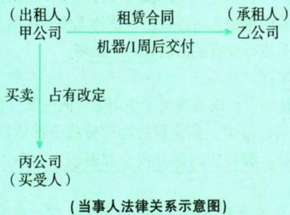

flowchart

```mermaid
graph TD
    A["甲公司"] -->|买卖 占有改定| B["丙公司 (买受人)"]
    A -->|租赁合同 机器/1周后交付| C["乙公司"]
    C --> D["承租人"]
    B -->|（当事人法律关系示意图）| E["结束"]
```

#### （三）房屋承租人的优先购买权

《民法典》第726—728条共3条规定了房屋承租人的优先购买权制度。

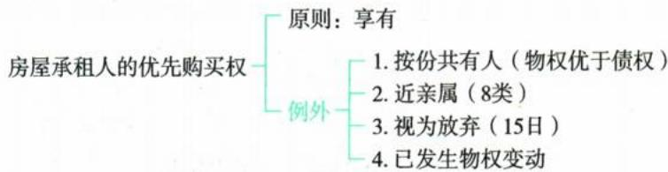

flowchart

```mermaid
graph TD
    A["房屋承租人的优先购买权"] --> B["原则：享有"]
    A --> C["例外"]
    C --> D1["1. 按份共有人（物权优于债权）"]
    C --> D2["2. 近亲属（8类）"]
    C --> D3["3. 视为放弃（15日）"]
    C --> D4["4. 已发生物权变动"]
```

(房屋承租人的优先购买权体系框架图)

#### 1. 对象。

为保护房屋承租人的居住利益，仅限于房屋的承租人享有优先购买权。法律确立房屋承租人的优先购买权，一方面体现了对租赁关系中相对弱势一方的承租人的保护，另一方面也体现了维护因承租人使用、收益租赁房屋而形成稳定的生产生活秩序的必要。

#### 2. 例外。

(1) 房屋共有人行使优先购买权。

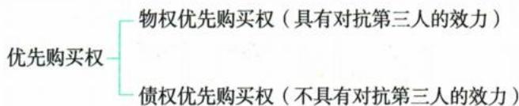

flowchart

```mermaid
graph TD
    A["优先购买权"] --> B["物权优先购买权（具有对抗第三人的效力）"]
    A --> C["债权优先购买权（不具有对抗第三人的效力）"]
```

(民法上优先购买权的体系框架图)

共有人优先购买权源于物权关系而发生，具有物权效力（可以对抗第三人）。而房屋承租人优先购买权源于房屋租赁合同关系而发生，仅具有债权效力。基于物权优于债权（物权的优先效力）的原则，共有人优先购买权自然优先于承租人的优先购买权。房屋承租人优先购买权的立法目的系保护房屋承租人的居住利益。实践中，实际居住在房屋中的系次承租人而非承租人。因此，次承租人的优先购买权优先于承租人。

[萌主点拨] 按份共有人>次承租人>承租人。

[例] 孟某、马某按 $20\%$ 和 $80\%$ 的份额共有一间房屋。二人将房屋出租给曹某，曹某取得孟某和马某的同意后将该房屋转租给徐某。现孟某欲转让自己的份额。马某、曹某、徐某优先购买的顺序为：马某>徐某>曹某。

(2) 出租人将房屋出卖给近亲属（8类）。

出租人向与其有法律上特定身份关系的第三人出卖特定财产的，可以阻却承租人优先购买权的行使。这种特定身份关系即法律所规定的近亲属关系。出租人将租赁物出卖给近亲属，不仅有经济利益上的考虑，往往也会有情感因素掺杂其中，带有浓厚的身份属性和感情色彩。

[萌主点拨] 8 类近亲属包括：配偶、父母、子女、兄弟姐妹、祖父母、外祖父母、孙子女、外孙子女。

（3）出租人履行通知义务（诚信原则）后，承租人在15日内未明确表示购买的，视为承租人放弃优先购买权。

(4) 第三人善意购买租赁房屋并已经办理登记手续（已发生物权变动）。

#### 3. 放弃。

出租人委托拍卖人拍卖租赁房屋的，应当在拍卖5日前通知承租人。承租人未参加拍卖的，视为放弃优先购买权。拍卖是特殊形式的买卖，是指以公开竞价的形式，将特定物品或财产权利转让给最高应价者的买卖方式。拍卖对于实现拍卖物价值和资源利用最大化、促进公平交易具有积极意义。

#### 4. 救济。

出租人未通知承租人或有其他妨害承租人行使优先购买权情形的，承租人可以请求出租人承担损害赔偿责任。但是，出租人与第三人订立的房屋买卖合同的效力不受影响。出租人妨害承租人行使优先购买权，是针对承租人优先购买权的侵权行为，应当承担赔偿责任。

#### >> 随堂练习

甲与乙订立房屋租赁合同，约定租期5年。半年后，甲将该出租房屋出售给丙，但未通知乙。不久，乙以其房屋优先购买权受侵害为由，请求法院判决甲丙之间的房屋买卖合同无效。下列哪一表述是正确的？(2013-3-10，单)①

A. 甲出售房屋无须通知乙
B. 丙有权根据善意取得规则取得房屋所有权
C. 甲侵害了乙的优先购买权，但甲丙之间的合同有效
D. 甲出售房屋应当征得乙的同意

#### (四) 房屋租赁中与承租人共同居住人和共同经营人的续租权①

#### 1. 范围。

共同居住人，是指在承租人生前与其共同生活、居住于租赁房屋的人，且其共同生活、居住状态应持续至承租人死亡时。共同居住人限于自然人，范围包括但不限于与承租人有继承关系的亲属，还包括其他社会关系，如未婚同居者。

共同经营人的范围包括个人合伙、个体工商户以及法人和非法人组织。

#### 2. 行权。

共同居住人和共同经营人续租权的行权主体必须是本人，不能转由第三人行使。同时，必须按照原租赁合同的条件继续履行合同。

#### (五) 房屋承租人的优先承租权 $^{②}$

#### 1. 含义。

房屋承租人的优先承租权，是指承租人依法享有的，在租赁期限届满后以同等条件优先承租原租赁物的权利。

#### 2. 行使条件。

房屋承租人的优先承租权的行使需要同时满足4个条件：（1）存在合法有效的租赁关系；（2）出租人继续出租房屋；（3）满足同等条件；（4）在合理期限内主张。出租人在租赁期限届满并有意愿继续出租房屋时，应当通过适当方式将此信息通知承租人（诚信原则），并给予承租人合理期限作出决定。

#### 四、转租③

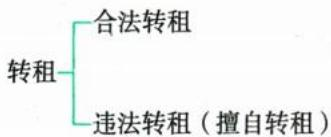

flowchart

```mermaid
graph TD
    A["转租"] --> B["合法转租"]
    A --> C["违法转租（擅自转租）"]
```

(转租体系框架图)

转租，是指出租人将租赁房屋租给承租人，承租人又把承租房屋租给次承租人的租赁法律关系，前一租赁关系叫本租，后一租赁关系叫转租，形成转租，本租须成立且有效。如承租人将租赁权利义务完全转让给第三人，自己退出租赁关系，直接由第三人和出租人建立租赁关系，就不是转租，而是房屋租赁合同的债权债务概括转移。

#### （一）经过出租人同意的转租（合法转租）

合法转租

<table><tr><td>含义</td><td>经过出租人同意的转租</td></tr><tr><td rowspan="2">法律后果</td><td>原租赁合同继续有效。承租人转租的,承租人与出租人之间的租赁合同继续有效;第三人造成租赁物损失的,承租人应当赔偿损失</td></tr><tr><td>超期转租。承租人经出租人同意将租赁物转租给第三人,转租期限超过承租人剩余租赁期限的,超过部分的约定对出租人不具有法律约束力(相对无效说/一方不能把自己不享有的权利转给第三方),但是出租人与承租人另有约定的除外</td></tr></table>

[例] 2024年3月2日，孟某将自己的房屋出租（负担行为/仅发生债权债务关系/不发生物权变动/专属管辖）给马某，租期5年，月租金1万元。1年后，马某经过孟某同意将房屋转租给曹某，租期4年，月租金1.5万元。2025年3月6日，曹某擅自将房屋的一堵墙拆除。3月10日，孟某发现曹某拆墙一事，产生纠纷。根据上述案情及示意图，请回答如下问题：

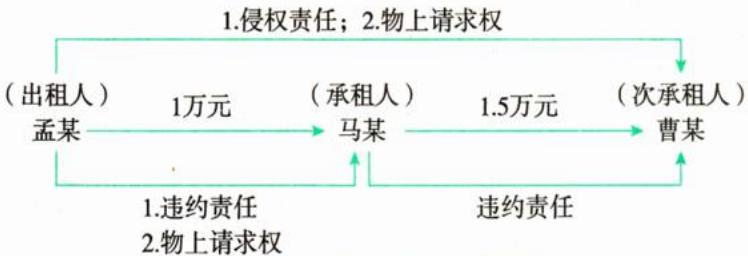

flowchart

```mermaid
graph TD
    A["(出租人) 孟某"] -->|1万元| B["(承租人) 马某"]
    B -->|1.5万元| C["(次承租人) 曹某"]
    A -->|1.违约责任 2.物上请求权| B
    B -->|违约责任| C
    D["1.侵权责任；2.物上请求权"] --> B
```

##### (合法转租当事人法律关系示意图)

①孟某同意马某将房屋转租给曹某后，可否向马某每月收取1.5万元租金？为什么？

答：不可以。因为基于合同相对性原理（束己合同），孟某和马某之间的租赁合同月租金为1万元。因此，孟某不可以向马某每月收取1.5万元租金。

②孟某同意马某将房屋转租给曹某后，马某每月多收的5000元差价租金是否构成不当得利？为什么？

答：不构成。因为马某经过孟某同意，存在约定的原因。因此，不构成不当得利。

③如马某欠付孟某2个月租金2万元，孟某欲解除与马某的房屋租赁合同。曹某如何救济自己的权利？

答：曹某可以请求代马某支付欠付的租金。承租人拖欠租金的，次承租人可以代承租人支付其欠付的租金和违约金，但是转租合同对出租人不具有法律约束力的除外。次承租人代为支付的租金和违约金，可以充抵次承租人应当向承租人支付的租金；超出其应付的租金数额的，可以向承租人追偿（《民法典》第719条/第三人代为履行抗辩权）。

④如孟某欲直接起诉曹某，其有几种选择？分别是什么？

答：3 种选择，分别是侵权责任、物上请求权（恢复原状）、侵权责任和物上请求权（恢复原状/债权请求权和物权请求权可以并用）。

⑤如孟某欲起诉马某，其有几种选择？分别是什么？

答：3种选择，分别是违约责任、物上请求权（恢复原状）、违约责任和物上请求权（恢复原状/债权请求权和物权请求权可以并用）。

⑥马某承担责任后，可以向曹某主张何种民事责任？为什么？

答：违约责任。因为二者存在合法有效的转租合同。

#### （二）未经出租人同意的转租（违法转租或擅自转租）

违法转租（擅自转租）

<table><tr><td>含义</td><td>承租人未经出租人同意,将租赁物转租给第三人,又称擅自转租</td></tr><tr><td>法律后果</td><td>在承租人擅自转租的情况下,出租人可以行使合同解除权,解除其与承租人的租赁合同(合同相对性原理)</td></tr><tr><td>异议期间</td><td>出租人知道或应当知道承租人转租,但是在6个月内未提出异议的,视为出租人同意转租</td></tr></table>

[例] 2024年3月2日，孟某将自己的房屋出租（负担行为/仅发生债权债务关系/不发生物权变动/专属管辖）给马某，租期5年，月租金1万元。1年后，马某擅自将房屋转租给曹某。租期4年，月租金1.5万元。2025年3月6日，曹某擅自将房屋的一堵墙拆除。3月10日，孟某发现曹某拆墙一事，欲请求曹某搬离房屋。根据上述案情及示意图，请回答如下问题：

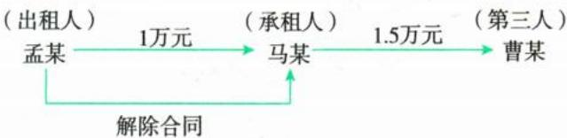

flowchart

```mermaid
graph TD
    A["孟某"] -->|1万元| B["马某"]
    B -->|1.5万元| C["曹某"]
    D["(出租人)"] --> A
    E["(承租人)"] --> B
    F["(第三人)"] --> C
    G["解除合同"] --> A
```

(擅自转租当事人法律关系示意图)

①孟某是否有权解除与马某的租赁合同？为什么？

答：有权。因为承租人未经出租人同意转租的，构成根本违约，出租人可以解除合同（《民法典》第716条）。

②孟某欲解除与马某的租赁合同，应当在何时行权？

答：自知道或应当知道转租事由之日起6个月（除斥期间）内。因为出租人知道或应当知道承租人转租，但是在6个月内未提出异议的，视为出租人同意转租（《民法典》第718条）。

③孟某解除与马某的租赁合同后，是否可以请求曹某搬离（返还原物请求权）房屋？

答：可以。因为完全符合返还原物请求权（物权请求权）的两项构成要件：孟某系房屋的所有权人；曹某对房屋的占有系无权占有（《民法典》第235条/注意：诉的重叠/选择合并）。

④孟某解除与马某的租赁合同后，如曹某逾期腾房，孟某应如何救济自己的权利？

答：孟某可以在两项债权请求权之间择一选择：第一，请求曹某支付逾期腾房的占有使用费（不当得利）。第二，请求曹某承担侵权责任。

⑤孟某解除与马某的租赁合同后，曹某应如何救济自己的权利？

答：追究马某的违约责任。

#### 五、无效租赁合同的情形和处理①

#### (一) 情形

出租人就未取得建设工程规划许可证或未按照建设工程规划许可证的规定建设的房屋，与承租人订立的租赁合同无效。但在一审法庭辩论终结前取得建设工程规划许可证或经主管部门批准建设的，法院应当认定有效。

出租人就未经批准或未按照批准内容建设的临时建筑，与承租人订立的租赁合同无效。但在一审法庭辩论终结前经主管部门批准建设的，法院应当认定有效。租赁期限超过临时建筑的使用期限，超过部分无效。但在一审法庭辩论终结前经主管部门批准延长使用期限的，法院应当认定延长使用期限内的租赁期间有效。

#### (二) 处理

房屋租赁合同无效，当事人请求参照合同约定的租金标准支付房屋占有使用费的（主张租金的前提条件是租赁合同合法有效/理论基础为不当得利），法院一般应予支持。

#### >> 随堂练习

居民甲经主管部门批准修建了一排临时门面房，核准使用期限为2年，甲将其中一间租给乙开餐馆，租期2年。期满后未办理延长使用期限手续，甲又将该房出租给了丙，并签订了1年的租赁合同。因租金问题，发生争议。下列哪些选项是正确的？(2017-3-60，多) $^{①}$

A. 甲与乙的租赁合同无效
B. 甲与丙的租赁合同无效
C. 甲无权将该房继续出租给丙
D. 甲无权向丙收取该年租金

#### 六、一房数租 $^{②}$

一房数租

<table><tr><td>合同效力</td><td>均合法有效</td></tr><tr><td>排序</td><td>合法占有者&gt;登记备案者&gt;合同成立在先者(类似特殊动产的一物数卖)</td></tr><tr><td>处理</td><td>对于没有履行的其他有效租赁合同的承租人,由于合同目的无法实现,承租人可以解除合同,同时请求出租人承担违约责任赔偿自己所遭受的损失</td></tr></table>

##### 随堂练习

柳某欲出租房屋，于2016年5月与孟某签订合同A，租期1年，孟某随即入住。2016年9月柳某又与马某签订合同B，租期1年，柳某与马某办理了备案登记手续。请问下列哪些选项是正确的？(2019金题-2-1-16，多)③

A. 孟某因合法占有而具有优先权
B. A 合同虽然未经备案登记，但仍然有效
C. A 合同因成立在先而有优先权
D. B 合同因备案而具有优先权

#### 七、装饰装修和扩建 $^{①}$

#### (一) 装饰装修

#### 1. 经出租人同意。

承租人经出租人同意，可以对租赁物进行改善或增设他物（添附/如在房屋里安装空调或在汽车里安装音响设备）。

##### [萌主点拨] 费用处理

(1) 有约从约；
(2) 无约, 不得请求出租人补偿 (承租人经出租人同意装饰装修, 租赁期间届满时, 承租人请求出租人补偿附合装饰装修费用的, 不予支持。但当事人另有约定的除外)。

#### 2. 未经出租人同意。

承租人未经出租人同意，对租赁物进行改善或增设他物的，出租人可以请求承租人恢复原状或赔偿损失。

#### (二) 扩建

#### 1. 经出租人同意。

承租人经出租人同意扩建，但双方对扩建费用的处理没有约定的，法院按照下列情形分别处理：

（1）办理合法建设手续的，扩建造价费用由出租人负担；
(2) 未办理合法建设手续的，扩建造价费用由双方按照过错分担。

#### 2. 未经出租人同意。

承租人未经出租人同意扩建发生的费用，由承租人负担。出租人请求承租人恢复原状或赔偿损失的，法院应予支持。

#### >> 随堂练习

甲将其临街房屋和院子出租给乙作为汽车修理场所。经甲同意，乙先后两次自费扩建多间房屋作为烤漆车间。乙在又一次扩建报批过程中发现，甲出租的全部房屋均未经过城市规划部门批准，属于违章建筑。下列哪些选项是正确的？(2015-3-59，多)②

A. 租赁合同无效
B. 因甲、乙对于扩建房屋都有过错，应分担扩建房屋的费用
C. 因甲未告知乙租赁物为违章建筑，乙可解除租赁合同
D. 乙可继续履行合同，待违章建筑被有关部门确认并影响租赁物使用时，再向甲主张违约责任

#### 八、不定期租赁合同①

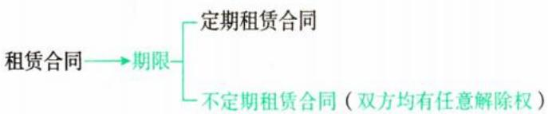

flowchart

```mermaid
graph LR
    A["租赁合同"] --> B["期限"]
    B --> C["定期租赁合同"]
    B --> D["不定期租赁合同（双方均有任意解除权）"]
```

(租赁合同分类体系框架图)

#### (一) 含义

不定期租赁合同，是指没有约定租期或对租期约定不明，并且在事后也不能通过协商确定租期的租赁合同。

#### (二) 情形

1. 租赁期限6个月以上的，应当采用书面形式。当事人未采用书面形式，无法确定租赁期限的，视为不定期租赁。

[例] 孟某与马某口头约定将一处门面房租给马某，租期2年，租金每月1万元。合同履行1年后，马某向孟某提出能否转租给曹某，孟某表示同意。马某遂与曹某达成租期1年、月租金2万元的口头协议。曹某接手后，擅自拆除了门面房隔墙，孟某得知后欲收回房屋。孟某与马某之间的租赁合同不属于不定期租赁合同。因为租赁期限可以确定，即2年。

2. 当事人对租赁期限没有约定或约定不明确，依据《民法典》第510条的规定仍不能确定的，视为不定期租赁。当事人可以随时解除合同，但是应当在合理期限之前通知对方。

3. 租赁期限届满，承租人继续使用租赁物，出租人没有提出异议的（法定更新/默示更新/默许续租/行为），原租赁合同继续有效，但是租赁期限为不定期。

#### (三) 行权

当事人可以随时解除合同（任意解除权/无期限则无预期），但是应当在合理期限之前通知（简单形成权/诚信原则）对方。

### 26 专题二十六 融资租赁合同

#### 复习提要

融资租赁合同规定在《民法典》第三编合同第二分编典型合同第十五章（第735—760条），共26条。本专题主要涉及四个问题：1. 融资租赁合同的含义；2. 融资租赁合同的效力；3. 融资租赁合同的特征；4. 租赁物的归属。融资租赁合同的学习宜采“对比学习法”，即融资租赁合同和普通的买卖合同有何不同？融资租赁合同和普通的租赁合同有何不同？同时，辅之以“案例教学法”。二者结合，该类理解难度较大的合同即可学好。

融资租赁合同→融资+融物→当事人
3方→传统型融资租赁合同→真正利他合同
2方→售后回租型融资租赁合同→占有改定

传统型融资租赁合同（真正利他合同）①

[例] 众森公司系2025年3月2日在北京市昌平区注册成立的房地产开发公司，欲在北京市海淀区开发一楼盘，一期工程预计开发45栋花园式洋房和45栋别墅。但由于资金困难无法直接购买施工中需要的挖掘机。经人介绍，众森公司找到了北京国资融资租赁公司（以下简称国资租赁公司）。国资租赁公司根据众森公司的选择，向大型机器设备销售商三一重工公司购买90台挖掘机，价款5000万元，出租给众森公司使用。根据上述案情及示意图，请回答如下问题：

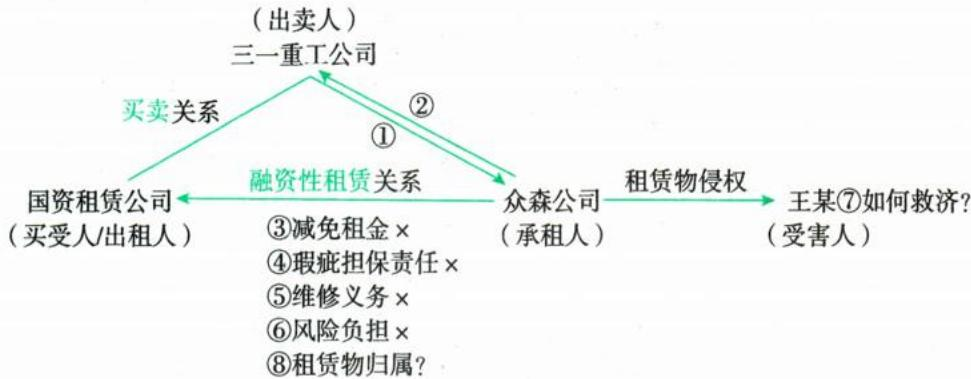

flowchart

```mermaid
graph TD
    A["三一重工公司"] -->|①| B["众森公司 (承租人)"]
    A -->|②| B
    A -->|买卖关系| C["国资租赁公司 (买受人/出租人)"]
    B -->|融资租赁关系| C
    B -->|租赁物侵权| D["王某⑦如何救济? (受害人)"]
    C -->|③减免租金× ④瑕疵担保责任× ⑤维修义务× ⑥风险负担× ⑧租赁物归属?| B
    D -->|（出卖人）| A
```

(传统型融资租赁合同当事人法律关系示意图)

①国资租赁公司与三一重工公司签订90台挖掘机买卖合同后，三一重工公司应当将挖掘机交付给谁？

答：直接交付给众森公司（向第三人履行的合同）。因为出租人根据承租人对出卖人、租赁物的选择订立的买卖合同，出卖人应当按照约定向承租人交付标的物，承租人享有与受领标的物有关的买受人的权利。

②众森公司在90台挖掘机安装完毕后，发现有2台不能正常运行，众森公司应当如何处理？

答：基于挖掘机质量瑕疵而直接向三一重工公司索赔（违约责任），请求三一重工公司修理（补救措施/真正利他合同/第三人享有独立的请求权）。因为出租人、出卖人、承租人可以约定，出卖人不履行买卖合同义务的，由承租人行使索赔的权利。承租人行使索赔权利的，出租人应当协助。

③半年后，又有2台挖掘机不能正常运转。众森公司可否请求国资租赁公司承担违约责任？

答：不可以。因为租赁物不符合约定或不符合使用目的的，出租人不承担责任。但是，承租人依赖出租人的技能确定租赁物或出租人干预选择租赁物的除外。

④半年后，又有2台挖掘机不能正常运转。众森公司可否请求国资租赁公司承担维修义务？

答：不可以。因为承租人应当妥善保管、使用租赁物。承租人应当履行占有租赁物期间的维修义务。据此可知，在融资租赁合同中，作为出租人的国资租赁公司并不负维修义务。

⑤半年后，又有2台挖掘机不能正常运转。众森公司在自行维修2台挖掘机期间，是否需要依约支付租金？

答：需要。因为承租人对出卖人行使索赔权利，不影响其履行支付租金的义务。但是，承租人依赖出租人的技能确定租赁物或出租人干预选择租赁物的，承租人可以请求减免相应租金。

⑥如在众森公司施工过程中，当地发生地震（不可抗力一定是风险）导致其中10台挖掘机毁损、灭失的，该风险由谁来负担？

答：众森公司。因为承租人占有租赁物期间，租赁物毁损、灭失的，出租人有权请求承租人继续支付租金，但是法律另有规定或当事人另有约定的除外。

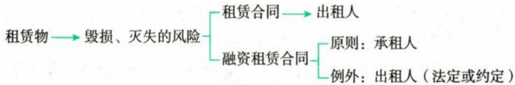

flowchart

```mermaid
graph TD
    A["租赁物"] --> B["毁损、灭失的风险"]
    B --> C["租赁合同"]
    C --> D["出租人"]
    B --> E["融资租赁合同"]
    E --> F["原则：承租人"]
    E --> G["例外：出租人（法定或约定）"]
```

#### (租赁合同中租赁物毁损、灭失风险承担体系框架图)

⑦如众森公司在施工过程中，挖掘机上的零部件坠落砸伤（侵权/物件损害责任）王某，花去医药费2000元，王某应当向谁主张权利？

答：众森公司。因为承租人占有租赁物期间，租赁物造成第三人的人身损害或财产损失的，出租人不承担责任。

⑧租期届满后，如国资租赁公司和众森公司关于挖掘机归属没有约定的，如何处理？

答：归国资租赁公司所有。因为出租人和承租人可以约定租赁期限届满租赁物的归属。对租赁物的归属没有约定或约定不明确，依据《民法典》第510条的规定仍不能确定的，租赁物的所有权归出租人。

⑨如国资租赁公司和众森公司约定：租期届满，众森公司仅需向国资租赁公司支付2万元象征性价款即可。租期届满后，挖掘机归谁所有？

答：归众森公司所有。因为当事人约定租赁期限届满，承租人仅需向出租人支付象征性价款的，视为约定的租金义务履行完毕后租赁物的所有权归承租人（《民法典》第759条）

#### 售后回租型融资租赁合同（占有改定） $^{①}$

[例] 甲公司为一家民营私立妇产医院（营利法人/公司）。乙公司为某银行下属全资融资租赁公司。2022年3月2日，甲公司为经营需要，拟以回租方式向乙公司申请一笔360万元的融资租赁款，甲公司将自己的1台大型B超机作为租赁物折价360万元，租期3年，月租金15万元，办理完成该笔业务。但双方未前往中国人民银行征信中心办理融资租赁登记（未经登记，不得对抗善意第三人）。根据上述案情及示意图，请回答如下问题：

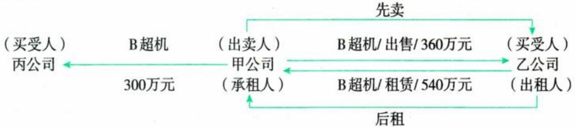

flowchart

```mermaid
graph LR
    A["丙公司"] -->|300万元| B["甲公司"]
    B -->|B超机/出租/360万元| C["乙公司"]
    C -->|B超机/租赁/540万元| B
    B -->|承租人| D["买受人"]
    D -->|先卖| B
    B -->|后租| C
```

#### (售后回租型融资租赁合同当事人法律关系示意图)

①甲公司和乙公司之间系何种民事法律关系？

答：融资租赁合同关系。因为承租人将其自有物出卖给出租人，再通过融资租赁合同将租赁物从出租人处租回的，承租人和出卖人系同一人不影响融资租赁合同的成立。

[萌主点拨] 售后回租型融资租赁合同

承租人将其自有物出卖给出租人，再通过融资租赁合同将租赁物从出租人处租回的，承租人和出卖人系同一人不影响融资租赁合同的成立（《融资租赁合同解释》第2条）。

②融资租赁合同是诺成性合同还是实践性合同？

答：诺成性合同。

[萌主点拨] 实践性合同共4个，2个与钱有关，定金合同和自然人之间的借款合同；2个与物有关，保管合同和借用合同。

③事后查明，甲公司并不存在 B 超机，属于虚构租赁物。甲公司和乙公司之间的融资租赁合同效力如何？

答：无效。因为融资租赁合同的立法功能之一就是金融服务实体，因此，虚构租赁物的，融资租赁合同无效（《民法典》第737条）。

[萌主点拨] 欲成立售后回租型融资租赁合同关系，承租人应当将标的物所有权移转给出租人，若标的物系虚构，出租人未取得所有权，售后回租型融资租赁合同关系即无法成立。若出租人已经支付名义上购买标的物的“价款”，则由于当事人之间仅有资金的流动，因此，应当认定为借贷合同关系。

④事后查明，乙公司并不存在医疗器械经营许可证（行政许可）。甲公司和乙公司之间的融资租赁合同效力如何？

答：合法有效。因为依照法律、行政法规的规定，对于租赁物的经营使用应当取得行政许可的，出租人未取得行政许可不影响融资租赁合同的效力（《民法典》第738条）。

⑤如甲公司不按期给付租金，经催告后仍不履行的（法定催告义务），乙公司如何救济自己的权利？

答：出租人乙公司可以请求支付全部租金（加速到期）；也可以解除合同，收回租赁物（《民法典》第752条）。

⑥4月21日，甲公司将B超机以300万元的价格出卖给不知情的丙公司的行为是有权处分还是无权处分？

答：无权处分。因为无权处分是指以自己的名义处分他人或共有的财产。

⑦4月21日，甲公司和丙公司签订的B超机买卖合同效力如何？

答：合法有效。因为无权处分的买卖合同合法有效。

⑧4月21日，甲公司将B超机以300万元的价格出卖给不知情的丙公司并交付（现实交付）。丙公司是继受取得还是善意取得B超机的所有权？

答：善意取得（《民法典》第311条）。

⑨5月10日，因甲公司未按期给付租金，乙公司发现甲公司出卖租赁物一事后，可否请求丙公司返还B超机？

答：不可以。因为出租人对租赁物享有的所有权，未经登记，不得对抗善意第三人（《民法典》第745条）。

#### 一、含义

融资租赁合同是出租人根据承租人对出卖人、租赁物的选择，向出卖人购买租赁物，提供给承租人使用，承租人支付租金的合同。

#### 二、效力

当事人以虚构租赁物方式订立的融资租赁合同无效。依照法律、行政法规的规定，对于租赁物的经营使用应当取得行政许可的，出租人未取得行政许可不影响融资租赁合同的效力。

#### 三、特征

#### (一) 不同于买卖

出租人根据承租人对出卖人、租赁物的选择订立的买卖合同，出卖人应当按照约定向承租人（而非作为买受人的出租人）直接交付标的物，承租人享有与受领标的物有关的买受人的权利。出租人、出卖人、承租人可以约定，出卖人不履行买卖合同义务的，由承租人行使索赔的权利；承租人行使索赔权利的，出租人应当协助。

出卖人交付的标的物不能利用，则承租人可以根据情况请求出卖人予以修理或更换；如出卖人交付的标的物无法实现合同目的，承租人可以请求解除合同并要求赔偿损失。

#### （二）不同于租赁

租赁物不符合约定或不符合使用目的的，出租人不承担责任。但是，承租人依赖出租人的技能确定租赁物或出租人干预选择租赁物的除外。承租人应当履行占有租赁物期间的维修义务。承租人占有租赁物期间，租赁物毁损、灭失的，出租人有权请求承租人继续支付租金，但是法律另有规定或当事人另有约定的除外。

承租人应当按照约定支付租金；承租人经催告后在合理期限内仍不支付租金的，出租人可以请求支付全部租金；也可以解除合同，收回租赁物。承租人占有租赁物期间，租赁物造成第三人的人身损害或财产损失的，出租人不承担责任。

#### 四、租赁物的归属

出租人和承租人可以约定租赁期限届满租赁物的归属。对租赁物的归属没有约定或约定不明确，依据《民法典》第510条的规定仍不能确定的，租赁物的所有权归出租人。当事人约定租赁期限届满，承租人仅需向出租人支付象征性价款的，视为约定的租金义务履行完毕后租赁物的所有权归承租人。

[萌主点拨]
动产担保制度

<table><tr><td>项目</td><td>动产抵押权</td><td>动产浮动抵押权</td><td>超级动产抵押权</td><td>动产质押权</td><td>动产留置权</td><td>动产所有权保留买卖合同</td><td>动产融资租赁合同</td></tr><tr><td>法律依据</td><td>《民法典》第403条</td><td>《民法典》第396条</td><td>《民法典》第416条</td><td>《民法典》第429条</td><td>《民法典》第447条</td><td>《民法典》第641条</td><td>《民法典》第735、745条</td></tr><tr><td>担保方式</td><td>典型</td><td>典型</td><td>典型</td><td>典型</td><td>典型</td><td>非典型</td><td>非典型</td></tr><tr><td>基本规则</td><td>以动产抵押的,抵押权自抵押合同生效时设立;未经登记,不得对抗善意第三人</td><td>企业、个体工商户、农业生产经营者可以将现有的以及将有的生产设备、原材料、半成品、产品抵押,债务人不履行到期债务或者发生当事人约定的实现抵押权的情形,债权人有权就抵押财产确定时的动产优先受偿</td><td>动产抵押担保的主债权是抵押物的价款,标的物交付后10日内办理抵押登记的,该抵押权人优先于抵押物买受人的其他担保物权人受偿,但是留置权人除外</td><td>质权自出质人交付质押财产时设立</td><td>债务人不履行到期债务,债权人可以留置已经合法占有的债务人的动产,并有权就该动产优先受偿。前款规定的债权人为留置权人,占有的动产为留置财产</td><td>当事人可以在买卖合同中约定买受人未履行支付价款或者其他义务的,标的物的所有权属于出卖人。出卖人对标的物保留的所有权,未经登记,不得对抗善意第三人</td><td>融资租赁合同是出租人根据承租人对出卖人、租赁物的选择,向出卖人购买租赁物,提供给承租人使用,承租人支付租金的合同。出租人对租赁物享有的所有权,未经登记,不得对抗善意第三人</td></tr><tr><td>发生原因</td><td>意定</td><td>意定</td><td>意定</td><td>意定</td><td>法定</td><td>意定</td><td>意定</td></tr><tr><td>权利设立</td><td>合同生效时</td><td>合同生效时</td><td>合同生效时</td><td>交付时</td><td>符合要件</td><td>无</td><td>无</td></tr><tr><td>登记效力</td><td>未经登记,不得对抗善意第三人</td><td>未经登记,不得对抗善意第三人</td><td>未经登记,不得对抗善意第三人</td><td>无</td><td>无</td><td>未经登记,不得对抗善意第三人</td><td>未经登记,不得对抗善意第三人</td></tr><tr><td>正常经营活动买受人规则</td><td>以动产抵押的,不得对抗正常经营活动中已经支付合理价款并取得抵押财产的买受人</td><td>以动产抵押的,不得对抗正常经营活动中已经支付合理价款并取得抵押财产的买受人</td><td>以动产抵押的,不得对抗正常经营活动中已经支付合理价款并取得抵押财产的买受人</td><td>无</td><td>无</td><td>以动产抵押的,不得对抗正常经营活动中已经支付合理价款并取得抵押财产的买受人</td><td>以动产抵押的,不得对抗正常经营活动中已经支付合理价款并取得抵押财产的买受人</td></tr></table>

### 27 专题二十七 保理合同

#### 复习提要

保理合同规定在《民法典》第三编合同第二分编典型合同第十六章（第761—769条），共9条。本专题主要涉及六个问题：1. 保理合同的含义；2. 虚构应收账款的处理；3. 保理人的通知规则；4. 基础交易变更或终止对保理人的效力；5. 保理合同的种类；6. 应收账款多重让与的处理。保理合同系新增考点，在备考过程中须牢牢掌握。

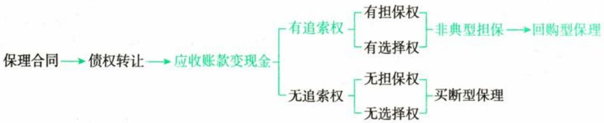

flowchart

```mermaid
graph LR
    A["保理合同"] --> B["债权转让"]
    B --> C["应收账款变现金"]
    C --> D["有追索权"]
    D --> E["有担保权"]
    D --> F["有选择权"]
    E --> G["非典型担保"]
    F --> G
    C --> H["无追索权"]
    H --> I["无担保权"]
    H --> J["无选择权"]
    I --> K["买断型保理"]
    J --> K
    G --> L["回购型保理"]
```

#### 一、含义

保理合同是在赊销交易背景下产生的一种综合性金融服务合同。保理合同是应收账款债权人将现有的或将有的应收账款转让给保理人，保理人提供资金融通、应收账款管理或催收、应收账款债务人付款担保等服务的合同。保理合同应当采用书面形式。

#### 二、虚构应收账款的处理

在保理合同订立之前，保理人一般都会对应收账款债务人进行尽职调查以核实应收账款的真实性，债务人在征询函或其他文书上确认该应收账款真实存在，保理人据此签订保理合同以及应收账款转移文件等文件，但当保理人向债务人主张权利时，债务人往往以基础交易合同不实或应收账款虚假、已消灭等为由抗辩，且从查明的事实来看，该应收账款大多不实。由此，在应收账款不实的情况下，债务人是否应当向保理人承担责任？

基于 “通谋虚伪表示无效不得对抗善意第三人” 以及 “外观主义下的善意保护” 的基本法理，应收账款债权人与债务人虚构应收账款作为转让标的，与保理人订立保理合同的，应收账款债务人不得以应收账款不存在为由对抗保理人，但是保理人明知虚构的除外。

#### 三、保理人的通知规则

保理人向应收账款债务人发出应收账款转让通知的，应当表明保理人身份并附有必要凭证。

#### 四、基础交易变更或终止对保理人的效力

保理业务实践中，在应收账款转让后，供应商（债权人）和客户（应收账款债务人）之间在具体履行合同时，难免会遇到变更价款、增加或减少供货数量、退换货等具体问题。为了保护保理人的合理信赖利益，应收账款债务人接到应收账款转让通知后，应收账款债权人和债务人无正当理由协商变更或终止基础交易合同，对保理人产生不利影响的，对保理人不发生效力。

#### 五、种类

按照保理人是否承担应收账款不能收回的商业风险为标准，将保理合同分为有追索权保理（保理人不承担应收账款不能收回的风险）和无追索权保理（保理人承担应收账款不能收回的风险）。

#### （一）有追索权保理

#### 1. 含义。

有追索权保理，又称回购型保理，是指在应收账款到期无法从债务人处收回时，保理人可以向债权人反转让应收账款，请求债权人回购应收账款或归还融资。有追索权保理的本质系应收账款债权人为保理人不能从应收账款债务人处收回约定的债权而提供的担保，这也是有追索权的保理被视为非典型担保的原因。

#### 2. 规则。

当事人约定有追索权保理的，保理人可以向应收账款债权人主张返还保理融资款本息或回购应收账款债权，也可以向应收账款债务人主张应收账款债权。保理人向应收账款债务人主张应收账款债权，在扣除保理融资款本息和相关费用后有剩余的，剩余部分应当返还给应收账款债权人。保理人一并起诉应收账款债权人和应收账款债务人的，法院可以受理。从实践来看，绝大多数情况下，保理人在提起诉讼时，均是将应收账款债权人和债务人列为共同被告。

#### （二）无追索权保理

#### 1. 含义。

无追索权保理，又称买断型保理，是指应收账款在无商业纠纷等情况下无法得到清偿的，由保理人承担应收账款的坏账风险。无追索权保理的本质系真正（纯粹）债权转让。

#### 2. 规则。

当事人约定无追索权保理的，保理人应当向应收账款债务人主张应收账款债权，保理人取得超过保理融资款本息和相关费用的部分，无需向应收账款债权人返还。

#### 六、应收账款多重让与的处理

应收账款债权人就同一应收账款订立多个保理合同，致使多个保理人主张权利的，已登记的先于未登记的受偿；均已登记的，按照登记的先后顺序受偿；均未登记的，由最先到达应收账款债务人的转让通知中载明的保理人受偿；既未登记也未通知的，按照应收账款比例清偿。

[例] 2025年3月2日，甲公司与乙公司签订了一份长达5年的汽车刹车片供应合同（基础交易关系/有偿合同），合同中约定：“甲公司向乙公司供应刹车片，乙公司每年12月月底一次性给付当年的价款2000万元（现有的及将有的应收账款/债权）”。4月21日，甲公司和丙银行和丁银行分别签订了两份保理合同。根据上述案情及示意图，请回答如下问题：

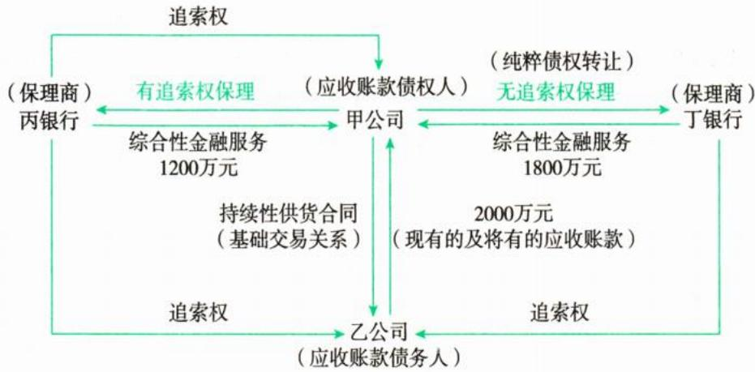

flowchart

```mermaid
graph TD
    A["甲公司"] -->|有追索权保理| B["(保理商)丙银行"]
    A -->|无追索权保理| C["(保理商)丁银行"]
    B -->|综合性金融服务 1200万元| A
    C -->|综合性金融服务 1800万元| A
    D["乙公司"] -->|有追索权保理| A
    D -->|无追索权保理| E["(保理商)丁银行"]
    D -->|有追索权保理| F["(保理商)丙银行"]
    G["持续性供货合同 (基础交易关系)"] --> A
    H["现有的及将有的应收账款"] --> A
    I["应收账款债权人"] --> A
    J["应收账款债务人"] --> A
    style A fill:#f9f,stroke:#333
    style B fill:#ccf,stroke:#333
    style C fill:#ccf,stroke:#333
    style D fill:#cfc,stroke:#333
    style E fill:#cfc,stroke:#333
    style F fill:#fcc,stroke:#333
    style G fill:#fcc,stroke:#333
    style H fill:#fcc,stroke:#333
    style I fill:#fcc,stroke:#333
    style J fill:#fcc,stroke:#333
```

(保理合同当事人法律关系示意图)

①保理合同的本质是什么？

答：债权转让，即“将现有的及将有的应收账款转让为现金”。

②保理合同的核心功能是什么？

答：在我国，保理合同的核心功能就是债权（应收账款）迅速变现，资金快速回笼，使应收账款债权人（商事主体）保持良好的现金流。

③保理合同是否必须采用书面形式？

答：是。

④如甲公司和乙公司虚构应收账款导致丙银行在不知情的情况下签订了保理合同。在丙银行向乙公司主张权利时，乙公司可否以应收账款不存在为由对抗丙银行？

答：不可以（《民法典》第763条）。因为应收账款债务人乙公司更能控制风险的发生，防止真实情况和确认情况不一致情况的发生。

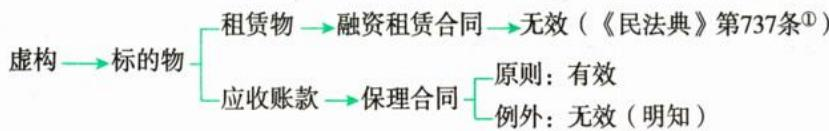

flowchart

```mermaid
graph TD
    A["虚构"] --> B["标的物"]
    B --> C["租赁物"]
    B --> D["应收账款"]
    C --> E["融资租赁合同"]
    D --> F["保理合同"]
    E --> G["无效（《民法典》第737条①）"]
    F --> H["原则：有效"]
    F --> I["例外：无效（明知）"]
```

(虚构标的物的合同效力体系框架图)

⑤丙银行可否向乙公司发出应收账款转让的通知？

答：可以。

⑥丙银行向乙公司发出应收账款转让通知的，是否应当表明保理人身份并附有必要凭证？

答：应当（注意：与债权转让制度衔接学习/《民法典》第764条）。

⑦乙公司接到应收账款转让通知后，甲公司和乙公司无正当理由协商或变更汽车刹车片供应合同，对丙银行产生不利影响的，如何处理？

答：对丙银行不发生效力（内外有别）。

⑧甲公司和丙银行签订了一份有追索权的保理合同（非典型担保）后，丙银行向甲公司提供了贷款1000万元。后经结算融资款本息及费用共计1200万元。丙银行应如何主张权利？

答：可以向乙公司主张，也可以向甲公司主张，也可以同时向甲公司和乙公司主张。如丙银行向乙公司主张了2000万元，超出的800万元应返还给甲公司；如丙银行向乙公司主张了1000万元，剩余的200万元可以向甲公司追索（多退少补）。

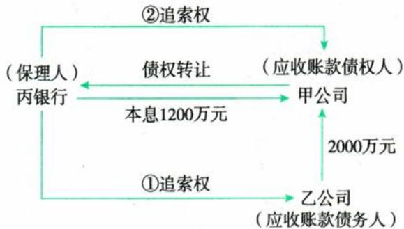

flowchart

```mermaid
graph TD
    A["①追索权"] --> B["乙公司\n(应收账款债务人)"]
    B --> C["甲公司"]
    C --> D["(应收账款债权人)"]
    D --> E["(保理人)\n丙银行"]
    E --> F["本息1200万元"]
    F --> C
    C -->|②追索权| D
    D -->|②追索权| E
```

(有追索权的保理合同当事人法律关系示意图)

有追索权的保理合同保理人行权情形汇总表

<table><tr><td>情形</td><td>乙公司</td><td>丙银行</td><td>甲公司</td><td>结论</td></tr><tr><td>情形1</td><td>2000万元</td><td>1200万元</td><td>800万元</td><td>多退</td></tr><tr><td>情形2</td><td>1000万元</td><td>1200万元</td><td>200万元</td><td>少补</td></tr></table>

[萌主点拨] 有追索权保理，又称回购型保理，是指在应收账款到期无法从债务人处收回时，保理人可以向债权人反转让应收账款，要求债权人回购应收账款或归还融资。

保理人同时向应收账款债权人和债务人主张权利的，如果保理合同约定承担连带责任，则按照合同约定处理；如果合同未作约定，则应判令应收账款债务人承担第一顺位的还款责任，应收账款债权人承担补充责任。

⑨甲公司和丁银行签订了一份无追索权的保理合同后，丁银行向甲公司提供了1800万元的贷款。到期后，丁银行的2000万元债权应向谁主张？

答：乙公司。

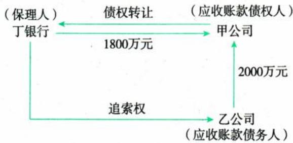

flowchart

```mermaid
graph TD
    A["丁银行"] -->|债权转让 1800万元| B["甲公司"]
    B -->|追索权 2000万元| C["乙公司 (应收账款债务人)"]
    C --> A
    D["(保理人)"] --> A
    E["(应收账款债权人)"] --> B
```

(无追索权的保理合同当事人法律关系示意图)

[萌主点拨] 无追索权保理，又称买断型保理，本质系真正（纯粹）债权转让，即甲公司将2000万元债权以1800万元出卖给丁银行，甲公司实现了债权（应收账款）迅速变现，资金快速回笼，使甲公司保持了良好的现金流。对于丁银行而言，如能顺利向乙公司追索2000万元债权，则自己获利200万元；如不能顺利向乙公司追索2000万元债权，则风险自担，甲公司和丁银行各得其所。

⑩如甲公司将同一应收账款分别与丙银行和丁银行签订了保理合同，丙银行前往中国人民银行征信中心办理了登记手续，丁银行通知了乙公司。二者的权利冲突如何处理？

答：丙银行优先于丁银行（《民法典》第768条）。

[萌主点拨] 应收账款多重让与的处理，即排序规则如下：一看登记（登记机构为中国人民银行征信中心）；二看通知（到达主义）；三按比例。

### 28 专题二十八 承揽合同

#### 复习提要

承揽合同规定在《民法典》第三编合同第二分编典型合同第十七章（第770—787条），共18条。本专题主要涉及三个问题：1. 承揽合同的基本原理；2. 定作人的任意解除权；3. 承揽人的留置权。承揽合同乃日常生活中经常使用的合同。如修车、修手表、照相、打印论文及讲义等。在考试中，承揽合同往往会结合留置权进行考查。同时，亦会结合侵权责任中的特殊主体责任即定作人责任进行考查。因此，考生须学会整个民法各知识点之间的串联学习。

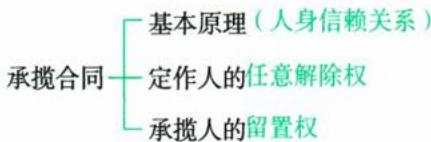

flowchart

```mermaid
graph TD
    A["承揽合同"] --> B["基本原理（人身信赖关系）"]
    A --> C["定作人的任意解除权"]
    A --> D["承揽人的留置权"]
```

#### 一、基本原理

#### (一) 含义

承揽合同是承揽人按照定作人的要求完成工作，交付工作成果，定作人支付报酬的合同。承揽包括加工、定作、修理、复制、测试、检验等工作。典型的承揽合同包括：修机器设备、修车、修手表、照相和打印讲义、礼服定制、家具定制等。

#### (二) 人身信赖关系①

承揽人应当以自己的设备、技术和劳力，亲自完成主要工作，但是当事人另有约定的除外。承揽人将其承揽的主要工作交由第三人完成的，应当就该第三人完成的工作成果向定作人负责；未经定作人同意的，定作人也可以解除合同。承揽人可以将其承揽的辅助工作交由第三人（仅为履行主体，非合同当事人）完成，无需定作人同意；承揽人将其承揽的辅助工作交由第三人完成的，应当就该第三人完成的工作成果向定作人负责。

[萌主点拨]
承揽合同中的人身信赖关系

<table><tr><td>项目</td><td>谁来完成</td><td>转让第三人</td><td>违反后果</td></tr><tr><td>主要工作</td><td>承揽人亲自</td><td>需定作人同意</td><td>根本违约,定作人可以解除合同</td></tr><tr><td>辅助工作</td><td>承揽人或第三人均可</td><td>无需定作人同意</td><td>就第三人的工作成果向定作人负责(承担违约责任)</td></tr></table>

#### (三) 种类

1. 承揽人提供材料。

承揽人提供材料的，应当按照约定选用材料，并接受定作人检验。

2. 定作人提供材料。

定作人提供材料的，应当按照约定提供材料。承揽人对定作人提供的材料，应当及时检验，发现不符合约定时，应当及时通知定作人更换、补齐或采取其他补救措施。承揽人不得擅自更换定作人提供的材料，不得更换不需要修理的零部件。

#### (四) 共同承揽

共同承揽人对定作人承担连带责任，但是当事人另有约定的除外。

#### 二、定作人的任意解除权

定作人在承揽人完成工作前可以随时解除合同，造成承揽人损失的，应当赔偿损失。定作人中途变更承揽工作的要求，造成承揽人损失的，应当赔偿损失。法律之所以赋予承揽合同中定作人以任意解除权，立法目的主要系为定作人之利益。工作之完成如因情势变更或其他事由对定作人已失去意义时，自应允许定作人随时终止，因为无益工作之继续不仅对定作人不利，于整体社会经济亦有损害。

[例] 孟某提供三块木料给某家具厂订制一个衣柜，开工不久孟某觉得衣柜样式不够新潮，遂要求家具厂停止制作。家具厂认为这是个无理要求，便继续使用剩下两块木料，按原定式样做好了衣柜。孟某应支付部分报酬。

#### 三、承揽人的留置权

定作人未向承揽人支付报酬或材料费等价款的，承揽人对完成的工作成果享有留置权或有权拒绝交付，但是当事人另有约定的除外。

[例] 育才中学委托利达服装厂加工500套校服，约定材料由服装厂采购，学校提供样品，取货时付款。为赶时间，利达服装厂私自委托恒发服装厂加工100套。育才中学按时前来取货，发现恒发服装厂加工的100套校服不符合样品要求，遂拒绝付款。利达服装厂则拒绝交货。如育才中学不支付酬金，利达服装厂可对样品行使留置权。

### 29 专题二十九 建设工程合同

#### 复习提要

建设工程合同规定在《民法典》第三编合同第二分编典型合同第十八章（第788—808条），共21条。本专题主要涉及四个问题：1. 建设工程合同的基本原理；2. 建设工程施工合同无效的情形和处理；3. 建设工程施工合同中的诉讼地位；4. 建设工程价款优先受偿权。建设工程施工合同属于重点考试对象，在备考中必须牢牢掌握。

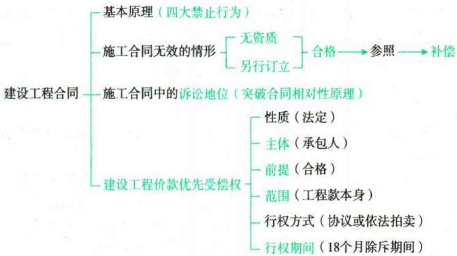

flowchart

```mermaid
graph TD
    A["建设工程合同"] --> B["基本原理（四大禁止行为）"]
    A --> C["施工合同无效的情形"]
    C --> D["无资质"]
    C --> E["另行订立"]
    D --> F["合格"]
    F --> G["参照"]
    G --> H["补偿"]
    A --> I["施工合同中的诉讼地位（突破合同相对性原理）"]
    A --> J["建设工程价款优先受偿权"]
    J --> K["性质（法定）"]
    J --> L["主体（承包人）"]
    J --> M["前提（合格）"]
    J --> N["范围（工程款本身）"]
    J --> O["行权方式（协议或依法拍卖）"]
    J --> P["行权期间（18个月除斥期间）"]
```

#### 一、基本原理

#### (一) 含义

建设工程合同是承包人进行工程建设，发包人支付价款的合同。建设工程合同应当采用书面形式。

#### (二) 四大禁止行为①

工程质量不仅关系到发包人的利益，还关系到广大消费者、使用人以及不特定公众的利益。因此，无论是发包人还是承包人，都应当遵守法律的强制性规定以及相关技术规范，以确保建设工程质量。

1. 情形。

(1) 禁止发包人支解发包。

支解发包，是指发包人将应当由一个承包人完成的建设工程支解成若干部分发包给几个承包人的情形。禁止支解发包的原因在于：如果允许发包人将应当由一个承包单位整体承包的工程，支解成若干部分，分别发包给几个承包单位，将会使得整个工程建设在管理和技术上缺乏应有的统筹协调，往往造成施工现场秩序的混乱、责任不清，严重影响工程建设质量，出了问题也很难找到责任者。

(2) 禁止承包人全部转包和支解后全部分包。

转包，是指建设工程的承包人将其承包的建设工程倒手转让给第三人的行为。禁止非法转包和违法分包原因在于：建设工程施工对承包人的资质要求高，转包和违法分包不仅会拉长利益链条、层层剥利，导致实际用于工程建设的工程款低于建设工程施工合同的工程款，而且会导致由不具有建筑施工资质的施工人进行工程施工，既损害建筑市场秩序，又影响建设工程质量安全，损害发包人的利益。

(3) 禁止承包人分包给不具备相应资质条件的单位。

(4) 禁止分包单位再分包。

2. 法律后果。

为保障工程质量，维护社会公共利益、保障国家利益及维护市场交易的稳定性，资质管理和招投标的规定都被认定为强制性规定，一旦违反，合同无效。

[例] 甲大学欲建设一栋20层的教学楼。现共有5家建筑公司来参加投标，其中乙公司、丙公司和丁公司有资质，戊公司和己公司无资质。根据上述案情及示意图，请回答如下问题：

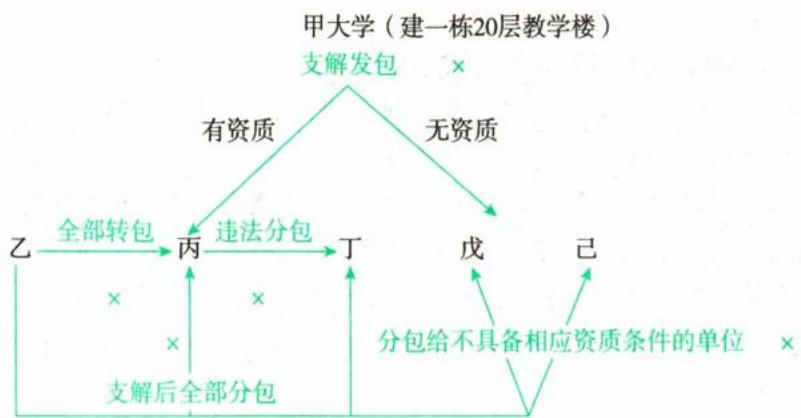

flowchart

```mermaid
graph TD
    A["甲大学（建一栋20层教学楼）"] --> B["支解发包"]
    A --> C["有资质"]
    A --> D["无资质"]
    B --> E["丙"]
    C --> F["丁"]
    D --> G["戊"]
    E --> H["支解后全部分包"]
    F --> I["分包给不具备相应资质条件的单位"]
    G --> J["己"]
    H --> K["乙"]
    I --> L["×"]
    J --> M["×"]
    K --> N["×"]
    L --> O["×"]
    M --> P["×"]
    N --> Q["×"]
    O --> R["×"]
    P --> S["×"]
```

(建设工程合同四大禁止行为当事人示意图)

①甲大学可否将20层的教学楼支解5份发包？

答：不可以。因为禁止发包人支解发包。

②如乙公司中标，乙公司可否将该建设工程全部转包给丙公司？

答：不可以。因为禁止承包人全部转包（基于工程质量和社会公共利益的考量，建设工程主体结构的施工必须由承包人亲自完成，该规定属于强制性规定，即使经发包人同意，将主体结构的施工转包给第三人的，转包合同依然无效）。

③如乙公司中标，乙公司可否将该建设工程支解后全部分包给丙公司和丁公司？

答：不可以。因为禁止承包人支解后全部分包。

④如乙公司中标，乙公司可否将该建设工程分包给不具备相应资质条件的戊公司或己公司？

答：不可以。因为禁止承包人分包给不具备相应资质条件的单位。

⑤如乙公司中标，经甲大学同意，乙公司将部分非主体工程分包给丙公司，丙公司可否再分包给丁公司？

答：不可以。因为禁止分包单位再分包。

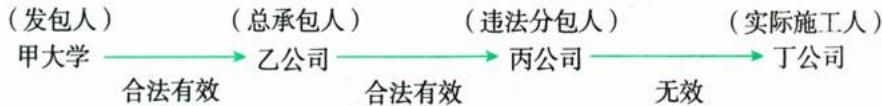

flowchart

```mermaid
graph LR
    A["甲大学"] -->|合法有效| B["乙公司"]
    B -->|合法有效| C["丙公司"]
    C -->|无效| D["丁公司"]
    A -->|(发包人)| E
    B -->|(总承包人)| F
    C -->|(违法分包人)| G
    D -->|(实际施工人)| H
```

##### (建设工程施工合同违法再分包当事人法律关系示意图)

⑥如乙公司将建设工程转包、违法分包的，甲大学是否可以解除双方之间的建设工程施工合同？

答：可以。因为乙公司构成根本违约，非违约方甲大学有权行使法定解除权。

#### 二、建设工程施工合同无效的情形和处理①

#### (一) 情形

1. 承包人未取得建筑业企业资质或超越资质等级的（建筑资质关系到建筑质量安全，关乎社会公共利益）。

2. 没有资质的实际施工人借用有资质的建筑施工企业名义的（俗称“挂靠”）。

缺乏资质的单位或个人借用有资质的建筑施工企业名义签订建设工程施工合同，发包人请求出借方与借用方对建设工程质量不合格等因出借资质造成的损失承担连带赔偿责任的，法院应予支持。

3. 建设工程必须进行招标而未招标或中标无效的。

4. 另行签订的建设工程施工合同（黑合同）背离中标合同（白合同）实质性内容的。

招标人和中标人另行签订的建设工程施工合同约定的工程范围、建设工期、工程质量、工程价款等实质性内容，与中标合同不一致，一方当事人请求按照中标合同确定权利义务的，法院应予支持。招标人和中标人在中标合同之外就明显高于市场价格购买承建房产、无偿建设住房配套设施、让利、向建设单位捐赠财物等另行签订合同，变相降低工程价款，一方当事人以该合同背离中标合同实质性内容为由请求确认无效的，法院应予支持。

5. 发包人在起诉前未取得建设工程规划许可证等规划审批手续，但恶意不办理的除外。当事人以发包人未取得建设工程规划许可证等规划审批手续为由，请求确认建设工程施工合同无效的，法院应予支持，但发包人在起诉前取得建设工程规划许可证等规划审批手续的除外；发包人能够办理审批手续而未办理，并以未办理审批手续为由请求确认建设工程施工合同无效的，法院不予支持。②

① 考查 2 次，抓住重点。

② 这一规定一方面是出于维护诚信的考虑，防止当事人为了不履行合同，故意不提出行政审批申请，进而以此恶意抗辩合同无效；另一方面则在于合同当事人既然已经具备取得批准证书的条件，相关强制性规定的规范目的已得到实现。

#### (二) 处理

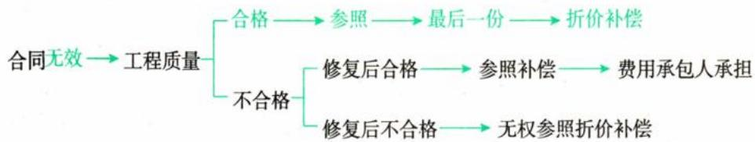

flowchart

```mermaid
graph TD
    A["合同无效"] --> B["工程质量"]
    B --> C["合格"]
    B --> D["不合格"]
    C --> E["参照"]
    E --> F["最后一份"]
    F --> G["折价补偿"]
    D --> H["修复后合格"]
    D --> I["修复后不合格"]
    H --> J["参照补偿"]
    J --> K["费用承包人承担"]
    I --> L["无权参照折价补偿"]
```

(建设工程施工合同无效后的处理法律关系示意图)

1. 工程质量合格。

建设工程施工合同无效，但是建设工程经验收合格的，可以参照合同关于工程价款的约定折价补偿承包人。当事人就同一建设工程订立的数份建设工程施工合同均无效，但建设工程质量合格，一方当事人请求参照实际履行的合同关于工程价款的约定折价补偿承包人的，法院应予支持。实际履行的合同难以确定，当事人请求参照最后签订的合同关于工程价款的约定折价补偿承包人的，法院应予支持。

2. 工程质量不合格。

（1）修复后合格。建设工程施工合同无效，且建设工程经验收不合格，修复后的建设工程经验收合格的，发包人可以请求承包人承担修复费用。

（2）修复后不合格。建设工程施工合同无效，且建设工程经验收不合格，修复后的建设工程经验收不合格的，承包人无权请求参照合同关于工程价款的约定折价补偿。

#### >> 随堂练习

甲房地产开发公司开发一个较大的花园公寓项目，作为发包人，甲公司将该项目的主体工程发包给了乙企业，签署了建设工程施工合同。乙企业一直未取得建筑施工企业资质。现该项目主体工程已封顶完工。就相关合同效力及工程价款，下列哪些说法是正确的？(2017-3-62，多-改编) $^{①}$

A. 该建设工程施工合同无效

B. 因该项目主体工程已封顶完工，故该建设工程施工合同不应认定为无效

C. 该项目主体工程经竣工验收合格，则乙企业可以参照合同约定请求甲公司折价补偿

D. 该项目主体工程经竣工验收不合格，甲公司可以请求乙企业赔偿损失

#### 三、建设工程施工合同中的诉讼地位 $^{②}$

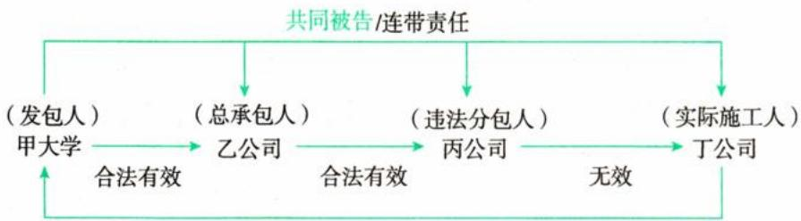

flowchart

```mermaid
graph TD
    A["（发包人）\n甲大学"] -->|合法有效| B["（总承包人）\n乙公司"]
    B -->|合法有效| C["（违法分包人）\n丙公司"]
    C -->|无效| D["（实际施工人）\n丁公司"]
    D -->|共同被告/连带责任| A
```

债权人代位权之诉（自己的名义）
(建设工程施工合同中的诉讼地位法律关系示意图)

因建设工程质量发生争议的，发包人可以以总承包人、分包人和实际施工人为共同被告提起诉讼。实际施工人以转包人、违法分包人为被告起诉的，法院应当依法受理。

实际施工人以发包人为被告主张权利的，法院应当追加转包人或违法分包人为本案第三人，在查明发包人欠付转包人或违法分包人建设工程价款的数额后，判决发包人在欠付建设工程价款范围内对实际施工人承担责任。实际施工人以转包人或违法分包人怠于向发包人行使到期债权或与该债权有关的从权利，影响其到期债权实现，提起代位权诉讼的，法院应予支持。

#### 四、建设工程价款优先受偿权①

债权优于物权
不动产预告登记（《民法典》第221条）
租赁权公示在先情形下的所有权变动（买卖）不破租赁
建设工程价款优先受偿权（《民法典》第807条）

(债权优于物权情形示意图)

建设工程价款优先受偿权制度赋予建设工程价款债权就该工程折价或拍卖的价款优先受偿的权利，目的是对农民工等建筑工人的工资权益予以优先保护，但此项保护并非直接指向建筑工人的工资权益，而是以保护承包人的建设工程价款债权为媒介，间接保护建筑工人的权益。

#### (一) 性质

建设工程价款优先受偿权系法定优先权，属于物权优先效力的例外。承包人享有的建设工程价款优先受偿权优于抵押权和其他债权。

#### (二) 主体

建设工程价款优先受偿权的主体系承包人。

与发包人订立建设工程施工合同的承包人请求其承建工程的价款就工程折价或拍卖的价款优先受偿的，法院应予支持。

装饰装修工程具备折价或拍卖条件，装饰装修工程的承包人请求工程价款就该装饰装修工程折价或拍卖的价款优先受偿的，法院应予支持。

#### (三) 前提

建设工程价款优先受偿权的前提是工程质量合格。即使建设工程施工合同无效，工程未竣工，亦不影响优先权。建设工程质量合格，承包人请求其承建工程的价款就工程折价或拍卖的价款优先受偿的，法院应予支持。未竣工的建设工程质量合格，承包人请求其承建工程的价款就其承建工程部分折价或拍卖的价款优先受偿的，法院应予支持。

[例] 大象公司和众森公司签订了一份建筑工程施工合同，但大象公司无资质。工程验收合格后，众森公司以大象公司无资质为由抗辩，大象公司起诉主张参照工程价款折价补偿以及建筑工程优先受偿权。大象公司有权主张建筑物优先受偿权。

#### (四) 范围

承包人建设工程价款优先受偿的范围依照国务院有关行政主管部门关于建设工程价款范围的规定确定。基于利益衡量的考虑，承包人就逾期支付建设工程价款的利息、违约金、损害赔偿金等主张优先受偿的，法院不予支持。

#### (五) 行权方式

承包人行使建设工程价款优先受偿权的方式有二：与发包人协议将该工程折价和申请法院将该工程依法拍卖。

#### (六) 行权期间

承包人应当在合理期限内行使建设工程价款优先受偿权，但最长不得超过18个月（除斥期间），自发包人应当给付建设工程价款之日起算。实践中，建设工程竣工验收和工程价款结算都是争议较大的问题，所耗费的时间也较长。只有在确定建设工程价款数额之后，承包人才能行使建设工程价款优先受偿权。因此，将行权的除斥期间定为18个月。发包人与承包人约定放弃或限制建设工程价款优先受偿权，损害建筑工人利益，发包人根据该约定主张承包人不享有建设工程价款优先受偿权的，法院不予支持。

[例] 众森公司准备开发幸福小区项目，2024年3月2日与中铁十八局签订了一份建设工程施工合同，由中铁十八局负责建设其中的5栋别墅，工程款2000万元。4月21日与中铁七局签订了一份装饰装修工程施工合同，由中铁七局负责对5栋别墅进行装饰装修，工程款1000万元。10月16日，中铁十八局将5栋建设完毕且合格的别墅交付给众森公司，11月16日，中铁七局将5栋装饰装修完毕且合格的别墅交付给众森公司。11月20日，众森公司向工商银行贷款2000万元，将该5栋别墅抵押给工商银行并办理了抵押登记手续。后因众森公司资金链断裂，无法按期向中铁十八局给付工程款，产生利息200万元；亦无法按期向中铁七局给付工程款，产生利息100万元。同时，工商银行的债权亦到期无法偿还。2025年2月12日，法院将5栋别墅拍卖，共获得3300万元。中铁十八局、中铁七局和工商银行对该3300万元如何分配产生纠纷。根据上述案情及示意图，请回答如下问题：

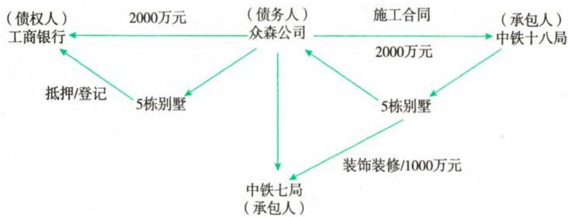

flowchart

```mermaid
graph TD
    A["(债权人) 工商银行"] -->|2000万元| B["(债务人) 众森公司"]
    A -->|抵押/登记| C["5栋别墅"]
    B -->|2000万元| D["(承包人) 中铁十八局"]
    B -->|5栋别墅| E["中铁七局 (承包人)"]
    E -->|装饰装修/1000万元| B
```

(建设工程价款优先受偿权当事人法律关系示意图)

①中铁十八局是否有权对建设工程拍卖的价款优先受偿？为什么？

答：有权。因为与发包人订立建设工程施工合同的承包人请求其承建工程的价款就工程折价或拍卖的价款优先受偿的，法院应予支持。

②中铁七局是否有权对建设工程拍卖的价款优先受偿？为什么？

答：有权。因为装饰装修工程具备折价或拍卖条件，装饰装修工程的承包人请求工程价款就该装饰装修工程折价或拍卖的价款优先受偿的，法院应予支持。

③中铁十八局和中铁七局主张建设工程价款优先受偿权的前提是什么？

答：工程质量合格。

④中铁十八局和中铁七局主张建设工程价款优先受偿权的范围是什么？

答：2000万元和1000万元工程款，200万元和100万元利息无权主张优先权（《建设工程施工合同解释（一）》第40条）。

⑤中铁十八局和中铁七局主张建设工程价款优先受偿权的行权期间如何确定？

答：最长不得超过18个月（除斥期间），自发包人应当给付建设工程价款之日起算（《建设工程施工合同解释（一）》第41条）。

⑥中铁十八局、中铁七局和工商银行对建设工程价款优先受偿权如何排序？

答：中铁十八局和中铁七局>工商银行。

⑦中铁十八局、中铁七局和工商银行对3300万元如何分配？

答：中铁十八局 2000 万元；中铁七局 1000 万元；工商银行 300 万元。

### 30 专题三十 运输合同

#### 复习提要

运输合同规定在《民法典》第三编合同第二分编典型合同第十九章（第809—842条），共34条。本专题主要涉及三个问题：1. 运输合同的基本原理；2. 客运合同；3. 货运合同。运输合同在考试中单独涉及的非常少，往往要结合相关考点，如宣告死亡、违约责任、侵权责任等。在备考过程中，应重点关注客运合同。

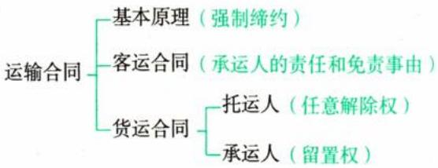

flowchart

```mermaid
graph TD
    A["运输合同"] --> B["基本原理（强制缔约）"]
    A --> C["客运合同（承运人的责任和免责事由）"]
    A --> D["货运合同"]
    D --> E["托运人（任意解除权）"]
    D --> F["承运人（留置权）"]
```

#### 一、基本原理

运输合同是承运人将旅客或货物从起运地点运输到约定地点，旅客、托运人或收货人支付票款或运输费用的合同。从事公共运输的承运人不得拒绝旅客、托运人通常、合理的运输要求（即适用“强制缔约理论”）。

#### 二、客运合同

#### (一) 含义

客运合同，又称为旅客运输合同，是指承运人与旅客签订的由承运人将旅客及其行李运输到目的地而由旅客支付票款的合同。客运合同的旅客既是合同一方当事人，又是运输对象。

#### (二) 成立

客运合同通常采用票证形式。客票为客运合同的书面形式，也是客运合同成立的凭证。客运合同的成立时间和生效时间并不一致，客运合同自承运人向旅客出具客票时成立，但是当事人另有约定或另有交易习惯的除外（《民法典》第814条）。

#### （三）承运人的救助义务

承运人在运输过程中，应当尽力救助患有急病、分娩、遇险的旅客（《民法典》第822条）。

#### (四) 承运人的责任和免责事由①

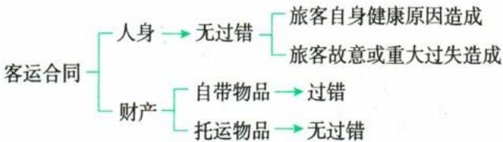

flowchart

```mermaid
graph TD
    A["客运合同"] --> B["人身"]
    A --> C["财产"]
    B --> D["无过错"]
    D --> E["旅客自身健康原因造成"]
    D --> F["旅客故意或重大过失造成"]
    C --> G["自带物品"]
    C --> H["托运物品"]
    G --> I["过错"]
    H --> J["无过错"]
```

(承运人的责任和免责事由示意图)

#### 1. 人身关系。

承运人应当对运输过程中旅客的伤亡承担赔偿责任；但是，伤亡是旅客自身健康原因造成的或承运人证明伤亡是旅客故意、重大过失造成的除外（适用于按照规定免票、持优待票或经承运人许可搭乘的无票旅客）。

#### 2. 财产关系。

在运输过程中旅客随身携带物品毁损、灭失，承运人有过错的，应当承担赔偿责任。旅客托运的行李毁损、灭失的，适用货物运输的有关规定。

#### >> 随堂练习

唐某带领小宝（3周岁）乘坐客运班车，给小宝办理了免票手续。乘车途中，客运班车与蒋某驾驶的轿车相撞发生交通事故。唐某轻伤且手机摔坏，就医花去医药费2000元，修理手机花费5000元。小宝脑震荡，花去医药费20万元。关于本案，下列说法正确的有？(2019金题-2-1-18，多) $^{②}$

A. 若班车司机能证明对交通事故的发生没有过错，对于唐某的手机损失，客运公司可以免责
B. 小宝有权请求客运公司承担赔偿责任
C. 小宝系免票乘车，应自己承担损失
D. 唐某有权请求客运公司和蒋某承担连带责任

#### 三、货运合同

#### (一) 含义

货运合同，是指承运人将托运人交付的货物运输到指定的地点，而由托运人支付运费的合同。

#### (二) 托运人的任意解除权

在承运人将货物交付收货人之前，托运人可以要求承运人中止运输、返还货物、变更到达地或将货物交给其他收货人，但是应当赔偿承运人因此受到的损失。

#### (三) 承运人的留置权

托运人或收货人不支付运费、保管费以及其他费用的，承运人对相应的运输货物享有留置权，但是当事人另有约定的除外（《民法典》第836条）。

#### (四) 承运人的免责事由

承运人对运输过程中货物的毁损、灭失承担赔偿责任。但是，承运人证明货物的毁损、灭失是因不可抗力、货物本身的自然性质或合理损耗以及托运人、收货人的过错造成的，不承担赔偿责任（《民法典》第832条）。

货物在运输过程中因不可抗力灭失，未收取运费的，承运人不得请求支付运费；已经收取运费的，托运人可以请求返还。法律另有规定的，依照其规定（《民法典》第835条）。

### 31 专题三十一 技术合同

#### 复习提要

技术合同规定在《民法典》第三编合同第二分编典型合同第二十章（第843—887条），共45条。本专题主要涉及五个问题：1. 技术合同的含义；2. 技术合同无效的情形和处理；3. 技术开发合同；4. 技术转让合同和技术许可合同；5. 技术咨询合同和技术服务合同。技术合同的题目往往结合知识产权法的内容综合进行考查，难度较大。在备考过程中，应结合知识产权法的相关内容进行思考和理解。

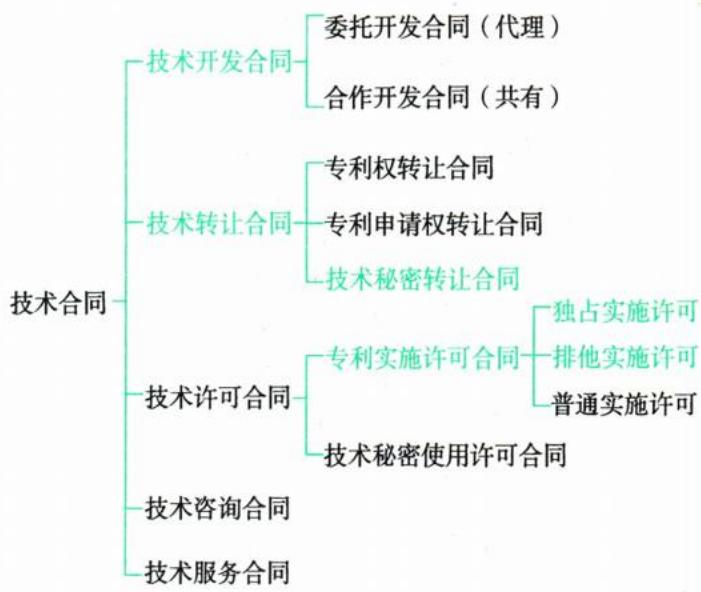

flowchart

```mermaid
graph TD
    A["技术合同"] --> B["技术开发合同"]
    A --> C["技术转让合同"]
    A --> D["技术许可合同"]
    A --> E["技术咨询合同"]
    A --> F["技术服务合同"]
    
    B --> G["委托开发合同（代理）"]
    B --> H["合作开发合同（共有）"]
    
    C --> I["专利权转让合同"]
    C --> J["专利申请权转让合同"]
    C --> K["技术秘密转让合同"]
    
    D --> L["专利实施许可合同"]
    D --> M["技术秘密使用许可合同"]
    
    L --> N["独占实施许可"]
    L --> O["排他实施许可"]
    L --> P["普通实施许可"]
```

#### 一、技术合同的含义

技术合同是当事人就技术开发、转让、许可、咨询或服务订立的确立相互之间权利和义务的合同。

[萌主点拨] 技术开发、转让和许可合同属于要式合同。

#### 二、技术合同无效的情形和处理①

1. 非法垄断技术（限制技术竞争和发展/限制创新）。

非法垄断技术，是指通过合同条款限制对方在合同标的技术的基础上进行新的研究开发，或限制对方从其他渠道吸收先进技术，或阻碍对方根据市场的需求，按照合理的方式充分实施专利和使用技术秘密。下列情形属于“非法垄断技术”：

（1）限制当事人一方在合同标的技术基础上进行新的研究开发或限制其使用所改进的技术，或双方交换改进技术的条件不对等，包括要求一方将其自行改进的技术无偿提供给对方、非互惠性转让给对方、无偿独占或共享该改进技术的知识产权；
(2) 限制当事人一方从其他来源获得与技术提供方类似技术或与其竞争的技术:
（3）阻碍当事人一方根据市场需求，按照合理方式充分实施合同标的技术，包括明显不合理地限制技术接受方实施合同标的技术生产产品或提供服务的数量、品种、价格、销售渠道和出口市场；
（4）要求技术接受方接受并非实施技术必不可少的附带条件，包括购买非必需的技术、原材料、产品、设备、服务以及接收非必需的人员等；
(5) 不合理地限制技术接受方购买原材料、零部件、产品或设备等的渠道或来源；
(6) 禁止技术接受方对合同标的技术知识产权的有效性提出异议或对提出异议附加条件。

2. 侵害他人技术成果。

侵害他人技术成果是指，侵害另一方或第三方的专利权、专利申请权、专利实施权、技术秘密的使用权和转让权或发明权、发现权等的行为。

[例] 甲公司向乙公司转让了一项技术秘密（未公开）。技术转让合同履行完毕后，经查该技术秘密是甲公司通过不正当手段从丙公司获得的。根据上述案情及示意图，请回答如下问题：

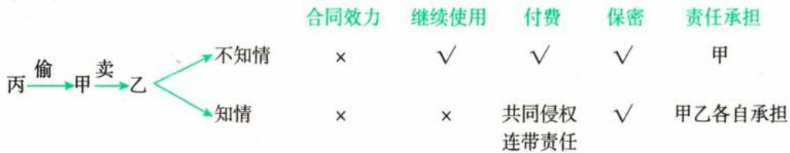

flowchart

```mermaid
graph LR
    A["丙"] -->|偷| B["甲"]
    B -->|卖| C["乙"]
    C -->|不知情| D["知情"]
    C -->|不知情| E["合同效力"]
    E --> F["×"]
    F --> G["√"]
    G --> H["共同侵权"]
    H --> I["连带责任"]
    I --> J["¥"]
    J --> K["保密"]
    K --> L["责任承担"]
    L --> M["甲"]
    M --> N["甲乙各自承担"]
```

##### (侵害他人技术成果合同无效的当事人法律关系示意图)

①甲公司和乙公司之间的技术转让合同效力如何？

答：无效。因为侵害他人技术成果的技术合同无效，无论乙公司是不知情的抑或知情的，甲与乙之间的技术转让合同均无效。

②乙公司可否继续使用该技术秘密？

答：如乙公司系不知情的，可以继续使用该技术；如乙公司系知情的，不可以继续使用该技术。

③乙公司是否需要支付使用费？

答：如乙公司系不知情的，应当向权利人（丙公司）支付合理的使用费；如乙公司系知情的，应当与甲公司一起对丙公司承担共同侵权的连带责任。

④乙公司是否需要履行保密义务？

答：需要。因为无论乙公司是不知情的抑或知情的，均应当对技术秘密进行保密，即均负有保密义务。

⑤甲公司和乙公司之间的技术转让合同无效后，双方之间的民事责任如何处理？

答：如乙公司系不知情的，即造成技术合同无效的原因在于甲公司一方，则由甲公司单独承担赔偿责任（缔约过失责任/《民法典》第157条）；如乙公司系知情的，即造成技术合同无效的原因在于甲公司和乙公司双方，则由甲公司和乙公司双方各自承担相应的责任（按份责任）。

#### 三、技术开发合同①

#### (一) 含义

技术开发合同是当事人之间就新技术、新产品、新工艺、新品种或新材料及其系统的研究开发所订立的合同。技术开发合同应当采用书面形式。当事人之间就具有实用价值的科技成果实施转化订立的合同，参照适用技术开发合同的有关规定。

#### (二) 解除

因作为技术开发合同标的的技术已经由他人公开，致使技术开发合同的履行没有意义的（合同目的无法实现），当事人可以解除合同。

#### (三) 风险负担

在技术开发合同履行过程中，因出现无法克服的技术困难，致使研究开发失败或部分失败的，该风险由当事人约定；没有约定或约定不明确，依据《民法典》第510条的规定仍不能确定的，风险由当事人合理分担。当事人一方发现可能致使研究开发失败或部分失败的情形时，应当及时通知另一方并采取适当措施减少损失；没有及时通知并采取适当措施，致使损失扩大的，应当就扩大的损失承担责任。

#### (四) 种类

1. 委托开发合同（代理）。

委托开发完成的发明创造，除法律另有规定或当事人另有约定外，申请专利的权利（专利申请权）属于研究开发人（受托人/发明创造行为属于事实行为）。研究开发人取得专利权的，委托人可以依法实施该专利。研究开发人（受托人）转让专利申请权的，委托人享有以同等条件优先受让的权利。

[例] 甲与乙均为丙研究所的工作人员，二人受丁公司委托利用业余时间合作研究了一种新型电池，各方未就专利申请权的归属作出约定。该发明的专利申请权应属于甲和乙。

2. 合作开发合同（共有）。

合作开发完成的发明创造，除当事人另有约定外，申请专利的权利（专利申请权）属于合作开发的当事人共有。当事人一方转让其共有的专利申请权的，其他各方享有以同等条件优先受让的权利。合作开发的当事人一方声明放弃其共有的专利申请权的，可以由另一方单独申请或由其他各方共同申请。申请人取得专利权的，放弃专利申请权的一方可以免费实施该专利。合作开发的当事人一方不同意申请专利的，另一方或其他各方不得申请专利。

[萌主点拨] 合作开发合同中，专利申请权的行使采“一票否决权”制度（同“住改商”）。

[例] 甲乙丙三人合作开发一项技术，合同中未约定权利归属。该项技术开发完成后，甲、丙想要申请专利，而乙主张通过商业秘密来保护。甲、丙不得申请专利。

委托开发或合作开发完成的技术秘密成果的使用权、转让权以及收益的分配办法，由当事人约定；没有约定或约定不明确，依据《民法典》第510条的规定仍不能确定的，在没有相同技术方案被授予专利权前，当事人均有使用和转让的权利。但是，委托开发的研究开发人不得在向委托人交付研究开发成果之前，将研究开发成果转让给第三人。

当事人均有使用和转让的权利，包括当事人均有不经对方同意而自己使用或以普通使用许可的方式许可他人使用技术秘密，并独占由此所获利益的权利。当事人一方将技术秘密成果的转让权让与他人，或以独占或排他使用许可的方式许可他人使用技术秘密，未经对方当事人同意或追认的，应当认定该让与或许可行为无效。

##### 随堂练习

甲公司与乙公司签订一份技术开发合同，未约定技术秘密成果的归属。甲公司按约支付了研究开发经费和报酬后，乙公司交付了全部技术成果资料。后甲公司在未告知乙公司的情况下，以普通使用许可的方式许可丙公司使用该技术，乙公司在未告知甲公司的情况下，以独占使用许可的方式许可丁公司使用该技术。下列哪一说法是正确的？(2011-3-15，单)①

A. 该技术成果的使用权仅属于甲公司
B. 该技术成果的转让权仅属于乙公司
C. 甲公司与丙公司签订的许可使用合同无效
D. 乙公司与丁公司签订的许可使用合同无效

#### 四、技术转让合同和技术许可合同②

#### (一) 技术转让合同

#### 1. 含义。

技术转让合同是合法拥有技术的权利人，将现有特定的专利、专利申请、技术秘密的相关权利让与他人所订立的合同。技术转让合同应当采用书面形式。技术转让合同中关于提供实施技术的专用设备、原材料或提供有关的技术咨询、技术服务的约定，属于合同的组成部分。

#### 2. 种类。

技术转让合同包括专利权转让、专利申请权转让、技术秘密转让等合同。

① 答案：D。
② 考查 2 次，抓住重点。

#### 3. 限制。

技术转让合同可以约定实施专利或使用技术秘密的范围，但是不得限制技术竞争和技术发展。

#### 4. 让与人的义务。

技术转让合同的让与人应当保证自己是所提供的技术的合法拥有者，并保证所提供的技术完整、无误、有效，能够达到约定的目标。

#### 5. 受让人的义务。

技术转让合同的受让人应当按照约定的范围和期限，对让与人提供的技术中尚未公开的秘密部分，承担保密义务。

#### 6. 技术秘密转让合同。

技术秘密转让合同的让与人应当按照约定提供技术资料，进行技术指导，保证技术的实用性、可靠性，承担保密义务。技术秘密转让合同的受让人应当按照约定使用技术，支付转让费，承担保密义务。

#### (二)技术许可合同

#### 1. 含义。

技术许可合同是合法拥有技术的权利人，将现有特定的专利、技术秘密的相关权利许可他人实施、使用所订立的合同。技术许可合同应当采用书面形式。技术许可合同中关于提供实施技术的专用设备、原材料或提供有关的技术咨询、技术服务的约定，属于合同的组成部分。

#### 2. 种类。

技术许可合同包括专利实施许可①、技术秘密使用许可等合同。

#### 3. 限制。

技术许可合同可以约定实施专利或使用技术秘密的范围，但是不得限制技术竞争和技术发展。

#### 4. 专利实施许可合同。

#### (1) 有效期间。

专利实施许可合同只在该专利权的存续期限内有效。

##### [核心法条链接]

《专利法》第42条第1款：发明专利权的期限为20年，实用新型专利权的期限为10年，外观设计专利权的期限为15年，均自申请日起计算。

#### (2) 许可人的义务。

专利实施许可合同的许可人应当按照约定许可被许可人实施专利，交付实施专利有关的技术资料，提供必要的技术指导。

#### (3) 被许可人的义务。

专利实施许可合同的被许可人应当按照约定实施专利，不得许可约定以外的第三人实施该专利（注意：母公司和子公司），并按照约定支付使用费。

#### 5. 技术秘密使用许可合同。

#### (1) 许可人的义务。

技术秘密使用许可合同的许可人应当按照约定提供技术资料，进行技术指导，保证技术的实用性、可靠性，承担保密义务。

#### (2) 被许可人的义务。

技术秘密使用许可合同的被许可人应当按照约定使用技术，支付使用费，承担保密义务。

#### >> 随堂练习

甲公司与乙公司签订一份专利实施许可合同，约定乙公司在专利有效期限内独占实施甲公司的专利技术，并特别约定乙公司不得擅自改进该专利技术。后乙公司根据消费者的反馈意见，在未经甲公司许可的情形下对专利技术做了改进，并对改进技术采取了保密措施。下列哪一说法是正确的？(2012-3-16，单)①

A. 甲公司有权自己实施该专利技术
B. 甲公司无权要求分享改进技术
C. 乙公司改进技术侵犯了甲公司的专利权
D. 乙公司改进技术属于违约行为

#### 五、技术咨询合同和技术服务合同

#### (一) 技术咨询合同

#### 1. 含义。

技术咨询合同是当事人一方以技术知识为对方就特定技术项目提供可行性论证、技术预测、专题技术调查、分析评价报告等所订立的合同。

#### 2. 委托人的义务。

技术咨询合同的委托人应当按照约定阐明咨询的问题，提供技术背景材料及有关技术资料；接受受托人的工作成果，支付报酬。

#### 3. 受托人的义务。

技术咨询合同的受托人应当按照约定的期限完成咨询报告或解答问题；提出的咨询报告应当达到约定的要求。

#### 4. 责任承担。

技术咨询合同的委托人未按照约定提供必要的资料，影响工作进度和质量，不接受或逾期接受工作成果的，支付的报酬不得追回，未支付的报酬应当支付。技术咨询合同的受托人未按期提出咨询报告或提出的咨询报告不符合约定的，应当承担减收或免收报酬等违约责任。技术咨询合同的委托人按照受托人符合约定要求的咨询报告和意见作出决策所造成的损失，由委托人承担，但是当事人另有约定的除外。

#### （二）技术服务合同

#### 1. 含义。

技术服务合同是当事人一方以技术知识为对方解决特定技术问题所订立的合同，不包括承揽合同和建设工程合同。

#### 2. 委托人的义务。

技术服务合同的委托人应当按照约定提供工作条件，完成配合事项；接受工作成果并支付报酬。

#### 3. 受托人的义务。

技术服务合同的受托人应当按照约定完成服务项目，解决技术问题，保证工作质量，并传授解决技术问题的知识。

#### 4. 责任承担。

技术服务合同的委托人不履行合同义务或履行合同义务不符合约定，影响工作进度和质量，不接受或逾期接受工作成果的，支付的报酬不得追回，未支付的报酬应当支付。技术服务合同的受托人未按照约定完成服务工作的，应当承担免收报酬等违约责任。

### 32 专题三十二 保管合同

#### 复习提要

保管合同规定在《民法典》第三编合同第二分编典型合同第二十一章（第888—903条），共16条。本专题主要涉及四个问题：1. 保管合同的基本原理；2. 寄存人的权利和义务；3. 保管人的权利和义务；4. 孳息归属。在考试中会结合仓储合同进行对比出题。一个作为民事合同，一个作为商事合同，二者本身的区别将成为命题者重点考查对象。同时，对于保管合同本身的性质也是非常重要的考点，往往会结合合同的学理分类予以考查。

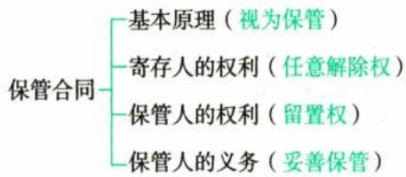

flowchart

```mermaid
graph TD
    A["保管合同"] --> B["基本原理（视为保管）"]
    A --> C["寄存人的权利（任意解除权）"]
    A --> D["保管人的权利（留置权）"]
    A --> E["保管人的义务（妥善保管）"]
```

#### 一、基本原理①

保管合同是保管人保管寄存人交付的保管物，并返还该物的合同。寄存人到保管人处从事购物、就餐、住宿等活动，将物品存放在指定场所的，视为保管，但是当事人另有约定或另有交易习惯的除外（《民法典》第888条）。

[萌主点拨] 保管合同属于可有偿可无偿的合同、实践性合同（保管合同自保管物交付时成立，但是当事人另有约定的除外）。

#### 二、寄存人的权利和义务

#### (一) 任意解除权

寄存人可以随时领取保管物。当事人对保管期限没有约定或约定不明确的，保管人可以随时请求寄存人领取保管物（无期限则无预期）；约定保管期限的，保管人无特别事由，不得请求寄存人提前领取保管物。

#### （二）支付保管费的义务

寄存人应当按照约定向保管人支付保管费。当事人对保管费没有约定或约定不明确，依据《民法典》第510条的规定仍不能确定的，视为无偿保管。

有偿的保管合同，寄存人应当按照约定的期限向保管人支付保管费。当事人对支付期限没有约定或约定不明确，依据《民法典》第510条的规定仍不能确定的，应当在领取保管物的同时支付。

#### 三、保管人的权利和义务

#### (一) 保管人的留置权

寄存人未按照约定支付保管费或其他费用的，保管人对保管物享有留置权，但当事人另有约定的除外。

#### (二) 保管人的义务①

#### 1. 妥善保管。

保管人应当妥善保管保管物。当事人可以约定保管场所或方法。除紧急情况或为维护寄存人利益外，不得擅自改变保管场所或方法。保管期内，因保管人保管不善造成保管物毁损、灭失的，保管人应当承担赔偿责任。但是，无偿保管人证明自己没有故意或重大过失的，不承担赔偿责任。

#### 2. 亲自保管。

保管人不得将保管物转交第三人保管，但是当事人另有约定的除外。保管人违反规定，将保管物转交第三人保管，造成保管物损失的，应当承担赔偿责任。

#### 四、孳息归属

保管期限届满或寄存人提前领取保管物的，保管人应当将原物及其孳息归还寄存人。

### 33/专题三十三 仓储合同

#### 复习提要

仓储合同规定在《民法典》第三编合同第二分编典型合同第二十二章（第904—918条），共15条。本专题主要涉及三个问题：1. 仓储合同的基本原理；2. 保管人的义务；3. 存货人的义务。仓储合同历年来仅直接考查1次，并非重点合同。只需重点学习仓储合同和保管合同的不同即可。

#### 一、基本原理①

仓储合同是保管人储存存货人交付的仓储物，存货人支付仓储费的合同。仓储合同自保管人和存货人意思表示一致时成立。

[萌主点拨]
保管合同 VS 仓储合同

<table><tr><td>项目</td><td>保管合同</td><td>仓储合同</td></tr><tr><td>合同性质</td><td>民事合同</td><td>商事合同</td></tr><tr><td>是否有偿</td><td>可有偿可无偿;若为无偿保管,保管人仅在故意或重大过失造成保管物毁损、灭失时才承担赔偿责任</td><td>有偿</td></tr><tr><td>是否要物</td><td>实践性合同</td><td>诺成性合同</td></tr><tr><td>归责原则</td><td>过错</td><td>过错</td></tr><tr><td>任意解除权</td><td>寄存人;无保管期间的双方</td><td>无储存期间的双方</td></tr></table>

[例] 孟某因装修房屋，把一批古书交朋友徐某代为保管，徐某将古书置于床下。一日，徐某楼上住户家水管被冻裂，水流至徐某家，致孟某的古书严重受损。徐某系无偿保管且无重大过失，不应赔偿。

#### 二、保管人的义务

#### 1. 对存货的验收义务。

保管人应当按照约定对入库仓储物进行验收。保管人验收时发现入库仓储物与约定不符合的，应当及时通知存货人。保管人验收后，发生仓储物的品种、数量、质量不符合约定的，保管人应当承担赔偿责任。

#### 2. 给付仓单的义务。

存货人交付仓储物的，保管人应当出具仓单、入库单等凭证。保管人应当在仓单上签字或盖章。仓单是提取仓储物的凭证。存货人或仓单持有人在仓单上背书并经保管人签字或盖章的，可以转让提取仓储物的权利。

#### 3. 接受检查。

保管人根据存货人或仓单持有人的要求，应当同意其检查仓储物或提取样品。

#### 4. 通知义务。

保管人发现入库仓储物有变质或其他损坏的，应当及时通知存货人或仓单持有人。

#### 5. 紧急处置权。

保管人发现入库仓储物有变质或其他损坏，危及其他仓储物的安全和正常保管的，应当催告存货人或仓单持有人作出必要的处置。因情况紧急，保管人可以作出必要的处置；但是，事后应当将该情况及时通知存货人或仓单持有人。

#### 6. 因保管不善的赔偿义务。

储存期内，因保管不善造成仓储物毁损、灭失的，保管人应当承担赔偿责任。因仓储物的性质、包装不符合约定或超过有效储存期造成仓储物变质、损坏的，保管人不承担赔偿责任。

#### 三、存货人的义务

#### 1. 如实说明义务。

储存易燃、易爆、有毒、有腐蚀性、有放射性等危险物品或易变质物品的，存货人应当说明该物品的性质，提供有关资料。存货人违反前述规定的，保管人可以拒收仓储物，也可以采取相应措施以避免损失的发生，因此产生的费用由存货人负担。保管人储存易燃、易爆、有毒、有腐蚀性、有放射性等危险物品的，应当具备相应的保管条件。

#### 2. 按时提取存货的义务。

储存期限届满，存货人或仓单持有人应当凭仓单、入库单等提取仓储物。存货人或仓单持有人逾期提取的，应当加收仓储费；提前提取的，不减收仓储费。当事人对储存期限没有约定或约定不明确的，存货人或仓单持有人可以随时提取仓储物，保管人也可以随时请求存货人或仓单持有人提取仓储物，但是应当给予必要的准备时间。储存期限届满，存货人或仓单持有人不提取仓储物的，保管人可以催告其在合理期限内提取，逾期不提取的，保管人可以提存仓储物。

### 34 专题三十四 委托合同

#### 复习提要

委托合同规定在《民法典》第三编合同第二分编典型合同第二十三章（第919—936条），共18条。本专题主要涉及三个问题：1. 委托合同的基本原理；2. 委托人的权利和义务；3. 间接代理。委托合同之所以重要就在于其与代理制度结合进行考查，在备考中务必牢记：法考就是在简单的重复中得到升华!!!

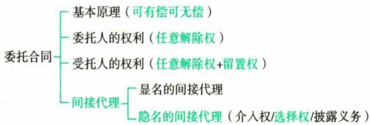

flowchart

```mermaid
graph TD
    A["委托合同"] --> B["基本原理（可有偿可无偿）"]
    A --> C["委托人的权利（任意解除权）"]
    A --> D["受托人的权利（任意解除权+留置权）"]
    A --> E["间接代理"]
    E --> F["显名的间接代理"]
    E --> G["隐名的间接代理（介入权/选择权/披露义务）"]
```

#### 一、基本原理

#### (一) 含义

委托合同是委托人和受托人约定，由受托人处理委托人事务的合同。委托合同是可有偿可无偿的合同。

#### (二) 范围

委托人可以特别委托受托人处理一项或数项事务，也可以概括委托受托人处理一切事务。

#### (三) 费用

委托人应当预付处理委托事务的费用。受托人为处理委托事务垫付的必要费用，委托人应当偿还该费用并支付利息。

#### (四) 共同委托

两个以上的受托人共同处理委托事务的，对委托人承担连带责任。

#### (五) 委托合同的终止

委托人死亡、终止或受托人死亡、丧失民事行为能力或终止的，委托合同终止；但是，当事人另有约定或根据委托事务的性质不宜终止的除外。

#### 二、委托人的权利和义务①

#### (一) 权利

1. 任意解除权（主观题）。

委托人或受托人可以随时解除委托合同。因解除合同造成对方损失的，除不可归责于该当事人的事由外，无偿委托合同的解除方应当赔偿因解除时间不当造成的直接损失，有偿委托合同的解除方应当赔偿对方的直接损失和合同履行后可以获得的利益（《民法典》第933条）。

一般认为，委托人任意解除权的法理基础在于委托合同是基于强烈的人身信赖关系而成立的合同。同时，委托事项可能随时发生变化导致委托事项的完成对于委托人而言毫无意义，这就产生了随时解除的需求。

[例] 甲委托乙为其购买木材，乙为此花去了一定的时间和精力，现甲不想要这批木材，于是电话告诉乙取消委托，乙不同意。甲可以单方取消委托，但需承担乙受到的损失。

2. 损失赔偿请求权。

（1）有偿委托合同。有偿的委托合同，因受托人的过错造成委托人损失的，委托人可以请求赔偿损失。
(2) 无偿委托合同。无偿的委托合同，因受托人的故意或重大过失造成委托人损失的，委托人可以请求赔偿损失。受托人超越权限造成委托人损失的，应当赔偿损失。

#### (二) 委托人支付报酬的义务

受托人完成委托事务的，委托人应当按照约定向其支付报酬。因不可归责于受托人的事由，委托合同解除或委托事务不能完成的，委托人应当向受托人支付相应的报酬。当事人另有约定的，按照其约定。

#### >> 随堂练习

某律师事务所指派吴律师担任某案件的一、二审委托代理人。第一次开庭后，吴律师感觉案件复杂，本人和该事务所均难以胜任，建议不再继续代理。但该事务所坚持代理。一审判决委托人败诉。下列哪些表述是正确的？(2013-3-60，多)②

A. 律师事务所有权单方解除委托合同，但须承担赔偿责任
B. 律师事务所在委托人一审败诉后不能单方解除合同
C. 即使一审胜诉，委托人也可解除委托合同，但须承担赔偿责任
D. 只有存在故意或者重大过失时，该律师事务所才对败诉承担赔偿责任

#### 三、间接代理①

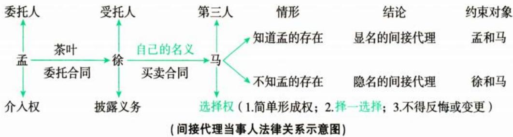

flowchart

```mermaid
graph TD
    A["委托人"] -->|孟| B["介入权"]
    A -->|委托合同| C["茶叶"]
    C --> D["被露义务"]
    E["受托人"] -->|徐| F["自己的名义买卖合同"]
    F --> G["第三人"]
    G --> H["马"]
    H --> I["选择权"]
    I --> J["1.简单形成权；2.择一选择；3.不得反悔或变更"]
    K["情形"] --> L["知道孟的存在"]
    K --> M["不知孟的存在"]
    N["结论"] --> O["显名的间接代理"]
    N --> P["隐名的间接代理"]
    Q["约束对象"] --> R["孟和马"]
    Q --> S["徐和马"]
```

#### （一）显名的间接代理

受托人以自己的名义，在委托人的授权范围内与第三人订立的合同，第三人在订立合同时知道受托人与委托人之间的代理关系的，该合同直接约束委托人和第三人；但是，有证据证明该合同只约束受托人和第三人的除外。

#### (二) 隐名的间接代理

受托人以自己的名义与第三人订立合同时，第三人不知道受托人与委托人之间的代理关系的，受托人因第三人的原因对委托人不履行义务，受托人应当向委托人披露第三人，委托人因此可以行使受托人对第三人的权利。但是，第三人与受托人订立合同时如果知道该委托人就不会订立合同的除外。

#### >> 随堂练习

甲委托乙销售一批首饰并交付，乙经甲同意转委托给丙。丙以其名义与丁签订买卖合同，约定将这批首饰以高于市场价10%的价格卖给丁，并赠其一批箱包。丙因此与戊签订箱包买卖合同。丙依约向丁交付首饰，但因戊不能向丙交付箱包，导致丙无法向丁交付箱包。丁拒绝向丙支付首饰款。下列哪一表述是正确的？(2011-3-4，单) $^{②}$

A. 乙的转委托行为无效
B. 丙与丁签订的买卖合同直接约束甲和丁
C. 丙应向甲披露丁，甲可以行使丙对丁的权利
D. 丙应向丁披露戊，丁可以行使丙对戊的权利

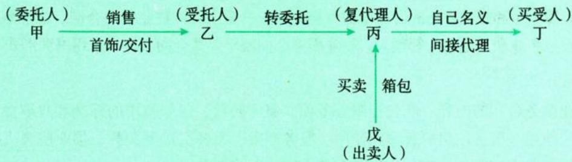

flowchart

```mermaid
graph TD
    A["(委托人) 甲"] -->|销售 首饰/交付| B["(受托人) 乙"]
    B -->|转委托| C["(复代理人) 丙"]
    C -->|自己名义 间接代理| D["(买受人) 丁"]
    C -->|买卖 箱包 戊 (出卖人)| E["戊"]
```

(当事人法律关系示意图)

### 35/专题三十五 物业服务合同

#### 复习提要

物业服务合同规定在《民法典》第三编合同第二分编典型合同第二十四章（第937—950条），共14条。本专题主要涉及六个问题：1. 物业服务合同的基本原理；2. 物业服务人的义务；3. 业主的义务；4. 物业服务合同的解除；5. 物业服务合同的续订；6. 不定期物业服务合同。物业服务合同系新增考点，备考过程中，仅需全面了解基础知识即可。

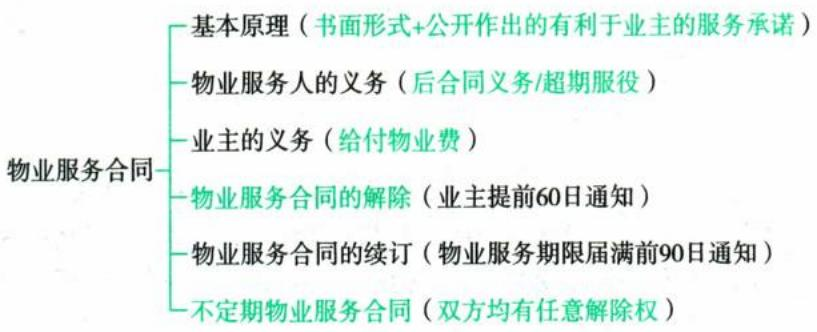

flowchart

```mermaid
graph TD
    A["物业服务合同"] --> B["基本原理（书面形式+公开作出的有利于业主的服务承诺）"]
    A --> C["物业服务人的义务（后合同义务/超期服役）"]
    A --> D["业主的义务（给付物业费）"]
    A --> E["物业服务合同的解除（业主提前60日通知）"]
    A --> F["物业服务合同的续订（物业服务期限届满前90日通知）"]
    A --> G["不定期物业服务合同（双方均有任意解除权）"]
```

#### 一、基本原理

#### (一) 含义

物业服务合同是物业服务人在物业服务区域内，为业主提供建筑物及其附属设施的维修养护、环境卫生和相关秩序的管理维护等物业服务，业主支付物业费的合同。物业服务人包括物业服务企业和其他物业管理人。物业服务合同属于要式合同，应当采用书面形式。

#### (二) 内容①

物业服务合同的内容一般包括服务事项、服务质量、服务费用的标准和收取办法、维修资金的使用、服务用房的管理和使用、服务期限、服务交接等条款。物业服务人公开作出的有利于业主的服务承诺，为物业服务合同的组成部分。

#### (三) 订立方式

建设单位依法与物业服务人订立的前期物业服务合同，以及业主委员会与业主大会依法选聘的物业服务人订立的物业服务合同，对业主具有法律约束力。

#### （四）前期物业服务合同的终止

建设单位依法与物业服务人订立的前期物业服务合同约定的服务期限届满前，业主委员会或业主与新物业服务人订立的物业服务合同生效的，前期物业服务合同终止。

#### 二、物业服务人的义务

#### (一) 亲自履行

物业服务人将物业服务区域内的部分专项服务事项委托给专业性服务组织或其他第三人的，应当就该部分专项服务事项向业主负责。物业服务人不得将其应当提供的全部物业服务转委托给第三人，或将全部物业服务支解后分别转委托给第三人。

#### (二)妥善合理履行

物业服务人应当按照约定和物业的使用性质，妥善维修、养护、清洁、绿化和经营管理物业服务区域内的业主共有部分，维护物业服务区域内的基本秩序，采取合理措施保护业主的人身、财产安全。对物业服务区域内违反有关治安、环保、消防等法律法规的行为，物业服务人应当及时采取合理措施制止、向有关行政主管部门报告并协助处理。

#### （三）公开报告义务

物业服务人应当定期将服务的事项、负责人员、质量要求、收费项目、收费标准、履行情况，以及维修资金使用情况、业主共有部分的经营与收益情况等以合理方式向业主公开并向业主大会、业主委员会报告。

#### (四) 后合同义务

物业服务合同终止的，原物业服务人应当在约定期限或合理期限内退出物业服务区域，将物业服务用房、相关设施、物业服务所必需的相关资料等交还给业主委员会、决定自行管理的业主或其指定的人，配合新物业服务人做好交接工作，并如实告知物业的使用和管理状况。原物业服务人违反前述规定的，不得请求业主支付物业服务合同终止后的物业费；造成业主损失的，应当赔偿损失。物业服务合同终止后，在业主或业主大会选聘的新物业服务人或决定自行管理的业主接管之前，原物业服务人应当继续（超期服役）处理物业服务事项，并可以请求业主支付该期间的物业费。

#### 三、业主的义务

#### （一）给付物业费的义务

业主应当按照约定向物业服务人支付物业费。物业服务人已经按照约定和有关规定提供服务的，业主不得以未接受或无需接受相关物业服务为由拒绝支付物业费（不得以放弃权利而不履行义务）。业主违反约定逾期不支付物业费的，物业服务人可以催告其在合理期限内支付；合理期限届满仍不支付的，物业服务人可以提起诉讼或申请仲裁。物业服务人不得采取停止供电、供水、供热、供燃气等方式催交物业费。

#### (二) 告知义务

业主装饰装修房屋的，应当事先告知物业服务人，遵守物业服务人提示的合理注意事项，并配合其进行必要的现场检查。业主转让、出租物业专有部分、设立居住权或依法改变共有部分用途的，应当及时将相关情况告知物业服务人。

#### 四、物业服务合同的解除①

业主依照法定程序共同决定解聘物业服务人的（一般表决事项），可以解除物业服务合同。决定解聘的，应当提前60日书面通知物业服务人，但是合同对通知期限另有约定的除外。解除合同造成物业服务人损失的，除不可归责于业主的事由外，业主应当赔偿损失。

#### 五、物业服务合同的续订

物业服务期限届满前，业主依法共同决定续聘的，应当与原物业服务人在合同期限届满前续订物业服务合同。物业服务期限届满前，物业服务人不同意续聘的，应当在合同期限届满前90日书面通知业主或业主委员会，但是合同对通知期限另有约定的除外。

#### 六、不定期物业服务合同

物业服务期限届满后，业主没有依法作出续聘或另聘物业服务人的决定，物业服务人继续提供物业服务的，原物业服务合同继续有效，但是服务期限为不定期。当事人可以随时解除不定期物业服务合同，但是应当提前60日书面通知对方。

##### 随堂练习

物业公司在小区内 A 栋设立了一个分类投放的垃圾桶供整栋业主使用，设立垃圾桶的地点距离 303 住户王某的卧室仅有 3 米远，垃圾桶招惹大量蚊虫，使得王某卧室的门窗完全无法打开，王某多次与物业公司交涉，请求更换垃圾桶摆放位置，但是物业公司均未予理会，王某遂向法院提起诉讼。关于本案，王某可以提出以下哪些请求（2023金题-2-1-22，多） $^{②}$

A. 请求物业公司排除妨害
B. 解除物业服务合同
C. 请求物业公司停止侵害
D. 请求物业公司赔礼道歉

### 36 专题三十六 行纪合同

#### 复习提要

行纪合同规定在《民法典》第三编合同第二分编典型合同第二十五章（第951—960条），共10条。本专题主要涉及两个问题：1. 行纪合同的基本原理；2. 行纪事务的处理。在历年的考试中，行纪合同共直接考查4次。在备考过程中，对于行纪合同的学习要结合代理制度，这也是该类合同为什么比较重要的原因。在学习过程中，绝大部分考生无法理解代理与行纪的区别所在。因此，命题者正是看到了这一点才频频“亮剑”。考生在备考过程中一定不要轻视该类合同，做到有备无患。

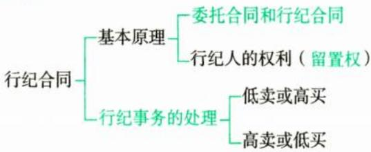

flowchart

```mermaid
graph TD
    A["行纪合同"] --> B["基本原理"]
    A --> C["行纪事务的处理"]
    B --> D["委托合同和行纪合同"]
    B --> E["行纪人的权利（留置权）"]
    C --> F["低卖或高买"]
    C --> G["高卖或低买"]
```

#### 一、基本原理

#### (一) 含义

行纪合同是行纪人以自己的名义为委托人从事贸易活动，委托人支付报酬的合同（《民法典》第951条）。例如，某配件厂（甲方）委托某销售公司（乙方）代销产品，乙方接受甲方的委托并以自己的名义代甲方销售，代销价款归甲方，乙方收取代销费。在这个法律关系中，甲方为委托人，乙方为行纪人。

#### (二) 特征

1. 行纪人以自己的名义为委托人办理业务。

[萌主点拨]
行纪合同 VS 间接代理

<table><tr><td>项目</td><td>行纪合同</td><td>间接代理</td></tr><tr><td>相同点</td><td>以自己的名义签订合同</td><td>以自己的名义签订合同</td></tr><tr><td>是否需要特定资质</td><td>需要</td><td>不需要</td></tr><tr><td>委托人与第三人是否直接发生关系</td><td>不发生</td><td>可能发生,可能不发生</td></tr></table>

2. 除当事人另有约定外，行纪人处理委托事务支出的费用，由行纪人负担。

3. 除当事人另有约定外，行纪人可以自买自卖。

4. 除当事人另有约定外，行纪人与第三人订立合同的，行纪人对该合同直接享有权利、承担义务。第三人不履行义务致使委托人受到损害的，行纪人应当承担赔偿责任。

[萌主点拨]
委托合同 VS 行纪合同

<table><tr><td>项目</td><td>委托合同</td><td>行纪合同</td></tr><tr><td>相同点1</td><td>提供劳务</td><td>提供劳务</td></tr><tr><td>相同点2</td><td>以信任为基础</td><td>以信任为基础</td></tr><tr><td>相同点3</td><td>以处理一定事务为目的</td><td>以处理一定事务为目的</td></tr><tr><td>合同性质</td><td>民事合同</td><td>商事合同</td></tr><tr><td>是否属于合同当事人</td><td>除特殊情况(间接代理)外,受托人不得以自己的名义与第三人订立合同;合同订立后,受托人不是合同当事人</td><td>行纪人以自己的名义与第三人订立合同,合同订立后,行纪人是合同当事人</td></tr><tr><td>费用负担</td><td>委托人1</td><td>有约从约,无约行纪人自担2</td></tr><tr><td>自买自卖</td><td>不得(否则构成代理权滥用)</td><td>有约从约;无约可以</td></tr><tr><td>有偿否</td><td>可有偿可无偿</td><td>有偿</td></tr><tr><td>注意义务程度</td><td>按有偿或无偿而有所不同,在无偿委托情形下,受托人仅在故意或重大过失给委托人造成损失的才承担责任</td><td>只要未尽注意义务致委托物毁损灭失的,就应当负赔偿责任</td></tr><tr><td>任意解除权</td><td>双方</td><td>双方</td></tr></table>

#### （三）行纪人的留置权

行纪人完成或部分完成委托事务的，委托人应当向其支付相应的报酬。委托人逾期不支付报酬的，行纪人对委托物享有留置权，但是当事人另有约定的除外。

#### 二、行纪事务的处理③

行纪人低于委托人指定的价格卖出或高于委托人指定的价格买入的，应当经委托人同意；未经委托人同意，行纪人补偿其差额的，该买卖对委托人发生效力。行纪人高于委托人指定的价格卖出或低于委托人指定的价格买入的，可以按照约定增加报酬。没有约定或约定不明确，依据《民法典》第510条的规定仍不能确定的，该利益属于委托人。委托人对价格有特别指示的，行纪人不得违背该指示卖出或买入。

[例] 孟某欲将自己价值60万元的宝马轿车一辆出卖，但不知如何出卖，遂于2025年5月10日与北京优信二手车行订立行纪合同。双方约定：“如优信车行以50万元将该车卖出，孟某将支付5万元报酬。”对于其他事项双方均未作特别约定。根据上述案情及示意图，请回答如下问题：

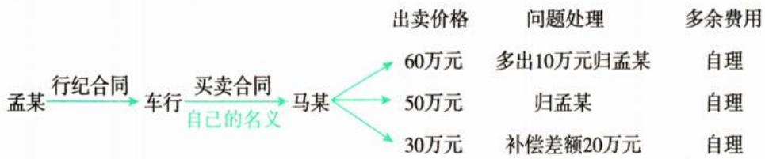

flowchart

```mermaid
graph LR
    A["孟某"] -->|行纪合同| B["车行"]
    B -->|买卖合同\n自己的名义| C["马某"]
    C --> D["60万元"]
    C --> E["50万元"]
    C --> F["30万元"]
    D --> G["多出10万元归孟某"]
    E --> H["归孟某"]
    F --> I["补偿差额20万元"]
    G --> J["自理"]
    H --> K["自理"]
    I --> L["自理"]
    M["出卖价格"] --> C
    N["问题处理"] --> G
    O["多余费用"] --> J
```

##### (行纪合同当事人法律关系示意图)

①优信车行在出卖孟某宝马轿车时，以谁的名义与马某签订合同？

答：自己的名义。

②如优信车行以60万元将孟某的宝马轿车卖给马某，多卖出的10万元归谁？

答：孟某。

③如优信车行以60万元将孟某的宝马轿车卖给马某，是否可以请求孟某多支付报酬？

答：不可以。

④如优信车行以60万元将孟某的宝马轿车卖给马某，为此多支付1万元费用，该费用是否可以请求孟某支付？

答：不能。

⑤如优信车行以30万元将孟某的宝马轿车卖给马某，孟某如何救济自己的权利？

答：请求优信车行补偿差额20万元。

⑥如马某购买该宝马轿车后发现该车里程表被改过且发动机有大修情形。经查，孟某在与优信车行签订合同时隐瞒了上述事实。请问：马某应请求谁承担责任？

答：优信车行（合同相对性原理）。

### 37 专题三十七 中介合同

#### 复习提要

中介合同（曾经的居间合同/中国古代称为“牙行”“牙纪”，近代称为“掮客”“纤手”）规定在《民法典》第三编合同第二分编典型合同第二十六章（第961—966条），共6条。本专题主要涉及三个问题：1. 中介合同的基本原理；2. 中介事务的处理；3. “跳单”。该合同在历年考试中直接考查3次。在备考中，应重点掌握新增制度，即“跳单”。

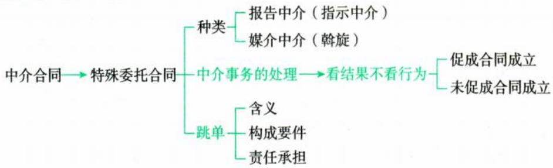

flowchart

```mermaid
graph TD
    A["中介合同"] --> B["特殊委托合同"]
    B --> C["种类"]
    C --> D["报告中介（指示中介）"]
    C --> E["媒介中介（斡旋）"]
    B --> F["中介事务的处理"]
    F --> G["看结果不看行为"]
    G --> H["促成合同成立"]
    G --> I["未促成合同成立"]
    B --> J["跳单"]
    J --> K["含义"]
    J --> L["构成要件"]
    J --> M["责任承担"]
```

#### 一、基本原理

#### (一) 含义

中介合同是中介人向委托人报告订立合同的机会或提供订立合同的媒介服务，委托人支付报酬的合同（服务性合同）。此处的“合同”既可以是有名合同（如买卖合同、租赁合同、保险合同等），也可以是无名合同①（《民法典》第961条）。中介合同包括如下特征：

1. 中介合同以促成委托人和第三人订立合同为目的。中介合同的标的是中介人进行中介活动的结果（看结果而不看行为）。
2. 中介人在合同关系中处于介绍人的地位。中介人是交易双方当事人之间起介绍、协助和“牵线搭桥”作用的中间人，不能以自己的名义作出或代委托人作出意思表示，并不参与委托人和第三人之间的合同。

[萌主点拨] 我国《民法典》并没有对中介人的资格进行限制，自然人也可以进行中介服务，但是中介合同较多地运用在商业交易中，一般都是专业的中介服务机构作为中介人。

中介合同属于特殊的委托合同。因此，可以参照适用委托合同的有关规定（《民法典》第966条）。

#### (二) 种类

#### 1. 报告中介。

报告订立合同的机会，是指中介人接受委托后，将收集的信息报告给委托人，从而提供订立合同的机会，又称为“报告中介”或“指示中介”。

#### 2. 媒介中介。

提供订立合同的媒介服务，是指中介人接受委托后，不仅要报告订约机会，还要居中斡旋，代为传达委托人与第三人的意思，努力促成其合同成立，又称为“媒介中介”。

[例] 孟某委托某置业公司将其一套公寓出售，为此双方签订了合同。置业公司将孟某委托的内容登记在本公司房屋买卖的信息网上。马某看到该信息后，通过置业公司与孟某签订了买卖合同。孟某与置业公司签订的合同为中介合同。

#### （三）中介人的报告义务

中介人应当就有关订立合同的事项向委托人如实报告。中介人故意隐瞒与订立合同有关的重要事实或提供虚假情况，损害委托人利益的，不得请求支付报酬并应当承担赔偿责任（《民法典》第962条）。

[例] 委托人想购买一套房屋用于自住，委托房产中介寻找合适的房屋，该房产中介向委托人提供了房屋的具体位置、面积大小、户型等基本信息。卖家明确告知房产中介该房屋为“凶宅”，如果委托人知晓该房屋为“凶宅”，是不可能与之订立房屋买卖合同的。但是房产中介却故意隐瞒该重要事实，或当委托人询问是否为“凶宅”时提供虚假情况，告知委托人该房屋不是“凶宅”。本案中，房产中介违反了中介人的如实告知义务，违反了诚信原则。

#### 二、中介事务的处理①

#### （一）促成合同成立（报酬请求权）

中介合同中，委托人的报酬给付义务是附条件的，该给付义务针对给付结果（效果），即促成委托人和第三人缔结合同（条件成就）。

中介人促成合同成立的，委托人应当按照约定支付报酬（佣金/中介费）。对中介人的报酬没有约定或约定不明确，依据《民法典》第510条的规定仍不能确定的，根据中介人的劳务合理确定②。因中介人提供订立合同的媒介服务而促成合同成立的，由该合同的当事人平均负担中介人的报酬③。中介人促成合同成立的，中介活动的费用，由中介人负担（《民法典》第963条）。

[萌主点拨] 促成合同成立，有报酬，无费用。

① 考查 2 次，抓住重点。

② “合理”应考虑如下因素综合判断，如中介人所付出的时间、精力、人力、物力、财力、中介事务的难易程度以及中介人的行为对于合同成立所起到的作用等因素，根据公平原则合理确定。

③ 一般而言，报告中介的报酬由委托人支付；媒介中介的报酬由订立合同的当事人分担。

#### （二）未促成合同成立（必要费用请求权）

中介人的报酬请求权是中介人提供中介服务成果的对价，没有成果即没有报酬请求权。中介活动的必要费用原则上由中介人自己负担，因为中介人往往都是以营利为目的的经营者，中介人是专门从事中介服务的人。既然是经营，就必然会有商业风险。如果中介人没有促成交易，他所付出的代价，即支出的成本费用就算是商业风险。

中介人未促成合同成立的，不得请求支付报酬；但是，可以按照约定请求委托人支付从事中介活动支出的必要费用（如交通费）（《民法典》第964条）。

[萌主点拨] 未促成合同成立，无报酬，可以有费用可以无费用。

[例] 孟某委托甲中介公司购买一套房屋，甲中介公司介绍房主马某，最终因为孟某对房屋质量不满意，没有与马某订立房屋买卖合同。但是在看房过程中，孟某发现马某家中有一架钢琴，表示自己正想买一架钢琴给孩子，而恰巧马某正想将该闲置的钢琴出售，双方一拍即合订立了钢琴买卖合同。此时，甲中介公司不得请求孟某支付报酬。因为二者签订的是钢琴买卖合同而非房屋买卖合同，不具有“同一性”。

#### 三、跳单①

#### (一) 含义

跳单，又称“跳中介”，是在中介人向委托人提供中介服务后，委托人利用中介人提供的服务，而甩开中介人私下与相对人订立合同，或另行委托其他中介人与相对人订立合同的现象（《民法典》第965条）。

#### (二) 构成要件

跳单违约的构成要件有三：

1. 委托人接受了中介人的中介服务。

2. 委托人利用了中介人提供的信息机会或媒介服务（具有因果关系）。

如果中介人提供的信息是公开的、委托人可以轻易获得的信息，中介人的报告对委托人而言毫无价值的，委托人和第三人订立合同就不能认定利用了中介人提供的交易机会或媒介服务。但是，委托人要对其在中介人提供订约信息前就已经知晓第三人有关情况，并未利用中介人提供的交易机会或媒介服务承担举证责任。

实践中，委托人委托多个中介人从事中介活动，多个中介人为其提供交易信息或媒介服务，委托人最后选择其中一个中介人，通过其和第三人订立合同。此时，对其他中介人而言并不构成“跳单”，因为委托人具有选择最满意、最合适的中介人为其提供优质服务并通过其和第三人订立合同的权利②。

3. 委托人绕开中介人直接和第三人订立合同。

#### (三) 责任承担

“跳单”行为属于违反诚信原则和公平原则的行为。委托人在接受中介人的服务后，利用中介人提供的交易机会或媒介服务，绕开中介人直接订立合同的，应当向中介人支付报酬。

### 38 专题三十八 合伙合同

#### 复习提要

合伙合同规定在《民法典》第三编合同第二分编典型合同第二十七章（第967—978条），共12条。本专题主要涉及九个问题：1. 合伙合同的基本原理；2. 合伙事务执行；3. 合伙的利润分配和亏损分担；4. 合伙债务的承担；5. 合伙财产份额的转让；6. 代位权行使的禁止；7. 不定期合伙；8. 合伙合同的终止；9. 剩余财产的分配。合伙合同系新增制度，在备考中仅需重点掌握基础内容即可。

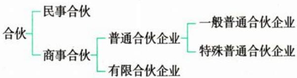

flowchart

```mermaid
graph TD
    A["合伙"] --> B["民事合伙"]
    A --> C["商事合伙"]
    C --> D["普通合伙企业"]
    C --> E["有限合伙企业"]
    D --> F["一般普通合伙企业"]
    D --> G["特殊普通合伙企业"]
```

#### 一、基本原理

#### (一) 含义

合伙合同是两个以上合伙人为了共同的事业目的，订立的共享利益、共担风险的协议。

#### （二）出资义务

合伙人应当按照约定的出资方式、数额和缴付期限，履行出资义务。

#### (三) 合伙财产

合伙人的出资、因合伙事务依法取得的收益和其他财产，属于合伙财产。

#### (四) 财产分割

合伙合同终止前，合伙人不得请求分割合伙财产。

#### 二、合伙事务执行①

合伙事务由全体合伙人共同执行。合伙人就合伙事务作出决定的，除合伙合同另有约定外，应当经全体合伙人一致同意。按照合伙合同的约定或全体合伙人的决定，可以委托一个或数个合伙人执行合伙事务；其他合伙人不再执行合伙事务，但是有权监督执行情况。

合伙人分别执行合伙事务的，执行事务合伙人可以对其他合伙人执行的事务提出异议；提出异议后，其他合伙人应当暂停该项事务的执行。合伙人不得因执行合伙事务而请求支付报酬，但是合伙合同另有约定的除外。

##### 随堂练习

甲乙丙丁四人签订合伙合同，但未登记为合伙企业。甲乙丙推选丁作为合伙事务的执行人，丁在执行合伙事务的过程中，与戊发生口角，并将戊打伤，现在戊欲追究甲乙丙丁及合伙的责任，根据《民法典》，下列哪些说法是正确的？（2020金题-2-1-31，多）①

A. 甲乙丙不应与丁承担连带责任
B. 应由丁自己承担责任
C. 应由合伙承担用人单位责任
D. 应由合伙与丁承担连带责任

#### 三、利润分配和亏损分担

合伙的利润分配和亏损分担，按照合伙合同的约定办理；合伙合同没有约定或约定不明确的，由合伙人协商决定；协商不成的，由合伙人按照实缴出资比例分配、分担；无法确定出资比例的，由合伙人平均分配、分担。

[萌主点拨] 一约二商三实缴，实在不行平均分。

#### 四、债务承担

合伙人对合伙债务承担连带责任。清偿合伙债务超过自己应当承担份额的合伙人，有权向其他合伙人追偿（内部关系）。

[萌主点拨] 对外连带，对内按份。

#### 五、财产份额转让

除合伙合同另有约定外，合伙人向合伙人以外的人转让其全部或部分财产份额的，须经其他合伙人一致同意。

[萌主点拨] 有约从约，无约，全体一致同意。

#### 六、代位权行使的禁止

合伙人的债权人不得代位行使合伙人依照《民法典》合伙合同一章规定和合伙合同享有的权利，但是合伙人享有的利益分配请求权除外。

[萌主点拨] 人身属性的权利不得代位；财产属性的权利，可以代位。

#### 七、不定期合伙

合伙人对合伙期限没有约定或约定不明确，依据《民法典》第510条的规定仍不能确定的，视为不定期合伙。合伙期限届满，合伙人继续执行合伙事务，其他合伙人没有提出异议的，原合伙合同继续有效，但是合伙期限为不定期。合伙人可以随时解除不定期合伙合同，但是应当在合理期限之前通知（诚信原则）其他合伙人。

#### 八、终止

合伙人死亡、丧失民事行为能力或终止的，合伙合同终止；但是，合伙合同另有约定或根据合伙事务的性质不宜终止的除外。

#### 九、剩余财产分配

合伙合同终止后，合伙财产在支付因终止而产生的费用以及清偿合伙债务后有剩余的，依据《民法典》第972条的规定进行分配。

### 39 专题三十九 旅游合同

#### 复习提要

本专题主要涉及两个问题：1. 旅游合同的基本原理；2. 旅游合同权利义务的转让。其中，旅游合同权利义务的转让为该部分的重点，在备考过程中，抓住重点即可。

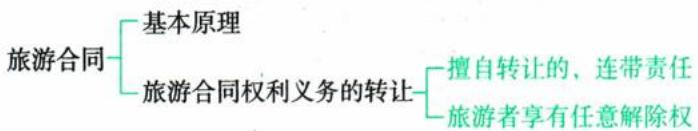

flowchart

```mermaid
graph TD
    A["旅游合同"] --> B["基本原理"]
    A --> C["旅游合同权利义务的转让"]
    C --> D["擅自转让的，连带责任"]
    C --> E["旅游者享有任意解除权"]
```

#### 一、基本原理

旅游合同是旅游者支付旅游费用，旅游经营者提供旅游服务的民事合同。

#### 二、旅游合同权利义务的转让①

1. 旅游经营者擅自转让业务及其法律后果。

旅游合同系具有强烈人身信赖关系的合同，未经旅游者同意，旅游经营者不得擅自将旅游业务转让给其他旅游经营者。旅游经营者将旅游业务转让给其他旅游经营者，旅游者不同意转让，请求解除旅游合同、追究旅游经营者违约责任的，法院应予支持。旅游经营者擅自将其旅游业务转让给其他旅游经营者，旅游者在旅游过程中遭受损害，请求与其签订旅游合同的旅游经营者和实际提供旅游服务的旅游经营者承担连带责任的，法院应予支持。

2. 旅游者权利义务的转让和任意解除权。

除合同性质不宜转让或合同另有约定之外，在旅游行程开始前的合理期间内，旅游者将其在旅游合同中的权利义务转让给第三人，请求确认转让合同效力的，法院应予支持。因前述原因，旅游经营者请求旅游者、第三人给付增加的费用或旅游者请求旅游经营者退还减少的费用的，法院应予支持。旅游行程开始前或进行中，因旅游者单方解除合同，旅游者请求旅游经营者退还尚未实际发生的费用，或旅游经营者请求旅游者支付合理费用的，法院应予支持。

##### 随堂练习

甲参加乙旅行社组织的旅游活动。未经甲和其他旅游者同意，乙旅行社将本次业务转让给当地的丙旅行社。丙旅行社聘请丁公司提供大巴运输服务。途中，由于丁公司司机黄某酒后驾驶与迎面违章变道的个体运输户刘某货车相撞，造成甲受伤。甲的下列哪些请求能够获得法院的支持？(2014-3-67，多)①

A. 请求丁公司和黄某承担连带赔偿责任
B. 请求黄某与刘某承担连带赔偿责任
C. 请求乙旅行社和丙旅行社承担连带赔偿责任
D. 请求刘某承担赔偿责任

PART

# 第五部分

#### 人格权编

人格权编（第989—1039条）共51条，约占整个《民法典》的4%。包括6章，分别是：

第一章 一般规定（第 989—1001 条，共 13 条）；

第二章 生命权、身体权和健康权（第 1002—1011 条，共 10 条）；

第三章 姓名权和名称权（第 1012—1017 条，共 6 条）；

第四章 肖像权（第 1018—1023 条，共 6 条）；

第五章 名誉权和荣誉权（第 1024—1031 条，共 8 条）；

第六章 隐私权和个人信息保护（第 1032—1039 条，共 8 条）。

## 40 专题四十 人格权

#### 复习提要

本专题主要涉及四个问题：1. 人格权的基本原理；2. 一般人格权；3. 具体人格权；4. 个人信息保护。考试的重点是具体人格权侵权类型的判断，在备考中应当重点关注。

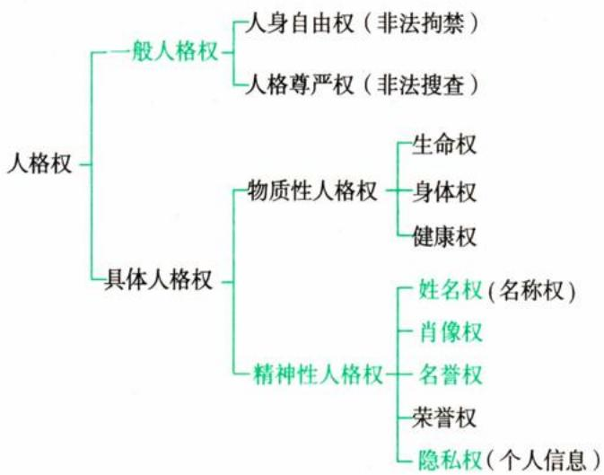

flowchart

```mermaid
graph TD
    A["人格权"] --> B["一般人格权"]
    A --> C["具体人格权"]
    B --> D["人身自由权（非法拘禁）"]
    B --> E["人格尊严权（非法搜查）"]
    C --> F["物质性人格权"]
    C --> G["精神性人格权"]
    F --> H["生命权"]
    F --> I["身体权"]
    F --> J["健康权"]
    G --> K["姓名权（名称权）"]
    G --> L["肖像权"]
    G --> M["名誉权"]
    G --> N["荣誉权"]
    G --> O["隐私权（个人信息）"]
```

#### 一、人格权的基本原理

#### (一) 性质

人格权不得放弃、转让、继承。

#### (二) 许可使用

人格权没有直接财产内容。但是，民事主体可以将自己的姓名、名称、肖像等许可他人使用，但是依照法律规定或根据其性质不得许可的除外。

#### （三）行权期间限制

人格权受到侵害的，受害人有权依照《民法典》和其他法律的规定请求行为人承担民事责任。受害人的停止侵害、排除妨碍、消除危险、消除影响、恢复名誉、赔礼道歉请求权，不适用诉讼时效的规定。

#### （四）侵权预先保护

民事主体有证据证明行为人正在实施或即将实施侵害其人格权的违法行为，不及时制止将使其合法权益受到难以弥补的损害的，有权依法向法院申请采取责令行为人停止有关行为的措施。

#### （五）侵权责任承担的裁量

认定行为人承担侵害除生命权、身体权和健康权外的人格权的民事责任，应当考虑行为人和受害人的职业、影响范围、过错程度，以及行为的目的、方式、后果等因素。

#### (六) 合理使用

为公共利益实施新闻报道、舆论监督等行为的，可以合理使用民事主体的姓名、名称、肖像、个人信息等；使用不合理侵害民事主体人格权的，应当依法承担民事责任。

#### (七) 责任承担

行为人因侵害人格权承担消除影响、恢复名誉、赔礼道歉等民事责任的，应当与行为的具体方式和造成的影响范围相当。行为人拒不承担前述规定的民事责任的，法院可以采取在报刊、网络等媒体上发布公告或公布生效裁判文书等方式执行，产生的费用由行为人负担。

#### 二、一般人格权

#### (一) 人身自由权

#### 1. 主体。

人身自由权的主体系自然人。

#### 2. 内容。

以非法拘禁等方式剥夺、限制他人的行动自由的，受害人有权依法请求行为人承担民事责任。

#### (二) 人格尊严权

#### 1. 主体。

人格尊严，是指与自然人的尊严密切相关的以精神性人格利益为内容的人格权。人格尊严权的主体系自然人。

#### 2. 内容。

非法搜查他人身体的，受害人有权依法请求行为人承担民事责任。

[萌主点拨] 妻子擅自终止妊娠的，不侵犯丈夫的人格尊严权。

[例] 超市怀疑顾客甲盗窃超市的商品，保安将其带至办公室搜身，无果。甲因此郁郁寡欢。超市侵害了甲的人格尊严权。

#### 三、具体人格权

#### (一) 物质性人格权 $^{①}$

#### 1. 生命权。

#### (1) 主体。

生命权的主体系自然人。

#### (2) 内容。

生命权的内容系生命安全和生命维持。

#### (3) 侵权形态。

实施加害行为致人死亡（生命不可逆转的丧失），又无违法阻却事由。受害人自杀的，行为人不构成侵权。但是，协助自杀构成侵权行为（如医院帮助病人安乐死）。

#### 2. 身体权。

#### (1) 主体。

身体权的主体系自然人。

#### (2) 内容。

身体权的内容系身体完整性和行动自由。

法律意义上的身体，是指自然人生理组织的整体，即躯体的整个构造和附属于躯体的所有部分。如头颅、躯干、肢体和附属部分的头发、指甲等。至于装配的人工制作的残缺身体部分的代替物，如假肢等，能否构成身体的组成部分，应当区别情况：装配物已构成身体不可分离的一部分的，应属于身体，如人工心脏瓣膜；装配物可以自由装卸的，则不属于身体，如假牙。这里的自由装卸是指社会一般人能够进行，如必须由专业人员依照严格的医学操作规程进行，否则，可能造成健康损害或生命丧失的人工装置，应视为身体的组成部分。

#### (3) 侵权形态。

实施加害行为致使受害人身体的完整性遭受破坏和行动自由受到限制。偷剪他人头发、指甲、医生误摘病人器官、医院手术后留下疤痕等属于典型的身体权侵权行为。

[例] 甲向乙求婚，遭拒绝，甲恼羞成怒剪掉了乙飘逸的长发，乙因此忧郁成疾。甲侵害了乙的身体权。

#### 3. 健康权。

#### (1) 主体。

健康权的主体系自然人。

#### (2) 内容。

健康权的内容系生理、心理机能（功能）的正常运转和发挥。

#### (3) 侵权形态。

实施加害行为致使受害人生理、心理机能（功能）无法正常运转和发挥。

#### (二) 精神性人格权

#### 1. 姓名权和名称权①。

#### (1) 含义。

姓名权，是指自然人决定、使用和依照规定改变自己姓名的权利。姓名权属于标表性人格利益，以文字标示特定人。

#### (2) 主体。

姓名权的主体系自然人。法人和非法人组织享有的是名称权（商号权），具体包括5项权能，分别是：决定权、使用权、变更权、转让权和许可他人使用权。

[例] 甲公司买通乙公司员工，获得乙公司的产品制造方法及客户名单等保密信息（商业秘密）。其后甲公司以乙公司的名义与乙公司的客户进行交易。甲公司的行为侵犯了乙公司的名称权和商业秘密。

#### (3) 客体。

姓名权的保护客体应作广义解释。具有一定社会知名度，被他人使用足以造成公众混淆的笔名、艺名、网名、译名、字号、姓名和名称的简称等，参照适用姓名权和名称权保护的有关规定。

#### (4) 内容。

姓名权的内容包括4项，分别是决定权、使用权、变更权和许可权。人之姓名为其人格之表现，故如何命名为人民之自由；自然人应当随父姓或母姓，但是有下列情形之一的，可以在父姓和母姓之外选取姓氏：选取其他直系长辈血亲的姓氏；因由法定扶养人以外的人扶养而选取扶养人姓氏；有不违背公序良俗的其他正当理由。少数民族自然人的姓氏可以遵从本民族的文化传统和风俗习惯。

#### (5) 侵权形态。

侵犯姓名权和名称权的形态包括三类：

干涉，是指限制、阻挠和干预权利主体自主决定、使用、变更和许可他人使用姓名或名称。实践中，较为常见的情形包括父母对未成年子女姓名决定权的干涉以及不当干涉他人使用与自己相同姓名的行为。

盗用，是指未经允许，为谋取不正当利益，擅自使用他人姓名（仅用姓名未用身份）。

[例] 甲用其拾得的乙的身份证在丙银行办理了信用卡，并恶意透支，致使乙的姓名被列入银行不良信用记录名单。经查，丙银行在办理发放信用卡之前，曾通过甲在该行留下的乙的电话（实为甲的电话）核实乙是否申请办理了信用卡。根据我国现行法律规定，甲侵犯了乙的姓名权。

假冒，又称冒用，即冒名顶替，是指擅自冒充他人的姓名实施行为。实质是造成姓名与人本身的同一性的混淆（既用姓名又用身份）。实践中，较为常见的情形包括冒用某知名人士的姓名从事活动或利用自己与被冒名人的某些相似性或容易混淆而冒充他人进行活动，如冒名上大学、冒名领取稿酬等。

[例] 甲、乙系父子关系。乙在注册公司时，将其父甲登记为股东之一，后被甲发现。因甲不同意，双方发生争执并诉至法院。乙的行为侵犯了甲的姓名权。

[萌主点拨] 披露真实姓名、曾用名不属于侵犯姓名权。原因在于姓名是一种区别符号，起名字就是为了让人用的。

#### 2. 肖像权①。

#### (1) 含义。

肖像权，是指自然人所享有的对自己的肖像上所体现的人格利益为内容的一种人格权。肖像权属于标表性人格利益，以形象标示特定人。

#### (2) 主体。

肖像权的主体系自然人。游戏、动漫中的虚拟角色形象不享有肖像权，至于其包含的具体元素，如角色的面部、身体、五官、肤色等特征具有独创性的，则属于美术作品，受我国《著作权法》的保护。

#### (3) 内容。

肖像权的内容包括4项，分别是制作、使用、公开和许可他人使用。

制作，是指通过拍摄、雕塑、制作头像硬币等方式再现自然人的外部形象，他人未经同意不得制作其肖像。

使用，是指自然人有权决定是否在书籍、报刊、电影、电视、网络等载体中使用其肖像，包括发表、复制、发行、出租、展览等使用方式。

[例] 某电视演员因一儿童电视剧而出名，某公司未经该演员许可将印有其表演形象的宣传海报大量用于玩具、书包、文具等儿童产品的包装和装潢上。该公司的行为构成对该演员肖像权的侵犯。因为表演形象不仅是电视剧中的一个镜头，同时也承载了表演者自己的个人形象，具有双重的识别性，相互不能替代，一般公众可以通过表演形象分辨出其表演者。因此，将印有其表演形象的宣传海报用于儿童产品的包装和装潢上属于使用权利人的肖像，构成了对该表演者肖像权的侵犯。

公开，是指以广告宣传、装饰橱窗、用作商标等方式将自然人的肖像公之于众。

许可他人使用，是指自然人同意他人使用自己的肖像，这其中也包括以商业为目的使用肖像。

##### [萌主点拨] 明星代言

当事人对肖像许可使用合同中关于肖像使用条款的理解有争议的，应当作出有利于肖像权人的解释。当事人对肖像许可使用期限没有约定或者约定不明确的，任何一方当事人可以随时解除肖像许可使用合同，但是应当在合理期限之前通知对方。

当事人对肖像许可使用期限有明确约定，肖像权人有正当理由的，可以解除肖像许可使用合同，但是应当在合理期限之前通知对方。因解除合同造成对方损失的，除不可归责于肖像权人的事由外，应当赔偿损失。对姓名等的许可使用，参照适用肖像许可使用的有关规定。对自然人声音的保护，参照适用肖像权保护的有关规定。

#### (4) 客体。

肖像是通过影像、雕塑、绘画等方式在一定载体上所反映的特定自然人可以被识别的外部形象。外部形象并不局限于面部形象。只要能够呈现出自然人的外部形象，并且可以使他人清楚识别出该外部特征属于某个特定的自然人。那么，这种外部形象就属于肖像。

[例] 美国篮球明星迈克尔·乔丹诉乔丹体育商标争议行政纠纷案中，被诉侵害乔丹肖像权的商标上有一名正在打篮球的自然人的剪影。最高人民法院认为，涉案商标没有明确体现乔丹的个人特征，不具备可识别性。因此，不构成侵害肖像权。

#### (5) 侵权形态。

侵害肖像权的行为属于一般侵权行为，具体形态包括：

任何组织或个人（不特定的一般主体）不得以丑化、污损，或利用信息技术手段伪造（AI换脸技术）等方式侵害他人的肖像权。未经肖像权人同意，不得制作、使用、公开肖像权人的肖像，但是法律另有规定的除外。

未经肖像权人同意，肖像作品权利人（特定主体）不得以发表、复制、发行、出租、展览等方式使用或公开肖像权人的肖像。

[例] 摄影师孟某为女明星刘某拍摄了一套艺术照。此时，摄影师孟某系肖像作品权利人（著作权人），对艺术照享有著作权；女明星刘某对艺术照享有肖像权。如肖像作品权利人（著作权人）孟某欲行使发表权、复制权、发行权、出租权、展览权必须经刘某同意。否则，孟某的行为即侵犯刘某的肖像权。

#### (6) 合理使用①。

为个人学习、艺术欣赏、课堂教学或科学研究，在必要范围内使用肖像权人已经公开的肖像。

为实施新闻报道，不可避免地制作、使用、公开肖像权人的肖像；新闻媒体报道见义勇为的英雄模范时，不可避免地制作、使用、公开英雄模范的肖像。在此情况下，不构成侵害肖像权。

为依法履行职责，国家机关在必要范围内制作、使用、公开肖像权人的肖像。

为展示特定公共环境，不可避免地制作、使用、公开肖像权人的肖像。旅行的游客在人群密集的风景点拍摄以风景为画面主体而不是以特定自然人为画面主体的风景照，不可避免地会将在场其他游客的肖像摄入照片之中，此类行为不存在不正当性，不属于侵害肖像权的行为。

为维护公共利益或肖像权人合法权益，制作、使用、公开肖像权人的肖像的其他行为。“寻人启事”不构成侵犯肖像权。

#### 3. 名誉权 $^{②}$ 。

#### (1) 含义。

名誉权，是指民事主体对自身名誉享有不受他人侵害的权利。

#### (2) 主体。

名誉权的主体系自然人、法人和非法人组织，即民事主体均享有名誉权。

##### [萌主点拨]

自然人名誉权 VS 法人和非法人组织名誉权

<table><tr><td>项目</td><td>自然人</td><td>法人和非法人组织</td></tr><tr><td>内容</td><td>自然人的名誉主要围绕其个人素质,如品德、才能等因素,是人格尊严的体现。通常而言,品德和才能是自然人的社会评价</td><td>组织体的社会评价主要围绕其信用、生产经营能力和经营状况等因素,与财产性利益联系更为密切</td></tr><tr><td>受侵害方式</td><td>暴力侮辱只能对自然人名誉权造成侵害</td><td>组织体的名誉权通常因商业信誉、商品信誉受损而受损。同时,侵害法人名誉权的行为可能构成不正当竞争行为</td></tr><tr><td>损害后果</td><td>有精神损害赔偿</td><td>无精神损害赔偿</td></tr></table>

#### (3) 客体。

名誉权的客体系名誉，即品德、声望、才能、信用等的社会评价。信用，是指民事主体一般经济能力的社会评价。包括客观经济能力和主观偿债意愿的社会评价。民事主体可以依法查询自己的信用评价；发现信用评价不当的，有权提出异议并请求采取更正、删除等必要措施。信用评价人应当及时核查，经核查属实的，应当及时采取必要措施。民事主体与征信机构等信用信息处理者之间的关系，适用人格权编有关个人信息保护的规定和其他法律、行政法规的有关规定。

#### (4) 侵权形态。

侮辱，是指故意以暴力或其他方式贬损他人人格，毁损他人名誉。实践中常见的侮辱方式有暴力侮辱、语言侮辱和文字侮辱。

诽谤，是指捏造、散布虚假事实造成他人社会评价降低。侵害名誉权的行为必须有特定指向。只有行为人的行为指向特定对象时，才可能构成对他人名誉权的侵害。如果行为未指向特定的对象，仅泛指包括原告在内的一般人或某方面的人，不能具体认定指向谁，则不能认定侵害名誉权。

[例] 某市国土局一名前局长、两名前副局长和一名干部因贪污终审被判有罪。薛某在当地晚报上发表一篇报道，题为“市国土局成了贪污局”，内容为上述四人已被法院查明的主要犯罪事实。国土局一名未涉案的副局长不可以以自己名誉权被侵害为由起诉薛某。因为薛某的行为并未指向未涉案的副局长，不构成对未涉案副局长名誉权的侵害。

#### (5) 新闻媒体侵权。

行为人为公共利益实施新闻报道、舆论监督等行为，影响他人名誉的，不承担民事责任，但是有下列情形之一的除外：捏造事实、歪曲事实；对他人提供的严重失实内容未尽到合理核实义务；使用侮辱性言辞等贬损他人名誉。认定行为人是否尽到合理核实义务，应当考虑下列因素：内容来源的可信度；对明显可能引发争议的内容是否进行了必要的调查；内容的时限性；内容与公序良俗的关联性；受害人名誉受贬损的可能性；核实能力和核实成本。

#### (6) 文学、艺术作品侵权。

行为人发表的文学、艺术作品以真人真事或特定人为描述对象，含有侮辱、诽谤内容，侵害他人名誉权的，受害人有权依法请求该行为人承担民事责任。行为人发表的文学、艺术作品不以特定人为描述对象，仅其中的情节与该特定人的情况相似的，不承担民事责任。

#### (7) 报刊、网络媒体侵权。

民事主体有证据证明报刊、网络等媒体报道的内容失实，侵害其名誉权的，有权请求该媒体及时采取更正或删除等必要措施。

#### 4. 荣誉权①。

#### (1) 含义。

荣誉权，是指自然人、法人和非法人组织，依法享有的参与荣誉授予，获得、接受和保持其享有的荣誉称号，并不受他人非法剥夺和侵害的权利。

#### (2) 主体。

荣誉权的主体系自然人、法人和非法人组织，即民事主体均享有荣誉权。

#### (3) 客体。

荣誉权的客体系荣誉称号（光荣称号）。

#### (4) 内容。

实体上，权利人享有保持自己的荣誉称号不受非法剥夺以及保持自己的荣誉不受诋毁、贬损的权利。程序上，权利人对于自己的荣誉享有请求记载以及记载错误时请求更正的权利。

#### (5) 侵权形态。

荣誉权侵权的形态系非法剥夺、诋毁、贬损。当众撕毁他人荣誉证书、摘取他人牌匾、公开发表言论诋毁他人荣誉称号是造假而来等行为属于荣誉权侵权行为。

#### 5. 隐私权②。

#### (1) 含义。

隐私权，是指个人免予外界公开、干扰以及维护个人私密空间、私密活动、私密信息和私生活安宁的权利。

#### (2) 主体。

隐私权的主体系自然人。

#### (3) 客体。

隐私权的客体系隐私。包括私密空间、私密活动、私密信息和私人生活安宁。

私密空间，是指凡是私人支配的空间场所，无论是有形的，还是虚拟的，都属于个人隐私的范畴。个人合法支配的更衣室、电话亭以及临时栖身的房间、宿舍、酒店房间、工人临时居住的工棚等均属于私密空间。雇主不得在工厂的公共卫生间安装探头偷拍、偷录员工行为。

私密活动，是指一切个人的、与公共利益无关的活动。包括日常生活、社会交往、夫妻的两性生活等。

私密信息，是指私人不愿意公开的一切信息。包括个人的生理信息、身体隐私、财产隐私、家庭隐私、通讯秘密、谈话隐私、个人经历隐私、其他有关个人生活的隐私。

私生活安宁，是指自然人的生活安定和宁静的权利，自然人有权排斥他人对其正常生活的骚扰。非法跟踪、窥探、在他人的信箱中塞满各种垃圾邮件、电话骚扰、持续多日不断敲门骚扰他人、上门发送书面推销函件、静坐他人门前讨债或发泄不满等，都构成对私人生活安宁的侵害。

#### (4) 侵权形态。

隐私权侵权的形态包括4类，分别是刺探、侵扰、泄露和公开。除权利人明确同意外，任何组织或个人不得实施下列行为：以电话、短信、即时通讯工具、电子邮件、传单等方式侵扰他人的私人生活安宁；进入、拍摄、窥视他人的住宅、宾馆房间等私密空间（家门口安装摄像头侵犯邻居隐私权）；拍摄、窥视、窃听、公开他人的私密活动（私家侦探）；拍摄、窥视他人身体的私密部位；处理他人的私密信息（人肉搜索）；以其他方式侵害他人的隐私权。

[例] 甲为摄影家乙充当模特，双方未对照片的发表和使用作出约定。后乙将甲的裸体照片以人体艺术照的形式出版发行，致使甲受到亲朋好友的指责。乙发表照片的行为侵犯了甲的隐私权。因为乙未经甲的同意，公开了甲的裸体照片，依法侵犯了甲的隐私权。

[萌主点拨]
具体人格权侵权形态汇总表

<table><tr><td>项目</td><td>生命权</td><td>身体权</td><td>健康权</td><td>姓名权</td><td>肖像权</td><td>名誉权</td><td>荣誉权</td><td>隐私权</td></tr><tr><td>主体</td><td>自然人</td><td>自然人</td><td>自然人</td><td>自然人</td><td>自然人</td><td>均有</td><td>均有</td><td>自然人</td></tr><tr><td>侵权形态</td><td>死亡</td><td>1.肢体、器官或其他人体组织的完整性;2.行动自由</td><td>生理、心理机能的正常运转和发挥</td><td>1.干涉;2.盗用;3.假冒</td><td>1.丑化;2.污损;3.伪造;4.制作;5.使用;6.公开</td><td>1.侮辱;2.诽谤</td><td>1.非法剥夺;2.诋毁;3.贬损</td><td>1.刺探;2.侵扰;3.泄露;4.公开</td></tr></table>

#### 四、个人信息保护①

#### (一) 含义

自然人的个人信息，是指以电子或其他方式记录的与已识别或可识别的自然人有关的各种信息，但不包括匿名化处理后的信息。

#### (二) 特征

1. 个人信息是一种重要的人格利益。

2. 个人信息是与已识别或可识别的自然人有关的各种信息。个人信息和数据的区别主要体现为可识别性，即个人信息能够单独（直接识别）或与其他结合（间接识别）识别个人。

3. 个人信息范围十分广泛。自然人的个人信息包括自然人的姓名、出生日期、身份证件号码、生物识别信息、住址、电话号码、电子邮箱、健康信息、行踪信息等。

4. 个人信息同时包括精神利益和财产利益。保护个人信息的根本目的在于保护个人的人格尊严。侵害个人信息，如泄漏个人信息、非法倒卖个人信息等，可能使权利人遭受精神痛苦，权利人有权依法请求行为人承担精神损害赔偿责任。

#### （三）合理使用

处理个人信息的，应当遵循合法、正当、必要原则，不得过度处理，并符合下列条件：征得该自然人或其监护人同意，但是法律、行政法规另有规定的除外；公开处理信息的规则；明示处理信息的目的、方式和范围；不违反法律、行政法规的规定和双方的约定。个人信息的处理包括个人信息的收集、存储、使用、加工、传输、提供、公开等。

[例] 天鹅公司将售房过程中收集到的购房者的姓名、身份证号码、电话、家庭住址等信息打包销售。天鹅公司的行为侵害了购房者的个人信息权益。

#### (四) 免责情形

处理个人信息，有下列情形之一的，行为人不承担民事责任：在该自然人或其监护人同意的范围内合理实施的行为；合理处理该自然人自行公开的或其他已经合法公开的信息，但是该自然人明确拒绝或处理该信息侵害其重大利益的除外；为维护公共利益或该自然人合法权益，合理实施的其他行为。

#### （五）信息处理者的义务

信息处理者不得泄露、篡改其收集、存储的个人信息；未经自然人同意，不得向他人非法提供其个人信息，但是经过加工无法识别特定个人且不能复原的除外。信息处理者应当采取技术措施和其他必要措施，确保其收集、存储的个人信息安全，防止信息泄露、篡改、丢失；发生或可能发生个人信息泄露、篡改、丢失的，应当及时采取补救措施，按照规定告知自然人并向有关主管部门报告。

#### (六) 保密义务

国家机关、承担行政职能的法定机构及其工作人员对于履行职责过程中知悉的自然人的隐私和个人信息，应当予以保密，不得泄露或向他人非法提供。

#### >> 随堂练习

张某因出售公民个人信息被判刑，孙某的姓名、身份证号码、家庭住址等信息也在其中，买方是某公司。下列哪一选项是正确的？(2017-3-20，单)①

A. 张某侵害了孙某的身份权
B. 张某侵害了孙某的名誉权
C. 张某侵害了孙某对其个人信息享有的民事权益
D. 某公司无须对孙某承担民事责任

PART

# 第六部分

#### 婚姻家庭编

婚姻家庭编（第1040—1118条）共79条，约占整个《民法典》的 $6.27\%$ 。包括5章，分别是：

第一章 一般规定（第 1040—1045 条，共 6 条）；

第二章 结婚（第1046—1054条，共9条）：

第三章 家庭关系（第 1055—1075 条，共 21 条）：

第四章 离婚（第 1076—1092 条，共 17 条）；

第五章 收养（第 1093—1118 条，共 26 条）。

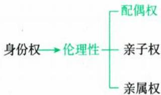

flowchart

```mermaid
graph LR
    A["身份权"] --> B["伦理性"]
    B --> C["配偶权"]
    B --> D["亲子权"]
    B --> E["亲属权"]
```

[图释] 在人身权体系中, 身份权是人格权的扩展和延伸。身份权①, 是以权利人的特定身份为标的的权利。身份权是专属权, 与民事主体的人身紧密相连, 这种权利只能由民事主体自己享有和行使, 具有严格的排他性, 不得转让、抛弃或由他人继承。身份权以义务为中心, 而非以权利为中心。

## 41 专题四十一 婚姻家庭

#### 复习提要

本专题主要涉及六个问题：1. 结婚；2. 效力有瑕疵的婚姻；3. 家庭关系；4. 双方均无配偶的同居析产；5. 夫妻财产制；6. 离婚。其中，效力有瑕疵的婚姻和离婚系常考点，夫妻财产制系必考点。在备考过程中，必须重点掌握。该专题的难度不大，只要下功夫，可以拿到满分。

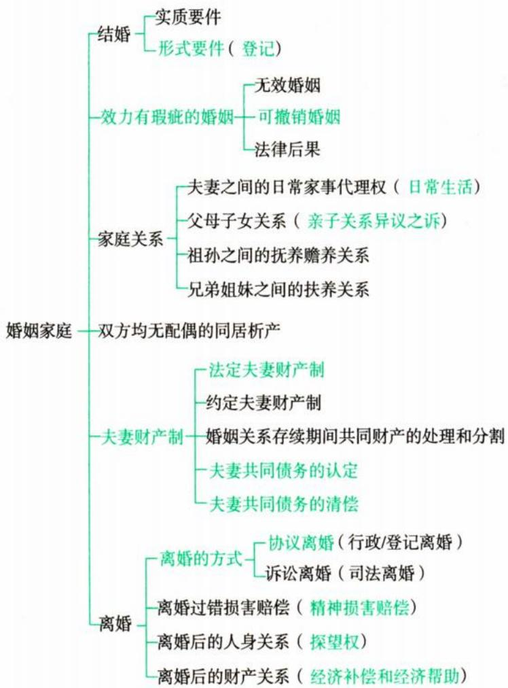

flowchart

```mermaid
graph TD
    A["婚姻家庭"] --> B["结婚"]
    A --> C["家庭关系"]
    A --> D["夫妻财产制"]
    A --> E["离婚"]
    
    B --> B1["实质要件"]
    B --> B2["形式要件（登记）"]
    
    C --> C1["效力有瑕疵的婚姻"]
    C1 --> C1a["无效婚姻"]
    C1 --> C1b["可撤销婚姻"]
    C1 --> C1c["法律后果"]
    
    C --> C2["夫妻之间的日常家事代理权（日常生活）"]
    C --> C3["父母子女关系（亲子关系异议之诉）"]
    C --> C4["祖孙之间的抚养赡养关系"]
    C --> C5["兄弟姐妹之间的扶养关系"]
    
    D --> D1["法定夫妻财产制"]
    D --> D2["约定夫妻财产制"]
    D --> D3["婚姻关系存续期间共同财产的处理和分割"]
    D --> D4["夫妻共同债务的认定"]
    D --> D5["夫妻共同债务的清偿"]
    
    E --> E1["离婚的方式"]
    E1 --> E1a["协议离婚（行政/登记离婚）"]
    E1 --> E1b["诉讼离婚（司法离婚）"]
    
    E --> E2["离婚过错损害赔偿（精神损害赔偿）"]
    E --> E3["离婚后的人身关系（探望权）"]
    E --> E4["离婚后的财产关系（经济补偿和经济帮助）"]
```

#### 一、结婚

#### (一) 实质要件

#### 1. 积极要件。

（1）男女双方完全自愿。结婚应当男女双方完全自愿，禁止任何一方对另一方加以强迫，禁止任何组织或个人加以干涉。

(2) 双方均达法定婚龄。结婚年龄，男不得早于22周岁，女不得早于20周岁。

（3）双方均无配偶，符合一夫一妻制。实行婚姻自由、一夫一妻、男女平等的婚姻制度。无配偶，包括未婚、丧偶和离婚三类。

#### 2. 消极要件。

直系血亲或三代以内的旁系血亲禁止结婚。

#### (二) 形式要件①

#### 1. 结婚登记手续。

要求结婚的男女双方应当亲自到婚姻登记机关申请结婚登记。符合《民法典》规定的，予以登记，发给结婚证。完成结婚登记，即确立婚姻关系。未办理结婚登记的，应当补办登记。男女双方补办结婚登记的，婚姻关系的效力从双方均符合《民法典》所规定的结婚的实质要件时起算。

#### 2. 结婚登记程序瑕疵的处理。

当事人以结婚登记程序存在瑕疵为由提起民事诉讼，主张撤销结婚登记的，告知其可以依法申请行政复议或提起行政诉讼。

[萌主点拨] 结婚登记（协议离婚登记）作为一种“行政确认具体行政行为”，属于行政诉讼受案范围，可以提出行政诉讼。

#### 二、效力有瑕疵的婚姻②

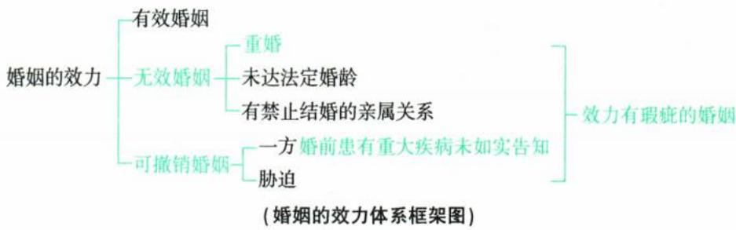

flowchart

```mermaid
graph TD
    A["婚姻的效力"] --> B["有效婚姻"]
    A --> C["无效婚姻"]
    A --> D["可撤销婚姻"]
    C --> E["重婚"]
    C --> F["未达法定婚龄"]
    C --> G["有禁止结婚的亲属关系"]
    D --> H["一方 婚前患有重大疾病未如实告知"]
    D --> I["胁迫"]
    J["效力有瑕疵的婚姻"]
```

#### (一) 无效婚姻

#### 1. 含义。

无效婚姻，是指男女两性的结合因违反了法律规定的结婚要件而不具有法律效力的违法结合。

#### 2. 法定情形。

从比较法的意义上来看，关于无效婚姻的类型，主要包括两类，即当然无效制和宣告无效制，我国目前采后者，即宣告无效制。

##### [萌主点拨]

无效婚姻（结合民事诉讼中消极的确认之诉）

<table><tr><td>法定情形</td><td>可否治愈</td><td>请求确认的主体(当事人本人或利害关系人)</td></tr><tr><td>重婚</td><td>绝对无效(无法治愈)</td><td>当事人、近亲属及基层组织(居民委员会或村民委员会)</td></tr><tr><td>未达法定婚龄</td><td>相对无效(可以治愈)</td><td>当事人和未达法定婚龄者的近亲属</td></tr><tr><td>有禁止结婚的亲属关系</td><td>绝对无效(无法治愈)</td><td>当事人和近亲属</td></tr></table>

#### 3. 诉讼程序。

#### (1) 无效情形已经消失的处理。

当事人向法院请求确认婚姻无效的，法定的无效婚姻情形在提起诉讼时已经消失的，法院不予支持。

[例] 甲（男，22周岁）为达到与乙（女，19周岁）结婚的目的，故意隐瞒乙的真实年龄办理了结婚登记。两年后，因双方经常吵架，乙以办理结婚登记时未达到法定婚龄为由向法院起诉，请求宣告婚姻无效。法院对乙的请求不予支持。因为无效情形已经消失。

#### (2) 法定情形外申请确认婚姻无效案件的处理。

当事人以三种无效婚姻以外的情形确认婚姻无效的，法院应当判决驳回当事人的诉讼请求。

#### (二) 可撤销婚姻

#### 1. 含义。

可撤销婚姻，是指因违背当事人的真实意思而成立的婚姻，或已成立的婚姻缺乏结婚的某个要件，有撤销权的当事人可以行使撤销权，使已经发生效力的婚姻归于无效。

#### 2. 法定情形。

（1）一方婚前患有重大疾病未如实告知（如果知道就不会结婚/《民法典》第1053条）。该情形的立法目的在于通过保障婚姻双方的知情权而最终维护婚姻自由自愿原则。重大疾病通常包括严重遗传性疾病①、指定传染病②和有关精神病③。

[例] 甲声称具有某海外名校学历，与乙结婚。半年后，乙发现甲的毕业证书系伪造的。甲、乙之间的婚姻合法有效。乙可以请求离婚但不可以请求撤销婚姻。

(2) 胁迫 (不自愿)。因胁迫而缔结的婚姻关系, 严重违背当事人的自由意志 (婚姻自由原则), 不符合结婚的法定要件, 受胁迫一方有权请求法院撤销违背其真实意思的婚姻。

3. 撤销权人。只能是受欺诈或受胁迫一方的婚姻关系当事人本人。

4. 撤销机关。法院。

5. 撤销时间。除斥期间为 1 年（不适用《民法典》第 152 条关于除斥期间的规定/《民法典婚姻家庭编解释（一）》第 19 条第 2 款）。

6. 起算。

（1）一方婚前患有重大疾病未如实告知。另一方请求撤销婚姻的，应当自知道或应当知道撤销事由之日起1年内提出。

(2) 胁迫。受胁迫的一方请求撤销婚姻的，应当自胁迫行为终止之日起1年内提出。

（3）被非法限制人身自由。被非法限制人身自由的当事人请求撤销婚姻的，应当自恢复人身自由之日起1年内（不适用诉讼时效中止、中断或延长的规定）提出。

[例] 胡某与黄某长期保持同性恋关系，胡某创作同性恋题材的小说发表。后胡某迫于父母压力娶陈某为妻，结婚时陈某父母赠与一套房屋，登记在陈某和胡某名下。婚后，胡某收到出版社支付的小说版税10万元。此后，陈某得知胡某在婚前和婚后一直与黄某保持同性恋关系，非常痛苦。本案中，虽然胡某隐瞒同性恋重大事实，导致陈某结婚的意思表示不真实，但并不存在法定撤销婚姻的情形。因此，陈某不可请求撤销该婚姻。

#### (三) 效力有瑕疵婚姻的法律后果

1. 人身关系。无效的或被撤销的婚姻自始没有法律约束力，当事人不具有夫妻的权利和义务。

2. 财产关系。同居期间所得的财产，由当事人协议处理；协议不成的，由法院根据照顾无过错方的原则判决。对重婚导致的无效婚姻的财产处理，不得侵害合法婚姻当事人的财产权益。

3. 亲子关系。父母子女关系主要是来自相互之间的血缘关系，法律上虽对不符合法定条件的婚姻规定为无效或可撤销，但父母与子女之间的血缘关系是客观存在的，不因夫妻婚姻关系的无效、被撤销而消灭。因此，当事人所生的子女，适用《民法典》关于父母子女的规定。婚姻无效或被撤销的，无过错方有权请求损害赔偿，包括物质损害赔偿和精神损害赔偿（配偶权受到侵犯，可以主张精神损害赔偿）。

[萌主点拨]
无效婚姻 VS 可撤销婚姻

<table><tr><td>项目</td><td>无效婚姻</td><td>可撤销婚姻</td></tr><tr><td>请求权主体</td><td>当事人本人或利害关系人</td><td>当事人本人</td></tr><tr><td>所损害的利益范围</td><td>婚姻当事人自身利益和社会公共利益</td><td>婚姻一方当事人自由意志</td></tr><tr><td>行使请求权的期限</td><td>只要无效事由存在,权利主体就可以申请宣告婚姻无效。即使在夫妻一方或双方死亡后的1年内,生存一方或利害关系人仍可以提出申请</td><td>自知道或应当知道或胁迫行为终止或恢复人身自由之日起1年内提出</td></tr></table>

##### 随堂练习

李某父亲向张某借了高利贷，无力偿还，于是被张某殴打，张某称要不还钱，要不让李某嫁给自己。李某无奈嫁给张某并生育一女。6年后李父死亡，李某母亲劝说李某与张某离婚。对此，下列说法正确的是？(2024金题-2-1-22，多) $^{①}$

A. 李某母亲可作为利害关系人申请撤销婚姻关系
B. 李某与张某离婚对其女儿的父母关系无影响
C. 此婚姻关系虽经过 5 年仍可以撤销
D. 李某可以向张某要求损害赔偿

#### 三、家庭关系

#### (一) 夫妻之间的日常家事代理权

夫妻一方因家庭日常生活需要而实施的民事法律行为，对夫妻双方发生效力，但是夫妻一方与相对人另有约定的除外。夫妻之间对一方可以实施的民事法律行为范围的限制，不得对抗善意相对人（内外有别/《民法典》第1060条）。

#### (二) 父母子女关系

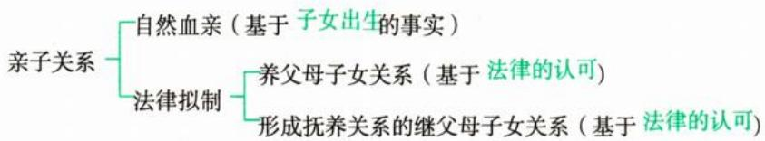

flowchart

```mermaid
graph TD
    A["亲子关系"] --> B["自然血亲（基于 子女出生的事实）"]
    A --> C["法律拟制"]
    C --> D["养父母子女关系（基于 法律的认可）"]
    C --> E["形成抚养关系的继父母子女关系（基于 法律的认可）"]
```

(亲子关系法律关系示意图)

1. 亲子关系异议之诉。

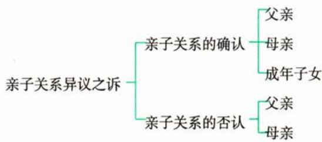

flowchart

```mermaid
graph TD
    A["亲子关系异议之诉"] --> B["亲子关系的确认"]
    A --> C["亲子关系的否认"]
    B --> D["父亲"]
    B --> E["母亲"]
    B --> F["成年子女"]
    C --> G["父亲"]
    C --> H["母亲"]
```

(亲子关系异议之诉体系框架图)

(1) 亲子关系的确认。

实践中，孩子被抱错、孩子和父母失散或孩子被社会福利机构领养，父亲或母亲均有可能提起亲子关系确认之诉。请求确认亲子关系，即原告向法院起诉，请求确认子女和自己或被告之间存在亲子关系，类似于非婚生子女的认领制度。请求确认亲子关系的原告范围包括父亲、母亲和成年子女。

(2) 亲子关系的否认。

成年子女只能提起亲子关系确认之诉而不能提起亲子关系否认之诉。

#### 2. 人工授精。

婚姻关系存续期间，夫妻双方一致同意进行人工授精，所生子女应视为婚生子女，父母子女间的权利义务关系适用《民法典》的有关规定。

#### 3. 继父母子女关系。

对《民法典》第1072条中继子女受继父或继母抚养教育的事实，法院应当以共同生活时间长短为基础，综合考虑共同生活期间继父母是否实际进行生活照料、是否履行家庭教育职责、是否承担抚养费等因素予以认定（《民法典婚姻家庭编解释（二）》第18条）。

生父与继母或生母与继父离婚后，当事人主张继父或继母和曾受其抚养教育的继子女之间的权利义务关系不再适用民法典关于父母子女关系规定的，法院应予支持，但继父或继母与继子女存在依法成立的收养关系或继子女仍与继父或继母共同生活的除外。

继父母子女关系解除后，缺乏劳动能力又缺乏生活来源的继父或继母请求曾受其抚养教育的成年继子女给付生活费的，法院可以综合考虑抚养教育情况、成年继子女负担能力等因素，依法予以支持，但是继父或继母曾存在虐待、遗弃继子女等情况的除外（《民法典婚姻家庭编解释（二）》第19条）。

#### 四、双方均无配偶的同居析产

双方均无配偶的同居关系析产纠纷案件中，对同居期间所得的财产，有约定的，按照约定处理；没有约定且协商不成的，法院按照以下情形分别处理：

各自所得的工资、奖金、劳务报酬、知识产权收益，各自继承或受赠的财产以及单独生产、经营、投资的收益等，归各自所有。

共同出资购置的财产或共同生产、经营、投资的收益以及其他无法区分的财产，以各自出资比例为基础，综合考虑共同生活情况、有无共同子女、对财产的贡献大小等因素进行分割（《民法典婚姻家庭编解释（二）》第4条）。

#### 五、夫妻财产制

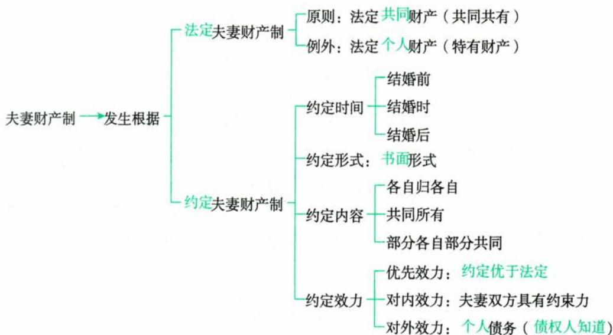

flowchart

```mermaid
graph TD
    A["夫妻财产制"] --> B["发生根据"]
    B --> C["法定夫妻财产制"]
    C --> D["原则：法定 共同财产（共同共有）"]
    C --> E["例外：法定 个人财产（特有财产）"]
    B --> F["约定夫妻财产制"]
    F --> G["约定时间"]
    G --> H["结婚前"]
    G --> I["结婚时"]
    G --> J["结婚后"]
    F --> K["约定形式：书面形式"]
    F --> L["约定内容"]
    L --> M["各自归各自"]
    L --> N["共同所有"]
    L --> O["部分各自部分共同"]
    F --> P["约定效力"]
    P --> Q["优先效力：约定优于法定"]
    P --> R["对内效力：夫妻双方具有约束力"]
    P --> S["对外效力：个人债务（债权人知道）"]
```

(夫妻财产制体系框架图)

#### (一) 法定共同财产①

1. 工资、奖金、劳务报酬（通过非固定工作获得的其他劳务报酬包括：咨询费、讲课费等）。

2. 生产、经营（如夫妻店）、投资的收益。投资的收益包括股票、证券、期货等投资产生的收益。婚姻关系存续期间，一方以个人财产投资（如炒股、买基金）取得的收益，应当归共同所有。婚姻关系存续期间，一方从事个体经营或承包经营的收入，应当归共同所有。

3. 知识产权的收益。知识产权收益，是指婚姻关系存续期间，实际取得或已经明确可以取得的财产性收益。发表或获得稿酬之一发生在婚姻关系存续期间即可以认定为夫妻共同财产（《民法典婚姻家庭编解释（一）》第24条）。

4. 继承或受赠的财产。

（1）原则。在婚姻关系存续期间，夫或妻一方继承或受赠的财产系夫妻共同财产；婚姻关系存续期间，夫妻一方作为继承人依法可以继承的遗产，在继承人之间尚未实际分割，起诉离婚时另一方请求分割的，法院应当告知当事人在继承人之间实际分割遗产后另行起诉。

##### [核心法条链接]

《民法典婚姻家庭编解释（二）》第11条 [夫妻一方放弃继承的处理] 夫妻一方以另一方可继承的财产为夫妻共同财产、放弃继承侵害夫妻共同财产利益为由主张另一方放弃继承无效的，人民法院不予支持，但有证据证明放弃继承导致放弃一方不能履行法定扶养义务的除外。

(2) 例外。遗嘱或赠与合同中“确定只归一方”的财产。

##### [核心法条链接]

《民法典婚姻家庭编解释（二）》第8条 [父母为子女购置房屋出资的处理] 婚姻关系存续期间，夫妻购置房屋由一方父母全额出资，如果赠与合同明确约定只赠与自己子女一方的，按照约定处理；没有约定或者约定不明确的，离婚分割夫妻共同财产时，人民法院可以判决该房屋归出资人子女一方所有，并综合考虑共同生活及孕育共同子女情况、离婚过错、对家庭的贡献大小以及离婚时房屋市场价格等因素，确定是否由获得房屋一方对另一方予以补偿以及补偿的具体数额。

婚姻关系存续期间，夫妻购置房屋由一方父母部分出资或者双方父母出资，如果赠与合同明确约定相应出资只赠与自己子女一方的，按照约定处理；没有约定或者约定不明确的，离婚分割夫妻共同财产时，人民法院可以根据当事人诉讼请求，以出资来源及比例为基础，综合考虑共同生活及孕育共同子女情况、离婚过错、对家庭的贡献大小以及离婚时房屋市场价格等因素，判决房屋归其中一方所有，并由获得房屋一方对另一方予以合理补偿。

5. 男女双方实际取得或应当取得的住房补贴、住房公积金、基本养老金、破产安置补偿费；离婚时夫妻一方尚未退休、不符合领取基本养老金条件，另一方请求按照夫妻共同财产分割基本养老金的，法院不予支持；婚后以夫妻共同财产缴纳基本养老保险费，离婚时一方主张将养老金账户中婚姻关系存续期间个人实际缴纳部分及利息作为夫妻共同财产分割的，法院应予支持。

6. 夫妻一方个人财产在婚后产生的收益，除孳息和自然增值外，应认定为夫妻共同财产（《民法典婚姻家庭编解释（一）》第26条/协力理论）。

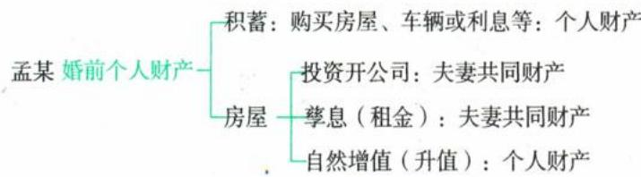

flowchart

```mermaid
graph TD
    A["孟某 婚前个人财产"] --> B["积蓄：购买房屋、车辆或利息等：个人财产"]
    A --> C["房屋"]
    C --> D["投资开公司：夫妻共同财产"]
    C --> E["孳息（租金）：夫妻共同财产"]
    C --> F["自然增值（升值）：个人财产"]
```

(婚前个人财产归属示意图)

这里的“孳息”不同于物权编中的孳息（《民法典》第321条），限于无须夫妻一方投入物资、劳动即可取得的孳息，即非投资性、经营性收益。夫妻一方婚后将个人房屋出资获得的租金，虽然属于物权意义上的孳息，但是，夫妻一方作为出租人对房屋负有维修等义务，租金的获取与房屋本身的管理状况密切相关，需要夫妻一方投入一定的管理或劳动。因此，租金属于经营性收益，属于夫妻共同财产。

自然增值，是指增值因通货膨胀或市场行情的变化而产生，与夫妻一方或双方对该财产是否投入物资、劳动、努力无关。如婚前所有的房屋、古董、字画、珠宝、黄金等升值。

7. 由一方婚前承租、婚后用共有财产购买的房屋，登记在一方名下的，应当认定为夫妻共同财产。当事人结婚前，父母为双方购置房屋出资的，该出资应当认定为对自己子女个人的赠与，但父母明确表示赠与双方的除外。当事人结婚后，父母为双方购置房屋出资的，依照约定处理；没有约定或约定不明确的，原则上共有，赠与合同中确定只归一方的财产除外（《民法典婚姻家庭编解释（一）》第27、29条）。

#### （二）法定个人财产①

1. 一方的婚前财产。夫妻一方的个人财产，不因婚姻关系的延续而转化为夫妻共同财产。但当事人另有约定的除外（如一方对另一方进行赠与）。

##### [核心法条链接]

《民法典婚姻家庭编解释（二）》第5条［夫妻之间的赠与房屋］婚前或者婚姻关系存续期间，当事人约定将一方所有的房屋转移登记至另一方或者双方名下，离婚诉讼时房屋所有权尚未转移登记，双方对房屋归属或者分割有争议且协商不成的，人民法院可以根据当事人诉讼请求，结合给予目的，综合考虑婚姻关系存续时间、共同生活及孕育共同子女情况、离婚过错、对家庭的贡献大小以及离婚时房屋市场价格等因素，判决房屋归其中一方所有，并确定是否由获得房屋一方对另一方予以补偿以及补偿的具体数额。

婚前或者婚姻关系存续期间，一方将其所有的房屋转移登记至另一方或者双方名下，离婚诉讼中，双方对房屋归属或者分割有争议且协商不成的，如果婚姻关系存续时间较短且给予方无重大过错，人民法院可以根据当事人诉讼请求，判决该房屋归给予方所有，并结合给予目的，综合考虑共同生活及孕育共同子女情况、离婚过错、对家庭的贡献大小以及离婚时房屋市场价格等因素，确定是否由获得房屋一方对另一方予以补偿以及补偿的具体数额。

给予方有证据证明另一方存在欺诈、胁迫、严重侵害给予方或者其近亲属合法权益、对给予方有扶养义务而不履行等情形，请求撤销前两款规定的民事法律行为的，人民法院依法予以支持。

#### >> 随堂练习

张男自购房屋一套，向王女求婚时承诺：若双方结婚，即为王女“加名”。双方婚后张男立即履行承诺，将该房屋登记至双方名下。但三个月后，张男发现王女系职业骗婚人，自己是其第6任丈夫，遂向法院起诉离婚，诉讼中双方对该房屋归属发生争议。对此，下列哪些选项是正确的？（2025-2-多选） $^{①}$

A. 双方的婚姻可撤销
B. 张男可请求撤销为王女的“加名”行为
C. 双方的婚姻无效
D. 法院可判决该房屋归张男所有

2. 一方因受到人身损害（具有人身专属性）获得的赔偿或补偿。

3. 遗嘱或赠与合同中确定只归一方的财产（尊重遗嘱人或赠与人的自由意志）。

4. 一方专用的生活用品。

5. 军人的伤亡保险金、伤残补助金、医药生活补助费。

6. 婚前或婚姻关系存续期间，当事人约定将一方所有的房产赠与另一方或共有，赠与方在赠与房产变更登记之前撤销赠与，另一方请求判令继续履行的，法院可以按照赠与合同任意撤销权的规定处理。

#### （三）约定夫妻财产制 $^{②}$

#### 1. 内容。

男女双方可以约定婚姻关系存续期间所得的财产以及婚前财产归各自所有、共同所有或部分各自所有、部分共同所有。

#### 2. 形式。

约定应当采用书面形式。没有约定或约定不明确的适用法定夫妻财产制。

#### 3. 法律效力。

夫妻对婚姻关系存续期间所得的财产以及婚前财产的约定，对双方具有法律约束力（约定夫妻财产制优于法定夫妻财产制）。夫妻对婚姻关系存续期间所得的财产约定归各自所有，夫或妻一方对外所负的债务，相对人知道该约定的，以夫或妻一方的个人财产清偿（“相对人知道该约定的”，夫妻一方对此负有举证责任）。

#### （四）婚姻关系存续期间共同财产的处理和分割 $^{③}$

#### 1. 处理。

夫或妻在处理夫妻共同财产上权利平等，因日常生活需要而处理夫妻共同财产的，任何一方均有权决定（平等的家事代理权）。

非因日常生活需要而处分夫妻共同财产的（如购房、购车），需夫妻双方一致同意。夫妻之间订立借款协议，以夫妻共同财产出借给一方从事个人经营活动或用于其他个人事务的，应视为双方约定处分夫妻共同财产的行为，离婚时可按照借款协议的约定处理。

① 答案：BD。
② 考查 2 次，抓住重点。
③ 考查 1 次，抓住重点。

#### 2. 分割。

婚姻关系存续期间，夫妻双方不得请求分割夫妻共同财产。有两个例外：（1）一方有隐藏、转移、变卖、毁损、挥霍夫妻共同财产或伪造夫妻共同债务等严重损害夫妻共同财产利益行为；（2）一方负有法定扶养义务的人患重大疾病需要医治，另一方不同意支付相关医疗费用。

##### [核心法条链接]

《民法典婚姻家庭编解释（二）》第6条 [挥霍夫妻共同财产] 夫妻一方未经另一方同意，在网络直播平台用夫妻共同财产打赏，数额明显超出其家庭一般消费水平，严重损害夫妻共同财产利益的，可以认定为《民法典》第1066条和第1092条规定的“挥霍”。另一方请求在婚姻关系存续期间分割夫妻共同财产，或者在离婚分割夫妻共同财产时请求对打赏一方少分或者不分的，人民法院应予支持。

《民法典婚姻家庭编解释（二）》第7条［违反忠实义务处分夫妻共同财产］夫妻一方为重婚、与他人同居以及其他违反夫妻忠实义务等目的，将夫妻共同财产赠与他人或者以明显不合理的价格处分夫妻共同财产，另一方主张该民事法律行为违背公序良俗无效的，人民法院应予支持并依照《民法典》第157条规定处理。

夫妻一方存在前款规定情形，另一方以该方存在转移、变卖夫妻共同财产行为，严重损害夫妻共同财产利益为由，依据《民法典》第1066条规定请求在婚姻关系存续期间分割夫妻共同财产，或者依据《民法典》第1092条规定请求在离婚分割夫妻共同财产时对该方少分或者不分的，人民法院应予支持。

#### (五) 夫妻债务的认定①

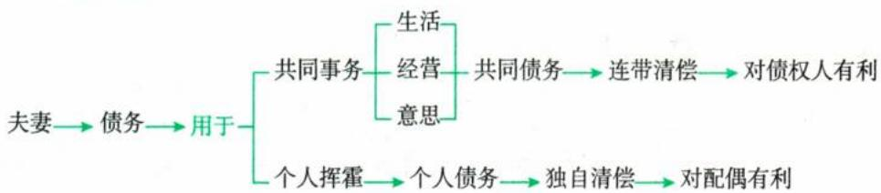

flowchart

```mermaid
graph TD
    A["夫妻"] --> B["债务"]
    B --> C["用于"]
    C --> D["共同事务"]
    D --> E["生活"]
    D --> F["经营"]
    D --> G["意思"]
    C --> H["个人挥霍"]
    H --> I["个人债务"]
    I --> J["独自清偿"]
    J --> K["对配偶有利"]
    E --> L["连带清偿"]
    L --> M["对债权人有利"]
```

(夫妻债务的认定和清偿体系框架图)

基于 “目的论” 和 “功能论” 的立法价值。无论是婚前还是婚姻关系存续期间，无论是以个人名义还是夫妻共同名义所借债务，凡是用于 “共同事务” 或能体现 “共同意思表示” 的，即被认定为夫妻共同债务。凡是用于 “个人事务” 或用于 “个人挥霍” 的，即被认定为个人债务。

[例] 2023年3月1日，薛女与江男情感破裂离婚，协议分割财产，2023年9月1日，薛女发现江男隐藏了婚后股票100万元，且江男平时喜好赌博打牌欠款50万元，现薛女要重新分割财产，江男主张应分担债务。该50万元赌博债务系江男个人债务，与薛女无关。

#### （六）夫妻债务的清偿 $^{①}$

离婚时，夫妻共同债务应当共同偿还（即承担连带责任）。共同财产不足清偿或财产归各自所有的，由双方协议清偿；协议不成的，由法院判决。当事人的离婚协议或法院生效判决、裁定、调解书已经对夫妻财产分割问题作出处理的，债权人仍有权就夫妻共同债务向男女双方主张权利。一方就夫妻共同债务承担清偿责任后，主张由另一方按照离婚协议或法院的法律文书承担相应债务的，法院应予支持（即内外有别）。夫或妻一方死亡的，生存一方应当对婚姻关系存续期间的夫妻共同债务承担清偿责任。

[例] 王某和张某原系夫妻。2025年1月1日，为给王某治病，张某以自己的名义向赵某借款3万元，约定于5月1日偿还，并出具借条一张。孙某以保证人的身份在借条上签字，但未与赵某约定保证方式、保证期间和保证范围。债务到期后，张某未偿还借款。7月5日，王某与张某离婚，双方约定由张某负责偿还欠赵某的3万元借款。王某与张某离婚协议中关于偿还欠款的约定内部有效，外部无效。即对王某与张某有效，但对不知情的第三人赵某不具有法律约束力，赵某依然可以请求王某和张某承担无限连带责任。

#### 六、离婚

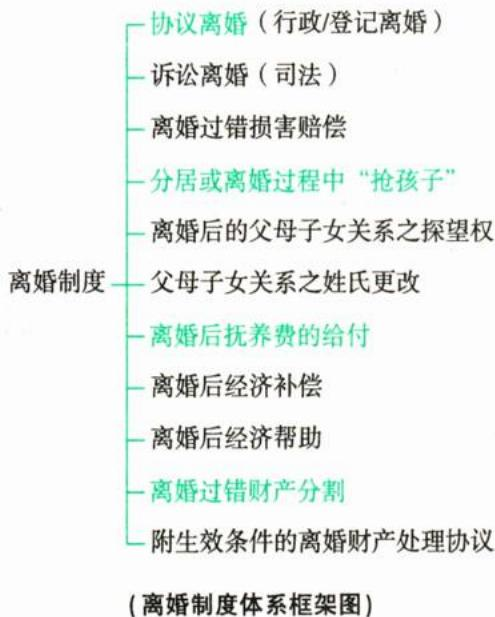

flowchart

```mermaid
graph TD
    A["离婚制度"] --> B["协议离婚（行政/登记离婚）"]
    A --> C["诉讼离婚（司法）"]
    A --> D["离婚过错损害赔偿"]
    A --> E["分居或离婚过程中“抢孩子”"]
    A --> F["离婚后的父母子女关系之探望权"]
    A --> G["父母子女关系之姓氏更改"]
    A --> H["离婚后抚养费的给付"]
    A --> I["离婚后经济补偿"]
    A --> J["离婚后经济帮助"]
    A --> K["离婚过错财产分割"]
    A --> L["附生效条件的离婚财产处理协议"]
```

#### (一) 协议离婚 $^{②}$

#### 1. 条件。

夫妻双方自愿离婚的，应当签订书面离婚协议，并亲自到婚姻登记机关申请离婚登记。离婚协议应当载明双方自愿离婚的意思表示和对子女抚养、财产以及债务处理等事项协商一致的意见。

2. 程序。

<table><tr><td>婚姻登记机关收到申请日</td><td>冷静期届满日</td><td>婚姻登记机关离婚登记届满日</td></tr><tr><td>亲自申请30日冷静期</td><td>亲自申请30日离婚证书</td><td></td></tr><tr><td>撤回</td><td>视为撤回</td><td></td></tr></table>

##### (协议离婚登记程序示意图)

自婚姻登记机关收到离婚登记申请之日起30日内，任何一方不愿意离婚的，可以向婚姻登记机关撤回（尚未生效的意思表示）离婚登记申请。期限届满后30日内，双方应当亲自到婚姻登记机关申请发给离婚证；未申请的，视为撤回离婚登记申请。婚姻登记机关查明双方确实是自愿离婚，并已经对子女抚养、财产以及债务处理等事项协商一致的，予以登记，发给离婚证。

#### (二) 诉讼离婚①

1. 法定情形。

夫妻一方要求离婚的，可以由有关组织进行调解或直接向法院提起离婚诉讼。法院审理离婚案件，应当进行调解（调解前置程序）；如果感情确已破裂，调解无效的，应当准予离婚。

（1）重婚或与他人同居。“与他人同居”的情形，是指有配偶者与婚外异性，不以夫妻名义，持续、稳定地共同生活。

(2) 实施家庭暴力或虐待、遗弃家庭成员。“虐待”是指持续性、经常性的家庭暴力。

(3) 有赌博、吸毒等恶习屡教不改。

(4) 因感情不和分居满 2 年。

(5) 一方被宣告失踪，另一方提起离婚诉讼的，应当准予离婚。

（6）夫以妻擅自中止妊娠侵犯其生育权为由请求损害赔偿的，法院不予支持。夫妻双方因是否生育发生纠纷，致使感情确已破裂，一方请求离婚的，法院经调解无效，应依照诉讼离婚的规定处理。

(7) 经法院判决不准离婚后, 双方又分居满 1 年, 一方再次提起离婚诉讼的, 应当准予离婚。

2. 特殊保护。

(1) 现役军人婚姻特殊保护。

现役军人的配偶要求离婚，应当征得军人同意，但是军人一方有重大过错的除外。“军人一方有重大过错”，可以依据《民法典》第1079条第3款前三项规定（即重婚或与他人同居；实施家庭暴力或虐待、遗弃家庭成员；有赌博、吸毒等恶习屡教不改）及军人有其他重大过错导致夫妻感情破裂的情形予以判断。

#### (2) 女方特殊保护。

女方在怀孕期间、分娩后1年内或终止妊娠后6个月内，男方不得提出离婚；但是，女方提出离婚或法院认为确有必要受理男方离婚请求（如“喜当爹”）的除外。

#### (三) 离婚过错损害赔偿 $^{①}$

#### 1. 法定情形。

离婚过错损害赔偿的法定情形有 5 项，分别是：重婚；与他人同居；实施家庭暴力；虐待、遗弃家庭成员和有其他重大过错。

[萌主点拨] 其他重大过错，是指存在通奸、卖淫、嫖娼、赌博、吸毒等严重违反婚姻家庭义务的行为。司法实践中，应根据具体案件情况，结合过错情节、伤害后果等因素对是否构成重大过错进行认定。

#### 2. 责任人。

离婚诉讼当事人中无过错方的配偶，与第三人无关。

#### 3. 请求权人。

离婚诉讼当事人中无过错方。

#### 4. 责任性质。

物质损害赔偿和精神损害赔偿（配偶权受到侵犯，可以主张精神损害赔偿）。

#### 5. 限制。

必须仅一方有过错。如夫妻双方均有过错，一方或双方向对方提出离婚损害赔偿请求的，法院不予支持。

#### 6. 诉讼程序。

法院判决不准离婚的案件，对于当事人提出的损害赔偿请求，不予支持。在婚姻关系存续期间，当事人不起诉离婚而单独提起损害赔偿请求的，法院不予受理。

#### （四）分居或离婚过程中“抢孩子”

#### 1. “抢孩子”情形下的人身安全禁令或人格权侵害禁令。

父母一方或其近亲属等抢夺、藏匿未成年子女，另一方向法院申请人身安全保护令或参照适用《民法典》第997条规定申请人格权侵害禁令的，法院依法予以支持。

抢夺、藏匿未成年子女一方以另一方存在赌博、吸毒、家庭暴力等严重侵害未成年子女合法权益情形，主张其抢夺、藏匿行为有合理事由的，法院应当告知其依法通过撤销监护人资格、中止探望或变更抚养关系等途径解决。当事人对其上述主张未提供证据证明且未在合理期限内提出相关请求的，法院依照前款规定处理（《民法典婚姻家庭编解释（二）》第12条）。

#### 2. “抢孩子”情形下的临时处理措施。

夫妻分居期间，一方或其近亲属等抢夺、藏匿未成年子女，致使另一方无法履行监护职责，另一方请求行为人承担民事责任的，法院可以参照适用《民法典》第1084条关于离婚后子女抚养的有关规定，暂时确定未成年子女的抚养事宜，并明确暂时直接抚养未成年子女一方有协助另一方履行监护职责的义务（《民法典婚姻家庭编解释（二）》第13条）。

#### 3. “抢孩子”情形下直接抚养人的确定。

离婚诉讼中，父母均要求直接抚养已满2周岁的未成年子女，一方有下列情形之一的，法院应当按照最有利于未成年子女的原则，优先考虑由另一方直接抚养：（1）实施家庭暴力或者虐待、遗弃家庭成员；（2）有赌博、吸毒等恶习；（3）重婚、与他人同居或者其他严重违反夫妻忠实义务情形；（4）抢夺、藏匿未成年子女且另一方不存在本条第一项或者第二项等严重侵害未成年子女合法权益情形（抢孩子）；（5）其他不利于未成年子女身心健康的情形（《民法典婚姻家庭编解释（二）》第14条）。

#### (五) 离婚后的父母子女关系之探望权①

<table><tr><td colspan="2">2周岁</td><td>8周岁</td></tr><tr><td>女方为原则</td><td>双方协议,协议不成的,法院判决</td><td>尊重其真实意愿</td></tr><tr><td>男方为例外</td><td>最有利于未成年人的原则</td><td></td></tr></table>

(离婚后的父母子女关系示意图)

探望权

<table><tr><td>性质</td><td colspan="3">属于权利而非义务</td></tr><tr><td>主体</td><td colspan="3">离婚后,不直接抚养子女的父或母,有探望子女的权利,另一方有协助的义务;对于拒不协助另一方行使探望权的有关个人或组织,可以由法院依法采取拘留、罚款等强制措施,但是不能对子女的人身、探望行为进行强制执行</td></tr><tr><td>行使</td><td colspan="3">行使探望权利的方式、时间由当事人协议;协议不成的,由法院判决</td></tr><tr><td rowspan="10">中止及其恢复</td><td rowspan="7">中止</td><td>事由</td><td>父或母探望子女,不利于子女身心健康</td></tr><tr><td rowspan="3">申请主体</td><td>1. 未成年子女</td></tr><tr><td>2. 直接抚养子女的父或母</td></tr><tr><td>3. 其他对未成年子女负担抚养、教育、保护义务的法定监护人</td></tr><tr><td>机关</td><td>法院</td></tr><tr><td rowspan="2">程序</td><td>1. 法院作出的生效的离婚判决中未涉及探望权,当事人就探望权问题单独提起诉讼的,法院应予受理</td></tr><tr><td>2. 当事人在履行生效判决、裁定或调解书的过程中,一方请求中止探望的,法院在征询双方当事人意见后,认为需要中止探望的,依法作出裁定</td></tr><tr><td rowspan="3">恢复</td><td>事由</td><td>中止的事由消失后,应当恢复探望</td></tr><tr><td>程序</td><td>中止探望的情形消失后,法院应当根据当事人的请求书面通知其恢复探望</td></tr><tr><td>机关</td><td>法院</td></tr></table>

#### (六) 父母子女关系之姓氏更改①

离婚后抚养子女的一方擅自为子女改姓氏，另一方可以向法院提起诉讼，请求恢复原姓氏。父母不得因子女变更姓氏而拒付子女抚养费。父或母擅自将子女姓氏改为继母或继父姓氏而引起纠纷的，应当责令恢复原姓氏。

#### >> 随堂练习

甲乙为夫妻育有一子丙，离婚后丙随母亲乙一起生活。后乙嫁给丁，暑假期间丙去甲家，甲发现丙的名字变成戊（随丁姓）。后丙欲上私立学校，需要增加抚养费。关于本案，下列说法正确的有？(2023金题-2-1-26，多) $^{②}$

A. 甲有权因乙为丙改了名字不支付抚养费
B. 乙为丙改了名字，则甲丙之间的监护义务终止
C. 乙应为甲探望丙提供便利
D. 丙有权起诉请求甲增加抚养费

#### (七) 离婚后抚养费的给付

1. 离婚后抚养费的给付和抚养关系的变更。

离婚协议中关于一方直接抚养未成年子女或不能独立生活的成年子女③、另一方不负担抚养费的约定，对双方具有法律约束力。但是，离婚后，直接抚养子女一方经济状况发生变化导致原生活水平显著降低或子女生活、教育、医疗等必要合理费用确有显著增加，未成年子女或不能独立生活的成年子女请求另一方支付抚养费的，法院依法予以支持，并综合考虑离婚协议整体约定、子女实际需要、另一方的负担能力、当地生活水平等因素，确定抚养费的数额。

前款但书规定情形下，另一方以直接抚养子女一方无抚养能力为由请求变更抚养关系的，法院依照《民法典》第1084条规定处理（《民法典婚姻家庭编解释（二）》第16条）。

2. 离婚后不给付抚养费的处理。

离婚后，不直接抚养子女一方未按照离婚协议约定或以其他方式作出的承诺给付抚养费，未成年子女或不能独立生活的成年子女请求其支付欠付的抚养费的，法院应予支持。

前款规定情形下，如果子女已经成年并能够独立生活，直接抚养子女一方请求另一方支付欠付的费用的，法院依法予以支持（《民法典婚姻家庭编解释（二）》第17条）。

#### (八) 离婚后经济补偿 $^{④}$ (全职太太或老公)

夫妻一方因抚育子女、照料老年人、协助另一方工作等负担较多义务的，离婚时有权向另一方请求补偿，另一方应当给予补偿。具体办法由双方协议；协议不成的，由法院判决（如居住权）。

① 考查1次，抓住重点。

② 答案：CD。

③《民法典婚姻家庭编解释（一）》第41条［不能独立生活的成年子女］尚在校接受高中及其以下学历教育，或者丧失、部分丧失劳动能力等非因主观原因而无法维持正常生活的成年子女，可以认定为《民法典》第1067条规定的“不能独立生活的成年子女”。

④ 考查 2 次，重点关注。

离婚诉讼中，夫妻一方有证据证明在婚姻关系存续期间因抚育子女、照料老年人、协助另一方工作等负担较多义务，依据《民法典》第1088条规定请求另一方给予补偿的，法院可以综合考虑负担相应义务投入的时间、精力和对双方的影响以及给付方负担能力、当地居民人均可支配收入等因素，确定补偿数额（《民法典婚姻家庭编解释（二）》第21条）。

#### (九) 离婚后经济帮助 $^{①}$ (一日夫妻百日恩)

离婚时，如果一方生活困难，有负担能力的另一方应当给予适当帮助。具体办法由双方协议；协议不成的，由法院判决。“适当帮助”包括在一方的房屋中给另一方设置居住权。

离婚诉讼中，一方存在年老、残疾、重病等生活困难情形，依据《民法典》第1090条规定请求有负担能力的另一方给予适当帮助的，人民法院可以根据当事人请求，结合另一方财产状况，依法予以支持（《民法典婚姻家庭编解释（二）》第22条）。

#### (十) 离婚过错财产分割②

夫妻一方隐藏、转移、变卖、毁损、挥霍夫妻共同财产，或伪造夫妻共同债务企图侵占另一方财产的，在离婚分割夫妻共同财产时，对该方可以少分或不分。离婚后，另一方发现有上述行为的，可以向法院提起诉讼，请求再次分割夫妻共同财产。当事人向法院提起诉讼，请求再次分割夫妻共同财产的诉讼时效期间为3年，从当事人发现之日起计算。

夫妻以共同财产投资有限责任公司，并均登记为股东，双方对相应股权的归属没有约定或约定不明确，离婚时，一方请求按照股东名册或公司章程记载的各自出资额确定股权分割比例的，法院不予支持；对当事人分割夫妻共同财产的请求，法院依照《民法典》第1087条规定处理（《民法典婚姻家庭编解释（二）》第10条）。

#### (十一) 附生效条件的离婚财产处理协议③

当事人达成的以协议离婚或到法院调解离婚为条件的财产以及债务处理协议，如果双方离婚未成，一方在离婚诉讼中反悔的，法院应当认定该财产以及债务处理协议没有生效，并根据实际情况依照《民法典》第1087条和第1089条的规定判决。当事人依照《民法典》第1076条签订的离婚协议中关于财产以及债务处理的条款，对男女双方具有法律约束力。登记离婚后当事人因履行上述协议发生纠纷提起诉讼的，法院应当受理。

## 42 专题四十二 收养

#### 复习提要

本专题主要涉及四个问题：1. 收养关系的当事人；2. 收养关系的成立；3. 收养关系的效力；4. 收养关系的解除。其中，收养关系的当事人和成立系重点和难点，在备考中应重复做题感受。

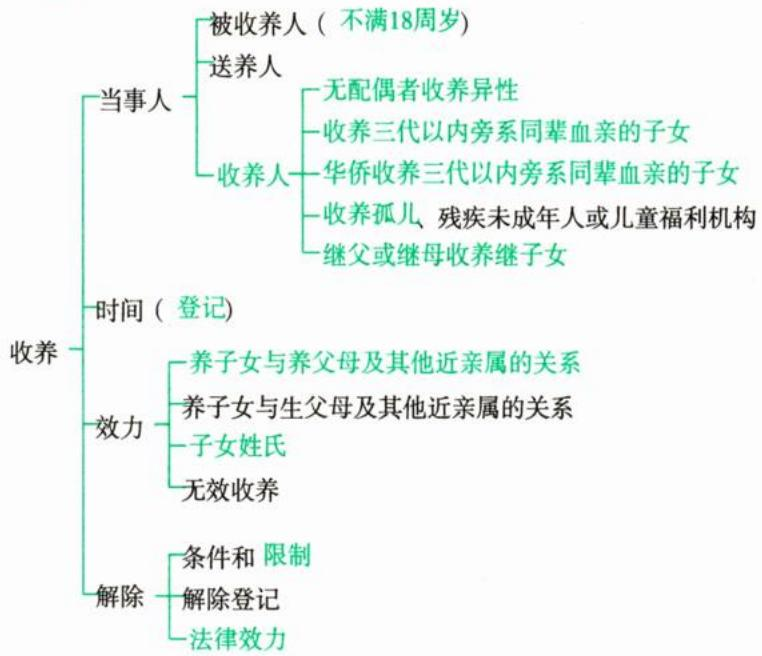

flowchart

```mermaid
graph TD
    A["收养"] --> B["当事人"]
    A --> C["时间（登记）"]
    A --> D["效力"]
    A --> E["解除"]
    
    B --> B1["被收养人（不满18周岁）"]
    B --> B2["送养人"]
    B2 --> B2a["无配偶者收养异性"]
    B2 --> B2b["收养三代以内旁系同辈血亲的子女"]
    B2 --> B2c["收养人"]
    B2c --> B2c1["华侨收养三代以内旁系同辈血亲的子女"]
    B2c --> B2c2["收养孤儿、残疾未成年人或儿童福利机构"]
    B2c --> B2c3["继父或继母收养继子女"]
    
    D --> D1["养子女与养父母及其他近亲属的关系"]
    D --> D2["养子女与生父母及其他近亲属的关系"]
    D --> D3["子女姓氏"]
    D --> D4["无效收养"]
    
    E --> E1["条件和 限制"]
    E --> E2["解除登记"]
    E --> E3["法律效力"]
```

#### 一、收养关系的当事人①

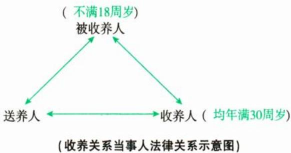

flowchart

```mermaid
graph TD
    A["被收养人"] -->|不满18周岁| B["收养人（均年满30周岁）"]
    A --> C["送养人"]
    C --> D["收养人（均年满30周岁）"]
```

#### (一) 被收养人

下列未成年人（不满18周岁），可以被收养：

1. 丧失父母的孤儿（父母均死亡或被宣告死亡的未成年人）；

2. 查找不到生父母的未成年人；

3. 生父母有特殊困难无力抚养的子女。

收养人收养与送养人送养，应当双方自愿。收养8周岁以上未成年人的，应当征得被收养人的同意①（《民法典》第1104条）。

[例] 甲（女，60周岁，丧偶）不可以收养自己19周岁的继女乙，因为乙已经成年。

#### (二) 送养人

下列个人、组织可以作送养人：

1. 孤儿的监护人；

2. 儿童福利机构；

3. 有特殊困难无力抚养子女的生父母。生父母送养子女，应当双方共同送养。生父母一方不明或查找不到的，可以单方送养。配偶一方死亡，另一方送养未成年子女的，死亡一方的父母有优先抚养的权利（《民法典》第1108条）。

#### (三) 收养人

1. 原则。

(1) 无子女或只有 1 名子女；
(2) 有抚养、教育和保护被收养人的能力；
(3) 未患有在医学上认为不应当收养子女的疾病；
(4) 无不利于被收养人健康成长的违法犯罪记录；
(5) 年满 30 周岁。

[萌主点拨] 收养人的条件

收养人应当同时具备的条件，即“无子一子有能力；无病无罪满30”。

2. 特殊收养关系。

（1）无配偶者收养异性子女的，收养人与被收养人的年龄应当相差40周岁以上（基于男女平等原则，年龄差的目的在于尽可能客观上防止借收养之名行侵害之实/有利于未成年人的健康成长/《民法典》第1102条）。

(2) 有配偶者收养子女，应当夫妻共同收养。

[例] 甲（女，45周岁，有配偶）不可以单独收养自己5周岁的外甥。因为有配偶者收养子女，应当（必须）夫妻共同收养，不得单独收养。

（3）收养三代以内旁系同辈血亲的子女（兄弟姐妹的子女、堂兄弟姐妹的子女和表兄弟姐妹的子女），可以不受生父母有特殊困难无力抚养的子女、有特殊困难无力抚养子女的生父母和无配偶者收养异性子女的，收养人与被收养人的年龄应当相差40周岁以上规定的限制（过继子女不受年龄限制）。

（4）华侨（在国外定居的具有中国国籍的自然人）收养三代以内旁系同辈血亲的子女，还可以不受无子女或只有1名子女的限制（华侨过继子女不受年龄和收养人子女数量限制）。

（5）无子女的收养人可以收养2名子女；有子女的收养人只能收养1名子女。收养孤儿、残疾未成年人（包括身体残疾和精神残疾两类）或儿童福利机构抚养的查找不到生父母的未成年人，可以不受前述和无子女或只有1名子女的限制。

[萌主点拨] 孤儿或生父母无力抚养的子女，可以由生父母的亲属、朋友抚养；抚养人与被抚养人的关系不适用《民法典·婚姻家庭编》第五章规定。

(6) 继父或继母经继子女的生父母同意（生父母的收养同意权），可以收养继子女，并可以不受生父母有特殊困难无力抚养的子女、有特殊困难无力抚养子女的生父母、《民法典》第1098条和无子女的收养人可以收养2名子女、有子女的收养人只能收养1名子女的限制（收养前直系姻亲关系/收养后拟制直系血亲关系/条件放宽，立法采鼓励和支持的态度/《民法典》第1103条）。

##### 随堂练习

沈某（男29周岁）与邱某（31周岁）均为再婚，二人婚前均有一子一女，分别为沈俊（5周岁）沈俏（4周岁）和冯靓（7周岁）冯丽（3周岁）。经沈某前妻和邱某前夫同意，二人计划收养对方子女，组成新的六人家庭。关于本案，下列说法正确的是？(2022金题-2-1-27，多) $^{①}$

A. 沈某前妻和邱某前夫是否有特殊困难不影响收养

B. 沈某未满30周岁，不可以收养冯靓和冯丽

C. 邱某已满 30 周岁，可以收养沈俊和沈俏

D. 沈某可以但只能收养冯靓和冯丽中的一人

#### 二、收养关系的成立

收养应当向县级以上人民政府民政部门登记。收养关系自登记之日起成立。收养查找不到生父母的未成年人的，办理登记的民政部门应当在登记前予以公告。收养关系当事人愿意签订收养协议的，可以签订收养协议。收养关系当事人各方或一方要求办理收养公证的，应当办理收养公证。县级以上人民政府民政部门应当依法进行收养评估。

#### 三、收养关系的效力 $^{②}$

#### （一）养子女与养父母及其他近亲属的关系

自收养关系成立之日起，养父母与养子女间的权利义务关系，适用《民法典》关于父母子女关系的规定；养子女与养父母的近亲属间的权利义务关系，适用《民法典》关于子女与父母的近亲属关系的规定。

#### （二）养子女与生父母及其他近亲属的关系

自收养关系成立之日起，养子女与生父母及其他近亲属间的权利义务关系，因收养关系的成立而消除。

#### (三)子女姓氏

养子女可以随养父或养母的姓氏，经当事人协商一致，也可以保留原姓氏。

#### (四) 无效收养

有《民法典》总则编关于民事法律行为无效规定情形或违反婚姻家庭编规定的收养行为无效。无效的收养行为自始没有法律约束力。

#### 四、收养关系的解除 $^{①}$

#### (一) 条件和限制

#### 1. 未成年养子女。

收养人在被收养人成年以前，不得解除收养关系，但是收养人、送养人双方协议解除的除外。养子女8周岁以上的，应当征得本人同意。收养人不履行抚养义务，有虐待、遗弃等侵害未成年养子女合法权益行为的，送养人有权要求解除养父母与养子女间的收养关系。送养人、收养人不能达成解除收养关系协议的，可以向法院提起诉讼。

#### 2. 成年养子女。

养父母与成年养子女关系恶化、无法共同生活的，可以协议解除收养关系。不能达成协议的，可以向法院提起诉讼。

#### (二) 解除登记

当事人协议解除收养关系的，应当到民政部门办理解除收养关系登记。

#### （三）法律效力

收养关系解除后，养子女与养父母及其他近亲属间的权利义务关系即行消除，与生父母及其他近亲属间的权利义务关系自行恢复。但是，成年养子女与生父母及其他近亲属间的权利义务关系是否恢复，可以协商确定。

收养关系解除后，经养父母抚养的成年养子女，对缺乏劳动能力又缺乏生活来源的养父母，应当给付生活费。因养子女成年后虐待、遗弃养父母而解除收养关系的，养父母可以要求养子女补偿收养期间支出的抚养费。

生父母要求解除收养关系的，养父母可以要求生父母适当补偿收养期间支出的抚养费，但是因养父母虐待、遗弃养子女而解除收养关系的除外。

PART

# 第七部分

#### 继承编

text_image

VI

继承编（第1119—1163条）共45条，约占整个《民法典》的 $3.57\%$ 。包括4章，分别是：

第一章 一般规定（第 1119—1125 条，共 7 条）；

第二章 法定继承（第 1126—1132 条，共 7 条）；

第三章 遗嘱继承和遗赠（第 1133—1144 条，共 12 条）；

第四章 遗产的处理（第 1145—1163 条，共 19 条）。

## 43 专题四十三 继承

#### 复习提要

本编调整因继承产生的民事关系，国家保护自然人的继承权。本专题主要涉及八个问题：1. 继承的基本原理；2. 继承权的放弃和丧失；3. 继承方式之法定继承；4. 继承方式之遗嘱继承；5. 代位继承和转继承；6. 遗产的处理；7. 遗赠和遗赠扶养协议；8. 限定继承和遗产已分割尚未清偿债务的处理。该专题系绝对的难点，在备考中应通过多做题、多练习，反复琢磨。

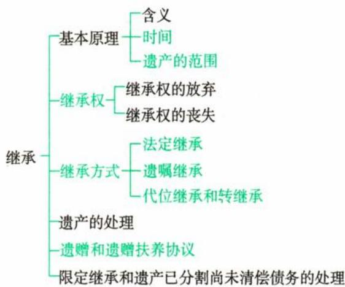

flowchart

```mermaid
graph TD
    A["继承"] --> B["基本原理"]
    A --> C["继承权"]
    A --> D["继承方式"]
    A --> E["遗产的处理"]
    A --> F["遗赠和遗赠扶养协议"]
    A --> G["限定继承和遗产已分割尚未清偿债务的处理"]
    
    B --> H["含义"]
    B --> I["时间"]
    B --> J["遗产的范围"]
    
    C --> K["继承权的放弃"]
    C --> L["继承权的丧失"]
    
    D --> M["法定继承"]
    D --> N["遗嘱继承"]
    D --> O["代位继承和转继承"]
```

#### 一、基本原理

#### (一) 含义

继承，是指自然人死亡后，由法律规定的一定范围内的人或遗嘱指定的人依法取得死者遗留的个人合法财产的法律制度。

[萌主点拨] 继承人和被继承人都只能是自然人；法人和非法人组织只能成为受遗赠人。

#### (二) 时间①

继承从被继承人死亡时（包括生理死亡和宣告死亡）开始。相互有继承关系的数人在同一事件中死亡，难以确定死亡时间的，如何确定死亡先后时间？

死亡时间的推定

<table><tr><td>项目</td><td>具体情形</td><td>处理</td></tr><tr><td>情形1</td><td>事故以外都没有其他继承人</td><td>死亡先后顺序无所谓</td></tr><tr><td>情形2</td><td>事故以外都有其他继承人</td><td>按照常理进行推定,两句话:(1)长辈先死晚辈后死;(2)同辈同时死,互相不继承</td></tr><tr><td>情形3</td><td>事故以外有的有其他继承人,有的没有其他继承人</td><td>没有其他继承人的人先死亡(防止遗产归公)</td></tr></table>

#### (三) 遗产的范围①

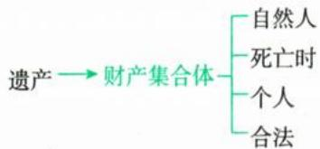

flowchart

```mermaid
graph LR
    A["遗产"] --> B["财产集合体"]
    B --> C["自然人"]
    B --> D["死亡时"]
    B --> E["个人"]
    B --> F["合法"]
```

(遗产的范围体系框架图)

遗产是自然人死亡时遗留的个人合法财产。依照法律规定或根据其性质不得继承的遗产，不得继承（《民法典》第1122条）。

继承权的主体是自然人，客体是被继承人的遗产，系财产集合体。

1. 自然人。法人终止后的财产并非遗产。

2. 死亡时。自然人因侵害行为（加害行为）致死而产生的“死亡赔偿金”并非遗产；自然人死亡后，因第三人侵害行为（加害行为）而导致死者人格利益受到侵害，其近亲属的精神损害赔偿金（精神损害抚慰金）并非遗产。

3. 个人。夫妻共同所有的财产，除有约定的外，遗产分割时，应当先将共同所有的财产的一半分出为配偶所有，其余的为被继承人的遗产。同时，夫妻一方死亡后另一方再婚的，有权处分所继承的财产，任何组织或者个人不得干涉（《民法典》第1153、1157条）。

4. 合法。因赌博、嫖娼或买卖毒品而产生的违法之债并非遗产。

5. 财产。著作权中的署名权等人身性权利，不能成为遗产被继承。自然人股东死亡后，其合法继承人可以继承股东资格；但是，公司章程另有规定的除外（《公司法》第90条）。

#### 二、继承权的放弃和丧失

#### (一) 继承权的放弃 $^{②}$ (主动)

<table><tr><td>死亡前</td><td>继承开始后遗产分割前</td><td>遗产分割后</td></tr><tr><td>放弃行为无效导致不能履行法定义务的无效</td><td>放弃对象(遗产管理人、其他继承人或法院)放弃方式(书面形式)放弃效力(溯及到继承开始的时间)</td><td>放弃的不再是继承权而是遗产所有权</td></tr><tr><td></td><td>反悔的,由法院决定</td><td>反悔的,不予承认</td></tr></table>

(继承权的主动放弃法律关系示意图)

① 考查 2 次，抓住重点。
②《民法典》第1124条共1条规定了继承权的放弃制度。考查3次，抓住重点。

#### 1. 含义。

继承人（包括法定继承人和遗嘱继承人/可以是继承人本人，也可以是继承人的代理人）在继承开始后，遗产处理前（分割前），以明示的方式作出的拒绝接受被继承人遗产的意思表示（《民法典》第1124条）。继承权的放弃属于单方民事法律行为。

#### 2. 对象。

继承人放弃继承的书面意思表示，可以向遗产管理人作出，也可以向其他继承人作出，在涉及遗产诉讼中也可以向法院作出。

#### 3. 方式。

继承人放弃继承应当以书面形式 $^{①}$ 向遗产管理人或其他继承人表示。在诉讼中，继承人向法院以口头方式表示放弃继承的，要制作笔录，由放弃继承的人签名。同时，放弃继承必须以明示方式作出，不得以默示方式作出。

#### 4. 时间。

继承人放弃继承的意思表示，应当在继承开始后、遗产处理前（分割前）作出。继承人在被继承人死亡前作出放弃的意思表示的，放弃行为无效。遗产处理后（分割后）表示放弃的不再是继承权，而是遗产所有权。

#### 5. 反悔。

遗产处理前或在诉讼进行中，继承人对放弃继承反悔的，由法院根据其提出的具体理由，决定是否承认。遗产处理后，继承人对放弃继承反悔的，不予承认。

#### 6. 效力。

继承人因放弃继承权，致其不能履行法定义务的，放弃继承权的行为无效（不得以放弃权利而不履行义务）。放弃继承的效力，追溯到继承开始的时间。

#### （二）继承权的丧失 $^{②}$ （被动）

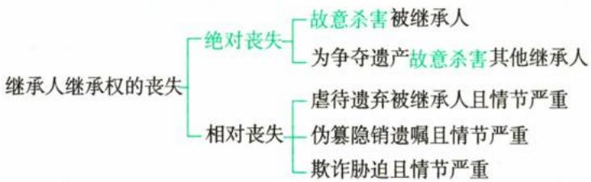

flowchart

```mermaid
graph TD
    A["继承人继承权的丧失"] --> B["绝对丧失"]
    A --> C["相对丧失"]
    B --> D["故意杀害被继承人"]
    B --> E["为争夺遗产故意杀害其他继承人"]
    C --> F["虐待遗弃被继承人且情节严重"]
    C --> G["伪篡隐销遗嘱且情节严重"]
    C --> H["欺诈胁迫且情节严重"]
```

(继承权的丧失体系框架图)

#### 1. 含义。

继承人因对被继承人或其他继承人有法律规定的违法行为而被依法剥夺继承权，从而丧失继承权的法律制度。

#### 2. 法定情形。

(1) 故意杀害被继承人（绝对丧失）。

继承人故意杀害被继承人的，不论是既遂还是未遂，均应当确认其丧失继承权。

(2) 为争夺遗产故意杀害其他继承人（绝对丧失）。

继承人有故意杀害被继承人或为争夺遗产故意杀害其他继承人之行为，而被继承人以遗嘱将遗产指定由该继承人继承的，可以确认遗嘱无效，并确认该继承人丧失继承权。

(3) 遗弃被继承人或虐待被继承人情节严重（相对丧失）。

继承人是否符合“虐待被继承人情节严重”，可以从实施虐待行为的时间、手段、后果和社会影响等方面认定。虐待被继承人情节严重的，不论是否追究刑事责任，均可确认其丧失继承权。

(4) 伪造、篡改、隐匿或销毁遗嘱，情节严重（相对丧失）。

继承人伪造、篡改、隐匿或销毁遗嘱，侵害了缺乏劳动能力又无生活来源的继承人的利益，并造成其生活困难的，应当认定为“情节严重”。

(5) 以欺诈、胁迫手段迫使或妨碍被继承人设立、变更或撤回遗嘱，情节严重（相对丧失）。

继承人有上述第（3）—（5）项行为，确有悔改表现，被继承人表示宽恕（性质上为感情表示/准民事法律行为）或事后在遗嘱中将其列为继承人的，该继承人不丧失继承权。

受遗赠人有上述第（1）—（5）项规定行为的，丧失受遗赠权。

#### 三、继承方式之法定继承①

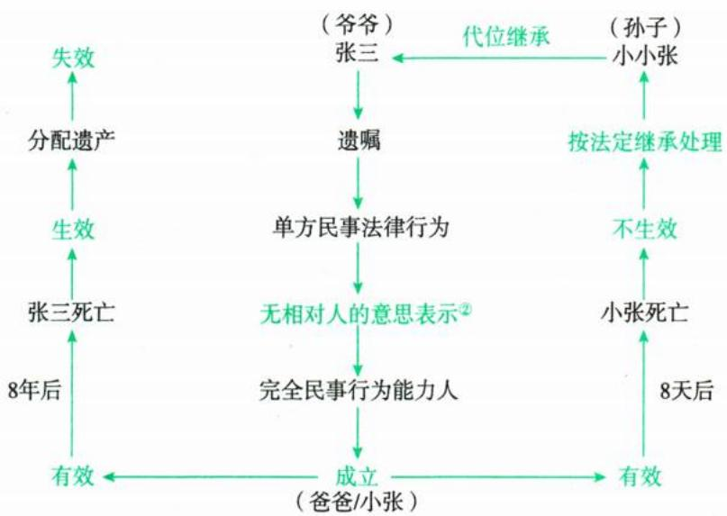

flowchart

```mermaid
graph TD
    A["失效"] --> B["分配遗产"]
    B --> C["生效"]
    C --> D["张三死亡"]
    D --> E["有效"]
    E --> F["成立 (爸爸/小张)"]
    F --> G["有效"]
    G --> H["小张死亡"]
    H --> I["不生效"]
    I --> J["按法定继承处理"]
    J --> K["(孙子) 小小张"]
    K --> L["代位继承"]
    L --> M["(爷爷) 张三"]
    M --> N["遗嘱"]
    N --> O["单方民事法律行为"]
    O --> P["无相对人的意思表示②"]
    P --> Q["完全民事行为能力人"]
    Q --> R["有效"]
    R --> S["8年后"]
```

(继承方式当事人法律关系体系框架图)

#### (一) 含义

在没有遗赠扶养协议和遗嘱或遗赠扶养协议和遗嘱无效的情况下，继承人依据法律确定的继承人范围、继承顺序以及遗产分配的原则，取得被继承人遗产的继承方式。

#### (二) 情形

1. 遗嘱继承人放弃继承或受遗赠人放弃受遗赠。
2. 遗嘱继承人丧失继承权或受遗赠人丧失受遗赠权。
3. 遗嘱继承人、受遗赠人先于遗嘱人死亡或终止。
4. 遗嘱无效部分所涉及的遗产。
5. 遗嘱未处分的遗产。

#### (三) 顺序

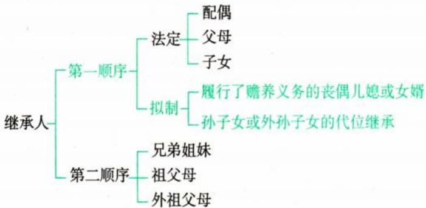

flowchart

```mermaid
graph TD
    A["继承人"] --> B["第一顺序"]
    A --> C["第二顺序"]
    B --> D["法定"]
    B --> E["拟制"]
    D --> F["配偶"]
    D --> G["父母"]
    D --> H["子女"]
    C --> I["兄弟姐妹"]
    C --> J["祖父母"]
    C --> K["外祖父母"]
    E --> L["履行了赡养义务的丧偶儿媳或女婿"]
    E --> M["孙子女或外孙子女的代位继承"]
```

(继承顺序法律关系示意图)

继承人顺序

<table><tr><td rowspan="3">第一顺序</td><td>第一顺序法定继承人</td><td>配偶、父母和子女。其中,子女包括:婚生子女(人工授精/试管婴儿视为婚生子女)、非婚生子女、养子女、有扶养关系的继子女和胎儿</td></tr><tr><td rowspan="2">第一顺序拟制继承人</td><td>(1)丧偶儿媳对公婆,丧偶女婿对岳父母,尽了主要赡养义务的,不论再婚与否均可作为第一顺序的拟制继承人</td></tr><tr><td>(2)孙子女和外孙子女的代位继承</td></tr><tr><td>第二顺序</td><td colspan="2">兄弟姐妹、祖父母、外祖父母。继承开始后,由第一顺序继承人继承,第二顺序继承人不继承;没有第一顺序继承人继承的,由第二顺序继承人继承</td></tr></table>

#### (四) 遗产分配

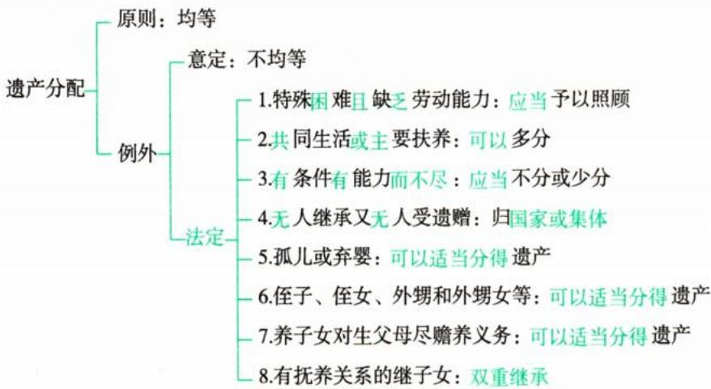

flowchart

```mermaid
graph TD
    A["遗产分配"] --> B["原则：均等"]
    A --> C["例外"]
    C --> D["意定：不均等"]
    C --> E["法定"]
    E --> F1["1.特殊困难且缺乏劳动能力：应当予以照顾"]
    E --> F2["2.共同生活或主要扶养：可以多分"]
    E --> F3["3.有条件有能力而不尽：应当不分或少分"]
    E --> F4["4.无人继承又无人受遗赠：归国家或集体"]
    E --> F5["5.孤儿或弃婴：可以适当分得遗产"]
    E --> F6["6.侄子、侄女、外甥和外甥女等：可以适当分得遗产"]
    E --> F7["7.养子女对生父母尽赡养义务：可以适当分得遗产"]
    E --> F8["8.有抚养关系的继子女：双重继承"]
```

(遗产分配体系框架图)

遗产分配

<table><tr><td>原则</td><td colspan="2">同一顺序继承人继承遗产的份额,一般应当均等</td></tr><tr><td rowspan="8">例外</td><td>意定</td><td>继承人协商同意的,也可以不均等</td></tr><tr><td rowspan="7">法定</td><td>(1)对生活有特殊困难又缺乏劳动能力的继承人,分配遗产时,应当予以照顾</td></tr><tr><td>(2)对被继承人尽了主要扶养义务或与被继承人共同生活的继承人,分配遗产时,可以多分。对被继承人生活提供了主要经济来源,或在劳务等方面给予了主要扶助的,应当认定其尽了主要赡养义务或主要扶养义务</td></tr><tr><td>(3)有扶养能力、条件而不尽扶养义务的继承人,应当不分或少分。继承人有扶养能力和扶养条件,愿意尽扶养义务,但被继承人因有固定收入和劳动能力,明确表示不要求其扶养的,分配遗产时,一般不应因此而影响其继承份额。有扶养能力和扶养条件的继承人虽然与被继承人共同生活,但对需要扶养的被继承人不尽扶养义务,分配遗产时,可以少分或不分</td></tr><tr><td>(4)无人继承又无人受遗赠的遗产,归国家所有,用于公益事业;死者生前是集体所有制组织成员的,归所在集体所有制组织所有。遗产因无人继承又无人受遗赠归国家或集体所有制组织所有时,可以分给适当遗产的人提出取得遗产的诉讼请求,法院应当视情况适当分给遗产</td></tr><tr><td>(5)对继承人以外的依靠被继承人扶养的人(如捡到孤儿或弃婴但未办理收养登记手续),或继承人以外的对被继承人扶养较多的人(如侄子、侄女、外甥、外甥女等),可以分给适当的遗产。可以分给适当遗产的人,分给他们遗产时,按具体情况可以多于或少于继承人。可以分给适当遗产的人,在其依法取得被继承人遗产的权利受到侵犯时,本人有权以独立的诉讼主体资格向法院提起诉讼(遗产酌给制度/《民法典》第1131条)</td></tr><tr><td>(6)被收养人对养父母尽了赡养义务,同时又对生父母扶养较多的,除可继承养父母的遗产外,还可分得生父母的适当的遗产</td></tr><tr><td>(7)因为有抚养关系而取得继父母的继承权的继子女不影响享有其生父母的继承权(双重继承规则)</td></tr></table>

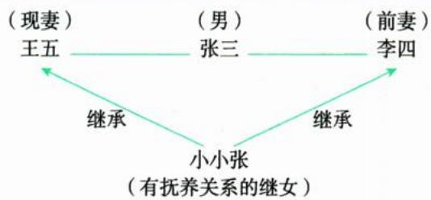

flowchart

```mermaid
graph TD
    A["王五"] -->|继承| B["小小张"]
    C["张三"] -->|继承| B["小小张"]
    D["李四"] -->|继承| B["小小张"]
    E["（现妻）"] --> A["王五"]
    F["（男）"] --> C["张三"]
    G["（前妻）"] --> D["李四"]
    H["（有抚养关系的继女）"] --> B["小小张"]
```

(有抚养关系的继子女双重继承示意图)

[例] 张三（男）和李四（女）系夫妻。婚后，二人生育一子小张和一女小小张。在小张20周岁那年。张三和李四离婚。女儿小小张（10周岁）和张三一起生活。后张三与王五结婚。张三、王五和小小张组成了一个新的家庭。此时：

小张与王五之间无抚养关系，二者互相均无权继承对方的遗产，即小张不能继承王五的遗产，王五也不能继承小张的遗产。

小小张和王五之间有抚养关系，小小张既可以继承生母李四的遗产，也可以继承有抚养关系的继母王五的遗产。

#### 四、继承方式之遗嘱继承①

#### (一) 适用条件

1. 没有遗赠扶养协议。
2. 立有遗嘱且合法有效。
3. 遗嘱继承人没有放弃、丧失继承权，也未先于被继承人死亡。

#### (二) 形式

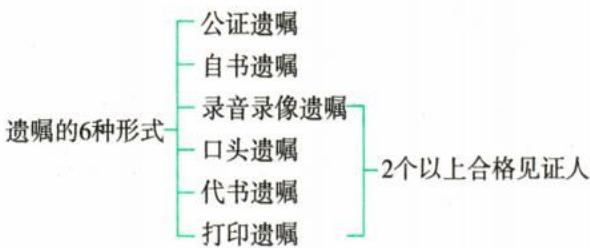

flowchart

```mermaid
graph TD
    A["遗嘱的6种形式"] --> B["公证遗嘱"]
    A --> C["自书遗嘱"]
    A --> D["录音录像遗嘱"]
    A --> E["口头遗嘱"]
    A --> F["代书遗嘱"]
    A --> G["打印遗嘱"]
    H["2个以上合格见证人"] --> A
```

(遗嘱的6种形式体系框架图)

1. 公证遗嘱。

由遗嘱人经公证机构办理。公证遗嘱不再效力最优，与其他5类遗嘱形式价值位阶相同。

2. 自书遗嘱。

由遗嘱人亲笔书写，签名，注明年、月、日。自然人在遗书中涉及死后个人财产处分的内容，确为死者的真实意思表示，有本人签名并注明了年、月、日，又无相反证据的，可以按自书遗嘱对待。

3. 录音录像遗嘱。

(1) 应当有 2 个以上见证人在场见证。

下列人员不能作为遗嘱见证人：无民事行为能力人、限制民事行为能力人以及其他不具有见证能力的人；继承人、受遗赠人；与继承人、受遗赠人有利害关系的人。继承人、受遗赠人的债权人、债务人，共同经营的合伙人，也应当视为与继承人、受遗赠人有利害关系，不能作为遗嘱的见证人。

(2) 遗嘱人和见证人应当在录音录像中记录其姓名或肖像，以及年、月、日。

4. 口头遗嘱。

(1) 应当有 2 个以上见证人在场见证；

（2）遗嘱人在危急情况下，可以立口头遗嘱。危急情况消除后，遗嘱人能够以书面或录音录像形式立遗嘱的，所立的口头遗嘱无效。

[例] 甲有乙、丙和丁三个女儿。甲于2024年1月1日亲笔书写一份遗嘱，写明其全部遗产由乙继承，并签名和注明年月日。同年3月2日，甲又请张律师代书一份遗嘱，写明其全部遗产由丙继承。同年5月3日，甲因病被丁送至医院急救，甲又立口头遗嘱一份，内容是其全部遗产由丁继承，在场的赵医生和李护士见证。甲病好转后出院休养，未立新遗嘱。如甲死亡，乙是甲遗产的继承权人。

#### 5. 代书遗嘱。

(1) 应当有 2 个以上见证人在场见证。

(2) 由其中一人代书, 并由遗嘱人、代书人和其他见证人签名, 注明年、月、日。代书遗嘱不是代理, 遗嘱行为不得代理, 必须由遗嘱人亲自实施。遗嘱不得代理, 可以代书。

#### 6. 打印遗嘱。

(1) 应当有 2 个以上见证人在场见证。

(2) 遗嘱人和见证人应当在遗嘱每一页签名，注明年、月、日。

#### (三) 效力

#### 1. 基本规定。

遗嘱人可以撤回、变更自己所立的遗嘱。立遗嘱后，遗嘱人实施与遗嘱内容相反的民事法律行为的，视为对遗嘱相关内容的撤回。立有数份遗嘱，内容相抵触的，以最后的遗嘱为准。

#### 2. 无效遗嘱。

遗嘱作为单方民事法律行为，无相对人的意思表示，在效力上仅有两种可能性，即有效的遗嘱和无效的遗嘱。

(1) 无民事行为能力人或限制民事行为能力人所立的遗嘱无效。

(2) 遗嘱必须表示遗嘱人的真实意思，受欺诈、胁迫所立的遗嘱无效。

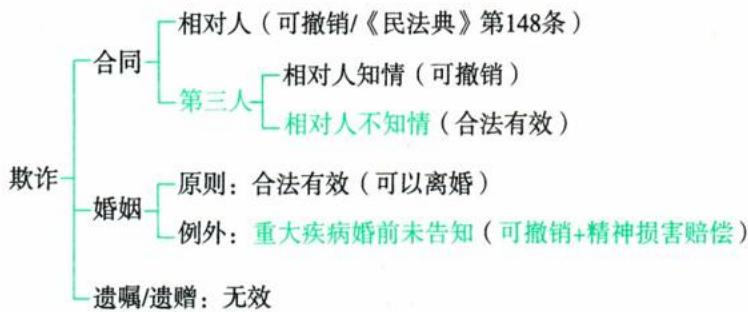

flowchart

```mermaid
graph TD
    A["欺诈"] --> B["合同"]
    A --> C["婚姻"]
    B --> D["相对人（可撤销/《民法典》第148条）"]
    B --> E["第三人"]
    E --> F["相对人知情（可撤销）"]
    E --> G["相对人不知情（合法有效）"]
    C --> H["原则：合法有效（可以离婚）"]
    C --> I["例外：重大疾病婚前未告知（可撤销+精神损害赔偿）"]
    A --> J["遗嘱/遗赠：无效"]
```

(欺诈对不同民事法律行为效力影响体系框架图)

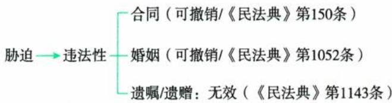

flowchart

```mermaid
graph LR
    A["胁迫"] --> B["违法性"]
    B --> C["合同（可撤销/《民法典》第150条）"]
    B --> D["婚姻（可撤销/《民法典》第1052条）"]
    B --> E["遗嘱/遗赠：无效（《民法典》第1143条）"]
```

(胁迫对不同民事法律行为效力影响体系框架图)

(3) 伪造的遗嘱无效。

(4) 遗嘱被篡改的，篡改的内容无效。

(5) 遗嘱人以遗嘱处分了国家、集体或他人（配偶）财产的，应当认定该部分遗嘱无效。

[例] 甲立下遗嘱，误将乙的字画分配给继承人。甲的遗嘱无效。

(6) 未对缺乏劳动能力又没有生活来源的继承人保留必要的遗产份额的, 对应当保留的必要份额的处分无效 (遗嘱必留份制度/《民法典》第1141条)。

[例] 张三亲笔书写一份自书遗嘱：“待我死后，自己的房屋归母亲叶某所有。”2年后，张三死亡。此时，张三尚有两个未成年子女，儿子小张（12周岁）和女儿小小张（6周岁）。因此，张三未给两个未成年子女留有遗产，自书遗嘱部分无效。

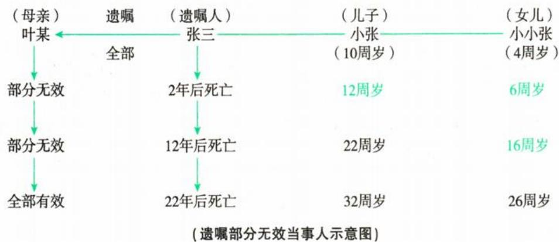

flowchart

```mermaid
graph TD
    A["叶某"] --> B["部分无效"]
    B --> C["部分无效"]
    C --> D["全部有效"]
    E["张三"] --> F["2年后死亡"]
    F --> G["12年后死亡"]
    G --> H["22年后死亡"]
    I["小张"] --> J["10周岁"]
    J --> K["12周岁"]
    K --> L["22周岁"]
    L --> M["32周岁"]
    N["女儿"] --> O["4周岁"]
    P["遗嘱人"] --> Q["全部"]
    Q --> R["遗嘱"]
    S["遗嘱部分无效当事人示意图"]
```

#### (四) 附义务的遗嘱

遗嘱继承或遗赠附有义务的，继承人或受遗赠人应当履行义务。没有正当理由不履行义务的，经利害关系人或有关组织请求，法院可以取消其接受附义务部分遗产的权利。附义务的遗嘱继承或遗赠，如义务能够履行，而继承人、受遗赠人无正当理由不履行，经受益人或其他继承人请求，法院可以取消其接受附义务那部分遗产的权利，由提出请求的继承人或受益人负责按遗嘱人的意愿履行义务，接受遗产。

#### 五、代位继承和转继承①

代位继承 VS 转继承

<table><tr><td>项目</td><td>代位继承</td><td>转继承</td></tr><tr><td>法律依据</td><td>《民法典》第1128条</td><td>《民法典》第1152条</td></tr><tr><td>含义</td><td>被继承人的子女先于被继承人死亡的,由被继承人的子女的直系晚辈血亲代位继承。被继承人的兄弟姐妹先于被继承人死亡的,由被继承人的兄弟姐妹的子女代位继承</td><td>继承开始后,继承人于遗产分割前死亡,并没有放弃继承的,该继承人应当继承的遗产转给其继承人,但是遗嘱另有安排的除外</td></tr><tr><td>本质</td><td>继承权的转移(一次继承)</td><td>分割被继承人遗产的权利(两次继承)</td></tr><tr><td>适用情形</td><td>被继承人的子女先于被继承人死亡或被继承人的兄弟姐妹先于被继承人死亡(法定继承)</td><td>继承开始后遗产分割前继承人死亡</td></tr><tr><td>权利主体</td><td>被代位人的直系晚辈血亲(无辈数限制)</td><td>被转继承人死亡时生存的所有合法继承人(无辈数限制)</td></tr></table>

#### (一) 传统型代位继承

被继承人的孙子女、外孙子女、曾孙子女、外曾孙子女都可以代位继承，代位继承人不受辈数的限制。但是，因为有抚养关系的继子女不属于血亲（自然血亲和拟制血亲）。因此，无代位继承权。

[例] 2024年10月10日，爸爸小甲（50周岁）因车祸身亡。10月20日，爷爷甲（90周岁）因心脏病而死亡。此时，孙子小小甲（10周岁）即可以代爸爸小甲之位继承爷爷甲的遗产。此时，需要注意的是：孙子小小甲是爷爷甲的第一顺序拟制继承人。

一言以蔽之，传统型代位继承的典型情形即：爸爸妈妈先于爷爷奶奶、姥姥姥爷死亡的，孙子女、外孙子女代位继承。

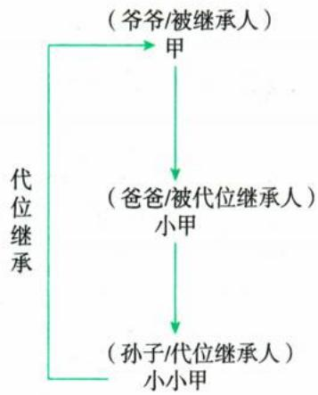

flowchart

```mermaid
graph TD
    A["小甲"] --> B["爸爸/被代位继承人"]
    B --> C["甲"]
    C --> D["(爷爷/被继承人)"]
    D --> E["代位继承"]
    E --> F["孙子/代位继承人"]
    F --> G["小小甲"]
```

(传统型代位继承法律关系示意图)

#### (二) 新型代位继承

[例] 甲和乙二人系兄弟，二者的父母早已病故。甲一生未娶妻生子。2024年2月2日，乙与丙结婚。2025年2月2日，乙的妻子丙生育一子丁。5月29日，乙因车祸身亡。6月28日，甲死亡，留有2000万元遗产。此时，作为侄子的丁即可代位继承伯伯甲的遗产。

一言以蔽之，新型代位继承的典型情形即：侄子、侄女、外甥或外甥女有权代位继承伯伯、叔叔、姑姑、姨妈、舅舅的遗产。

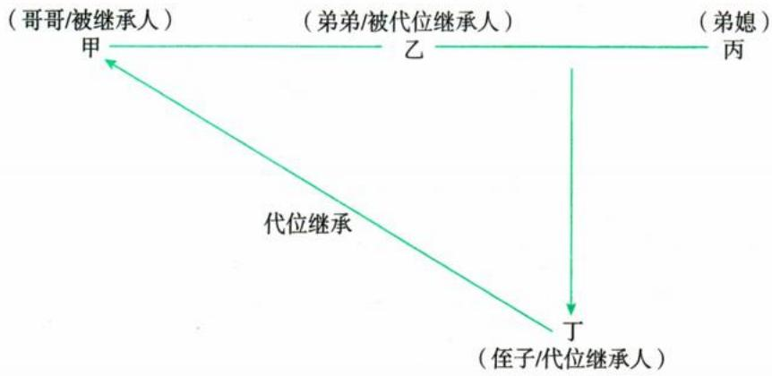

flowchart

```mermaid
graph TD
    甲["(哥哥/被继承人)"] --> 乙["(弟弟/被代位继承人)"]
    甲 --> 丁["(侄子/代位继承人)"]
    乙 --> 丁
    丙["(弟媳)"] --> 乙
    丙 --> 丁
    甲 -->|代位继承| 丁
```

(新型代位继承法律关系示意图)

#### (三) 代位继承和转继承的区别

[例] 2025年5月10日，爷爷甲（男，85周岁）在家中亲笔书写一份有效的自书遗嘱：“待我死后，自己的全部遗产（2000万元）归长子乙所有，并明确次子丙不能继承。”6月25日，长子乙出车祸身亡。7月2日，甲得知此事后伤心欲绝，突发脑溢血死亡。在为甲办理丧事期间，次子丙伤心过度，亦死亡。此时，因遗嘱继承人乙先于遗嘱人甲死亡。因此，甲的遗嘱不生效，按法定继承处理，即长孙丁代位继承1000万元（第一顺序的拟制继承人，一次继承/死得早）。同时，在甲死亡后遗产分割前，丙死亡，次孙戊转继承甲的遗产1000万元（二次继承/死得快）。

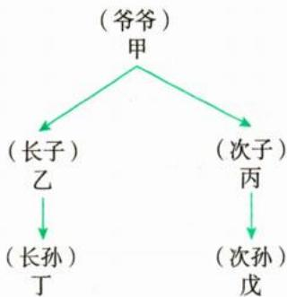

flowchart

```mermaid
graph TD
    A["(爷爷)"] --> B["甲"]
    B --> C["(长子)"]
    B --> D["(次子)"]
    C --> E["乙"]
    E --> F["(长孙)"]
    F --> G["丁"]
    D --> H["(次孙)"]
    H --> I["戊"]
```

(代位继承和转继承的区别示意图)

#### 六、遗产的处理①

#### (一) 遗产管理人

#### 1. 确定。

继承开始后，遗嘱执行人为遗产管理人（民事诉讼法：变更、追加被执行人/对裁定不服的，上级复议）；没有遗嘱执行人的，继承人应当及时推选遗产管理人；继承人未推选的，由继承人共同担任遗产管理人；没有继承人或继承人均放弃继承的，由被继承人生前住所地的民政部门或村民委员会担任遗产管理人。

#### 2. 指定。

对遗产管理人的确定有争议的，利害关系人可以向法院申请指定遗产管理人。

#### 3. 职责。

(1) 清理遗产并制作遗产清单;
(2) 向继承人报告遗产情况；
(3) 采取必要措施防止遗产毁损、灭失；
(4) 处理被继承人的债权债务；
(5) 按照遗嘱或依照法律规定分割遗产;
(6) 实施与管理遗产有关的其他必要行为。

#### 4. 责任。

遗产管理人应当依法履行职责，因故意或重大过失造成继承人、受遗赠人、债权人损害的，应当承担民事责任。

#### 5. 报酬。

遗产管理人可以依照法律规定或按照约定获得报酬。

#### (二) 通知义务

继承开始后，知道被继承人死亡的继承人应当及时通知其他继承人和遗嘱执行人。继承人中无人知道被继承人死亡或知道被继承人死亡而不能通知的，由被继承人生前所在单位或住所地的居民委员会、村民委员会负责通知。

法院在审理继承案件时，如果知道有继承人而无法通知的，分割遗产时，要保留其应继承的遗产，并确定该遗产的保管人或保管单位。

#### （三）保管义务

存有遗产的人，应当妥善保管遗产，任何组织或个人不得侵吞或争抢。

#### (四) 遗产确定

夫妻共同所有的财产，除有约定的外，遗产分割时，应当先将共同所有的财产的一半分出为配偶所有，其余的为被继承人的遗产。遗产在家庭共有财产之中的，遗产分割时，应当先分出他人的财产。

#### (五) 胎儿应留份

《民法典》第1155条共1条规定了胎儿应留份制度。

遗产分割时，应当保留胎儿的继承份额。胎儿娩出时是死体的，保留的份额按照法定继承办理。应当为胎儿保留的遗产份额没有保留的，应从继承人所继承的遗产中扣回。为胎儿保留的遗产份额，如胎儿出生后死亡的，由其继承人继承；如胎儿娩出时是死体的，由被继承人的继承人继承。

[例] 钱某死亡,遗产由其父甲、其母乙、其妻丙和其子丁继承,当时丙已怀孕。上述继承人在继承遗产时为胎儿保留了必要的继承份额。丙分娩时,胎儿死于母体内。此时,有权继承为该胎儿保留份额的人包括甲、乙、丙和丁(按钱某的遗产法定继承)。

#### 七、遗赠和遗赠扶养协议①

#### (一) 遗赠和遗嘱的异同

遗赠 VS 遗嘱

<table><tr><td>项目</td><td>遗赠</td><td>遗嘱</td></tr><tr><td>法律依据</td><td>《民法典》第1124条</td><td>《民法典》第1124条</td></tr><tr><td>性质</td><td>单方民事法律行为</td><td>单方民事法律行为</td></tr><tr><td>对象</td><td>国家、集体或法定继承人以外的自然人(如外孙女、侄子、侄女、保姆等)</td><td>法定继承人(6类)</td></tr><tr><td>沉默后果</td><td>受遗赠人应当在知道受遗赠后60日内,作出接受或放弃受遗赠的表示;到期没有表示的,视为放弃受遗赠</td><td>继承开始后,继承人放弃继承的,应当在遗产处理前,以书面形式作出放弃继承的表示;没有表示的,视为接受继承</td></tr></table>

[例 1] 甲死后留有房屋一间和存款若干, 法定继承人为其子乙。甲生前立有遗嘱,将其存款赠与侄女丙。乙和丙被告知 3 个月后参与甲的遗产分割,但直到遗产分割时,乙与丙均未作出是否接受遗产的意思表示。乙视为接受继承,丙视为放弃接受遗赠。

[例 2] 孙子小甲自书遗嘱一份待自己死后爷爷甲继承其全部遗产。小甲死后爷爷甲对于是否接受继承未作意思表示的，视为接受继承（因为爷爷是孙子的第二顺序法定继承人）。相反，爷爷甲自书遗嘱一份待自己死后孙子小甲继承其全部遗产。甲死后孙子小甲对于是否接受继承未作意思表示的，视为放弃受遗赠（因为孙子不是爷爷的法定继承人）。

#### (二) 遗赠和赠与的异同

遗赠VS赠与

<table><tr><td>项目</td><td>遗赠</td><td>赠与</td></tr><tr><td>有偿否</td><td>无偿</td><td>无偿</td></tr><tr><td>性质</td><td>死因行为</td><td>生前行为</td></tr><tr><td>意思表示数量</td><td>单方民事法律行为</td><td>双方民事法律行为</td></tr><tr><td>要式否</td><td>要式</td><td>不要式</td></tr><tr><td>法律调整</td><td>受继承编调整</td><td>受合同编调整</td></tr></table>

#### (三) 遗赠扶养协议①

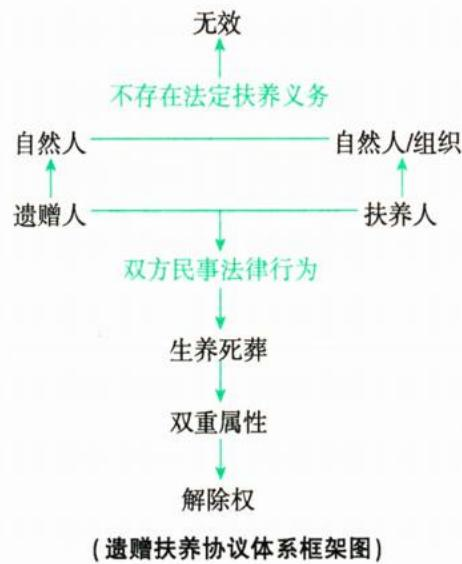

flowchart

```mermaid
graph TD
    A["无效"] --> B["不存在法定扶养义务"]
    C["自然人"] --> D["遗赠人"]
    E["自然人/组织"] --> F["扶养人"]
    G["双方民事法律行为"] --> H["生养生葬"]
    I["双重属性"] --> J["解除权"]
    K["遗赠扶养协议体系框架图"]
```

1. 含义。

自然人可以与继承人以外的组织或个人签订遗赠扶养协议。按照协议，该组织或个人承担该自然人生养死葬的义务，享有受遗赠的权利（《民法典》第1158条）。

2. 性质。

(1) 双方民事法律行为，但不受合同编调整，而受继承编调整。

(2) 扶养人负有对遗赠人的生养死葬义务, 有取得遗赠财产的权利; 如在死亡前, 遗赠人即将财产转移给扶养人, 则该行为的性质将被认定为 “附义务的赠与”。

（3）生前与死因民事法律行为的双重属性。扶养人的扶养义务生前生效，遗赠人财产的赠与在遗赠人死后生效。

3. 主体。

(1) 遗赠人只能是自然人。

（2）扶养人既可以是自然人，也可以是集体所有制组织。当扶养人为自然人时，遗赠人与扶养人之间不能存在法定的扶养义务关系。

孙子女、外孙子女不是法定继承人，但在特殊情况下，其对祖父母、外祖父母负有法定的赡养义务。因此，二者间不得签订“遗赠扶养协议”。如签订，协议无效。

[例] 梁某已80多岁，老伴和子女都已过世，年老体弱，生活拮据，欲立一份遗赠扶养协议，死后将三间房屋送给在生活和经济上照顾自己的人。梁某的外孙子女不可以作遗赠扶养协议的扶养人。因为二者之间存在法定的赡养义务关系。

4. 解除。

继承人以外的组织或个人与自然人签订遗赠扶养协议后，无正当理由不履行，导致协议解除的，不能享有受遗赠的权利，其支付的供养费用一般不予补偿。

遗赠人无正当理由不履行，导致协议解除的，则应当偿还继承人以外的组织或个人已支付的供养费用。

5. 效力。

继承开始后，按照法定继承办理；有遗嘱的，按照遗嘱继承或遗赠办理；有遗赠扶养协议的，按照协议办理。

被继承人生前与他人订有遗赠扶养协议，同时又立有遗嘱的，继承开始后，如果遗赠扶养协议与遗嘱没有抵触，遗产分别按协议和遗嘱处理；如果有抵触，按协议处理，与协议抵触的遗嘱全部或部分无效。

一言以蔽之：遗赠扶养协议>遗嘱（遗赠）>法定继承。

[萌主点拨]
遗赠扶养协议 VS 遗赠

<table><tr><td>区别</td><td>遗赠扶养协议</td><td>遗赠</td></tr><tr><td>意思表示数量</td><td>双方民事法律行为</td><td>单方民事法律行为</td></tr><tr><td>单务或双务</td><td>双务</td><td>单务</td></tr><tr><td>有偿或无偿</td><td>有偿</td><td>无偿</td></tr><tr><td>性质</td><td>生前行为和死因行为的结合</td><td>死因行为</td></tr><tr><td>当事人</td><td>扶养人必须是具有完全民事行为能力的自然人或集体组织;且扶养人无需在遗赠人死亡后作出接受遗赠的意思表示,即可以直接依协议取得遗产</td><td>受遗赠人应当在知道受遗赠后60日内,作出接受或放弃受遗赠的表示;到期没有表示的,视为放弃受遗赠</td></tr></table>

#### 八、限定继承和遗产已分割尚未清偿债务的处理 $^{①}$

#### (一) 限定继承

继承人以所得遗产实际价值为限清偿被继承人依法应当缴纳的税款和债务。超过遗产实际价值部分，继承人自愿偿还的不在此限。继承人放弃继承的，对被继承人依法应当缴纳的税款和债务可以不负清偿责任（《民法典》第1161条）。

#### （二）遗产已分割尚未清偿债务的处理

遗产已被分割而有未清偿债务时，如有法定继承又有遗嘱继承和遗赠的，首先由法定继承人用其所得遗产清偿债务；不足清偿时，剩余的债务由遗嘱继承人和受遗赠人按比例用所得遗产偿还；如果只有遗嘱继承和遗赠的，由遗嘱继承人和受遗赠人按比例用所得遗产偿还。

在遗产已分割完毕，但被继承人尚有未清偿债务时，按如下规则办理：

1. 遗赠扶养协议中的扶养人不承担债务清偿责任。因其已履行对遗赠人的生养死葬义务。

2. 有法定继承的，应当先由法定继承人用所得遗产清偿；不足的，剩余债务由遗嘱继承人、受遗赠人按比例偿还，但以遗产价值为限。

3. 无法定继承的，由遗嘱继承人和受遗赠人按比例偿还，但以遗产价值为限。

[例] 赵某死亡后，甲依遗嘱继承了一套房屋（价值 180 万元），乙依遗赠分得一幅字画（价值 40 万元），丙依法定继承分得现金 60 万元。遗产分割完毕后，赵某的债权人找到甲、乙、丙，要求偿还欠款 40 万元。该欠款应全部由丙偿还，因为丙系法定继承人。

#### >> 随堂练习

何某死后留下一间价值六万元的房屋和四万元现金。何某立有遗嘱，四万元现金由四个子女平分，房屋的归属未作处理。何某女儿主动提出放弃对房屋的继承权，于是三个儿子将房屋变卖，每人分得两万元。现债权人主张何某生前曾向其借款12万元，并有借据为证。下列哪些说法是错误的？(2009-3-67，多)②

A. 何某已死，债权债务关系消灭
B. 四个子女平均分担，每人偿还三万元
C. 四个子女各自以继承所得用于清偿债务，剩下两万元由四人平均分担
D. 四个子女各自以继承所得用于清偿债务，剩下两万元四人可以不予清偿

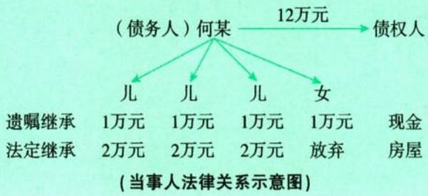

flowchart

```mermaid
graph TD
    A["(债务人) 何某"] -->|12万元| B["债权人"]
    A --> C["儿"]
    A --> D["儿"]
    A --> E["儿"]
    A --> F["女"]
    C --> G["遗嘱继承 1万元"]
    C --> H["法定继承 2万元"]
    D --> I["1万元 2万元"]
    D --> J["1万元 2万元"]
    E --> K["1万元 放弃"]
    F --> L["1万元 现金 房屋"]
```

PART

# 第八部分

#### 侵权责任编

text_image

VII

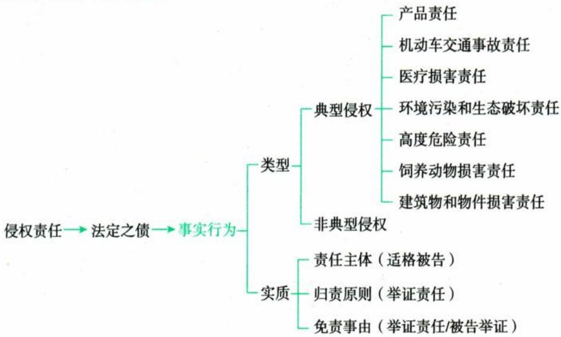

flowchart

```mermaid
graph TD
    A["侵权责任"] --> B["法定之债"]
    B --> C["事实行为"]
    C --> D["类型"]
    C --> E["非典型侵权"]
    D --> F["典型侵权"]
    D --> G["实质"]
    F --> H["产品责任"]
    F --> I["机动车交通事故责任"]
    F --> J["医疗损害责任"]
    F --> K["环境污染和生态破坏责任"]
    F --> L["高度危险责任"]
    F --> M["饲养动物损害责任"]
    F --> N["建筑物和物件损害责任"]
    E --> O["责任主体（适格被告）"]
    E --> P["归责原则（举证责任）"]
    E --> Q["免责事由（举证责任/被告举证）"]
```

侵权责任编（第1164—1258条）共95条，约占整个《民法典》的7.54%。包括10章，分别是：

第一章 一般规定（第 1164—1178 条，共 15 条）；

第二章 损害赔偿（第 1179—1187 条，共 9 条）；

第三章 责任主体的特殊规定（第 1188—1201 条，共 14 条）；

第四章 产品责任（第 1202—1207 条，共 6 条）；

第五章 机动车交通事故责任（第 1208—1217 条，共 10 条）；

第六章 医疗损害责任（第 1218—1228 条，共 11 条）；

第七章 环境污染和生态破坏责任（第 1229—1235 条，共 7 条）；

第八章 高度危险责任（第 1236—1244 条，共 9 条）；

第九章 饲养动物损害责任（第 1245—1251 条，共 7 条）；

第十章 建筑物和物件损害责任（第 1252—1258 条，共 7 条）。

#### 44

## 专题四十四

#### 侵权责任的基本原理

#### 复习提要

本专题主要涉及四个问题：1. 调整范围；2. 归责原则；3. 共同侵权；4. 免责事由。其中，无意思联络的数人侵权中的原因力结合几乎系每年必考内容，备考时应重点关注。

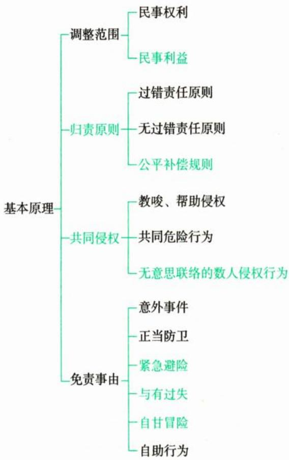

flowchart

```mermaid
graph TD
    A["基本原理"] --> B["调整范围"]
    A --> C["归责原则"]
    A --> D["共同侵权"]
    A --> E["免责事由"]
    B --> F["民事权利"]
    B --> G["民事利益"]
    C --> H["过错责任原则"]
    C --> I["无过错责任原则"]
    C --> J["公平补偿规则"]
    D --> K["教唆、帮助侵权"]
    D --> L["共同危险行为"]
    D --> M["无意思联络的数人侵权行为"]
    E --> N["意外事件"]
    E --> O["正当防卫"]
    E --> P["紧急避险"]
    E --> Q["与有过失"]
    E --> R["自甘冒险"]
    E --> S["自助行为"]
```

#### 一、调整范围 $^{①}$

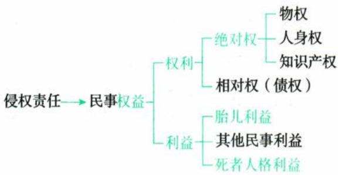

flowchart

```mermaid
graph TD
    A["侵权责任"] --> B["民事权益"]
    B --> C["权利"]
    C --> D["绝对权"]
    D --> E["物权"]
    D --> F["人身权"]
    D --> G["知识产权"]
    C --> H["利益"]
    H --> I["胎儿利益"]
    H --> J["其他民事利益"]
    H --> K["死者人格利益"]
    C --> L["相对权（债权）"]
```

(侵权责任调整范围体系框架图)

#### (一) 民事权利

#### 1. 绝对权

绝对权，又称对世权，是指无须通过义务人实施一定的行为即可实现，并可以对抗不特定人的权利。物权、人身权和知识产权属于典型的绝对权。绝对权受到侵害的，依法可以追究侵权责任。

#### 2. 相对权

相对权，又称对人权，是指必须通过义务人实施一定行为才能实现，只能对抗特定人的权利。债权属于典型的相对权。在考试范围内，债权受到侵害不适用侵权责任的救济途径。

#### （二）民事利益

胎儿利益、死者人格利益或其他民事利益受到侵害的，依法可以获得侵权责任的救济。

#### 二、归责原则 $^{②}$

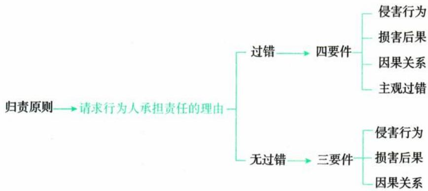

flowchart

```mermaid
graph TD
    A["归责原则"] --> B["请求行为人承担责任的理由"]
    B --> C["过错"]
    C --> D["四要件"]
    D --> E["侵害行为"]
    D --> F["损害后果"]
    D --> G["因果关系"]
    D --> H["主观过错"]
    B --> I["无过错"]
    I --> J["三要件"]
    J --> K["侵害行为"]
    J --> L["损害后果"]
    J --> M["因果关系"]
```

(二元归责原则体系框架图)

归责原则，是指请求行为人承担侵权责任的理由。我国侵权责任确立了“二元归责原则体系”即过错责任原则和无过错责任原则。

#### (一) 过错责任原则

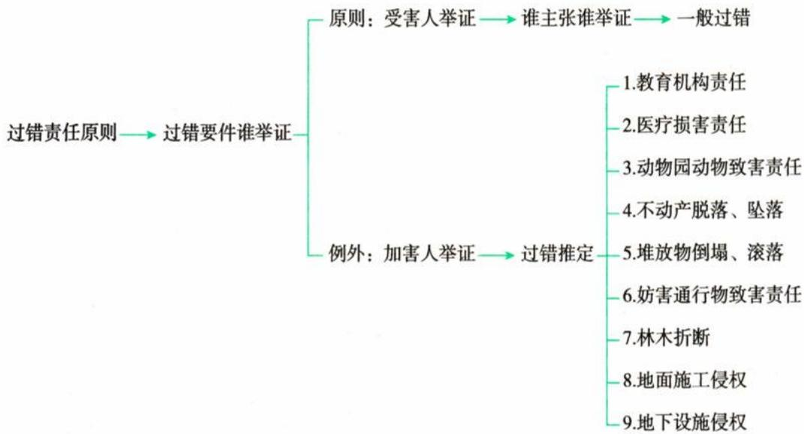

flowchart

```mermaid
graph TD
    A["过错责任原则"] --> B["过错要件谁举证"]
    B --> C["原则：受害人举证"]
    C --> D["谁主张谁举证"]
    D --> E["一般过错"]
    B --> F["例外：加害人举证"]
    F --> G["过错推定"]
    G --> H1["1.教育机构责任"]
    G --> H2["2.医疗损害责任"]
    G --> H3["3.动物园动物致害责任"]
    G --> H4["4.不动产脱落、坠落"]
    G --> H5["5.堆放物倒塌、滚落"]
    G --> H6["6.妨害通行物致害责任"]
    G --> H7["7.林木折断"]
    G --> H8["8.地面施工侵权"]
    G --> H9["9.地下设施侵权"]
```

(过错责任原则的体系框架图)

#### 1. 含义。

通俗而言，过错责任原则，是指有过错才承担侵权责任。

根据 “举证责任” 的不同，过错责任原则又进一步区分为两类，即一般过错（谁主张、谁举证）和过错推定（过错要件举证责任倒置）。

#### 2. 侵权类型。

过错责任原则的侵权行为类型须同时满足四个构成要件：

(1) 侵害行为。

(2) 损害后果。

(3) 因果关系（法律意义上的相当因果关系）。

(4) 主观过错。民法中将过错分为三类即故意、一般过失和重大过失。民法上的过失, 是指未尽社会交往中必需之注意。在复习中, 很多人往往无法准确区分一般过失与重大过失。实质而言, 二者的区别用三个字来概括就是 “看身份”, 即专业人士违反了普通人的预见水平的, 构成重大过失; 普通人违反了普通人的预见水平的, 即为一般过失。

[例 1] 甲搬家公司指派员工郭某为徐某搬家，郭某担心人手不够，请同乡蒙某帮忙。搬家途中，因郭某忘记拴上车厢挡板，蒙某从车上坠地受伤。郭某忘记拴上车厢挡板的行为属于重大过失。因为郭某系专业的搬家公司员工，属于专业人员。

[例 2] 甲将数箱蜜蜂放在自家院中槐树下采蜜。在乙家帮忙筹办婚宴的丙在帮乙喂猪时忘关猪圈，猪冲入甲家院内，撞翻蜂箱，使来甲家串门的丁被蜇伤，经住院治疗后痊愈。丙忘记关猪圈的行为属于一般过失。因为丙属于普通人员而非专业养猪户。

#### （二）无过错责任原则

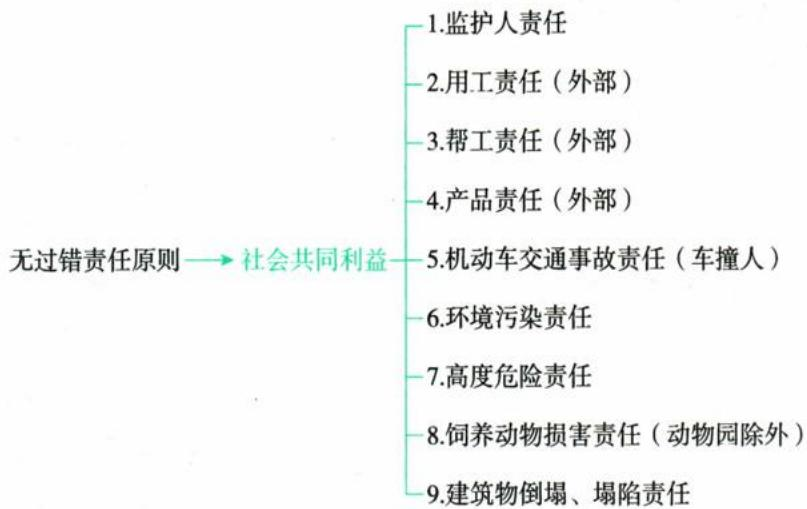

flowchart

```mermaid
graph TD
    A["无过错责任原则"] --> B["社会共同利益"]
    B --> C1["1.监护人责任"]
    B --> C2["2.用工责任（外部）"]
    B --> C3["3.帮工责任（外部）"]
    B --> C4["4.产品责任（外部）"]
    B --> C5["5.机动车交通事故责任（车撞人）"]
    B --> C6["6.环境污染责任"]
    B --> C7["7.高度危险责任"]
    B --> C8["8.饲养动物损害责任（动物园除外）"]
    B --> C9["9.建筑物倒塌、塌陷责任"]
```

(无过错责任原则体系框架图)

#### 1. 含义。

无过错责任原则，又称严格责任原则。通俗而言，无过错责任原则，是指没有过错也要承担侵权责任。

#### 2. 侵权类型。

无过错责任原则的侵权行为类型须同时满足三个构成要件：

（1）侵害行为。对于侵害行为而言，需要强调的是合法行为亦可构成侵害行为（加害行为）。

[例] 在机动车交通事故责任中，即使机动车驾驶人员没有任何过错也要承担不超过10%的赔偿责任。

(2) 损害后果。

(3) 因果关系。

#### （三）公平补偿规则

《民法典》第 1186 条共 1 条规定了侵权责任的公平补偿规则。

#### 1. 性质。

公平责任在性质上属于“公平分担损失的规则”而不属于一种“归责原则”。

#### 2. 适用条件。

(1) 受害人和行为人对损害的发生都没有过错。

对损失的发生，受害人和行为人既不存在故意也不存在过失。之所以在双方都没有过错的情况下分担损失，主要是基于利益平衡的公平考量。

(2) 属于法律规定的适用公平责任的情形。法律规定的情形有: 完全民事行为能力人暂时丧失心智的情形、高空抛物坠物的情形、紧急避险的情形、见义勇为的情形。

(3) 双方当事人的行为需与损害后果的发生具有一定的因果关系。

#### 三、共同侵权①

flowchart

```mermaid
graph TD
    A["广义共同侵权"] --> B["主观共同侵权（狭义共同侵权）"]
    A --> C["共同危险行为（准共同侵权行为）"]
    A --> D["客观共同侵权（原因力竞合的无意思联络的数人侵权行为）"]
```

(广义共同侵权体系框架图)

共同侵权，是指二人以上共同故意或共同过失侵害他人，依法承担连带责任的行为。

#### (一) 教唆、帮助侵权

《民法典》第 1169 条共 1 条规定了教唆、帮助侵权制度。

1. 完全民事行为能力人教唆、帮助完全民事行为能力人。

教唆、帮助他人实施侵权行为的，应当与行为人承担连带责任。

[例] 赵某在公共汽车上因不慎踩到售票员而与之发生口角，售票员在赵某下车之后指着他大喊：“打小偷！”赵某因此被数名行人扑倒在地致伤。对此应由售票员和动手的行人承担责任。

2. 完全民事行为能力人教唆、帮助无民事行为能力人、限制民事行为能力人。

教唆、帮助无民事行为能力人、限制民事行为能力人实施侵权行为，教唆人、帮助人不得以其不知道且不应当知道行为人为无民事行为能力人、限制民事行为能力人为由，主张不承担侵权责任或与行为人的监护人承担连带责任。被侵权人合并请求教唆人、帮助人以及监护人承担侵权责任的，教唆人、帮助人承担侵权人应承担的全部责任；监护人在未尽到监护职责的范围内与教唆人、帮助人共同承担责任，但责任主体实际支付的赔偿费用总和不应超出被侵权人应受偿的损失数额。监护人先行支付赔偿费用后，就超过自己相应责任的部分可以向教唆人、帮助人追偿（《民法典侵权责任编解释（一）》第11、12条）。

#### (二) 共同危险行为 $^{②}$

#### 1. 含义。

共同危险行为（准共同侵权行为），是指数人共同实施危及他人人身、财产的行为并造成损害后果，实际侵害行为人又无法确定的侵权行为。

#### 2. 责任承担和免责事由。

二人以上实施危及他人人身、财产安全的行为，其中一人或数人的行为造成他人损害，能够确定具体侵权人的，由侵权人承担责任；不能确定具体侵权人的，行为人承担连带责任。

[例 1] 甲（10 周岁）、乙（11 周岁）、丙（12 周岁）翻越高速公路天桥旁水泥护栏后，趴在防护网上往高速公路抛掷石块击打过往车辆，其中一石块击中司机丁致其重伤，但无法确认该石块是谁投掷。丁的损害应由甲、乙、丙的监护人连带赔偿。

[例 2] 甲、乙分别在山上伐木，为图方便，各自将伐下的原木从山上滚下，不料其中一块木头砸伤了山下的行人丙，且无法确定是谁推下的这根木头，丙的损害应由甲、乙承担连带责任。

#### (三) 无意思联络的数人侵权行为①

text_image

无意思联络的数人侵权行为
原因力竞合 A或B=C 连带责任
原因力结合 A+B=C 按份责任

(无意思联络的数人侵权行为体系框架图)

从数人分别实施的侵权行为与损害后果之间的因果关系的“原因力”角度进行区分，可以将无意思联络的数人侵权行为区分为两类，分别是无意思联络的原因力竞合的数人侵权和无意思联络的原因力结合的数人侵权。其中，只有无意思联络的原因力竞合的数人侵权才属于共同侵权。

1. 原因力竞合。

二人以上分别实施侵权行为造成同一损害，每个人的侵权行为都足以造成全部损害的，行为人承担连带责任。据此可知，原因力竞合的核心即每个人的侵权行为“都足以”造成全部损害。

2. 原因力结合。

二人以上分别实施侵权行为造成同一损害，能够确定责任大小的，各自承担相应的责任；难以确定责任大小的，平均承担责任。据此可知，原因力结合的核心即每个人的侵权行为“都不足以”造成全部损害，只是各行为人的行为结合在一起才导致最终损害的发生。

[萌主点拨] 原因力结合用公式来表达，即 A+B=C。由 A、B 对 C 承担按份责任。

#### >> 随堂练习

刘女士在地铁站过天桥时，因边走边看手机，不小心被路面翘起来的铁皮绊倒，正好扑倒了同方向行走正在下台阶的王女士，导致王女士摔倒受伤。王女士将刘女士与天桥所属地铁公司诉至法院。关于责任承担，下列说法正确的是？(2020金题-2-1-41，单) $^{②}$

A. 只应由地铁公司承担赔偿责任
B. 地铁公司与刘女士承担连带赔偿责任
C. 地铁公司与刘女士承担按份赔偿责任
D. 只应由刘女士承担赔偿责任

#### 四、免责事由

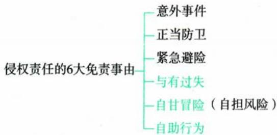

flowchart

```mermaid
graph TD
    A["侵权责任的6大免责事由"] --> B["意外事件"]
    A --> C["正当防卫"]
    A --> D["紧急避险"]
    A --> E["与有过失"]
    A --> F["自甘冒险（自担风险）"]
    A --> G["自助行为"]
```

(侵权责任免责事由体系框架图)

#### (一) 意外事件①

#### 1. 含义。

意外事件，是指非因当事人的故意或过失，由于当事人意志以外的原因而偶然发生的事故。

#### 2. 构成要件。

(1) 意外事件是不可预见的。

确定意外事件的不可预见性适用 “主观标准”，即应以当事人为标准，当事人在当时的环境下，是否通过合理的注意能够预见。

(2) 意外事件是归因于行为人自身以外的原因。

(3) 意外事件是偶然事件。

##### 随堂练习

刘婆婆回家途中，看见邻居肖婆婆带着外孙小勇和另一家邻居的孩子小囡（均为4岁多）在小区花园中玩耍，便上前拿出几根香蕉递给小勇，随后离去。小勇接过香蕉后，递给小囡一根，小囡吞食时误入气管导致休克，经抢救无效死亡。对此，下列哪一选项是正确的？(2017-3-23，单) $^{②}$

A. 刘婆婆应对小囡的死亡承担民事责任
B. 肖婆婆应对小囡的死亡承担民事责任
C. 小勇的父母应对小囡的死亡承担民事责任
D. 属意外事件，不产生相关人员的过错责任

#### (二) 正当防卫 $^{③}$

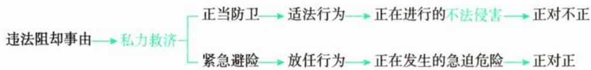

flowchart

```mermaid
graph LR
    A["违法阻却事由"] --> B["私力救济"]
    B --> C["正当防卫"]
    C --> D["适法行为"]
    D --> E["正在进行的不法侵害"]
    E --> F["正对不正"]
    B --> G["紧急避险"]
    G --> H["放任行为"]
    H --> I["正在发生的急迫危险"]
    I --> J["正对正"]
```

(正当防卫和紧急避险法律思维导图)

#### 1. 含义。

正当防卫，是指为了使国家利益、社会公共利益、本人或他人的人身权利、财产权利以及其他合法权益免受正在进行的不法侵害，而针对实施侵害行为的人采取的制止不法侵害的行为（《民法典》第181条和《民法典总则编解释》第30、31条）。

[萌主点拨] 正当防卫属于私力救济手段，属于适法行为，本质系以合法对抗非法、以正对不正。如用木棍击伤抢劫的暴徒、被强暴妇女为解除被侵害而咬伤施暴者的舌头④。

① 考查 1 次，抓住重点。

② 答案：D。

③《民法典》第181条、《民法典总则编解释》第30、31条，共3条规定了正当防卫制度。考查空白，了解一下重点即可。

④ 王泽鉴著：《民法总则》，北京大学出版社，2014年7月版，第536页。

#### 2. 构成要件。

（1）防卫目的：为了使国家利益、社会公共利益、本人或他人的人身权利、财产权利以及其他合法权益免受正在进行的不法侵害。如保护毒品等免受收缴，则不构成正当防卫。
(2) 防卫起因: 存在现实的 (正在实施的) 不法侵害 (“先发制人” 不属于正当防卫)。对无意识能力人的侵害, 如醉汉持刀伤人的, 亦可以实施正当防卫。
(3) 防卫时间：正在进行的不法侵害。

抢夺他人钱包尚在奔跑藏匿之中，但如丢掉钱包，其侵害行为即告结束。

（4）防卫对象：只能是不法侵害人本人。不能针对任何没有实施侵害的第三人的人身，包括实施侵害人的近亲属、同行人员等。

[萌主点拨] 为规避越线车辆的撞击而造成第三人人身、财产损害的，一般可以认定为紧急避险。

#### 3. 责任承担。

因正当防卫造成损害的，不承担民事责任。超过必要的限度 $^{①}$ （防卫过当/比例原则），造成不应有的损害的，正当防卫人应当承担适当的民事责任（《民法典》第181条第2款）。

#### (1) 没有超过必要限度。

经审理，正当防卫没有超过必要限度的，法院应当认定正当防卫人不承担责任。

#### (2) 超过必要限度。

经审理，正当防卫超过必要限度的，法院应当认定正当防卫人在造成不应有的损害范围内承担部分责任；实施侵害行为的人请求正当防卫人承担全部责任的，法院不予支持。

#### (3) 举证责任。

基于 “防卫正当性推定制度”，实施侵害行为的人不能证明防卫行为造成不应有的损害，仅以正当防卫人采取的反击方式和强度与不法侵害不相当为由主张防卫过当的，法院不予支持（《民法典总则编解释》第31条第3款）。

[萌主点拨] 孩童闯入果园，驱逐即可，不必殴打；他人擅自在自己屋前摆设摊位，可拆除搬离，无须加以毁损。

[例] 甲、乙在街头因琐事斗殴，甲感到自己不是乙的对手，转身逃跑，乙紧追不舍。路人丙见状，跑上前想阻止乙追打甲。甲误认为丙是乙的同伙，挥棍打丙，致其重伤，丙的人身损害应由甲承担全部赔偿责任。

#### (三) 紧急避险 $^{②}$

#### 1. 含义。

紧急避险，是指为了使国家利益、社会公共利益、本人或他人的人身权利、财产权利以及其他合法权益免受正在发生的急迫危险（常人或普通人都认同的危险而非微不足道的危险），不得已而采取紧急措施的行为。

[萌主点拨] 紧急避险属于放任行为，是一种正当的、合法的行为，是在两种合法权益不可能同时都得到保护的情况下，不得已而采取牺牲其中较轻的权益，保全较大的权益的行为，即“两害相权取其轻”。如司马光砸缸；甲的狼犬追逐乙，丙夺丁之伞击退①。

2. 构成要件。

（1）避险目的：为了使国家利益、社会公共利益、本人或他人的人身权利、财产权利以及其他合法权益免受正在发生的急迫危险。
(2) 避险起因: 合法权益面临客观存在的急迫危险。
(3) 避险时间: 正在发生的急迫危险。
(4) 避险必要：不得已而采取。

3. 责任承担。

(1) 人为原因。

险情由人为原因引起的，由引起险情发生的人承担民事责任。

(2) 自然原因。

险情由自然原因引起的，紧急避险人采取措施并无不当且没有超过必要限度的，法院应当认定紧急避险人不承担责任。但受害人要求补偿的，可以责令受益人适当补偿。

(3) 避险过当。

若紧急避险人采取措施不当②或超过必要的限度③，造成不应有的损害的，应承担适当的民事责任④。如见狼犬追逐某孩童，击伤足以避险时，不必击毙。

对于紧急避险是否采取措施不当或超过必要限度，法院应当综合危险的性质、急迫程度、避险行为所保护的权益以及造成的损害后果等因素判断（《民法典总则编解释》第33条第1款）。

#### (四) 与有过失 $^{⑤}$

与有过失，又称过失相抵，是指被侵权人对同一损害的发生或扩大有过错的，可以减轻侵权人的责任。过失相抵的立法理由在于公平原则和责任自负原则。在侵权损害赔偿案件中，如果受害人对于损害的发生或扩大也具有故意或过失，此时令侵权人承担全部损害赔偿责任，有悖法理和公平原则。因此，各国或地区都允许在一定程度上减轻或免除侵权人的赔偿责任。

[例] 孟某驾车在北京市海淀区中关村南大街超速行驶（本路段限速60公里/小时，孟某开到了90公里/小时），行人马某闯红灯。孟某将马某撞伤，花去医药费2000元。本案中，受害人马某对损害的发生亦有过错，可以减轻孟某的责任，如孟某赔偿马某1800元，马某自己承担200元。

#### (五) 自甘冒险①

#### 1. 含义。

自甘冒险，又称自担风险，是指受害人自愿参加某种可能发生风险的活动时，除非组织者或其他参加者存在过错，受害人自己承担由此产生的损害后果。如相约打篮球、踢足球、去水库游泳、骑马、爬山等。

[萌主点拨] 法谚有云：自甘冒险者自食其果。

#### 2. 适用范围。

#### (1) 体育活动。

体育运动中的游戏规则不宜完全由司法介入。体育比赛中，如足球、篮球、拳击等。运动员根据规则即处于身体碰撞的危险之中，发生人身伤害的，其他参加者原则上不承担赔偿责任。

[例] 某高校学生甲、乙在学校操场上打篮球时，乙投篮时将甲的头部砸伤。甲的损害应由甲自己承担。

#### (2) 户外探险活动。

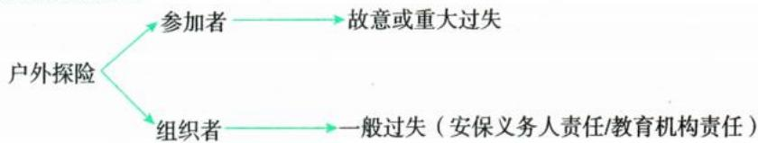

flowchart

```mermaid
graph TD
    A["户外探险"] --> B["参加者"]
    A --> C["组织者"]
    B --> D["故意或重大过失"]
    C --> E["一般过失（安保义务人责任/教育机构责任）"]
```

(户外探险法律关系判断示意图)

户外探险活动中，仅存在两类主体，即参加者和组织者。如受害人本人或近亲属向其他参加者请求侵权损害赔偿，必须证明其他参加者主观上存在故意或重大过失。否则，其他参加者无需承担侵权责任。如受害人本人或近亲属向活动组织者请求侵权损害赔偿，必须证明活动组织者主观上存在一般过失。否则，活动组织者（安保义务人/教育机构责任）亦无需承担侵权责任。

[例] 唐某参加王某组织的自助登山活动因雪崩死亡。该种情形不成立民事法律关系。

#### (3) 其他领域。

明知他人醉酒，仍然搭乘其驾驶的车辆，发生翻车等事故时，受害人的行为即属于自甘冒险的行为，可以减轻或免除加害人的赔偿责任。

#### (六) 自助行为 $^{②}$

通俗而言，自助行为重点解决实践中“吃霸王餐（吃饭不给钱）”“睡霸王觉（住宾馆不给钱）”和“坐公交车拒绝投币或刷卡”等问题。

#### 1. 含义。

自助行为，是指权利人为保护自己的权利，在情势紧迫而又不能及时请求国家机关予以救助的情形下，对他人的财产或人身施加扣押、约束或其他措施，而为法律或社会公德所认可的行为。自助行为属于私力救济的范畴。如债务人变卖财物准备搭机潜逃境外，或在餐厅白吃白喝后，正欲乘车溜走时，得扣留其人或护照证件、取去汽车钥匙，于必要时亦得毁损其轮胎，不使其驾车离去①。

2. 构成要件。

(1) 须存在不法侵害状态。

(2) 须为保护自己的合法权利。

（3）须情况紧急而来不及请求有关国家机关的援助。自助行为的实施具有现实紧迫性和不可替代性。

(4) 须不得超过必要的限度。

（5）须为法律或公序良俗所许可。雇佣他人暴力讨债、将债务人囚禁于笼子里来讨债等形式皆为法律或公序良俗所禁止。

[萌主点拨] 方法适当且限度必要的，构成自助行为。方法不适当或限度不必要的，构成侵权行为。

[例 1] 一住店客人未付房钱即要离开旅馆去车站，旅馆服务员见状揪住他不让走，并打报警电话。客人说：“你不让我走还限制我自由，我要告你们旅馆，耽误了乘火车要你们赔偿。”旅馆这样做不属于侵权，是自助行为。

[例 2] 甲在乙经营的酒店进餐时饮酒过度，离去时拒付餐费，乙不知甲的身份和去向。甲酒醒后回酒店欲取回遗忘的外衣，乙以甲未付餐费为由拒绝交还。乙的行为属于自助行为。

3. 责任承担。

(1) 基本规则。

自助行为如不符合构成要件，则需要承担侵权责任。

(2) 自助过当。

自助人采取的自助措施超出保全其请求权的必要，此时类似于防卫过当和避险过当的规则，自助人应承担适当的责任。

(3) 迟延请求。

未立即请求有关国家机关处理，造成他人损害的，应当承担侵权责任。

##### [萌主点拨]

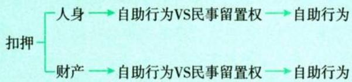

flowchart

```mermaid
graph TD
    A["扣押"] --> B["人身"]
    A --> C["财产"]
    B --> D["自助行为VS民事留置权"]
    C --> E["自助行为VS民事留置权"]
    D --> F["自助行为"]
    E --> G["自助行为"]
```

(自助行为与民事留置权的区别示意图)

## 45 专题四十五 损害赔偿

#### 复习提要

损害赔偿规定在《民法典》第七编侵权责任第二章（第1179—1187条），共9条。本专题主要涉及三个问题：1. 人身损害赔偿；2. 精神损害赔偿；3. 财产损害赔偿。其中，精神损害赔偿几乎系每年必考内容，备考时应重点关注。

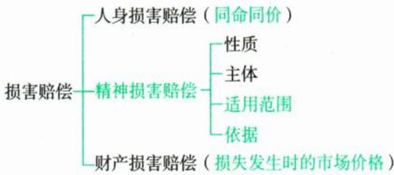

flowchart

```mermaid
graph TD
    A["损害赔偿"] --> B["人身损害赔偿（同命同价）"]
    A --> C["精神损害赔偿"]
    A --> D["财产损害赔偿（损失发生时的市场价格）"]
    C --> E["性质"]
    C --> F["主体"]
    C --> G["适用范围"]
    C --> H["依据"]
```

#### 一、人身损害赔偿

#### (一) 含义

人身损害赔偿，是指行为人侵犯他人的生命健康权益造成致伤、致残、致死等法律后果，承担金钱赔偿责任的一种民事法律救济制度。

#### (二) 内容

侵害他人造成人身损害的，应当赔偿医疗费、护理费、交通费、营养费、住院伙食补助费等为治疗和康复支出的合理费用，以及因误工减少的收入。造成残疾的，还应当赔偿辅助器具费和残疾赔偿金；造成死亡的，还应当赔偿丧葬费和死亡赔偿金。

[例] 甲医院误将患者乙的左肾切除。甲医院有义务赔偿乙的后续治疗费、护理费、交通费、因误工减少的收入以及精神损害等。

#### (三) 同命同价

《民法典》第1180条共1条规定了“同命同价”制度。

因同一侵权行为造成多人死亡的，可以以相同数额确定死亡赔偿金。因为众多被害人在同一事故中死亡，故可以不考虑被害人年龄、收入、居住或户籍在城镇还是农村等个体差异因素，适用同一标准确定死亡赔偿金额，以“概括的一揽子赔偿方式”解决死亡赔偿问题。在审判实务中，法院在处理“三鹿奶粉”事件和众多的诸如沉船、矿难、空难、火灾等侵权损害赔偿案件时，均按照同一标准确定受害人死亡赔偿金额，实践证明社会效果是好的，当事人反响也是好的。这些处理方案体现了权利平等、以人为本的理念。

[例] 2011 年的 “7.23” 甬温线特别重大铁路交通事故，一揽子就死亡赔偿金、精神抚慰金、丧葬费，加上一次性救助金（含被扶养人生活费），最后最高采用整数 91.5 万元的标准进行赔偿。

#### 二、精神损害赔偿①

#### (一) 性质

精神损害赔偿请求权，又称精神损害抚慰金请求权，是一种非财产上损害，在性质上属于惩罚性赔偿，须存在严重的精神痛苦方可主张。

[例] 叶某将自有房屋卖给沈某，在交房和过户之前，沈某擅自撬门装修，施工导致邻居赵某经常失眠。本案中，沈某装修房屋导致赵某经常失眠，并非严重的精神痛苦（现代社会，失眠应该是普遍存在的现象）。赵某不可主张精神损害赔偿。

#### (二) 主体

自然人系目的性存在，有血、有肉、有情感；而法人和非法人组织系工具性存在（只是特定财产的集合，只是特定目的的共同体），无血、无肉、无情感。因此，仅自然人可以主张精神损害赔偿，法人或非法人组织不得主张精神损害赔偿。法人或非法人组织以名誉权、荣誉权、名称权遭受侵害为由，向法院起诉请求精神损害赔偿的，法院不予支持。

#### （三）适用范围

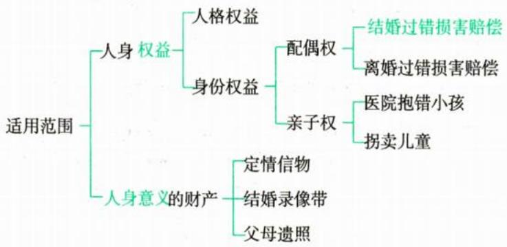

flowchart

```mermaid
graph TD
    A["适用范围"] --> B["人身权益"]
    A --> C["人身意义的财产"]
    B --> D["人格权益"]
    B --> E["身份权益"]
    E --> F["配偶权"]
    E --> G["亲子权"]
    F --> H["结婚过错损害赔偿"]
    F --> I["离婚过错损害赔偿"]
    G --> J["医院抱错小孩"]
    G --> K["拐卖儿童"]
    C --> L["定情信物"]
    C --> M["结婚录像带"]
    C --> N["父母遗照"]
```

(精神损害赔偿适用范围体系框架图)

精神损害赔偿的适用范围由法律直接规定，仅如下两种情形可以主张精神损害赔偿。

1. 自然人人身权益受到侵害。

(1) 自然人人格权益受到侵害。

因人身自由、人格尊严、生命、身体、健康、姓名、肖像、名誉、荣誉、隐私等人格权益遭受侵害并造成严重精神损害的，受害人依法可以主张精神损害赔偿。

(2) 自然人身份权益受到侵害之配偶权受到侵害的。

结婚过错损害赔偿。婚姻无效或被撤销的，无过错方有权请求损害赔偿。该损害赔偿包括物质损害赔偿和精神损害赔偿。

离婚过错损害赔偿。有下列情形之一，导致离婚的，无过错方有权请求损害赔偿。该损害赔偿包括物质损害赔偿和精神损害赔偿：重婚；与他人同居；实施家庭暴力；虐待、遗弃家庭成员；有其他重大过错。

(3) 自然人身份权益受到侵害之亲子权受到侵害的。

非法使被监护人脱离监护（如医院抱错孩子或拐卖儿童），监护人可以请求赔偿为恢复监护状态而支出的合理费用等财产损失；导致父母子女关系或其他近亲属关系受到严重损害的，应当认定为严重精神损害。被监护人在脱离监护期间死亡，作为近亲属的监护人既可以请求赔偿人身损害，又可以请求赔偿监护关系受侵害产生的损失（《民法典侵权责任编解释（一）》第1—3条）。

2. 因故意或重大过失侵害自然人具有人身意义的特定物造成严重精神损害。具有人身意义的特定物，包括定情信物、结婚录像带、父母遗照等。

[例] 周某将拍摄了其结婚仪式的彩色胶卷底片交给某彩扩店冲印，并预交了冲印费。周某于约定日期去取相片，彩扩店告知：因失火，其相片连同底片均被焚毁。周某非常痛苦，诉至法院请求彩扩店赔偿胶卷费、冲印费损失及精神损害。周某的精神损害赔偿请求应当得到支持。

#### (四) 依据

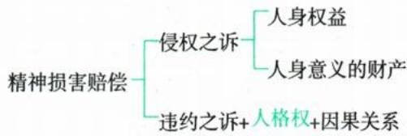

flowchart

```mermaid
graph TD
    A["精神损害赔偿"] --> B["侵权之诉"]
    A --> C["违约之诉+人格权+因果关系"]
    B --> D["人身权益"]
    B --> E["人身意义的财产"]
```

##### (精神损害赔偿的依据体系框架图)

1. 原则。原则上，精神损害赔偿应当与侵权之诉一并提起。

2. 例外。因当事人一方的违约行为，损害对方人格权并造成严重精神损害，受损害方选择请求其承担违约责任的，不影响受损害方请求精神损害赔偿。

#### >> 随堂练习

赵某在唐山大地震中成了孤儿，将仅有一张和父母的合照视为珍宝，为更好保存照片，赵某将照片送到照相馆翻拍。几日后，照相馆雇员乱丢烟头引起火灾，照片被烧毁，赵某为此十分愤恨和痛苦。根据《民法典》，下列哪些选项是正确的？（2020金题-2-1-43，多）①

A. 赵某可以要求照相馆承担违约责任
B. 照相馆侵犯了赵某的健康权
C. 照相馆侵犯了赵某的肖像权
D. 赵某有权请求照相馆赔偿精神损失

#### 三、财产损害赔偿①

财产损害赔偿应当坚持“全面赔偿原则”，但涉及具体损害赔偿的多少问题时，就需要确立客观计算标准，即参酌一般市场价格等客观因素确定损害赔偿额。

侵害他人财产的，财产损失按照损失发生时的市场价格或其他合理方式计算。

[例] 姚某旅游途中，前往某玉石市场参观，在唐某经营的摊位上拿起一只翡翠手镯，经唐某同意后试戴，并问价。唐某报价18万元（实际进货价8万元，市价9万元），姚某感觉价格太高，急忙取下，不慎将手镯摔断。姚某应赔偿唐某的损失额为9万元。

## 46 专题四十六 七类特殊主体责任

#### 复习提要

七类特殊主体责任规定在《民法典》第七编侵权责任第三章责任主体的特殊规定（第1188—1201条），共14条。本专题主要涉及七个问题：1. 监护人责任；2. 用工责任；3. 帮工责任；4. 定作人责任；5. 网络服务提供者责任；6. 安保义务人责任；7. 教育机构责任。其中，用工责任系每年必考点；安保义务人责任和网络服务提供者责任系常考点。在备考过程中重点应理解责任主体、归责原则和免责事由三项问题。

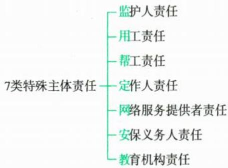

flowchart

```mermaid
graph TD
    A["7类特殊主体责任"] --> B["监护人责任"]
    A --> C["用工责任"]
    A --> D["帮工责任"]
    A --> E["定作人责任"]
    A --> F["网络服务提供者责任"]
    A --> G["安保义务人责任"]
    A --> H["教育机构责任"]
```

#### 一、监护人责任①

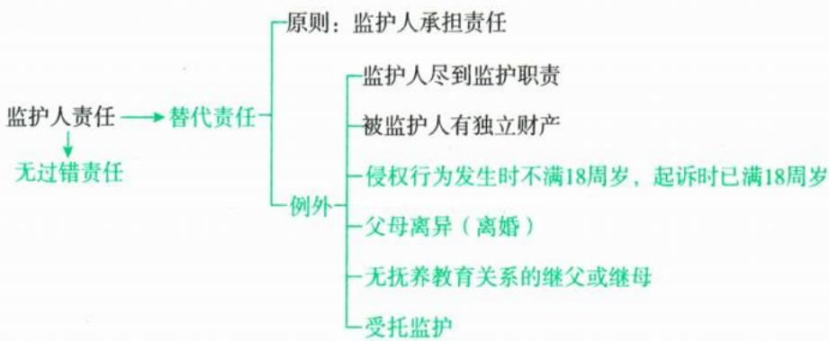

flowchart

```mermaid
graph TD
    A["监护人责任"] --> B["无过错责任"]
    B --> C["替代责任"]
    C --> D["原则：监护人承担责任"]
    C --> E["例外"]
    E --> F["监护人尽到监护职责"]
    E --> G["被监护人有独立财产"]
    E --> H["侵权行为发生时不满18周岁，起诉时已满18周岁"]
    E --> I["父母离异（离婚）"]
    E --> J["无抚养教育关系的继父或继母"]
    E --> K["受托监护"]
```

(监护人责任体系框架图)

#### (一) 责任主体

原则上由监护人承担侵权责任，有财产的无民事行为能力人、限制民事行为能力人造成他人损害的，从本人财产中支付赔偿费用；不足部分，由监护人赔偿。监护人责任的性质系“替代责任”，即为他人的侵权行为负责的责任。

#### (二) 归责原则

监护人责任的归责原则属于无过错责任原则。

#### （三）免责事由和特殊情形

1. 监护人尽到监护职责的，可以减轻其侵权责任。

2. 无民事行为能力人、限制民事行为能力人造成他人损害，被侵权人请求监护人承担侵权责任，或合并请求监护人和受托履行监护职责的人承担侵权责任的，法院应当将无民事行为能力人、限制民事行为能力人列为共同被告（《民法典侵权责任编解释（一）》第4条）。

被侵权人请求监护人承担侵权人应承担的全部责任的，法院应予支持，并在判决中明确，赔偿费用可以先从被监护人财产中支付，不足部分由监护人支付。监护人抗辩主张承担补充责任，或被侵权人、监护人主张法院判令有财产的无民事行为能力人、限制民事行为能力人承担赔偿责任的，法院不予支持。从被监护人财产中支付赔偿费用的，应当保留被监护人所必需的生活费和完成义务教育所必需的费用（《民法典侵权责任编解释（一）》第5条）。

3. 侵权行为发生时不满 18 周岁，起诉时已满 18 周岁。

行为人在侵权行为发生时不满18周岁，被诉时已满18周岁的，被侵权人请求原监护人承担侵权人应承担的全部责任的，法院应予支持，并在判决中明确，赔偿费用可以先从被监护人财产中支付，不足部分由监护人支付。被侵权人仅起诉行为人的，法院应当向原告释明申请追加原监护人为共同被告（《民法典侵权责任编解释（一）》第6条）。

4. 父母离异（离婚）。

夫妻离婚后，未成年子女造成他人损害，被侵权人可以请求离异夫妻共同承担侵权责任。一方不得以未与该子女共同生活为由主张不承担或少承担责任。离异夫妻之间的责任份额，可以由双方协议确定；协议不成的，法院可以根据双方履行监护职责的约定和实际履行情况等确定。实际承担责任超过自己责任份额的一方可以向另一方追偿（《民法典侵权责任编解释（一）》第8条）。

5. 无抚养教育关系的继父或继母。

未成年子女造成他人损害的，未与该子女形成抚养教育关系的继父或继母不承担监护人的侵权责任，由该子女的生父母承担侵权责任（《民法典侵权责任编解释（一）》第9条）。

6. 受托监护。

无民事行为能力人、限制民事行为能力人造成他人损害，被侵权人合并请求监护人和受托履行监护职责的人承担侵权责任的，监护人承担侵权人应承担的全部责任；受托人在过错范围内与监护人共同承担责任，但责任主体实际支付的赔偿费用总和不应超出被侵权人应受偿的损失数额。监护人承担责任后向受托人追偿的，法院可以参照《民法典》第

929 条的规定处理①。仅有一般过失的无偿受托人承担责任后向监护人追偿的，法院应予支持（《民法典侵权责任编解释（一）》第 10 条）。

#### 二、用工责任②

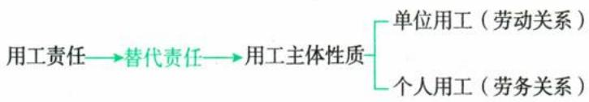

flowchart

```mermaid
graph LR
    A["用工责任"] --> B["替代责任"]
    B --> C["用工主体性质"]
    C --> D["单位用工（劳动关系）"]
    C --> E["个人用工（劳务关系）"]
```

(用工责任体系框架图)

根据用工主体性质的不同，将用工责任分为单位用工（包括个体工商户的从业人员）和个人用工两类。用工责任的性质系“替代责任”，即侵权行为主体和赔偿义务主体发生分离。

#### (一) 单位用工

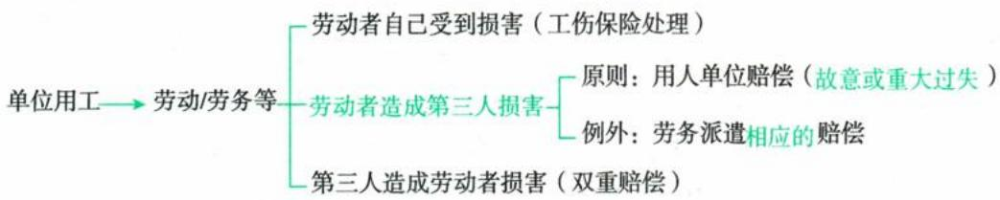

flowchart

```mermaid
graph TD
    A["单位用工"] --> B["劳动/劳务等"]
    B --> C["劳动者自己受到损害（工伤保险处理）"]
    B --> D["劳动者造成第三人损害"]
    D --> E["原则：用人单位赔偿（故意或重大过失）"]
    D --> F["例外：劳务派遣相应的赔偿"]
    B --> G["第三人造成劳动者损害（双重赔偿）"]
```

(单位用工体系框架图)

#### 1. 责任主体。

#### (1) 内部关系。

在用人单位和劳动者内部关系中，适用《劳动法》《劳动合同法》以及《工伤保险条例》的相关规定处理。

#### (2) 外部关系之职务侵权。

基于报偿责任原理③，用人单位的工作人员因执行工作任务造成他人损害的，由用人单位承担侵权责任。对外关系上，用人单位责任是单独责任（替代责任④）。工作人员对外根本无需承担民事责任，更谈不上承担按份责任或连带责任。用人单位承担侵权责任后，可以向有故意或重大过失的工作人员追偿。

工作人员在执行工作任务中实施的违法行为造成他人损害，构成自然人犯罪的，工作人员承担刑事责任不影响用人单位依法承担民事责任。用人单位应当承担侵权责任的，在刑事案件中已完成的追缴、退赔可以在民事判决书中明确并扣减，也可以在执行程序中予以扣减（《民法典侵权责任编解释（一）》第17条）。

[萌主点拨] “执行工作任务”的判断（外观主义）

为保护受害人的合法权益，是否属于“执行工作任务”的判断，以执行职务的外在表现形态为标准。

#### (3) 外部关系之劳务派遣。

劳务派遣的特点在于“有劳动无合同，有合同无劳动”。基于报偿责任原理，劳务派遣期间，被派遣的工作人员因执行工作任务造成他人损害的，由接受劳务派遣的用工单位承担无过错的侵权责任；劳务派遣单位有过错（题目关键词：未予换人、不予理会）的，承担相应的责任。

劳务派遣期间，被派遣的工作人员因执行工作任务造成他人损害，被侵权人合并请求劳务派遣单位与接受劳务派遣的用工单位承担侵权责任的，接受劳务派遣的用工单位承担侵权人应承担的全部责任；劳务派遣单位在不当选派工作人员、未依法履行培训义务等过错范围内，与接受劳务派遣的用工单位共同承担责任，但责任主体实际支付的赔偿费用总和不应超出被侵权人应受偿的损失数额。劳务派遣单位先行支付赔偿费用后，就超过自己相应责任的部分向接受劳务派遣的用工单位追偿的，法院应予支持，但双方另有约定的除外（《民法典侵权责任编解释（一）》第16条）。

#### (4) 第三人侵权（双重赔偿）。

工作人员因执行工作任务遭受第三人侵害如何处理？

该问题涉及第三人侵权和工伤事故竞合的责任承担问题。现阶段，因第三人侵权所致的损害，原则上应由第三人承担民事赔偿责任，但劳动者的伤害是因执行工作任务而发生并构成工伤的，用人单位亦应按无过错责任的归责原则承担工伤赔付责任。

[例] 甲、乙与丙就交通事故在交管部门的主持下达成《调解协议书》，由甲、乙分别赔偿丙5万元，甲当即履行。乙赔了1万元，余下4万元给丙打了欠条。乙到期后未履行，丙多次催讨未果，遂持《调解协议书》与欠条向法院起诉。如丙获得工伤补偿，乙不可以主张相应免责。

#### 2. 归责原则。

#### (1) 内部关系。

在用人单位和劳动者内部关系中，采用“过错责任原则”，即双方根据各自的过错承担相应的责任。

#### (2) 外部关系。

在用人单位和第三人外部关系中，采用“无过错责任原则”，即工作人员在执行职务过程中造成第三人损害的，即使用人单位没有过错，亦应对外承担侵权责任。

#### (二) 个人用工

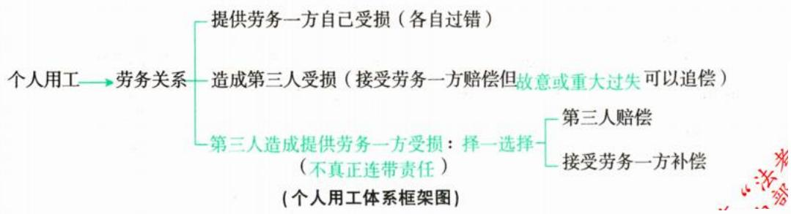

flowchart

```mermaid
graph TD
    A["个人用工"] --> B["劳务关系"]
    B --> C["提供劳务一方自己受损（各自过错）"]
    B --> D["造成第三人受损（接受劳务一方赔偿但故意或重大过失可以追偿）"]
    B --> E["第三人造成提供劳务一方受损：择一选择（不真正连带责任）"]
    E --> F["第三人赔偿"]
    E --> G["接受劳务一方补偿"]
```

个人用工在性质上属于劳务关系，由民法进行规范和调整。劳务关系，是指提供劳务一方为接受劳务一方（仅指自然人）提供劳务服务，由接受劳务一方按照约定支付报酬而建立的一种民事权利义务关系。与劳动关系不同，双方之间不存在隶属关系。

个人之间提供劳务包括家庭雇佣保姆、小时工（钟点工）、家庭教师等家庭用工。提供劳务期间，因第三人的行为造成提供劳务一方损害的，提供劳务一方有权请求第三人承担侵权责任，也有权请求接受劳务一方给予补偿。接受劳务一方补偿后，可以向第三人追偿。

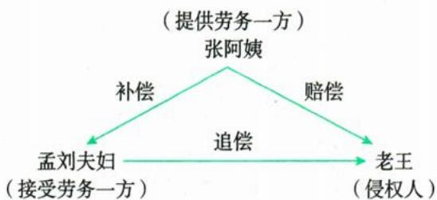

flowchart

```mermaid
graph TD
    A["孟刘夫妇 (接受劳务一方)"] -->|补偿| B["老王 (侵权人)"]
    A -->|赔偿| B
    B -->|追偿| A
    A -->|(提供劳务一方) 张阿姨
```

(不真正连带责任当事人法律关系示意图)

[例] 孟刘夫妇家的保姆（个人用工）张阿姨骑电动车去买菜回家的路上被隔壁老王家饲养的狗咬伤（饲养动物损害责任），需要医药费20万元。此时，保姆张阿姨有两种救济途径择一选择：

①向狗的饲养人老王请求侵权损害赔偿；

②请求接受劳务一方孟刘夫妇给予补偿，孟刘夫妇补偿后，可以向老王追偿。

据此可知，为保护受害人张阿姨，法律在老王（实施侵权行为的第三人）和孟刘夫妇（接受劳务一方）之间设置了一个“不真正连带责任”（对外择一，对内唯一）。

#### 三、帮工责任①

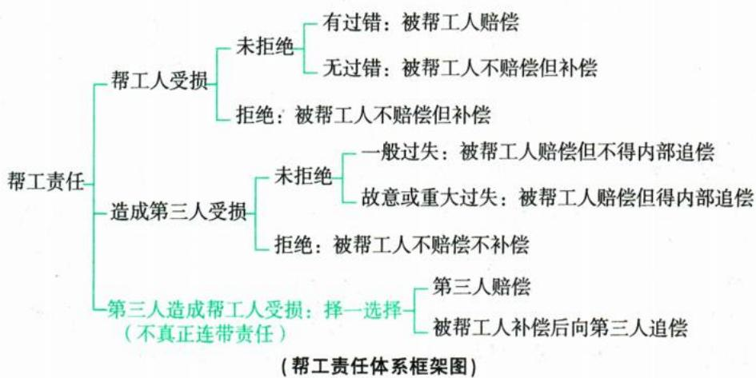

flowchart

```mermaid
graph TD
    A["帮工责任"] --> B["帮工人受损"]
    A --> C["造成第三人受损"]
    A --> D["第三人造成帮工人受损：择一选择（不真正连带责任）"]
    B --> E["未拒绝"]
    B --> F["拒绝：被帮工人不赔偿但补偿"]
    E --> G["有过错：被帮工人赔偿"]
    E --> H["无过错：被帮工人不赔偿但补偿"]
    C --> I["未拒绝"]
    C --> J["拒绝：被帮工人不赔偿不补偿"]
    I --> K["一般过失：被帮工人赔偿但不得内部追偿"]
    I --> L["故意或重大过失：被帮工人赔偿但得内部追偿"]
    D --> M["第三人赔偿"]
    D --> N["被帮工人补偿后向第三人追偿"]
```

#### (一) 责任主体

#### 1. 内部关系。

无偿提供劳务的帮工人因帮工活动遭受人身损害的，根据帮工人和被帮工人各自的过错承担相应的责任；被帮工人明确拒绝帮工的，被帮工人不承担赔偿责任，但可以在受益范围内予以适当补偿。

#### 2. 外部关系。

无偿提供劳务的帮工人，在从事帮工活动中致人损害的，被帮工人应当承担赔偿责任。被帮工人承担赔偿责任后向有故意或重大过失的帮工人追偿的，法院应予支持。被帮工人明确拒绝帮工的，不承担赔偿责任。

#### (二) 归责原则

#### 1. 内部关系。

在帮工人和被帮工人内部关系中，采“过错责任原则”，即双方根据各自的过错承担相应的责任。

#### 2. 外部关系。

在被帮工人和第三人外部关系中，采“无过错责任原则”，即帮工人在从事帮工活动中致人损害的，即使被帮工人没有过错，亦应对外承担侵权责任。

#### (三) 第三人侵权

帮工人在帮工活动中因第三人的行为遭受人身损害的，有权请求第三人承担赔偿责任，也有权请求被帮工人予以适当补偿。被帮工人补偿后，可以向第三人追偿。

#### 四、定作人责任①

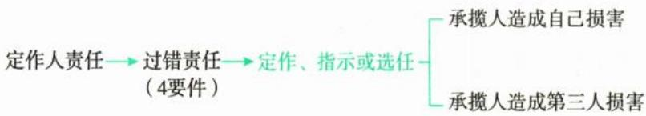

flowchart

```mermaid
graph LR
    A["定作人责任"] --> B["过错责任\n(4要件)"]
    B --> C["定作、指示或选任"]
    C --> D["承揽人造成自己损害"]
    C --> E["承揽人造成第三人损害"]
```

(定作人责任体系框架图)

#### (一) 责任主体

定作人责任来源于英美法系的“独立合同人”（independent contractor）制度。定作人责任的责生体系定作人。

#### (二) 归责原则

定作人责任的归责原则系过错责任原则。

#### (三) 免责事由

被侵权人合并请求定作人和承揽人承担侵权责任的，造成损害的承揽人承担侵权人应承担的全部责任（原则上，承揽人具有独立性和自主性，主要依靠自己的技术和专业技能独立完成承揽工作，不受定作人的指示或支配）；定作人在定作、指示或选任过错范围内与承揽人共同承担责任，但责任主体实际支付的赔偿费用总和不应超出被侵权人应受偿的损失数额。定作人先行支付赔偿费用后，就超过自己相应责任的部分可以向承揽人追偿，但双方另有约定的除外（《民法典侵权责任编解释（一）》第18条）。

[萌主点拨] 如何判断是雇佣合同（劳动/劳务合同）法律关系还是承揽合同法律关系？

应综合分析下列因素，结合案件具体情况予以认定：

(1) 当事人之间是否存在控制、支配和从属关系；
(2) 是否由一方指定工作场所、提供劳动工具或设备，限定工作时间；

(3) 是定期给付劳动报酬还是一次性结算劳动报酬；

(4) 是继续性提供劳务，还是一次性提供工作成果；

(5) 当事人一方所提供的劳动是其独立的业务或经营活动，还是构成合同相对方的业务或经营活动的组成部分。

如当事人之间存在控制、支配和从属关系，由一方指定工作场所、提供劳动工具或设备，限定工作时间，定期给付劳动报酬，所提供的劳动是接受劳务一方生产经营活动的组成部分的，可以认定为雇佣合同关系。反之，则应认定为承揽合同关系。

#### 五、网络服务提供者责任①

网络服务提供者→过错责任→删除、屏蔽、断开链接→扩大部分连带责任
通知规则
知道规则

(网络服务提供者责任法律思维导图)

#### (一) 责任主体

网络服务提供者责任的责任主体系网络用户（包括自然人用户和法人用户）或网络服务提供者。

#### (二) 归责原则

网络服务提供者责任的归责原则系过错责任原则。

#### （三）免责事由

网络用户利用网络服务实施侵权行为的，网络服务提供者应及时采取删除、屏蔽、断开链接等必要措施。

#### 六、安保义务人责任 $^{②}$

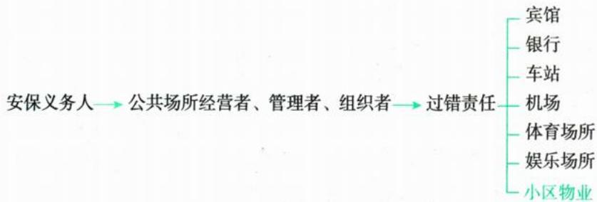

flowchart

```mermaid
graph LR
    A["安保义务人"] --> B["公共场所经营者、管理者、组织者"]
    B --> C["过错责任"]
    C --> D["宾馆"]
    C --> E["银行"]
    C --> F["车站"]
    C --> G["机场"]
    C --> H["体育场所"]
    C --> I["娱乐场所"]
    C --> J["小区物业"]
```

(安保义务人责任法律思维导图)

①《民法典》第1194—1197条共4条规定了网络服务提供者责任。考查3次，抓住重点。
②《民法典》第1198条共1条规定了安保义务人责任。考查7次，客观题几乎每年必考，重点关注。

#### (一) 责任主体

安保义务人的责任主体系经营场所、公共场所的经营者、管理者或群众性活动的组织者。经营场所、公共场所包括：宾馆、商场、银行、车站、机场、体育场馆、娱乐场所等。

对于安保义务人责任而言，责任主体只要对该场所具有事实上的控制力即可，不以双方有交易关系为必要，只要安保义务人有过错（安保义务人在其所能控制的范围内，采取其能力所及的合理措施，防止他人的民事权益被侵害，或在侵害发生后尽力避免损害结果的扩大。如未尽到上述义务，即构成间接侵权人），即使是“逛街、逛庙会、上厕所”等亦可请求其承担相应的责任（旅游经营者对旅游者负有法定的安全保障义务）。

[例] 甲在某酒店公用洗手间滑倒，摔碎了眼镜。经查：甲滑倒系因酒店清洁工乙清洁不彻底，地面湿滑所致。甲的损失应由酒店承担全部责任。

#### (二) 归责原则

安保义务人责任的归责原则系过错责任原则。

#### （三）免责事由

安保义务人责任的免责事由系证明自己没有过错。

#### (四) 第三人侵权

因第三人的行为造成他人损害的，由第三人承担侵权责任；经营者、管理者或组织者未尽到安全保障义务（有过错）的，承担相应的补充责任（承担责任的第二顺位）。经营者、管理者或组织者承担补充责任后，可以向第三人追偿。

[萌主点拨] 第三人与安保义务人不构成共同侵权，不承担连带责任。

[例 1] 甲在某饭店醉酒闹事，饭店员工和就餐顾客纷纷躲闪，顾客乙躲闪不及被甲打伤。乙的损害应由甲承担侵权责任，饭店承担相应的补充责任。

[例 2] 甲在网吧上网，邻座乙、丙因故发生争吵并互殴，但无人制止，致甲被误伤。甲的损害应由乙、丙承担责任，网吧承担相应的补充责任。

#### >> 随堂练习

某小区有流浪狗频频伤人，居民向物业公司反映，未获回应。某日，居民马大姐倒垃圾时，不慎洒落一袋厨余垃圾在路边，未做清理。几只饥饿的流浪狗随机围上抢食，拿着香肠的小学生小军正巧路过被狗咬伤，关于小军的损害赔偿责任的承担，下列哪一说法是正确的？(2020金题-2-1-45，单) $^{①}$

A. 小军无权请求他人承担
B. 应由马大姐承担
C. 应由物业公司和马大姐承担连带责任
D. 应由物业公司承担

#### 七、教育机构责任（校园事故责任） $^{①}$

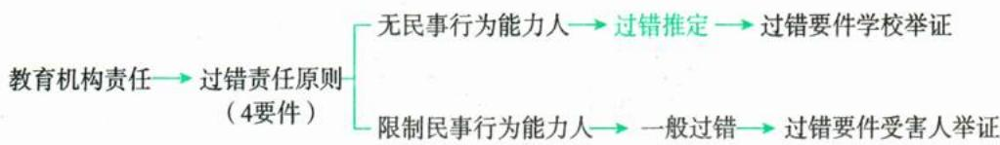

flowchart

```mermaid
graph LR
    A["教育机构责任"] --> B["过错责任原则 (4要件)"]
    B --> C["无民事行为能力人"]
    C --> D["过错推定"]
    D --> E["过错要件学校举证"]
    B --> F["限制民事行为能力人"]
    F --> G["一般过错"]
    G --> H["过错要件受害人举证"]
```

(教育机构责任体系框架图)

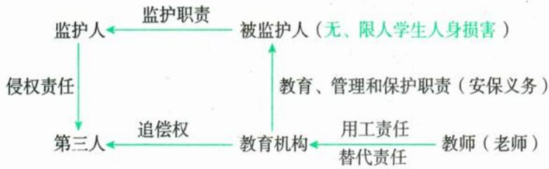

flowchart

```mermaid
graph TD
    A["监护人"] -->|监护职责| B["被监护人（无、限人学生人身损害）"]
    A -->|侵权责任| C["第三人"]
    C -->|追偿权| D["教育机构"]
    D -->|用工责任\n替代责任| E["教师（老师）"]
    D -->|教育、管理和保护职责（安保义务）| B
```

(教育机构责任当事人法律关系示意图)

#### (一) 责任主体

教育机构责任的责任主体系学校、幼儿园或其他教育机构。教师（老师）不独立对外承担责任，教师（老师）与教育机构之间实质上为用工责任，即替代责任（由学校替教师/老师对外承担侵权责任）。

教育机构负有教育、管理和保护的义务。家长将孩子送往学校后，其监护职责并未转移至学校。教育机构承担侵权责任的期间为在校期间。学校组织的校外活动视为在校期间，教育机构承担侵权责任的区域为校园内和特定区域，即校门到校门或校车到校车或校外活动相应区域。

#### (二) 归责原则

教育机构责任的归责原则系过错责任原则。

1. 无民事行为能力人的，过错推定（推定学校有过错，由加害人/侵害人学校举证证明自己没有过错/过错要件举证责任倒置）。
2. 限制民事行为能力人的，一般过错（由受害人承担过错要件的举证责任/谁主张谁举证）。

[例] 某小学课间休息期间，校外人员马某翻墙进入校内，将在操场上玩耍的八岁小学生高某打伤。高某的人身损害应当由马某承担赔偿责任，某小学没有过错，无需承担赔偿责任。

#### (三) 免责事由

教育机构责任的免责事由系证明自己没有过错。即尽到了预防或制止第三人侵权的管理职责。

无民事行为能力人或限制民事行为能力人在幼儿园、学校或其他教育机构学习、生活期间，受到教育机构以外的第三人人身损害，第三人、教育机构作为共同被告且依法应承担侵权责任的，法院应当在判决中明确，教育机构在法院就第三人的财产依法强制执行后仍不能履行的范围内，承担与其过错相应的补充责任。被侵权人仅起诉教育机构的，法院应当向原告释明申请追加实施侵权行为的第三人为共同被告。第三人不确定的，未尽到管理职责的教育机构先行承担与其过错相应的责任；教育机构承担责任后可以向已经确定的第三人追偿（《民法典侵权责任编解释（一）》第14条）。

##### [萌主点拨]

教育机构责任汇总表

<table><tr><td>情形</td><td>监护人</td><td>教育机构</td><td>责任承担</td></tr><tr><td>无人VS无人</td><td>无过错</td><td>过错推定(过错要件学校举证)</td><td>监护人承担赔偿责任;学校在过错范围内承担相应的补充赔偿责任1</td></tr><tr><td>限人VS限人</td><td>无过错</td><td>过错(过错要件受害人举证)</td><td>监护人承担赔偿责任;学校在过错范围内承担相应的补充赔偿责任</td></tr><tr><td>三VS无人</td><td>×</td><td>过错推定(过错要件学校举证)</td><td>第三人赔偿;学校在其过错范围内承担相应的补充赔偿责任</td></tr><tr><td>三VS限人</td><td>×</td><td>过错(过错要件受害人举证)</td><td>第三人赔偿;学校在其过错范围内承担相应的补充赔偿责任</td></tr></table>

##### [萌主点拨]

七类特殊主体责任考点汇总表

<table><tr><td>事项</td><td>监护人责任</td><td>用工责任</td><td>帮工责任</td><td>定作人责任</td><td>网络服务提供者责任</td><td>安保义务人责任</td><td>教育机构责任</td></tr><tr><td>责任主体</td><td>监护人</td><td>用人单位或接受劳务一方</td><td>被帮工人</td><td>定作人</td><td>网络服务提供者</td><td>经营者、管理者、组织者</td><td>教育机构</td></tr><tr><td>归责原则</td><td>无过错</td><td>无过错(外部)</td><td>无过错(外部)</td><td>过错</td><td>过错</td><td>过错</td><td>过错</td></tr><tr><td>免责事由</td><td>尽到监护职责,可以减轻</td><td>非职务行为或个人行为</td><td>明确拒绝帮工</td><td>没有定作、指示或选任过错</td><td>采取必要措施(删除、屏蔽、断开链接)</td><td>证明自己没有过错</td><td>证明自己没有过错</td></tr></table>

#### 47

## 专题四十七

#### 七类典型侵权责任

#### 复习提要

七类典型侵权责任规定在《民法典》第七编侵权责任第四至十章（第1202—1258条），共57条。本专题主要涉及七个问题：1. 产品责任；2. 机动车交通事故责任；3. 医疗损害责任；4. 环境污染和生态破坏责任；5. 高度危险责任；6. 饲养动物损害责任；7. 建筑物和物件损害责任。其中，产品责任、机动车交通事故责任、饲养动物损害责任以及建筑物和物件损害责任系考试的重点，重点掌握。

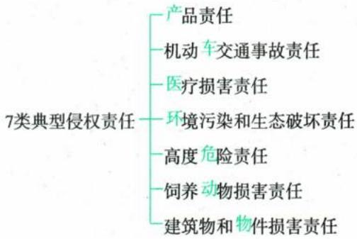

flowchart

```mermaid
graph TD
    A["7类典型侵权责任"] --> B["产品责任"]
    A --> C["机动车交通事故责任"]
    A --> D["医疗损害责任"]
    A --> E["环境污染和生态破坏责任"]
    A --> F["高度危险责任"]
    A --> G["饲养动物损害责任"]
    A --> H["建筑物和物件损害责任"]
```

#### 一、产品责任①

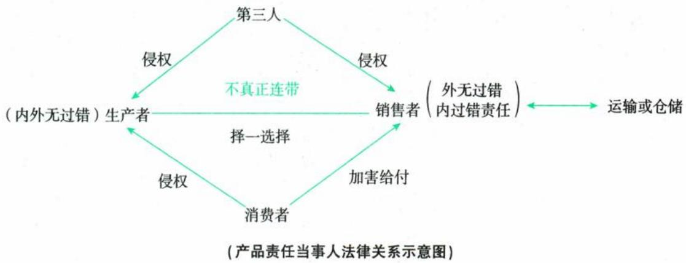

flowchart

```mermaid
graph TD
    A["生产者"] -->|侵权| B["第三人"]
    A -->|侵权| C["消费者"]
    A -->|侵权| D["销售者"]
    B -->|侵权| C
    C -->|加害给付| D
    D -->|不真正连带| A
    E["外无过错\n内过错责任"] --> F["运输或仓储"]
```

#### (一) 基本原理

#### 1. 外部关系。

因产品存在缺陷造成他人损害的，被侵权人可以向产品的生产者请求赔偿，也可以向产品的销售者请求赔偿。基于“不真正连带责任理论”，被侵权人只能在生产者和销售者之间择一选择。因产品存在缺陷造成买受人财产损害，买受人有权请求产品的生产者或销售者赔偿缺陷产品本身损害以及其他财产损害（《民法典侵权责任编解释（一）》第19条）。

[例 1] 孟某从京东商城购买了一台科沃斯公司生产的扫地拖地一体的机器人。在扫拖地过程中，该机器人因技术缺陷发生爆炸，造成孟某严重人身损害。此时，孟某有三种救济途径可以择一选择：

①孟某有权请求生产者科沃斯公司承担侵权责任，同时主张精神损害赔偿；

②孟某有权请求销售者京东商城承担违约责任，同时主张精神损害赔偿；

③孟某有权请求销售者京东商城承担侵权责任，同时主张精神损害赔偿。

##### [萌主点拨]

产品责任中消费者的多元救济途径

<table><tr><td>救济途径</td><td>向谁主张</td><td>责任性质</td><td>精神损害赔偿</td><td>归责原则</td><td>权利性质</td></tr><tr><td>途径1</td><td>生产者</td><td>侵权责任</td><td>可以</td><td>无过错</td><td>债权请求权</td></tr><tr><td>途径2</td><td>销售者(加害给付/请求权竞合1)</td><td>违约责任</td><td>可以2</td><td>无过错</td><td>债权请求权</td></tr><tr><td>途径3</td><td>销售者(加害给付/请求权竞合)</td><td>侵权责任</td><td>可以</td><td>无过错</td><td>债权请求权</td></tr></table>

[例 2] 孟某从京东商城购买了一台科沃斯公司生产的扫地拖地一体的机器人。在扫拖地过程中，该机器人因技术缺陷发生爆炸，造成妻子刘某严重人身损害。此时，刘某有两种救济途径可以择一选择：

①刘某有权请求生产者科沃斯公司承担侵权责任，同时主张精神损害赔偿；

②刘某有权请求销售者京东商城承担侵权责任，同时主张精神损害赔偿。

##### [萌主点拨1]

产品责任中第三人的多元救济途径

<table><tr><td>救济途径</td><td>向谁主张</td><td>责任性质</td><td>精神损害赔偿</td><td>归责原则</td><td>权利性质</td></tr><tr><td>途径1</td><td>生产者</td><td>侵权责任</td><td>可以</td><td>无过错</td><td>债权请求权</td></tr><tr><td>途径2</td><td>销售者</td><td>侵权责任</td><td>可以</td><td>无过错</td><td>债权请求权</td></tr></table>

##### [萌主点拨2]

不真正连带责任 VS 连带责任

<table><tr><td>项目</td><td>含义</td><td>产生原因</td><td>程序上</td><td>典型情形</td></tr><tr><td>不真正连带责任</td><td>多数行为人违反法定义务,对一个受害人实施加害行为,或不同的行为人基于不同的行为而致使受害人的权利受到损害,各个行为人产生的同一内容的侵权责任,各负全部赔偿责任,并因行为人之一的履行而使全体责任人的责任归于消灭的侵权责任形态</td><td>多因一果</td><td rowspan="2">任意选择1</td><td>个人用工责任帮工责任产品责任医疗损害责任环境污染和生态破坏责任饲养动物损害责任</td></tr><tr><td>连带责任</td><td>依照法律的直接规定或当事人的约定,两个以上的责任主体向权利人连带承担全部赔偿责任,权利人有权请求连带责任人中的一人或数人承担全部责任,而一人或数人在承担全部赔偿责任后,将免除其他责任人的赔偿责任的民事责任形态</td><td>一因一果</td><td>共同侵权或准共同侵权</td></tr></table>

二者的根本区别在于：连带责任的最终责任必须由各个不同的连带责任人分担（对外连带，对内按份，人人有份）；而不真正连带责任的最终责任只能归属于承担责任的那一个责任人（对外择一，对内唯一）

#### 2. 内部关系。

产品缺陷由生产者造成的，销售者赔偿后，有权向生产者追偿。因销售者的过错使产品存在缺陷的，生产者赔偿后，有权向销售者追偿。在内部关系中，生产者承担的仍为无过错责任，而销售者对内承担的则是过错责任。

#### 3. 第三人原因。

因运输者、仓储者等第三人的过错使产品存在缺陷，造成他人损害的，产品的生产者、销售者赔偿后，有权向第三人追偿。

#### 4. 责任承担。

因产品缺陷危及他人人身、财产安全的，被侵权人有权请求生产者、销售者承担停止侵害、排除妨碍、消除危险等侵权责任。

#### （二）产品警示与召回制度和惩罚性赔偿

#### 1. 产品警示与召回。

产品投入流通后发现存在缺陷的，生产者、销售者应当及时采取停止销售、警示、召回等补救措施；未及时采取补救措施或补救措施不力造成损害扩大的，对扩大的损害也应当承担侵权责任。采取召回措施的，生产者、销售者应当负担被侵权人因此支出的必要费用。

#### 2. 惩罚性赔偿。

明知产品存在缺陷仍然生产、销售，或没有采取有效补救措施，造成他人死亡或健康严重损害的，被侵权人有权请求相应的惩罚性赔偿。

#### 二、机动车交通事故责任①

#### (一) 基本原理

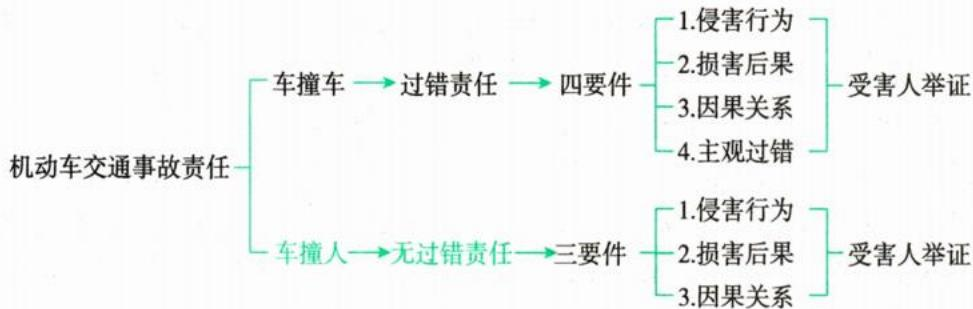

flowchart

```mermaid
graph TD
    A["机动车交通事故责任"] --> B["车撞车"]
    A --> C["车撞人"]
    B --> D["过错责任"]
    D --> E["四要件"]
    E --> F["侵害行为"]
    E --> G["损害后果"]
    E --> H["因果关系"]
    E --> I["主观过错"]
    C --> J["无过错责任"]
    J --> K["三要件"]
    K --> L["侵害行为"]
    K --> M["损害后果"]
    K --> N["因果关系"]
    F --> O["受害人举证"]
    L --> P["受害人举证"]
```

(机动车交通事故责任体系框架图)

机动车交通事故责任的类型

<table><tr><td>类型</td><td>责任主体</td><td>归责原则</td><td colspan="2">免责事由</td></tr><tr><td>机动车与机动车</td><td>使用人</td><td>过错</td><td colspan="2">没有过错</td></tr><tr><td rowspan="5">机动车与非机动车或行人</td><td rowspan="5">使用人</td><td rowspan="5">无过错</td><td>非机动车或行人</td><td>使用人</td></tr><tr><td>没有过错</td><td>全部</td></tr><tr><td>一定过错</td><td>适当减轻</td></tr><tr><td>全部过错</td><td>不超过10%</td></tr><tr><td>故意(自杀、自残或碰瓷)</td><td>免责</td></tr></table>

机动车发生交通事故造成损害的，依照《道路交通安全法》第76条和《民法典》的有关规定承担赔偿责任。机动车发生交通事故造成损害，属于该机动车一方责任的，先由承保机动车强制保险的保险人（保险公司）在强制保险责任限额范围内予以赔偿；不足部分，由承保机动车商业保险的保险人（保险公司）按照保险合同的约定予以赔偿；仍然不足或没有投保机动车商业保险的，由侵权人赔偿。

#### （二）特殊情形的处理

1. 关于租赁或借用的机动车发生交通事故的责任问题（《民法典》第1209条）。

因租赁、借用等情形机动车所有人、管理人与使用人不是同一人时，发生交通事故造成损害，属于该机动车一方责任的，由机动车使用人承担赔偿责任；机动车所有人、管理人对损害的发生有过错的，承担相应的赔偿责任（按份责任）。机动车发生交通事故造成损害，机动车所有人或管理人有下列情形之一，法院应当认定其对损害的发生有过错，并确定其相应的赔偿责任：

(1) 知道或应当知道机动车存在缺陷且该缺陷是交通事故发生原因之一的:

(2) 知道或应当知道驾驶人无驾驶资格或未取得相应驾驶资格的:

（3）知道或应当知道驾驶人因饮酒、服用国家管制的精神药品或麻醉药品，或患有妨碍安全驾驶机动车的疾病等依法不能驾驶机动车的；

(4) 其他应当认定机动车所有人或管理人有过错的。

[例] 甲将自己的汽车借给（借用合同/无名合同/无偿合同）乙使用。某日，乙酒后驾驶该车撞伤丙，丙的损失应由乙全部赔偿，所有人甲没有过错，不承担任何责任。

2. 关于转让并交付但未办理登记的机动车发生交通事故的责任问题。

当事人之间已经以买卖或其他方式转让并交付机动车但是未办理登记，发生交通事故造成损害，属于该机动车一方责任的，由受让人承担赔偿责任。被多次转让但是未办理登记的机动车发生交通事故造成损害，属于该机动车一方责任，当事人请求由最后一次转让并交付的受让人承担赔偿责任的，法院应予支持。

[例] 10月16日，孟某将自己的宝马轿车以100万元出卖给马某并交付，但未前往车管所办理过户登记手续。10月18日，马某将轿车以100万元出卖给曹某并交付亦未前往车管所办理过户登记手续。10月20日，曹某驾车将徐某撞伤，花去医药费2000元。徐某可以请求曹某承担侵权责任，因为曹某是最后一次转让并交付的受让人。

3. 关于拼装或已达到报废标准的机动车发生交通事故的责任问题。

以买卖或其他方式转让拼装或已达到报废标准的机动车，发生交通事故造成损害的，由转让人和受让人承担连带责任。拼装车、已达到报废标准的机动车或依法禁止行驶的其他机动车被多次转让，并发生交通事故造成损害，当事人请求由所有的转让人和受让人承担连带责任的，法院应予支持。转让人、受让人以其不知道且不应当知道该机动车系拼装或已经达到报废标准为由，主张不承担侵权责任的，法院不予支持（《民法典侵权责任编解释（一）》第20条）。

[例] 甲将自有的已达到报废标准的小汽车卖给乙，乙在驾驶该车时不慎将丙撞伤，丙的损失应由甲、乙承担连带责任。

4. 关于盗抢的机动车发生交通事故的责任问题。

盗窃、抢劫或抢夺的机动车发生交通事故造成损害的，由盗窃人、抢劫人或抢夺人承担赔偿责任。盗窃人、抢劫人或抢夺人与机动车使用人并非同一人，发生交通事故后属于该机动车一方责任的，由盗窃人、抢劫人或抢夺人与机动车使用人承担连带责任。保险人在机动车强制保险责任限额范围内垫付抢救费用的，有权向交通事故责任人追偿。

5. 关于驾驶人逃逸后对被侵权人的救济问题。

机动车驾驶人发生交通事故后逃逸，该机动车参加强制保险的，由保险人在机动车强制保险责任限额范围内予以赔偿；机动车不明、该机动车未参加强制保险或抢救费用超过机动车交通事故责任强制保险责任限额，需要支付被侵权人人身伤亡的抢救、丧葬等费用的，由道路交通事故社会救助基金垫付。道路交通事故社会救助基金垫付后，其管理机构有权向交通事故责任人追偿。

6. 挂靠责任。

以挂靠形式从事道路运输经营活动的机动车，发生交通事故造成损害，属于该机动车一方责任的，由挂靠人和被挂靠人承担连带责任。

7. 擅自驾驶责任。

未经允许驾驶他人机动车，发生交通事故造成损害，属于该机动车一方责任的，由机动车使用人承担赔偿责任；机动车所有人、管理人对损害的发生有过错的，承担相应的赔偿责任，但是《民法典·侵权责任编》第五章另有规定的除外。

8. 套牌责任。

套牌机动车发生交通事故造成损害，属于该机动车一方责任，当事人请求由套牌机动车的所有人或管理人承担赔偿责任的，法院应予支持；被套牌机动车所有人或管理人同意套牌的，应当与套牌机动车的所有人或管理人承担连带责任（《道路交通事故损害赔偿解释》第3条）。

9. 驾校责任。

接受机动车驾驶培训的人员，在培训活动中驾驶机动车发生交通事故造成损害，属于该机动车一方责任，当事人请求驾驶培训单位承担赔偿责任的，法院应予支持。

10. 4S 店责任。

机动车试乘过程中发生交通事故造成试乘人损害，当事人请求提供试乘服务者承担赔偿责任的，法院应予支持。试乘人有过错的，应当减轻提供试乘服务者的赔偿责任。

11. 道路管理者责任。

因道路管理维护缺陷导致机动车发生交通事故造成损害，当事人请求道路管理者承担相应赔偿责任的，法院应予支持。但道路管理者能够证明已经依照法律、法规、规章的规定，或按照国家标准、行业标准、地方标准的要求尽到安全防护、警示等管理维护义务的除外。依法不得进入高速公路的车辆、行人，进入高速公路发生交通事故造成自身损害，当事人请求高速公路管理者承担赔偿责任的，适用《民法典》第1243条的规定。未经许可进入高度危险活动区域或高度危险物存放区域受到损害，管理人能够证明已经采取足够安全措施并尽到充分警示义务的，可以减轻或不承担责任。

12. 未投保的机动车。

未依法投保强制保险的机动车发生交通事故造成损害，投保义务人和交通事故责任人不是同一人，被侵权人合并请求投保义务人和交通事故责任人承担侵权责任的，交通事故责任人承担侵权人应承担的全部责任；投保义务人在机动车强制保险责任限额范围内与交通事故责任人共同承担责任，但责任主体实际支付的赔偿费用总和不应超出被侵权人应受偿的损失数额。投保义务人先行支付赔偿费用后，就超出机动车强制保险责任限额范围部分向交通事故责任人追偿的，法院应予支持（《民法典侵权责任编解释（一）》第21条）。

#### 13. 未采取制动措施。

机动车驾驶人离开本车后，因未采取制动措施等自身过错受到本车碰撞、碾压造成损害，机动车驾驶人请求承保本车机动车强制保险的保险人在强制保险责任限额范围内，以及承保本车机动车商业第三者责任保险的保险人按照保险合同的约定赔偿的，法院不予支持，但可以依据机动车车上人员责任保险的有关约定支持相应的赔偿请求（《民法典侵权责任编解释（一）》第22条）。

#### 三、医疗损害责任①

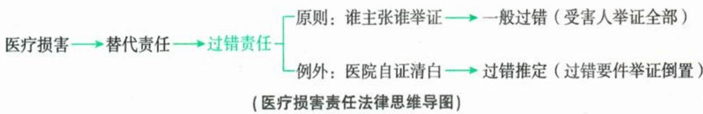

flowchart

```mermaid
graph LR
    A["医疗损害"] --> B["替代责任"]
    B --> C["过错责任"]
    C --> D["原则：谁主张谁举证"]
    D --> E["一般过错（受害人举证全部）"]
    C --> F["例外：医院自证清白"]
    F --> G["过错推定（过错要件举证倒置）"]
```

#### (一) 责任主体

医疗损害责任系典型的“替代责任”，医务人员的过错（无论是一般过失、重大过失还是故意）一律由医疗机构单独对外替他（她）承担。因此，医疗损害的责任主体系医疗机构。

[例] 某医院医生张某在为患者李某做手术时将一块纱布遗留在李某腹腔，李某因此所受的损害应由医院承担全部赔偿责任。

#### (二) 归责原则

医疗损害责任的归责原则乃过错责任原则。

1. 原则：一般过错（由受害人承担过错要件的举证责任/谁主张谁举证）。
2. 例外：过错推定（推定医疗机构有过错，由加害人医疗机构证明自己没有过错/过错要件举证责任倒置）。患者在诊疗活动中受到损害，有下列情形之一的，推定医疗机构有过错：
（1）违反法律、行政法规、规章以及其他有关诊疗规范的规定。医疗机构及其医务人员不得违反诊疗规范实施不必要的检查。
(2) 隐匿或拒绝提供与纠纷有关的病历资料。
(3) 遗失、伪造、篡改或违法销毁病历资料。

#### （三）免责事由

患者在诊疗活动中受到损害，有下列情形之一的，医疗机构不承担赔偿责任：

1. 患者或其近亲属不配合医疗机构进行符合诊疗规范的诊疗；
2. 医务人员在抢救生命垂危的患者等紧急情况下已经尽到合理诊疗义务；
3. 限于当时的医疗水平难以诊疗。

医疗机构或其医务人员也有过错的，应当承担相应的赔偿责任。医疗机构及其医务人员的合法权益受法律保护。干扰医疗秩序，妨碍医务人员工作、生活，侵害医务人员合法权益的，应当依法承担法律责任。

#### （四）不真正连带责任

因药品、消毒产品、医疗器械的缺陷，或输入不合格的血液造成患者损害的，患者可以向药品上市许可持有人、生产者、血液提供机构请求赔偿，也可以向医疗机构请求赔偿。患者向医疗机构请求赔偿的，医疗机构赔偿后，有权向负有责任的药品上市许可持有人、生产者、血液提供机构追偿。

#### 四、环境污染和生态破坏责任①

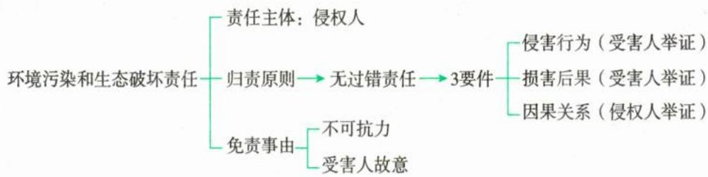

flowchart

```mermaid
graph TD
    A["环境污染和生态破坏责任"] --> B["责任主体：侵权人"]
    A --> C["归责原则"]
    C --> D["无过错责任"]
    D --> E["3要件"]
    E --> F["侵害行为（受害人举证）"]
    E --> G["损害后果（受害人举证）"]
    E --> H["因果关系（侵权人举证）"]
    A --> I["免责事由"]
    I --> J["不可抗力"]
    I --> K["受害人故意"]
```

(环境污染和生态破坏责任体系框架图)

#### (一) 责任主体

环境污染和生态破坏责任的责任主体系侵权人。

#### (二) 归责原则

环境污染和生态破坏属于“公害”，会造成不特定第三人利益的损害。因此，环境污染和生态破坏责任的归责原则乃无过错责任原则。

[例] 某农用航空服务站为某村进行飞行防治病虫害作业，多次超低空飞经个体养鸡户张某的鸡舍上空。飞机飞行的噪音使张某的鸡群受到惊吓，鸡陆续死亡，累计2万余只。此种侵权行为属于环境污染和生态破坏责任。

#### （三）免责事由

1. 行为人主张第三人的过错污染环境造成损害的不能免责。因第三人的过错污染环境、破坏生态的，被侵权人可以向侵权人请求赔偿，也可以向第三人请求赔偿。侵权人赔偿后，有权向第三人追偿。

2. 免责事由：不可抗力和受害人故意。

#### (四) 举证责任

环境污染和生态破坏责任的构成要件有三：1. 侵害行为；2. 损害后果；3. 因果关系。在举证责任分配上，受害人对侵害行为和损害后果两个要件进行举证。侵权人（行为人）对因果关系和法定免责事由进行举证。

[例] 孟某发现自家池塘里的鱼全部死亡。孟某怀疑可能是上游的 A 企业排污所致。孟某举证证明：（1）A 企业存在排污行为，即侵害行为；（2）自己的鱼全部死亡的损害后果。A 企业举证证明：（1）因果关系；（2）法定的免责事由。

#### (五) 诉讼时效

环境污染和生态破坏责任的诉讼时效期间为普通诉讼时效期间，即3年。

#### (六) 惩罚性赔偿

侵权人违反法律规定故意污染环境、破坏生态造成严重后果的，被侵权人有权请求相应的惩罚性赔偿。

#### (七) 责任承担

违反国家规定造成生态环境损害，生态环境能够修复的，国家规定的机关或法律规定的组织有权请求侵权人在合理期限内承担修复责任。侵权人在期限内未修复的，国家规定的机关或法律规定的组织可以自行或委托他人进行修复，所需费用由侵权人负担。

#### 五、高度危险责任①

#### (一) 归责原则

从事高度危险作业造成他人损害的，应当承担侵权责任。据此可知，高度危险责任的归责原则乃无过错责任原则。

#### （二）四类危险行为致害

#### 1. 民用核设施的经营。

民用核设施或运入运出核设施的核材料发生核事故造成他人损害的，民用核设施的营运单位应当承担侵权责任；但是，能够证明损害是因战争、武装冲突、暴乱等情形或受害人故意造成的，不承担责任。

#### 2. 民用航空器的经营。

民用航空器造成他人损害的，民用航空器的经营者应当承担侵权责任；但是，能够证明损害是因受害人故意造成的，不承担责任。

#### 3. 占有或使用易燃、易爆、剧毒、高放射性、强腐蚀性、高致病性的物质。

占有或使用易燃、易爆、剧毒、高放射性、强腐蚀性、高致病性等高度危险物造成他人损害的，占有人或使用人应当承担侵权责任；但是，能够证明损害是因受害人故意或不可抗力造成的，不承担责任。被侵权人对损害的发生有重大过失的，可以减轻占有人或使用人的责任。

#### 4. 从事高空、高压、地下挖掘活动或使用高速轨道运输工具。

从事高空、高压、地下挖掘活动或使用高速轨道运输工具造成他人损害的，经营者应当承担侵权责任；但是，能够证明损害是因受害人故意或不可抗力造成的，不承担责任。被侵权人对损害的发生有重大过失的，可以减轻经营者的责任。

[例] 甲邀请乙一同到河边钓鱼。当乙甩竿时，鱼钩挂在旁边裸露的电线上，乙当场触电身亡。经查，该输电线路属供电局所有。对乙的死亡应由供电局承担责任。

#### （三）三类危险物致害

#### 1. 遗失、抛弃高度危险物。

遗失、抛弃高度危险物造成他人损害的，由所有人承担侵权责任。所有人将高度危险物交由他人管理的，由管理人承担侵权责任；所有人有过错的，与管理人承担连带责任。

[例] 甲公司与乙公司签订运输合同，约定由乙公司将甲公司的氯气运至某市。甲公司在装运时未按规定使用专用容器。运输途中一罐氯气滚落到马路上，乙公司的司机甄某未察觉，氯气泄漏致数人中毒。受害人的损害应由甲公司和乙公司承担连带责任。

#### 2. 非法占有高度危险物。

非法占有高度危险物造成他人损害的，由非法占有人承担侵权责任。所有人、管理人不能证明对防止非法占有尽到高度注意义务的，与非法占有人承担连带责任。

#### 3. 擅自进入危险区域。

未经许可进入高度危险活动区域或高度危险物存放区域受到损害，管理人能够证明已经采取足够安全措施并尽到充分警示义务的，可以减轻或不承担责任。

#### （四）责任赔偿限额

承担高度危险责任，法律规定赔偿限额的，依照其规定，但是行为人有故意或重大过失的除外。

[萌主点拨]
高度危险责任

<table><tr><td>项目</td><td>情形</td><td>责任主体</td><td>免责事由</td></tr><tr><td rowspan="4">四类危险行为致害</td><td>民用核设施的经营</td><td>营运单位</td><td>战争、武装冲突、暴乱等情形或受害人故意</td></tr><tr><td>民用航空器的经营</td><td>经营者</td><td>受害人故意</td></tr><tr><td>占有或使用易燃、易爆、剧毒、高放射性、强腐蚀性、高致病性的物质</td><td>占有人或使用人</td><td>受害人故意、不可抗力、受害人重大过失的可以减轻</td></tr><tr><td>从事高空、高压、地下挖掘活动或使用高速轨道运输工具</td><td>经营者</td><td>受害人故意、不可抗力、受害人重大过失的可以减轻</td></tr><tr><td>项目</td><td>情形</td><td colspan="2">责任主体</td></tr><tr><td rowspan="3">三类危险物致害</td><td>遗失、抛弃高度危险物</td><td colspan="2">所有人或管理人(所有人有过错的,连带责任)</td></tr><tr><td>非法占有高度危险物</td><td colspan="2">非法占有人(所有人、管理人有过错的,连带责任)</td></tr><tr><td>擅自进入危险区域</td><td colspan="2">管理人(已采安全措施并尽警示义务的,可以减轻或免除)</td></tr></table>

#### 六、饲养动物损害责任①

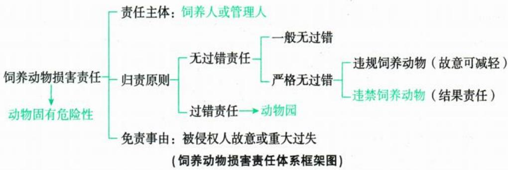

flowchart

```mermaid
graph TD
    A["饲养动物损害责任"] --> B["动物固有危险性"]
    A --> C["免责事由：被侵权人故意或重大过失"]
    C --> D["归责原则"]
    D --> E["无过错责任"]
    D --> F["过错责任 → 动物园"]
    E --> G["一般无过错"]
    E --> H["严格无过错"]
    G --> I["违规饲养动物（故意可减轻）"]
    H --> J["违禁饲养动物（结果责任）"]
```

#### (一) 一般动物

饲养的动物造成他人损害的，动物饲养人或管理人应当承担侵权责任；但是，能够证明损害是因被侵权人故意或重大过失造成的，可以不承担或减轻责任（《民法典》第1245条）。

1. 责任主体。饲养人或管理人。

2. 归责原则。无过错责任原则。

3. 免责事由。

(1) 受害人故意的，侵权人完全免责。

(2) 受害人重大过失的，侵权人可以减轻。

(3) 受害人一般过失的，侵权人不免责。

（4）第三人原因的，形成不真正连带责任。因第三人的过错致使动物造成他人损害的，被侵权人可以向动物饲养人或者管理人请求赔偿，也可以向第三人请求赔偿。动物饲养人或管理人赔偿后，有权向第三人追偿。

[例] 小女孩甲（8岁）与小男孩乙（12岁）放学后常结伴回家。一日，甲对乙讲：“听说我们回家途中的王家昨日买了一条狗，我们能否绕道回家？”乙答：“不要怕！被狗咬了我负责。”后甲和乙路经王家同时被狗咬伤住院。该案应由王家承担全部赔偿责任。

#### (二)遗弃、逃逸的动物

遗弃、逃逸的动物在遗弃、逃逸期间造成他人损害的，由动物原饲养人或管理人承担侵权责任。

#### (三) 违规饲养动物

违反管理规定，未对动物采取安全措施造成他人损害的，动物饲养人或管理人应当承担侵权责任；但是，能够证明损害是因被侵权人故意造成的，可以减轻责任（《民法典》第1246条）。

#### (四) 违禁饲养动物

禁止饲养的烈性犬等危险动物造成他人损害，动物饲养人或管理人主张不承担责任或减轻责任的，法院不予支持。基于“违法在先”理论，违禁饲养动物造成他人损害属于“结果责任”，即不存在任何免责事由，造成损害即赔偿（《民法典》第1247条和《民法典侵权责任编解释（一）》第23条）。

#### (五) 动物园的动物

动物园的动物造成他人损害的，动物园应当承担侵权责任；但是，能够证明尽到管理职责的，不承担侵权责任。

1. 责任主体。动物园。

2. 归责原则。过错推定责任原则（过错责任原则中的一种类型）。

3. 免责事由。证明尽到管理职责。

[萌主点拨]
饲养动物损害责任

<table><tr><td>动物类型</td><td>责任主体</td><td>归责原则</td><td>免责事由</td></tr><tr><td rowspan="4">一般动物</td><td rowspan="4">饲养人或管理人</td><td rowspan="4">无过错</td><td>受害人故意的,侵权人完全免责</td></tr><tr><td>受害人重大过失的,可以减轻</td></tr><tr><td>受害人一般过失的,不免责</td></tr><tr><td>第三人原因不免责;形成不真正连带责任;承担责任后有追偿权</td></tr><tr><td>遗弃、逃逸</td><td>原饲养人或管理人</td><td>无过错</td><td>受害人故意或重大过失</td></tr><tr><td>违规饲养</td><td>饲养人或管理人</td><td>无过错</td><td>能够证明损害是因被侵权人故意造成的,可以减轻责任</td></tr><tr><td>违禁饲养</td><td>饲养人或管理人</td><td>无过错</td><td>无(“违法在先”理论,结果责任)</td></tr><tr><td>动物园</td><td>动物园</td><td>过错推定</td><td>证明尽到管理职责</td></tr></table>

#### 七、建筑物和物件损害责任①

#### (一) 不动产倒塌、塌陷

建筑物、构筑物或其他设施倒塌、塌陷造成他人损害的，由建设单位与施工单位承担连带责任，但是建设单位与施工单位能够证明不存在质量缺陷的除外。建设单位、施工单位赔偿后，有其他责任人的，有权向其他责任人追偿。因所有人、管理人、使用人或第三人的原因，建筑物、构筑物或其他设施倒塌、塌陷造成他人损害的，由所有人、管理人、使用人或第三人承担侵权责任。

[例] 某公司货车在途经竣工不久的高架桥时，大桥突然坍塌，货车倾覆，司机重伤，货物毁损。该损害应由建设单位和施工单位承担连带责任。

#### （二）不明抛掷物、坠落物

禁止从建筑物中抛掷物品。从建筑物中抛掷物品或从建筑物上坠落的物品造成他人损害的，由侵权人依法承担侵权责任；经调查难以确定具体侵权人的，除能够证明自己不是侵权人的外，由可能加害的建筑物使用人给予补偿。可能加害的建筑物使用人补偿后，有权向侵权人追偿。物业服务企业等建筑物管理人应当采取必要的安全保障措施防止前述规定情形的发生；未采取必要的安全保障措施的，应当依法承担未履行安全保障义务的侵权责任。公安等机关应当依法及时调查，查清责任人（《民法典》第1254条）。

##### [萌主点拨]

高空抛物 VS 共同危险行为

<table><tr><td>项目</td><td>行为实施主体</td><td>具体侵权人是否确定</td><td>责任主体</td><td>免责事由</td></tr><tr><td>高空抛物</td><td>1个行为人实施了侵害行为</td><td>不确定</td><td>由可能加害的建筑物使用人给予补偿</td><td>证明自己不是侵权人</td></tr><tr><td>共同危险行为</td><td>2个以上行为人均实施了侵害行为</td><td>不确定</td><td>无限连带赔偿责任</td><td>指明具体侵权人</td></tr></table>

物业服务企业等建筑物管理人未采取必要的安全保障措施防止从建筑物中抛掷物品或从建筑物上坠落的物品造成他人损害，具体侵权人、物业服务企业等建筑物管理人作为共同被告的，法院应当在判决中明确，未采取必要安全保障措施的物业服务企业等建筑物管理人在法院就具体侵权人的财产依法强制执行后仍不能履行的范围内，承担与其过错相应的补充责任。经公安等机关调查，在民事案件一审法庭辩论终结前仍难以确定具体侵权人的，未采取必要安全保障措施的物业服务企业等建筑物管理人承担与其过错相应的责任。被侵权人其余部分的损害，由可能加害的建筑物使用人给予适当补偿。具体侵权人确定后，已经承担责任的物业服务企业等建筑物管理人、可能加害的建筑物使用人可以向具体侵权人追偿（《民法典侵权责任编解释（一）》第24、25条）。

#### （三）不动产及其搁置物、悬挂物脱落、坠落

建筑物、构筑物或其他设施及其搁置物、悬挂物发生脱落、坠落造成他人损害，所有人、管理人或使用人不能证明自己没有过错的，应当承担侵权责任。所有人、管理人或使用人赔偿后，有其他责任人的，有权向其他责任人追偿（《民法典》第1253条）。

1. 责任主体。所有人、管理人或使用人。
2. 归责原则。过错推定责任原则。
3. 免责事由。证明自己没有过错。

[例] 大华商场委托飞达广告公司制作了一块宣传企业形象的广告牌，并由飞达公司负责安装在商场外墙。某日风大，广告牌被吹落砸伤过路人郑某。经查，广告牌的安装存在质量问题。关于郑某的损害，作为所有人、管理人和使用人的大华商场承担赔偿责任，但其有权向第三人飞达公司追偿。

#### （四）堆放物倒塌、滚落或滑落

堆放物倒塌、滚落或滑落造成他人损害，堆放人不能证明自己没有过错的，应当承担侵权责任。

#### (五) 妨碍通行物

在公共道路上堆放、倾倒、遗撒妨碍通行的物品造成他人损害的，由行为人承担侵权责任。公共道路管理人不能证明已经尽到清理、防护、警示等义务的，应当承担相应的责任。

#### （六）林木损害责任

因林木折断、倾倒或果实坠落等造成他人损害，林木的所有人或管理人不能证明自己没有过错的，应当承担侵权责任。

#### (七) 地面施工侵权

在公共场所或道路上挖掘、修缮安装地下设施等造成他人损害，施工人不能证明已经设置明显标志和采取安全措施的，应当承担侵权责任（《民法典》第1258条）。

1. 责任主体。施工人，即承包人。
2. 归责原则。过错推定责任原则。
3. 免责事由。尽到了法定警示义务，即设置明显标志和采取安全措施。

#### (八) 地下设施侵权

窨井等地下设施造成他人损害，管理人不能证明尽到管理职责的，应当承担侵权责任。

[萌主点拨1]
建筑物和物件损害责任（民事诉讼证明责任）

<table><tr><td>项目</td><td>责任主体</td><td>归责原则</td><td>免责事由</td></tr><tr><td>不动产倒塌、塌陷</td><td>建设单位与施工单位承担连带责任</td><td>无过错</td><td>建设单位与施工单位能够证明不存在质量缺陷;因所有人、管理人、使用人或者第三人的原因,建筑物、构筑物或者其他设施倒塌造成他人损害的,由所有人、管理人、使用人或者第三人承担侵权责任</td></tr><tr><td>不明抛掷物、坠落物</td><td>由可能加害的建筑物使用人给予补偿</td><td>公平补偿规则</td><td>能够证明自己不是侵权人(注意:与共同危险行为的区别)</td></tr><tr><td>不动产及其搁置物、悬挂物脱落、坠落</td><td>所有人、管理人或使用人</td><td>过错推定</td><td>证明自己没有过错(注意:第三人原因不能免责,形成不真正连带责任,承担责任后有追偿权)</td></tr><tr><td>堆放物倒塌、滚落或滑落</td><td>堆放人</td><td>过错推定</td><td>证明自己没有过错</td></tr><tr><td>妨碍通行物</td><td>行为人、管理人</td><td>过错推定</td><td>证明自己没有过错</td></tr><tr><td>林木折断、倾倒或果实坠落</td><td>所有人或管理人</td><td>过错推定</td><td>证明自己没有过错</td></tr><tr><td>地面施工侵权</td><td>施工人(承包人)</td><td>过错推定</td><td>尽到法定警示义务(已经设置明显标志和采取安全措施)</td></tr><tr><td>地下设施侵权</td><td>管理人</td><td>过错推定</td><td>尽到管理职责</td></tr></table>

[萌主点拨2]
典型侵权责任考点汇总

<table><tr><td>项目</td><td>产品责任</td><td>机动车交通事故责任</td><td>医疗损害责任</td><td>环境污染责任</td><td>违规饲养动物</td><td>高空抛物</td></tr><tr><td>责任主体</td><td>生产者、销售者</td><td>使用人</td><td>医疗机构</td><td>污染者</td><td>饲养人、管理人</td><td>可能加害建筑物使用人连带</td></tr><tr><td>归责原则</td><td>无过错(对外)</td><td>无过错(机VS非机)</td><td>过错</td><td>无过错</td><td>无过错</td><td>公平补偿规则</td></tr><tr><td>免责事由</td><td>生产者免责事由:1.未将产品投入流通的;2.产品投入流通时,引起损害的缺陷尚不存在的;3.将产品投入流通时的科学技术水平尚不能发现缺陷的存在 的</td><td>证明受害人有过错</td><td>证明自己没有过错:1.患者或其近亲属不配合医疗机构进行符合诊疗规范的诊疗;2.医务人员在抢救生命垂危的患者等紧急情况下已尽到合理诊疗义务;3.限于当时的医疗水平难以诊疗</td><td>不可抗力和受害人故意</td><td>受害人故意可以减轻</td><td>证明自己不是侵权人</td></tr></table>

百度网盘扫码加好友
获取后续完整极速更新

text_image

QR code image containing encoded data, no visible human-readable text

PART

# 第九部分

#### 民法的概述

IX

#### 48

## 专题四十八

#### 民法的基本原则

#### 复习提要

民法的基本原则规定在《民法典》总则编第一章基本规定（第3—9条），共7条。本专题主要涉及七个问题：1. 民事权益受法律保护原则；2. 平等原则；3. 自愿原则；4. 公平原则；5. 诚信原则；6. 合法和公序良俗原则；7. 绿色原则。考查4次，属于常考点，抓住重点。

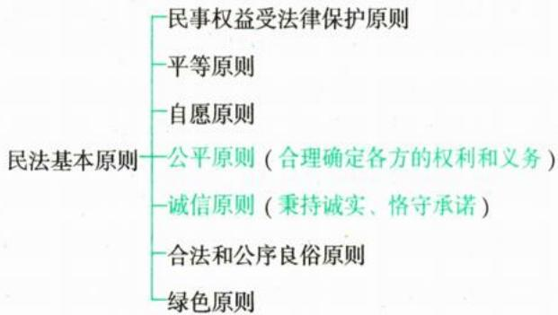

flowchart

```mermaid
graph TD
    A["民法基本原则"] --> B["民事权益受法律保护原则"]
    A --> C["平等原则"]
    A --> D["自愿原则"]
    A --> E["公平原则（合理确定各方的权利和义务）"]
    A --> F["诚信原则（秉持诚实、恪守承诺）"]
    A --> G["合法和公序良俗原则"]
    A --> H["绿色原则"]
```

民法的基本原则，是指效力贯穿于民法始终的基本准则，是对民事立法、民事司法和民事法律行为具有普遍指导意义的基本准则，具有指导、约束和补充功能。

#### 一、民事权益受法律保护原则

民法是以权利为核心的部门法，民事权利的保护范围和力度决定了民事主体在市民社会中能否充分按照自己的意志自由行事。因此，民事权利的法律保护可以视为民法的核心，民法也可以视为民事权利保护法。民事权利具有开放性、包容性和概括性（既包括法定权利也包括意定权利），凡是民事领域的权利、利益皆受民法保护。民事主体的人身权利、财产权利以及其他合法权益受法律保护，任何组织或个人不得侵犯。

#### 二、平等原则

平等原则，是指民事主体，不论是自然人、法人还是非法人组织，不论自然人是男、女、老、少、贫、富，不论法人规模大小、经济实力雄厚与否，不论非法人组织经营什么业务，在从事民事活动时，他们相互之间在法律地位上都是平等的，他们的合法权益受到法律的平等保护。

#### (一) 形式意义上的平等

形式意义上的平等（机会平等）为近代民法所推崇，强调相同或类似情况相同或类似处理（对待）。体现在四个层面：

1. 法律地位一律平等，适用同一法律①（《民法典》第4条）。

2. 自然人的民事权利能力一律平等（《民法典》第14条）。

3. 民事主体在民事法律关系中须平等协商，不能强迫或不当干涉当事人的意思自治。

4. 法律保护一律平等。民事主体的财产权利受法律平等保护（《民法典》第113条）。同时，国家、集体、私人的物权和其他权利人的物权受法律平等保护，任何组织或个人不得侵犯（《民法典》第207条）。

#### (二) 实质意义上的平等

实质意义上的平等（结果平等）为现代民法所推崇。实质意义上的平等，是指按照一定标准对民事主体进行区分，强调不同情况不同处理（对待）。法律对未成年人、老年人、残疾人、妇女、消费者等的民事权利保护有特别规定的，依照其规定（《民法典》第128条）。

实质意义上的平等体现在：

1. 婚姻关系中女方特殊保护。

女方在怀孕期间、分娩后1年内或终止妊娠后6个月内，男方不得提出离婚；但是，女方提出离婚或法院认为确有必要受理男方离婚请求的除外（《民法典》第1082条）。

2. 遗产分配中的特殊继承人特殊保护。

同一顺序继承人继承遗产的份额，一般应当均等。对生活有特殊困难又缺乏劳动能力的继承人，分配遗产时，应当予以照顾。对被继承人尽了主要扶养义务或与被继承人共同生活的继承人，分配遗产时，可以多分。有扶养能力和有扶养条件的继承人，不尽扶养义务的，分配遗产时，应当不分或少分。继承人协商同意的，也可以不均等（《民法典》第1130条）。

[萌主点拨] 剥夺平等参与民事法律关系的机会、没有正当法律依据的区别对待则是对平等原则的违反。

#### 三、自愿原则

自愿原则，又称意思自治原则（私法自治原则），是指民事主体从事民事活动时，在法律允许的范围内自由表达自己的意愿，并按其意思设立、变更、终止民事法律关系的原则（保障功能/《民法典》第5条）。自愿原则是民法最为核心、最具代表性的基本原则，体现了民事活动最基本的特征。

自愿原则，主要体现在三个方面：

1. 不得强买强卖。

国家根据抢险救灾、疫情防控或其他需要下达国家订货任务、指令性任务的，有关民事主体之间应当依照有关法律、行政法规规定的权利和义务订立合同。依照法律、行政法规的规定负有发出要约义务的当事人，应当及时发出合理的要约。依照法律、行政法规的规定负有作出承诺义务的当事人，不得拒绝对方合理的订立合同要求。

#### 2. 虚假的意思表示。

虚假的意思表示为何被认定为无效，原因在于这一“意思表示”所指向的法律效果并非双方当事人的内心真意，双方对此相互知晓，如果认定其为有效，有悖于意思自治原则。

3. 对自己自愿表达的真实意思负责（自己行为自己责任）。

#### 四、公平原则

公平原则，是指民事主体从事民事活动时要秉持公平理念，公正、平允、合理地确定各方的权利和义务，并依法承担相应的民事责任（矫正功能/《民法典》第6条）。公平原则是自愿原则的必要补充。公平正义是人类共同追求的基本价值，也是法律追求的基本价值。

公平原则，主要体现在如下五个方面：

#### 1. 车位置换案。

[例] 孟某以 20 万元从众森公司购得幸福小区地下停车位。众森公司经规划部门批准在该小区以 200 万元建设观光电梯。该电梯的入梯口占用了孟某的停车位，众森公司同意为孟某置换更好的车位。孟某则要求拆除电梯，并赔偿损失。众森公司的行为符合公平原则的要求。

#### 2. 显失公平案。

[例] 众森公司在城市公园旁开发预售期房，孟某、徐某等近百人一次性支付了购房款，总额近8000万元。但众森公司迟迟未开工，按期交房无望。孟某、徐某等购房人多次集体去众森公司交涉无果，险些引发群体性事件。面对疯涨房价，孟某、徐某等购房人为另行购房，无奈与众森公司签订《退款协议书》，承诺放弃数额巨大利息、违约金的支付要求，领回原购房款。《退款协议书》的订立显失公平，为保护购房人的利益，法院应当依据购房人的请求撤销该协议，由众森公司支付利息和违约金。

#### 3. 格式条款提供方的提示和说明义务。

格式条款双方当事人天然处于不平等地位，处于优势一方的格式条款提供方在预先拟定合同时，必须合理确定双方的权利和义务，同时，必须履行法律规定的提示和说明义务。该规定系公平原则的体现。

#### 4. 情势变更。

2019 年底，世界各地陆续暴发新冠肺炎疫情，因新冠肺炎疫情导致合同继续履行纠纷，人民法院或仲裁机构可以依据情势变更制度变更或解除合同。

#### 5. 公平补偿规则。

高空抛物案件中，如不能查明具体侵权人的，由可能加害的建筑物使用人和受害人分担损失，系公平补偿规则的集中体现。

#### 五、诚信原则

诚信原则，又称诚实信用原则，是指民事主体从事民事活动时，应当诚实守信，正当行使民事权利并履行民事义务，不实施欺诈和规避法律的行为，在不损害他人利益和社会利益的前提下追求自己的利益（《民法典》第7条）。

诚信原则是市场经济活动中一项基本道德准则，具有伦理价值。作为民法最为重要的基本原则，被称为现代民法的“帝王条款”，是各国民法公认的基本原则。

#### 1. 欠款偿还案。

[例] 孟某从银行贷得80万元用于购买房屋，并以该房屋设定了抵押。在借款期间房屋被洪水冲毁。孟某尽管生活艰难，仍想方设法还清了银行贷款。孟某与银行的贷款合同并未因房屋被冲毁而消灭。坚持还贷是严守合约、诚实信用。

#### 2. 权利滥用案。

[例] 孟某、马某二人同村，宅基地毗邻。孟某的宅基地倚山、地势较低，马某的宅基地在上将其环绕。马某因琐事与孟某多次争吵而郁闷难解，便沿二人宅基地的边界线靠己方一侧，建起高5米围墙，使孟某在自家院内却有身处监牢之感。马某的行为违背了民法的诚信原则。

#### 3. 法人人格否认制度（《民法典》第83条）。

法人的投资人受到“有限责任”的优待，如滥用该权利，恶意投资人需承担无限连带责任。

#### 4. 附条件民事法律行为中的拟制效力。

当事人为自己的利益不正当地阻止或促成条件成就的，系不诚信的表现。因此，要对其进行不利的法律拟制。

附条件的民事法律行为，当事人为自己的利益不正当地阻止条件成就的，视为条件已经成就；不正当地促成条件成就的，视为条件不成就。

#### 5. 流押（质）条款。

借款期限届满前，债权人处于优势地位。如债权人滥用其优势地位，剥夺标的物的市场定价权，在抵押合同或质押合同中约定，标的物直接归其所有的。该条款将获得法律的否定性评价，即无效。

#### 6. 缔约过失责任和违约责任。

从双方当事人开始磋商到整个合同履行完毕，无论是先合同义务、合同义务抑或后合同义务，均应遵循诚信原则。违反诚信原则者，或承担缔约过失责任，或承担违约责任。

#### 7. 合同的履行原则。

当事人应当遵循诚信原则，根据合同的性质、目的和交易习惯履行通知、协助、保密等义务。

[例] 甲、乙双方连续几年订有买卖“交流电机”的合同。有一次签订合同时，在“标的物”一栏只写了“电机”两字。当时正值交流电机热销，而甲方供不应求，故甲方就以直流电机交货。就民法的基本原则而言，甲方违反了诚信原则。

#### 8. 后合同义务。

债权债务终止后，当事人应当遵循诚信等原则，根据交易习惯履行通知、协助、保密、旧物回收等义务。

#### 六、合法和公序良俗原则

#### （一）合法原则

合法原则，是指民事主体从事民事活动不得违反法律的强制性规定。任何人的自由并非毫无限制，民法需要维护社会基本的生产、生活秩序，需要维护国家的基本价值追求，法律的强制性规范就是为了实现这一目的而制定的，民事主体在从事民事活动时，应当遵守法律的强制性规定。

#### (二) 公序良俗原则

公序良俗原则，是指民事主体从事民事活动不得违背公共秩序和善良风俗。

从国家的角度而言，公共秩序，是指政治、经济、文化等领域的基本秩序和根本理念，是与国家和社会整体利益相关的基本性原则、价值和秩序。从社会的角度而言，善良风俗，是指一国或地区一定时间内占主导地位的一般道德观念和伦理要求。公序良俗原则要求民事主体不得跨越最基本的道德底线，否则，将被认定为无效的民事法律行为，即以禁止性规定在保障。

#### 七、绿色原则

民事主体从事民事活动，应当有利于节约资源、保护生态环境（《民法典》第9条）。绿色原则是贯彻宪法关于保护环境的要求，同时也是落实党中央关于建设生态文明、实现可持续发展理念的要求，将环境资源保护上升至民法基本原则的地位，具有鲜明的时代特征，将全面开启环境资源保护的民法通道，有利于构建生态时代下人与自然的新型关系，顺应绿色立法潮流。

#### 1. 业主权利的行使。

业主应当遵守法律、法规以及管理规约，相关行为应当符合节约资源、保护生态环境的要求。对于物业服务企业或者其他管理人执行政府依法实施的应急处置措施和其他管理措施，业主应当依法予以配合。

#### 2. 用益物权人的权利行使。

用益物权人行使权利，应当遵守法律有关保护和合理开发利用资源、保护生态环境的规定。所有权人不得干涉用益物权人行使权利。

设立建设用地使用权，应当符合节约资源、保护生态环境的要求，遵守法律、行政法规关于土地用途的规定，不得损害已经设立的用益物权。

#### 3. 合同履行的原则。

当事人在履行合同过程中，应当避免浪费资源、污染环境和破坏生态。

#### 4. 旧物回收义务。

依照法律、行政法规的规定或按照当事人的约定，标的物在有效使用年限届满后应予回收的，出卖人负有自行或委托第三人对标的物予以回收的义务。

#### 5. 环境污染和生态破坏责任。

违反国家规定造成生态环境损害，生态环境能够修复的，国家规定的机关或法律规定的组织有权请求侵权人在合理期限内承担修复责任。侵权人在期限内未修复的，国家规定的机关或法律规定的组织可以自行或委托他人进行修复，所需费用由侵权人负担。

[例] 2006 年，知名导演孟某在拍摄《我的法考之路》电影时在云南香格里拉风景区大肆破坏，将美不胜收的人间仙境碧沽天池“毁容”。孟某的行为违反了绿色原则。

## 49 专题四十九 民事权利

#### 复习提要

民事权利，规定在《民法典》总则编第五章（第109—132条），共24条。本专题主要涉及三个问题：1. 民事权利的法定分类；2. 民事权利的学理分类；3. 民事权利的行使和限制。其中，民事权利的学理分类是考试的重点，在备考过程中必须重点掌握。

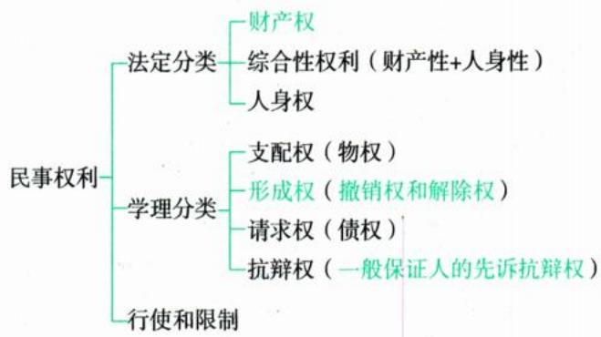

flowchart

```mermaid
graph TD
    A["民事权利"] --> B["法定分类"]
    A --> C["学理分类"]
    A --> D["行使和限制"]
    
    B --> B1["财产权"]
    B --> B2["综合性权利（财产性+人身性）"]
    B --> B3["人身权"]
    
    C --> C1["支配权（物权）"]
    C --> C2["形成权（撤销权和解除权）"]
    C --> C3["请求权（债权）"]
    C --> C4["抗辩权（一般保证人的先诉抗辩权）"]
```

#### 一、民事权利的法定分类①

民法是实体法、私法、权利法，民法体系的构建以民事权利为逻辑起点和核心。民事权利，是指民事主体为实现某种利益而依法为或不为某种行为的自由。

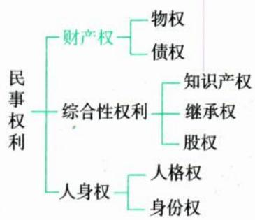

flowchart

```mermaid
graph TD
    A["民事权利"] --> B["财产权"]
    A --> C["综合性权利"]
    A --> D["人身权"]
    B --> E["物权"]
    B --> F["债权"]
    C --> G["知识产权"]
    C --> H["继承权"]
    C --> I["股权"]
    D --> J["人格权"]
    D --> K["身份权"]
```

(民事权利的法定分类体系框架图)

#### 二、民事权利的学理分类①

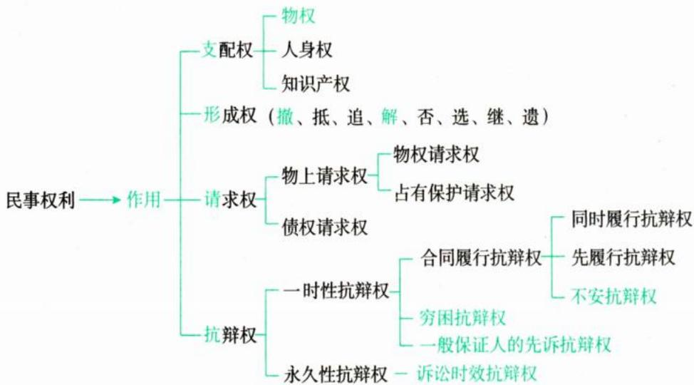

flowchart

```mermaid
graph TD
    A["民事权利"] --> B["作用"]
    B --> C["支配权"]
    C --> D["物权"]
    C --> E["人身权"]
    C --> F["知识产权"]
    B --> G["形成权（撤、抵、追、解、否、选、继、遗）"]
    B --> H["请求权"]
    H --> I["物上请求权"]
    H --> J["债权请求权"]
    I --> K["物权请求权"]
    I --> L["占有保护请求权"]
    H --> M["抗辩权"]
    M --> N["一时性抗辩权"]
    M --> O["永久性抗辩权"]
    N --> P["合同履行抗辩权"]
    N --> Q["穷困抗辩权"]
    N --> R["一般保证人的先诉抗辩权"]
    N --> S["诉讼时效抗辩权"]
    P --> T["同时履行抗辩权"]
    P --> U["先履行抗辩权"]
    P --> V["不安抗辩权"]
```

(民事权利的学理分类体系框架图)

#### (一) 支配权

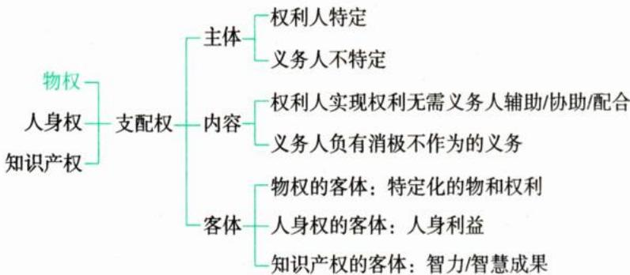

flowchart

```mermaid
graph TD
    A["物权"] --> B["支配权"]
    C["人身权"] --> B
    D["知识产权"] --> B
    B --> E["主体"]
    E --> F["权利人特定"]
    E --> G["义务人不特定"]
    B --> H["内容"]
    H --> I["权利人实现权利无需义务人辅助/协助/配合"]
    H --> J["义务人负有消极不作为的义务"]
    B --> K["客体"]
    K --> L["物权的客体：特定化的物和权利"]
    K --> M["人身权的客体：人身利益"]
    K --> N["知识产权的客体：智力/智慧成果"]
```

(支配权体系框架图)

#### 1. 含义。

支配权，又称管领权，是指对权利的客体直接支配并排除他人干涉的权利。支配权的基本框架系以“物权”为模型建立。因此，支配权的属性基本来源于“物权”。

#### 2. 种类。

依客体的不同，典型的支配权主要包括三项，分别是：

(1) 对物的支配，即物权。
(2) 对人身利益的支配，即人身权。
(3) 对无形财产（智力/智慧成果）的支配，即知识产权。

#### 3. 特征。

(1) 对世性。权利主体特定而义务主体不特定。

（2）特定性。客体是特定化的财产、人身利益和无形财产。支配权的客体只能是物的说法是错误的。

(3) 直接性。权利的行使和实现无需义务人的积极作为（协助/配合/介入），义务人只负有消极不作为义务，即不得实施任何妨碍权利人行使和实现权利的行为。支配权也存在对应的义务。一般而言，当事人一方享有权利，另一方必然负有相应义务，权利和义务往往同时产生、变更和消灭。权利和义务互相依存，离开民事义务就无所谓民事权利，权利内容要通过相应义务表现，义务内容则由相应权利限定。

（4）排他性。权利人对权利标的物的直接支配具有排他性，不容在同一标的物上设定不相容的第二个权利。

#### (二) 形成权 $^{①}$

#### 1. 含义。

形成权，又称“变动权或能为权”，被誉为“法学上之发现”，是指依权利人单方（一方）意思表示而使民事法律关系产生、变更或消灭（即“私法效果”）的权利。

[萌主点拨] 形成权不存在对应的义务。

#### 2. 产生。

形成权的产生既可以由当事人约定，也可以由法律规定。

#### (1) 当事人约定。

[例] 孟某将自己的手表出卖给马某，双方约定，第2天上午9点，一手交钱一手交手表。如孟某不履行合同，马某有权解除合同并追究孟某的违约责任。此时，马某享有的解除权属于典型的形成权，该解除权是基于买卖合同的约定而产生的。据此可知，形成权可以由当事人约定产生。

#### (2) 法律规定。

[例] 孟某将一块欧米茄手表冒充（欺诈）江诗丹顿手表卖给了马某。因孟某实施欺诈行为，法律赋予了受欺诈方马某以撤销权，该撤销权属于典型的形成权。据此可知，形成权可以由法律规定产生。

#### 3. 行使。

#### (1) 明示和默示。

形成权的行使可以明示、也可以默示。默示，包括积极默示（行为）和消极默示（沉默）。

#### (2) 简单形成权和形成诉权。

依据形成权的行使是否需要特定形式的不同，将形成权分为两类，即简单形成权和形成诉权。

简单形成权，又称单纯形成权，是指由权利人单方意思表示即可发生效力，无须诉讼或仲裁方式行使为必要的形成权。简单形成权的情形仅需要“事实判断”，无需法官或仲裁员等专业法律人判断即可完成。因此，“通知”即可，如解除权。

形成诉权，是指以诉讼或仲裁方式行使为必要，且效力在相关判决或裁决确定后才发生的形成权。形成诉权的情形需要“价值判断”，需要法官或仲裁员等专业法律人判断。因此，需要诉讼或仲裁（或诉或裁）。可撤销的民事法律行为的撤销权（因重大误解、欺诈、胁迫和显失公平而引发）属于典型的形成诉权。

#### 4. 典型的形成权。

在考试范围内，典型的形成权共9类，即“撤、抵、追、解、否、选、继、遗”。

（1）“撤”代表两类撤销权，即效力待定的民事法律行为中善意相对人的撤销权和可撤销的民事法律行为的撤销权。
(2) “抵”代表法定抵销权。
(3) “追”代表效力待定的民事法律行为中法定代理人或被代理人的追认权。
(4) “解”代表解除权（如上述孟某和马某手表买卖合同中马某基于合同享有的解除权）。
(5) “否”代表效力待定的民事法律行为中法定代理人或被代理人的否认权。
(6) “选”代表选择权（如选择之债的选择权、试用买卖合同中试用人的选择权和隐名的间接代理中相对人的选择权）。
(7) “继”代表继承人沉默接受继承。
(8) “遗”代表受遗赠人沉默放弃受遗赠。

#### 5. 期间限制。

形成权具有权利行使的单方性和无需他人协助性，从形成权具有特定的相对方角度分析，其积极行使与否影响交易秩序的稳定，其应当受除斥期间而非诉讼时效的限制。

[萌主点拨] 形成权受除斥期间限制（除斥期间，是指法律规定或当事人约定的某种权利预定的存续期间），但受除斥期间限制的不一定是形成权。

#### (三) 请求权

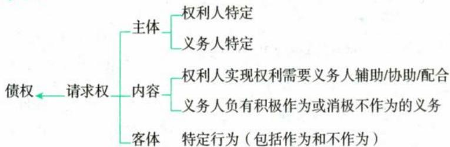

flowchart

```mermaid
graph TD
    A["债权"] --> B["请求权"]
    B --> C["主体"]
    C --> D["权利人特定"]
    C --> E["义务人特定"]
    B --> F["内容"]
    F --> G["权利人实现权利需要义务人辅助/协助/配合"]
    F --> H["义务人负有积极作为或消极不作为的义务"]
    B --> I["客体"]
    I --> J["特定行为（包括作为和不作为）"]
```

(请求权体系框架图)

#### 1. 含义。

请求权，是指特定的权利人请求特定的义务人为或不为特定行为的权利。请求权的基本框架系以“债权”为模型建立，权利救济时的请求权基础思维亦是以“债权”为核心。

#### 2. 特征。

（1）相对性（权利人与义务人均特定，效力仅及于当事人之间），权利人实现其权利需要具体特定人协助。
(2) 客体为特定行为，包括作为和不作为（如竞业禁止协议）。
（3）非公示性。请求权仅涉及特定当事人之间的利益，而与不特定的第三人以及交易秩序和交易安全无涉。因此，无需公示，具有非公示性。

#### 3. 发生（以债权请求权为例）。

请求权既可以基于基础权利受侵害而发生，亦可以基于基础权利未受侵害而发生。基于基础权利（原权）受侵害而发生的，如侵权之债；基于基础权利（原权）未受侵害而发生，如合同之债。

##### [萌主点拨]

物权 VS 债权

<table><tr><td>项目</td><td>物权</td><td>债权</td></tr><tr><td>财产状态</td><td>静态(财产的归属和利用/支配关系)</td><td>动态(财产的流转关系)</td></tr><tr><td>含义</td><td>特定的权利人依法对特定的物所享有的直接支配并排除他人干涉的权利</td><td>特定人请求特定人为或不为特定行为的权利</td></tr><tr><td>效力范围</td><td>效力及于所有人,权利人以外的任何人均属于义务人,义务主体是不特定的人(绝对权/对世权)</td><td>效力仅及于特定人,以特定人为义务人,义务主体是特定的人(相对权/对人权)</td></tr><tr><td>客体</td><td>特定化的物和权利(如权利质权、建设用地使用权的抵押权和土地经营权的抵押权)</td><td>特定行为(包括作为和不作为;不作为者,如竞业禁止协议)</td></tr><tr><td>权利性质</td><td>支配权</td><td>请求权</td></tr><tr><td>效力</td><td>追及(例外:善意取得)、优先和排他效力</td><td>相容性、平等性(注意:一物数卖)和相对性</td></tr><tr><td>是否需要公示</td><td>需要(因与社会公益有重大之利害关系)</td><td>不需要(非公示性)</td></tr><tr><td>立法模式</td><td>物权法定,强制性规范(种类+内容)</td><td>债权自由,任意性规范(私法自治/意思自治)</td></tr><tr><td>权能</td><td>占有、使用、收益和处分</td><td>请求力、执行力、私力实现力、处分力和保持力</td></tr><tr><td>特点</td><td>民族性</td><td>国际性</td></tr></table>

#### (四) 抗辩权

#### 1. 含义。

抗辩权，是指一时或永久对抗对方请求权的权利。

##### [萌主点拨]

请求权 VS 抗辩权

<table><tr><td>项目</td><td>作用</td><td>形象表达</td></tr><tr><td>请求权</td><td>攻击性权利</td><td>矛</td></tr><tr><td>抗辩权</td><td>防御性权利</td><td>盾</td></tr></table>

2. 种类。

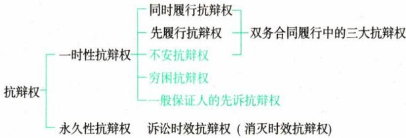

flowchart

```mermaid
graph TD
    A["抗辩权"] --> B["一时性抗辩权"]
    A --> C["永久性抗辩权"]
    B --> D["同时履行抗辩权"]
    B --> E["先履行抗辩权"]
    B --> F["不安抗辩权"]
    B --> G["穷困抗辩权"]
    B --> H["一般保证人的先诉抗辩权"]
    D --> I["双务合同履行中的三大抗辩权"]
    E --> I
    F --> I
    G --> I
    H --> I
    C --> J["诉讼时效抗辩权（消灭时效抗辩权）"]
```

(抗辩权的体系示意图)

抗辩权的概念以及各种实体法上的抗辩权的类型主要形成于德国。抗辩权有广义和狭义之分，广义上的抗辩权是妨碍他人行使其权利、提出免除或减轻其民事责任主张的对抗权。狭义的抗辩权则是指专门对抗请求权的权利。法考范围内的抗辩权，系狭义的抗辩权。依其效力的强度（作用）的不同，抗辩权包括两类，即一时性抗辩权和永久性抗辩权。

(1) 一时性抗辩权。

一时性抗辩权，又称延期性抗辩权、延缓性抗辩权，是指抗辩权的行使可以暂时地拒绝相对人的请求权效力。通说认为包括双务合同（主要是买卖合同）履行中的三大抗辩权、穷困抗辩权和一般保证人的先诉抗辩权。

(2) 永久性抗辩权。

永久性抗辩权，是指可以永远拒绝相对人的请求权的抗辩权。一般认为，诉讼时效抗辩权，又称“消灭时效抗辩权”为典型的永久性抗辩权。

3. 特征。

(1) 抗辩权以请求权的行使且承认对方有请求权为前提。

(2) 抗辩权的行使有期间限制。

（3）抗辩权行使与否，完全由当事人自己决定，不主张视为放弃；法院一般不得依其职权主动审查，也不得主动释明。如诉讼时效抗辩权（《民法典》第193条）。

#### 三、民事权利的行使和限制①

#### (一) 含义

民事权利的行使，是指民事权利内容的实现。

#### (二) 原则

1. 自愿原则。

民事主体按照自己的意愿依法行使民事权利，不受干涉。作为私权的民事权利，遵循“法无禁止即自由”的原则，即自愿原则（意思自治原则）。

2. 权利和义务相统一原则。

民事主体行使权利时，应当履行法律规定的和当事人约定的义务。

#### (三) 方法

#### 1. 事实行为的方法。

民事权利的行使可以采用事实行为方法，即不以意思表示为要素，以事实行为的方法行使民事权利，如占有或消费所有物。

[例] 孟某从北京市海淀区一家沃尔玛超市购买旺仔牛奶1罐。吃早餐时，孟某将该罐旺仔牛奶喝掉。此时，孟某即以事实行为的方法（消费）行使了对牛奶的所有权。

#### 2. 民事法律行为的方法。

民事权利的行使可以采用民事法律行为方法，即以意思表示为要素，以民事法律行为的方法行使民事权利，如出卖或赠与所有物。

[例] 孟某从北京市海淀区一家沃尔玛超市购买旺仔牛奶1罐。吃早餐时，孟某将该罐旺仔牛奶送给自己的好友马某。此时，孟某即以民事法律行为的方法（赠与合同）行使了对牛奶的所有权。

[萌主点拨] 民事权利的行使不都是事实行为。

#### (四) 限制

民事权利的行使，以鼓励和维护为原则，以限制或否定为例外。私权行使自由固然是居于核心地位的基本原则，但是，基于私权的社会化和公共性，对私权的行使进行必要的限制，亦属正当、合法。

私权为法律所赋予，具有一定的社会功能，是社会秩序的一部分。私权的行使，不仅关涉权利人自身的利益，也关涉义务人的利益以及国家利益和社会公共利益。权利人所享有的民事权利并不是绝对的、不受限制的。相反，现代民法对于民事权利的内容和行使逐渐设置了越来越多的限制。凡权利者皆应受限制，无不受限制的权利。一般而言，民事权利的限制主要体现在如下五个方面：

1. 国家法律的限制。如土地所有权不得转让、宅基地使用权不得抵押（否则，抵押合同无效）等。
2. 社会公共利益的限制。如征收和征用。
3. 他人权利的限制。如相邻关系。
4. 符合诚信原则，不得以违背公序良俗的方式滥用民事权利损害国家利益、社会公共利益或他人合法权益。

《民法典》第132条和《民法典总则编解释》第3条共2条确立了禁止权利滥用的基本规则。禁止权利滥用，本质上是法律对私权行使的一种限制，体现了法律追求“矫正正义”和“分配正义”的目标。

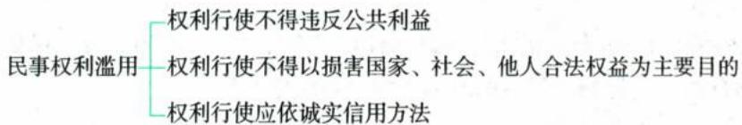

flowchart

```mermaid
graph TD
    A["民事权利滥用"] --> B["权利行使不得违反公共利益"]
    A --> C["权利行使不得以损害国家、社会、他人合法权益为主要目的"]
    A --> D["权利行使应依诚实信用方法"]
```

(民事权利滥用体系框架图)

5. 可能受到期间的限制。如形成权受除斥期间限制、债权请求权原则上受诉讼时效期间限制。

##### [萌主点拨]

诉讼时效期间 VS 除斥期间

<table><tr><td>项目</td><td>诉讼时效期间</td><td>除斥期间</td></tr><tr><td>含义</td><td>权利人不行使权利,经过法定期间,使债务人取得拒绝履行抗辩权的法律效果的制度</td><td>法律规定或当事人约定的某种权利预定的存续期间</td></tr><tr><td>适用范围</td><td>请求权(债权请求权和物权请求权)</td><td>形成权(如撤销权和解除权)</td></tr><tr><td>法律效果</td><td>债务人产生永久性抗辩权</td><td>实体权利消灭</td></tr><tr><td>是否可变</td><td>最长诉讼时效外,均为可变期间</td><td>不变期间</td></tr><tr><td>可否主动适用</td><td>法院不得主动释明亦不得主动适用</td><td>法院可以依职权予以审查</td></tr><tr><td>起算点</td><td>除最长诉讼时效外,均自权利人知道或应当知道权利受到损害以及义务人之日起计算</td><td>除法律另有规定外,原则上自权利人知道或应当知道权利产生之日起计算</td></tr><tr><td>产生依据</td><td>法定</td><td>法定或约定</td></tr></table>